# Course 1: Neural Networks and Deep Learning

> ML Specialization을 이미 들은 사람 기준 노트다. 선형/로지스틱 회귀, 기본 신경망 개념, TensorFlow 기초, 결정 트리, K-means는 안다고 가정하고, 딥러닝 코스에서 "새로 각 잡고 다시 배우는" 부분 — 특히 표기법(notation)과 벡터화(vectorization), 역전파(backpropagation)를 수식으로 유도하는 부분 — 위주로 정리한다. 미적분을 몰라도 괜찮다. Andrew Ng도 강의에서 계속 얘기하지만, 미분의 정확한 증명보다 "이게 왜 이렇게 움직이는지"에 대한 직관이 훨씬 중요하다.
>
> **읽는 법**: 이 노트만 읽어도 강의 내용을 이해할 수 있게 쓰는 것이 목표다. 개념마다 "무슨 문제를 풀려는 건지 → 어떻게 동작하는지 → 왜 그렇게 되는지"를 설명하고, 수식은 이해에 꼭 필요한 곳(특히 역전파)만 유도한다. 수식이 안 읽히면 옆의 숫자 예시부터 보고 다시 올라가자.

---

## Week 1. 딥러닝이 왜 지금 뜨는가

### 신경망이 뭔가 — 집값 예측으로 보는 최소 예시

**뉴런(neuron) 하나 = "숫자 몇 개를 받아서 → 가중합을 내고 → 정해진 함수에 통과시켜 → 숫자 하나를 내놓는 작은 계산기"**다. 신경망은 이 계산기를 여러 개 이어 붙인 것뿐이다. 이 뉴런 하나가 뭘 하는지부터 보자.

강의 첫 예시. 집 크기 $x$로 가격 $y$를 예측하는데, 가격은 음수가 될 수 없으니 "0 아래로는 안 내려가는 직선"을 긋는다 — 이 모양이 바로 **ReLU**(Rectified Linear Unit, $\max(0, z)$)다. 이게 뉴런 하나.

- 여기서 $x$ = 입력(집 크기), $y$ = 정답(실제 가격), $z$ = 뉴런이 계산한 가중합(입력 × 가중치 + bias, 아래 숫자 예시의 $0.5x - 20$), $\max(0, z)$ = "$0$과 $z$ 중 큰 쪽" → $z$가 음수면 0, 양수면 $z$ 그대로.
- 이름 뜻: **Linear Unit** = 직선을 그리는 계산 단위, **Rectified**(정류된) = 전기에서 "음(-) 방향 전류를 잘라낸다"는 말을 빌려온 것 — 음수 부분을 0으로 잘라낸 직선이라는 뜻이다.

숫자로 보면: 뉴런이 $\hat y = \max(0,\ 0.5x - 20)$을 계산한다고 치자 ($\hat y$ "와이 햇" = 모델의 **예측값**. 모자(hat) 표시는 통계에서 "진짜 값 $y$의 추정치"라는 관례다). 크기 $x = 100$이면 $0.5 \times 100 - 20 = 30$ → 그대로 30. $x = 30$이면 $0.5 \times 30 - 20 = -5$ → 음수니까 0으로 잘라서 0. 여기서 $0.5$(가중치, weight)와 $-20$(bias)은 사람이 정하는 게 아니라 **데이터를 보고 학습으로 찾아내는 값**이고, "음수면 0으로 자르기"가 activation function(ReLU)이다. **activation function**(활성화 함수)이라는 이름은 생물 뉴런이 입력을 받아 "켜지는(활성화되는) 정도"를 정한다는 비유에서 왔다 — 가중합 $z$를 받아 뉴런의 최종 출력으로 바꿔주는 함수다. **weight**(가중치)는 "각 입력을 얼마나 중요하게 볼지"를 곱하는 계수, **bias**(편향)는 입력과 상관없이 더해지는 상수(직선의 절편)다. 이 구조(가중합 → activation)가 앞으로 이 코스 전체에서 반복된다.

feature(입력 특성 — 예측에 쓰는 입력 항목 하나하나)가 여러 개(크기, 방 개수, 우편번호, 동네 부유도)면 뉴런들을 쌓는다. 사람이 설계하면 "크기+방 개수 → 수용 가능 가족 수", "우편번호 → 도보 접근성", "우편번호+부유도 → 학군" 같은 중간 개념을 만들고 이걸로 가격을 예측할 텐데, 신경망은 **이 중간 개념(hidden unit)을 스스로 학습**한다. 우리는 입력 $x$와 정답 $y$만 주고, 가운데 layer가 무엇을 표현할지는 정해주지 않는다 — 그래서 "hidden"이다. 또 입력 feature 전부를 hidden unit 전부에 연결한다(densely connected) — "이 unit은 우편번호만 봐라" 같은 건 네트워크가 weight로 알아서 정한다.

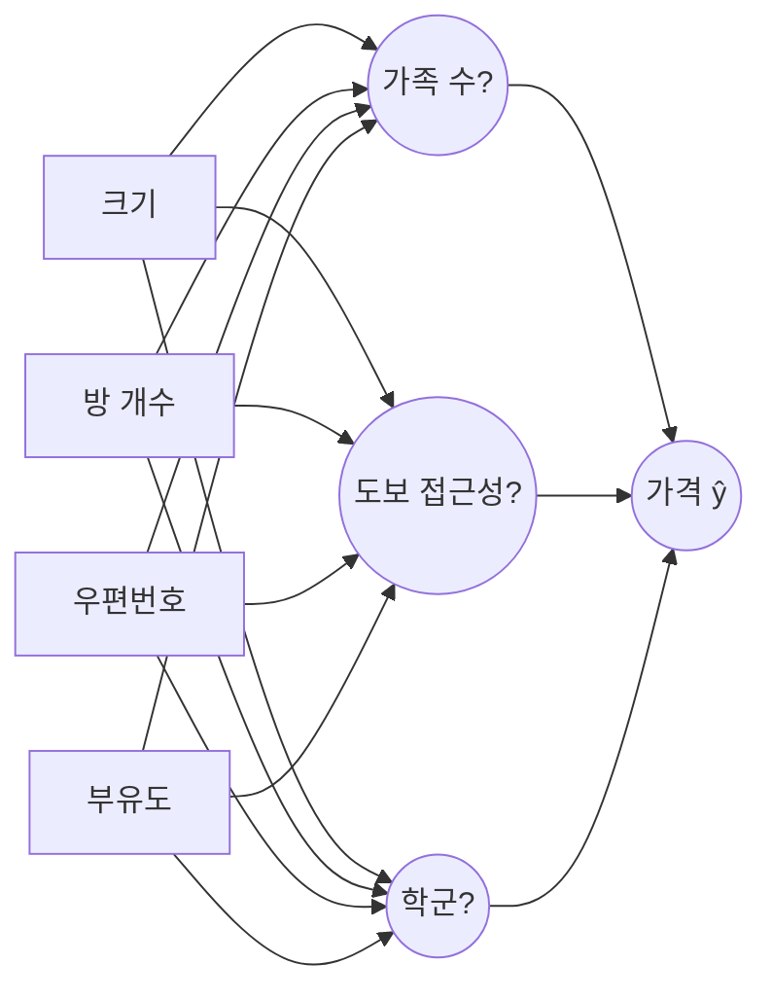

그림 읽는 법: 왼쪽 네모 4개가 입력 $x$(input layer), 가운데 동그라미 3개가 hidden unit(hidden layer), 오른쪽이 출력 $\hat y$(output layer). 가운데 동그라미에 붙인 "가족 수?" 같은 이름은 **사람이 해석해본 것일 뿐**이고, 실제로는 네트워크가 학습하면서 가장 쓸모 있는 중간 개념을 스스로 정한다(그래서 물음표). 모든 입력이 모든 hidden unit으로 화살표가 가는 것 = densely connected.

### 왜 갑자기 딥러닝인가

신경망(neural network) 자체는 옛날부터 있던 아이디어다. 근데 왜 하필 지금 와서 폭발적으로 쓰이게 됐을까. Andrew Ng이 강의에서 그리는 유명한 그래프가 하나 있는데, x축은 (라벨 있는) 데이터 양(amount of data), y축은 성능(performance)이다.

- 전통적인 알고리즘(SVM(Support Vector Machine — 클래스 사이 경계의 여유 폭을 최대로 잡는 분류기), logistic regression 같은 것들)은 데이터를 늘려도 어느 순간부터 성능이 **정체(plateau)**된다 — 모델 용량(capacity)이 작아서 데이터를 더 줘도 담을 그릇이 없다.
- 작은 신경망 < 중간 신경망 < 큰 신경망 순으로, 데이터가 많아질수록 더 큰 네트워크가 계속 성능을 올린다. 특히 "큰 신경망 + 많은 데이터" 조합에서 이 우상향이 두드러진다.

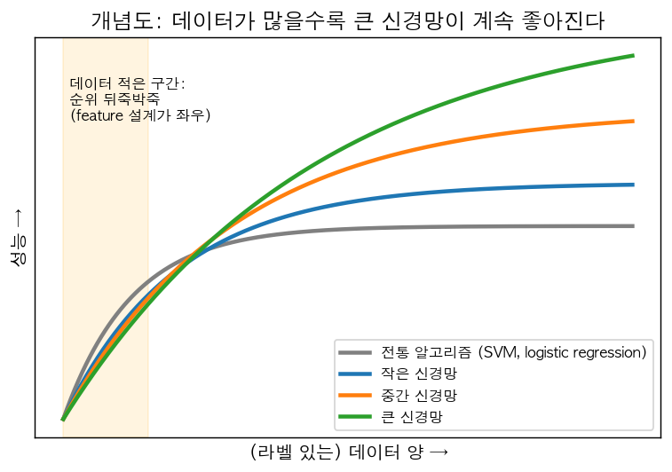

(강의 그래프를 재현한 **개념도**라서 축에 숫자는 없다.) 볼 곳은 두 군데다. ① 오른쪽 끝: 회색(전통 알고리즘)은 일찍 평평해지는데, 신경망은 클수록 더 높은 곳까지 계속 올라간다. ② 왼쪽 주황 구간: 데이터가 적을 땐 곡선들이 엉켜 있어서 누가 이길지 모른다 — 아래 "작은 데이터셋에서는 순위가 뒤바뀐다"는 얘기가 이 구간이다.

즉 스케일(scale)이 성능을 이끈다는 게 핵심 관찰이다. 이걸 가능하게 만든 세 가지 축이 있다.

1. **데이터(data)** — 인터넷, 모바일, IoT로 디지털 데이터가 폭발적으로 쌓임.
2. **연산(computation)** — GPU 등 하드웨어 발전으로 큰 네트워크를 실제로 학습시킬 수 있게 됨.
3. **알고리즘(algorithms)** — 예를 들어 activation function을 sigmoid에서 ReLU로 바꾼 것 하나만으로도 gradient descent가 훨씬 빨리 도는 걸 알게 됨 (sigmoid는 양 끝에서 기울기가 0에 가까워져서 학습이 느려지는데, ReLU는 그 문제가 덜하다 — 이건 Week 3에서 다시 자세히 본다).

알고리즘 개선이 중요한 진짜 이유는 **실험 속도**다. 딥러닝은 Idea → Code → Experiment 사이클을 계속 도는 작업인데, 학습이 10분 걸리면 하루에 수십 번 아이디어를 시험하지만 한 달 걸리면 1년에 몇 번밖에 못 한다. 빠른 알고리즘/하드웨어 → 빠른 반복 → 더 좋은 아이디어, 라는 선순환.

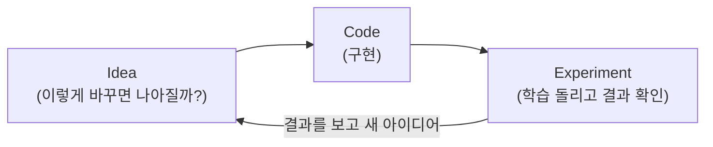

이 원을 한 바퀴 도는 시간이 짧을수록 같은 기간에 더 많은 시도를 할 수 있다 — 연산과 알고리즘의 발전이 결국 이 한 바퀴를 줄여준 것.

여기서 중요한 실무적 통찰: **작은 학습 데이터셋(training set)에서는 어떤 알고리즘이 1등인지 순위가 자주 뒤바뀐다** — 이 구간에서는 알고리즘 종류보다 feature를 얼마나 잘 설계했느냐(hand-engineering)가 성능을 좌우한다. 근데 데이터가 커지면 커질수록 큰 신경망이 거의 항상 이긴다. 그래서 "데이터가 많다 → 신경망을 크게 만들어라"가 실무 감각으로 자리잡았다.

### Supervised Learning 응용

ML Specialization에서 이미 supervised learning(입력 x → 출력 y를 매핑하는 학습)은 다뤘으니 개념 자체는 새롭지 않다. Course 1에서 강조하는 건 딥러닝이 이 supervised learning을 어떤 데이터 타입에 적용하는지 넓어졌다는 점이다.

| 입력 x | 출력 y | 응용 | 네트워크 타입 |
|---|---|---|---|
| 집 특징 | 가격 | 부동산 | Standard NN |
| 광고 + 유저 정보 | 클릭 여부(0/1) | 온라인 광고 | Standard NN |
| 이미지 | 객체 클래스(1,...,1000) | 사진 태깅 | CNN |
| 오디오 | 텍스트 | 음성 인식 | RNN |
| 영어 문장 | 중국어 문장 | 기계 번역 | RNN |
| 이미지 + 레이더 정보 | 다른 차의 위치 | 자율주행 | Custom/Hybrid |

네트워크 타입은 **데이터 구조**를 따라간다: 이미지는 공간 구조(가까운 픽셀끼리 관련)가 있어서 CNN(Convolutional Neural Network — 작은 필터를 이미지 위로 밀며 훑는 "합성곱" 연산을 쓰는 망, Course 4), 오디오·문장은 시간 순서가 있어서 RNN(Recurrent Neural Network — 앞 시점의 출력을 다음 시점 입력으로 "되풀이(recurrent)"해 넣는 망, Course 5), 표 데이터는 그런 구조가 없으니 standard(fully-connected) NN.

정형 데이터(structured data, 표 형태 — 각 feature가 "방 개수", "나이"처럼 명확한 의미를 가짐, ML Specialization의 결정 트리/회귀에서 다루던 데이터)와 비정형 데이터(unstructured data, 이미지 픽셀·오디오 파형·텍스트 단어 — 값 하나하나엔 의미가 거의 없음)를 구분하는 게 포인트다. 사람은 원래 비정형 데이터를 잘 다루는데(눈으로 보고, 귀로 듣고), 신경망이 최근 몇 년간 비약적으로 잘하게 된 영역이 바로 이 비정형 데이터 쪽이다. 그래서 뉴스에 나오는 화려한 딥러닝 성과(이미지 인식, 음성 인식 등)가 다 이쪽이다. (다만 돈을 실제로 많이 번 건 광고·추천 같은 정형 데이터 쪽이라는 것도 Ng가 짚는다.)

---

## Week 2. 신경망 관점의 Logistic Regression

로지스틱 회귀 자체는 ML Specialization에서 이미 알고 있을 거다. 여기서 새로 익혀야 하는 건 **딥러닝 코스 표기법(notation)**과, 로지스틱 회귀를 **"forward → backward"라는 신경망의 틀로 다시 보는 것**이다. 로지스틱 회귀 = 뉴런 1개짜리 신경망이라서, 여기서 익힌 모든 것(표기, 벡터화, $dz = a - y$)이 Week 3, 4에 그대로 확장된다.

### 표기법(Notation)

**이번 주 문제 설정 — 이진 분류(binary classification)**: 입력(예: 사진 한 장)을 보고 답이 둘 중 하나(고양이면 $y = 1$, 아니면 $y = 0$)인 문제. 모델은 "1일 확률" $\hat y$를 내놓고, 0.5보다 크면 1이라고 답한다. 아래 표기는 전부 이 문제를 수식으로 적기 위한 약속이다.

- 학습 샘플 하나: $(x, y)$, $x \in \mathbb{R}^{n_x}$, $y \in \{0, 1\}$ ($n_x$ = feature 개수). $\mathbb{R}$은 실수 전체의 집합이고 $\mathbb{R}^{n_x}$는 "실수 $n_x$개짜리 벡터들의 집합"이라서, $x \in \mathbb{R}^{n_x}$ = "$x$는 숫자 $n_x$개로 된 열벡터"라는 뜻이다. $y \in \{0, 1\}$ = "$y$는 0 아니면 1"(집합 $\{0,1\}$에 속함). $x$의 $j$번째 feature는 아래첨자로 $x_j$ ($j = 1, \dots, n_x$).
- 학습 샘플 $m$개($m$ = 학습 샘플 개수, 데이터셋 크기): $\{(x^{(1)}, y^{(1)}), \dots, (x^{(m)}, y^{(m)})\}$ — 위첨자 소괄호 $(i)$는 "$i$번째 샘플"을 뜻한다. 나중에 나올 위첨자 대괄호 $[l]$(레이어 번호)이랑 헷갈리지 않게 지금부터 구분해서 보는 습관을 들이자. $m_{\text{train}}, m_{\text{test}}$로 train/test 샘플 수를 구분하기도 한다.
- **가장 중요한 습관**: 입력 데이터를 행렬로 쌓을 때, ML Specialization에서 흔히 보던 "행 = 샘플" 방식이 아니라 **열(column) 단위로 샘플을 쌓는다.**

$$
X = \begin{bmatrix} | & | & & | \\ x^{(1)} & x^{(2)} & \cdots & x^{(m)} \\ | & | & & | \end{bmatrix} \in \mathbb{R}^{n_x \times m}
$$

| 기호 | 의미 |
|---|---|
| $X$ | 입력 행렬 — 모든 샘플을 한데 모은 것. 대문자 = "여러 샘플을 쌓은 행렬"이라는 이 코스의 관례(소문자 $x$는 샘플 하나) |
| $x^{(i)}$ | $i$번째 샘플의 feature 열벡터, shape `(n_x, 1)`. $i = 1, \dots, m$ |
| 세로줄 $\mid$ | "이 열벡터가 세로로 통째로 들어간다"는 그림 표시일 뿐 연산 기호가 아니다 |
| $\mathbb{R}^{n_x \times m}$ | 실수로 된 $n_x$행 $m$열 행렬들의 집합 → $X$의 shape이 `(n_x, m)` |
| $n_x$, $m$ | 위에서 정의한 feature 개수, 샘플 개수 |

즉 $X$의 shape은 `(n_x, m)`이다. `X.shape`을 찍었을 때 `(m, n_x)`가 나오면 뭔가 뒤집힌 거다 — 이 습관 하나만 잘 들여도 나중에 행렬곱 차원 에러를 절반은 피할 수 있다. $Y$도 마찬가지로 $Y = [y^{(1)}, y^{(2)}, \dots, y^{(m)}] \in \mathbb{R}^{1 \times m}$, 즉 행 벡터로 쌓는다.

**왜 열로 쌓나**: 샘플 하나에 대한 계산이 $w^Tx$(행 × 열 — $w$는 feature마다 하나씩 있는 가중치 열벡터, 위첨자 $T$는 transpose(전치: 행과 열을 뒤바꿈)라서 $w^T$는 `(1, n_x)` 행벡터. 바로 다음 절에서 다시 정의한다)이니까, 열을 옆으로 붙이면 $w^TX$ 한 번의 행렬곱이 모든 샘플의 계산을 동시에 해준다 — $w^TX = [w^Tx^{(1)}, w^Tx^{(2)}, \dots, w^Tx^{(m)}]$. 한 샘플 = 한 열이라는 대응이 레이어를 몇 개 쌓든 유지된다 ($Z^{[l]}, A^{[l]}$도 "열 $i$ = 샘플 $i$").

**구체적 예 — 이미지**: 64×64 컬러 고양이 사진은 R, G, B 세 채널 각각 64×64 픽셀 행렬이다. 이걸 한 줄로 펴서(flatten/unroll) 열벡터로 만들면 $n_x = 64 \times 64 \times 3 = 12288$. 사진 209장이면 $X$는 `(12288, 209)`. numpy로는 `X = images.reshape(images.shape[0], -1).T` — `(209, 64, 64, 3)`을 `(209, 12288)`로 편 뒤 전치해서 `(12288, 209)`. (`images.shape[0]` = 첫 축 크기 = 사진 수 209, `-1` = "나머지 크기는 numpy가 알아서 계산해라"(여기선 $64 \cdot 64 \cdot 3$), `.T` = transpose.) 픽셀값은 0~255라서 255로 나눠 0~1로 스케일링하는 게 관례.

> **Andrew Ng이 강조하는 습관**: 신경망 코드를 짤 때 각 변수의 shape을 항상 주석으로 달아놓고, 실제로 shape이 맞는지 의심하는 습관을 들이라고 한다. 이건 이 코스 전체를 관통하는 조언이다.

### Logistic Regression을 신경망 언어로

**logistic regression이 뭔가**: 입력 $x$를 보고 "$y = 1$일 확률"을 0~1 사이 숫자로 내놓는 **이진 분류** 모델이다. 이름에 "회귀(regression)"가 붙은 건 내부적으로 실수값(점수 $z$)을 회귀처럼 계산하기 때문이고, "logistic"은 그 점수를 확률로 바꾸는 S자 곡선 **logistic 함수**(= sigmoid)에서 왔다. 즉 이름과 달리 용도는 분류다.

로지스틱 회귀 자체 수식은 익숙할 거다.

$$
\hat{y} = a = \sigma(w^Tx + b), \quad \sigma(z) = \frac{1}{1+e^{-z}}
$$

| 기호 | shape | 의미 |
|---|---|---|
| $x$ | $(n_x, 1)$ | 입력 feature 한 샘플 |
| $w$ | $(n_x, 1)$ | 가중치 (feature마다 하나). **학습되는 parameter** |
| $b$ | 스칼라 | bias (절편). **학습되는 parameter** |
| $w^T$ | $(1, n_x)$ | $w$의 transpose(전치). $w^Tx = w_1x_1 + w_2x_2 + \cdots + w_{n_x}x_{n_x}$ (내적) |
| $z = w^Tx + b$ | 스칼라 | 선형 결합 — "점수". 범위 $-\infty \sim \infty$ |
| $\sigma(\cdot)$ | 원소별 함수 | sigmoid 함수. 이름은 그리스 문자 시그마($\sigma$, 영어 S)에서 — 그래프가 S자라서 |
| $e$ | 상수 | 자연상수 $\approx 2.718$. $e^{-z}$는 $z$가 크면 0으로, $z$가 아주 작으면(음수로 크면) 무한대로 간다 |
| $a = \sigma(z)$ | 스칼라 | $P(y = 1 \mid x)$의 추정치. $a$는 activation의 머리글자 |
| $\hat y$ | 스칼라 | 예측값. 여기서는 $a$와 같은 것 |
| $P(y = 1 \mid x)$ | 스칼라 | "입력이 $x$일 때 $y = 1$일 (조건부) 확률". 세로줄 $\mid$ = "~가 주어졌을 때" |

$\hat y$는 확률이어야 하니까 $0 \le \hat y \le 1$이어야 한다. $w^Tx + b$는 $-\infty \sim \infty$ 범위라서 그대로는 확률이 될 수 없고, sigmoid로 0~1에 눌러 담는다: $z$가 크면 $\sigma(z) \approx 1$, $z$가 아주 작으면 $\approx 0$, $z = 0$이면 정확히 $0.5$. (ML Specialization에서는 $w, b$를 한 벡터 $\theta$로 합쳐서 $x_0 = 1$을 붙이는 표기를 쓰기도 했는데, 이 코스에서는 **$w$와 $b$를 따로 둔다** — 신경망에서 이게 훨씬 편하다.)

여기서 $\hat{y}$ 대신 $a$(activation)라는 표기를 쓰는 게 새 포인트다. 이게 앞으로 신경망의 "뉴런 하나의 출력"을 가리키는 표준 표기가 된다. 로지스틱 회귀 = **가장 작은 신경망(뉴런 1개짜리)** 이라고 보면 된다: 입력 → (선형 결합 $z$) → (activation $a$) → 출력.

### Loss function vs Cost function — 구분해서 쓰기

먼저 왜 이런 게 필요한지. 학습(training)이란 결국 "$w, b$를 이리저리 바꿔서 예측을 정답에 가깝게 만드는 것"인데, 그러려면 **"지금 얼마나 틀렸는지"를 숫자 하나로 재는 자**가 있어야 한다. 그 숫자가 작아지는 방향으로 $w, b$를 고치면 되니까. 이 "틀린 정도 점수"가 loss/cost다 — 점수가 클수록 나쁘다(벌점).

ML Specialization에서는 이 둘을 크게 구분 안 하고 뭉뚱그려 "cost"라고 부르는 경우가 많았을 텐데, 딥러닝 표기법에서는 명확히 나눈다.

- **Loss function** $\mathcal{L}(a, y)$ — 샘플 **하나**에 대한 에러.
- **Cost function** $J(w, b)$ — 전체 $m$개 샘플에 대한 loss의 **평균**. 우리가 실제로 최소화하는 대상은 이것 — 파라미터 $w, b$의 함수다.

**convex / local optimum이 뭔지부터**: $J$를 $w$에 대한 그래프로 그렸을 때 ——
- **convex(볼록)**: 밥그릇처럼 움푹한 곳이 딱 하나. 어디서 굴러 내려가도 같은 바닥(= **global optimum**, 전체에서 제일 낮은 점)에 도착한다.
- **non-convex(비볼록)**: 울퉁불퉁해서 움푹한 곳이 여러 개. 내려가다가 "주변보다는 낮지만 제일 낮지는 않은" 웅덩이(= **local optimum**)에 빠져서 멈출 수 있다.

gradient descent는 "지금 서 있는 곳에서 내리막으로 한 발짝"만 아는 근시안적인 방법이라, 그래프가 convex여야 안심하고 쓸 수 있다.

로지스틱 회귀의 loss는 제곱오차(squared error)를 안 쓴다. 왜냐면 squared error $\frac12(a - y)^2$(예측 $a$와 정답 $y$의 차이를 제곱한 것. 앞의 $\frac12$은 미분하면 제곱의 2와 약분되라고 붙이는 편의상 상수)에 sigmoid가 끼면 $J$가 비볼록(non-convex)이 돼서 gradient descent가 local optimum에 걸릴 위험이 커지기 때문이다. 대신 이런 걸 쓴다 — 이름은 **binary cross-entropy loss**(또는 log loss). 이 노트에서 "cross-entropy"라고 하면 이걸 말한다.

이름 뜻: **cross-entropy**(교차 엔트로피)는 정보이론 용어로, "정답 분포($y$)와 예측 분포($a$)가 얼마나 다른지"를 재는 양이다 — 둘을 "교차(cross)"시켜 계산하는 entropy(불확실성의 양)라서 이 이름. **binary**는 클래스가 2개(0/1)라는 뜻, **log loss**는 식에 log가 들어가서 붙은 별명.

$$
\mathcal{L}(a, y) = -\big(y\log a + (1-y)\log(1-a)\big)
$$

| 기호 | 의미 |
|---|---|
| $\mathcal{L}$ | loss 함수(필기체 L). 샘플 하나의 벌점, 항상 $\ge 0$ |
| $a$ | 모델 예측 $= \hat y = \sigma(z)$, 범위 $(0, 1)$ — "$y = 1$일 확률" |
| $y$ | 정답 라벨, 0 또는 1 |
| $\log$ | **자연로그**(밑이 $e$, $\ln$과 같음). numpy의 `np.log`도 자연로그. $\log 1 = 0$이고 입력이 0에 가까워질수록 $-\infty$ |
| 앞의 $-$ | $a \in (0,1)$이면 $\log a < 0$이라, 마이너스를 붙여야 loss가 양수(벌점)가 된다 |

$y$는 0 아니면 1이라서 괄호 안의 두 항 중 **하나만 살아남는다**:

- $y=1$이면 $\mathcal{L} = -\log a$ → $a$가 1에 가까울수록(=맞출수록) loss가 작아짐.
- $y=0$이면 $\mathcal{L} = -\log(1-a)$ → $a$가 0에 가까울수록 loss가 작아짐.

숫자로 ($y = 1$일 때):

| 예측 $a$ | 0.99 | 0.9 | 0.5 | 0.1 | 0.01 |
|---|---|---|---|---|---|
| loss $-\log a$ | 0.01 | 0.105 | 0.69 | 2.30 | 4.61 |

맞추면 거의 0, 틀리면 크고, **확신을 갖고 틀릴수록(0.01) 벌점이 폭발적으로 커진다.** 이게 제곱오차와의 큰 차이다 — 제곱오차는 최대 벌점이 $(1-0)^2 = 1$로 묶여 있다.

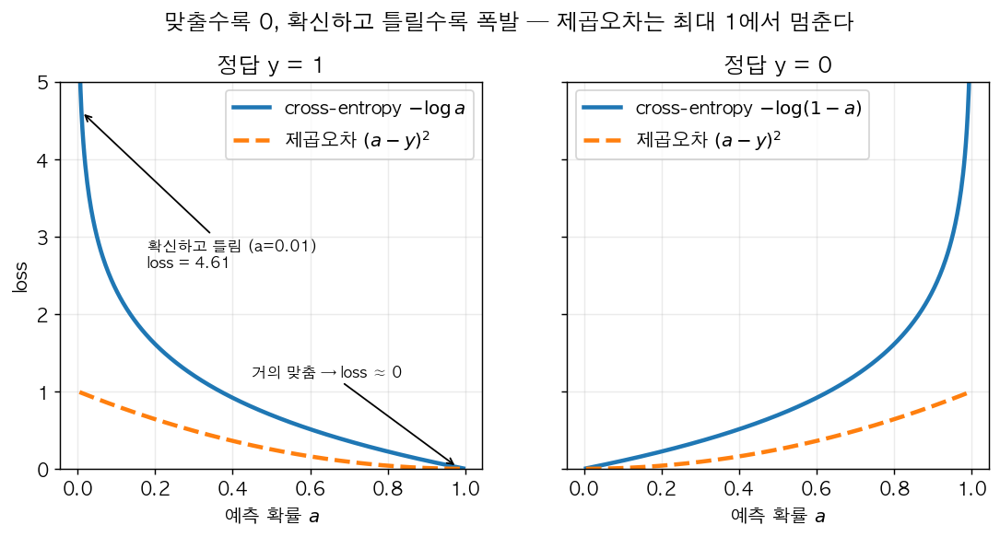

왼쪽($y=1$): 파란 실선 $-\log a$는 $a \to 1$(맞춤)이면 0으로, $a \to 0$(확신하고 틀림)이면 하늘로 치솟는다. 주황 점선(제곱오차)은 아무리 틀려도 1에서 멈춘다. 오른쪽($y=0$)은 좌우를 뒤집은 거울상 — 이번엔 $a \to 1$이 "확신하고 틀림"이다. 즉 두 경우 모두 **"정답 쪽으로 갈수록 0, 반대쪽 끝으로 갈수록 무한대"**라는 같은 모양이다.

**이 loss는 어디서 왔나 (maximum likelihood)** — 강의의 optional 영상 내용. 아이디어는 단순하다: "좋은 모델이란 **실제로 관측된 정답들에 높은 확률을 준 모델**이다." 예를 들어 정답이 고양이(1)인 사진에 모델 A는 0.9, 모델 B는 0.2를 줬다면 A가 더 좋은 모델이다. 이렇게 "정답에 준 확률"을 likelihood라 부르고, 그걸 최대로 만드는 $w, b$를 찾자는 게 maximum likelihood다. $\hat y = P(y=1 \mid x)$로 해석하면, 정답 $y$가 나올 확률은 두 경우를 한 식으로 쓸 수 있다:

$$P(y \mid x) = \hat y^{\,y}(1-\hat y)^{1-y} \quad (y=1\text{이면 } \hat y,\ y=0\text{이면 } 1-\hat y)$$

여기서 $P(y \mid x)$ = "입력 $x$가 주어졌을 때 모델이 실제 정답 $y$에 준 확률", $\hat y$ = 모델이 낸 "1일 확률". 지수 $y$, $1-y$는 스위치 역할이다: 어떤 수든 0제곱은 1이라서, $y = 1$이면 $\hat y^1 (1-\hat y)^0 = \hat y$, $y = 0$이면 $\hat y^0 (1-\hat y)^1 = 1 - \hat y$만 남는다.

log를 씌우면 $\log P(y\mid x) = y\log\hat y + (1-y)\log(1-\hat y)$ ($\log(pq) = \log p + \log q$, $\log p^k = k\log p$ 성질을 쓴 것). 이 확률을 **최대화**하고 싶은데 gradient descent는 최소화 도구니까 마이너스를 붙인 것 — 그게 정확히 $\mathcal{L}$이다. 샘플들이 독립(서로 영향을 안 줌 — 강의 표현으로 IID, independently and identically distributed)이면 전체 확률은 곱 $\prod_i P(y^{(i)}\mid x^{(i)})$이고($\prod_{i}$ = "$i = 1$부터 $m$까지 전부 곱하라", $\Sigma$의 곱셈 버전), log를 씌우면 합이 된다. 그걸 최대화 = $\sum\mathcal{L}$ 최소화. 평균을 내려고 $\frac1m$을 붙인 게 cost $J$다:

$$
J(w,b) = \frac{1}{m}\sum_{i=1}^{m}\mathcal{L}(a^{(i)}, y^{(i)})
$$

| 기호 | 의미 |
|---|---|
| $J(w,b)$ | cost. 괄호 안 $w, b$는 "$J$가 $w, b$의 함수"라는 뜻 — 데이터는 고정이고 $w, b$를 바꾸면 $J$가 바뀐다 |
| $\sum_{i=1}^{m}$ | 시그마 합: 샘플 번호 $i$를 1부터 $m$까지 바꿔가며 뒤의 값을 전부 더한다 |
| $\frac1m$ | 합을 샘플 수로 나눠 평균으로 만든다 (데이터 수가 달라도 $J$의 크기가 비교 가능해짐) |
| $a^{(i)}$ | $i$번째 샘플에 대한 예측 $\sigma(w^Tx^{(i)} + b)$ |
| $y^{(i)}$ | $i$번째 샘플의 정답 |
| $\mathcal{L}(\cdot)$ | 위에서 정의한 cross-entropy loss |

**cost는 convex**해서 gradient descent가 안정적으로 전역 최적점(global optimum)을 향해 내려간다 — 어디서 시작하든 같은 바닥에 도착하니까, 로지스틱 회귀에서는 초기값을 0으로 해도 된다.

### Gradient Descent — 복습 + 표기

**gradient descent가 뭔가**: cost $J(w, b)$를 가장 작게 만드는 $w, b$를 찾는 **반복 최적화 알고리즘**이다. 한 번에 답을 푸는 공식이 없으니, 아무 데서나 시작해서 "지금 위치의 기울기를 보고 내리막으로 조금 이동"을 수없이 반복한다. 이름 그대로 **gradient**(기울기 — 각 파라미터에 대한 편미분들을 모은 것)를 따라 **descent**(내려가기)하는 방법. 이 "한 번 이동"을 **iteration**(반복 1회)이라 부른다.

$$
w := w - \alpha \frac{\partial J(w,b)}{\partial w}, \qquad b := b - \alpha \frac{\partial J(w,b)}{\partial b}
$$

| 기호 | 의미 |
|---|---|
| $:=$ | "대입(업데이트)". 수학의 등호가 아니라 코드의 `w = w - ...`처럼 오른쪽 값으로 $w$를 덮어쓴다 |
| $\alpha$ | learning rate(학습률) — 한 스텝의 보폭 배율. **사람이 정하는 hyperparameter** (아래 설명) |
| $\frac{\partial J(w,b)}{\partial w}$ | $J$를 $w$로 편미분한 값 = "$w$만 아주 조금 늘렸을 때 $J$가 몇 배로 변하나". $w$가 `(n_x, 1)` 벡터라서 이것도 `(n_x, 1)` 벡터 — 원소 $j$가 $\frac{\partial J}{\partial w_j}$ |
| $\frac{\partial J(w,b)}{\partial b}$ | $J$를 $b$로 편미분한 값 (스칼라) |
| $\partial$ | "편미분(partial derivative)" 기호, "라운드 d"라고 읽는다. 변수가 여러 개인 함수에서 **나머지는 고정하고 하나만** 움직였을 때의 미분 |
| $w, b$의 시작값 | 로지스틱 회귀는 cost가 convex라 0으로 시작해도 된다 (신경망은 안 됨 — Week 3) |

**$\alpha$ (learning rate)**: 데이터에서 학습되는 값이 아니라 사람이 미리 고르는 값이다. 이 코스 과제에서는 0.005, 0.0075, 1.2 같은 값을 쓰고, 보통 0.001 ~ 1 사이에서 0.01, 0.03, 0.1처럼 몇 배씩 바꿔가며 시험한다. **너무 작으면** 보폭이 작아서 바닥까지 iteration이 엄청 많이 필요하다(느림). **너무 크면** 바닥을 건너뛰어 반대편 벽으로 넘어가서 $J$가 오르내리거나 아예 발산한다. (Week 4 끝의 learning rate 그림이 이 두 경우를 보여준다.)

$\alpha$는 learning rate(한 번에 얼마나 크게 움직일지). 미분값(기울기)이 양수면 $w$를 늘릴수록 $J$가 커진다는 뜻이니 $w$를 줄이고, 음수면 늘린다 — 항상 **내리막 방향**으로 한 발짝. 그래서 반복하면 바닥(최솟값)에 도착한다.

비유하면 안개 낀 산에서 눈 가리고 내려가는 것: 멀리는 안 보이지만 발밑의 경사(기울기)는 느낄 수 있으니, "내리막 쪽으로 한 발짝"을 반복한다. 발밑 경사가 가파르면 $\alpha \times$(기울기)도 커서 크게 움직이고, 바닥 근처에서 경사가 완만해지면 저절로 보폭이 줄어든다.

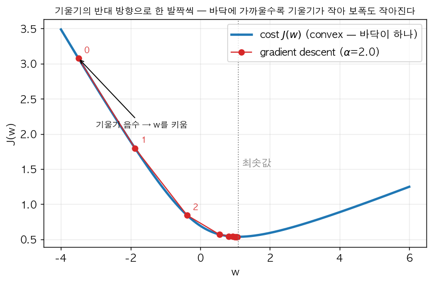

feature 1개, $b = 0$으로 고정한 장난감 로지스틱 회귀의 cost $J(w)$를 그리고, $w = -3.5$에서 시작해 gradient descent를 8번 돌린 궤적(빨간 점, 번호 = 스텝)이다. 볼 것: ① 시작점에서 기울기가 음수(오른쪽 아래로 내려가는 경사)라서 $w$가 **커지는** 방향으로 간다. ② 0→1→2 스텝은 보폭이 크고, 바닥 근처로 갈수록 점들이 촘촘해진다 — $\alpha$는 그대로인데 기울기가 작아져서. ③ cross-entropy cost라 그릇 모양(convex)이 하나뿐이다.

코드에서는 $\partial J/\partial w$를 그냥 `dw`라고 쓰는 관습이 이 코스부터 확실히 자리잡는다. 앞으로 `dw`, `db`, `dz`, `da` 이런 식으로 **"최종 출력(loss/cost)을 그 변수로 미분한 값"**을 줄여 쓰는 표기가 계속 나오니 익숙해지자. `dvar` = $\frac{\partial J}{\partial \text{var}}$ (또는 샘플 하나일 땐 $\frac{\partial\mathcal{L}}{\partial\text{var}}$). (편미분 기호 $\partial$은 변수가 여러 개인 함수에서 하나만 움직일 때 쓰는 것일 뿐, $d$와 의미는 같다고 봐도 된다.)

### Computation Graph — 왜 이걸 그리는가

신경망 학습은 크게 두 방향으로 움직인다.

- **Forward pass**: 입력에서 출력(그리고 cost)까지 계산.
- **Backward pass**: cost에서 거꾸로 각 파라미터에 대한 미분을 계산 (= backpropagation).

이 두 흐름을 눈에 보이게 그린 게 computation graph다. **computation graph**(계산 그래프) = 식을 "기본 연산 한 번"짜리 노드들로 쪼개고, 어떤 값이 어떤 연산에 들어가는지를 화살표로 이은 그림. 노드 = 변수나 중간 계산값, 화살표 = "이 값이 저 계산의 재료로 쓰인다". 예를 들어 $J(a,b,c) = 3(a+bc)$ 같은 간단한 식이 있으면 (여기서 $a, b, c$는 그냥 설명용 변수 세 개다 — 로지스틱 회귀의 activation $a$나 bias $b$와는 무관),

복잡한 식을 "한 번에 한 연산만 하는 작은 단계"로 쪼개서 이렇게 노드를 쭉 이어 그린다 (괄호 안은 아래 숫자 예시 $a=5, b=3, c=2$의 forward 값):

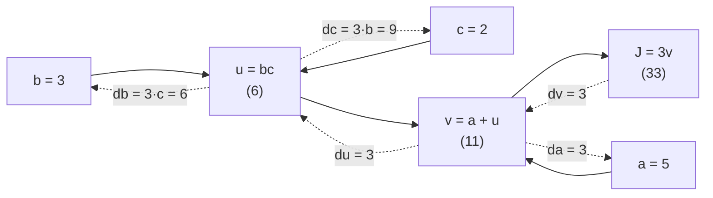

$u = bc$, $v = a + u$는 한 번에 한 연산만 하려고 새로 붙인 **중간 변수** 이름이다. 점선 위 `dv`, `da` 등은 "$J$를 그 변수로 미분한 값"($dv = \frac{dJ}{dv}$)의 코드식 줄임 표기 — 바로 앞 절에서 정한 `dvar` 규칙 그대로다.

실선 화살표(왼→오)가 forward — 값을 계산한다. 점선 화살표(오→왼)가 backward — 각 변수가 $J$에 얼마나 영향을 주는지(미분)를 거꾸로 전달한다. backward는 **chain rule**을 타고 간다.

**chain rule을 처음 보는 사람용 설명**: 톱니바퀴 세 개가 맞물려 있다고 생각하자. 바퀴 $b$를 조금 돌리면 바퀴 $u$가 $c = 2$배로 돌고, $u$가 돌면 $v$는 1배로, $v$가 돌면 $J$가 3배로 돈다. 그럼 $b$ → $J$는 $2 \times 1 \times 3 = 6$배. 즉 **"단계별 영향력(국소 미분)을 곱하면 전체 영향력이 된다"** — 이게 chain rule의 전부다. 식으로 쓰면 $\frac{dJ}{db} = \frac{dJ}{dv}\cdot\frac{dv}{du}\cdot\frac{du}{db}$. (여기서 $\frac{dv}{du}$ = "$u$를 조금 바꿀 때 $v$가 몇 배로 변하나" = 이 한 단계의 **국소 미분**. 나머지도 같은 식으로 읽는다. $\cdot$은 그냥 곱하기.) 각 단계는 "곱하기"나 "더하기" 같은 단순 연산이라 국소 미분은 누구나 구할 수 있고, 복잡한 건 곱하는 순서뿐인데 그걸 그래프가 정리해준다.

**숫자로 한 바퀴** ($a = 5, b = 3, c = 2$):

Forward: $u = 3 \times 2 = 6$, $v = 5 + 6 = 11$, $J = 3 \times 11 = 33$

Backward (오른쪽부터, 각 단계에서 "바로 앞 단계 미분 × 이번 단계의 국소 미분"):

| 변수 | 계산 | 값 | 의미 |
|---|---|---|---|
| `dv` | $\frac{dJ}{dv} = 3$ | 3 | $v$가 0.001 늘면 $J$가 0.003 늘어남 |
| `da` | $\frac{dJ}{dv}\cdot\frac{dv}{da} = 3 \times 1$ | 3 | |
| `du` | $\frac{dJ}{dv}\cdot\frac{dv}{du} = 3 \times 1$ | 3 | |
| `db` | $\frac{dJ}{du}\cdot\frac{du}{db} = 3 \times c$ | 6 | |
| `dc` | $\frac{dJ}{du}\cdot\frac{du}{dc} = 3 \times b$ | 9 | |

확인: $b$를 3 → 3.001로 바꾸면 $u = 6.002$, $v = 11.002$, $J = 33.006$ — 0.001 늘렸더니 0.006 늘었으니 `db = 6` ✓.

이 예시가 보여주는 두 가지:
1. **chain rule = 미분을 곱하면서 뒤로 전달**. `db`를 구할 때 `du`를 재사용했다 — 뒤쪽에서 이미 구한 값을 앞쪽이 받아 쓰니까, 앞으로 갈수록 계산이 새로 쌓이지 않는다. 이게 backprop이 효율적인 이유다.
2. **국소 미분에 forward 값이 필요하다** (`db` $= 3 \times c$에서 $c$, `dc`에서 $b$). 그래서 forward 때 중간값을 저장(cache)해 둬야 한다 — Week 4의 cache 개념이 여기서 나온다.

즉 딥러닝의 backprop이 결국 chain rule을 그래프 위에서 체계적으로 적용하는 것뿐이라는 걸 이 그래프가 보여준다. 미적분이 약해도 괜찮은 이유가 여기 있다 — 실제로 필요한 미분 규칙은 "합성함수 미분(chain rule)"과 몇 개 기본 함수의 도함수뿐이고, 나머지는 이 그래프를 손으로 한 단계씩 따라가기만 하면 유도된다.

### 미분 직관 (아주 러프하게)

**도함수(derivative)란**: 함수 $f$의 각 지점에서의 기울기를 알려주는 함수. $\frac{df}{da}$("디에프 디에이")는 "$f$를 $a$로 미분한 것"이고, $f'(a)$(프라임 표기)로도 쓴다. 여기서 $a$는 그냥 입력 변수 이름이다.

$f(a) = 3a$면 $a$를 아주 조금 늘렸을 때 $f$는 3배만큼 늘어난다 — 이게 도함수 $\frac{df}{da}=3$의 의미다. "$a$를 조금 바꾸면 결과가 얼마나 바뀌는가"의 비율. 직선은 어디서든 기울기가 같지만, $f(a) = a^2$처럼 휜 함수는 위치마다 다르다: $a = 2$에서 $2.001^2 = 4.004$(기울기 4), $a = 5$에서 $5.001^2 = 25.010$(기울기 10) → $\frac{d}{da}a^2 = 2a$.

로지스틱 회귀에서 필요한 도함수는 딱 두 개만 알아도 충분하다.

$$
\frac{d}{dz}\sigma(z) = \sigma(z)(1-\sigma(z)), \qquad \frac{d}{da}\log a = \frac{1}{a}
$$

여기서 $\frac{d}{dz}$ = "바로 뒤의 식을 $z$로 미분하라"는 연산자, $\sigma(z)$ = 위에서 정의한 sigmoid, $z$ = 선형 결합 점수, $a$ = sigmoid 출력(확률), $\log$ = 자연로그(밑 $e$ — $\frac{1}{a}$이 깔끔하게 나오는 건 자연로그일 때뿐이다).

sigmoid 도함수는 이렇게 나온다: $\sigma(z) = (1+e^{-z})^{-1}$을 미분하면 (지수 $-1$은 역수, 즉 $\frac{1}{1+e^{-z}}$와 같은 식. chain rule로 바깥 $(\cdot)^{-1}$의 미분 $-(\cdot)^{-2}$에 안쪽 $1+e^{-z}$의 미분 $-e^{-z}$를 곱한다)

$$\sigma'(z) = \frac{e^{-z}}{(1+e^{-z})^2} = \underbrace{\frac{1}{1+e^{-z}}}_{\sigma(z)}\cdot\underbrace{\frac{e^{-z}}{1+e^{-z}}}_{1-\sigma(z)}$$

($\sigma'(z)$는 $\frac{d}{dz}\sigma(z)$의 프라임 표기. 두 번째 인수는 $1 - \sigma(z) = \frac{1+e^{-z}-1}{1+e^{-z}} = \frac{e^{-z}}{1+e^{-z}}$라서 그렇게 묶인다.) 출력 $a$만 알면 기울기를 바로 $a(1-a)$로 구할 수 있다는 게 편리하다. $z = 0$일 때 $0.5 \times 0.5 = 0.25$로 최대, $z = 10$이면 $a \approx 0.99995$라 기울기 $\approx 0.00005$ — 양 끝에서 거의 0이 되는 **saturation**(포화 — sigmoid 출력이 0이나 1에 딱 붙어서 $z$를 더 바꿔도 출력이 거의 안 변하는 상태)이 여기서 보인다. 기울기가 0에 가까우면 chain rule로 곱해지는 값도 0에 가까워져 학습이 멈춘 듯 느려진다. (Week 3 Activation 절의 그림 아랫줄 첫 칸이 바로 이 $\sigma'(z)$ 모양이다.)

### Logistic Regression의 역전파 유도

이게 이번 주 핵심이다. 샘플 하나에 대해 computation graph를 그리고 chain rule을 손으로 타고 가보자.

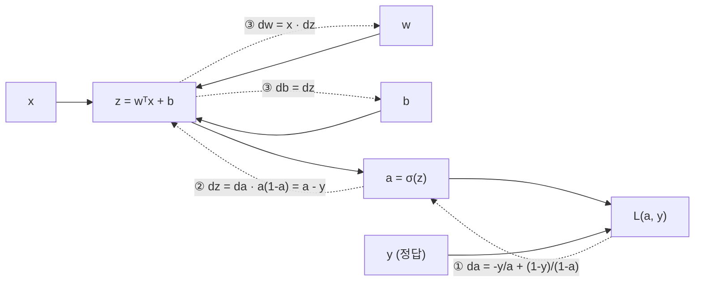

위 $J = 3(a+bc)$ 예시와 똑같은 구조다: 실선으로 forward 값을 구하고, 점선을 따라 오른쪽부터 ①→②→③ 순서로 미분을 전달한다. 아래는 각 점선의 값을 하나씩 유도하는 과정이다.

Forward:
$$
z = w^Tx + b, \quad a = \sigma(z), \quad \mathcal{L}(a,y) = -(y\log a + (1-y)\log(1-a))
$$

Backward (뒤에서부터):

**① `da`** — $\log$의 미분 $\frac1a$와 $\log(1-a)$의 미분 $-\frac{1}{1-a}$를 쓰면

$$
da = \frac{\partial \mathcal{L}}{\partial a} = -\frac{y}{a} + \frac{1-y}{1-a}
$$

**② `dz`** — chain rule로 `da`에 sigmoid의 국소 미분 $a(1-a)$를 곱한다:

$$
dz = \frac{\partial \mathcal{L}}{\partial a}\cdot\frac{\partial a}{\partial z} = \left(-\frac{y}{a} + \frac{1-y}{1-a}\right)\cdot a(1-a) = -y(1-a) + (1-y)a = -y + ya + a - ya = a - y
$$

분모의 $a$, $(1-a)$가 sigmoid 미분의 $a(1-a)$와 정확히 약분된다. 이 $dz = a-y$가 로지스틱 회귀 전체에서 가장 중요한 한 줄이라고 봐도 된다. 복잡해 보이던 cross-entropy loss와 sigmoid 미분이 싹 정리돼서 **"예측 - 정답"**이라는 극도로 단순한 형태로 떨어진다. 이게 나중에 신경망 출력층(그리고 Course 2의 softmax)에서도 그대로 반복되는 패턴이라 꼭 기억해두자.

숫자로: 정답 $y = 1$인데 $a = 0.3$이면 $dz = -0.7$ → "$z$를 키워라"(음수 기울기 방향의 반대로 가니까). $a = 0.95$면 $dz = -0.05$ → 거의 맞췄으니 조금만. 틀린 정도에 비례해서 고친다.

**③ `dw`, `db`** — $z = w_1x_1 + w_2x_2 + \cdots + b$이니까 $\frac{\partial z}{\partial w_j} = x_j$, $\frac{\partial z}{\partial b} = 1$:

$$
dw_1 = x_1 \cdot dz, \quad dw_2 = x_2 \cdot dz, \quad db = dz
$$

해석: 입력 $x_j$가 큰 feature일수록 그 weight가 결과에 많이 기여했으니 더 많이 고친다. $x_j = 0$이면 $w_j$는 이 샘플에서 아무 역할을 안 했으니 gradient도 0.

**④ $m$개 샘플로** — cost는 loss의 평균이니까 gradient도 샘플별 gradient의 **평균**이다 ($\frac{\partial J}{\partial w_1} = \frac1m\sum_i\frac{\partial\mathcal{L}^{(i)}}{\partial w_1}$). $n_x = 2$, for문 버전 (벡터화는 바로 다음 절):

```python
J, dw1, dw2, db = 0, 0, 0, 0
for i in range(m):
    z_i = w1*x1[i] + w2*x2[i] + b
    a_i = sigmoid(z_i)
    J += -(y[i]*log(a_i) + (1-y[i])*log(1-a_i))
    dz_i = a_i - y[i]
    dw1 += x1[i]*dz_i
    dw2 += x2[i]*dz_i
    db  += dz_i
J /= m; dw1 /= m; dw2 /= m; db /= m
w1 -= alpha * dw1; w2 -= alpha * dw2; b -= alpha * db   # gradient descent 한 스텝
```

`dw1`, `dw2`는 샘플을 돌며 누적하는 **합계 변수**다(샘플 인덱스 $i$가 없음). 이 전체가 gradient descent **한 스텝**이고, 이걸 수천 번 반복한다.

### Vectorization — for문을 없애라

위 코드는 for문이 두 겹이다 — 샘플 루프($m$번), 그리고 feature가 $n_x$개면 `dw1, dw2, ...`를 도는 feature 루프. 딥러닝에서는 데이터가 수백만 개, feature가 수만 개일 수 있어서 이런 for문은 치명적으로 느리다. **Vectorization**은 이 루프를 행렬/벡터 연산으로 바꿔서 numpy가 대신 처리하게 만드는 거다. numpy 내부는 C로 짜여 있고, CPU/GPU의 SIMD(Single Instruction Multiple Data — 명령 하나로 여러 데이터를 동시에 처리) 병렬 연산을 활용한다. 강의 데모: 원소 100만 개 벡터의 내적이 벡터화 약 1.5ms vs for문 약 500ms — 약 300배. (Lab 1에서 직접 잰다.)

$m$개 샘플 전체를 한 번에:

$$
Z = w^TX + b, \qquad A = \sigma(Z), \qquad dZ = A - Y
$$

$$
dw = \frac{1}{m}XdZ^T, \qquad db = \frac{1}{m}\sum_{i=1}^m dz^{(i)}
$$

**각 줄이 for문의 어느 부분을 대체하나**:

- $Z = w^TX + b$: $(1, n_x) \times (n_x, m) = (1, m)$ — $[z^{(1)}, \dots, z^{(m)}]$을 한 번에. 샘플 루프 제거.
- $dZ = A - Y$: $(1, m)$ — $[dz^{(1)}, \dots, dz^{(m)}]$.
- $dw = \frac1m XdZ^T$: $(n_x, m)\times(m, 1) = (n_x, 1)$. 행렬곱을 풀어보면

  $$XdZ^T = x^{(1)}dz^{(1)} + x^{(2)}dz^{(2)} + \cdots + x^{(m)}dz^{(m)}$$

  — for문에서 `dw += x[i] * dz_i`로 누적하던 것 그대로다. 게다가 $x^{(i)}$가 열벡터라서 feature 루프($dw_1, dw_2, \dots$)도 한꺼번에 처리된다. **행렬곱 하나가 이중 for문을 대체**한 것.
- $db$: $dZ$ 원소 합의 평균.

```python
import numpy as np

Z = np.dot(w.T, X) + b        # (1, m). b는 스칼라지만 broadcasting으로 (1,m)에 자동 확장
A = sigmoid(Z)                 # (1, m)
dZ = A - Y                     # (1, m)
dw = (1/m) * np.dot(X, dZ.T)   # (n_x, 1) — w와 같은 shape
db = (1/m) * np.sum(dZ)        # 스칼라

w -= alpha * dw
b -= alpha * db
```

for문이 완전히 사라졌다 (m개 샘플에 대한 루프도, feature 루프도. 여러 iteration의 gradient descent 루프는 어차피 남지만 그건 없앨 수 없는 별개의 루프다). `np.dot(w.T, X) + b`에서 `b`가 스칼라인데 `(1,m)` 벡터에 자동으로 더해지는 게 바로 **broadcasting**이다.

**shape으로 검산하는 습관**: `dw`는 `w`와 shape이 같아야 한다(그래야 `w -= alpha*dw`가 된다). $X$ `(n_x, m)`와 $dZ$ `(1, m)`로 `(n_x, 1)`을 만들려면 $X \cdot dZ^T$밖에 없다 — 공식이 기억 안 나도 shape만으로 재구성할 수 있다.

### Broadcasting 규칙

**무슨 문제를 푸는가**: 바로 위 코드에서 `Z = np.dot(w.T, X) + b`의 `np.dot(w.T, X)`는 `(1, m)`인데 `b`는 숫자 하나다. 수학적으로는 "모든 샘플에 같은 $b$를 더한다"는 뜻이 명확한데, 엄밀히 따지면 shape이 달라서 못 더한다. 이럴 때 $b$를 $m$개로 복사한 `(1, m)`짜리 배열을 직접 만들어야 한다면 귀찮고 메모리도 낭비다. **broadcasting은 "작은 쪽을 큰 쪽 모양에 맞게 늘린 것처럼 취급해서" 알아서 계산해주는 numpy 규칙**이다.

numpy는 두 배열의 shape이 정확히 안 맞아도, 뒤쪽 차원부터 비교해서 "1이거나 같으면" 1인 쪽을 자동으로 복사(늘리기)해서 연산한다. 예: `(4,3)`과 `(1,3)` → 뒤 차원 3 vs 3 같음 ✓, 앞 차원 4 vs 1 → 1쪽을 4로 늘림 ✓ → 결과 `(4,3)`. `(4,3)`과 `(1,2)` → 뒤 차원 3 vs 2, 둘 다 1이 아니고 다름 → 에러.

```python
# (4,3) 행렬에 (1,3) 벡터를 더하면 -> 행렬의 각 행에 같은 벡터가 더해짐
A = np.random.randn(4, 3)
b = np.array([[100, 200, 300]])   # shape (1,3)
A + b   # b가 4번 복제된 것처럼 동작 -> (4,3)

# (4,1) 벡터를 (4,3) 행렬에 더하면 -> 각 열에 같은 벡터가 더해짐
# 스칼라는 모든 원소에 -> (4,3) + 100
```

**강의 예시 — 음식 칼로리 비율**: 사과·소고기·계란·감자(열) × 탄수화물·단백질·지방(행)의 칼로리 표 `A`가 `(3, 4)`일 때, 음식마다 "탄수화물이 전체 칼로리의 몇 %인가"를 구하려면

```python
cal = A.sum(axis=0, keepdims=True)   # (1, 4) — 열(음식)별 총 칼로리
percentage = 100 * A / cal           # (3,4) / (1,4) → cal이 3번 복제되어 원소별 나눗셈
```

`axis=0`은 "행 방향으로(위아래로) 합쳐서 행 차원을 없애라" = 열별 합. `keepdims=True`는 결과를 `(4,)`가 아니라 `(1, 4)`로 유지 — rank-1 array 방지(아래).

일반 규칙: $(m,n)$과 $(1,n)$ 또는 $(m,1)$ 또는 스칼라를 연산하면 작은 쪽이 $(m,n)$으로 자동 확장된다. 신경망에서 `Z = W @ A + b`의 `b`가 `(n, 1)`인데 `(n, m)`에 더해지는 것도 이 규칙이다. 편리하지만 **의도치 않은 broadcasting이 조용히 버그를 만든다**는 게 함정이다 — 예를 들어 `(5,1)`과 `(1,5)`를 더하면 에러 대신 `(5,5)` 행렬이 나온다.

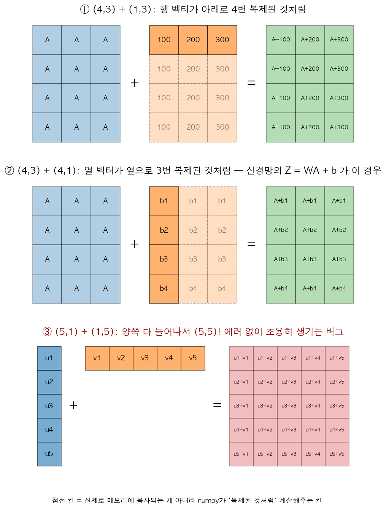

진한 칸 = 실제 배열, 점선의 연한 칸 = numpy가 "복제된 것처럼" 취급하는 칸. ①은 행 벡터가 아래로, ②는 열 벡터가 옆으로 늘어난다 — 신경망에서 `(n, 1)`짜리 $b$를 `(n, m)`에 더하는 게 ②다(각 unit의 bias가 모든 샘플 열에 똑같이 더해짐). ③이 함정: 두 쪽 다 1인 차원이 있어서 **양쪽이 동시에** 늘어나 `(5,5)`가 된다. 원래 원소별로 5개를 더하려던 거라면 에러가 나야 정상인데 조용히 25개짜리 결과가 나온다.

### Rank-1 array 함정 — 꼭 조심할 것

```python
a = np.random.randn(5)
a.shape        # (5,)  <- 이게 문제. 이건 벡터도 행렬도 아닌 "rank 1 array"
a.T.shape      # (5,)  <- transpose 해도 그대로! 기대와 다르게 동작
np.dot(a, a.T) # 스칼라가 나옴 (내적처럼 동작) -> 외적(5x5 행렬)을 기대했다면 버그
```

`(5,)` 같은 shape은 행 벡터도 열 벡터도 아니라서 transpose가 아무 효과가 없고, 곱셈 결과도 직관과 다르게 나올 수 있다. 위의 broadcasting과 섞이면 더 무섭다 — `(5,)`와 `(5,1)`을 더하면 `(5,5)`가 된다. **해결책은 딱 하나, shape을 항상 명시적으로 지정하는 습관**이다.

```python
a = np.random.randn(5, 1)     # 명확한 열벡터, shape (5,1)
assert a.shape == (5, 1)      # 이렇게 assert를 박아두는 것도 좋은 습관 (비용 거의 0)
a = a.reshape(5, 1)           # 이미 rank-1이 생겼으면 reshape으로 고치기 (O(1) 연산이라 싸다)
```

`np.sum(..., axis=1)`처럼 축을 줄이는 연산은 rank-1을 만들어내는 주범이라 `keepdims=True`를 붙이자. 이게 이번 주에서 실무적으로 가장 자주 물리는 버그라서, Andrew Ng도 "rank-1 array 쓰지 마라"를 반복해서 강조한다.

---

## Week 3. Shallow Neural Network

이제 뉴런 1개(로지스틱 회귀)에서 **레이어(layer)** 개념으로 확장한다. Hidden layer 1개 + output layer 1개짜리 얕은(shallow) 신경망을 다룬다. 핵심 아이디어: **로지스틱 회귀 여러 개를 병렬로(hidden layer) 돌리고, 그 출력들을 다시 로지스틱 회귀 하나(output layer)에 넣는 것.**

**layer란**: 같은 입력을 받아 동시에(병렬로) 계산되는 뉴런들의 묶음. 한 layer의 출력 전체가 다음 layer의 입력이 된다. 이번 주 내내 쓰는 예시 네트워크(입력 3개 → hidden unit 4개 → 출력 1개)는 이렇게 생겼다:

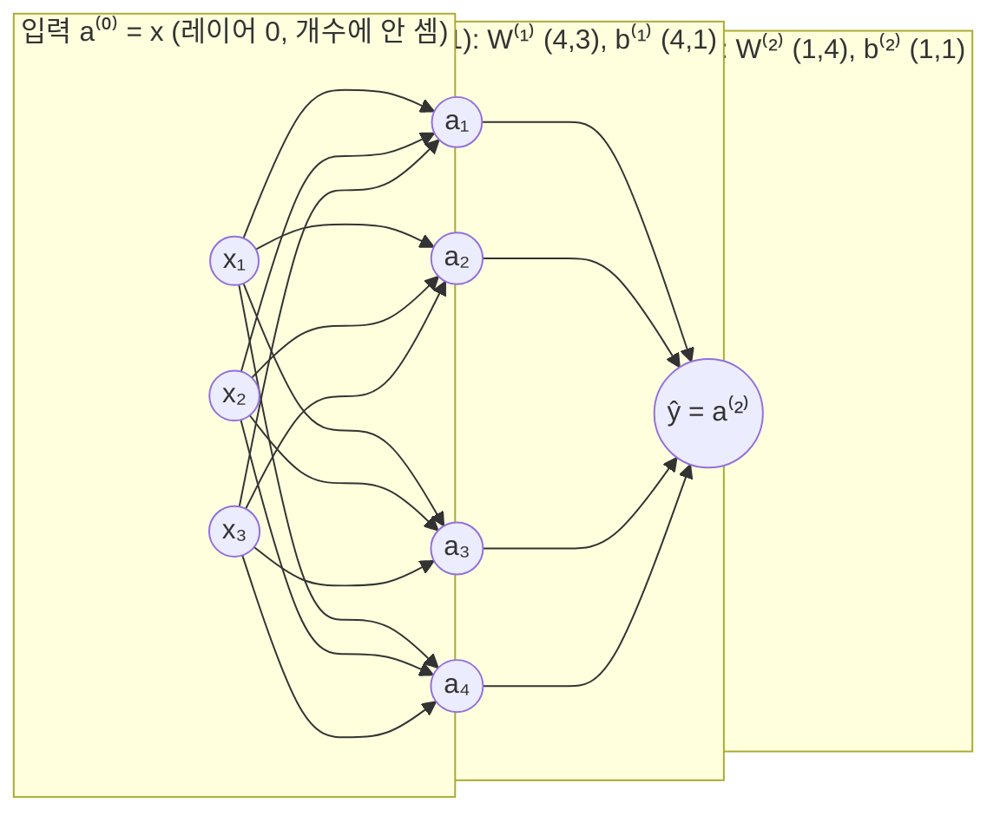

(mermaid에서 위첨자 대괄호를 쓸 수 없어서 $W^{[1]}$을 W⁽¹⁾처럼 적었다.) 동그라미 하나하나가 "가중합 → activation"을 하는 로지스틱 회귀 unit이다. 화살표 하나 = weight 하나라서, 입력→hidden 화살표 $3 \times 4 = 12$개가 $W^{[1]}$ `(4,3)`의 원소 12개, hidden→출력 화살표 4개가 $W^{[2]}$ `(1,4)`의 원소 4개다.

### 표기법 확장

- 레이어 번호는 위첨자 대괄호: $W^{[1]}, b^{[1]}$ = 첫 번째 레이어(hidden layer)의 파라미터, $W^{[2]}, b^{[2]}$ = 두 번째 레이어(output layer).
- $a^{[l]}$ = $l$번째 레이어의 activation, $a^{[0]} = x$ (입력을 레이어 0으로 취급).
- 입력층은 레이어 개수에 안 센다 — input + hidden 1개 + output이면 "2-layer NN".
- 샘플 번호까지 합치면 $a^{[l](i)}$ = "$i$번째 샘플의 $l$번째 레이어 activation". 대괄호는 레이어, 소괄호는 샘플 — Week 2에서 잡아둔 구분이 여기서 그대로 쓰인다. 아래첨자는 레이어 안의 unit 번호: $a^{[1]}_2$ = hidden layer의 2번째 unit.
- Hidden layer 유닛이 4개, 입력 feature가 3개라면 $W^{[1]} \in \mathbb{R}^{4\times 3}$, $b^{[1]} \in \mathbb{R}^{4\times 1}$. **"(현재 레이어 유닛 수, 이전 레이어 유닛 수)"가 $W$의 shape 규칙**이다 — 이건 Week 4에서 일반화한다.

### Forward Propagation (벡터화)

**unit 하나 = 로지스틱 회귀 하나**: hidden unit $j$는 자기만의 가중치 $w^{[1]}_j$ `(3, 1)`와 $b^{[1]}_j$로

$$z^{[1]}_j = w^{[1]T}_j x + b^{[1]}_j, \qquad a^{[1]}_j = g(z^{[1]}_j)$$

를 계산한다. ($g$는 "activation function 자리"를 뜻하는 일반 기호다. 로지스틱 회귀에서는 그 자리에 항상 sigmoid $\sigma$가 들어갔는데, 신경망에서는 tanh, ReLU 등 다른 함수를 넣을 수도 있어서 $g$로 비워둔다 — 어떤 걸 넣는지는 아래 Activation 절.) 4개 unit을 for문으로 돌리는 대신, 각 unit의 $w^{[1]T}_j$(가로 줄)를 **위아래로 쌓아서** 행렬 $W^{[1]}$을 만들면:

$$
\underbrace{\begin{bmatrix} — w^{[1]T}_1 — \\ — w^{[1]T}_2 — \\ — w^{[1]T}_3 — \\ — w^{[1]T}_4 — \end{bmatrix}}_{W^{[1]}:\ (4,\,3)} \underbrace{\begin{bmatrix} x_1 \\ x_2 \\ x_3 \end{bmatrix}}_{(3,\,1)} + \underbrace{\begin{bmatrix} b^{[1]}_1 \\ \vdots \\ b^{[1]}_4 \end{bmatrix}}_{(4,\,1)} = \begin{bmatrix} z^{[1]}_1 \\ \vdots \\ z^{[1]}_4 \end{bmatrix}
$$

**$W$의 행 = unit 하나**. 그래서 행 개수 = 현재 레이어 unit 수, 열 개수 = 입력 개수. shape 규칙이 이 그림에서 나온다.

샘플 1개 기준:

$$
z^{[1]} = W^{[1]}x + b^{[1]}, \quad a^{[1]} = g^{[1]}(z^{[1]})
$$

$$
z^{[2]} = W^{[2]}a^{[1]} + b^{[2]}, \quad a^{[2]} = g^{[2]}(z^{[2]}) = \hat{y}
$$

두 번째 줄은 입력이 $x$ 대신 $a^{[1]}$인 로지스틱 회귀 그 자체다 ($W^{[2]}$: `(1, 4)`).

$m$개 샘플을 열로 쌓은 $X$ 전체로 확장 ($Z^{[1]}, A^{[1]}$ 등은 각 열이 한 샘플):

$$
Z^{[1]} = W^{[1]}X + b^{[1]}, \quad A^{[1]} = g^{[1]}(Z^{[1]})
$$

$$
Z^{[2]} = W^{[2]}A^{[1]} + b^{[2]}, \quad A^{[2]} = g^{[2]}(Z^{[2]})
$$

$A^{[1]}$ `(4, m)`을 읽는 법: **가로(열) 방향 = 샘플**, **세로(행) 방향 = hidden unit**. $A^{[1]}$의 (2행, 5열) = 5번째 샘플에 대한 2번째 hidden unit의 activation.

for문은 "샘플 개수만큼"도 "unit 개수만큼"도 아니라 오직 **"레이어 개수만큼"**만 남는다 — 이게 벡터화의 핵심 이득이다.

### Activation Function 선택 가이드

**activation function이 하는 일**: 뉴런은 먼저 가중합 $z$(아무 실수나 나올 수 있음)를 계산하고, 그걸 activation function $g$에 통과시켜 출력 $a = g(z)$를 만든다. $g$는 "$z$를 어떤 모양으로 휘거나 자를지"를 정하는 함수다 — sigmoid는 0~1로 눌러 담고, ReLU는 음수를 0으로 자른다. 이 휘는 과정이 없으면 신경망이 아무 의미가 없어진다는 게 다음 절 내용이고, 여기서는 "어떤 모양의 $g$가 학습이 잘 되나"를 비교한다. 비교 기준은 거의 하나다: **backprop 때 곱해지는 도함수 $g'(z)$가 너무 작아지지 않는가.**

ML Specialization에서 sigmoid는 이미 봤을 거다. 여기서 tanh, ReLU, Leaky ReLU까지 비교하고 "언제 뭘 쓰는가"를 배운다. ($g$ = 일반적인 activation 함수 표기. 레이어마다 다를 수 있어서 $g^{[l]}$.)

| 함수 | 수식 | 범위 | 도함수 | 언제 쓰나 |
|---|---|---|---|---|
| Sigmoid | $\sigma(z)=\frac{1}{1+e^{-z}}$ | $(0,1)$ | $a(1-a)$ | **output layer**에서 이진 분류일 때만 (확률 해석 필요할 때). hidden layer에는 거의 안 씀 |
| tanh | $\tanh(z)=\frac{e^z-e^{-z}}{e^z+e^{-z}}$ | $(-1,1)$ | $1-a^2$ | hidden layer에서 sigmoid보다 거의 항상 낫다 (평균이 0에 가까워서 다음 레이어 학습이 편해짐) |
| ReLU | $\max(0,z)$ | $[0,\infty)$ | $z>0$이면 1, $z<0$이면 0 | **기본값(default)**. 대부분의 hidden layer에서 가장 무난하게 잘 됨 |
| Leaky ReLU | $\max(0.01z, z)$ | $(-\infty,\infty)$ | $z>0$이면 1, $z<0$이면 0.01 | ReLU가 "죽는(dying ReLU)" 게 걱정될 때 |

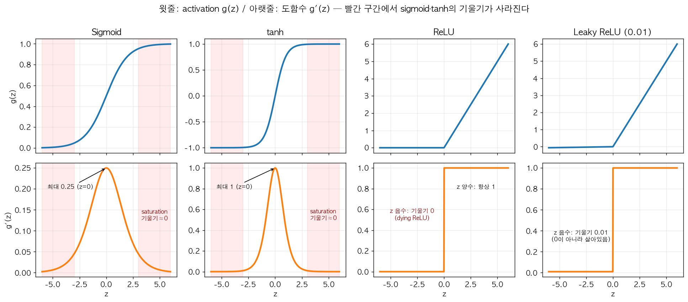

윗줄이 함수 $g(z)$, 아랫줄이 도함수 $g'(z)$다. **아랫줄만 봐도 이 절의 결론이 다 나온다**: sigmoid·tanh의 도함수는 가운데($z=0$)에서만 볼록하고 빨간 구간($|z| > 3$)에서는 거의 0 — saturation. 게다가 sigmoid는 최댓값조차 0.25라 레이어를 지날 때마다 gradient가 최소 1/4로 줄어든다. 반면 ReLU는 $z > 0$이면 기울기가 늘 1이라 줄어들지 않고, 대신 $z < 0$에서 정확히 0(dying ReLU의 원인). Leaky ReLU는 그 음수 쪽을 0.01로 살려둔 것이다(그림에선 0.01이 너무 작아 바닥에 붙어 보인다).

**각각 조금 더**:

- **tanh는 sigmoid를 늘리고 내린 것**이다: $\tanh(z) = 2\sigma(2z) - 1$. 출력이 $-1 \sim 1$이라 평균이 0 근처 — 다음 레이어 입장에서 입력이 "평균 0으로 정규화된" 효과가 난다 (Course 2의 입력 정규화와 같은 이유로 학습이 편해짐). sigmoid 출력은 항상 양수라 평균이 0.5 근처로 치우친다.
- **saturation 문제 (sigmoid, tanh 공통)**: $z = 5$면 $\sigma'(5) = 0.0066$, $\tanh'(5) = 0.00018$. backprop에서 이 값이 곱해지니 gradient가 거의 0 → 학습이 멈춘 듯 느려진다.
- **ReLU**: $z > 0$이면 기울기가 항상 1이라 saturation이 없다. $z = 0$에서는 미분이 정의 안 되지만, 정확히 0.00000…이 나올 확률은 사실상 0이라 구현에서는 그냥 0이나 1 중 하나로 정해두면 된다.
- **dying ReLU**: $z < 0$이면 기울기가 0이라, 어떤 unit의 $z$가 모든 샘플에서 음수가 되어버리면 gradient가 영원히 0 → 다시는 안 살아난다. Leaky ReLU는 음수 쪽에도 0.01의 작은 기울기를 줘서 이걸 막는다(0.01도 하이퍼파라미터로 바꿀 수 있음). 실전에서는 hidden unit이 충분히 많으면 일부가 죽어도 큰 문제가 아니라 ReLU를 그냥 쓰는 경우가 많다.

핵심 이유: sigmoid와 tanh는 $z$가 아주 크거나 작을 때 기울기가 0에 가까워져서(saturate) gradient descent가 느려진다. ReLU는 $z>0$ 구간에서 기울기가 항상 1이라 학습이 훨씬 빠르다. 이게 Week 1에서 "알고리즘 발전이 딥러닝을 가속했다"고 한 예시 중 하나가 바로 이거다.

**도함수를 출력 $a$로 쓰는 이유**: backprop 때 $g'(z)$가 필요한데, sigmoid는 $a(1-a)$, tanh는 $1-a^2$처럼 **forward에서 이미 계산한 $a$**로 바로 구할 수 있다 — Week 3 backprop 코드의 `(1 - np.power(A1, 2))`가 tanh 도함수다.

> 실무 팁(Andrew Ng): 확신 없으면 **hidden layer는 ReLU를 기본으로 쓰고**, output layer만 문제 종류에 맞춰라(이진 분류 → sigmoid, 실수 회귀 → linear, 음수 불가 회귀 → ReLU). 모든 레이어에 같은 activation을 고집할 필요 없다. 그래도 확신이 없으면 dev set으로 몇 개 시도해보면 된다. (dev set = 학습에는 안 쓰고 "어떤 설정이 더 나은지" 비교할 때만 쓰려고 떼어둔 데이터. Course 2 Week 1에서 자세히 나온다.)

### 왜 비선형(non-linear) activation이 꼭 필요한가

**선형(linear)이란**: 입력을 몇 배 하고 상수를 더하는 것만 하는 함수($f(x) = wx + b$ 꼴) — 그래프가 직선(입력이 여러 개면 평평한 판)이다. 비선형은 그 외 전부(휘거나, 꺾이거나, 잘리는 것).

먼저 숫자 하나짜리 장난감으로: activation 없이 레이어 1이 $a^{[1]} = 2x + 1$, 레이어 2가 $a^{[2]} = 3a^{[1]} - 1$이면, 대입해서 $a^{[2]} = 3(2x+1) - 1 = 6x + 2$. **레이어 두 개를 거쳤는데 결과는 그냥 직선 하나**다. 몇 층을 쌓아도 마찬가지.

행렬로 일반화하면 — 모든 레이어에서 activation을 안 쓰거나 linear activation($g(z)=z$)을 쓴다면, 2-layer만 풀어봐도:

$$a^{[2]} = W^{[2]}(W^{[1]}x + b^{[1]}) + b^{[2]} = \underbrace{(W^{[2]}W^{[1]})}_{W'}x + \underbrace{(W^{[2]}b^{[1]} + b^{[2]})}_{b'} = W'x + b'$$

레이어 두 개가 **레이어 하나($W'x + b'$)로 합쳐져버린다.** 아무리 레이어를 깊게 쌓아도 결국 **선형 함수들의 합성 = 또 다른 선형 함수**라서, 신경망 전체가 그냥 선형 회귀(output이 sigmoid면 로지스틱 회귀) 한 겹이랑 다를 게 없어진다. hidden layer가 몇 개든 표현력이 전혀 늘지 않는 것. Hidden layer가 뭔가 "흥미로운" 함수(곡선 decision boundary)를 배우려면 반드시 비선형 activation이 있어야 한다 — Lab 2에서 로지스틱 회귀가 못 푸는 꽃 모양 데이터를 hidden layer 하나로 푸는 게 이 효과다.

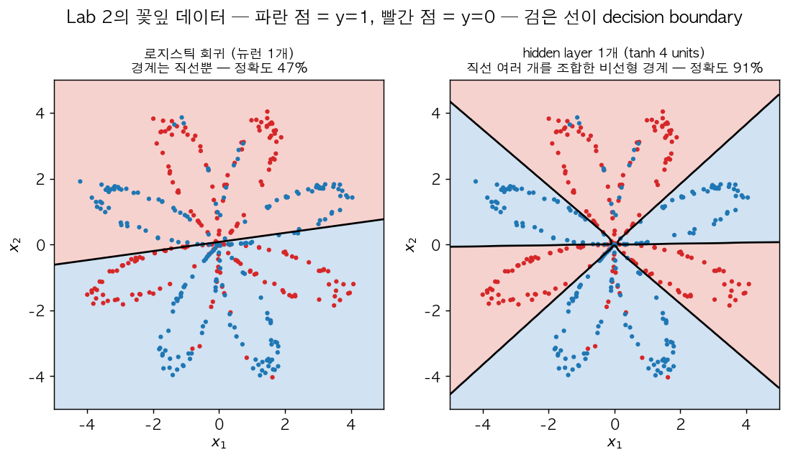

Lab 2와 같은 꽃잎 데이터를 numpy로 직접 학습시킨 결과다(검은 선 = 예측이 0.5가 되는 decision boundary, 배경색 = 그 영역에서의 예측). 왼쪽 로지스틱 회귀는 **직선 하나**로밖에 나눌 수 없어서 정확도 47% — 동전 던지기 수준이다. 오른쪽은 tanh hidden unit 4개짜리 2-layer 네트워크로 91%. 경계가 여러 방향의 선이 꺾여 이어진 모양인데, **hidden unit 각각이 직선 경계 하나씩을 담당하고 비선형 activation이 그걸 조합**해서 꽃잎을 갈라낸 것이다. 만약 tanh 자리에 linear activation을 넣으면 위 수식대로 전체가 로지스틱 회귀 하나로 합쳐져서 왼쪽 그림으로 돌아간다.

(참고로 회귀 문제의 output layer 하나 정도는 linear activation을 쓰기도 한다 — 예: 집값 예측처럼 출력이 실수 전체 범위일 때. hidden layer에 linear를 쓰는 건 압축 같은 아주 특수한 경우뿐이다.)

### 2-layer 네트워크의 Backpropagation

Week 2 로지스틱 회귀 backprop을 레이어 두 개로 늘린 것뿐이다. computation graph:

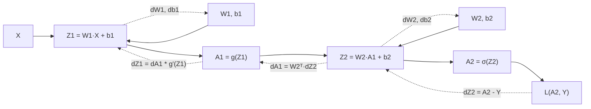

Week 2 로지스틱 회귀 그래프(x → z → a → L)가 **두 번 이어 붙은** 모양이다. 새로 생긴 건 가운데 점선 `dA1 = W2ᵀ·dZ2` 하나 — 오차를 output layer에서 hidden layer로 "넘겨주는" 다리다. 이게 아래 4번째 줄의 핵심이다.

벡터화된 결과부터 보고 한 줄씩 의미를 보자 ($m$개 샘플, output은 sigmoid):

$$
\begin{aligned}
dZ^{[2]} &= A^{[2]} - Y & (1, m)\\
dW^{[2]} &= \tfrac{1}{m}\,dZ^{[2]}A^{[1]T} & (1, n^{[1]})\\
db^{[2]} &= \tfrac{1}{m}\,\text{np.sum}(dZ^{[2]}, \text{axis}=1, \text{keepdims=True}) & (1, 1)\\
dZ^{[1]} &= \underbrace{W^{[2]T}dZ^{[2]}}_{dA^{[1]}} * g^{[1]\prime}(Z^{[1]}) & (n^{[1]}, m)\\
dW^{[1]} &= \tfrac{1}{m}\,dZ^{[1]}X^T & (n^{[1]}, n_x)\\
db^{[1]} &= \tfrac{1}{m}\,\text{np.sum}(dZ^{[1]}, \text{axis}=1, \text{keepdims=True}) & (n^{[1]}, 1)
\end{aligned}
$$

- **1~3줄 (output layer)**: 로지스틱 회귀와 완전히 같다. 입력이 $X$ 대신 $A^{[1]}$일 뿐 — Week 2의 $dw = \frac1m XdZ^T$에서 $X \to A^{[1]}$. (단 여기서 $W^{[2]}$는 행벡터라 $dw$의 전치 모양이 된다.)
- **4줄 — 오차를 한 레이어 뒤로 보내기 (핵심)**. 두 단계로 나뉜다:
  - $dA^{[1]} = W^{[2]T}dZ^{[2]}$: forward에서 $z^{[2]} = \sum_j W^{[2]}_j a^{[1]}_j + b$였으니 $\frac{\partial z^{[2]}}{\partial a^{[1]}_j} = W^{[2]}_j$. 즉 **hidden unit $j$가 출력 오차에 대해 받는 책임 = 그 unit이 출력에 연결된 weight × 출력 오차**. 출력에 큰 weight로 연결된 unit일수록 오차의 책임을 많이 진다. 출력 unit이 여러 개면 여러 출력으로부터 받은 책임을 합해야 하는데, 그 "weight 곱해서 합치기"가 정확히 $W^T$ 곱셈이다. shape 검산: $(n^{[1]}, 1)(1, m) = (n^{[1]}, m)$ ✓ — $A^{[1]}$과 같은 shape.
  - $* \ g^{[1]\prime}(Z^{[1]})$: 그다음 activation을 통과해 $z$로 넘어가는데, 각 unit의 activation은 **자기 $z$에만** 의존하니까 원소별 곱($*$, numpy의 `*`)이다. 행렬곱이 아니다. tanh면 $g' = 1 - A^{[1]2}$, ReLU면 `(Z1 > 0)`.
- **5~6줄**: 1~3줄과 같은 패턴을 hidden layer에 반복. 입력이 $X$.

**$\frac1m$과 `axis=1`**: $dW$와 $db$는 파라미터의 gradient라서 **모든 샘플에 대한 평균**이다. $dZ$는 샘플별 값이라 평균 안 낸다. `np.sum(dZ, axis=1, keepdims=True)`는 "샘플 방향(열 방향)으로 더해서 unit별 하나씩" → $(n^{[l]}, 1)$로 $b$와 같은 shape.

**모든 gradient는 대응되는 변수와 shape이 같다** ($dW^{[1]}$과 $W^{[1]}$, $dZ^{[1]}$과 $Z^{[1]}$, ...). 공식이 헷갈리면 이것만으로 대부분 복원된다 — 예: $dW^{[1]}$ `(n1, n_x)`를 $dZ^{[1]}$ `(n1, m)`와 $X$ `(n_x, m)`로 만들려면 $dZ^{[1]}X^T$뿐.

### Random Initialization — 대칭성(symmetry) 문제

로지스틱 회귀에서는 $w=0$으로 초기화해도 문제없었다. 근데 신경망에서 **모든 가중치를 0(또는 같은 값)으로 초기화하면 절대 안 된다.**

이유를 hidden unit 2개로 따라가보자. $W^{[1]} = \begin{bmatrix}0&0\\0&0\end{bmatrix}$이면:
1. **forward**: 두 unit의 가중치가 같으니 $a^{[1]}_1 = a^{[1]}_2$ — 모든 샘플에서 똑같은 값.
2. **backward**: $W^{[2]}$도 같은 값이면 $dA^{[1]} = W^{[2]T}dZ^{[2]}$의 두 행이 같고, 따라서 $dz^{[1]}_1 = dz^{[1]}_2$ → $dW^{[1]}$의 두 행이 같다.
3. **update**: 같은 값에서 같은 gradient를 빼니 업데이트 후에도 $W^{[1]}$의 두 행이 여전히 같다.

수학적 귀납법처럼 1→2→3이 매 iteration 반복되니까, 아무리 학습을 반복해도 **그 유닛들이 영원히 똑같은 함수를 계산**하게 된다 (symmetry breaking이 안 됨). hidden unit 100개를 둬도 사실상 1개인 셈 — Hidden unit을 여러 개 두는 의미가 사라지는 거다. (Course 2 Lab 1에서 같은 값으로 초기화한 뒤 200번 학습해도 W1의 4개 행이 완전히 똑같은 걸 확인한다.)

그래서 $W$는 작은 랜덤값으로 초기화한다 — 시작부터 unit마다 달라서 다른 gradient를 받고, 서로 다른 feature를 배우게 된다.

```python
W1 = np.random.randn(n1, n0) * 0.01
b1 = np.zeros((n1, 1))   # b는 0으로 초기화해도 대칭성 문제 없음 (W가 이미 깨줌)
```

왜 `*0.01`처럼 **작게** 만드는가: $W$가 크면 $z=Wx+b$도 커지고, sigmoid/tanh 기준으로 $z$가 크면 기울기가 0에 가까운 saturate 구간에 걸려서 학습이 느려진다. 예를 들어 `randn * 100`이면 $z$가 수백 단위로 나와서 tanh가 거의 전부 ±1에 붙어버린다. 그래서 초기값은 작게 잡아서 활성값이 기울기가 살아있는 구간에서 시작하게 만든다. (레이어가 아주 깊어지면 이 `0.01` 같은 고정 상수 대신 입력 개수에 맞춘 Xavier/He 초기화를 쓰는데, 그건 Course 2에서 다룰 내용이다.)

### 미니 코드 스니펫 — 1 hidden layer 학습 루프

```python
import numpy as np

def sigmoid(z): return 1 / (1 + np.exp(-z))

def forward(X, W1, b1, W2, b2):
    Z1 = np.dot(W1, X) + b1         # (n1, m)
    A1 = np.tanh(Z1)                # hidden layer
    Z2 = np.dot(W2, A1) + b2        # (1, m)
    A2 = sigmoid(Z2)                # output layer (binary classification)
    return Z1, A1, Z2, A2

def backward(X, Y, Z1, A1, A2, W2):
    m = X.shape[1]
    dZ2 = A2 - Y
    dW2 = (1/m) * np.dot(dZ2, A1.T)
    db2 = (1/m) * np.sum(dZ2, axis=1, keepdims=True)
    dZ1 = np.dot(W2.T, dZ2) * (1 - np.power(A1, 2))   # dA1 * tanh 도함수(원소별)
    dW1 = (1/m) * np.dot(dZ1, X.T)
    db1 = (1/m) * np.sum(dZ1, axis=1, keepdims=True)
    return dW1, db1, dW2, db2
```

위의 backprop 6줄이 그대로 코드가 됐다. `axis=1, keepdims=True`를 꼭 챙기자 — 안 그러면 다시 rank-1 array 함정에 빠진다.

---

## Week 4. Deep L-layer Network

이제 hidden layer가 여러 개인 진짜 "딥"러닝으로 간다. 구조 자체는 Week 3이랑 똑같고, 레이어 개수만 $L$개로 일반화하는 거다. 로지스틱 회귀 = 1-layer, Week 3 = 2-layer, 이제 $L$-layer. "얼마나 깊어야 deep인가"에 정답은 없고, 로지스틱 회귀부터 시작해서 hidden layer 개수를 하이퍼파라미터처럼 늘려가며 dev set으로 평가하는 게 일반적이다.

### 표기법 일반화

- $L$ = 전체 레이어 개수 (output layer 포함, 입력층은 세지 않음).
- $n^{[l]}$ = $l$번째 레이어의 유닛(노드) 개수. $n^{[0]} = n_x$(입력 feature 수).
- $a^{[l]} = g^{[l]}(z^{[l]})$, $a^{[0]} = X$, $a^{[L]} = \hat{y}$.

예: 입력 3개 → hidden 5, 5, 3 → 출력 1이면 $L = 4$, $n^{[0]} = 3, n^{[1]} = 5, n^{[2]} = 5, n^{[3]} = 3, n^{[4]} = 1$.

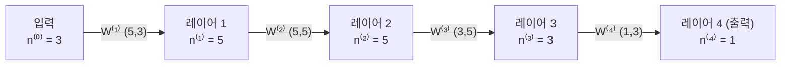

상자 하나 = 레이어 하나(안의 unit 개수 표시), 화살표 = 그 사이를 잇는 weight 행렬. 화살표에 적힌 shape이 항상 **(화살표 끝 상자의 unit 수, 화살표 시작 상자의 unit 수)**인 걸 확인하자 — 바로 아래 shape 규칙이 이거다. 입력 상자는 레이어 수에 안 세니 $L = 4$.

### 차원(shape) 체크표 — 이 코스에서 제일 자주 쓰는 표

레이어를 몇 개를 쌓든, **아래 규칙만 지키면 차원 에러가 안 난다.**

| 변수 | Shape | 비고 |
|---|---|---|
| $W^{[l]}$ | $(n^{[l]}, n^{[l-1]})$ | (현재 레이어 유닛 수, 이전 레이어 유닛 수) — 행 하나 = unit 하나 |
| $b^{[l]}$ | $(n^{[l]}, 1)$ | broadcasting으로 $m$개 샘플에 확장됨 |
| $Z^{[l]}, A^{[l]}$ | $(n^{[l]}, m)$ | $m$ = 샘플 개수(배치 전체) |
| $dW^{[l]}$ | $(n^{[l]}, n^{[l-1]})$ | $W^{[l]}$과 shape 동일 |
| $db^{[l]}$ | $(n^{[l]}, 1)$ | $b^{[l]}$과 shape 동일 |
| $dZ^{[l]}, dA^{[l]}$ | $(n^{[l]}, m)$ | $Z^{[l]}, A^{[l]}$과 shape 동일 |

**규칙이 왜 이런지 검산**: $Z^{[l]} = W^{[l]}A^{[l-1]} + b^{[l]}$에서 $(n^{[l]}, n^{[l-1]}) \times (n^{[l-1]}, m) = (n^{[l]}, m)$ — 가운데 $n^{[l-1]}$이 맞물려 사라진다. 위 예시($n = [3, 5, 5, 3, 1]$)면 $W^{[1]}$ `(5, 3)`, $W^{[2]}$ `(5, 5)`, $W^{[3]}$ `(3, 5)`, $W^{[4]}$ `(1, 3)`. 파라미터 수 = $W$ 원소 + $b$ 원소 = $(15+5) + (25+5) + (15+3) + (3+1) = 72$.

**습관**: 코드를 짜다가 막히면 종이에 이 표부터 채워보라는 게 Andrew Ng의 조언이다. `assert W1.shape == (n1, n0)` 같은 assert를 실제 코드에 박아두는 것도 실무에서 매우 유용하다.

### 왜 Deep인가 (레이어를 깊게 쌓는 이유)

같은 파라미터 수라면 "넓고 얕게"보다 "좁고 깊게"가 유리한 경우가 많다는 게 이 절의 주장이다. 두 가지 직관을 강의에서 제시한다.

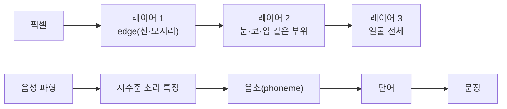

1. **계층적 feature 학습(hierarchical feature learning)**: 예를 들어 얼굴 인식이면, 앞쪽 레이어는 edge(선) 같은 단순한 패턴을 찾고(이미지의 작은 영역만 봄), 중간 레이어는 그 edge들을 모아 눈·코·입 같은 부위를 찾고, 뒤쪽 레이어는 그 부위들을 모아 얼굴 전체를 인식한다. 음성도 비슷하다: 파형의 저수준 특징 → 음소(phoneme, "c-a-t"의 각 소리) → 단어 → 문장. 즉 **단순한 것 → 복잡한 것으로 계층적으로 쌓아 올리는** 구조라서, 앞 레이어가 만든 부품을 뒤 레이어가 재활용한다. 얕은 네트워크로 같은 일을 하려면 이 재활용이 안 되니 유닛 수가 기하급수적으로 더 많이 필요해진다.
2. **회로 이론(circuit theory) 직관**: 먼저 XOR(배타적 논리합)은 "두 입력이 서로 다르면 1, 같으면 0"인 연산이다($0 \oplus 1 = 1$, $1 \oplus 1 = 0$). 여러 개를 이어서 XOR하면 "1의 개수가 홀수면 1"이 된다 — 예: $1 \oplus 0 \oplus 1 \oplus 1$은 1이 3개(홀수)라 1. 여기서 '회로'는 AND/OR/NOT/XOR 같은 논리 게이트를 이어 붙인 것을 말하고, 신경망의 unit 하나를 게이트 하나처럼 생각하자는 비유다. 예를 들어 $n$개의 입력 변수의 XOR($x_1 \oplus x_2 \oplus \cdots \oplus x_n$)을 계산하는 문제가 있으면, 깊은 네트워크는 두 개씩 짝지어 XOR하는 **트리 구조**로 $O(\log n)$ 레이어(총 unit $O(n)$개)로 풀 수 있다. 얕은(hidden layer 1개짜리) 네트워크로 똑같은 걸 하려면 입력의 가능한 조합 $2^n$개를 거의 다 열거해야 해서 유닛 수가 $O(2^n)$으로 지수적으로 늘어난다. 즉 "깊이"가 "너비"를 대체하면서 필요한 파라미터 수를 극적으로 줄여준다.

그렇다고 무조건 깊게 쌓는 게 능사는 아니다 — 레이어 개수(L), hidden unit 개수 같은 건 정답이 정해진 게 아니라 **경험적으로 실험해서(hyperparameter search)** 찾는 값이다. 아래에서 바로 이어진다.

### Forward/Backward 블록 구조와 Cache

레이어 하나하나를 "블록(block)"으로 생각하면 편하다.

- **Forward 블록** ($l$번째): 입력 $a^{[l-1]}$을 받아서 $z^{[l]} = W^{[l]}a^{[l-1]} + b^{[l]}$, $a^{[l]} = g^{[l]}(z^{[l]})$을 계산하고 출력 $a^{[l]}$을 다음 블록에 넘긴다. 이때 **$z^{[l]}$(그리고 $A^{[l-1]}, W^{[l]}, b^{[l]}$)을 "cache"(나중에 다시 쓰려고 옆에 적어두는 메모 — 코드에선 그냥 튜플을 리스트에 append하는 것)에 저장**해둔다 — backward 계산할 때 다시 필요하기 때문이다.
- **Backward 블록** ($l$번째): $da^{[l]}$을 입력으로 받아서, forward 때 저장해둔 cache를 이용해 $dz^{[l]}, dW^{[l]}, db^{[l]}, da^{[l-1]}$을 계산하고, $da^{[l-1]}$을 앞쪽 블록으로 넘긴다.

**왜 이것들을 cache하나** — 아래 backward 공식에 무엇이 들어가는지 보면 된다: $g'(Z^{[l]})$에 $Z^{[l]}$, $dW^{[l]}$에 $A^{[l-1]}$, $dA^{[l-1]}$에 $W^{[l]}$. 전부 forward에서 이미 계산한 값이다. Week 2 computation graph 예시에서 `db = 3 × c`에 forward 값 $c$가 필요했던 것과 같은 이유.

전체 흐름을 그리면:

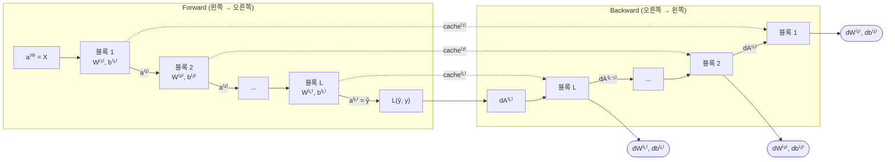

그림 읽는 법: 윗줄 forward에서 블록 $l$은 $a^{[l-1]}$을 받아 $a^{[l]}$을 넘기면서, 계산 중간값을 **cache**(점선)로 같은 번호의 backward 블록에 맡겨둔다. 아랫줄 backward는 반대 방향으로 $dA$를 넘기면서, 맡겨둔 cache를 꺼내 쓰고, 옆으로 $dW, db$(둥근 상자)를 내놓는다. 이 $dW, db$로 모든 레이어를 한꺼번에 업데이트하면 한 iteration 끝.

한 iteration = forward 한 번(왼→오) + backward 한 번(오→왼) + 모든 $W^{[l]}, b^{[l]}$ 업데이트.

레이어별로 필요한 미분 공식은 Week 3에서 본 거랑 형태가 똑같고, 인덱스만 $l$로 일반화된다.

$$
dZ^{[l]} = dA^{[l]} * g^{[l]\prime}(Z^{[l]}) \qquad (\text{원소별 곱})
$$

$$
dW^{[l]} = \frac{1}{m}dZ^{[l]}A^{[l-1]T}, \quad db^{[l]} = \frac{1}{m}\text{np.sum}(dZ^{[l]}, \text{axis=1, keepdims=True})
$$

$$
dA^{[l-1]} = W^{[l]T}dZ^{[l]}
$$

**시작점 $dA^{[L]}$**: 맨 끝 블록에 넣을 초기값은 loss를 $A^{[L]}$로 미분한 것 — Week 2의 `da`를 벡터화한 것이다:

$$dA^{[L]} = -\frac{Y}{A^{[L]}} + \frac{1-Y}{1-A^{[L]}} \quad (\text{원소별 나눗셈})$$

코드로는 `dAL = -(np.divide(Y, AL) - np.divide(1 - Y, 1 - AL))`. 이걸 sigmoid backward 블록에 넣으면 $dZ^{[L]} = dA^{[L]} * A^{[L]}(1-A^{[L]}) = A^{[L]} - Y$로 Week 2 결과와 똑같이 나온다.

### 미니 코드 스니펫 — L-layer forward 루프

```python
import numpy as np

def linear_activation_forward(A_prev, W, b, activation):
    Z = np.dot(W, A_prev) + b
    if activation == "relu":
        A = np.maximum(0, Z)
    elif activation == "sigmoid":
        A = 1 / (1 + np.exp(-Z))
    cache = (A_prev, W, b, Z)   # 나중에 backward에서 다시 쓸 값들
    return A, cache

def L_model_forward(X, parameters, L):
    caches = []
    A = X
    for l in range(1, L):                          # 1 ~ L-1: hidden layers
        A_prev = A
        W, b = parameters[f"W{l}"], parameters[f"b{l}"]
        A, cache = linear_activation_forward(A_prev, W, b, "relu")
        caches.append(cache)
    WL, bL = parameters[f"W{L}"], parameters[f"b{L}"]
    AL, cache = linear_activation_forward(A, WL, bL, "sigmoid")  # output layer
    caches.append(cache)
    return AL, caches
```

for문이 "레이어 개수 $L$번"만큼만 도는 게 포인트다 — 레이어는 순서대로 계산해야 하니(앞 레이어 출력이 있어야 다음 레이어 계산 가능) 이 루프는 벡터화로 못 없앤다. 이 안에서 다시 샘플 루프를 도는 순간 벡터화가 깨진 것이니 조심하자. backward는 이 `caches`를 **거꾸로**($l = L, L-1, \dots, 1$) 꺼내 쓰면서 위 공식을 반복한다 (Lab 3).

### Parameters vs Hyperparameters

- **Parameters** — 학습 알고리즘(gradient descent)이 **데이터로부터 직접 학습**하는 값. $W^{[1]}, b^{[1]}, W^{[2]}, b^{[2]}, \dots$
- **Hyperparameters** — 학습이 시작되기 전에 **사람이 미리 정해야 하는** 값. 이 값들이 결국 parameters가 어떻게 학습될지(최종적으로 어떤 $W, b$에 도착할지)를 "제어(control)"한다.
  - learning rate $\alpha$
  - iteration 횟수
  - hidden layer 개수 $L$
  - 각 레이어의 hidden unit 개수 $n^{[l]}$
  - activation function 종류
  - (나중 코스에서: momentum, mini-batch 크기, regularization 파라미터 등)

하이퍼파라미터는 정답이 있는 게 아니라서, **Idea → Code → Experiment**를 계속 반복하면서 실험적으로 감을 잡아야 한다. 예: $\alpha$를 0.01, 0.03, 0.1로 돌려서 cost vs iteration 그래프를 겹쳐 그리고, 가장 빨리·안정적으로 내려가는 걸 고른다 (너무 크면 $J$가 튀거나 발산).

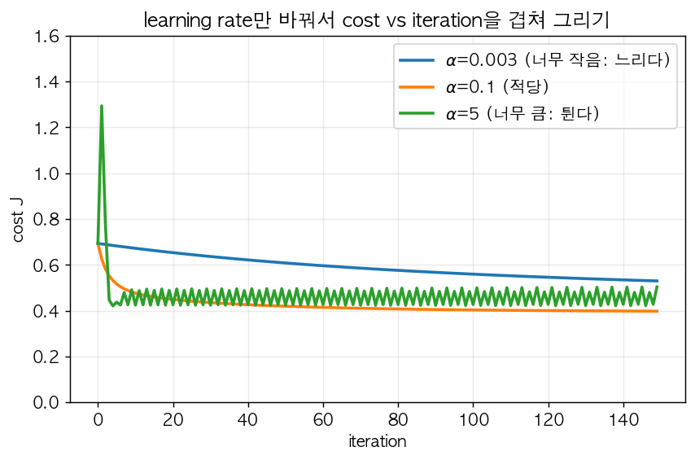

장난감 2D 데이터에 로지스틱 회귀를 150 iteration 돌리면서 $\alpha$만 바꾼 결과다. 파랑($\alpha=0.003$)은 안정적이지만 150번 동안 0.69 → 0.53밖에 못 내려왔다 — 너무 소심하다. 주황($\alpha=0.1$)은 빠르게 내려가서 가장 낮은 0.40에 도달. 초록($\alpha=5$)은 첫 스텝에서 cost가 오히려 1.29로 **튀어 오르고**, 이후에도 톱니처럼 오르내린다 — 보폭이 너무 커서 바닥을 계속 건너뛰는 것(더 크면 아예 발산). 위의 1D gradient descent 그림에서 보폭이 바닥 폭보다 커지면 반대편 벽으로 넘어가 버리는 상황을 떠올리면 된다. 이렇게 **cost 곡선 모양만 보고도 $\alpha$가 작은지/큰지 판단**할 수 있다. Andrew Ng은 이걸 "딥러닝은 매우 경험적인(empirical) 프로세스"라고 표현한다 — 처음부터 최적값을 안다는 보장이 없고, 다른 도메인(비전 → 음성)에서의 직관이 그대로 통하지 않을 때도 많고, 같은 문제도 데이터·GPU가 바뀌면 최적값이 바뀐다. 그러니 몇 달에 한 번씩은 다시 튜닝해보는 게 좋다. 체계적인 튜닝 방법은 Course 2 Week 3에서 다룬다.

### "그래서 뇌(brain)와 무슨 관계가 있나?"

신경망(neural network)이라는 이름 때문에 사람 뇌를 그대로 모방한 거라고 오해하기 쉬운데, Andrew Ng은 이 비유를 **아주 약하게만** 받아들이라고 강의에서 여러 번 경고한다. 하나의 뉴런이 신호를 받아서 활성화되는 걸 "입력을 받아 activation을 계산하는 로지스틱 유닛"에 느슨하게 비유한 것뿐이지, 실제 생물학적 뉴런이 어떻게 학습하는지는 아직도 신경과학적으로 제대로 규명되지 않았다. 딥러닝 알고리즘(gradient descent, backprop)이 뇌의 학습 방식과 실제로 같다는 근거는 없다. 그러니 "인공신경망 = 뇌를 흉내낸 것"이라는 대중적 프레이밍에 너무 의미를 두지 말고, 그냥 **입력→출력을 매핑하는 함수 근사기(function approximator)를 레이어로 쌓은 것**이라는 수학적 관점으로 이해하는 게 훨씬 정확하다.

---

## 핵심 요약

- 딥러닝이 뜬 이유는 데이터·연산·알고리즘 세 축의 스케일업이다. 데이터가 많아질수록 큰 신경망이 전통 알고리즘의 성능 정체(plateau)를 뚫고 계속 좋아진다. 빠른 학습 = 빠른 실험 반복이라는 점도 중요.
- $X$는 `(n_x, m)`, 샘플은 항상 **열(column)** 로 쌓는다. 그래야 $w^TX$ 한 번에 모든 샘플이 계산되고, 이 규칙이 이후 모든 shape 계산의 기준이 된다.
- Loss(샘플 1개) vs Cost(전체 평균)를 구분한다. Cross-entropy loss는 maximum likelihood에서 나오고, cost를 convex하게 만들어 gradient descent가 안정적으로 수렴하게 한다. 확신을 갖고 틀릴수록 벌점이 폭발적으로 커진다.
- Backprop = computation graph 위에서 chain rule로 미분을 곱하며 오른쪽→왼쪽으로 전달하는 것. 국소 미분에 forward 값이 필요해서 cache가 생긴다.
- Logistic regression의 역전파는 $dz = a-y$ 하나로 요약된다(cross-entropy와 sigmoid 미분이 약분된 결과). $dw = x\,dz$, $db = dz$. 이 패턴은 신경망 output layer에서도 그대로 반복된다.
- Vectorization(for문 제거): $dw = \frac1m XdZ^T$ 한 줄이 샘플 루프 + feature 루프를 대체한다. broadcasting도 편리하지만 의도치 않게 발생할 수 있으니 shape을 항상 의심할 것. rank-1 array `(n,)`는 쓰지 말 것.
- Activation function은 hidden layer에는 기본적으로 ReLU, output layer는 문제 성격에 맞춰(이진 분류 → sigmoid) 고른다. Non-linear activation이 없으면 $W^{[2]}W^{[1]}$이 하나의 행렬로 합쳐져서 아무리 깊게 쌓아도 선형 모델과 다를 게 없다.
- 2-layer backprop의 핵심: $dA^{[1]} = W^{[2]T}dZ^{[2]}$(출력 오차를 연결 weight만큼 hidden unit에 분배) → $dZ^{[1]} = dA^{[1]} * g'(Z^{[1]})$(원소별).
- 가중치는 반드시 작은 랜덤값으로 초기화한다(symmetry breaking — 같은 값이면 forward/backward/update가 계속 같아서 unit들이 영원히 복제본). $b$는 0으로 초기화해도 무방하다.
- Deep network의 shape 규칙: $W^{[l]}: (n^{[l]}, n^{[l-1]})$, $b^{[l]}: (n^{[l]}, 1)$, $Z^{[l]}, A^{[l]}: (n^{[l]}, m)$. $dW, db, dZ, dA$는 각각 대응되는 변수와 shape이 같다 — 공식이 기억 안 나면 shape으로 복원.
- Forward에서 cache(주로 $Z^{[l]}, W^{[l]}, b^{[l]}, A^{[l-1]}$)를 저장해둬야 backward에서 재사용할 수 있다. backward의 시작점은 $dA^{[L]} = -\frac{Y}{A^{[L]}} + \frac{1-Y}{1-A^{[L]}}$.
- Parameters(학습되는 값)와 Hyperparameters(사람이 미리 정하는 값)를 구분하고, 하이퍼파라미터 튜닝은 Idea-Code-Experiment 반복이 기본이라는 걸 받아들이자.
- Learning rate는 cost vs iteration 곡선으로 판단한다: 너무 작으면 느리게 내려가고, 적당하면 빠르고 매끄럽게, 너무 크면 튀거나 발산한다.

## 헷갈리기 쉬운 점

- **위첨자 소괄호 vs 대괄호**: $x^{(i)}$는 $i$번째 **샘플**, $a^{[l]}$은 $l$번째 **레이어**. $a^{[l](i)}$처럼 같이 쓰이면 "$i$번째 샘플의 $l$번째 레이어 activation"이다. 아래첨자 $a^{[l]}_j$는 레이어 안의 $j$번째 unit. (Course 2에서 중괄호 $X^{\{t\}}$ = $t$번째 mini-batch가 추가된다.)
- **$X$의 shape 방향**: `(n_x, m)`이지 `(m, n_x)`가 아니다. scikit-learn 등 다른 라이브러리에 익숙하면 반대로 짜기 쉬우니 특히 주의.
- **Rank-1 array**: `(5,)` shape은 벡터도 행렬도 아니다. 항상 `(5,1)`처럼 명시적 2차원으로 만들자. `.T`가 안 먹는 것 같으면 rank-1 array를 의심할 것. `np.sum`에는 `keepdims=True`.
- **$dz=a-y$가 왜 이렇게 단순해지는가**: cross-entropy loss의 미분 $-\frac{y}{a} + \frac{1-y}{1-a}$의 분모와 sigmoid의 도함수 $a(1-a)$가 서로 약분되면서 생기는 결과다. "우연히 간단해진 것"이 아니라 이 loss와 activation 조합을 의도적으로 고른 이유이기도 하다.
- **`*`(원소별 곱) vs `np.dot`(행렬곱)**: backprop에서 $W^T dZ$는 행렬곱(여러 unit의 기여를 합침), $dA * g'(Z)$는 원소별 곱(각 unit이 자기 $z$에만 의존). 수식에서 $*$로 쓰인 곳을 `np.dot`으로 바꾸면 shape 에러가 나거나, 더 나쁘게는 조용히 틀린 값이 나온다.
- **$dW$에는 $\frac1m$이 있고 $dZ$, $dA$에는 없다**: 파라미터는 모든 샘플이 공유하니까 샘플별 gradient를 평균 내야 하고, $Z, A$는 원래 샘플별 값이라 평균 낼 이유가 없다.
- **Activation 선택**: sigmoid를 hidden layer에도 무조건 써야 한다고 착각하기 쉬운데, hidden layer 기본값은 ReLU다. Sigmoid는 output layer의 "확률이 필요할 때"로 한정해서 생각하자.
- **가중치 초기화를 0으로 하면 왜 안 되는가**: "학습이 느려진다" 정도가 아니라, 같은 레이어의 유닛들이 **영원히 서로 구분되지 않는(symmetric)** 심각한 문제다. $b=0$은 괜찮지만 $W=0$은 절대 안 된다. 로지스틱 회귀(hidden layer 없음)에서만 $w=0$ 초기화가 괜찮다.
- **ReLU도 비선형이다**: 양수 쪽이 직선이라 "선형 아닌가?" 싶지만, $z = 0$에서 꺾이기 때문에 비선형이다. 선형이려면 $g(z_1 + z_2) = g(z_1) + g(z_2)$가 항상 성립해야 하는데 $\text{ReLU}(-1 + 1) = 0 \ne \text{ReLU}(-1) + \text{ReLU}(1) = 1$. 이 "꺾임"들을 여러 unit이 조합하면 직선 하나로는 못 만드는 경계를 만들 수 있다 (decision boundary 그림 오른쪽은 tanh로 학습한 것이지만 "unit별 경계를 비선형으로 조합한다"는 원리는 같다).
- **레이어 개수 셀 때 입력층은 안 센다**: input → hidden → output은 2-layer NN. $L$은 output layer를 포함.
- **딥(deep)이 무조건 좋은 건 아니다**: 레이어를 깊게 쌓으면 회로 이론적으로 표현력은 늘어나지만, $L$이나 $n^{[l]}$ 같은 값 자체는 정답이 없고 실험으로 찾아야 하는 하이퍼파라미터다.
- **신경망 ≠ 뇌 시뮬레이션**: 이름 때문에 생기는 오해일 뿐, 생물학적 근거가 있는 비유가 아니다. 함수 근사기를 레이어로 쌓은 수학적 모델로 이해하는 게 정확하다.

---

## Lab 예제 — 직접 짜보기

> numpy + matplotlib만 쓴다. 뼈대 코드의 `TODO` 부분을 직접 채우고 실행해서 **체크포인트** 출력과 비교해보자. 막히면 접혀있는 정답을 열어보기. 전부 복붙하면 바로 돌아가는 단일 스크립트다.

### Lab 1. 벡터화된 Logistic Regression — for문 vs 벡터화

**목표**: $dZ = A - Y$, $dw = \frac{1}{m}XdZ^T$를 직접 구현하고, for문 버전과 결과는 같은데 속도가 얼마나 차이나는지 눈으로 확인한다. 마지막에 rank-1 array 함정도 직접 찍어본다.

```python
import time
import numpy as np
import matplotlib.pyplot as plt

def sigmoid(z):
    return 1 / (1 + np.exp(-z))

def propagate(w, b, X, Y):
    # w: (n_x, 1), X: (n_x, m), Y: (1, m)
    m = X.shape[1]
    A = None      # TODO: (1, m)
    cost = None   # TODO: cross-entropy cost (스칼라)
    dZ = None     # TODO: (1, m)
    dw = None     # TODO: (n_x, 1)
    db = None     # TODO: 스칼라
    return dw, db, cost

def propagate_loop(w, b, X, Y):
    # 비교용: 샘플 루프 + feature 루프 두 겹짜리 버전
    n_x, m = X.shape
    cost, dw, db = 0.0, np.zeros((n_x, 1)), 0.0
    for i in range(m):
        z = sum(w[j, 0] * X[j, i] for j in range(n_x)) + b
        a = sigmoid(z)
        cost += -(Y[0, i] * np.log(a) + (1 - Y[0, i]) * np.log(1 - a))
        dz = a - Y[0, i]
        for j in range(n_x):
            dw[j, 0] += X[j, i] * dz
        db += dz
    return dw / m, db / m, cost / m

np.random.seed(1)
m = 20000
X = np.random.randn(2, m)
Y = (X[0:1, :] + 2 * X[1:2, :] > 0.5).astype(float)   # 정답 경계: x1 + 2*x2 = 0.5
w, b = np.zeros((2, 1)), 0.0

t0 = time.time(); dw1, db1, c1 = propagate_loop(w, b, X, Y); t_loop = time.time() - t0
t0 = time.time(); dw2, db2, c2 = propagate(w, b, X, Y); t_vec = time.time() - t0
print(f"loop: {t_loop*1000:.1f}ms, vectorized: {t_vec*1000:.3f}ms")
print("같은 결과?", np.allclose(dw1, dw2), np.isclose(db1, db2), np.isclose(c1, c2))

costs = []
for i in range(1000):
    dw, db, cost = propagate(w, b, X, Y)
    # TODO: gradient descent 업데이트 (learning rate 0.5)
    if i % 100 == 0:
        costs.append(cost)
acc = np.mean((sigmoid(np.dot(w.T, X) + b) > 0.5) == Y)
print(f"train acc: {acc:.3f}, w: {w.ravel()}, b: {b:.3f}")
plt.plot(costs); plt.xlabel("iteration (x100)"); plt.ylabel("cost"); plt.show()

# rank-1 array 함정 직접 확인
a = np.random.randn(5)
print(a.shape, a.T.shape, np.dot(a, a.T).shape)
a = np.random.randn(5, 1)
print(a.shape, a.T.shape, np.dot(a, a.T).shape)
```

**체크포인트**
- `같은 결과? True True True`, 속도는 벡터화 쪽이 수십~수백 배 빠르다.
- train acc ≈ 0.99 이상, `w`의 비율이 대략 1 : 2 (정답 경계 $x_1 + 2x_2 = 0.5$와 같은 방향).
- rank-1 array는 `(5,) (5,) ()` → `.T`가 아무 효과도 없고 내적이 스칼라로 나온다. `(5,1)`로 만들면 `(5, 1) (1, 5) (5, 5)`.

<details>
<summary>정답 보기</summary>

```python
def propagate(w, b, X, Y):
    m = X.shape[1]
    A = sigmoid(np.dot(w.T, X) + b)                              # (1, m)
    cost = -np.mean(Y * np.log(A) + (1 - Y) * np.log(1 - A))
    dZ = A - Y                                                   # (1, m)
    dw = np.dot(X, dZ.T) / m                                     # (n_x, 1)
    db = np.sum(dZ) / m
    return dw, db, cost

# 학습 루프 안
    w -= 0.5 * dw
    b -= 0.5 * db
```

</details>

### Lab 2. Shallow NN으로 로지스틱 회귀가 못 푸는 데이터 풀기

**목표**: 꽃잎 모양(planar) 데이터에서 로지스틱 회귀(= hidden layer 없는 신경망)는 직선 경계밖에 못 그어서 실패하는 걸 보고, tanh hidden layer 1개짜리 신경망의 forward/backward를 직접 짜서 해결한다. hidden unit 수 $n^{[1]}$을 바꿔가며 결정 경계가 어떻게 달라지는지도 본다.

```python
import numpy as np
import matplotlib.pyplot as plt

def sigmoid(z): return 1 / (1 + np.exp(-z))

def make_flower(m=400, seed=1):
    np.random.seed(seed)
    N = m // 2
    X = np.zeros((m, 2)); Y = np.zeros((m, 1))
    for j in range(2):
        ix = range(N * j, N * (j + 1))
        t = np.linspace(j * 3.12, (j + 1) * 3.12, N) + np.random.randn(N) * 0.2
        r = 4 * np.sin(4 * t) + np.random.randn(N) * 0.2
        X[ix] = np.c_[r * np.sin(t), r * np.cos(t)]
        Y[ix] = j
    return X.T, Y.T          # X: (2, m), Y: (1, m) — 샘플은 열로!

X, Y = make_flower()

def init_params(n_x, n_h, n_y):
    # TODO: W는 작은 랜덤값(*0.01), b는 0으로
    return {"W1": None, "b1": None, "W2": None, "b2": None}

def forward(X, p):
    # TODO: Z1 -> A1(tanh) -> Z2 -> A2(sigmoid)
    A1, A2 = None, None
    return A2, (A1, A2)

def compute_cost(A2, Y):
    return -np.mean(Y * np.log(A2) + (1 - Y) * np.log(1 - A2))

def backward(X, Y, p, cache):
    m = X.shape[1]
    A1, A2 = cache
    # TODO: dZ2, dW2, db2, dZ1 (tanh 도함수 = 1 - A1^2), dW1, db1
    # 힌트: np.sum(..., axis=1, keepdims=True) 안 쓰면 rank-1 array 함정
    return {"W1": None, "b1": None, "W2": None, "b2": None}

def nn_model(X, Y, n_h, num_iter=10000, lr=1.2):
    np.random.seed(3)
    p = init_params(X.shape[0], n_h, 1)
    for i in range(num_iter):
        A2, cache = forward(X, p)
        grads = backward(X, Y, p, cache)
        for k in p:
            p[k] -= lr * grads[k]
        if i % 2000 == 0:
            print(f"  iter {i}: cost {compute_cost(A2, Y):.4f}")
    return p

def plot_boundary(predict, X, Y, title):
    xx, yy = np.meshgrid(np.linspace(X[0].min() - 1, X[0].max() + 1, 200),
                         np.linspace(X[1].min() - 1, X[1].max() + 1, 200))
    Z = predict(np.c_[xx.ravel(), yy.ravel()].T).reshape(xx.shape)
    plt.contourf(xx, yy, Z, cmap=plt.cm.Spectral, alpha=0.6)
    plt.scatter(X[0], X[1], c=Y.ravel(), s=15, cmap=plt.cm.Spectral)
    plt.title(title); plt.show()

# 비교 1: 로지스틱 회귀 (Lab 1의 propagate 재사용)
w, b = np.zeros((2, 1)), 0.0
for i in range(3000):
    A = sigmoid(np.dot(w.T, X) + b)
    w -= 0.1 * np.dot(X, (A - Y).T) / X.shape[1]
    b -= 0.1 * np.mean(A - Y)
acc_lr = np.mean((sigmoid(np.dot(w.T, X) + b) > 0.5) == Y)
print(f"logistic regression acc: {acc_lr:.3f}")
plot_boundary(lambda Xg: sigmoid(np.dot(w.T, Xg) + b) > 0.5, X, Y, "Logistic regression")

# 비교 2: hidden unit 수를 바꿔가며
for n_h in [1, 4, 20]:
    print(f"n_h = {n_h}")
    p = nn_model(X, Y, n_h)
    acc = np.mean((forward(X, p)[0] > 0.5) == Y)
    print(f"  acc: {acc:.3f}")
    plot_boundary(lambda Xg: forward(Xg, p)[0] > 0.5, X, Y, f"NN n_h={n_h}")
```

**체크포인트**
- 로지스틱 회귀 acc ≈ 0.47 — 동전 던지기 수준. 직선 하나로는 꽃잎을 못 가른다.
- `n_h=1` → acc ≈ 0.67, `n_h=4` → ≈ 0.91, `n_h=20` → ≈ 0.92. hidden unit이 1개면 사실상 로지스틱 회귀랑 비슷하고, 4개만 돼도 꽃잎 모양 경계가 생긴다.
- 모든 레이어를 linear activation으로 바꾸면(`np.tanh` 대신 그냥 `Z1`) 어떻게 되는지도 직접 해보자 → n_h를 아무리 늘려도 로지스틱 회귀 수준으로 떨어진다(비선형 activation이 필요한 이유).

<details>
<summary>정답 보기</summary>

```python
def init_params(n_x, n_h, n_y):
    W1 = np.random.randn(n_h, n_x) * 0.01
    b1 = np.zeros((n_h, 1))
    W2 = np.random.randn(n_y, n_h) * 0.01
    b2 = np.zeros((n_y, 1))
    return {"W1": W1, "b1": b1, "W2": W2, "b2": b2}

def forward(X, p):
    Z1 = np.dot(p["W1"], X) + p["b1"]
    A1 = np.tanh(Z1)
    Z2 = np.dot(p["W2"], A1) + p["b2"]
    A2 = sigmoid(Z2)
    return A2, (A1, A2)

def backward(X, Y, p, cache):
    m = X.shape[1]
    A1, A2 = cache
    dZ2 = A2 - Y
    dW2 = np.dot(dZ2, A1.T) / m
    db2 = np.sum(dZ2, axis=1, keepdims=True) / m
    dZ1 = np.dot(p["W2"].T, dZ2) * (1 - A1 ** 2)
    dW1 = np.dot(dZ1, X.T) / m
    db1 = np.sum(dZ1, axis=1, keepdims=True) / m
    return {"W1": dW1, "b1": db1, "W2": dW2, "b2": db2}
```

</details>

### Lab 3. L-layer 신경망을 블록 단위로 조립하기

**목표**: Week 4의 "forward 블록 / backward 블록 / cache" 구조를 그대로 코드로 옮긴다. 레이어 수를 리스트 하나(`layer_dims`)로 바꿀 수 있게 일반화하고, shape 체크표를 `assert`로 박아둔다.

```python
import numpy as np
import matplotlib.pyplot as plt

def sigmoid(z): return 1 / (1 + np.exp(-z))

def initialize_parameters_deep(layer_dims):
    # layer_dims 예: [2, 16, 8, 1] -> 입력 2, hidden 16, hidden 8, output 1
    np.random.seed(1)
    params = {}
    L = len(layer_dims) - 1
    for l in range(1, L + 1):
        # TODO: W{l} shape = (n[l], n[l-1]), b{l} shape = (n[l], 1)
        # (깊어지면 *0.01 대신 * np.sqrt(2 / n[l-1]) 가 잘 됨 — He 초기화, Course 2에서 다룸)
        assert params[f"W{l}"].shape == (layer_dims[l], layer_dims[l - 1])
    return params

def linear_activation_forward(A_prev, W, b, activation):
    # TODO: Z 계산 -> relu 또는 sigmoid
    Z, A = None, None
    return A, (A_prev, W, b, Z)     # cache: backward 때 다시 씀

def L_model_forward(X, params):
    caches = []
    A = X
    L = len(params) // 2
    # TODO: 1 ~ L-1 레이어는 relu, L번째 레이어는 sigmoid. cache를 차곡차곡 append
    AL = None
    return AL, caches

def linear_activation_backward(dA, cache, activation):
    A_prev, W, b, Z = cache
    m = A_prev.shape[1]
    # TODO: dZ = dA * g'(Z) -> dW, db, dA_prev
    dA_prev, dW, db = None, None, None
    assert dW.shape == W.shape and db.shape == b.shape and dA_prev.shape == A_prev.shape
    return dA_prev, dW, db

def L_model_backward(AL, Y, caches):
    grads = {}
    L = len(caches)
    dAL = -(np.divide(Y, AL) - np.divide(1 - Y, 1 - AL))   # cross-entropy를 AL로 미분
    # TODO: L번째(sigmoid) 먼저, 그 다음 L-1 ~ 1번째(relu)를 거꾸로
    return grads

def update_parameters(params, grads, lr):
    # TODO
    return params

# 데이터: 원 안쪽이면 1, 바깥이면 0
np.random.seed(0)
m = 500
X = np.random.randn(2, m)
Y = (np.sum(X ** 2, axis=0, keepdims=True) < 1.5).astype(float)

params = initialize_parameters_deep([2, 16, 8, 1])
costs = []
for i in range(3000):
    AL, caches = L_model_forward(X, params)
    cost = -np.mean(Y * np.log(AL) + (1 - Y) * np.log(1 - AL))
    grads = L_model_backward(AL, Y, caches)
    params = update_parameters(params, grads, 0.3)
    if i % 100 == 0:
        costs.append(cost)
    if i % 1000 == 0:
        print(f"iter {i}: cost {cost:.4f}")
print("train acc:", np.mean((L_model_forward(X, params)[0] > 0.5) == Y))
plt.plot(costs); plt.xlabel("iteration (x100)"); plt.ylabel("cost"); plt.show()
```

**체크포인트**
- cost: `0.695 → 0.028(1000) → 0.011(2000)` 근처로 떨어지고, train acc = 1.0.
- 어떤 assert도 안 터져야 한다. 일부러 `np.sum(dZ, axis=1)`에서 `keepdims=True`를 빼보면 `db.shape == b.shape` assert가 바로 잡아준다.
- `layer_dims`를 `[2, 32, 16, 8, 1]`처럼 바꿔도 코드 수정 없이 돌아가야 제대로 일반화한 것.

<details>
<summary>정답 보기</summary>

```python
def initialize_parameters_deep(layer_dims):
    np.random.seed(1)
    params = {}
    L = len(layer_dims) - 1
    for l in range(1, L + 1):
        params[f"W{l}"] = np.random.randn(layer_dims[l], layer_dims[l - 1]) * np.sqrt(2 / layer_dims[l - 1])
        params[f"b{l}"] = np.zeros((layer_dims[l], 1))
        assert params[f"W{l}"].shape == (layer_dims[l], layer_dims[l - 1])
    return params

def linear_activation_forward(A_prev, W, b, activation):
    Z = np.dot(W, A_prev) + b
    A = np.maximum(0, Z) if activation == "relu" else sigmoid(Z)
    return A, (A_prev, W, b, Z)

def L_model_forward(X, params):
    caches = []
    A = X
    L = len(params) // 2
    for l in range(1, L):
        A, cache = linear_activation_forward(A, params[f"W{l}"], params[f"b{l}"], "relu")
        caches.append(cache)
    AL, cache = linear_activation_forward(A, params[f"W{L}"], params[f"b{L}"], "sigmoid")
    caches.append(cache)
    return AL, caches

def linear_activation_backward(dA, cache, activation):
    A_prev, W, b, Z = cache
    m = A_prev.shape[1]
    if activation == "relu":
        dZ = dA * (Z > 0)
    else:
        s = sigmoid(Z)
        dZ = dA * s * (1 - s)
    dW = np.dot(dZ, A_prev.T) / m
    db = np.sum(dZ, axis=1, keepdims=True) / m
    dA_prev = np.dot(W.T, dZ)
    assert dW.shape == W.shape and db.shape == b.shape and dA_prev.shape == A_prev.shape
    return dA_prev, dW, db

def L_model_backward(AL, Y, caches):
    grads = {}
    L = len(caches)
    dAL = -(np.divide(Y, AL) - np.divide(1 - Y, 1 - AL))
    dA, grads[f"dW{L}"], grads[f"db{L}"] = linear_activation_backward(dAL, caches[L - 1], "sigmoid")
    for l in reversed(range(1, L)):
        dA, grads[f"dW{l}"], grads[f"db{l}"] = linear_activation_backward(dA, caches[l - 1], "relu")
    return grads

def update_parameters(params, grads, lr):
    L = len(params) // 2
    for l in range(1, L + 1):
        params[f"W{l}"] -= lr * grads[f"dW{l}"]
        params[f"b{l}"] -= lr * grads[f"db{l}"]
    return params
```

</details>
