# Course 2: Improving Deep Neural Networks — Hyperparameter Tuning, Regularization and Optimization

> DL Specialization Course 1(신경망 기초, forward/backprop)은 이미 요약본으로 봤다고 가정하고, 여기서는 "학습이 잘 안 될 때 뭘 고쳐야 하는가"에 집중하는 Course 2 내용만 정리한다. 3주 분량을 한 번 읽으면 강의를 대체할 수 있을 정도의 밀도로 쓴다.
>
> **읽는 법**: 이 노트만 읽어도 강의 내용을 이해할 수 있게 쓰는 것이 목표다. 개념마다 "무슨 문제를 풀려는 건지 → 어떻게 동작하는지 → 왜 그게 효과가 있는지"를 설명하고, 수식은 이해에 꼭 필요한 곳만 유도한다. 수식이 잘 안 읽히면 옆에 붙은 숫자 예시를 먼저 보고 다시 수식으로 돌아가자. 아래 Lab과 연결되는 부분은 어느 Lab인지 표시해뒀다. 그림(PNG)은 전부 `assets/ch2-generate-plots.py`로 numpy 장난감 예시에서 직접 생성한 것이라, 숫자를 바꿔가며 다시 그려볼 수 있다.

---

## Week 1: Practical Aspects of Deep Learning

### Train / Dev / Test 분할

**먼저 용어 두 개부터.**

- **파라미터(parameter)**: $W, b$처럼 **gradient descent가 알아서 학습하는 값**. 사람이 정하지 않는다.
- **하이퍼파라미터(hyperparameter)**: learning rate $\alpha$, layer 수, hidden unit 수, regularization 세기 $\lambda$처럼 **사람이 학습 전에 정해줘야 하는 값**. "파라미터를 어떻게 학습할지"를 정하는 상위(hyper) 설정이라서 이런 이름이 붙었다. 이 값은 gradient descent로 못 구하고, 여러 값으로 학습을 돌려본 뒤 **결과를 비교해서** 골라야 한다.

**왜 데이터를 쪼개나 — 시험 비유**: 학생(모델)이 문제집(train)만 반복해서 풀면 문제집 점수는 100점이 된다. 근데 그게 실력인지 답을 외운 건지는 **처음 보는 문제**를 줘야 안다. 모델도 똑같이 학습에 쓴 데이터에서 성능이 좋은 건 아무 보장이 안 된다. 학습 데이터는 잘 맞추는데 새 데이터에서는 틀리는 현상을 **overfitting(과적합)**이라고 한다(아래 Bias/Variance에서 자세히). 그래서 "학습용"과 "평가용"을 반드시 나눈다.

그런데 평가용을 하나만 두면 또 문제가 생긴다. 하이퍼파라미터 후보 20개를 평가용 데이터로 비교해서 제일 좋은 걸 고르면, 그 점수는 "20번 중 운 좋게 제일 잘 나온 점수"라서 살짝 부풀려져 있다(모의고사를 계속 보면서 그 모의고사에 맞춰 공부 방법을 바꾸는 것과 같다). 그래서 평가용을 다시 둘로 나눈다 — **고르는 데 쓰는 dev**와 **마지막 성적표용 test**.

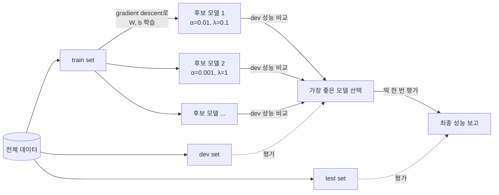

| set | 역할 | 여기서 하는 일 |
|---|---|---|
| train | 파라미터 $W, b$ 학습 | gradient descent를 돌린다 |
| dev (= hold-out / cross-validation set) | 모델·하이퍼파라미터 **고르기** | 여러 후보 중 뭐가 나은지 비교 |
| test | 최종 성능의 **unbiased 추정** (고르는 과정에 한 번도 안 쓰여서 부풀려지지 않은 정직한 점수) | 딱 한 번, 마지막에 성적표 매기기 |

전통적인 머신러닝(데이터 수만 개 수준)에서는 70/30 또는 60/20/20 비율이 흔했다. 근데 지금은 데이터가 백만 단위로 커졌기 때문에(빅데이터 시대) dev/test set의 "역할"이 달라진다 — dev set은 여러 모델 중 뭐가 나은지 평가만 하면 되고, test set도 최종 성능이 unbiased하게 나오기만 하면 되는 거라서, 굳이 전체의 20~30%씩 떼어줄 필요가 없다. 100만 개 있으면 dev 1만 개, test 1만 개(각각 1%)만으로도 충분히 신뢰할 수 있는 평가가 가능하다. 그래서 데이터가 아주 클 때는 **98/1/1** 같은 비율도 흔하다.

**"1만 개면 충분하다"를 숫자로 확인**: 정확도 $p$를 $n$개 샘플로 추정하면 그 추정치의 표준오차는 $\sqrt{p(1-p)/n}$이다. (표준오차 = "같은 모델을 다른 dev set $n$개로 다시 재면 정확도가 대략 ± 얼마나 흔들리나". 동전 던지기 앞면 비율을 10번 던져서 재면 들쭉날쭉하고, 1만 번 던지면 거의 안 흔들리는 것과 같은 원리다.)

$$p = 0.95,\ n = 10{,}000 \ \Rightarrow\ \sqrt{\frac{0.95 \times 0.05}{10000}} \approx 0.0022 \ (0.22\%p)$$

즉 dev 1만 개면 모델 A 95.0% vs 모델 B 95.8% 정도의 차이는 노이즈가 아니라 진짜 차이라고 믿을 수 있다. 반면 $n=100$이면 표준오차가 2.2%p라서 1%p 차이는 구분이 안 된다. dev set 크기는 "비율"이 아니라 **"내가 구분하고 싶은 성능 차이"**로 정하는 것이다.

더 중요한 원칙: **dev set과 test set은 같은 분포(distribution)에서 나와야 한다.** 예를 들어 train은 웹에서 크롤링한 고화질 고양이 사진, dev/test는 유저가 앱으로 찍은 저화질 사진이면 안 된다 — 이러면 모델이 잘못된 target을 겨냥해서 최적화하게 된다. train 분포와 dev/test 분포가 다른 것 자체는(mismatched train/dev distribution) 괜찮을 수 있지만, 그건 나중(Course 3에서 다룸)에 다시 언급된다. 지금 단계에서 기억할 건: **dev = test 분포 통일**.

Test set이 없어도(dev만 있어도) 실무에서는 그냥 진행하는 경우도 있다 — "not having a test set might be okay"라고 Ng가 언급하는데, 다만 그러면 최종 성능에 대한 unbiased한 추정치가 없다는 걸 감수해야 한다. (dev set으로 수십 번 모델을 고르다 보면 dev set에 **overfit**된다 — dev 점수는 살짝 낙관적으로 부풀어 있다. test set이 따로 필요한 이유가 이것.)

### Bias / Variance 진단

Course 1에서 이미 배웠겠지만 복습 + 실전 활용.

**기초부터**: 모델이 틀리는 이유는 크게 두 종류다.

- **Bias(편향) 문제 = underfitting(과소적합)**: 모델이 **너무 단순해서** 데이터의 패턴 자체를 못 담는다. 원 모양으로 나뉘는 데이터를 직선 하나로 가르려는 것 — 아무리 오래 학습해도 train 데이터조차 잘 못 맞춘다.
- **Variance(분산) 문제 = overfitting(과적합)**: 모델이 **너무 유연해서** 진짜 패턴뿐 아니라 train 데이터에 우연히 섞인 노이즈(라벨 실수, 이상한 샘플)까지 외워버린다. train은 거의 완벽한데, 새 데이터(dev)에서는 그 "외운 노이즈" 때문에 틀린다. "variance"라는 이름은 train set을 조금만 바꿔도 학습된 경계가 크게 달라진다(흔들린다)는 데서 왔다.

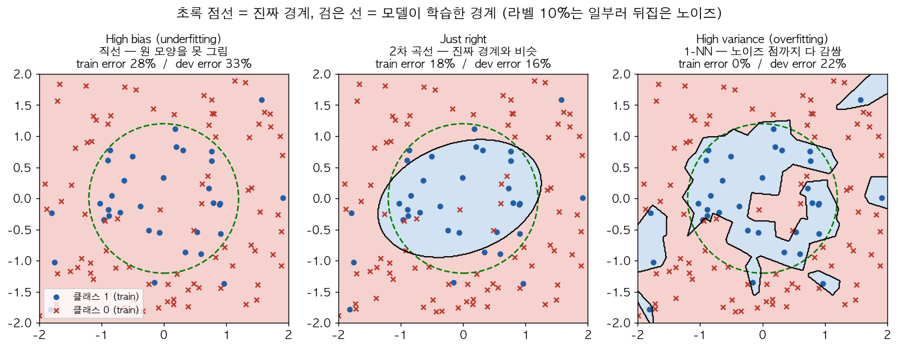

위 그림은 같은 데이터(진짜 경계는 초록 점선 원, 라벨 10%는 일부러 뒤집은 노이즈)에 세 모델을 학습시킨 결과다. **왼쪽**(직선)은 원을 못 그려서 train error부터 28%로 높다 → high bias. **오른쪽**(점마다 가장 가까운 train 점을 따라가는 1-NN)은 빨간 x 사이에 박힌 파란 점 하나까지 섬처럼 감싸서 train error 0%지만 dev error는 22% → high variance. **가운데**(2차 곡선)는 train 18% / dev 16%로 둘의 차이가 거의 없다. (라벨 10%를 뒤집었으니 이 문제의 Bayes error는 약 10% — 어떤 모델도 정직하게는 그 아래로 못 간다. 1-NN의 train 0%는 그 노이즈까지 외웠다는 증거다.)

그림 없이 숫자만으로 진단하는 방법이 아래다. 진단은 딱 두 개의 뺄셈으로 한다:

$$\underbrace{\text{train error} - \text{Bayes error}}_{\text{bias (avoidable bias)}} \qquad\qquad \underbrace{\text{dev error} - \text{train error}}_{\text{variance}}$$

**Bayes error**는 "어떤 모델을 쓰더라도 이보다 낮출 수 없는 에러" — 입력 자체에 정보가 부족해서(사진이 너무 흐리다든가, 라벨 자체가 애매하다든가) 원리적으로 못 맞히는 몫이다. 직접 알 수는 없어서 보통 **사람이 풀었을 때의 에러**로 근사한다. 그래서 첫 번째 뺄셈은 "train error 중에 줄일 여지가 있는 부분(avoidable bias)", 두 번째 뺄셈은 "처음 보는 데이터로 갔을 때 추가로 늘어난 에러"를 뜻한다.

Bayes error ≈ 0%(사람이 거의 완벽하게 맞히는 고양이 분류)라고 가정하고 강의의 네 가지 예시를 대입하면:

| train | dev | bias (train − 0) | variance (dev − train) | 진단 |
|---|---|---|---|---|
| 1% | 11% | 1 | **10** | high variance (overfitting) |
| 15% | 16% | **15** | 1 | high bias (underfitting) |
| 15% | 30% | **15** | **15** | 둘 다 나쁨 (최악) |
| 0.5% | 1% | 0.5 | 0.5 | 둘 다 좋음 (이상적) |

"high bias & high variance"가 어떻게 동시에 가능한가? — 2D 분류라면 decision boundary가 **대부분 직선이라 전체 모양을 못 맞추면서(bias)**, 동시에 **몇몇 노이즈 샘플만 억지로 휘어서 감싸는(variance)** 경우다. 고차원 입력에서는 어떤 영역은 underfit, 어떤 영역은 overfit인 게 흔하다.

이 판단 기준은 **Bayes error(사람 수준 에러, optimal error)**가 거의 0에 가깝다는 전제하에 성립한다. Bayes error가 높은 문제(예: 이미지가 너무 흐려서 사람도 구분 못 함)라면 train error 15%가 그렇게 나쁜 게 아닐 수도 있으니, 항상 "train error를 Bayes error와 비교"해서 bias를 판단해야 한다. 예: Bayes error가 15%인 문제에서 train 15% / dev 16%면 bias ≈ 0, variance 1 → 오히려 꽤 좋은 모델이다.

### Basic Recipe for Machine Learning

Andrew Ng이 강조하는 딥러닝 시대의 큰 장점 — **bias와 variance를 (거의) 독립적으로 고칠 수 있다**는 것. 예전 ML에서는 "bias-variance tradeoff"라고 해서 하나 줄이면 하나가 늘었는데, 딥러닝에서는 그렇지 않다. 레시피는 다음 순서로 반복:

1. **High bias인가?** (train set 성능 확인) → Yes면:
   - 더 큰 network (더 많은 hidden unit / layer)
   - 더 오래 학습
   - 다른 NN architecture 시도
   - (bias 안 잡히면 위 반복)
2. **High variance인가?** (dev set 성능 확인) → Yes면:
   - 더 많은 데이터 확보
   - Regularization
   - 다른 NN architecture 시도
3. 둘 다 낮아질 때까지 반복

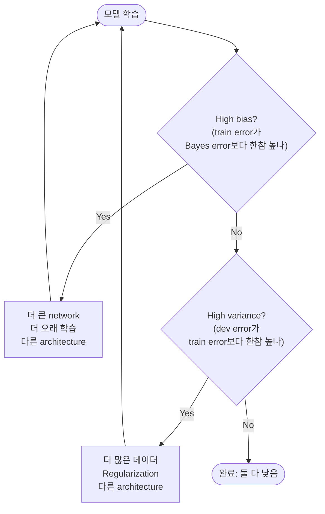

순서가 중요하다: **bias를 먼저** 본다. train set조차 못 맞추는 상태에서 데이터를 더 모으는 건(variance 처방) 아무 도움이 안 된다 — 진단 결과에 맞는 처방을 골라야 시간 낭비가 없다.

핵심 통찰: "더 큰 network을 쓰면 bias는 거의 항상 줄일 수 있고, 더 많은 데이터를 쓰면 variance는 거의 항상 줄일 수 있다" — 그리고 이 두 가지 다이얼(network 크기, 데이터 양)이 서로를 크게 해치지 않는다. 이게 딥러닝이 전통 ML보다 유리한 지점 중 하나다 (물론 계산 비용과 데이터 확보 비용은 별개 문제). 단, 큰 network는 **적절히 regularize되어 있다면** variance를 거의 안 늘린다는 전제가 붙는다.

### Regularization

High variance(overfitting) 잡는 첫 번째 무기. 데이터를 더 모으기 힘들 때 바로 쓸 수 있는 방법.

**Regularization(규제)이란**: 모델이 train 데이터를 "너무 잘" 맞추려고 과하게 복잡해지는 걸 **일부러 방해하는** 모든 기법을 통칭한다. 위 그림의 1-NN처럼 노이즈 점 하나하나를 감싸려면 경계가 구불구불해야 하고, 신경망에서 구불구불한 경계는 보통 **큰 weight 값**에서 나온다(weight가 크면 입력이 조금만 바뀌어도 출력이 확 바뀌니까). 그래서 regularization의 대부분은 "weight를 작게 유지하라"는 압력을 거는 방식이다. 대가로 train 성능은 조금 나빠지지만(bias ↑ 약간), dev 성능이 좋아진다(variance ↓). 아래 도구들이 전부 이 원리의 변형이다:

| 기법 | 한 줄 요약 |
|---|---|
| L2 regularization | cost에 "weight 크기 벌점"을 더한다 |
| Dropout | 학습 중 unit을 랜덤하게 꺼서 특정 unit에 의존 못 하게 한다 |
| Data augmentation | 데이터를 변형해서 늘린다 (외울 수 없게 만든다) |
| Early stopping | weight가 너무 커지기 전에 학습을 멈춘다 |

**L2 Regularization (weight decay)**

> 한 줄 요약: **"loss는 줄이되, W가 커지면 벌점을 준다."** 벌점 항을 미분하면 W에 비례하는 값이 나오고, 이게 매 업데이트마다 W를 0 쪽으로 조금씩 줄인다. 아래 수식은 전부 이 문장의 번역이다.

**① Cost function — 두 항의 줄다리기**

로지스틱 회귀 기준 cost function에 페널티 항 추가:

$$J(w, b) = \underbrace{\frac{1}{m}\sum_{i=1}^m \mathcal{L}(\hat{y}^{(i)}, y^{(i)})}_{\text{원래 cost}} + \underbrace{\frac{\lambda}{2m}\|w\|_2^2}_{\text{벌점(penalty)}}, \qquad \|w\|_2^2 = \sum_{j=1}^{n_x} w_j^2 = w^T w$$

| 기호 | 의미 | 왜 있나 |
|---|---|---|
| $\lambda$ | 벌점의 세기 (regularization parameter, 하이퍼파라미터) | 0이면 regularization 없음, 클수록 W를 강하게 누름. dev set으로 튜닝 |
| $\|w\|_2^2$ | $w$의 모든 원소 제곱합 | $w$의 "전체 크기"를 숫자 하나로 요약 |
| $\frac{1}{m}$ | 데이터 개수로 나눔 | 원래 cost(평균)와 스케일 맞추기 (아래 ⑤) |
| $\frac{1}{2}$ | 반으로 나눔 | **미분할 때 제곱의 2와 약분되게 하려는 것뿐** (아래 ③) |

두 항은 **반대 방향으로 당긴다**:
- 원래 cost 항: 데이터를 (노이즈까지) 잘 맞추려고 $w$를 자유롭게 키우고 싶어 함
- 벌점 항: $w$를 0으로 끌어당김

$\lambda$는 이 줄다리기에서 어느 쪽 손을 들어줄지 정하는 다이얼이다. (Python에서 `lambda`는 예약어라서 코드에서는 `lambd`라고 쓴다.)

왜 $b$는 벌점에 안 넣나? 넣어도 되지만 효과가 거의 없다. 파라미터 대부분이 $w$에 있고($w$는 $n_x$개, $b$는 1개), $b$는 입력과 곱해지지 않는 상수 이동이라 모델의 "구불구불함(복잡도)"을 만들지 않는다.

L1 regularization($\frac{\lambda}{m}\sum|w_j|$)도 있다 — $w$를 sparse하게(0이 많게) 만들어서 모델 압축에 도움이 된다는 말이 있지만 실제로는 별 도움이 안 돼서, 신경망에서는 거의 항상 L2를 쓴다.

**② 신경망으로 확장 — Frobenius norm**

신경망 전체로 확장하면 각 레이어의 weight matrix에 대해 **Frobenius norm**을 사용:

$$J(W^{[1]}, b^{[1]}, \dots, W^{[L]}, b^{[L]}) = \frac{1}{m}\sum_{i=1}^{m} \mathcal{L}(\hat{y}^{(i)}, y^{(i)}) + \frac{\lambda}{2m}\sum_{l=1}^{L} \|W^{[l]}\|_F^2$$

$$\|W^{[l]}\|_F^2 = \sum_{i=1}^{n^{[l]}}\sum_{j=1}^{n^{[l-1]}} \left(W^{[l]}_{ij}\right)^2$$

$W^{[l]}$의 shape이 $(n^{[l]}, n^{[l-1]})$이니까 행 인덱스 $i$는 $1..n^{[l]}$, 열 인덱스 $j$는 $1..n^{[l-1]}$이다. 이름은 거창하지만 그냥 **행렬의 모든 원소를 제곱해서 더한 값**이다. 벡터의 L2 norm을 행렬로 넓힌 것인데, 행렬에서는 관례상 "L2 norm"이라는 이름 대신 Frobenius라고 부른다.

숫자로:

$$W = \begin{bmatrix} 1 & -2 & 0 \\ 3 & 1 & -1 \end{bmatrix} \ \Rightarrow\ \|W\|_F^2 = 1 + 4 + 0 + 9 + 1 + 1 = 16$$

numpy로는 `np.sum(np.square(W))` 한 줄이고, 이걸 레이어마다 구해서 더한 뒤 $\frac{\lambda}{2m}$을 곱하면 벌점 항이 된다 (Lab 2의 `cost_with_l2`).

**③ Gradient — 왜 $\frac{\lambda}{m}W$가 붙나**

원소 하나 $W_{ij}$에 대해서만 미분해보면 명확하다. 벌점 항에서 $W_{ij}$가 들어있는 건 $\frac{\lambda}{2m}W_{ij}^2$ 딱 하나고, 나머지 원소들은 상수 취급이라 미분하면 0:

$$\frac{\partial}{\partial W_{ij}}\left[\frac{\lambda}{2m}W_{ij}^2\right] = \frac{\lambda}{2m}\cdot 2W_{ij} = \frac{\lambda}{m}W_{ij}$$

여기서 $\frac{1}{2}$과 $2$가 약분된다 — ①에서 $\frac12$을 붙인 이유가 바로 이것. 모든 원소에 똑같이 적용되니까 행렬로 쓰면:

$$dW^{[l]} = \underbrace{(\text{원래 backprop으로 구한 값})}_{\frac{1}{m}dZ^{[l]}A^{[l-1]T}} + \frac{\lambda}{m}W^{[l]}$$

벌점 항은 loss와 아무 관계가 없어서 **backprop 계산 자체는 하나도 안 바뀐다.** 원래 구한 gradient에 $\frac{\lambda}{m}W$만 더하면 끝. ($db$는 벌점에 $b$가 없으니 그대로.) Lab 2 코드에서:

```python
dW3 = dZ3 @ A2.T / m  +  lambd / m * p["W3"]
      └ backprop 값 ┘    └ L2 gradient ┘
```

**④ Update 식 전개 — "weight decay"라는 이름의 정체**

gradient descent 식에 대입해서 괄호를 푼다:

$$\begin{aligned}
W^{[l]} &:= W^{[l]} - \alpha\, dW^{[l]} \\
&= W^{[l]} - \alpha\left(\text{backprop} + \frac{\lambda}{m}W^{[l]}\right) \\
&= W^{[l]} - \frac{\alpha\lambda}{m}W^{[l]} - \alpha\cdot\text{backprop} \\
&= \underbrace{\left(1 - \frac{\alpha\lambda}{m}\right)}_{\text{1보다 살짝 작은 수}}W^{[l]} - \underbrace{\alpha\cdot\text{backprop}}_{\text{평소 GD}}
\end{aligned}$$

W로 묶으면 두 단계로 읽힌다: (1) 먼저 $W$에 $(1-\frac{\alpha\lambda}{m})$를 곱해서 **조금 줄이고(decay)**, (2) 그다음 평소처럼 gradient descent 한 번. 그래서 **weight decay**라고 부른다.

**Lab 2 숫자로 감 잡기** ($\alpha=0.3$, $\lambda=0.7$, $m=150$):

$$\frac{\alpha\lambda}{m} = \frac{0.3\times0.7}{150} = 0.0014 \ \Rightarrow\ \text{매 iteration마다 } W \times 0.9986 \ (0.14\%\text{씩 감소})$$

한 번에 0.14%라 작아 보이지만, 만약 backprop 항이 없다면 15000 iteration 뒤에는:

$$0.9986^{15000} \approx e^{-21} \approx 7\times10^{-10}$$

사실상 0이 된다. 실제로 $W$가 0까지 안 가는 건 backprop 항이 "데이터를 맞추려면 이 weight가 필요해"라며 다시 키우기 때문이다. 최종 $W$는 이 두 힘이 **균형을 이루는 지점**이다. 수식으로 쓰면 수렴점에서 $dW = 0$이니까:

$$\text{backprop} = -\frac{\lambda}{m}W \quad\Longleftrightarrow\quad W = -\frac{m}{\lambda}\cdot\text{backprop}$$

즉 **loss를 줄이는 데 크게 기여하는(backprop 값이 큰) weight만 크게 살아남고**, 노이즈 몇 개를 외우는 데만 쓰이던(기여가 작은) weight는 0 근처로 눌린다. Lab 2에서 no reg는 train 0.987/dev 0.760이었다가 L2를 켜면 train 0.827/dev 0.796이 되는 게 정확히 이 효과다.

**⑤ 왜 $\lambda$를 $m$으로 나누나**

식을 이렇게 묶어보면 보인다:

$$J = \frac{1}{m}\left[\sum_{i=1}^m \mathcal{L}^{(i)} + \frac{\lambda}{2}\sum_l\|W^{[l]}\|_F^2\right]$$

데이터가 많아질수록 대괄호 안의 $\sum\mathcal{L}$(loss 합)은 $m$에 비례해 커지지만 벌점 $\frac{\lambda}{2}\|W\|^2$는 그대로다. 즉 **$m$이 커질수록 벌점의 상대적 영향이 자연스럽게 줄어든다.** 데이터가 많으면 overfitting 걱정이 적으니 직관과도 맞다. ④의 decay 계수 $\frac{\alpha\lambda}{m}$도 같은 이유로 $m$이 크면 약해진다.

**왜 regularization이 overfitting을 줄이는가 — 직관 두 가지**

1. $\lambda$를 크게 잡으면 $W$가 0에 가깝게 눌린다 → 여러 hidden unit의 영향력이 사실상 0이 되어 네트워크가 더 "단순한" (거의 로지스틱 회귀에 가까운) 모델처럼 행동 → high variance 쪽에서 high bias 쪽으로 다이얼을 움직이는 셈. $\lambda$를 적절히 잡으면 "just right"에 도달. (실제로 unit이 사라지는 건 아니고, 모든 unit이 "조금씩만" 기여하게 된다.)
2. tanh 같은 activation을 생각해보면, $W$가 작아지면 $z = Wa+b$도 작아지고, $z$가 0 근처일 때 tanh는 거의 **선형(linear)**이다. 테일러 전개로 보면

   $$\tanh(z) = z - \frac{z^3}{3} + \cdots \ \approx\ z \quad (|z| \ll 1)$$

   예: $\tanh(0.1) = 0.0997$ (거의 $z$ 그대로), $\tanh(2) = 0.964$ (완전히 휘어짐). 모든 레이어가 거의 선형이면 전체 네트워크도 거의 선형 함수가 되어버려서(선형 함수의 합성은 선형) 복잡한 decision boundary를 못 그린다 → overfitting이 잘 안 일어난다.

   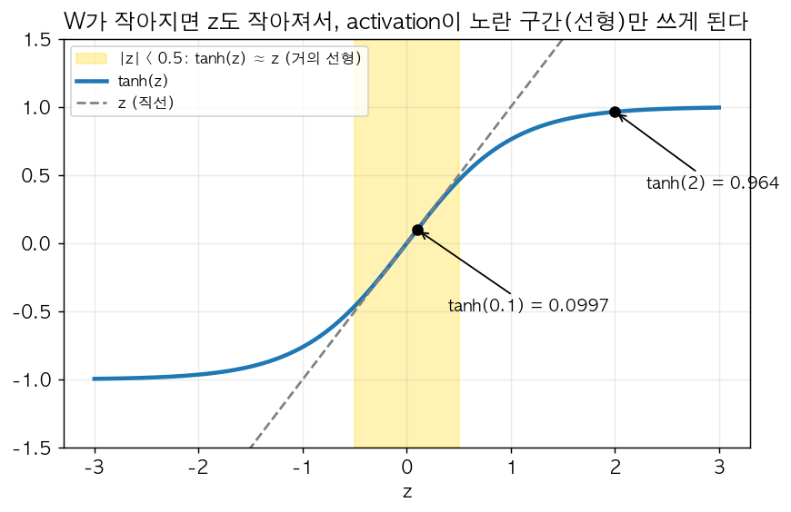

   그림에서 노란 구간($|z|<0.5$) 안에서는 파란 tanh 곡선과 회색 직선 $z$가 거의 겹친다. $W$가 작으면 $z$가 이 구간에만 머무르니까 activation이 "휘는" 능력을 거의 못 쓰는 것이다. 반대로 $z=2$ 근처처럼 멀리 나가야 곡선이 크게 휘고, 그래야 구불구불한 경계를 만들 수 있다.

실전 팁: regularization을 켠 채로 cost $J$를 plot해서 iteration마다 단조 감소하는지 확인할 때는 **regularization term까지 포함한 $J$**를 그려야 한다. gradient descent가 줄이는 대상은 "벌점 포함 $J$"이기 때문에, cross-entropy 부분만 그리면 monotonically decrease 안 하는 것처럼 보일 수 있다.

**Dropout Regularization**

각 iteration마다 네트워크의 일부 unit을 랜덤하게 "꺼버리는(제거하는)" 방법. 매 iteration마다 다른, 더 작은 네트워크로 학습하는 셈이라 특정 feature에 지나치게 의존(rely)하지 못하게 만든다.

"끈다"는 건 그 unit의 출력 $a$를 0으로 만든다는 뜻이다. 출력이 0이면 다음 층에 아무 영향도 못 주니 그 iteration 동안은 unit이 **네트워크에서 빠진 것과 같다**(연결선까지 통째로 사라진 것처럼). 그리고 다음 iteration에는 또 새로 동전을 던져서 다른 unit들을 끈다. 예: hidden layer 2개, 각 unit 4개, `keep_prob = 0.5`(각 unit이 50% 확률로 살아남음)면 어떤 iteration에는 이렇게 된다:

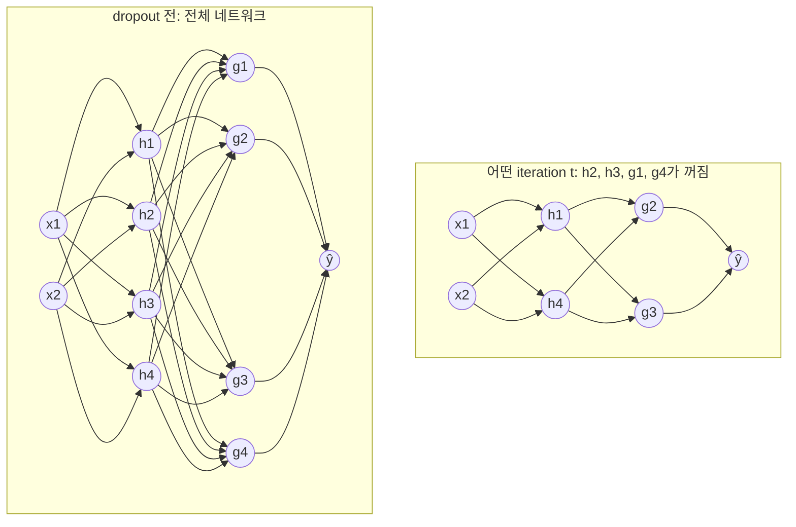

이번 iteration의 forward/backward는 오른쪽의 **작아진 네트워크**로만 돌고, 꺼진 unit에 연결된 weight는 이번엔 업데이트되지 않는다. 다음 iteration에는 다른 조합이 꺼진다.

**"왜 효과가 있나"를 한 unit 입장에서**: 어떤 unit이 입력 4개를 받는다고 하자. dropout이 있으면 그 입력 중 아무거나 언제든 사라질 수 있으니, 한 입력에 큰 weight를 몰아주는 건 위험한 전략이다. 그래서 weight를 **여러 입력에 골고루 퍼뜨리게(spread out)** 되고, 퍼뜨리면 $\|W\|^2$가 작아진다 — 예: 합이 1인 weight를 $[1,0,0,0]$으로 주면 제곱합 1, $[0.25,0.25,0.25,0.25]$로 주면 제곱합 0.25. 그래서 dropout은 L2와 비슷한 효과(shrink weights)를 내고, 레이어마다 입력의 중요도에 따라 다르게 적용되는 "adaptive한 L2"처럼 볼 수 있다.

가장 많이 쓰는 구현: **Inverted Dropout**. layer $l=3$에 대해:

```python
keep_prob = 0.8  # 남길 확률 (= 1 - 끌 확률)
d3 = np.random.rand(a3.shape[0], a3.shape[1]) < keep_prob   # True/False mask
a3 = a3 * d3          # 일부 unit 제거 (False인 곳이 0이 됨)
a3 = a3 / keep_prob   # 기댓값 보정 (inverted dropout의 핵심)
```

코드 한 줄씩: `np.random.rand`는 0~1 사이 균등한 랜덤 숫자를 $a^{[3]}$과 같은 shape으로 뽑는다. 그 숫자가 0.8보다 작을 확률은 딱 80%니까, `< keep_prob` 비교 결과 `d3`는 원소마다 80% 확률로 `True`(1), 20% 확률로 `False`(0)인 마스크가 된다. 곱하면 `False` 자리가 0이 되어 꺼진다.

**용어 두 개 먼저**:
- **베르누이(Bernoulli) 변수**: 결과가 1 아니면 0 딱 두 가지인 랜덤 변수. "확률 $p$로 앞면(1)이 나오는 찌그러진 동전 한 번 던지기"라고 보면 된다. 위 마스크 원소 하나하나가 이 동전이다.
- **기댓값 $\mathbb{E}[\cdot]$**: 같은 랜덤 실험을 무한히 반복했을 때의 평균. 앞면 확률 0.8인 동전의 기댓값은 $1\times0.8 + 0\times0.2 = 0.8$ — 1000번 던지면 1의 개수 평균이 800개라는 뜻이다.

**`/ keep_prob`의 수식적 의미**: mask 원소 $d$는 확률 $p$(=`keep_prob`)로 1, $1-p$로 0인 베르누이 변수라서 $\mathbb{E}[d] = p$이다. 그러면

$$\mathbb{E}\left[\frac{a\cdot d}{p}\right] = \frac{a\cdot\mathbb{E}[d]}{p} = \frac{a\cdot p}{p} = a$$

나눠주면 dropout 후 activation의 **기댓값이 dropout 전과 똑같아진다.** 숫자로: layer 3에 unit 50개, `keep_prob=0.8`이면 평균 10개가 꺼진다. 다음 레이어의 $z^{[4]} = W^{[4]}a^{[3]} + b^{[4]}$는 50개 항의 합인데, 10개가 0이 됐으니 $z^{[4]}$가 평균 20% 작아진다. 이걸 $0.8$로 나눠서 원래 크기로 되돌리는 것. (Lab 2 체크포인트: 1로 가득 찬 행렬에 dropout을 걸면 평균이 ≈1.0, 나누기를 빼면 0.8.)

이게 없으면 test 시점에 추가 스케일링 작업이 필요해지는데(train 때는 80% 크기로 학습했는데 test 때는 100% 크기가 들어오니까), inverted dropout은 train 때 미리 보정해두기 때문에 **test 시에는 dropout을 아예 끄고 그대로 forward pass만 하면 된다.** (test에서 dropout을 켜면 예측에 불필요한 노이즈만 추가될 뿐이다.)

**Backprop에서는**: forward에서 $a = a\cdot d / p$였으니 chain rule로 $da_{\text{이전}} = da\cdot d / p$ — forward에서 끈 unit은 backward에서도 gradient 0, 살아남은 unit은 똑같이 $1/p$ 배. 같은 mask $d$를 cache에 저장해뒀다가 써야 한다(새로 뽑으면 안 됨).

레이어마다 다른 `keep_prob`을 줄 수 있다 — 파라미터가 많아 overfitting 위험이 큰 레이어(weight matrix가 큰 레이어, 예: $W$가 $7\times7$인 레이어)는 `keep_prob`을 낮게(0.5), input layer나 작은 레이어는 1(dropout 없음)에 가깝게. 단점은 튜닝할 하이퍼파라미터가 레이어 수만큼 늘어난다는 것.

주의점: dropout을 쓰면 cost $J$가 iteration마다 잘 정의되지 않는다(매번 다른 네트워크라서) — 그래서 디버깅할 때는 먼저 `keep_prob=1`로 $J$가 단조감소하는지 확인한 뒤 dropout을 켜는 게 좋다. Dropout은 컴퓨터 비전(CV) 분야에서 특히 자주 쓰인다 — 입력(이미지 픽셀) 차원이 커서 데이터가 항상 부족하게 느껴지기 때문. 데이터가 충분히 많은 다른 도메인에서는 굳이 안 쓰기도 한다. **overfitting이 없으면 dropout도 쓸 이유가 없다** — 기본값이 아니라 variance 처방이다.

**Data Augmentation**

새 데이터를 모으는 게 비싸거나 불가능할 때 쓰는 "공짜에 가까운" regularization. 이미지라면 좌우 반전(flip), 랜덤 크롭/줌, 회전, 왜곡(distortion) 등을 적용해서 학습 데이터를 인위적으로 늘린다. 숫자 인식(OCR)이면 살짝 회전·찌그러뜨리기. 완전히 새로운 독립 데이터만큼 좋지는 않지만(뒤집은 고양이는 원래 고양이와 정보가 많이 겹친다) 거의 비용 없이 variance를 줄여준다. 동시에 "고양이는 좌우 반전해도 고양이"라는 **불변성(invariance)을 모델에 알려주는** 역할도 한다. 단, 라벨이 바뀌는 변환은 금지 — 숫자 6을 180° 돌리면 9가 된다.

**Early Stopping**

train 하면서 dev set error를 같이 관찰하다가, dev error가 더 이상 좋아지지 않고 올라가기 시작하는 지점(iteration)에서 학습을 멈추고 그 시점의 $W$를 사용하는 방법. train error는 계속 내려가는데 dev error는 U자 모양을 그리다가 다시 올라가는 지점을 잡는 것.

**왜 regularization이 되나**: $W$는 작은 랜덤값으로 시작해서 학습할수록 커진다. 중간에 멈춘다는 건 **$\|W\|_F$가 아직 중간 크기일 때** 멈추는 것 — 결과적으로 L2와 비슷하게 "크기가 적당한 $W$"를 고르는 효과가 난다.

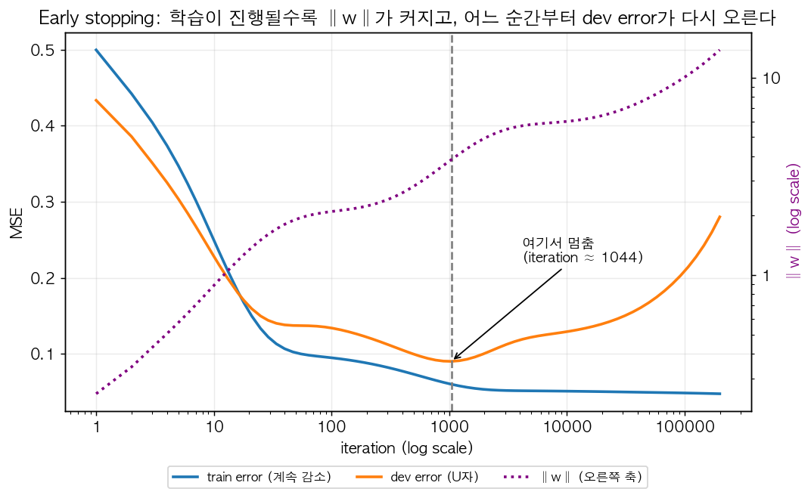

그림은 train 15개짜리 데이터에 12차 다항식을 gradient descent로 20만 번 학습시킨 장난감 예시다(가로축은 log scale). 파란 train error는 끝까지 계속 내려가지만, 주황 dev error는 iteration ≈ 1000에서 최저(0.09)를 찍고 다시 올라가 마지막엔 0.28이 된다. 동시에 보라 점선 $\|w\|$는 계속 커진다 — 멈춘 지점에서 3.8이던 것이 끝에서는 13.8. **"dev error가 다시 오르기 시작하는 시점 = weight가 노이즈를 외울 만큼 커지기 시작하는 시점"**이라는 게 early stopping이 regularization인 이유다. 실전에서는 dev error가 몇 epoch 연속 안 좋아지면 멈추고, 그동안 가장 좋았던 시점의 $W$(체크포인트)를 쓴다.

**단점 (orthogonalization 관점)**: Ng는 머신러닝 문제를 두 단계로 나눠서 생각하라고 권한다 — (1) cost $J$를 잘 최적화하기(optimize), (2) overfitting 안 되게 하기(regularize/generalize). 이상적으로는 이 두 가지를 **독립적인 도구**로 따로따로 다뤄야 하는데(이게 **orthogonalization**의 의미 — 한 다이얼이 한 가지 효과만 내야 디버깅이 쉬워진다), early stopping은 이 두 단계를 **한 번에 묶어버린다.** 학습을 일찍 멈추는 순간 $J$ 최적화도 멈춰버리기 때문. 그래서 Ng는 개인적으로 L2 regularization(+ 적절한 $\lambda$ 탐색)을 더 선호한다고 언급한다 — 다만 계산 비용 면에서는 early stopping이 "한 번의 학습으로 여러 $\lambda$ 값을 시도한 효과"를 내서 더 저렴하다는 장점도 있다. ($\lambda$ 10개를 시도하려면 학습 10번이 필요하지만, early stopping은 학습 1번 동안 작은 $\|W\|$ → 큰 $\|W\|$를 쭉 훑으면서 그중 하나를 고르는 셈.)

### 입력 정규화 (Normalizing Inputs)

두 단계 (feature마다, 즉 $x$의 각 행마다 따로):

1. **평균 빼기 (zero out the mean)**:
   $$\mu = \frac{1}{m}\sum_{i=1}^m x^{(i)}, \qquad x := x - \mu$$
2. **분산 정규화 (normalize variance)**:
   $$\sigma^2 = \frac{1}{m}\sum_{i=1}^m \left(x^{(i)}\right)^2 \ (\text{elementwise, 평균을 이미 뺐으니 이게 분산}), \qquad x := \frac{x}{\sigma}$$

강의 슬라이드에는 $x /= \sigma^2$로 적혀 있는데, 분산을 1로 만들려면 **표준편차 $\sigma$로 나누는 게 맞다** ($\text{Var}(x/\sigma) = \text{Var}(x)/\sigma^2 = 1$). numpy로는 `X = (X - X.mean(axis=1, keepdims=True)) / X.std(axis=1, keepdims=True)`.

숫자 예: feature 하나가 `[2, 4, 6]`이면 $\mu = 4$ → `[-2, 0, 2]` → $\sigma = \sqrt{(4+0+4)/3} = 1.63$ → `[-1.22, 0, 1.22]`.

주의: train set에서 계산한 $\mu, \sigma$를 그대로 test set에도 적용해야 한다 (test set으로 따로 계산하면 안 됨) — train/test가 같은 방식으로 변환되어야 하기 때문. 모델 입장에서 "입력 5.0"의 의미가 train과 test에서 달라지면 안 된다.

**먼저 "등고선(contour)"이 뭔지**: weight가 2개($w_1, w_2$)뿐이라고 하면 cost $J(w_1, w_2)$는 $(w_1, w_2)$ 평면 위의 "지형"이다 — 높이가 cost. 이걸 위에서 내려다보면서 **높이(cost)가 같은 점들을 선으로 이은 것**이 등고선이다. 지도에서 산 높이를 나타내는 등고선과 완전히 같다. 선형/로지스틱 회귀 cost는 그릇(bowl) 모양이라서, 등고선은 최솟값(그릇 바닥)을 중심으로 한 동심 타원이 된다. 읽는 법 두 가지:
- 등고선이 **촘촘한 방향** = 조금만 가도 cost가 확 변함 = **가파른** 방향
- gradient는 항상 **등고선에 수직**으로, 가장 가파르게 올라가는 방향을 가리킨다. GD는 그 반대로 간다.

**feature 스케일이 왜 그릇 모양을 바꾸나**: $z = w_1x_1 + w_2x_2$에서 $x_1 \in [1, 1000]$, $x_2 \in [0, 1]$이라고 하자. $w_1$을 0.01만 바꿔도 $z$는 최대 10만큼 변하지만, $w_2$를 0.01 바꾸면 $z$는 최대 0.01만 변한다. 즉 cost가 **$w_1$ 방향으로는 아주 민감(가파름), $w_2$ 방향으로는 둔감(완만)**해진다. 방향마다 가파른 정도가 크게 다르니 그릇이 한쪽으로 짓눌린 길쭉한 모양이 된다.

**왜 정규화하는가 — 그림으로 이해하기**: feature들의 스케일이 서로 다르면 (예: $x_1 \in [1,1000]$, $x_2 \in [0,1]$) cost function의 등고선(contour)이 아주 길쭉하고 찌그러진 타원(elongated bowl) 모양이 된다. 이런 지형에서 gradient descent를 돌리면 경로가 지그재그(zigzag)로 왔다갔다 하면서 느리게 수렴한다 — learning rate를 아주 작게 잡아야 발산 안 하기 때문. 반면 정규화를 하면 등고선이 원(sphere)에 가까워져서 어느 방향으로 가든 곧장 최솟값을 향해 나아갈 수 있다 — 더 큰 learning rate를 써도 안전하고 수렴이 훨씬 빠르다.

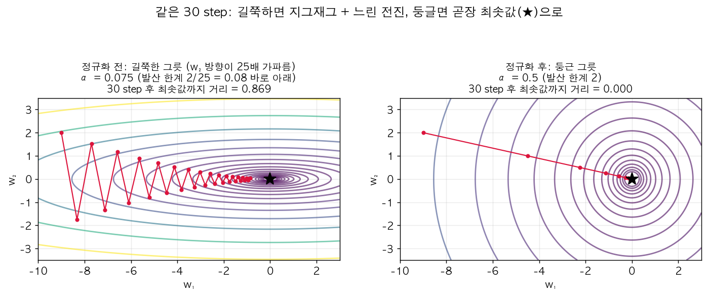

왼쪽은 $J = \frac12(w_1^2 + 25w_2^2)$ — $w_2$ 방향이 25배 가파른 길쭉한 그릇. gradient가 등고선에 수직이라 최솟값(★)을 똑바로 가리키지 않고 거의 세로(가파른 쪽)를 가리키니까, 빨간 경로가 위아래로 튕기며(zigzag) 가로로는 찔끔찔끔 전진한다. 30 step 후에도 최솟값까지 거리가 0.87 남았다. 오른쪽은 정규화한 뒤의 둥근 그릇 $J = \frac12(w_1^2 + w_2^2)$ — gradient가 정확히 중심을 가리켜서 α=0.5로 직진하고, 30 step이면 사실상 도착(거리 ≈ 0)한다. 왜 왼쪽은 α를 0.075 이상 못 올리는지는 바로 아래 수식이 설명한다.

**"learning rate를 작게 잡아야 한다"를 수식으로**: 가장 단순한 길쭉한 그릇 $J = \frac12(a\,w_1^2 + b\,w_2^2)$에서 GD 한 스텝은 축마다 따로 논다:

$$w_1 := w_1 - \alpha a w_1 = (1-\alpha a)\,w_1, \qquad w_2 := (1-\alpha b)\,w_2$$

각 축이 0으로 수렴하려면 $|1-\alpha a| < 1$, $|1-\alpha b| < 1$이어야 하니까 $\alpha < \frac{2}{a}$ 그리고 $\alpha < \frac{2}{b}$. $b=25, a=1$이면 $\alpha < 0.08$이 한계다(Lab 4의 `2/25 = 0.08`). 그런데 이 $\alpha$로는 완만한 축 $w_1$이 한 스텝에 $(1-0.08)$배, 즉 8%씩밖에 안 줄어든다. **가파른 축이 $\alpha$의 상한을 정하고, 완만한 축이 수렴 속도를 정하는** 구조라서, 두 곡률의 비율 $b/a$(찌그러진 정도)가 클수록 느려진다. (**곡률(curvature)** = 그 방향으로 그릇 벽이 얼마나 급하게 휘어 올라가는지. 여기서는 2차 미분값 $\frac{\partial^2 J}{\partial w_1^2} = a$, $\frac{\partial^2 J}{\partial w_2^2} = b$가 곧 곡률이다. 곡률이 크면 gradient가 조금만 이동해도 크게 변해서, 큰 step을 밟으면 반대편 벽으로 튕겨 나간다.) 정규화는 이 비율을 1에 가깝게 만드는 작업이다.

### Vanishing / Exploding Gradients

**무슨 문제인가 (한 줄)**: 깊은 네트워크에서 backprop으로 구한 gradient가 앞쪽 층으로 갈수록 **0에 가깝게 쪼그라들거나(vanishing)** **어마어마하게 커져서(exploding)** 학습이 안 되는 현상. 원인은 단순하다 — 층을 하나 지날 때마다 신호에 비슷한 숫자가 **곱해지는데**, 같은 숫자를 수십 번 곱하면 1보다 조금만 커도 폭발하고 조금만 작아도 사라진다($1.1^{100} \approx 13781$, $0.9^{100} \approx 0.00003$). 복리 이자가 무섭게 불어나는 것과 같은 원리다.

레이어 수 $L$이 아주 깊은 네트워크를 생각하자. 단순화를 위해 activation을 $g(z) = z$(linear), $b=0$이라고 하면:

$$\hat y = W^{[L]}W^{[L-1]}\cdots W^{[2]}W^{[1]}x$$

각 $W^{[l]}$이 (마지막 층 빼고) 대각행렬 $\begin{bmatrix}1.5 & 0\\0 & 1.5\end{bmatrix}$라면 $\hat y \approx 1.5^{L-1}x$가 된다. 숫자를 넣으면:

| 한 층당 배율 | $L=50$ | $L=150$ |
|---|---|---|
| 1.5 | $6\times10^{8}$ | $1.7\times10^{26}$ (**exploding**) |
| 1.1 | 117 | $1.5\times10^{6}$ |
| 0.9 | 0.005 | $1.4\times10^{-7}$ |
| 0.5 | $1.8\times10^{-15}$ | $1.4\times10^{-45}$ (**vanishing**) |

- $W^{[l]}$의 값이 1보다 살짝 크면 → $L$번 곱해질수록 **exponentially 증가** (exploding)
- $W^{[l]}$의 값이 1보다 살짝 작으면 → $L$번 곱해질수록 **exponentially 감소** (vanishing)

1.1처럼 "살짝" 큰 값도 150층이면 백만 배가 된다는 게 핵심이다. backprop은 같은 $W$들을 거꾸로(전치해서) 곱해 내려가기 때문에 gradient에도 똑같이 적용돼서, 깊은 네트워크일수록 초반 레이어의 gradient가 지수적으로 작아지거나(학습이 거의 안 됨 — $10^{-45}$짜리 gradient로는 한 발짝도 못 간다) 커져서(발산, `nan`) 학습이 매우 어려워진다. 완전히 해결하는 방법은 아니지만 **weight initialization을 신중하게 하는 것**이 이 문제를 크게 완화한다 — "한 층당 배율"을 1 근처로 맞추는 것이 목표다.

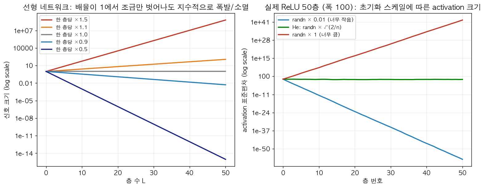

세로축이 **log scale**이라는 데 주의(눈금 하나 올라갈 때마다 몇 자릿수씩 커짐). log scale에서는 "매 층 같은 배율 곱하기"가 **직선**으로 보인다. 왼쪽: 배율 1.0(회색)만 수평이고, 1.1만 돼도 50층이면 117배, 0.5면 $10^{-15}$ 수준까지 떨어진다. 오른쪽은 선형 가정 없이 **진짜 ReLU 50층 네트워크**(층마다 unit 100개)에 랜덤 입력을 넣고 층별 activation 표준편차를 잰 것이다. `randn*0.01`로 초기화하면 50층 뒤 $3\times10^{-58}$(사실상 0), `randn*1`이면 $2\times10^{42}$(폭발), 다음 절의 He 초기화 `randn*sqrt(2/n)`만 초록선처럼 50층 내내 0.6~1 근처를 유지한다.

### Weight Initialization (He / Xavier)

**목표**: 층을 지나도 신호의 크기(분산)가 유지되게 = "한 층당 배율 ≈ 1".

**왜 "분산"으로 크기를 재나**: activation 값들은 양수도 음수도 섞여 있어서(평균은 대략 0) 평균으로는 크기를 못 잰다. 대신 **분산(variance) = 값들이 0(평균)에서 얼마나 멀리 퍼져 있나 = 값 제곱의 평균**을 쓴다. 예: $[-1, 1, -1, 1]$은 분산 1, $[-10, 10, -10, 10]$은 분산 100. 표준편차 $\sigma$는 분산의 제곱근으로 "대략 몇 정도 크기의 값들인가"를 원래 단위로 나타낸다(위 예에서 1과 10). 초기화는 $W$를 랜덤으로 뽑으니까 "$W$ 원소를 **어떤 분산**의 분포에서 뽑을지"를 정하는 문제가 된다.

**왜 그냥 0으로 초기화하면 안 되나 (symmetry)**: $W$를 전부 0(또는 전부 같은 값)으로 두면 한 층의 모든 hidden unit이 똑같은 입력을 받아 똑같은 값을 내고, backprop에서도 똑같은 gradient를 받는다. 그러면 몇 번을 업데이트해도 unit들이 계속 똑같아서 unit 100개가 사실상 1개인 셈이 된다(Course 1 내용, Lab 1에서 직접 확인). 그래서 **랜덤**으로 뽑되, 그 **스케일(분산)**을 잘 골라야 한다는 게 이 절의 주제다.

단일 뉴런 $z = w_1x_1 + w_2x_2 + \cdots + w_nx_n$을 생각하자 ($b=0$). $w_i$와 $x_i$가 서로 독립이고 평균이 0이라고 가정하면, 독립 변수 합의 분산은 분산의 합이고 $\text{Var}(w_ix_i) = \text{Var}(w_i)\text{Var}(x_i)$이므로:

$$\text{Var}(z) = \sum_{i=1}^{n}\text{Var}(w_i)\,\text{Var}(x_i) = n\cdot\text{Var}(w)\cdot\text{Var}(x)$$

$\text{Var}(z) = \text{Var}(x)$가 되게 하려면(신호 크기 유지) $n\cdot\text{Var}(w) = 1$, 즉

$$\text{Var}(w) = \frac{1}{n}$$

직관: 입력 개수 $n$이 많을수록 더해지는 항이 많으니 각 $w_i$는 작아야 한다. 입력 100개면 각 $w$의 표준편차는 $\sqrt{1/100} = 0.1$.

**ReLU는 왜 2배인가(He)**: ReLU는 $z$가 음수인 절반을 0으로 날린다. $z$가 0 기준 대칭이면 $\mathbb{E}[\text{relu}(z)^2] = \frac12\text{Var}(z)$ — 신호 에너지가 층마다 절반씩 줄어든다. 이걸 메우려면 $\text{Var}(w)$를 2배로:

- **ReLU 계열 activation**(He initialization, He et al. 2015): $\text{Var}(W^{[l]}) = \dfrac{2}{n^{[l-1]}}$

```python
W_l = np.random.randn(n_l, n_prev) * np.sqrt(2 / n_prev)  # n_l: 현재 층 unit 수, n_prev: 이전 층 unit 수
```

`randn`은 분산 1짜리를 뽑으니까 표준편차 $\sqrt{2/n}$을 곱하면 분산이 $2/n$이 된다 (분산은 곱한 값의 **제곱**만큼 바뀌므로 $\sqrt{\ }$를 곱해야 함).

- **tanh activation**(Xavier initialization): $\text{Var}(W^{[l]}) = \dfrac{1}{n^{[l-1]}}$ → `* np.sqrt(1 / n_prev)` (또는 Yoshua Bengio 버전은 $\text{Var} = \frac{2}{n^{[l-1]} + n^{[l]}}$, 즉 `* np.sqrt(2 / (n_prev + n_l))` — forward와 backward의 분산을 같이 고려한 절충)

이 초기화 방법들은 vanishing/exploding gradient 문제를 "없애주진" 못해도 크게 줄여준다 — 학습 시작 시점에 각 레이어 출력의 분산을 비슷한 스케일로 맞춰주기 때문. Lab 1 체크포인트가 딱 이걸 보여준다: `randn*10`(large)은 activation std가 `58 → 1.7e7 → 5e12`로 폭발, He는 10층을 지나도 `0.8 → 0.5` 수준 유지. 분산 식의 분자(1이냐 2냐)도 사실상 튜닝 가능한 하이퍼파라미터지만 우선순위는 낮다.

### Gradient Checking

backprop 구현이 맞는지 확인하는 디버깅 도구 (실제 학습에는 안 쓰고, 버그 찾을 때만 사용).

**아이디어 (한 줄)**: 미분 $f'(\theta)$는 "$\theta$를 아주 조금 움직였을 때 $f$가 얼마나 변하나"의 비율이다. backprop은 이걸 공식(chain rule)으로 계산하는데, 공식을 잘못 옮겨 적어도 코드는 에러 없이 돌아가서 버그를 알아채기 어렵다. 그래서 **정의대로 직접 재본 값**(θ를 진짜로 $\varepsilon$만큼 움직여서 $f$를 두 번 계산 — 이를 수치 미분(numerical gradient)이라 한다)과 backprop 값을 비교한다. 느리지만 틀릴 수가 없는 방법으로 빠르지만 틀릴 수 있는 방법을 채점하는 것.

**① 왜 양쪽(two-sided) 차분인가** — 미분의 정의를 그대로 수치로 계산하는 건데, 한쪽 차분보다 양쪽 차분이 훨씬 정확하다. 강의 예시 $f(\theta) = \theta^3$, $\theta = 1$ (정답 $f'(1) = 3$), $\varepsilon = 0.01$:

$$\text{한쪽: } \frac{f(1.01) - f(1)}{0.01} = 3.0301 \ (\text{오차 } 0.03), \qquad \text{양쪽: } \frac{f(1.01) - f(0.99)}{0.02} = 3.0001 \ (\text{오차 } 0.0001)$$

이유는 테일러 전개로 보인다:

$$f(\theta\pm\varepsilon) = f(\theta) \pm \varepsilon f'(\theta) + \frac{\varepsilon^2}{2}f''(\theta) \pm \frac{\varepsilon^3}{6}f'''(\theta) + \cdots$$

한쪽 차분은 $\frac{f(\theta+\varepsilon)-f(\theta)}{\varepsilon} = f' + \frac{\varepsilon}{2}f'' + \cdots$ → 오차 $O(\varepsilon)$. 양쪽 차분은 두 식을 빼면 짝수 차수 항($\varepsilon^2$ 항)이 **상쇄**돼서 $\frac{f(\theta+\varepsilon)-f(\theta-\varepsilon)}{2\varepsilon} = f' + \frac{\varepsilon^2}{6}f''' + \cdots$ → 오차 $O(\varepsilon^2)$. $\varepsilon=0.01$이면 오차가 $0.01$ 수준 vs $0.0001$ 수준 — 위 숫자와 정확히 맞다. 계산은 2배 들지만 그만한 가치가 있다.

**② 신경망에 적용** — 모든 파라미터 $W^{[1]}, b^{[1]}, \dots, W^{[L]}, b^{[L]}$을 하나의 큰 벡터 $\theta$로 이어붙이고(reshape+concatenate), 마찬가지로 모든 gradient를 $d\theta$로 이어붙인다. 그러면 $J$는 $\theta$ 하나의 함수 $J(\theta) = J(\theta_1, \theta_2, \dots)$가 된다. 각 원소 $\theta_i$에 대해 **그 원소만** 흔들어서:

$$d\theta_{\text{approx}}[i] = \frac{J(\theta_1,\dots,\theta_i+\varepsilon,\dots) - J(\theta_1,\dots,\theta_i-\varepsilon,\dots)}{2\varepsilon} \ \approx\ d\theta[i] = \frac{\partial J}{\partial\theta_i}$$

**③ 비교는 상대 오차로** — 단순 차이가 아니라 **상대 오차(relative error)**를 본다:

$$\text{diff} = \frac{\|d\theta_{\text{approx}} - d\theta\|_2}{\|d\theta_{\text{approx}}\|_2 + \|d\theta\|_2}$$

분모로 나누는 이유: gradient 크기 자체가 $10^{-6}$ 수준이면 절대 차이 $10^{-7}$은 엄청 큰 오차(10%)지만, gradient가 $10^{3}$ 수준이면 무시할 만하다. 분모로 나눠서 **스케일과 무관한 0~1 사이 비율**로 만드는 것. ($\|\cdot\|_2$는 벡터 원소 제곱합의 제곱근, 즉 유클리드 길이.)

보통 $\varepsilon = 10^{-7}$을 쓰고, diff가 $10^{-7}$보다 작으면 훌륭, $10^{-5}$ 정도면 의심해볼 만(어느 원소가 튀는지 확인), $10^{-3}$ 이상이면 버그 가능성이 높다고 판단한다. Lab 3: 정상 backprop은 diff ≈ `1e-9`, `db`에 2배 버그를 심으면 diff ≈ `0.13`.

**사용 팁**:
- 학습용으로 쓰지 말 것 (파라미터가 $N$개면 forward prop을 $2N$번 계산해야 해서 극도로 느림 — 파라미터 100만 개면 forward 200만 번) — 디버깅 때만, 그것도 gradient check 통과하면 바로 꺼야 함.
- diff가 크게 나오면 각 원소별로 어느 $\theta_i$(어느 레이어의 $dW$ 또는 $db$)에서 오차가 큰지 살펴보면 버그 위치를 좁힐 수 있다. 예: $db^{[l]}$ 원소들만 튀고 $dW$는 멀쩡하면 $db$ 계산식을 의심.
- **regularization term을 쓰고 있다면 gradient checking에도 그 항을 포함**해서 계산해야 한다. backprop 쪽 $dW$에는 $\frac{\lambda}{m}W$가 들어가 있는데 $J$ 쪽에 $\frac{\lambda}{2m}\|W\|^2$이 빠져 있으면 둘이 다른 함수의 미분이 된다.
- **dropout과는 gradient checking을 같이 쓸 수 없다** (dropout이 매번 랜덤하게 unit을 꺼서 $J$가 잘 정의되지 않기 때문 — $J(\theta+\varepsilon)$과 $J(\theta-\varepsilon)$이 서로 다른 네트워크로 계산됨) — dropout 끄고(keep_prob=1) gradient check 먼저 통과시킨 뒤 dropout을 켜는 순서로 진행.
- 파라미터를 랜덤 초기화한 직후(학습 초반)뿐 아니라 학습이 좀 진행된 후에도 한 번 더 돌려보면 좋다 — 초기값 근처($W, b$가 0에 가까울 때)에서만 맞고 학습 중간에 틀어지는 버그도 있을 수 있어서.

---

## Week 2: Optimization Algorithms

> **Week 2 전체 그림**: Week 1이 "모델이 잘 **일반화**되게(variance 잡기)"였다면, Week 2는 "학습(cost 최소화) 자체를 **빨리** 끝내기"다. 딥러닝은 반복 실험(아이디어 → 코드 → 학습 → 결과 보고 수정)의 연속이라 학습 한 번이 하루 걸리느냐 한 시간 걸리느냐가 생산성을 좌우한다. 아래 알고리즘들의 관계:

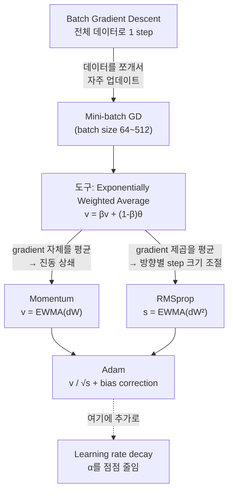

### Mini-batch Gradient Descent

$m$이 아주 클 때(예: 5백만) 매 iteration마다 전체 데이터로 gradient를 계산(batch gradient descent)하면 한 스텝 내딛기까지 너무 오래 걸린다. (5백만 개 전부에 대해 forward/backward를 끝내야 겨우 $W$를 **한 번** 고칠 수 있다. 처음 몇천 개만 봐도 "대충 이쪽으로 가야 한다"는 건 알 수 있는데도.) 그래서 학습 데이터를 작은 덩어리(mini-batch)로 나눠서, **한 mini-batch를 처리할 때마다 파라미터를 업데이트**한다.

**표기법** — 괄호 모양으로 구분한다:

| 표기 | 의미 |
|---|---|
| $x^{(i)}$ | $i$번째 **샘플** (소괄호) |
| $z^{[l]}$ | $l$번째 **레이어** (대괄호) |
| $X^{\{t\}}, Y^{\{t\}}$ | $t$번째 **mini-batch** (중괄호) |

$m = 5{,}000{,}000$, batch size 1000이면 $X^{\{1\}} = [x^{(1)} \cdots x^{(1000)}]$, $X^{\{2\}} = [x^{(1001)} \cdots x^{(2000)}]$, … $X^{\{5000\}}$까지. shape은 $X^{\{t\}}: (n_x, 1000)$, $Y^{\{t\}}: (1, 1000)$.

한 epoch의 구조:

```
for t = 1 ... 5000:
    X{t}, Y{t}로 forward prop (1000개를 벡터화해서 한 번에)
    J{t} = (1/1000) Σ L(ŷ, y) + (λ / (2·1000)) Σ ||W||²_F   ← m 대신 batch size
    backprop으로 dW, db 계산 (X{t}, Y{t}만 사용)
    W := W - α dW,  b := b - α db
```

- 전체 데이터를 한 번 다 도는 것 = **1 epoch**. batch GD에서는 1 epoch = 1 gradient step이지만, mini-batch GD에서는 1 epoch 안에 (m / batch_size) 번 gradient step이 일어난다(위 예시에선 5000번) → **훨씬 빠르게 진전(progress)**.
- Cost curve 모양: batch GD는 매끄럽게 단조 감소하지만(매번 같은 데이터로 $J$를 계산하니까 $J$가 오르면 버그), mini-batch GD는 **noisy하게 오르내리면서 전반적으로 감소**하는 모양이다. 가로축이 iteration $t$일 때 $J^{\{t\}}$는 매번 **다른 데이터**로 계산되기 때문 — $X^{\{1\}}$은 쉬운 샘플이 많고 $X^{\{2\}}$는 라벨 오류가 많은 식이면 $J$가 튄다. 정상적인 현상.

**Batch size 선택**:
- `mini_batch_size = m` → Batch GD. 노이즈는 적지만 iteration당 너무 느림 (작은 데이터셋(대략 m ≤ 2000)에서만 실용적).
- `mini_batch_size = 1` → **Stochastic GD**. 매 샘플마다 업데이트해서 매우 noisy하고, 절대 수렴하지 않고 최솟값 근처에서 계속 진동(oscillate)한다. 또 벡터화(vectorization)의 이점을 완전히 잃어서 속도도 느리다. (벡터화 = for문으로 샘플을 하나씩 처리하는 대신 샘플 여러 개를 행렬로 묶어 `W @ X` 한 번에 계산하는 것. numpy/GPU는 큰 행렬 곱을 병렬로 처리하도록 최적화돼 있어서, 1000개를 한 번에 곱하는 게 1개씩 1000번 곱하는 것보다 수십~수백 배 빠르다. 샘플 1개씩이면 이 병렬 처리를 전혀 못 쓴다.)
- 실전에서는 **그 사이의 적당한 값** (보통 64~512) 사용 — 벡터화 이점을 살리면서도 전체 데이터를 다 보기 전에 진전을 만들 수 있음.
- 관행적으로 batch size는 **2의 거듭제곱(64, 128, 256, 512, ...)**으로 잡는다 — 메모리 접근/캐시 구조상 이 값들일 때 코드가 더 빨리 도는 경향이 있어서.
- 데이터셋(CPU/GPU 메모리)에 mini-batch가 다 들어가는지 확인 필요 — 안 들어가면 성능이 갑자기 나빠짐.

**구현 두 단계** (Lab 4 `random_mini_batches`): (1) **shuffle** — 열(샘플) 순서를 섞는데 $X$와 $Y$를 **같은 순열**로 섞어야 짝이 안 깨진다. (2) **partition** — batch size씩 자르고, 나누어떨어지지 않으면 마지막 batch는 작게 남긴다 ($1000 = 64\times15 + 40$ → batch 16개, 마지막은 40개).

### Exponentially Weighted (Moving) Averages

Momentum/RMSprop/Adam의 기반이 되는 개념.

**EWMA란 무엇인가**: Exponentially Weighted Moving Average(지수가중 이동평균, 줄여서 EWMA). 시간 순서대로 하나씩 들어오는 값들의 **"지금까지의 평균"을 계속 갱신해가는(running) 가중평균**인데, **최근 값일수록 가중치가 크고, 과거로 갈수록 가중치가 지수적으로(매 스텝 같은 비율로) 줄어드는** 평균이다. 이름을 쪼개보면:

| 단어 | 뜻 |
|---|---|
| **Exponentially** (지수적으로) | $k$스텝 전 값의 가중치가 $\beta^k$에 비례 — 한 스텝 과거로 갈 때마다 가중치에 $\beta$(1보다 작은 수)가 한 번 더 곱해진다. $\beta^1, \beta^2, \beta^3, \dots$ 꼴이라 "지수" |
| **Weighted** (가중) | 모든 값을 똑같이 $\frac1n$씩 치는 산술평균이 아니라, 값마다 다른 비중(가중치)을 준다 |
| **Moving** (이동) | 새 값이 들어올 때마다 평균이 갱신되면서 "평균 내는 창(window)"이 시간을 따라 앞으로 움직인다 |

그러니까 "최근 것 위주로, 오래된 건 점점 잊어가면서 내는 평균"이다.

**무슨 문제를 푸나**: 노이즈가 많은 값의 흐름(매일 들쭉날쭉한 기온, 혹은 mini-batch마다 들쭉날쭉한 gradient)에서 **"요즘 대략 어떤 값인가"라는 추세**만 뽑고 싶다. 가장 쉬운 방법은 "최근 10일 평균"(이동평균)인데, 이건 값 10개를 계속 저장해둬야 한다. EWMA는 **"어제까지의 평균"과 "오늘 값"을 일정 비율로 섞는 것**만으로 비슷한 효과를 낸다. 예: $\beta = 0.9$면 "새 평균 = 어제 평균의 90% + 오늘 값의 10%". 어제 평균 20도, 오늘 30도면 새 평균은 $0.9\times20 + 0.1\times30 = 21$도 — 튀는 값이 와도 조금만 끌려간다.

하루하루의 값 $\theta_t$(예: 일별 기온)에 대해:

$$v_0 = 0, \qquad v_t = \beta v_{t-1} + (1-\beta)\theta_t$$

| 기호 | 의미 |
|---|---|
| $t$ | 시간 스텝 번호(index). $t = 1, 2, 3, \dots$ — **1부터** 센다. 기온 예시에선 "며칠째", optimizer에선 "몇 번째 iteration(업데이트)" |
| $\theta_t$ | $t$번째 스텝의 **실제 관측값** (노이즈 있음). 기온 예시에선 $t$일의 기온, optimizer에선 $t$번째 mini-batch로 구한 gradient $dW$. (여기서 $\theta$는 그냥 "관측값"을 부르는 이름일 뿐, gradient checking의 파라미터 벡터 $\theta$와는 무관) |
| $v_t$ | $t$번째 스텝까지 본 값들의 **지수가중 평균**(= 부드럽게 만든 추세값). 이게 우리가 원하는 출력 |
| $v_{t-1}$ | 바로 전 스텝까지의 평균. **새 값 하나 들어올 때마다 이전 평균을 재활용**한다는 게 핵심 |
| $v_0 = 0$ | 시작값. 아직 아무 값도 안 봤으니 "평균"이라 할 게 없어서 편의상 0으로 둔다(구현이 쉽고, $\theta$의 크기를 미리 몰라도 됨). 대가로 초반 $v_t$가 0 쪽으로 끌려 작게 나온다 → 아래 **bias correction**이 이걸 고친다 |
| $\beta$ | **과거 평균을 얼마나 유지할지** 정하는 계수(감쇠율, decay rate). 범위 $0 < \beta < 1$. 하이퍼파라미터(사람이 정함, 학습 안 됨). 흔한 값: momentum에서 0.9, Adam의 2차 평균에서 0.999, 기온 예시 0.9/0.98 |
| $1-\beta$ | **새 값 $\theta_t$에 주는 비중**. $\beta$와 합이 1이라서 "이전 평균"과 "새 값"을 섞는 비율이 된다 ($\beta=0.9$면 이전 평균 90% + 새 값 10%) |

**$\beta$를 어떻게 고르나 — 너무 크거나 작으면**:
- **$\beta$가 너무 크면**(1에 가까우면, 예: 0.999): 새 값 비중 $1-\beta$가 0.001밖에 안 돼서 곡선은 아주 매끄럽지만, 실제 값이 바뀌어도 한참 뒤에야 따라간다(**lag**, 반응 느림). 대략 최근 1000스텝을 평균 내는 셈이라 "지금" 상태를 못 보여준다.
- **$\beta$가 너무 작으면**(예: 0.5): 새 값 비중이 50%라서 노이즈를 거의 그대로 따라 흔들린다 — 평균 내는 의미(노이즈 제거)가 약해진다. $\beta = 0$이면 $v_t = \theta_t$, 평균을 아예 안 내는 것.
- 그 사이에서 "얼마나 긴 기간을 평균 내고 싶은가"로 고른다 — 아래 $\frac{1}{1-\beta}$ 규칙.

**식을 펼쳐보면 정체가 보인다** — $\beta = 0.9$, $v_{100}$을 재귀적으로 풀면:

$$\begin{aligned}
v_{100} &= 0.1\,\theta_{100} + 0.9\,v_{99} \\
&= 0.1\,\theta_{100} + 0.9\,(0.1\,\theta_{99} + 0.9\,v_{98}) \\
&= 0.1\,\theta_{100} + 0.1\cdot0.9\,\theta_{99} + 0.1\cdot0.9^2\,\theta_{98} + 0.1\cdot0.9^3\,\theta_{97} + \cdots
\end{aligned}$$

즉 **과거 값들에 지수적으로 줄어드는 가중치 $(1-\beta)\beta^k$를 곱해서 더한 가중평균**이다 (그래서 이름이 exponentially weighted). 오늘은 0.1, 어제는 0.09, 그제는 0.081, …

일반형으로 쓰면 ($v_0 = 0$이라 $\theta_1$까지만 남는다):

$$v_t = \sum_{k=0}^{t-1} (1-\beta)\,\beta^k\,\theta_{t-k}$$

| 기호 | 의미 |
|---|---|
| $k$ | "몇 스텝 전 값인가"(나이). $k=0$이 오늘 값 $\theta_t$, $k=1$이 어제 값 $\theta_{t-1}$, …, $k=t-1$이 첫날 값 $\theta_1$ |
| $\theta_{t-k}$ | $k$스텝 전의 관측값 |
| $(1-\beta)\beta^k$ | 그 값에 붙는 가중치. $k$가 1 늘 때마다 $\beta$배로 줄어든다 |
| $\sum_{k=0}^{t-1}$ | $k=0$부터 $k=t-1$까지 $t$개 항을 더한다 (지금까지 관측한 값 전부) |

$v_t$는 대략 **최근 $\dfrac{1}{1-\beta}$일치 데이터의 평균**으로 해석할 수 있다. 예를 들어 $\beta=0.9$면 최근 10일 평균, $\beta=0.98$이면 최근 50일 평균, $\beta=0.5$면 최근 2일 평균에 가까운 느낌 — $\beta$가 클수록 더 많은 과거를 반영해서 곡선이 더 매끄럽지만(smoother) 실제 변화에 반응이 느려지고(오른쪽으로 밀림, lag), $\beta$가 작을수록 노이즈에 민감하지만 반응은 빠르다.

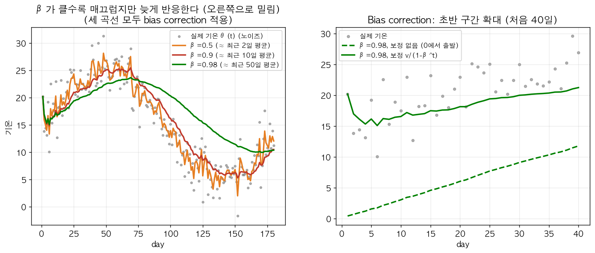

왼쪽(Lab 4와 같은 가짜 기온 데이터): 주황 β=0.5는 회색 점(실제 값)의 노이즈를 거의 그대로 따라 흔들리고, 초록 β=0.98은 아주 매끄럽지만 실제 기온은 day 50 전후로 꼭대기를 찍고 내려가는데 초록 곡선은 day 70쯤에야 꺾이고 내려오는 것도 한참 늦다(곡선이 오른쪽으로 밀림 = lag). 빨강 β=0.9가 그 중간. 오른쪽은 아래 bias correction 얘기 — 처음 40일을 확대하면, 보정 없는 점선은 실제 기온(20도 근처)과 동떨어지게 0 근처에서 출발해 천천히 올라온다.

**왜 $1/(1-\beta)$인가**: $k$일 전 값의 가중치는 $\beta^k$에 비례한다. 이게 $1/e \approx 0.37$로 줄어드는 $k$를 "기억 길이"로 보자. $\varepsilon = 1-\beta$라 하면 $(1-\varepsilon)^{1/\varepsilon} \approx 1/e$이므로 $k = 1/\varepsilon = \frac{1}{1-\beta}$. 숫자로 확인: $0.9^{10} = 0.349$, $0.98^{50} = 0.364$ — 둘 다 ≈ $1/e$. 그보다 오래된 값은 가중치가 1/3 아래로 떨어져서 사실상 기여가 작다.

| 기호 | 의미 |
|---|---|
| $e$ | 자연상수 $\approx 2.718$. $(1-\varepsilon)^{1/\varepsilon}$은 $\varepsilon \to 0$일 때 정확히 $1/e$로 간다(미적분의 $e$ 정의). 그래서 "가중치가 원래의 약 37%로 줄어드는 시점"을 기억 길이의 기준으로 쓴다 |
| $\varepsilon$ | 여기서만 쓰는 약칭 $\varepsilon = 1-\beta$ (새 값 비중). Adam/RMSprop의 $\varepsilon$(0 나누기 방지)이나 gradient checking의 $\varepsilon$(흔드는 크기)과는 **다른** 기호 재사용이다 |
| $\frac{1}{1-\beta}$ | "대략 최근 몇 스텝을 평균 내는가". $\beta = 0.9 \to 10$, $0.98 \to 50$, $0.999 \to 1000$ |

**구현이 가벼운 이유**: 최근 50일 평균을 정직하게 구하면 50개 값을 저장해야 하지만, EWMA는 변수 하나 $v$를 덮어쓰기만 하면 된다 (`v = beta * v + (1 - beta) * theta`). 메모리 1칸, 코드 1줄 — 그래서 optimizer에서 파라미터마다 쓸 수 있다.

**Bias correction이란**: 이름 그대로 "치우침(bias) 보정(correction)". 여기서 bias는 Bias/Variance의 bias나 $b$(bias 파라미터)와는 상관없고, 통계에서 말하는 **추정치가 한쪽(여기선 0 쪽)으로 체계적으로 치우친 것**을 뜻한다. **왜 필요하나**: $v_0 = 0$으로 초기화하기 때문에 초반 몇 스텝은 $v_t$가 실제 값보다 많이 작게 나온다. $\beta=0.98$이면:

$$v_1 = 0.02\,\theta_1, \qquad v_2 = 0.0196\,\theta_1 + 0.02\,\theta_2$$

기온이 $\theta_1 = \theta_2 = 40$도라도 $v_1 = 0.8$, $v_2 = 1.58$ — 말도 안 되게 작다. 이유는 위의 펼친 식에서 **가중치 합이 1이 아니기 때문**이다:

$$\sum_{k=0}^{t-1}(1-\beta)\beta^k = (1-\beta)\cdot\frac{1-\beta^t}{1-\beta} = 1-\beta^t$$

($v_0 = 0$이라 $t$개 항까지만 있음.) $t=2$면 가중치 합이 $1-0.98^2 = 0.0396$밖에 안 된다. 그러니 **가중치 합으로 나눠주면** 제대로 된 가중평균이 된다:

$$v_t^{\text{corrected}} = \frac{v_t}{1-\beta^t}$$

| 기호 | 의미 |
|---|---|
| $v_t^{\text{corrected}}$ | 보정된 $t$스텝 평균. 초반에도 실제 값 크기에 맞게 나온다. $v_t$ 자체는 그대로 두고(다음 스텝 계산에는 보정 전 $v_t$를 계속 씀), **출력으로 쓸 때만** 나눠준다 |
| $\beta^t$ | $\beta$의 $t$**제곱** (위첨자 $t$는 인덱스가 아니라 거듭제곱). $t$ = 지금까지 스텝 수(1부터). $\beta=0.98$이면 $\beta^1 = 0.98$, $\beta^{10} = 0.82$, $\beta^{100} = 0.13$, $\beta^{500} \approx 4\times10^{-5}$ |
| $1-\beta^t$ | 지금까지 가중치의 합. 초반엔 작고(0.02, 0.0396, …) $t$가 커지면 1로 간다 |

확인: $\frac{1.58}{0.0396} \approx 40$ ✓. $t$가 커지면 $\beta^t \to 0$이라서 분모 → 1, 보정 효과는 자연히 사라진다. 실전에서는(특히 Adam 구현에서) bias correction을 거의 항상 적용하지만, 곡선을 그저 warm-up 구간 이후만 신경 쓰면 되는 경우엔 생략하기도 한다. (Lab 4 그림: β=0.98 보정 없는 선은 0 근처에서 출발, 보정하면 첫날부터 실제 온도 근처.)

### Gradient Descent with Momentum

**Momentum이란**: 매 step "지금 mini-batch의 gradient"로 바로 움직이는 대신, **최근 gradient들의 EWMA(= 평균 이동 방향, 일종의 속도)**로 움직이는 gradient descent. momentum은 물리의 운동량(관성)이라는 뜻이다(아래 "이름의 물리적 의미"). **왜 필요한가**: mini-batch gradient는 노이즈가 많고, 길쭉한 그릇에서는 가파른 방향으로 매 step 부호가 바뀌며 지그재그한다. 평균을 내면 부호가 바뀌는 성분은 상쇄되고 꾸준한 성분만 남는다.

핵심 아이디어: gradient의 **exponentially weighted average**를 구해서 그 방향으로 업데이트한다. iteration $t$마다 현재 mini-batch로 $dW, db$를 구한 뒤:

$$v_{dW} = \beta v_{dW} + (1-\beta) dW, \qquad v_{db} = \beta v_{db} + (1-\beta) db$$
$$W := W - \alpha v_{dW}, \qquad b := b - \alpha v_{db}$$

| 기호 | 의미 |
|---|---|
| $dW, db$ | 이번 iteration(현재 mini-batch $X^{\{t\}}$)에서 backprop으로 구한 gradient $\frac{\partial J}{\partial W}, \frac{\partial J}{\partial b}$. EWMA 식의 관측값 $\theta_t$ 자리 |
| $v_{dW}, v_{db}$ | $dW, db$의 EWMA = "속도(velocity)". 첨자 $dW$는 "무엇의 평균인가"를 표시하는 이름표. $W, b$와 **같은 shape**, **0으로 초기화** |
| 오른쪽의 $v_{dW}$ | 직전 iteration까지의 값($v_{t-1}$). 코드에서는 같은 변수를 덮어쓰기 때문에 $t$ 첨자를 생략하고 썼다 |
| $\beta$ | momentum 계수(EWMA의 $\beta$와 같은 것). 하이퍼파라미터, **기본값 0.9**(≈ 최근 10 iteration 평균). 너무 크면(0.999) 오래된 gradient까지 끌고 다녀서 방향 전환이 느리고 최솟값을 크게 지나친다(overshoot); 너무 작으면(→0) 평균 효과가 없어져 plain GD와 같아진다($\beta=0$이면 정확히 GD) |
| $\alpha$ | learning rate — 한 번에 얼마나 움직일지의 배율. 하이퍼파라미터 |
| $:=$ | "오른쪽 값으로 덮어쓴다"(대입). 수학의 등호가 아니라 업데이트 |

(보통 bias correction은 생략해도 됨 — 10번 정도 iteration 지나면 warm-up 문제가 사라지기 때문.) $\beta = 0.9$가 가장 흔한 기본값(최근 10 iteration의 gradient 평균 정도).

**숫자로 보는 상쇄와 누적**: 등고선이 세로로 길쭉한 그릇에서 gradient가 매번 이렇게 나온다고 하자:

| iteration | 가로(진전 방향) $dW_1$ | 세로(진동 방향) $dW_2$ |
|---|---|---|
| 1 | +1 | +10 |
| 2 | +1 | −10 |
| 3 | +1 | +10 |
| 4 | +1 | −10 |

가로는 매번 같은 부호라서 평균이 $+1$ 그대로 유지(**누적**). 세로는 $+10, -10$이 번갈아 나오니까 평균 내면 0 근처(**상쇄**) — $\beta=0.9$로 몇 스텝 돌리면 $v_{dW_2}$는 $\pm1$ 수준으로 쪼그라든다. 결과: 세로 진동은 1/10로 줄고 가로 진전은 그대로 → 더 큰 $\alpha$를 써도 발산하지 않는다.

**이름의 물리적 의미**: momentum은 물리의 "운동량(관성)"이다. 무거운 공은 한 번 굴러가기 시작하면 작은 충격에는 방향이 잘 안 바뀐다. plain GD는 매 step "지금 발밑의 기울기"만 보고 움직이는 **질량 없는 점**이라 기울기가 바뀌는 대로 휙휙 꺾이지만, momentum은 **지금까지 굴러온 속도 $v$**를 기억하고 거기에 새 기울기를 조금씩 섞기 때문에 방향이 부드럽게 바뀐다.

**직관 (그림으로)**: cost function 등고선이 세로로 길쭉한 타원(elongated bowl)이라고 하면, plain GD는 최적점을 향해 가면서도 세로 방향으로 계속 진동(zigzag)한다 — 이 진동 때문에 learning rate를 크게 못 잡는다. Momentum을 쓰면 세로 방향(왔다갔다 하는 방향)의 진동은 평균 내면서 서로 상쇄(cancel out)되고, 가로 방향(계속 같은 방향으로 가는 진전 방향)의 움직임은 누적(accumulate)돼서 커진다. 마치 공을 그릇(bowl) 안에서 굴리는데 $v$가 속도(velocity), $dW$가 가속도(acceleration), $\beta$가 마찰(friction) 역할을 하는 것과 비슷하다 — 그래서 이름이 momentum.

**변형 주의**: 논문이나 다른 자료에서는 $(1-\beta)$를 빼고 $v_{dW} = \beta v_{dW} + dW$로 쓰기도 한다. 이러면 $v$가 약 $\frac{1}{1-\beta}$배(β=0.9면 10배) 커지니까 $\alpha$를 그만큼 줄여야 같은 효과다 — 즉 $\beta$를 바꿀 때마다 $\alpha$도 다시 맞춰야 해서, Ng는 $(1-\beta)$ 있는 버전을 선호한다.

### RMSprop (Root Mean Square Prop)

**RMSprop이란**: Root Mean Square propagation. 파라미터(원소)마다 **"최근 gradient 크기의 RMS(제곱 → 평균 → 제곱근)"**를 EWMA로 추적해두고, **gradient를 그 크기로 나눠서** 업데이트하는 optimizer. 그래서 gradient가 늘 큰 방향은 step이 줄고, 늘 작은 방향은 step이 상대적으로 커진다. (Hinton이 Coursera 강의에서 처음 소개한 방법이다.) **왜 필요한가**: momentum과 같은 문제 — 길쭉한 그릇에서 가파른 방향의 진동 때문에 $\alpha$를 못 키우는 문제 — 를 "평균 내기" 대신 **방향별 step 크기 조절**로 푼다.

$$s_{dW} = \beta_2 s_{dW} + (1-\beta_2) (dW)^2 \quad (\text{elementwise 제곱})$$
$$s_{db} = \beta_2 s_{db} + (1-\beta_2) (db)^2$$
$$W := W - \alpha \frac{dW}{\sqrt{s_{dW}} + \varepsilon}, \qquad b := b - \alpha \frac{db}{\sqrt{s_{db}} + \varepsilon}$$

| 기호 | 의미 |
|---|---|
| $dW, db$ | 현재 mini-batch로 구한 gradient (momentum과 같음) |
| $(dW)^2$ | **원소별(elementwise) 제곱** — 행렬 곱 $dW\,dW$가 아니라 칸마다 제곱. numpy `dW**2` |
| $s_{dW}, s_{db}$ | gradient **제곱**의 EWMA ("s"는 square). $W, b$와 같은 shape, 0으로 초기화. 항상 $\ge 0$ |
| $\beta_2$ | 제곱 평균용 EWMA 계수. 하이퍼파라미터. 첨자 2는 momentum의 $\beta$(Adam에선 $\beta_1$)와 구분하려고 붙인 것. 강의 기본 0.999(Adam과 동일), 단독 RMSprop에선 0.9도 흔함 — 너무 크면(0.999) 초반 bias 때문에 첫 step들이 튀고(아래 "β 선택 주의"), 너무 작으면 $s$가 매 step의 gradient 크기를 그대로 따라가서 "평소 크기" 추정이 흔들린다 |
| $\sqrt{s_{dW}}$ | **원소별 제곱근** = 그 칸 gradient의 RMS 크기 |
| $\frac{dW}{\sqrt{s_{dW}}+\varepsilon}$ | **원소별 나눗셈**. 각 칸 gradient를 자기 RMS 크기로 나눔 → 크기가 대략 1로 정규화된다 |
| $\varepsilon$ | 분모가 0이 되는 걸 막는 아주 작은 상수, 보통 $10^{-8}$. 하이퍼파라미터지만 거의 안 건드림. 너무 크면(예: 1) $\sqrt s$보다 $\varepsilon$이 분모를 지배해서 RMSprop 효과가 사라지고, 너무 작아도 사실상 문제 없다(0만 아니면 됨) |
| $\alpha$ | learning rate. 정규화된 step이 크기 ~1이니까 $\alpha$가 거의 그대로 "한 step에 움직이는 거리"가 된다 |

($\varepsilon \approx 10^{-8}$은 분모가 0에 너무 가까워지는 걸 막는 안전장치. 모든 연산이 원소별이라 파라미터 하나하나가 **자기만의 step 크기**를 갖는다.)

**"원소별(elementwise)"이 핵심**: $dW$가 $[0.5, 20]$이면 $(dW)^2 = [0.25, 400]$ — 행렬 곱이 아니라 각 칸을 따로 제곱한다. 그래서 $s_{dW}$도 $W$와 같은 shape이고, $W$의 칸마다 "이 칸의 gradient는 요즘 대략 이 정도 크기였다"는 기록을 따로 갖는다. momentum의 $v$가 "방향 기억"이라면 $s$는 "크기 기억"이다.

**β 선택 주의**: 첫 step을 계산해보면 $s_1 = (1-\beta_2)(dW)^2$이라서 bias correction 없이 쓰면 step $= \alpha\frac{dW}{\sqrt{1-\beta_2}\,|dW|}$, 즉 $\frac{\alpha}{\sqrt{1-\beta_2}}$만큼 튄다. $\beta_2=0.9$면 $3.2\alpha$, $\beta_2=0.999$면 $31.6\alpha$. 그래서 RMSprop 단독으로 쓸 때 $\beta_2=0.999$를 고르면 초반 몇 step이 크게 튈 수 있다(Lab 4의 `run("rmsprop", 0.3)`은 `beta2=0.999`가 기본값이라 첫 step에 $(-9, 2) \to (0.49, -7.49)$로 튄다). 아래 궤적 그림은 $\beta_2 = 0.9$로 그렸다. 이 "초반에 튀는 문제"를 제대로 고친 게 Adam의 bias correction이다.

**이름 풀이**: gradient를 **제곱(Square)**해서 → **평균(Mean)** 내고(EWMA) → **제곱근(Root)** — 즉 $\sqrt{s}$는 최근 gradient 크기의 RMS(root mean square), "요즘 이 방향 gradient가 대략 얼마나 큰가"를 추정한 값이다.

**숫자로 보는 효과**: 위 momentum 표와 같은 상황(가로 $|dW_1| \approx 1$, 세로 $|dW_2| \approx 10$)이면

$$\sqrt{s_{dW_1}} \approx 1, \quad \sqrt{s_{dW_2}} \approx 10 \ \Rightarrow\ \frac{dW_1}{\sqrt{s_{dW_1}}} \approx \pm1, \quad \frac{dW_2}{\sqrt{s_{dW_2}}} \approx \pm1$$

gradient를 자기 크기로 나누니까 **모든 방향의 step이 크기 ≈ $\alpha$로 균등해진다.** 세로는 10 → 1로 줄고(진동 억제), 가로는 1 그대로(상대적으로 커짐). Lab 4의 $f = \frac12(x^2 + 25y^2)$처럼 한 방향이 25배 가파른 함수에서도 RMSprop 궤적이 거의 대각선으로 곧장 가는 이유다.

**직관**: momentum과 같은 문제(세로 진동 억제, 가로 진전 유지)를 다른 방식으로 푼다. 진동이 심한 방향(세로, 여기서는 $b$ 방향이라고 가정)은 $dW$/$db$ 값 자체가 크니까 $s$도 커져서 → 업데이트 스텝이 그 방향으로 작아진다(나눠주니까). 반대로 진전 방향(가로, $W$ 방향)은 $dW$가 작으니 $s$도 작고 → 스텝이 상대적으로 커진다. 결과적으로 진동은 줄이고 진전 방향은 살리면서 더 큰 learning rate를 쓸 수 있게 해준다. (실제로는 "세로=$b$, 가로=$W$"처럼 깔끔하지 않고 고차원 공간의 여러 방향이 섞여 있지만 원리는 같다.)

### Adam (Adaptive Moment Estimation)

**Adam이란**: Adaptive Moment Estimation. **Momentum + RMSprop을 합친 것** — 분자에는 momentum처럼 gradient의 EWMA($v$, 방향), 분모에는 RMSprop처럼 gradient 제곱의 EWMA의 제곱근($\sqrt s$, 크기)을 쓰고, 둘 다 bias correction을 한다. 실전에서 가장 널리 쓰이고 다양한 문제에서 잘 동작하는 것으로 검증된 optimizer. (이름 풀이는 아래 "moment" 설명에서.) **왜 필요한가**: momentum은 진동 상쇄, RMSprop은 방향별 step 크기 균등화 — 두 장점을 한 번에 얻고, 초반 튐 문제는 bias correction으로 없앤다.

초기화 $v_{dW} = 0,\ s_{dW} = 0$ (그리고 $b$용도 똑같이). iteration $t$마다 $dW, db$를 구한 뒤:

$$\underbrace{v_{dW} = \beta_1 v_{dW} + (1-\beta_1) dW}_{\text{momentum (1차 moment)}}, \qquad \underbrace{s_{dW} = \beta_2 s_{dW} + (1-\beta_2)(dW)^2}_{\text{RMSprop (2차 moment)}}$$
$$v_{dW}^{\text{corrected}} = \frac{v_{dW}}{1-\beta_1^t}, \qquad s_{dW}^{\text{corrected}} = \frac{s_{dW}}{1-\beta_2^t}$$
$$W := W - \alpha \frac{v_{dW}^{\text{corrected}}}{\sqrt{s_{dW}^{\text{corrected}}} + \varepsilon}$$

| 기호 | 의미 |
|---|---|
| $t$ | 지금까지 한 업데이트 횟수(iteration 번호). **1부터** 세고 매 mini-batch마다 1 증가. bias correction의 거듭제곱 지수로 쓰인다 (epoch 번호가 아님) |
| $v_{dW}$ | gradient의 EWMA — 1차 moment 추정 (momentum의 $v$와 동일) |
| $s_{dW}$ | gradient **원소별 제곱**의 EWMA — 2차 moment 추정 (RMSprop의 $s$와 동일) |
| $\beta_1$ | $v$용 EWMA 계수 (기본 0.9) |
| $\beta_2$ | $s$용 EWMA 계수 (기본 0.999) |
| $\beta_1^t, \beta_2^t$ | $\beta_1$, $\beta_2$의 $t$**제곱**. $t$가 커지면 0으로 가서 보정이 자연히 꺼진다 |
| $v^{\text{corrected}}, s^{\text{corrected}}$ | bias correction한 값(EWMA 절 참고). **업데이트에만** 쓰고, 다음 iteration의 EWMA 계산에는 보정 전 $v, s$를 쓴다 |
| $\sqrt{\cdot}$, 나눗셈 | 전부 **원소별** |
| $\varepsilon$ | 0 나누기 방지 상수, $10^{-8}$ |
| $\alpha$ | learning rate — Adam에서 사실상 유일하게 튜닝하는 값 |

($b$에 대해서도 동일하게 $v_{db}, s_{db}$를 계산하고 업데이트. 여기서는 bias correction을 반드시 적용.)

**분자/분모 역할 분담**: 분자 $v$는 "어느 **방향**으로 갈지"(진동을 상쇄한 평균 방향), 분모 $\sqrt{s}$는 "그 파라미터에서 **얼마나 크게** 갈지"(자기 gradient 크기로 정규화)를 정한다.

**왜 bias correction이 여기선 필수인가 — 첫 스텝($t=1$)을 계산해보면**:

$$v_1 = 0.1\,dW,\quad s_1 = 0.001\,(dW)^2$$

보정 없이 쓰면 step $= \alpha\frac{0.1\,dW}{\sqrt{0.001}\,|dW|} = \alpha\cdot\frac{0.1}{0.0316}\cdot\text{sign}(dW) \approx 3.16\alpha$ — 의도보다 3배 큰 step이 튀어나간다 ($\beta_2 = 0.999$라 $s$ 쪽이 훨씬 더 심하게 0에 끌려가 있어서). 보정하면:

$$v_1^{\text{corr}} = \frac{0.1\,dW}{1-0.9} = dW,\quad s_1^{\text{corr}} = \frac{0.001\,(dW)^2}{1-0.999} = (dW)^2 \ \Rightarrow\ \text{step} = \alpha\frac{dW}{|dW|} = \alpha\cdot\text{sign}(dW)$$

(여기서 $|dW|$는 원소별 절댓값, $\text{sign}(dW)$는 원소별 부호 — 양수면 $+1$, 음수면 $-1$. $\sqrt{(dW)^2} = |dW|$이라서 $\frac{dW}{|dW|} = \text{sign}(dW)$다. $\varepsilon$은 너무 작아서 생략했다.)

첫 스텝이 정확히 크기 $\alpha$가 된다. 이 계산이 보여주는 Adam의 성질: **각 파라미터의 step 크기가 대략 $\alpha$ 이하로 묶인다** — gradient 스케일과 무관하게 $\alpha$가 "한 번에 움직이는 최대 거리" 역할을 해서, $\alpha$ 튜닝이 직관적이 된다.

**기본 하이퍼파라미터** (거의 항상 이대로 씀, 튜닝 잘 안 함 — $\alpha$만 주로 튜닝):

| 하이퍼파라미터 | 기본값 | 의미 |
|---|---|---|
| $\alpha$ | 튜닝 필요 | 한 스텝 크기의 스케일. 너무 크면 최솟값 주변을 크게 튀거나 발산, 너무 작으면 수렴이 느림 |
| $\beta_1$ | 0.9 | gradient 평균을 최근 ~10 스텝으로. 너무 크면 관성이 커서 overshoot, 너무 작으면 momentum 효과 소실 |
| $\beta_2$ | 0.999 | gradient 제곱 평균을 최근 ~1000 스텝으로. 너무 작으면 분모가 매 step 흔들려 step 크기가 불안정 |
| $\varepsilon$ | $10^{-8}$ | 0으로 나누기 방지 (성능에 거의 영향 없음) |

이름의 유래: **Adaptive Moment estimation** — $\beta_1$은 gradient의 1차 moment(평균, $\mathbb{E}[dW]$), $\beta_2$는 2차 moment(제곱의 평균, $\mathbb{E}[(dW)^2]$ — 평균이 0 근처면 분산과 비슷)를 추정하는 것에서 왔다.

**"moment"가 뭔데?** 통계 용어로, 랜덤한 값 $X$에 대해 **$X^k$의 평균** $\mathbb{E}[X^k]$을 "$k$차 moment"라고 부른다. 그냥 "값을 $k$제곱해서 평균 낸 것"이다. 예: gradient가 최근에 $[+2, -2, +2, -2]$로 나왔다면 1차 moment(그냥 평균) = 0, 2차 moment(제곱의 평균) = 4. 1차는 **"평균적으로 어느 쪽을 가리키나(방향)"**, 2차는 **"부호와 상관없이 얼마나 크게 흔들리나(크기)"**를 알려준다. 이 예시처럼 방향은 왔다갔다(1차 ≈ 0)인데 크기는 큰(2차 = 4) 파라미터라면, Adam의 step $\approx \alpha\cdot 0/\sqrt4 \approx 0$ — 진동만 하는 방향으로는 거의 안 움직인다. Adam은 이 두 moment를 EWMA로 **추정(estimation)**하고, 파라미터마다 step을 **맞춤 조절(adaptive)**하니까 Adaptive Moment Estimation이다.

**네 optimizer를 같은 그릇 위에서 비교** (Lab 4의 $f = \frac12(x^2 + 25y^2)$, 시작점 $(-9, 2)$, 60 step):

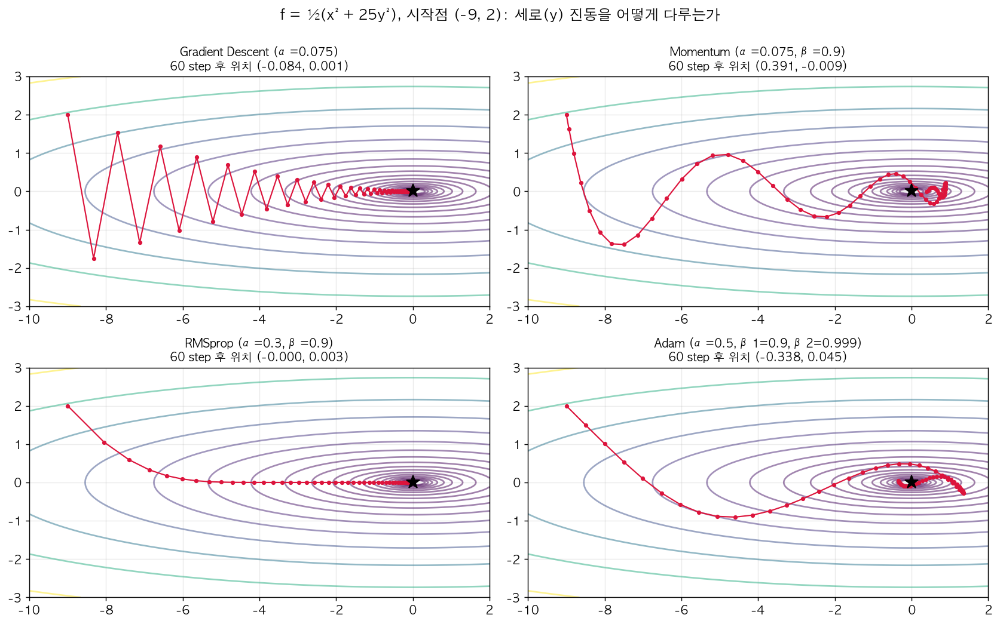

- **GD** (α=0.075, 발산 한계 0.08 바로 아래): 세로로 크게 지그재그. y 방향이 가팔라서 α를 더 못 올리니 x 방향 전진이 느리다.
- **Momentum** (α=0.075, β=0.9): 지그재그가 사라지고 **부드러운 곡선**이 된다 — ±로 번갈아 나오던 y gradient가 평균에서 상쇄된 결과. 대신 쌓인 속도 때문에 최솟값을 한 번 지나쳤다가(x > 0) 되돌아오는 관성도 보인다(60 step 후 (0.39, −0.01)). 이 예시의 핵심은 "빨라진다"보다 "진동 없이 간다"는 쪽이다.
- **RMSprop** (α=0.3, β=0.9): 처음 몇 step에 y 방향을 빠르게 정리하고 거의 x축을 따라 직진, 60 step 후 (0.000, 0.003)로 사실상 도착. y 방향은 $|g|$가 커서 $\sqrt s$로 크게 나눠지고, x 방향은 상대적으로 덜 나눠진 결과다.
- **Adam** (α=0.5, 기본 β₁=0.9, β₂=0.999): RMSprop처럼 방향별 step이 정규화되어 대각선으로 내려오면서, momentum의 관성 때문에 최솟값 근처를 한 번 돌고 들어온다. 첫 step이 정확히 (−8.5, 1.5) — 두 좌표 모두 **정확히 α=0.5만큼** 움직였다. 위 "첫 스텝 = $\alpha\cdot\text{sign}(dW)$" 계산 그대로다.

(이 장난감 함수는 축이 딱 x, y로 나뉘어 있어서 RMSprop에 특히 유리하다. 실제 신경망에서 어느 optimizer가 제일 빠른지는 문제마다 다르고, Adam이 기본값으로 널리 쓰이는 건 "대부분의 문제에서 튜닝 없이도 무난하게 잘 된다"는 경험 때문이다.)

### Learning Rate Decay

**Learning rate decay란**: learning rate $\alpha$를 학습 내내 고정하지 않고 **학습이 진행될수록 점점 줄이는(decay)** 것. "decay = 감쇠, 점점 줄어듦". 줄이는 규칙(스케줄)은 사람이 미리 정한다.

학습 초반에는 큰 스텝으로 빠르게 진전하고, 최솟값 근처에 갈수록 스텝을 줄여서(learning rate를 점점 줄여서) 진동 폭을 좁혀 더 정밀하게 수렴하게 만드는 기법. mini-batch GD처럼 애초에 noisy한 알고리즘에서 특히 유용 — 고정된 $\alpha$면 최솟값 근처에서 계속 큰 범위로 왔다갔다 하지만(never exactly converge), decay를 적용하면 그 범위가 점점 좁아진다.

대표적인 decay 공식들 (epoch_num은 1부터):

$$\alpha = \frac{1}{1+\text{decay\_rate} \times \text{epoch\_num}} \cdot \alpha_0$$

| 기호 | 의미 |
|---|---|
| $\alpha$ | 지금 이 epoch에서 실제로 쓰는 learning rate (매 epoch 다시 계산) |
| $\alpha_0$ | **초기 learning rate** (epoch 0 기준값). 하이퍼파라미터 — 너무 크면 초반부터 발산, 너무 작으면 decay가 걸리기도 전에 이미 느림 |
| decay_rate | **얼마나 빨리 줄일지** 정하는 하이퍼파라미터($\ge 0$). 0이면 decay 없음(고정 $\alpha$), 크면 몇 epoch 만에 $\alpha$가 거의 0이 돼서 학습이 일찍 멈춰버리고, 너무 작으면 사실상 고정 $\alpha$와 같다 |
| epoch_num | 지금이 몇 번째 **epoch**인가 (전체 train set을 몇 번 다 훑었나). **1부터** 센다. mini-batch 번호 $t$가 아니라 epoch 단위로 줄이는 게 기본 — 같은 epoch 안에서는 $\alpha$가 그대로다 |

숫자로 ($\alpha_0 = 0.2$, decay_rate $= 1$):

| epoch | 1 | 2 | 3 | 4 |
|---|---|---|---|---|
| $\alpha$ | $\frac{0.2}{2} = 0.1$ | $\frac{0.2}{3} = 0.067$ | $\frac{0.2}{4} = 0.05$ | $\frac{0.2}{5} = 0.04$ |

그 외:

$$\alpha = 0.95^{\text{epoch\_num}} \cdot \alpha_0 \quad \text{(exponential decay — 매 epoch 5\%씩 감소)}$$
$$\alpha = \frac{k}{\sqrt{\text{epoch\_num}}} \cdot \alpha_0 \quad \text{또는} \quad \frac{k}{\sqrt{t}}\alpha_0 \quad (t\text{는 mini-batch 번호})$$

여기서 **0.95**는 "한 epoch마다 남기는 비율"인 하이퍼파라미터(0.9면 더 빨리, 0.99면 더 천천히 줄어든다 — 0.95를 $n$번 곱하면 $0.95^n$이라 exponential decay)이고, **$k$**는 $\frac{1}{\sqrt{\cdot}}$ 스케줄의 세기를 정하는 상수(하이퍼파라미터), **$t$**는 mini-batch 번호(1부터, epoch가 아니라 업데이트 단위로 줄이고 싶을 때)다.

혹은 discrete staircase(몇 epoch마다 절반으로 줄이기)나 수동 decay(사람이 보면서 직접 조정)도 실전에서 쓰인다.

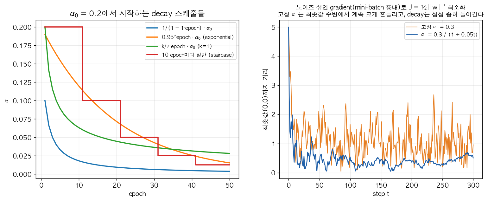

왼쪽: 같은 $\alpha_0 = 0.2$에서 출발해도 스케줄마다 줄어드는 속도가 크게 다르다. $\frac{1}{1+\text{epoch}}$(파랑)은 첫 epoch부터 절반(0.1)으로 뚝 떨어지고, $0.95^{\text{epoch}}$(주황)은 천천히 꾸준히, staircase(빨강)는 계단식이다. 오른쪽이 decay가 **왜 필요한지**다: gradient에 mini-batch 노이즈를 섞어서 $J = \frac12\|w\|^2$를 최소화했을 때 최솟값까지 거리. 고정 α(주황)는 금방 최솟값 근처에 오지만 거기서 **계속 크게 흔들린다**(마지막 100 step 평균 거리 0.97). decay(파랑)는 step이 작아지면서 흔들림 폭이 줄어든다(평균 거리 0.40). 노이즈가 있는 한 고정 α로는 "최솟값 주변의 어떤 범위" 이상으로 좁혀지지 않는다는 게 핵심. 이제 $\alpha_0$과 decay_rate 두 개가 하이퍼파라미터가 된다. Ng는 하이퍼파라미터 튜닝 우선순위에서 learning rate decay는 상대적으로 낮은 우선순위라고 언급한다 — 고정 $\alpha$부터 잘 잡고, 다른 것들(아래 Week 3) 먼저 튜닝하고 여유 있을 때 시도.

### Local Optima보다 Saddle Point / Plateau가 진짜 문제

**용어부터**:
- **Local optimum(극소점)**: 주변 어느 방향으로 조금 움직여도 cost가 올라가는 점 — 그릇의 바닥. gradient가 0이다. 전체에서 가장 낮은 점(global optimum)이 아닐 수도 있어서, 예전에는 "GD가 나쁜 local optimum에 갇히면 어쩌나"를 많이 걱정했다.
- **Saddle point(안장점)**: gradient는 0인데 **어떤 방향으로는 올라가고 어떤 방향으로는 내려가는** 점. 말 안장 가운데를 생각하면 된다 — 앞뒤(말 머리-꼬리 방향)로는 올라가고, 좌우(다리 쪽)로는 내려간다. gradient가 0이라 GD가 잠깐 느려지지만, 내려갈 방향이 있으니 **갇힌 게 아니다.**
- **"휘어짐(curvature)"**: 그 점에서 한 방향으로 가면서 cost가 위로 휘는지(그릇처럼, 2차 미분 > 0) 아래로 휘는지(뒤집은 그릇처럼, 2차 미분 < 0). 여러 방향의 휘어짐을 모아놓은 행렬이 Hessian인데, 강의 수준에서는 "방향마다 위로/아래로 휜 정도"라고만 알면 충분하다.

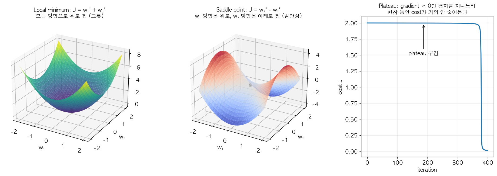

왼쪽 $J = w_1^2 + w_2^2$는 어느 방향으로 가도 올라가는 그릇(진짜 극소점). 가운데 $J = w_1^2 - w_2^2$는 원점에서 gradient가 0이지만 $w_1$ 방향으로는 위로, $w_2$ 방향으로는 아래로 휜 말안장이다. 오른쪽은 plateau(아래 설명) — cost가 한참(여기선 약 370 iteration) 거의 그대로 2.0에 머물다가 평지를 벗어나는 순간 뚝 떨어진다. 학습 곡선이 오래 평평하다고 해서 "끝났다/갇혔다"고 단정하면 안 되는 이유다.

저차원(2D) 직관과 달리 고차원 공간(파라미터가 수만~수백만 개)에서는 **모든 방향에서 볼록(convex, 즉 아래로 볼록 — 모든 방향에서 그릇처럼 위로 휘어 올라가는 모양)한 진짜 local optimum(극소점)**은 매우 드물다 — 파라미터가 수만~수백만 개라 "방향"의 개수도 그만큼 많은데, 그 모든 방향에서 동시에 아래로 볼록해야 진짜 극소점이 되기 때문이다. 어느 한 방향에서라도 반대로(위로 볼록하게, 즉 그 방향으로는 아래로 내려갈 수 있게) 휘어져 있을 확률이 높아서, gradient가 0인 지점 대부분은 **saddle point(안장점)**다 (일부 방향은 아래로, 일부 방향은 위로 볼록한 지점 — 말안장 모양).

**확률로 러프하게**: gradient = 0인 지점에서 각 방향이 "위로 휨/아래로 휨"일 확률이 반반이고 서로 독립이라고 치면, $n$개 방향이 **전부** 위로 휘어 있을(진짜 극소점) 확률은

$$\left(\frac12\right)^n, \qquad n = 20{,}000 \Rightarrow 2^{-20000} \approx 0$$

현실이 이렇게 단순하진 않지만, "고차원에서 진짜 local optimum에 걸릴 걱정은 거의 안 해도 된다"는 직관은 이걸로 충분하다.

그래서 딥러닝에서 실제로 학습을 느리게 만드는 주범은 local optima에 갇히는 게 아니라, **plateau(평지)** — gradient가 아주 오랫동안 0에 가까운, 넓고 평평한 구간을 느릿느릿 가로질러야 하는 것이다. 이럴 때 Momentum, RMSprop, Adam 같은 알고리즘이 이 plateau를 더 빨리 빠져나가게 도와준다는 게 이 optimizer들의 실질적인 가치다. (RMSprop/Adam은 gradient가 작으면 $\sqrt{s}$도 작아져서 나눈 값이 다시 ≈1 크기가 되니까, 평평한 곳에서도 step이 안 줄어든다.)

---

## Week 3: Hyperparameter Tuning, Batch Norm, Softmax & Frameworks

### 하이퍼파라미터 튜닝 우선순위

지금까지 나온 하이퍼파라미터가 꽤 많다: $\alpha$, $\beta$ (momentum), $\beta_1,\beta_2,\varepsilon$ (Adam), layer 수, 각 layer의 hidden unit 수, learning rate decay, mini-batch size... Ng이 제시하는 대략적인 우선순위:

1. **1순위 (거의 항상 가장 중요): $\alpha$ (learning rate)**
2. **2순위**: momentum term $\beta$ (보통 0.9 근처), mini-batch size, hidden unit 개수
3. **3순위**: layer 개수, learning rate decay
4. **거의 튜닝 안 함**: Adam의 $\beta_1=0.9$, $\beta_2=0.999$, $\varepsilon=10^{-8}$ — 이건 "이건 걱정 안 해도 된다"에 해당하는, 사실상 고정값으로 취급.

(참고: 이 우선순위는 절대적이지 않고 문제/도메인에 따라 달라질 수 있다는 언급이 있지만, 대체로 이 순서를 따르면 된다.)

### Grid Search 대신 Random Search

전통적인 ML에서는 하이퍼파라미터 2개를 격자(grid)로 만들어서 각 교차점을 다 시도하는 **grid search**를 많이 썼다. 그런데 딥러닝에서는 **random search**를 권장한다.

**이유**: 하이퍼파라미터마다 결과에 미치는 영향력이 다르다. 예를 들어 $\alpha$는 결과에 큰 영향을 주고 $\varepsilon$은 거의 영향이 없다고 하자. Grid search(5×5 grid라면)로는 $\alpha$ 값을 딱 5가지만 시도해본 셈이 된다 (나머지 축인 $\varepsilon$을 바꿔봐야 사실상 같은 $\alpha$를 5번 반복 시도한 것). 반면 random search로 25개 점을 무작위로 뽑으면 $\alpha$ 값을 25가지 다른 값으로 시도해보게 된다 — 어떤 하이퍼파라미터가 중요한지 미리 알 수 없는 상황에서 훨씬 효율적으로 탐색 공간을 커버한다. 하이퍼파라미터가 3개면 격자는 정육면체가 되고($5^3 = 125$번 돌려도 각 축은 5개 값), 차원이 늘수록 이 낭비가 더 커진다.

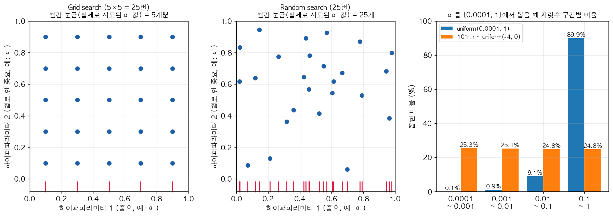

왼쪽 두 그림이 grid vs random이다. 두 방법 모두 25번 학습하지만, 아래쪽 빨간 눈금(실제로 시도된 $\alpha$ 값)을 보면 grid는 5개 위치에 5번씩 겹쳐 찍혀 있고 random은 25개가 전부 다른 위치다. 세로축($\varepsilon$)이 결과에 거의 영향이 없다면 grid의 25번 중 20번은 사실상 중복 실험이다. (오른쪽 막대그래프는 다음 절 log scale 얘기.)

**Coarse to Fine**: 넓은 범위에서 random search로 대충 탐색한 뒤, 성능이 좋았던 하이퍼파라미터들이 몰려있는 좁은 영역을 찾아서 그 영역 안에서 다시 더 촘촘하게(finer) random search를 반복하는 전략. 탐색을 점점 좁혀가며 refine한다.

전체 튜닝 루프를 한 장으로 그리면:

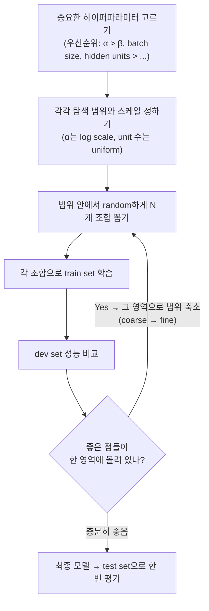

### 적절한 스케일 선택 (Log Scale)

하이퍼파라미터를 무작위로 뽑을 때 **uniform(선형) 스케일로 뽑으면 안 되는 경우**가 있다. (hidden unit 수 50~100, layer 수 2~4 같은 건 uniform으로 뽑아도 괜찮다.)

- **$\alpha$ (learning rate)**: 범위가 $0.0001 \sim 1$이라고 하면, 선형(uniform)하게 뽑으면 뽑힌 값의 90%가 $0.1\sim1$ 구간에 몰리고 $0.0001\sim0.1$ 구간은 합쳐서 10%만 뽑힌다 — 근데 실제로는 작은 $\alpha$ 구간에서도 세밀한 탐색이 똑같이 중요하다. 그래서 **log scale**로 뽑는다:

```python
r = -4 * np.random.rand()      # r ~ Uniform(-4, 0)
alpha = 10 ** r                 # alpha ~ [10^-4, 10^0], log-uniform
```

**왜 이게 균등한가**: 지수 $r$을 uniform으로 뽑으면 $[10^{-4}, 10^{-3})$, $[10^{-3}, 10^{-2})$, $[10^{-2}, 10^{-1})$, $[10^{-1}, 1)$ 네 구간(각각 $r$의 길이 1짜리 구간)에 **25%씩** 떨어진다(Lab 5 체크포인트). 일반화: 범위가 $[a, b]$면 $r \sim U[\log_{10}a,\ \log_{10}b]$, $\alpha = 10^r$. learning rate는 "0.001 vs 0.002"(2배)나 "0.1 vs 0.2"(2배)나 효과 차이가 비슷하다 — **비율(배수)이 중요한 값**이라서 로그 축에서 균등하게 뽑는 게 맞다.

위 그림의 오른쪽 막대그래프가 이걸 10만 번 뽑아서 확인한 것이다. 파란 막대(uniform)는 0.1~1 구간에 89.9%가 몰리고 0.0001~0.001 구간에는 0.1%만 떨어진다 — 25번 실험하면 가장 작은 자릿수는 한 번도 안 시도될 가능성이 높다. 주황 막대(log scale)는 네 자릿수 구간에 약 25%씩 고르게 나뉜다.

**"log scale"이 처음이라면**: 보통 자(선형 스케일)는 0, 1, 2, 3처럼 **같은 간격 = 같은 차이(+1)**다. log scale 자는 0.0001, 0.001, 0.01, 0.1, 1처럼 **같은 간격 = 같은 배수(×10)**다. "지수 $r$을 균등하게 뽑고 $10^r$로 바꾼다"는 건 바로 이 log 자 위에서 균등하게 점을 찍는다는 뜻이다.

- **$\beta$ (exponentially weighted average의 계수, 예: momentum)**: 범위가 $0.9 \sim 0.999$라고 하면, $\beta$가 1에 아주 가까워질수록 $1/(1-\beta)$(평균 내는 기간)가 훨씬 민감하게 커진다:

| $\beta$ 변화 | $\frac{1}{1-\beta}$ (평균 기간) 변화 | 차이 |
|---|---|---|
| $0.9 \to 0.9005$ | $10 \to 10.05$ | 거의 없음 |
| $0.999 \to 0.9995$ | $1000 \to 2000$ | 2배 |

똑같이 0.0005 움직였는데 효과가 완전히 다르다. 그래서 $\beta$가 아니라 **$1-\beta$를 log scale로** 뽑는다:

```python
r = np.random.uniform(-3, -1)   # r ~ Uniform(-3, -1)
one_minus_beta = 10 ** r        # 1-β ∈ [0.001, 0.1]
beta = 1 - one_minus_beta       # β ∈ [0.9, 0.999]
```

즉 $1-\beta \in [0.001, 0.1]$을 log-uniform하게 뽑는 것 — 1에 가까운 쪽(0.99~0.999)을 더 촘촘하게 탐색하게 된다.

### Pandas vs. Caviar (하이퍼파라미터 튜닝을 실행하는 두 가지 방식)

컴퓨팅 자원 상황에 따라 튜닝하는 방식 자체가 달라진다.

- **Panda 방식 (Babysitting one model)**: 자원이 부족해서(GPU 한두 대) 여러 모델을 동시에 학습시킬 여유가 없을 때, 모델 하나를 오랜 기간 지켜보면서 하이퍼파라미터를 조금씩 수동으로 조정해가는 방식 — 판다가 새끼를 한 마리만 낳고 정성껏 돌보는 것에 비유. (예: 하루 지켜보고 learning rate를 살짝 올려보고, 이상하면 어제 체크포인트로 되돌리기)
- **Caviar 방식 (Training many models in parallel)**: 자원이 충분할 때, 여러 하이퍼파라미터 조합으로 여러 모델을 동시에 병렬로 학습시킨 뒤 가장 좋은 걸 고르는 방식 — 물고기가 알을 아주 많이 낳고 그중 일부만 살아남길 기대하는 것에 비유.

### Batch Normalization

**아이디어**: input feature를 정규화(Week 1)하면 학습이 빨라진다는 걸 배웠다. 그런데 깊은 네트워크에서는 각 레이어의 출력 $a^{[l]}$(혹은 정확히는 activation 적용 전의 $z^{[l]}$)도 그다음 레이어 입장에서는 "input"이다. 그러니 **각 hidden layer의 $z^{[l]}$도 정규화**하면 그다음 레이어의 학습도 빨라지지 않을까 — 이게 batch norm의 출발점. ($a$를 정규화할지 $z$를 정규화할지 논쟁이 있지만 $z$가 기본.)

**수식** (mini-batch 단위로, layer $l$의 $z^{(1)}, \dots, z^{(m)}$에 대해 — 여기서 $m$은 **mini-batch 크기**):

$$\mu = \frac{1}{m}\sum_i z^{(i)}, \qquad \sigma^2 = \frac{1}{m}\sum_i (z^{(i)}-\mu)^2$$
$$z_{\text{norm}}^{(i)} = \frac{z^{(i)}-\mu}{\sqrt{\sigma^2+\varepsilon}}$$
$$\tilde{z}^{(i)} = \gamma z_{\text{norm}}^{(i)} + \beta$$

**shape으로 보면**: $Z^{[l]}$이 $(n^{[l]}, m)$이면 $\mu, \sigma^2$은 **unit(행)마다 하나씩** 구해서 $(n^{[l]}, 1)$ — 샘플 방향(axis=1)으로 평균을 낸다. $\gamma^{[l]}, \beta^{[l]}$도 $(n^{[l]}, 1)$. 즉 hidden unit 하나하나가 "이번 mini-batch에서 내 $z$ 값들"을 평균 0, 분산 1로 맞춘 뒤, 자기만의 $\gamma, \beta$로 다시 늘이고 옮긴다. $\varepsilon$은 $\sigma^2 = 0$일 때 0으로 나누기 방지.

**숫자 예** (unit 하나, mini-batch 4개): $z = [2, 4, 6, 8]$

$$\mu = 5,\quad \sigma^2 = \frac{9+1+1+9}{4} = 5,\quad z_{\text{norm}} = \frac{[-3,-1,1,3]}{\sqrt5} = [-1.34, -0.45, 0.45, 1.34]$$

$\gamma = 2, \beta = 7$이면 $\tilde z = [4.32, 6.11, 7.89, 9.68]$ — 평균 7, 표준편차 2. (Lab 5에서 unit마다 스케일이 1, 10, 100, 0.1로 제각각인 $Z$가 BN 후 전부 평균 0/표준편차 1이 되는 걸 확인한다.)

여기서 $\gamma, \beta$는 **학습 가능한(learnable) 파라미터**다 (Adam이나 momentum의 $\beta$와는 다른, 완전히 별개의 파라미터니 헷갈리지 말 것). $W, b$처럼 backprop으로 $d\gamma, d\beta$를 구해서 GD/Adam으로 업데이트한다. $\gamma, \beta$를 두는 이유: 항상 평균 0, 분산 1로 고정해버리면 hidden unit이 표현할 수 있는 값의 범위가 너무 제한된다 — 예를 들어 sigmoid activation을 쓰는 경우 $z$가 항상 0 근처에만 몰려 있으면 sigmoid의 비선형(nonlinear) 구간을 활용 못 하고 거의 선형 구간만 쓰게 된다. $\gamma, \beta$를 학습시켜서 네트워크가 원하는 평균/분산을 스스로 찾게 해준다.

**정규화를 되돌릴 수도 있다**: $\gamma=\sqrt{\sigma^2+\varepsilon}$, $\beta=\mu$로 학습되면

$$\tilde z = \sqrt{\sigma^2+\varepsilon}\cdot\frac{z-\mu}{\sqrt{\sigma^2+\varepsilon}} + \mu = z$$

정규화가 완전히 무효화(identity)된다. 즉 batch norm은 "정규화를 강제"하는 게 아니라 "정규화 여부/정도를 학습 가능하게" 만드는 것.

**네트워크에서의 위치**: $z^{[l]} = W^{[l]}a^{[l-1]}+b^{[l]}$를 계산한 뒤 batch norm을 적용해서 $\tilde{z}^{[l]}$을 만들고, 여기에 activation을 적용해 $a^{[l]} = g^{[l]}(\tilde{z}^{[l]})$을 얻는 순서다:

$$a^{[l-1]} \xrightarrow{W^{[l]},\,b^{[l]}} z^{[l]} \xrightarrow{\text{BN}(\gamma^{[l]},\,\beta^{[l]})} \tilde z^{[l]} \xrightarrow{g^{[l]}} a^{[l]}$$

네트워크 전체로 펼치면 BN이 **모든 hidden layer의 선형 계산과 activation 사이**에 끼어드는 모양이다. 한 mini-batch $X^{\{t\}}$에 대해:

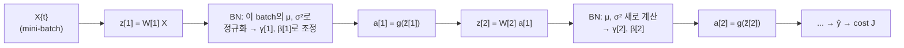

학습되는 파라미터는 층마다 $W^{[l]}, \gamma^{[l]}, \beta^{[l]}$이고 ($b^{[l]}$은 아래 이유로 빠짐), 셋 다 backprop으로 gradient를 구해서 GD/momentum/Adam으로 업데이트한다. $\mu, \sigma^2$은 학습 대상이 아니라 **mini-batch마다 그 자리에서 계산**되는 값이다.

**$b^{[l]}$이 사라지는 이유**: $b$는 모든 샘플에 똑같이 더해지는 상수라서 평균에도 그대로 더해진다:

$$z^{(i)} + b - \text{mean}(z + b) = z^{(i)} + b - (\mu + b) = z^{(i)} - \mu$$

$b$가 뭐든 평균 빼는 순간 상쇄된다. 그래서 **batch norm을 쓰는 레이어에서는 $b^{[l]}$을 생략**해도 되고(0으로 고정), 대신 $\beta^{[l]}$이 그 역할(offset/bias)을 대신한다. 파라미터는 레이어마다 $W^{[l]}, \gamma^{[l]}, \beta^{[l]}$.

**왜 batch norm이 효과가 있는가**

1. Input 정규화와 같은 원리로, 각 레이어 입력 스케일을 비슷하게 맞춰줘서 학습을 빠르게 함 (위의 "찌그러진 그릇" 문제를 hidden layer에서도 풀어준다).
2. **Covariate shift 완화**: 먼저 용어. **covariate**는 통계에서 "입력 변수($x$)"를 부르는 말이고, **covariate shift**는 "입력 $x$의 분포가 바뀌었는데 $x \to y$ 규칙 자체는 그대로인 상황"이다. 예: 흑고양이 사진만으로 고양이 분류기를 학습시켰는데 실제로는 여러 색 고양이가 들어온다 — "고양이냐 아니냐"라는 정답 규칙은 안 바뀌었지만 입력 분포가 바뀌어서 모델이 헤맨다. 이제 이걸 **hidden layer 하나의 입장**에서 보자. layer 3 입장에서 자기 입력은 $a^{[2]}$인데, $a^{[2]}$는 앞쪽 $W^{[1]}, W^{[2]}$가 만든 값이다. 학습 중에 $W^{[1]}, W^{[2]}$가 매 step 바뀌니까 layer 3은 **자기 입력 분포가 계속 움직이는 상황**(이것도 일종의 covariate shift)에서 학습해야 한다.

   조금 더 풀어서: 앞쪽 레이어의 파라미터가 학습 중에 계속 바뀌면, 뒤쪽 레이어 입장에서는 자기 입력의 분포가 계속 변하는 것처럼 보인다(covariate shift) — 마치 흑고양이만 보고 학습했는데 시험 때는 다른 색 고양이가 나오는 것처럼, 학습 도중 "타겟이 계속 움직이는" 문제. Batch norm은 각 레이어 입력의 평균/분산을 ($\gamma,\beta$로 제어되는 값으로) 어느 정도 안정적으로 유지시켜줘서, 뒤쪽 레이어가 앞쪽 레이어의 변화에 덜 흔들리게 만든다 — 값 자체는 바뀌어도 "평균 $\beta$, 분산 $\gamma^2$"이라는 틀은 유지되니까. 각 레이어가 좀 더 독립적으로 학습할 수 있게 되어 전체 학습이 안정되고 빨라진다.
3. **약간의 regularization 부수 효과**: mini-batch 단위로 평균/분산을 계산하다 보니 그 mini-batch에만 존재하는 노이즈가 $\tilde z$에 섞여 들어간다 — 같은 샘플이라도 어떤 mini-batch에 속하느냐에 따라 $\mu, \sigma^2$가 달라서 $\tilde z$가 조금씩 흔들린다. dropout과 비슷하게 약한 noise를 주입하는 효과가 있어서 아주 약간의 regularization 효과를 낸다. (다만 이건 부수 효과일 뿐, batch norm을 regularizer로 쓰려고 설계된 건 아니다. mini-batch size를 키우면(64 → 512) 평균 추정이 정확해져서 이 noise/regularization 효과는 줄어든다.)

**Test 시점 처리**: test할 때는 보통 샘플을 한 개씩 처리하는데, 그러면 mini-batch의 $\mu, \sigma^2$를 계산할 수가 없다 (샘플 1개면 $\mu = z$, $\sigma^2 = 0$ → $z_{\text{norm}} = 0$, 의미 없음). 그래서 학습 중에 각 레이어에서 만난 $\mu^{\{1\}}, \mu^{\{2\}}, \dots$들의 **exponentially weighted (moving) average(running average)**를 별도로 계속 추적해뒀다가:

$$\mu_{\text{running}} = 0.9\,\mu_{\text{running}} + 0.1\,\mu^{\{t\}} \qquad (\sigma^2\text{도 동일})$$

test 시에는 그 running average 값을 $\mu, \sigma^2$로 사용해서 $z_{\text{norm}}$과 $\tilde z$를 계산한다 (Lab 5의 `running_mu`). 앞에서 배운 EWMA가 여기서 또 쓰인다.

### Softmax Regression

이진 분류를 넘어 **다중 클래스 분류(multi-class classification, $C$개 클래스)**로 확장하는 방법. 예: 고양이(1)/강아지(2)/병아리(3)/그 외(0) → $C = 4$. 출력층 unit 수 $n^{[L]} = C$이고, 각 unit이 "이 클래스일 확률"을 낸다. 마지막 레이어(layer $L$)에서:

$$z^{[L]} = W^{[L]}a^{[L-1]} + b^{[L]} \in \mathbb{R}^C, \qquad t = e^{z^{[L]}} \ (\text{elementwise}), \qquad a^{[L]}_i = \frac{t_i}{\sum_{j=1}^C t_j}$$

**강의 숫자 예**: $z^{[L]} = [5, 2, -1, 3]$

$$t = [e^5, e^2, e^{-1}, e^3] = [148.4,\ 7.4,\ 0.4,\ 20.1], \qquad \sum t = 176.3$$
$$a^{[L]} = \left[\frac{148.4}{176.3}, \frac{7.4}{176.3}, \frac{0.4}{176.3}, \frac{20.1}{176.3}\right] = [0.842,\ 0.042,\ 0.002,\ 0.114]$$

$a^{[L]}$의 각 원소는 0~1 사이이고 전체 합이 1이 되어 각 클래스에 속할 확률로 해석된다. 두 단계의 역할: (1) $e^{z}$로 **음수를 없애고 양수로** 만들고(큰 $z$는 더 크게 강조), (2) 합으로 나눠서 **합을 1로** 만든다. sigmoid/ReLU는 unit 하나 → 값 하나인데, softmax는 **벡터 전체를 보고** 벡터를 낸다는 점이 다르다. 이름은 "hard max"($[1, 0, 0, 0]$ — 최댓값만 1)의 부드러운 버전이라는 뜻.

**$C=2$면 로지스틱 회귀**: $\hat y_1 = \frac{e^{z_1}}{e^{z_1}+e^{z_2}} = \frac{1}{1+e^{-(z_1-z_2)}} = \sigma(z_1 - z_2)$ — sigmoid 그 자체다. 그래서 softmax는 로지스틱 회귀의 일반화.

**수치 안정성**: $z$에서 같은 상수 $c$를 빼도 결과는 같다 ($\frac{e^{z_i-c}}{\sum e^{z_j-c}} = \frac{e^{-c}e^{z_i}}{e^{-c}\sum e^{z_j}}$). 그래서 구현할 때는 $c = \max(z)$를 빼서 `exp(1000) = inf` 같은 overflow를 막는다 (Lab 5).

**One-hot 벡터란**: 정답 클래스를 "2" 같은 숫자 하나로 두면 모델 출력(확률 벡터 4개)과 비교하기 어렵다. 그래서 정답도 **길이 $C$짜리 벡터로 바꾸는데, 정답 칸 하나만 1(hot)이고 나머지는 전부 0**으로 둔다. 이 노트의 아래 예시들처럼 벡터 칸 순서를 [고양이, 강아지, 병아리, 그 외]로 정하면:

| 정답 | one-hot $y$ |
|---|---|
| 고양이 | $[1, 0, 0, 0]$ |
| 강아지 | $[0, 1, 0, 0]$ |
| 병아리 | $[0, 0, 1, 0]$ |
| 그 외 | $[0, 0, 0, 1]$ |

(어느 칸이 어느 클래스인지는 정하기 나름이고, 일관되게만 쓰면 된다.) 이렇게 하면 $y$ 자체가 "정답 클래스일 확률 100%, 나머지 0%"라는 **이상적인 확률 벡터**가 되어서, 모델 출력 $\hat y$와 칸별로 바로 비교할 수 있다. 클래스 번호(0, 1, 2, 3)를 그대로 정답으로 쓰면 "3번 클래스가 1번보다 3배 크다" 같은 말도 안 되는 크기 관계가 생기는 것도 피할 수 있다.

**Loss function**: 정답 label을 one-hot 벡터 $y$로 표현하고 (예: 강아지면 $y = [0, 1, 0, 0]^T$),

$$\mathcal{L}(\hat y, y) = -\sum_{j=1}^C y_j \log \hat y_j$$

정답 클래스가 $k$번째라면 $y_k=1$, 나머지는 0이라서 합의 나머지 항이 전부 사라지고 결국 $\mathcal{L} = -\log \hat y_k$ — 정답 클래스에 매겨진 확률을 최대한 1에 가깝게(log 값을 0에 가깝게) 만드는 방향으로 학습하는 것과 같다. 숫자로: 정답이 강아지($k=2$)인데 모델이 $\hat y_2 = 0.2$를 줬으면 $\mathcal{L} = -\log 0.2 = 1.61$, $\hat y_2 = 0.9$면 $0.105$, $\hat y_2 = 0.99$면 $0.01$. 전체 cost는 이 loss를 $m$개 샘플에 대해 평균낸 것. 벡터화하면 $Y, \hat Y$ 둘 다 $(C, m)$ shape.

**Backprop: $dz^{[L]} = \hat y - y$ 유도** — 아주 깔끔하게 나오는데, 한 번 직접 따라가보자. 먼저 softmax의 미분 ($\hat y_j = t_j / \sum t$):

$$\frac{\partial \hat y_j}{\partial z_i} = \begin{cases}\hat y_i(1-\hat y_i) & i = j \\ -\hat y_i\hat y_j & i \ne j\end{cases} \quad = \ \hat y_j(\delta_{ij} - \hat y_i)$$

($\delta_{ij}$는 $i=j$면 1, 아니면 0.) 이제 chain rule — $z_i$는 모든 $\hat y_j$에 영향을 주니까 $j$에 대해 다 더한다:

$$\frac{\partial\mathcal{L}}{\partial z_i} = \sum_j \frac{\partial\mathcal{L}}{\partial\hat y_j}\frac{\partial\hat y_j}{\partial z_i} = \sum_j\left(-\frac{y_j}{\hat y_j}\right)\hat y_j(\delta_{ij}-\hat y_i) = -\sum_j y_j\delta_{ij} + \hat y_i\sum_j y_j = -y_i + \hat y_i$$

마지막 단계에서 $\sum_j y_j = 1$(one-hot)을 썼다. 결론:

$$dz^{[L]} = \hat y - y$$

로지스틱 회귀의 $dz = a - y$와 **완전히 같은 모양**이다. "예측 확률 − 정답"이라서 직관적이기도 하다: 위 예시에서 $\hat y = [0.842, 0.042, 0.002, 0.114]$, 정답 강아지면 $dz = [0.842, -0.958, 0.002, 0.114]$ — 고양이 점수는 내리고, 강아지 점수는 크게 올리라는 신호.

### 딥러닝 프레임워크

밑바닥부터 numpy로 forward/backward를 다 구현하는 건 공부용으로는 좋지만 실전에서는 TensorFlow, PyTorch 같은 프레임워크를 쓴다 — **자동 미분(automatic differentiation)** 덕분에 forward pass만 정의하면 backprop을 프레임워크가 알아서 계산해준다.

TensorFlow에서 `GradientTape`를 쓰는 짧은 예시 (cost $J(w) = w^2 - 10w + 25 = (w-5)^2$를 최소화 → 정답 $w = 5$):

```python
import tensorflow as tf

w = tf.Variable(0, dtype=tf.float32)
optimizer = tf.keras.optimizers.Adam(0.1)

def train_step():
    with tf.GradientTape() as tape:
        cost = w ** 2 - 10 * w + 25   # forward prop만 정의
    trainable_variables = [w]
    grads = tape.gradient(cost, trainable_variables)   # 자동 미분
    optimizer.apply_gradients(zip(grads, trainable_variables))

for _ in range(1000):
    train_step()

print(w.numpy())  # 대략 5.0 (실제 최솟값)
```

`GradientTape` 블록 안에서 일어난 연산들을 기록해뒀다가(녹음 테이프처럼), `tape.gradient(cost, variables)`를 호출하면 그 연산 그래프(Course 1의 computation graph)를 거슬러 올라가며 자동으로 gradient를 계산해준다 — 우리가 직접 $\frac{dJ}{dw} = 2w - 10$을 유도할 필요가 없다는 게 핵심. `tf.Variable`로 선언한 값만 학습 대상이 된다.

프레임워크 선택 기준으로 Ng가 언급하는 것들: (1) 프로그래밍의 용이성(개발+배포), (2) 실행 속도, (3) 커뮤니티/생태계가 진짜로 열려있는지(단순 오픈소스를 넘어 좋은 거버넌스로 계속 유지되는지) — 지금은 이 정도만 참고하고 실제 선택은 상황(팀, 배포 환경)에 따라 하면 된다.

---

## 핵심 요약

- **파라미터 vs 하이퍼파라미터**: $W, b$는 GD가 학습, $\alpha, \lambda$, layer 수 등은 사람이 dev set 비교로 고른다. 그래서 train(학습) / dev(고르기) / test(최종 성적) 세 개로 나눈다.
- **Train/dev/test**: 데이터가 크면 dev/test 비율을 확 줄여도 된다(98/1/1 등). 크기는 "구분하고 싶은 성능 차이"로 정한다(1만 개면 표준오차 ≈ 0.2%p). 단, dev와 test는 반드시 같은 분포에서 나와야 한다.
- **Bias/variance**: bias = train − Bayes error, variance = dev − train. 딥러닝에서는 "더 큰 network → bias↓", "더 많은 데이터/regularization → variance↓"가 거의 독립적으로 작동한다.
- **L2 regularization**: $J$에 $\frac{\lambda}{2m}\sum\|W\|_F^2$ → $dW$에 $+\frac{\lambda}{m}W$ → 업데이트가 $W := (1-\frac{\alpha\lambda}{m})W - \alpha\cdot\text{backprop}$ (weight decay). 최종 $W$는 "데이터 맞추기"와 "0으로 당기기"의 균형점.
- **Regularization 도구함**: L2(weight decay), dropout(inverted dropout — $\mathbb{E}[a\cdot d/p] = a$라서 test 시엔 그냥 끄면 됨), data augmentation, early stopping(orthogonalization 관점에서 비추천이긴 하나 계산 비용은 저렴).
- **입력/레이어 정규화**: 입력 정규화($x := (x-\mu)/\sigma$)는 cost 등고선을 원형에 가깝게 만들어 GD를 빠르게 한다(가파른 축이 $\alpha$ 상한을, 완만한 축이 속도를 정하기 때문). 같은 원리를 hidden layer의 $z$에 적용한 것이 batch norm.
- **초기화**: $\text{Var}(z) = n\,\text{Var}(w)\,\text{Var}(x)$라서 $\text{Var}(w) = 1/n$(Xavier, tanh), ReLU는 절반을 날리니 $2/n$(He). 깊은 네트워크의 vanishing/exploding gradient($1.1^{150}$, $0.9^{150}$)를 완화한다.
- **Gradient checking**: 디버깅 전용, 양쪽 차분(오차 $O(\varepsilon^2)$) + relative error, regularization 포함 / dropout 미포함 상태로 체크.
- **EWMA**: $v_t = \beta v_{t-1} + (1-\beta)\theta_t$ = 지수적으로 줄어드는 가중평균, 기억 길이 $\approx\frac{1}{1-\beta}$. 가중치 합이 $1-\beta^t$라서 bias correction은 그걸로 나누는 것.
- **Optimizer 발전 순서**: (mini-batch GD) → Momentum($v$: 진동 방향은 상쇄, 진전 방향은 누적) → RMSprop($s$: gradient를 자기 크기로 나눠 방향별 step 균등화) → Adam(둘 다 + bias correction, step ≈ $\alpha$). Adam 기본값 $\beta_1=0.9,\beta_2=0.999,\varepsilon=10^{-8}$은 거의 안 건드림.
- **고차원에서는 local optima보다 saddle point/plateau가 진짜 문제**이고, 이걸 momentum류 optimizer가 빠르게 통과하도록 돕는다.
- **하이퍼파라미터 튜닝**: 우선순위는 $\alpha$ > ($\beta$, mini-batch size, hidden unit 수) > (layer 수, decay) > Adam의 $\beta_1,\beta_2,\varepsilon$. Grid보다 random search, coarse-to-fine, 필요하면 log scale로 샘플링($\alpha$는 $10^r$, $\beta$는 $1-\beta$를 log scale로).
- **Batch Norm**: unit별로 mini-batch 평균/분산으로 $z$를 정규화한 뒤 학습 가능한 $\gamma,\beta$로 스케일/이동($b$는 상쇄되니 생략). Covariate shift를 줄여 레이어 간 의존성을 낮추고, 부수적으로 약한 regularization 효과도 있다. Test 시엔 학습 중 EWMA로 추적한 running average $\mu,\sigma^2$ 사용.
- **Softmax**: $\hat y_i = e^{z_i}/\sum_j e^{z_j}$, 다중 클래스로의 로지스틱 회귀 확장($C=2$면 sigmoid), loss는 $-\sum y_j\log\hat y_j = -\log\hat y_{\text{정답}}$, $dz^{[L]}=\hat y - y$.
- **프레임워크**: forward pass만 정의하면 automatic differentiation(예: TF `GradientTape`)이 backprop을 대신 해준다.

## 헷갈리기 쉬운 점

- **Batch norm의 $\beta$ vs. momentum/Adam의 $\beta$**: 이름만 같지 완전히 다른 파라미터다. Batch norm의 $\gamma,\beta$는 각 레이어마다 학습되는 파라미터(shape $(n^{[l]},1)$), momentum/Adam의 $\beta,\beta_1,\beta_2$는 exponentially weighted average의 감쇠율(하이퍼파라미터, 스칼라)이다.
- **L2 regularization vs. weight decay라는 이름**: 둘은 SGD/momentum 기준에서는 수학적으로 동일한 효과를 내지만("decay"라는 이름이 붙은 이유가 업데이트식에서 $W$에 1보다 작은 계수 $(1-\frac{\alpha\lambda}{m})$가 곱해지기 때문), Adam 같은 adaptive optimizer에서는 L2 penalty를 gradient에 더하는 것과 진짜 weight decay(업데이트 시 곱해주는 것)가 정확히 같지 않다 — Adam은 gradient를 $\sqrt{s}$로 나누는데, L2로 더한 $\frac{\lambda}{m}W$도 같이 나눠져버리기 때문(이 문제를 고친 게 AdamW). 이 강의 수준에서는 "L2 reg = weight decay"로 봐도 무방하지만 완전한 동의어는 아니라는 것만 알아두자.
- **Frobenius norm의 인덱스 범위**: $W^{[l]}$은 $(n^{[l]}, n^{[l-1]})$이라서 행 $i$는 $1..n^{[l]}$, 열 $j$는 $1..n^{[l-1]}$. 모든 원소를 더하니 결과값은 순서와 무관하지만 shape 감각을 잡을 때 헷갈리지 말 것.
- **Dropout: train과 test 동작이 다르다**는 걸 자꾸 잊기 쉽다. Inverted dropout을 쓰면 test 코드에는 dropout 관련 코드가 전혀 없어야 한다(끄는 게 아니라 애초에 안 넣는 것). `keep_prob`으로 나눠주는 스케일 보정을 train 때 이미 해놨기 때문.
- **Early stopping이 "나쁜 방법"이라는 게 아니라, orthogonalization 원칙에 안 맞아서 Ng가 개인적으로 덜 선호한다는 것**이다. 실무에서는 계산 비용 때문에 오히려 자주 쓰인다 — "이론적으로 덜 깔끔함"과 "실전에서 못 쓸 방법"은 다른 얘기다.
- **입력 정규화는 $\sigma^2$가 아니라 $\sigma$로 나눈다.** 강의 슬라이드 표기($x /= \sigma^2$)를 그대로 따라 하면 분산이 1이 안 된다.
- **Mini-batch GD의 cost curve가 noisy한 건 버그가 아니라 정상**이다. 매 스텝마다 다른 mini-batch(난이도가 다른 데이터 조합)를 보기 때문에 생기는 자연스러운 현상 — batch GD처럼 완전히 매끄럽게 내려가길 기대하면 안 된다. 반대로 batch GD에서 $J$가 한 번이라도 오르면 그건 버그거나 $\alpha$가 너무 큰 것.
- **RMSprop/Adam의 $s$(제곱의 이동평균)와 momentum의 $v$(값 자체의 이동평균)를 헷갈리지 말 것**: $v$는 방향(direction)을 부드럽게 만들고, $s$는 각 축(파라미터)마다 스텝 크기를 적응적으로(adaptive) 조절하는 역할이다. Adam은 이 둘을 같이 쓰는 것.
- **Bias correction은 momentum에선 생략 가능, Adam에선 필수**: momentum은 초반 몇 스텝이 작게 나가는 정도지만, Adam은 $v$와 $s$의 bias 정도가 달라서($\beta_1=0.9$ vs $\beta_2=0.999$) 보정 없이 쓰면 첫 스텝이 $\alpha$의 3배 넘게 튄다.
- **Local optimum과 saddle point는 다르다.** gradient가 0이라고 다 local optimum은 아니다 — 고차원에서는 오히려 saddle point가 훨씬 흔하고, 학습이 느려지는 진짜 원인은 (local optima에 갇히는 게 아니라) plateau를 가로지르는 데 오래 걸리는 것이다.
- **Batch norm이 "regularizer로 설계된 것"은 아니다.** Regularization 효과는 mini-batch 노이즈에서 나오는 부수 효과일 뿐이고, 애초 목적은 학습 속도/안정성(covariate shift 완화)이다. Regularization이 필요하면 여전히 L2나 dropout을 따로 고려해야 한다.
- **Batch norm의 $m$은 mini-batch 크기**다. 전체 데이터 $m$이 아니다 — 그래서 test 때(샘플 1개) 따로 running average가 필요한 것.
- **RMSprop 단독 사용 시 $\beta_2=0.999$ + bias correction 없음 조합은 초반에 튄다**: 첫 step이 $\alpha/\sqrt{1-\beta_2} \approx 31.6\alpha$. RMSprop만 쓸 땐 $\beta$를 0.9 근처로 두거나, 애초에 bias correction이 들어간 Adam을 쓰자.
- **Saddle point ≠ plateau**: saddle point는 gradient가 0인 "점"(내려갈 방향이 있음), plateau는 gradient가 거의 0인 넓은 "평지 구간". 학습을 오래 느리게 만드는 건 plateau 쪽이다. cost 곡선이 한참 평평하다고 학습이 끝났다고 단정하지 말 것.
- **One-hot $y$의 칸 순서는 정하기 나름**이지만, 라벨 인코딩과 출력층 unit 순서가 반드시 일치해야 한다.
- **Hyperparameter 우선순위에서 Adam의 $\beta_1,\beta_2,\varepsilon$이 "거의 안 건드린다"고 해서 튜닝이 절대 불필요하다는 뜻은 아니다** — 다만 $\alpha$ 대비 ROI가 훨씬 낮으니 시간이 부족하면 여기부터 포기해도 된다는 우선순위 판단이다.

---

## Lab 예제 — 직접 짜보기

> numpy + matplotlib만 쓴다. 뼈대 코드의 `TODO`를 채우고 실행해서 **체크포인트**와 비교해보자. 정답은 접혀있다.

### Lab 1. 가중치 초기화 — zeros / large / He 비교 + symmetry 직접 보기

**목표**: 10층짜리 ReLU 네트워크에 데이터를 흘려보내면서 초기화 방법에 따라 activation 크기가 어떻게 변하는지 본다(vanishing/exploding). 그리고 모든 가중치를 같은 값으로 시작하면 학습 후에도 hidden unit들이 전부 똑같다는 걸(symmetry) 확인한다.

```python
import numpy as np

def sigmoid(z): return 1 / (1 + np.exp(-z))
def relu(z): return np.maximum(0, z)

def init_params(layer_dims, method):
    np.random.seed(3)
    p = {}
    for l in range(1, len(layer_dims)):
        shape = (layer_dims[l], layer_dims[l - 1])
        if method == "zeros":
            p[f"W{l}"] = None    # TODO
        elif method == "large":
            p[f"W{l}"] = None    # TODO: randn * 10
        elif method == "he":
            p[f"W{l}"] = None    # TODO: randn * sqrt(2 / n[l-1])
        p[f"b{l}"] = np.zeros((layer_dims[l], 1))
    return p

def activation_stats(p, X):
    A = X
    L = len(p) // 2
    stds = []
    for l in range(1, L):
        A = relu(np.dot(p[f"W{l}"], A) + p[f"b{l}"])
        stds.append(A.std())
    return stds

np.random.seed(0)
X = np.random.randn(100, 1000)
dims = [100] + [100] * 10 + [1]
for method in ["zeros", "large", "he"]:
    stds = activation_stats(init_params(dims, method), X)
    print(f"{method:>6}: 레이어별 activation std = {np.round(stds[::3], 3)}")

# symmetry 직접 확인: hidden unit 4개짜리 2층 네트워크를 학습
def train_2layer(W1, X, Y, iters=200, lr=0.5):
    W2 = np.full((1, W1.shape[0]), 0.5)
    b1, b2 = np.zeros((W1.shape[0], 1)), 0.0
    m = X.shape[1]
    for _ in range(iters):
        A1 = np.tanh(W1 @ X + b1); A2 = sigmoid(W2 @ A1 + b2)
        dZ2 = A2 - Y
        dW2 = dZ2 @ A1.T / m; db2 = dZ2.mean()
        dZ1 = (W2.T @ dZ2) * (1 - A1 ** 2)
        dW1 = dZ1 @ X.T / m; db1 = dZ1.mean(axis=1, keepdims=True)
        W1 -= lr * dW1; b1 -= lr * db1; W2 -= lr * dW2; b2 -= lr * db2
    return W1

Xs = np.random.randn(2, 200); Ys = (Xs[0:1] * Xs[1:2] > 0).astype(float)
W1_sym = train_2layer(np.full((4, 2), 0.3), Xs, Ys)            # 전부 같은 값으로 시작
W1_rand = train_2layer(np.random.randn(4, 2) * 0.5, Xs, Ys)     # 랜덤으로 시작
print("같은 값 초기화 후 학습된 W1:\n", np.round(W1_sym, 3))
print("랜덤 초기화 후 학습된 W1:\n", np.round(W1_rand, 3))
```

**체크포인트**
- `zeros`: std가 전부 0 — 신호가 아예 안 흐른다.
- `large`: std가 `58 → 1.7e7 → 5e12 → 1.6e18`처럼 레이어마다 폭발(exploding).
- `he`: `0.8 → 0.7 → 0.6 → 0.5` 정도로 10층을 지나도 적당한 크기가 유지된다.
- 같은 값 초기화: 200번 학습해도 W1의 4개 행이 **완전히 똑같다** (예: `[-0.111, -0.117]` × 4). hidden unit 4개가 사실상 1개인 셈. 랜덤 초기화는 행마다 다른 값으로 학습된다.

<details>
<summary>정답 보기</summary>

```python
        if method == "zeros":
            p[f"W{l}"] = np.zeros(shape)
        elif method == "large":
            p[f"W{l}"] = np.random.randn(*shape) * 10
        elif method == "he":
            p[f"W{l}"] = np.random.randn(*shape) * np.sqrt(2 / layer_dims[l - 1])
```

</details>

### Lab 2. L2 regularization과 Inverted Dropout

**목표**: 노이즈 낀 작은 데이터(150개)에 큰 네트워크를 학습시켜 일부러 overfitting을 만들고, L2와 dropout을 직접 구현해서 train/dev 성능 차이(variance)가 어떻게 바뀌는지 본다. inverted dropout에서 `/ keep_prob`가 왜 필요한지도 숫자로 확인한다.

```python
import numpy as np

def sigmoid(z): return 1 / (1 + np.exp(-z))
def relu(z): return np.maximum(0, z)

def he_init(layer_dims):
    np.random.seed(3)
    return {k: v for l in range(1, len(layer_dims)) for k, v in
            [(f"W{l}", np.random.randn(layer_dims[l], layer_dims[l - 1]) * np.sqrt(2 / layer_dims[l - 1])),
             (f"b{l}", np.zeros((layer_dims[l], 1)))]}

def cost_with_l2(AL, Y, params, lambd):
    m = Y.shape[1]
    ce = -np.mean(Y * np.log(AL) + (1 - Y) * np.log(1 - AL))
    l2 = None   # TODO: (λ / 2m) * 모든 W의 제곱합 (Frobenius norm^2)
    return ce + l2

def dropout_forward(A, keep_prob):
    D = None    # TODO: keep_prob 확률로 True인 mask (A와 같은 shape)
    A = None    # TODO: 끄고, keep_prob로 나눠서 기댓값 유지 (inverted dropout)
    return A, D

def dropout_backward(dA, D, keep_prob):
    return None  # TODO: forward에서 끈 뉴런은 backward에서도 끄기

# inverted dropout 확인: 1로 가득찬 activation에 dropout 적용 후 평균
np.random.seed(1)
A_drop, D = dropout_forward(np.ones((1000, 50)), keep_prob=0.8)
print("살아남은 비율:", D.mean(), " dropout 후 평균(≈1이어야):", A_drop.mean())

def make_data(m, seed):
    rng = np.random.RandomState(seed)
    X = rng.randn(2, m)
    # 원 안쪽=1, 단 15%는 라벨을 뒤집어서 노이즈를 넣음
    Y = ((X[0] ** 2 + X[1] ** 2 < 1.2) ^ (rng.rand(m) < 0.15)).astype(float).reshape(1, m)
    return X, Y

def train(X, Y, lambd=0.0, keep_prob=1.0, iters=15000, lr=0.3):
    np.random.seed(2)
    p = he_init([2, 64, 32, 1])
    m = X.shape[1]
    for i in range(iters):
        Z1 = p["W1"] @ X + p["b1"]; A1 = relu(Z1)
        if keep_prob < 1: A1, D1 = dropout_forward(A1, keep_prob)
        Z2 = p["W2"] @ A1 + p["b2"]; A2 = relu(Z2)
        if keep_prob < 1: A2, D2 = dropout_forward(A2, keep_prob)
        Z3 = p["W3"] @ A2 + p["b3"]; A3 = sigmoid(Z3)
        dZ3 = A3 - Y
        # L2의 gradient: 기존 dW에 (λ/m) * W 를 더하면 끝 (= weight decay)
        dW3 = dZ3 @ A2.T / m + lambd / m * p["W3"]; db3 = dZ3.sum(1, keepdims=True) / m
        dA2 = p["W3"].T @ dZ3
        if keep_prob < 1: dA2 = dropout_backward(dA2, D2, keep_prob)
        dZ2 = dA2 * (Z2 > 0)
        dW2 = dZ2 @ A1.T / m + lambd / m * p["W2"]; db2 = dZ2.sum(1, keepdims=True) / m
        dA1 = p["W2"].T @ dZ2
        if keep_prob < 1: dA1 = dropout_backward(dA1, D1, keep_prob)
        dZ1 = dA1 * (Z1 > 0)
        dW1 = dZ1 @ X.T / m + lambd / m * p["W1"]; db1 = dZ1.sum(1, keepdims=True) / m
        for k, g in zip(["W1", "b1", "W2", "b2", "W3", "b3"], [dW1, db1, dW2, db2, dW3, db3]):
            p[k] -= lr * g
    return p

def predict(p, X):
    A1 = relu(p["W1"] @ X + p["b1"])   # 테스트 때는 dropout 끄기!
    A2 = relu(p["W2"] @ A1 + p["b2"])
    return sigmoid(p["W3"] @ A2 + p["b3"]) > 0.5

X_tr, Y_tr = make_data(150, 0)
X_dev, Y_dev = make_data(1000, 1)
for name, kw in [("no reg", {}), ("L2 λ=0.7", {"lambd": 0.7}), ("dropout 0.7", {"keep_prob": 0.7})]:
    p = train(X_tr, Y_tr, **kw)
    print(f"{name:>12}: train {np.mean(predict(p, X_tr) == Y_tr):.3f} | dev {np.mean(predict(p, X_dev) == Y_dev):.3f}")
```

**체크포인트**
- 살아남은 비율 ≈ 0.8, dropout 후 평균 ≈ 1.0. `/ keep_prob`를 빼면 평균이 0.8로 줄어든다 → 테스트 때(dropout 끔) 스케일이 안 맞게 된다.
- `no reg`: train 0.987 / dev 0.760 — 노이즈까지 외운 전형적인 high variance.
- `L2 λ=0.7`: train 0.827 / dev 0.796 — train은 떨어졌지만 dev가 올라감. 노이즈 15%를 넣었으니 이론상 최선이 0.85 근처라는 걸 생각하면 train 0.83은 "외우기를 포기한" 상태.
- `dropout 0.7`: train 0.887 / dev 0.750 — 이 작은 데이터/작은 네트워크에선 L2만큼 효과가 안 난다. keep_prob, λ를 직접 바꿔보면서 "regularization도 하이퍼파라미터"라는 감을 잡자.

<details>
<summary>정답 보기</summary>

```python
def cost_with_l2(AL, Y, params, lambd):
    m = Y.shape[1]
    ce = -np.mean(Y * np.log(AL) + (1 - Y) * np.log(1 - AL))
    L = len(params) // 2
    l2 = (lambd / (2 * m)) * sum(np.sum(np.square(params[f"W{l}"])) for l in range(1, L + 1))
    return ce + l2

def dropout_forward(A, keep_prob):
    D = np.random.rand(*A.shape) < keep_prob
    A = A * D
    A = A / keep_prob
    return A, D

def dropout_backward(dA, D, keep_prob):
    return dA * D / keep_prob
```

</details>

### Lab 3. Gradient Checking

**목표**: 양쪽 차분(two-sided difference)으로 gradient를 수치적으로 근사하고, backprop으로 구한 gradient와 비교하는 함수를 만든다. 일부러 버그를 심은 backprop을 잡아내는지 확인한다.

```python
import numpy as np

def sigmoid(z): return 1 / (1 + np.exp(-z))

def f_and_grad(theta, x, y):
    # 작은 로지스틱 회귀: theta = [w1, w2, b] 를 한 줄 벡터로 편 것
    w, b = theta[:2].reshape(2, 1), theta[2]
    a = sigmoid(w.T @ x + b)
    J = -np.mean(y * np.log(a) + (1 - y) * np.log(1 - a))
    dz = a - y
    grad = np.concatenate([(x @ dz.T / x.shape[1]).ravel(), [dz.mean()]])
    return J, grad

def gradient_check(f, theta, eps=1e-7):
    _, grad = f(theta)
    grad_approx = np.zeros_like(theta)
    for i in range(len(theta)):
        # TODO: theta[i]만 +eps, -eps 한 복사본 두 개를 만들어
        #       (J(θ+ε) - J(θ-ε)) / 2ε 로 grad_approx[i] 계산
        pass
    diff = None   # TODO: ||grad - approx|| / (||grad|| + ||approx||)
    return diff

np.random.seed(0)
x = np.random.randn(2, 50); y = (np.random.rand(1, 50) > 0.5).astype(float)
theta = np.random.randn(3)
print("정상 backprop diff:", gradient_check(lambda t: f_and_grad(t, x, y), theta))

def buggy(theta):
    J, g = f_and_grad(theta, x, y)
    g[2] *= 2       # db 계산에 버그를 심음
    return J, g
print("버그 backprop diff:", gradient_check(buggy, theta))
```

**체크포인트**
- 정상: diff ≈ `1e-9` (강의 기준 `1e-7` 이하면 OK).
- 버그: diff ≈ `0.13` (`1e-3` 이상이면 거의 확실히 버그). 어느 `i`에서 `grad`와 `grad_approx`가 크게 다른지 찍어보면 버그 위치(`db`)까지 찾을 수 있다.
- 주의: gradient check는 느리니까 디버깅할 때만, dropout은 끄고(`keep_prob=1`), L2를 쓰면 J에 L2 항까지 포함해서 비교.

<details>
<summary>정답 보기</summary>

```python
def gradient_check(f, theta, eps=1e-7):
    _, grad = f(theta)
    grad_approx = np.zeros_like(theta)
    for i in range(len(theta)):
        tp, tm = theta.copy(), theta.copy()
        tp[i] += eps; tm[i] -= eps
        grad_approx[i] = (f(tp)[0] - f(tm)[0]) / (2 * eps)
    diff = np.linalg.norm(grad - grad_approx) / (np.linalg.norm(grad) + np.linalg.norm(grad_approx))
    return diff
```

</details>

### Lab 4. 지수가중평균 → Momentum / RMSprop / Adam

**목표**: 온도 데이터로 $\beta$에 따른 EWMA의 모양과 bias correction 효과를 보고, 같은 EWMA를 gradient에 적용한 Momentum/RMSprop/Adam을 직접 구현해서 한쪽으로 길쭉한 cost 함수 위에서 궤적을 비교한다. mini-batch 쪼개기도 같이 짜본다.

```python
import numpy as np
import matplotlib.pyplot as plt

np.random.seed(1)
days = np.arange(1, 181)
temps = 15 + 10 * np.sin(days / 30) + np.random.randn(180) * 3

def ewma(x, beta, bias_correction=False):
    v, out = 0.0, []
    for t, xt in enumerate(x, start=1):
        v = None    # TODO: v_t = β v_{t-1} + (1-β) θ_t
        out.append(None)   # TODO: bias_correction이면 v / (1 - β^t)
    return np.array(out)

plt.scatter(days, temps, s=5, c="gray", label="raw")
for beta in [0.5, 0.9, 0.98]:
    plt.plot(days, ewma(temps, beta), label=f"β={beta}")
plt.plot(days, ewma(temps, 0.98, True), "--", label="β=0.98 + bias correction")
plt.legend(); plt.title("Exponentially weighted averages"); plt.show()

def grad(p):   # f = 0.5*(x^2 + 25*y^2): y 방향으로 25배 가파른 그릇
    return np.array([p[0], 25 * p[1]])

def run(optimizer, lr, steps=60, beta1=0.9, beta2=0.999, eps=1e-8):
    p = np.array([-9.0, 2.0])
    v, s = np.zeros(2), np.zeros(2)
    path = [p.copy()]
    for t in range(1, steps + 1):
        g = grad(p)
        if optimizer == "gd":
            p = p - lr * g
        elif optimizer == "momentum":
            pass   # TODO: v = EWMA(g), p -= lr * v
        elif optimizer == "rmsprop":
            pass   # TODO: s = EWMA(g^2), p -= lr * g / (sqrt(s) + eps)
        elif optimizer == "adam":
            pass   # TODO: v, s 둘 다 + bias correction(v_hat, s_hat)
        path.append(p.copy())
    return np.array(path)

xx, yy = np.meshgrid(np.linspace(-10, 2, 200), np.linspace(-3, 3, 200))
plt.contour(xx, yy, 0.5 * (xx ** 2 + 25 * yy ** 2), levels=30, alpha=0.4)
for name, lr, kw in [("gd", 0.075, {}), ("momentum", 0.075, {}), ("rmsprop", 0.3, {"beta2": 0.9}), ("adam", 0.5, {})]:
    # rmsprop은 beta2=0.9로 돌린다: bias correction이 없어서 beta2=0.999(기본값)를 쓰면
    # s가 0에서 시작해 첫 step이 α/√(1-β2) ≈ 31.6α로 튀어버린다 (위 "β 선택 주의" 참고).
    # Adam은 bias correction이 있어서 beta2=0.999 기본값을 그대로 써도 첫 step이 안전하다.
    path = run(name, lr, **kw)
    plt.plot(path[:, 0], path[:, 1], ".-", label=name)
    print(f"{name:>8}: 60 step 후 위치 {np.round(path[-1], 4)}")
plt.legend(); plt.title("Optimizer trajectories"); plt.show()

def random_mini_batches(X, Y, batch_size=64, seed=0):
    rng = np.random.RandomState(seed)
    m = X.shape[1]
    # TODO: 열(샘플) 순서를 섞고(X, Y 같은 순서로!), batch_size씩 잘라 리스트로 반환
    return []

batches = random_mini_batches(np.random.randn(3, 1000), np.random.randn(1, 1000))
print("mini-batch 개수:", len(batches), " 마지막 배치 크기:", batches[-1][0].shape)
```

**체크포인트**
- β=0.5는 노이즈를 거의 그대로 따라가고, β=0.98은 매끄럽지만 오른쪽으로 밀린다(≈ 최근 $\frac{1}{1-\beta}=50$일 평균이라 반응이 늦음). β=0.98 bias correction 없는 선은 초반에 0 근처에서 출발 — correction을 넣으면 첫날부터 실제 온도 근처에서 시작.
- 궤적: gd는 lr을 조금만 키워도(0.08 이상) y 방향으로 발산한다(`2/25 = 0.08`이 한계). momentum은 y 방향 진동이 상쇄돼서 부드럽게, RMSprop/Adam은 방향별로 step 크기가 정규화돼서 거의 대각선으로 최소점(0,0)을 향한다.
- mini-batch: 개수 16, 마지막 배치 `(3, 40)` (1000 = 64×15 + 40).

<details>
<summary>정답 보기</summary>

```python
def ewma(x, beta, bias_correction=False):
    v, out = 0.0, []
    for t, xt in enumerate(x, start=1):
        v = beta * v + (1 - beta) * xt
        out.append(v / (1 - beta ** t) if bias_correction else v)
    return np.array(out)

# run() 안
        elif optimizer == "momentum":
            v = beta1 * v + (1 - beta1) * g
            p = p - lr * v
        elif optimizer == "rmsprop":
            s = beta2 * s + (1 - beta2) * g ** 2
            p = p - lr * g / (np.sqrt(s) + eps)
        elif optimizer == "adam":
            v = beta1 * v + (1 - beta1) * g
            s = beta2 * s + (1 - beta2) * g ** 2
            v_hat = v / (1 - beta1 ** t)
            s_hat = s / (1 - beta2 ** t)
            p = p - lr * v_hat / (np.sqrt(s_hat) + eps)

def random_mini_batches(X, Y, batch_size=64, seed=0):
    rng = np.random.RandomState(seed)
    m = X.shape[1]
    perm = rng.permutation(m)
    X_sh, Y_sh = X[:, perm], Y[:, perm]
    return [(X_sh[:, k:k + batch_size], Y_sh[:, k:k + batch_size]) for k in range(0, m, batch_size)]
```

</details>

### Lab 5. Batch Norm, Softmax, 그리고 log scale random search

**목표**: batch norm forward를 구현해서 unit마다 스케일이 제각각인 $Z$가 평균 0/분산 1로 정리되는 것, 그리고 $\gamma, \beta$로 다시 원하는 분포로 옮길 수 있다는 걸 본다. test 때 쓸 running average도 계산해본다. 이어서 수치적으로 안정한 softmax와 learning rate를 log scale로 뽑는 random search까지.

```python
import numpy as np

def batchnorm_forward(Z, gamma, beta, eps=1e-8):
    # Z: (n_units, m) — 미니배치 안에서 unit(행)별로 정규화
    mu = None       # TODO: (n_units, 1)
    var = None      # TODO: (n_units, 1)
    Z_norm = None   # TODO
    Z_tilde = None  # TODO: γ * Z_norm + β
    return Z_tilde, mu, var

np.random.seed(0)
scale, shift = np.array([[1], [10], [100], [0.1]]), np.array([[5], [-3], [50], [0]])
Z = np.random.randn(4, 256) * scale + shift
Zt, mu, var = batchnorm_forward(Z, np.ones((4, 1)), np.zeros((4, 1)))
print("BN 전 unit별 평균/표준편차:", np.round(Z.mean(1), 2), np.round(Z.std(1), 2))
print("BN 후 unit별 평균/표준편차:", np.round(Zt.mean(1), 2), np.round(Zt.std(1), 2))
Zt2, _, _ = batchnorm_forward(Z, np.full((4, 1), 2.0), np.full((4, 1), 7.0))
print("γ=2, β=7 이면:", np.round(Zt2.mean(1), 2), np.round(Zt2.std(1), 2))

# test 때는 미니배치가 없으니 학습 중 μ, σ²의 지수가중평균을 저장해뒀다가 씀
running_mu = np.zeros((4, 1))
for _ in range(100):
    Zb = np.random.randn(4, 64) * scale + shift
    _, mu_b, var_b = batchnorm_forward(Zb, 1, 0)
    running_mu = None   # TODO: 0.9 * running_mu + 0.1 * mu_b
print("test 때 쓸 running mean:", np.round(running_mu.ravel(), 2))

def softmax(Z):
    # TODO: 열마다 max를 빼고(overflow 방지) exp -> 열 합으로 나누기
    return None

def softmax_cost(A, Y):
    return -np.mean(np.sum(Y * np.log(A + 1e-12), axis=0))

Z = np.array([[5.0, 1000.0], [2.0, 999.0], [-1.0, 0.0], [3.0, 998.0]])   # 두 번째 열은 그냥 exp하면 overflow
A = softmax(Z)
print("softmax:\n", np.round(A, 3), "\n열 합:", A.sum(axis=0))
Y = np.array([[1, 0], [0, 1], [0, 0], [0, 0]])
print("cost:", softmax_cost(A, Y), " dZ = A - Y:\n", np.round(A - Y, 3))

# learning rate를 [1e-4, 1]에서 뽑을 때: log scale vs uniform
np.random.seed(0)
alphas = None    # TODO: r ~ U[-4, 0], α = 10^r
uniform = np.random.uniform(0.0001, 1, 10000)
for lo, hi in [(1e-4, 1e-3), (1e-3, 1e-2), (1e-2, 1e-1), (1e-1, 1)]:
    print(f"[{lo:g}, {hi:g}) 구간 비율 - log scale: {np.mean((alphas >= lo) & (alphas < hi)):.2f}, "
          f"uniform: {np.mean((uniform >= lo) & (uniform < hi)):.2f}")
betas = None     # TODO: momentum β ∈ [0.9, 0.999] — 1-β를 log scale로 (10^U[-3,-1])
print("momentum β 후보:", np.round(betas, 4))
```

**체크포인트**
- BN 후 모든 unit이 평균 0, 표준편차 1. `γ=2, β=7`이면 평균 7, 표준편차 2 — 즉 BN은 분포를 "강제로 고정"하는 게 아니라 네트워크가 $\gamma,\beta$로 원하는 분포를 **학습**하게 해준다.
- running mean ≈ `[5, -3.7, 50.5, 0]` — 실제 shift `[5, -3, 50, 0]`에 가까워진다.
- softmax 열 합이 정확히 1, 두 번째 열(1000, 999, ...)도 nan 없이 `[0.665, 0.245, 0, 0.09]`. max 빼는 걸 빼먹으면 `exp(1000)` = inf → nan.
- log scale은 네 구간에 각각 25%씩, uniform은 89%가 `[0.1, 1)`에 몰린다. 작은 learning rate 쪽을 거의 탐색 못 하는 것.

<details>
<summary>정답 보기</summary>

```python
def batchnorm_forward(Z, gamma, beta, eps=1e-8):
    mu = np.mean(Z, axis=1, keepdims=True)
    var = np.var(Z, axis=1, keepdims=True)
    Z_norm = (Z - mu) / np.sqrt(var + eps)
    Z_tilde = gamma * Z_norm + beta
    return Z_tilde, mu, var

    running_mu = 0.9 * running_mu + 0.1 * mu_b

def softmax(Z):
    Z = Z - np.max(Z, axis=0, keepdims=True)   # 결과는 동일, overflow만 방지
    expZ = np.exp(Z)
    return expZ / np.sum(expZ, axis=0, keepdims=True)

r = -4 * np.random.rand(10000)
alphas = 10 ** r
betas = 1 - 10 ** np.random.uniform(-3, -1, 5)
```

</details>
