# Course 3: Structuring Machine Learning Projects

ML Specialization을 다 끝낸 상태에서, Deep Learning Specialization 전체를 들을 시간이 없을 때 Course 3만 압축해서 정리한 노트다. 이 코스는 사실 수식이 거의 없다 — Andrew Ng이 "나는 실리콘밸리랑 구글에서 이런 실수를 하는 팀을 수도 없이 봤다"면서 경험/전략을 풀어주는 코스라고 보면 된다. 모델을 어떻게 짜느냐가 아니라, **프로젝트를 어떻게 진단하고 다음에 뭘 해야 할지 판단하는 법**을 배우는 거다.

> **읽는 법**: 이 노트만 읽어도 강의 내용을 이해할 수 있게 쓰는 것이 목표다. 이 코스는 수식 대신 "판단 기준"이 핵심이라, 개념마다 **어떤 상황에서 → 무엇을 보고 → 어떤 결정을 내리는지**를 숫자 예시와 함께 풀어뒀다. 표에 나오는 숫자들을 직접 빼보면서 읽으면 진단 감각이 훨씬 빨리 잡힌다.

**왜 이런 코스가 필요한가**: 고양이 분류기 정확도가 90%에서 멈췄다고 하자. 시도할 수 있는 아이디어는 끝이 없다 — 데이터 더 모으기, 더 다양한 포즈의 사진 모으기, 더 오래 학습, Adam으로 바꾸기, 더 큰/작은 network, dropout, L2, hidden unit 수 바꾸기, activation 바꾸기... 이 중 잘못 고르면 **팀이 6개월을 날리고 아무 개선도 못 얻는다.** 이 코스는 "이 중 뭘 먼저 해야 하는가"를 빠르게 판단하는 방법을 다룬다.

---

## Week 1: Orthogonalization과 평가 지표 설계

### Orthogonalization — TV 손잡이 비유

옛날 TV에는 화면 위치, 크기, 명암, 색상 등을 조절하는 손잡이(knob)가 따로따로 있었다. 손잡이 하나가 딱 하나의 효과만 내야(orthogonal) 조작하기가 쉽다. 만약 손잡이 하나를 돌렸는데 화면 크기랑 색상이 동시에 바뀌어버리면(예: "0.1×높이 + 0.3×너비 − 1.7×회전" 같은 조합을 한꺼번에 바꾸는 손잡이) 원하는 그림을 맞추기가 거의 불가능해진다.

자동차 운전도 마찬가지다 — 핸들은 방향만, 가속페달/브레이크는 속도만 조절해야 운전이 직관적이다. 핸들을 꺾었는데 속도도 같이 변하면 운전을 못 한다. ("orthogonal"은 수학에서 직교, 즉 서로 90°라서 한 축을 움직여도 다른 축 값이 안 변한다는 뜻이다.)

> **Orthogonalization이 뭔가 (정의)**: ML 프로젝트에서 쓰는 조절 수단(= knob, 손잡이 — 모델 크기, regularization 세기, 데이터 양 같은 "돌려볼 수 있는 것" 전부)을 **"각각 딱 한 가지 문제만 고치도록" 나눠서 설계하고 쓰는 원칙**이다. 이름은 "orthogonal(직교) + -ization(~하게 만들기)" = "손잡이들을 서로 직교하게 만들기". **왜 필요한가**: 손잡이 하나가 여러 결과를 동시에 흔들면, 결과가 나빠졌을 때 "무엇 때문인지"와 "다음에 뭘 돌려야 하는지"를 알 수 없어서 튜닝이 감(感)에 의존하게 된다. 서로 독립적인 손잡이만 쓰면 "문제 X → 손잡이 X" 식으로 바로 대응할 수 있다.

ML 시스템도 이렇게 **"지금 내가 뭘 튜닝해야 이 문제가 풀리는지"가 명확한 구조**로 만들어야 한다. Andrew Ng은 supervised learning이 잘 되려면 아래 4단계 체인이 순서대로 통과해야 한다고 본다.

> **먼저 기초 복습 — train / dev / test set이 각각 뭐였나** (이 코스 전체가 이 세 세트의 error를 비교하는 이야기라 확실히 해두자)
>
> 가진 데이터를 세 덩어리로 나눈다. 시험 공부에 비유하면:
> - **Training set** = 문제집. 모델이 이걸 보면서 파라미터 $W, b$를 직접 학습한다(gradient descent가 이 데이터로 돈다).
> - **Dev set** (development set, = hold-out cross validation set) = 모의고사. 학습에는 안 쓰고, "모델 A vs B 중 뭐가 낫나", "learning rate/regularization을 얼마로 할까" 같은 **선택**을 할 때 채점용으로 쓴다.
> - **Test set** = 수능. 모든 선택이 끝난 뒤 **최종 성능을 편향 없이 한 번** 재는 용도. 여기 점수를 보고 모델을 또 고치면 test가 아니라 사실상 두 번째 dev set이 된다.
>
> 그래서 "train error"는 문제집에서 틀린 비율, "dev error"는 처음 보는 모의고사에서 틀린 비율이다. 문제집은 다 맞히는데 모의고사를 망치면 "외우기만 했다"(overfitting)는 뜻이고, 문제집부터 많이 틀리면 "아직 제대로 못 배웠다"(underfitting)는 뜻이다 — 이게 뒤에 나올 variance와 bias다.

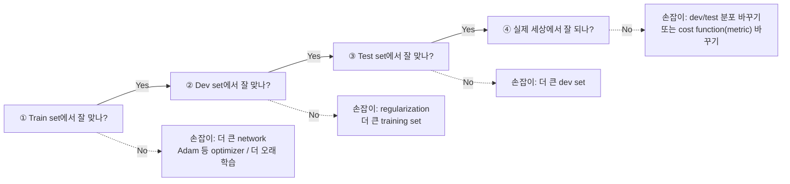

위 그림처럼 **왼쪽부터 차례로** 통과해야 하고, 막힌 칸에 매달린 손잡이만 돌리는 게 orthogonalization이다. 각 단계를 풀어 쓰면:

1. **Training set에서 잘 맞아야 한다** (사람 수준 성능 근처)
   - 안 되면 → 더 큰 network, better optimizer(Adam 등), 더 오래 학습
2. **Dev set에서 잘 맞아야 한다**
   - Training은 잘 되는데 dev가 안 되면 → regularization, 더 큰 training set
3. **Test set에서 잘 맞아야 한다**
   - Dev는 잘 되는데 test가 안 되면 → 더 큰 dev set (dev set에 overfitting 했을 가능성 — dev set으로 수백 번 모델을 고르다 보면 dev set의 우연한 특성에까지 맞춰진다)
4. **실제 세상(real world)에서 잘 동작해야 한다**
   - Test는 잘 되는데 실전에서 안 되면 → dev/test set 분포를 바꾸거나 cost function을 바꿔야 함 (dev/test set이 실제 분포를 대표 못 하거나, 최적화하는 metric 자체가 틀렸다는 뜻)
   - (용어: **cost function** = 학습 때 gradient descent가 줄이는 손실 함수 $J$, **metric** = 모델을 채점·비교할 때 보는 평가 지표. 둘 다 "무엇을 잘하는 게 좋은 것인가"를 정의하는 식이라, 실전과 어긋나면 같이 고쳐야 한다. metric은 바로 다음 절에서 자세히.)

핵심은 **각 단계마다 쓰는 "손잡이"가 달라야 한다**는 거다. 체인은 순서대로 봐야 한다 — 1단계(train)가 안 되는데 2단계 도구(regularization)를 쓰면 오히려 train 성능이 더 떨어진다.

(**Early stopping** 복습: 학습을 돌리면서 매 epoch마다 dev error를 재다가, dev error가 더 이상 안 내려가고 오르기 시작하는 시점에 학습을 **일찍 끊어버리는** 기법이다. 학습을 오래 할수록 train에 과하게 맞춰지니까 그 전에 멈춰서 overfitting을 막는 것.)

Early stopping 같은 기법은 training error와 dev error 둘 다에 동시에 영향을 주기 때문에 orthogonal하지 않은 도구로 취급된다 (Ng이 딱 집어서 언급하는 예시) — 일찍 멈추면 dev 성능은 좋아질 수 있지만 동시에 train 성능도 덜 최적화된 상태로 남는다. 나쁜 기법은 아니지만 "손잡이 하나가 두 가지를 동시에 바꾸는" 도구라 생각하기가 복잡해진다. 그래서 어느 단계에서 문제가 생겼는지 먼저 진단하고, 거기에 맞는 orthogonal한 손잡이를 골라 써야 한다.

### Single number evaluation metric

**용어 먼저**: **evaluation metric**(평가 지표)은 "모델이 얼마나 잘하는지"를 숫자로 매기는 채점 규칙이다 (예: error rate, accuracy, precision, F1). **Single number evaluation metric**은 그 채점 결과가 **실수 하나**로 나오는 지표 — 숫자 하나면 두 모델을 "큰 쪽이 낫다/작은 쪽이 낫다"로 곧장 줄 세울 수 있다. 반대로 지표가 두 개 이상이면 "A는 이게 좋고 B는 저게 좋다"는 상황에서 순서가 안 정해진다.

Applied ML은 **아이디어 → 코드 → 실험 → 결과 보고 다음 아이디어**의 반복이다. 이 루프를 빨리 돌리려면 실험 결과를 보고 "좋아졌나, 나빠졌나"를 **즉시** 판단할 수 있어야 한다. 팀 회의에서 "Classifier A는 precision이 좋은데 Classifier B는 recall이 좋다"는 식으로 논쟁하다가 시간을 다 날리는 경우를 많이 봤다고 한다. 두 개 이상의 지표를 동시에 보고 있으면 어떤 모델이 더 나은지 빠르게 판단할 수가 없다.

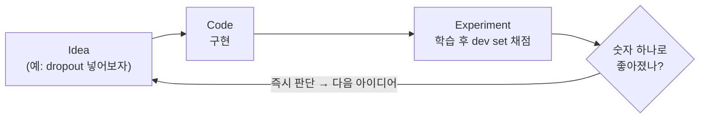

이 루프를 하루에 몇 바퀴 도느냐가 팀의 진도를 결정한다. 그림의 **"좋아졌나?"** 칸에서 매번 회의를 해야 한다면 루프가 멈춘다 — 그래서 판정 기준을 숫자 하나로 만들어두는 것이다.

**용어 복습 — precision과 recall** (고양이 분류기):

분류기의 예측은 "정답(실제로 고양이냐)"과 "예측(모델이 고양이라고 했냐)"의 조합으로 4가지 칸 중 하나에 떨어진다. 이 2×2 표를 **confusion matrix**(혼동 행렬)라고 한다.
- **TP**(True Positive): 진짜 고양이를 고양이라고 함 — 맞힘
- **FP**(False Positive): 고양이 아닌데 고양이라고 함 — 헛짚음
- **FN**(False Negative): 진짜 고양이인데 아니라고 함 — 놓침
- **TN**(True Negative): 고양이 아닌 걸 아니라고 함 — 맞힘

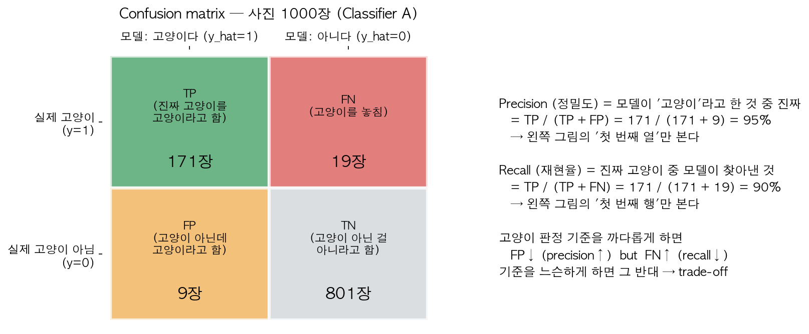

위 그림은 사진 1,000장(고양이 190장)에 대해 Classifier A가 낸 결과를 예로 든 것이다. **Precision은 왼쪽 열(모델이 "고양이다"라고 한 180장)만** 보고, **recall은 위쪽 행(진짜 고양이 190장)만** 본다는 점을 눈으로 확인하자. 둘은 분모가 다르다.
- **Precision**(정밀도) $= \frac{TP}{TP+FP}$: 모델이 "고양이"라고 한 것 중 진짜 고양이 비율. 95%면 "고양이라고 하면 95% 확률로 진짜 고양이". → "헛짚지 않는 능력"
- **Recall**(재현율) $= \frac{TP}{TP+FN}$: 진짜 고양이 중 모델이 찾아낸 비율. 90%면 "고양이 사진 100장 중 90장을 찾아냄". → "놓치지 않는 능력"
- 둘은 보통 trade-off다: 확실할 때만 고양이라고 하면 precision↑ recall↓, 아무거나 다 고양이라고 하면 recall↑ precision↓. (극단적으로 모든 사진에 "고양이"라고 하면 recall 100%지만 precision은 고양이 비율인 19%까지 떨어진다.)
- 위 두 식에서 TP, FP, FN은 각각 **그 칸에 떨어진 샘플의 개수**다(그림 기준 TP=171, FP=9, FN=19). 그래서 precision/recall은 0~1(0~100%) 사이 비율이고, 1에 가까울수록 좋다. 참고로 두 이름의 뜻: precision = "정밀함(쏜 것 중 맞은 비율)", recall = "(진짜들을) 얼마나 다시 불러냈나(회수율)".
- 왜 그냥 accuracy $= \frac{TP+TN}{TP+FP+FN+TN}$ (전체 중 맞힌 비율)를 안 쓰나? 위 예에서 accuracy는 $(171+801)/1000 = 97.2\%$인데, 고양이가 드문 데이터라면 "무조건 아니다"라고만 해도 accuracy가 81%나 나온다. 고양이를 얼마나 잘 찾는지는 precision/recall이 더 정직하게 보여준다.

예시:

| Classifier | Precision | Recall | F1 |
|---|---|---|---|
| A | 95% | 90% | **92.4%** |
| B | 98% | 85% | 91.0% |

지표 두 개만 보면 A가 나은지 B가 나은지 바로 말하기 어렵다. 이럴 때 **F1 score**(precision과 recall의 조화평균, harmonic mean)처럼 하나의 숫자로 합쳐버리면 비교가 즉시 가능해진다 → A 선택.

$$F_1 = \frac{2}{\frac1P + \frac1R} = \frac{2PR}{P + R}$$

| 기호 | 의미 |
|---|---|
| $F_1$ | F1 score. 0~1 사이 값이고 클수록 좋다. "1"은 precision과 recall에 **같은 무게(1:1)**를 준다는 뜻이다 (일반형 $F_\beta$는 recall에 $\beta$배 무게를 주는데, 이 코스에선 $F_1$만 쓴다) |
| $P$ | precision $= \frac{TP}{TP+FP}$ (0~1 비율로 넣는다) |
| $R$ | recall $= \frac{TP}{TP+FN}$ (0~1 비율로 넣는다) |
| $2$ | 두 수의 평균이라서 붙는 2 ("역수 두 개를 더하고 2로 나눈 것의 역수") |

B도 같은 식으로 $F_1 = \frac{2 \times 0.98 \times 0.85}{0.98+0.85} = \frac{1.666}{1.83} \approx 91.0\%$라서 A(92.4%)보다 낮다.

**조화평균(harmonic mean)이 뭔가**: "역수들의 평균을 구한 다음, 다시 역수를 취한 것"이다. 두 수 $P, R$이면 $\frac{1}{P}, \frac{1}{R}$의 평균 $\frac12\left(\frac1P + \frac1R\right)$을 구하고 그 역수를 취한 게 위 식이다. 익숙한 예: 갈 때 시속 60km, 올 때 시속 20km로 같은 거리를 왕복하면 평균 속력은 $(60+20)/2 = 40$이 아니라 조화평균 $\frac{2}{1/60 + 1/20} = 30$km/h다 — 느린 구간에서 시간을 훨씬 많이 쓰니까 느린 쪽에 끌려간다. 예시 A를 직접 계산하면 $F_1 = \frac{2 \times 0.95 \times 0.90}{0.95 + 0.90} = \frac{1.71}{1.85} \approx 92.4\%$.

**왜 산술평균이 아니라 조화평균인가**: 조화평균은 **작은 쪽에 끌려간다.** Precision 100%, recall 10%인 모델(거의 아무것도 고양이라고 안 하는 겁쟁이 모델)은 산술평균이면 55%로 괜찮아 보이지만, F1은 $\frac{2 \times 1 \times 0.1}{1.1} \approx 18\%$로 형편없다고 정직하게 말해준다. 둘 다 적당히 높아야 F1이 높다.

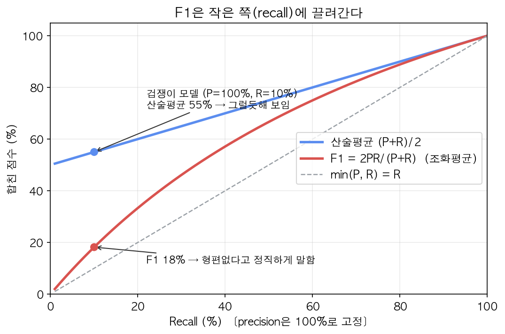

그림에서 precision을 100%로 고정하고 recall만 움직여보면, 파란 산술평균은 recall이 0이어도 50% 밑으로 안 떨어지지만 빨간 F1은 recall과 함께 바닥까지 떨어진다. F1 곡선이 회색 점선($\min(P,R)$)에 가깝게 붙어 다니는 것 — 이게 "작은 쪽에 끌려간다"의 의미다. 오른쪽 끝(둘 다 높을 때)에서만 두 평균이 비슷해진다.

F1만 있는 게 아니다. 예를 들어 앱을 미국/중국/인도/기타 4개 지역에서 서비스한다면, 지역별 error 4개를 나란히 놓고 비교하기보다 **평균 error 하나**로 합치면 "B가 평균 3.5%로 제일 낫다"는 판단이 바로 나온다. 여기서 평균은 단순 산술평균 $\frac{1}{4}(e_{\text{US}} + e_{\text{China}} + e_{\text{India}} + e_{\text{Other}})$이고, $e_{\text{지역}}$은 그 지역 dev 데이터에서 잰 error rate(틀린 비율)다. (지역마다 사용자 수가 크게 다르면 사용자 수 비율로 가중평균을 내는 것도 방법이다 — 요점은 "무엇을 합치든 **숫자 하나**로 만든다"는 것.)

결론: 여러 후보 모델을 비교해야 하는 상황이면, 개발 초반에 **single real number metric**(+ 잘 정의된 dev set)을 먼저 정해두는 게 반복 속도를 엄청나게 높여준다.

### Satisficing vs Optimizing metric

모든 걸 하나의 숫자로 합치기 애매한 경우도 있다. 예를 들어 정확도(accuracy)와 실행 시간(running time)을 같이 고려해야 한다면? "accuracy − 0.5 × running time" 같은 식으로 억지로 합칠 수도 있지만 계수 0.5에 아무 근거가 없다.

- **Optimizing metric**: 최대한 잘하고 싶은 지표 (예: accuracy는 최대화)
- **Satisficing metric**: 어떤 기준선만 넘으면 그걸로 충분한 지표 (예: running time은 100ms 이하면 OK, 더 빠르다고 딱히 추가 점수 안 줌 — 사용자는 50ms와 80ms 차이를 못 느낀다). "satisfy + suffice"를 합친 말.

즉 "**maximize** accuracy **subject to** running time ≤ 100ms" 라는 제약 최적화 문제로 바꾸는 것이다. ("maximize A subject to B" = "B라는 조건(제약)을 지키는 후보들 중에서 A가 최대인 것을 고른다". 여기서 running time은 이미지 한 장을 분류하는 데 걸리는 시간이다.)

**왜 필요한가**: 합치기 애매한 지표를 억지로 가중합하면 계수(위의 0.5)라는 근거 없는 숫자가 결론을 좌우한다. optimizing/satisficing으로 나누면 "어느 지표가 **얼마나** 중요한가"가 아니라 "어느 지표는 **최대화 대상**이고, 어느 지표는 **넘기만 하면 되는 조건**인가"만 정하면 되니 판단이 훨씬 쉽다. 결과적으로 다시 "통과한 후보 중 optimizing 숫자 하나"로 줄 세울 수 있어서 single number metric의 장점도 유지된다.

**문턱값(threshold, 위의 100ms)은 어떻게 정하나**: 모델 쪽이 아니라 **제품/사용자 요구사항**에서 온다 — "사용자가 기다림을 느끼지 않는 응답 시간", "기기 메모리 한계", "하루 허용 오작동 횟수" 같은 것. 너무 **빡빡하게** 잡으면(예: 10ms) 쓸 만한 모델이 전부 탈락하거나 작은 모델만 남아 accuracy를 크게 손해 보고, 너무 **느슨하게** 잡으면(예: 5초) 제약이 사실상 없어져서 실전에서 못 쓰는 느린 모델(아래 C 같은)이 뽑힌다. 요구사항이 바뀌면 문턱값도 바꾸면 된다.

| Classifier | Accuracy | Running time | 판정 |
|---|---|---|---|
| A | 90% | 80ms | 통과, 하지만 B보다 정확도 낮음 |
| B | 92% | 95ms | **선택** — 통과한 것 중 accuracy 최고 |
| C | 95% | 1,500ms | 탈락 (정확도가 제일 높아도 100ms 조건 위반) |

고려할 지표가 $N$개($N$ = 신경 쓰는 지표의 개수)가 있으면 보통 1개를 optimizing, 나머지 N-1개를 satisficing(문턱값 통과 여부)으로 두는 방식이 실용적이다. 예: 스마트 스피커의 wake word("Alexa", "OK Google") 감지라면 "wake word를 말했을 때 알아듣는 비율(accuracy)은 최대화하되, false positive(아무도 안 불렀는데 켜지는 것)는 하루 24시간 기준 1건 이하일 때만" 같은 식.

### Train/dev/test 분포 설정 — dev set은 과녁이다

Ng의 비유: dev set + metric을 정하는 건 **과녁(target)을 어디에 걸지 정하는 것**과 같다. 팀 전체가 그 과녁을 보고 화살(모델 개선)을 쏘게 되는데, 만약 과녁을 엉뚱한 위치(실제 사용자 데이터 분포와 다른 곳)에 걸어두면, 팀이 몇 달 동안 열심히 화살을 쏴서 과녁 정중앙을 맞혀도 정작 실전에서는 쓸모가 없는 모델이 나온다.

**"분포(distribution)"가 여기서 무슨 뜻인가**: 통계 용어라 딱딱하게 들리지만, 이 코스에서는 거의 "**데이터가 어디서, 어떤 조건으로 생겨났나**" 정도로 이해하면 된다. 같은 "고양이 사진"이라도 (웹에서 긁어온 전문가 사진) vs (사용자가 폰으로 대충 찍은 흐릿한 사진)은 화질·구도·조명의 통계적 성질이 다르다 → **분포가 다르다**. 미국 사용자 데이터와 인도 사용자 데이터, 조용한 방 녹음과 차 안 녹음도 서로 다른 분포다. 반대로 한 덩어리의 데이터를 **랜덤으로 섞어서** 둘로 나누면, 두 조각은 같은 분포에서 나온 것이 된다(어느 조각에나 각 유형이 같은 비율로 섞여 들어가니까). 모델은 학습·평가한 분포에서만 성능이 보장되고, 분포가 바뀌면 성능도 바뀔 수 있다 — 이게 이 절과 Week 2 후반부의 핵심 걱정거리다.

**규칙: dev set과 test set은 반드시 같은 분포(distribution)에서 뽑아야 한다.** 실수 사례로 자주 나오는 게 — 특정 지역 데이터로 dev set을 만들고, 다른 지역/다른 시기 데이터로 test set을 만드는 것. 예: 8개 지역(미국, 영국, 유럽, 남미, 인도, 중국, 기타 아시아, 호주) 중 앞의 4개로 dev set, 뒤의 4개로 test set을 만들면, 몇 달 동안 dev set(서구권 데이터)에 맞춰 튜닝해놓고 test(아시아권 데이터)에서 완전히 다른 결과가 나와서 그동안의 노력이 통째로 낭비된다. 올바른 방법은 8개 지역 데이터를 **전부 섞은 다음** 랜덤하게 dev/test로 나누는 것.

또 다른 실제 사례: 대출 승인 모델을 **중간 소득층 우편번호** 데이터로 dev/test를 만들어 몇 달 최적화했는데, 실제 적용 대상은 **저소득층 우편번호**였다 — 과녁을 다른 데 건 것이라 약 3개월을 날렸다고 한다.

권장 순서:
1. 미래에 실제로 잘 작동하길 원하는 데이터가 뭔지 먼저 정의한다 (= 실사용 분포)
2. 그 분포를 반영하도록 dev/test set을 무작위로 섞어서 나눈다 (같은 pool에서 랜덤 셔플 후 분리)
3. training set은 dev/test와 분포가 좀 달라도 괜찮다 (더 많은 데이터를 넣기 위해서 — Week 2에서 자세히)

### Dev/test set 크기

옛날 규칙(70/30, 60/20/20)은 데이터가 수백~수천 개일 때 얘기다. 지금처럼 데이터가 수백만 개 있는 시대에는 dev/test set의 목적이 "여러 모델 중 어떤 게 더 나은지 판단할 수 있을 정도의 신뢰도"만 있으면 충분하다.

- 데이터 100만 개라면 → train 98% / dev 1% / test 1% 정도로도 dev/test 각각 1만 개씩 확보되니 충분함. 정확도 95% 근처에서 1만 개면 추정 오차(표준오차 $\sqrt{0.95 \times 0.05 / 10000} \approx 0.22\%$p)가 ±0.2%p 정도라, 0.5%p 차이 나는 두 모델은 대체로 구분된다 (light context: 같은 dev set으로 두 모델을 비교하면 공통 난이도가 상쇄돼서 실제로는 더 잘 구분된다). 나머지 98만 개는 학습에 쓰는 게 훨씬 이득 — 딥러닝은 데이터가 많을수록 좋으니까.

**위 계산의 표준오차(standard error)가 뭔가**: dev set은 전체 세상에서 뽑은 **표본**이라, 같은 모델이라도 dev set을 다른 1만 장으로 다시 뽑으면 정확도가 조금씩 다르게 나온다. 그 "우연히 흔들리는 폭"의 전형적인 크기가 표준오차다. 정답/오답 비율을 잴 때의 식은

$$\text{SE} = \sqrt{\frac{p(1-p)}{n}}$$

| 기호 | 의미 |
|---|---|
| $\text{SE}$ | standard error. 측정한 정확도(또는 error)가 표본 운으로 흔들리는 전형적인 폭. 대략 "측정값 ± SE 안에 진짜 값이 있을 가능성이 꽤 높다"로 읽으면 된다 |
| $p$ | 모델의 정확도(0~1). 위 예에선 0.95. (error rate를 넣어도 $p(1-p)$가 같아서 결과는 같다) |
| $1-p$ | 틀리는 비율(위 예에선 0.05) |
| $n$ | dev set의 샘플 수(위 예에선 10,000) |

($\%$p = percentage point, "퍼센트 **포인트**". 95%와 95.5%의 차이는 "0.5%p"라고 쓴다 — "0.5%"라고 하면 95의 0.5%(≈0.475)로 오해할 수 있어서 구분한다.)

**Dev set 크기는 어떻게 고르나**: 기준은 "**내가 구분하고 싶은 성능 차이**보다 SE가 충분히 작은가"다. SE는 $\sqrt{n}$에 반비례하니, 샘플을 100배 늘려야 흔들림이 1/10로 준다. 예: 정확도 95% 근처에서 $n=1{,}000$이면 SE ≈ 0.69%p라 0.5%p 차이는 노이즈에 묻혀 **못 가린다**(너무 작은 dev set → 운 좋은 모델을 고르게 됨). $n=10{,}000$이면 SE ≈ 0.22%p로 가릴 수 있다. 반대로 dev set을 필요 이상 크게(예: 10만 개, SE ≈ 0.07%p) 잡으면 판단은 거의 안 좋아지는데 그만큼 **training 데이터를 뺏긴다**(너무 큰 dev set의 비용). 개선 폭이 작아지는 프로젝트 후반일수록 더 작은 차이를 가려야 하니 dev set이 더 커져야 한다.
- Test set 크기는 "최종 시스템의 성능을 충분히 신뢰성 있게 평가할 수 있는 정도"로 정하면 됨. 극단적인 경우 test set 없이 train/dev만 두는 것도 실무에서는 종종 있다 (권장은 아니지만 — 이 경우 사람들이 dev set을 "test set"이라고 부르기도 하는데, 그걸로 튜닝했으니 엄밀히는 test가 아니다).

### 언제 metric이나 dev set을 바꿔야 하나

**Metric을 바꿔야 하는 경우**: 고양이 앱 예시 — Algorithm A가 error 3%, Algorithm B가 error 5%라서 metric상 A가 더 낫다고 나왔는데, 알고보니 A는 가끔 부적절한(포르노 등) 이미지를 고양이로 잘못 분류해서 사용자에게 보여주고 있었다. 회사와 사용자 입장에서는 이게 훨씬 치명적인 실수라 **B를 선호**하는데, 단순 error rate는 이런 종류의 실수를 구분하지 못한다. "metric이 A가 낫다고 하는데 사람들은 B를 원한다" — 이게 metric을 바꾸라는 신호다.

해결책: **잘못된 예측에 가중치(weight)를 다르게 줘서** metric을 재정의한다.

$$\text{Error} = \frac{1}{\sum_i w^{(i)}}\sum_{i=1}^{m_{\text{dev}}} w^{(i)}\,\mathbb{1}\{\hat y^{(i)} \ne y^{(i)}\}, \qquad w^{(i)} = \begin{cases}1 & x^{(i)}\text{가 일반 이미지}\\ 10 & x^{(i)}\text{가 부적절한 이미지}\end{cases}$$

| 기호 | 의미 |
|---|---|
| $m_{\text{dev}}$ | dev set의 샘플 수 |
| $i$ | dev set 샘플 번호, $1 \le i \le m_{\text{dev}}$. 분모의 $\sum_i$도 똑같이 $i = 1 \ldots m_{\text{dev}}$ 전체를 더한다(틀린 것만이 아니라 **전부**) |
| $x^{(i)}$ | $i$번째 dev 이미지(입력) |
| $y^{(i)}$ | $i$번째 이미지의 정답 라벨(1 = 고양이, 0 = 아님) |
| $\hat y^{(i)}$ | 모델이 $i$번째 이미지에 대해 낸 예측 라벨(0 또는 1) |
| $\mathbb{1}\{\cdot\}$ | indicator(지시) 함수. 괄호 안이 참이면 1, 거짓이면 0 → $\hat y^{(i)} \ne y^{(i)}$, 즉 **틀린 샘플만** 1로 센다 |
| $w^{(i)}$ | $i$번째 샘플의 가중치(weight) = "이 샘플을 틀렸을 때의 벌점". 일반 이미지 1, 부적절한 이미지 10 |
| $\frac{1}{\sum_i w^{(i)}}$ | 정규화 상수. 가중치가 전부 1이면 $\sum_i w^{(i)} = m_{\text{dev}}$라서 보통의 error rate $\frac{1}{m_{\text{dev}}}\sum_i \mathbb{1}\{\cdot\}$와 똑같아진다. 가중치를 넣어도 error가 0~1 사이에 머물게 해준다 |

- 부적절한 이미지를 틀리면 10배 벌점.
- 이걸 쓰려면 dev set에서 어떤 이미지가 부적절한지 라벨링을 해야 한다. 같은 가중치를 training cost에도 넣을 수 있다.

**숫자로 확인**: dev 1,000장 중 부적절한 이미지가 50장이라 하자 → $\sum_i w^{(i)} = 950 \times 1 + 50 \times 10 = 1{,}450$. A는 30장을 틀렸는데 그중 5장이 부적절한 이미지, B는 50장을 틀렸지만 부적절한 이미지는 하나도 안 틀렸다.
- 보통 error: A $= 30/1000 = 3\%$, B $= 50/1000 = 5\%$ → A가 나아 보인다
- 가중 error: A $= (25 \times 1 + 5 \times 10)/1450 \approx 5.2\%$, B $= 50/1450 \approx 3.4\%$ → **B가 낫다**로 뒤집힌다. 사람들의 선호와 metric이 다시 일치한 것이다.

**가중치 10은 어떻게 정하나**: 수학적으로 정해지는 값이 아니라 **"이 실수가 보통 실수보다 몇 배 나쁜가"에 대한 제품/사업적 판단**이다. 너무 **작게**(예: 1.5) 주면 부적절 이미지를 틀리는 모델이 여전히 metric상 이겨서 바꾼 의미가 없고, 너무 **크게**(예: 10,000) 주면 metric이 사실상 "부적절 이미지만 안 틀리면 된다"가 되어, 일반 고양이 사진을 대량으로 틀리는 모델도 좋아 보이게 된다. 위 숫자 예시처럼 "사람들이 선호하는 모델이 metric에서도 이기는지"를 몇 사례로 확인하면서 고르면 된다.

**orthogonalization 관점에서**: "과녁을 어디에 걸지(metric 정의)"와 "그 과녁을 어떻게 잘 맞힐지(최적화)"는 **별개의 단계**다. 먼저 metric을 제대로 정의하고, 그다음에 그 metric을 잘 올리는 방법을 따로 고민한다.

**Dev/test set을 바꿔야 하는 경우**: dev/test가 웹에서 모은 고화질·잘 찍은 고양이 사진인데, 실제 사용자들은 흐릿하고 구도가 엉망인 사진을 올린다면 — dev에서 좋은 모델이 실전에서도 좋을 거라는 보장이 없다. 이럴 땐 사용자 사진으로 dev/test를 다시 만든다.

**정리하면**: metric이 "어떤 알고리즘이 더 나은가"를 제대로 못 가려내고 있다면 metric을 바꿀 때고, dev/test set이 실제 배포될 때 마주칠 데이터 분포와 다르다면 dev/test set을 바꿀 때다. 이 둘은 별개의 문제다 — metric을 새로 만드는 것과 실제 배포 환경 데이터를 다시 모으는 것은 orthogonal한 두 단계로 나눠서 접근해야 한다 (한 번에 다 고치려 하지 말 것). 그리고 완벽한 metric/dev set이 없더라도 **일단 빨리 정하고 시작**했다가 문제가 보이면 바꾸는 게, metric 없이 몇 주를 보내는 것보다 낫다.

### Human-level performance와 Bayes error

**용어 먼저**: **human-level performance**(인간 수준 성능)는 같은 태스크(같은 dev 데이터)를 **사람이 직접 풀었을 때의 error**다 (예: 사람에게 고양이 사진 1,000장을 보여주고 "고양이냐"를 답하게 해서 틀린 비율). 이 코스에선 보통 "human-level error"라는 숫자 하나로 쓴다. 어떤 사람(일반인? 전문가?)을 기준으로 할지는 아래 의료 영상 절에서 정한다.

왜 인간 수준 성능이랑 비교하나?
1. 딥러닝이 발전하면서 많은 태스크에서 알고리즘이 사람과 겨룰 만해졌다. 동시에 많은 태스크에서 인간이 여전히 매우 잘하기 때문에, 인간과 비교하면서 왜 알고리즘이 아직 인간보다 못하는지 통찰을 얻을 수 있다.
2. 인간 수준에 도달하기 전까지는 아래와 같은 전략들을 쓰기 쉽다:
   - 사람이 라벨링한 데이터를 더 얻는다
   - Manual error analysis(모델이 틀린 샘플을 사람이 직접 들여다보며 원인을 분류하는 것 — Week 2에서 자세히)로 사람은 왜 맞혔는데 알고리즘은 틀렸는지 분석한다
   - Bias/variance 분석을 더 잘 할 수 있다 (아래)

**Bayes error를 처음 보는 사람을 위한 직관**: "error 0%"가 항상 가능한 목표일까? 아니다. 고양이 분류 dev set에 이런 사진이 섞여 있다고 해보자 — 완전히 새까만 사진, 초점이 다 날아가서 털 뭉치인지 쿠션인지 모를 사진. 이런 사진은 **입력 $x$ 안에 정답을 가릴 정보 자체가 없다.** 세상에서 제일 뛰어난 모델(심지어 전지전능한 존재)이 와도 절반쯤은 찍을 수밖에 없다. 만약 dev set의 2%가 이런 사진이라면, 어떤 모델도 약 1%(2%의 절반을 찍어서 틀림) 아래로는 error를 못 내린다. 이렇게 **"데이터 자체의 한계 때문에 누구도 피할 수 없는 error의 바닥"**이 Bayes error다. 즉 이건 모델의 성적이 아니라 **문제(데이터)의 난이도**에 붙어 있는 숫자다.

(light context: 이름이 "Bayes"인 이유 — 각 $x$에 대해 진짜 확률 $p(y \mid x)$("입력이 $x$일 때 정답이 $y$일 확률", 예: 이 흐린 사진이 실제로 고양이일 확률 0.5)를 완벽히 알고, 항상 가장 확률 높은 답을 고르는 이상적인 분류기를 Bayes optimal classifier라고 부르고, 그 분류기의 error가 Bayes error다. 현실에서는 $p(y\mid x)$를 모르니 **직접 계산할 수 없고**, 추정만 할 수 있다 — 그래서 아래처럼 사람 성능을 대용품으로 쓴다.)

**Bayes error(Bayes optimal error)**: 이론상 가능한 최소 error. 어떤 입력 x에 대해서도 완벽한 함수가 낼 수 있는 최선의 error 수준이다. 0%가 아닐 수 있는 이유: 너무 흐려서 **정보 자체가 없는** 사진, 소음이 심해서 무슨 말인지 원리적으로 알 수 없는 음성 같은 게 있기 때문. 인간의 성능은 이 Bayes error에 대한 근사치(proxy)로 종종 쓰인다 (특히 이미지/음성처럼 사람이 원래 잘하는 태스크에서 — 사람이 거의 Bayes error 수준으로 잘하니까).

**전형적인 성능 곡선**: 시간(노력)에 따라 알고리즘 정확도가 human-level까지는 빠르게 오르다가, human-level을 넘는 순간 **느려지고**, Bayes error라는 넘을 수 없는 천장에 점점 가까워진다. 느려지는 이유: (1) human-level이 Bayes error에 이미 가까워서 올라갈 여지 자체가 적고, (2) 위의 "사람을 이용한 도구들"을 더 이상 못 쓴다.

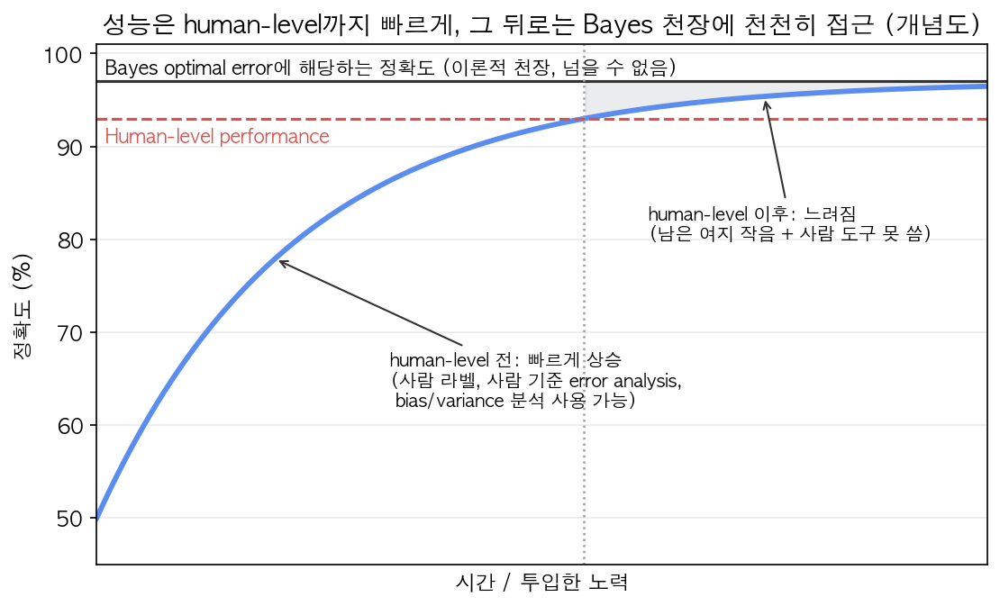

그림(실제 데이터가 아닌 개념도)에서 파란 곡선이 빨간 점선(human-level)을 넘는 지점 이후를 보자. 곡선은 여전히 오르지만 기울기가 확 줄고, 검은 실선(Bayes 천장)과의 회색 틈이 아주 천천히 좁아진다. 파란 곡선이 검은 실선을 **절대 뚫고 올라가지 않는다**는 것도 중요하다 — Bayes error보다 좋은 성능은 정의상 불가능하다. 반면 human-level 선은 뚫을 수 있다(사람은 Bayes 최적이 아니니까).

### Avoidable bias vs Variance

**기초 복습 — bias와 variance가 원래 뭐였나**: ML Specialization에서 본 개념인데, 이 절 전체가 이 둘 위에 서 있으니 다시 짚는다.
- **High bias (underfitting)**: 모델이 **training set조차 잘 못 맞힌다.** 모델이 너무 단순하거나 덜 학습돼서 데이터의 패턴을 아직 못 잡은 상태. 예: 곡선 모양 데이터를 직선 하나로 맞추려는 경우. 증상 = **train error가 높다**.
- **High variance (overfitting)**: training set은 잘 맞히는데 **처음 보는 데이터(dev)에서는 훨씬 못한다.** 학습 데이터의 우연한 잡음까지 외워버린 상태. 예: 점 10개를 전부 지나가는 구불구불한 9차 다항식. 증상 = **train error는 낮은데 dev error가 그보다 훨씬 높다**.
- 시험 비유로: bias는 "문제집도 못 푸는 학생", variance는 "문제집 답은 외웠는데 숫자만 바뀐 모의고사에서 무너지는 학생"이다. 처방도 다르다 — 앞 학생은 공부를 더(더 큰 모델, 더 오래 학습), 뒤 학생은 외우지 말고 일반화하게(regularization, 더 다양한 데이터).

그런데 "train error가 **높다**"는 말에는 기준이 필요하다. 8%가 높은 건가? 사람도 7.5% 틀리는 문제라면 8%는 사실상 만점이다. 그래서 Ng은 bias를 **Bayes error(≈ human-level) 대비** 측정하자고 하고, 그 차이를 **avoidable bias**라고 부른다.

같은 "training error 8%, dev error 10%"라는 숫자도 human-level(≈ Bayes error 근사치)이 몇 %냐에 따라 완전히 다른 처방이 나온다.

| 상황 | Human error | Train error | Dev error | 진단 | 처방 |
|---|---|---|---|---|---|
| Case 1 | 1% | 8% | 10% | **Avoidable bias가 큼** (8-1=7%p) | Bigger network, train longer, better optimization — bias를 줄이는 데 집중 |
| Case 2 | 7.5% | 8% | 10% | **Variance가 큼** (10-8=2%p, avoidable bias는 0.5%p뿐) | Regularization, 더 많은 training data — variance를 줄이는 데 집중 |

- **Avoidable bias** = training error − human-level(Bayes proxy) error
- **Variance** = dev error − training error

| 항 | 의미 |
|---|---|
| human-level error | Bayes error의 추정치(proxy). "이 아래로는 원리적으로 못 내려간다"고 보는 바닥 |
| training error | 학습에 쓴 training set에서 잰 error rate |
| dev error | 학습에 안 쓴 dev set에서 잰 error rate |
| avoidable bias | 바닥(Bayes)에서 train error까지의 거리 = **줄일 수 있는데 아직 못 줄인 underfitting 몫**. 이론상 0 이상이다 (음수가 나오면 human-level이 Bayes error를 과대추정했다는 뜻 — 아래 "인간 능력을 넘어선 경우") |
| variance | train에서 dev로 갈 때 나빠진 폭 = **처음 보는 데이터로 일반화하지 못한 overfitting 몫**. 여기서 "variance"는 통계의 분산 공식이 아니라 "학습 데이터가 조금만 바뀌어도 모델이 크게 흔들리는 정도"라는 이름에서 온 이 gap 자체를 가리킨다 |

모두 error rate(%)끼리의 뺄셈이라 단위는 %p다.

그림으로 쌓아보면 (Case 1):

```
 0%  ─┬─ 
      │  Bayes/human error 1%   ← 원리적으로 못 줄이는 부분
 1%  ─┼─
      │  avoidable bias 7%p     ← 여기가 제일 큼 → 여기부터 공략
 8%  ─┼─ train error
      │  variance 2%p
10%  ─┴─ dev error
```

숫자 자체(8%, 10%)는 두 케이스에서 똑같은데, human-level이 뭐냐에 따라 "지금 우리가 풀어야 할 병목이 bias냐 variance냐"가 완전히 뒤바뀐다. Case 2에서 train error를 7.5% 아래로 내리려고 애쓰면 **training set에 overfit하는 것**일 뿐이다 — Bayes error 아래로는 원리적으로 갈 수 없으니까. 이게 이 섹션에서 제일 중요한 통찰이다 — **절대적인 error 숫자가 아니라 human-level 대비 상대적인 gap을 봐야 한다.** ("avoidable"이라는 이름 자체가 "Bayes error까지는 피할 수 없고, 그 위 부분만 피할 수 있다"는 뜻이다.)

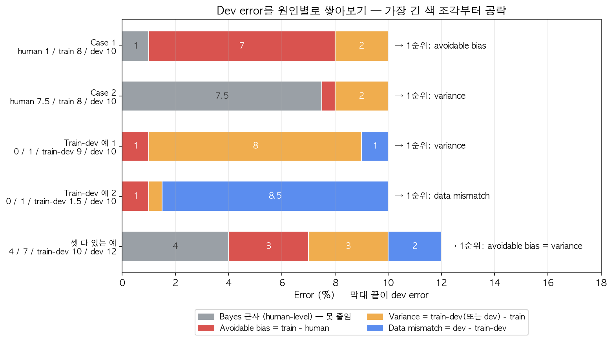

위 그림은 이 노트에 나오는 표 예시들을 전부 같은 방식으로 쌓은 것이다(위 두 줄이 Case 1, 2이고, 아래 세 줄은 Week 2의 train-dev 예시라 파란 data mismatch 조각이 추가된다 — 지금은 위 두 줄만 보면 된다). 막대 전체 길이는 두 Case 모두 dev error 10%로 **똑같지만**, 색 조각의 배분이 완전히 다르다: Case 1은 빨간 조각(avoidable bias 7), Case 2는 주황 조각(variance 2)이 제일 크다. 회색 조각(Bayes 근사)은 아무리 노력해도 못 줄이니 공략 대상에서 뺀다. **가장 긴 색 조각 = 다음에 쓸 손잡이**라고 읽으면 된다.

### Human-level을 어떻게 정의하나 — 의료 영상 예시

X-ray 이미지를 보고 진단하는 태스크가 있다고 하자.

| 그룹 | Error |
|---|---|
| 일반인(non-expert) | 3.0% |
| 일반 의사(doctor) | 1.0% |
| 전문의(experienced doctor) | 0.7% |
| 전문의 팀(team of experienced doctors) | 0.5% |

"Human-level performance"를 뭘로 잡을까? **목적에 따라 다르다.**

- **Bayes error의 근사치로 쓰려면**(bias/variance 분석용): **가장 낮은 error를 내는 그룹(0.5%, 전문의 팀)**을 human-level의 정의로 쓰는 게 맞다. 전문의 팀이 0.5%를 낸다는 건 **Bayes error ≤ 0.5%**라는 증거다(이론적 최선이 사람보다 나쁠 리 없으니). 그러니 0.5%를 기준으로 avoidable bias를 계산해야 가장 보수적이고 정확한 진단이 나온다.
- **배포/논문 목적이면**: "일반 의사(1%)보다 낫다"만 넘어도 실용적 가치가 있다 — 이건 다른 질문이다.

**언제 이 정의가 결정적으로 중요해지나** — 세 가지 시나리오:

| | Human (0.5~1%) | Train | Dev | 판단 |
|---|---|---|---|---|
| 시나리오 1 | 0.5~1% | 5% | 6% | avoidable bias 4~4.5%p ≫ variance 1%p → **bias 공략**. human을 뭘로 잡든 결론 같음 |
| 시나리오 2 | 0.5~1% | 1% | 5% | avoidable bias 0~0.5%p ≪ variance 4%p → **variance 공략**. 역시 결론 같음 |
| 시나리오 3 | **0.5%** | 0.7% | 0.8% | avoidable bias 0.2%p vs variance 0.1%p → **bias가 더 큼**. 그런데 human을 0.7%로 잡으면 avoidable bias 0 → variance 문제로 오진! |

성능이 human-level에 가까워질수록 **Bayes error 추정치의 작은 차이가 진단을 뒤집는다.** 그래서 이 단계부터 진전이 어려워진다.

### 인간 능력을 넘어선 경우

| | Human (팀) | Train | Dev |
|---|---|---|---|
| A | 0.5% | 0.6% | 0.8% |
| B | 0.5% | **0.3%** | 0.4% |

A는 avoidable bias 0.1%p, variance 0.2%p로 진단이 가능하다. 그런데 B는 train error가 이미 사람보다 낮다 — 이러면 Bayes error가 0.1%인지, 0.2%인지, 0.3%인지 **알 방법이 없다.** avoidable bias가 남았는지(bias를 더 줄여야 하나?), 아니면 이미 Bayes error에 도달해서 overfitting 중인지 판단 근거가 사라진다.

일단 알고리즘이 human-level을 넘어서면, avoidable bias를 줄이기 위한 진행 방향(더 많은 데이터를 사람이 라벨링하거나, manual error analysis로 사람 대비 뭐가 문제인지 보는 것 — 사람도 틀리는 걸 사람이 보고 어떻게 고치나)이 더 이상 잘 안 통한다. 어느 방향으로 개선해야 할지 판단하기가 급격히 어려워진다. 불가능한 건 아니고, 진전이 느려질 뿐이다.

그럼에도 인간을 크게 뛰어넘은 대표적인 사례들: online advertising(클릭 예측), 구매 추천, 물류(logistics) 이동시간 예측, 대출 승인(loan approval) — 공통점은 **structured data**(정형 데이터, 자연스러운 인지 태스크가 아님)이고, 사람이 평생 볼 수 있는 것보다 훨씬 많은 데이터(수백만 사용자의 클릭 로그 등)를 통해 학습한다는 점. 반면 이미지/음성/텍스트 같은 "자연스러운 지각(natural perception)" 태스크는 사람이 진화적으로 워낙 잘하도록 만들어져 있어서 아직 인간을 뛰어넘기 어려운 영역이 많다(다만 일부 특정 태스크 — 일부 음성 인식, 일부 이미지 인식, 일부 의료 판독 — 에서는 이미 넘어섰다).

### 모델 성능 개선 가이드라인 요약

지도학습이 잘 된다는 건 두 가지를 해냈다는 뜻이다: (1) training set을 잘 맞춤 = **avoidable bias가 작다**, (2) 그 성능이 dev/test로 일반화됨 = **variance가 작다**. 그래서 먼저 두 gap을 재고, **더 큰 쪽**부터 공략한다.

Avoidable bias가 크면:
- 더 큰 모델(network) 사용
- 더 오래, 더 잘 학습(better optimization algorithm: momentum, Adam, RMSprop — 전부 gradient descent가 더 빨리, 더 안정적으로 수렴하도록 step을 조정해주는 최적화 기법들이다. DL Specialization Course 2에서 자세히 다루는 내용이라 여기서는 "이런 게 있다" 정도만 알면 된다)
- 다른 NN architecture / hyperparameter 탐색 (RNN, CNN 등 구조 자체를 바꾸기)

Variance가 크면:
- 더 많은 데이터 확보
- Regularization (L2, dropout — dropout은 학습 시 뉴런을 랜덤하게 꺼버려서 특정 뉴런에 과의존하지 못하게 만드는 정규화 기법. 역시 DL Specialization Course 2 내용)
- Data augmentation (기존 training 이미지를 좌우 반전·회전·자르기·색 바꾸기 등으로 살짝 변형해서 "새 샘플"을 늘리는 것. 라벨은 그대로 쓸 수 있으니 공짜로 데이터가 늘어나는 효과)
- 다른 architecture / hyperparameter 탐색 (hyperparameter = learning rate, layer 수, regularization 세기처럼 학습으로 정해지지 않고 **사람이 미리 정하는** 설정값)

---

## Week 2: Error analysis와 다양한 데이터 분포 다루기

### Error analysis — 100개 샘플을 수작업으로 훑어봐라

**Error analysis(오류 분석)가 뭔가**: 모델이 **dev set에서 틀린 샘플(misclassified examples)**을 사람이 하나하나 직접 보고, "왜 틀렸나"를 몇 가지 원인 카테고리로 분류해 **각 원인이 전체 오류에서 차지하는 비율**을 세는 작업이다. 이름 그대로 "error를 분석한다". **왜 필요한가**: bias/variance 분석은 "어느 손잡이 쪽이냐"만 알려주고, "구체적으로 **어떤 종류의 입력**에서 틀리는가"는 알려주지 않는다. 개선 아이디어가 여러 개일 때 각 아이디어가 최대 얼마를 벌어줄지 미리 알려주는 게 error analysis다.

모델을 개선하겠다고 바로 코드를 뜯어고치기 전에, **틀린 예측 100개 정도를 사람이 직접 눈으로 훑어보는 것**부터 시작하라는 게 핵심 조언이다. 이걸 안 하고 감으로 "아마 강아지를 고양이로 착각하는 게 문제일 거야"라고 추측해서 몇 주를 갈아 넣었는데, 알고보니 그 원인이 전체 오류의 5%밖에 안 되는 경우가 실제로 많다.

**천장(ceiling) 계산 — 이게 error analysis의 핵심 논리**: 고양이 분류기 dev error가 10%이고, 팀원이 "강아지를 고양이로 착각하는 걸 고치자"고 제안했다고 하자. dev set에서 틀린 것 100개를 봤더니 강아지가 5개(5%)였다면:

$$\text{강아지 문제를 100\% 완벽하게 고쳐도: } 10\% \times (1 - 0.05) = 9.5\%$$

일반형으로 쓰면

$$E_{\text{after}} = E_{\text{dev}} \times (1 - f_k)$$

| 기호 | 의미 |
|---|---|
| $E_{\text{dev}}$ | 지금의 dev error (위 예에선 10%) |
| $k$ | 검토하는 오류 카테고리(예: "강아지") |
| $f_k$ | 훑어본 오분류 샘플 중 카테고리 $k$에 해당하는 비율 (위 예에선 5/100 = 0.05) |
| $E_{\text{after}}$ | 카테고리 $k$의 오류를 **전부**(100%) 없앴을 때 기대되는 dev error. 현실에선 일부만 고치니 실제 결과는 이보다 나쁘다 → 그래서 "최선의 경우" = 상한 |

**천장(ceiling)**이란 말 그대로 "아무리 잘해도 넘을 수 없는 한계"라서, 개선 폭의 최댓값 $E_{\text{dev}} \times f_k$를 가리킨다.

몇 달을 써서 **최대로 잘돼도** 10% → 9.5%. 이게 이 아이디어의 **성능 상한(ceiling)**이다. 반대로 강아지가 50개(50%)였다면 최대 10% → 5%까지 가능하니 시간을 쓸 가치가 있다. 100개 훑어보는 데 1~2시간이면, 몇 달짜리 결정을 데이터로 내릴 수 있다.

**왜 하필 100개 정도인가**: 목적은 비율을 소수점까지 정확히 재는 게 아니라 "5% 짜리냐 50% 짜리냐" 같은 **큰 차이**를 가리는 것이다. 100개에서 잰 비율의 흔들림(앞의 표준오차 식, $n=100$)은 5% 카테고리면 약 ±2.2%p, 50% 카테고리면 약 ±5%p라서 이 정도 구분엔 충분하다. 너무 **적게**(예: 20개) 보면 50% 카테고리도 ±11%p씩 흔들리고, 드문 카테고리는 아예 한 번도 안 나와서 놓칠 수 있다. 너무 **많이**(수천 개) 보면 사람 시간만 들고 결론은 거의 안 바뀐다. dev set에 틀린 샘플이 100개보다 적으면 있는 걸 전부 보고, 모델이 아주 좋아져서 드문 원인들끼리 비교해야 하는 후반에는 더 많이 보는 식으로 조절한다.

방법: 스프레드시트를 만들어서 각 오분류 이미지마다 카테고리별로 체크한다. 여러 아이디어를 **한꺼번에(병렬로)** 평가할 수 있다.

| Image | Dog | Great cat (사자/표범 등) | Blurry | Filter로 왜곡됨 | Comments |
|---|---|---|---|---|---|
| 1 | ✓ | | | | 핏불을 고양이로 착각 |
| 2 | | | ✓ | | 흐릿해서 사람도 헷갈림 |
| 3 | | ✓ | | | 표범 사진 |
| ... | | | | | |
| **% of total** | 8% | 43% | 61% | 12% | |

(카테고리는 서로 배타적이지 않아서 — 흐릿하면서 동시에 filter까지 씌워진 사진처럼 한 이미지가 여러 칸에 동시에 체크될 수 있다 — % of total을 다 더하면 100%를 넘을 수 있다. 정상이다.) 카테고리는 미리 다 정하지 않아도 된다 — 훑어보다가 "인스타그램 필터가 자주 보이네?" 하면 그때 열을 추가하면 된다.

이렇게 보면 "great cat"(43%)과 "blurry"(61%)가 크니까, 여기에 시간을 투자하는 게 ROI(return on investment, 들인 시간 대비 얻는 성능 개선)가 가장 높다는 걸 바로 알 수 있다 — 강아지(8%)는 완벽히 고쳐도 10% → 9.2%가 최대다. 이 표 하나 만드는 데 30분~1시간이면 되는데, 이걸 생략하고 잘못된 방향에 몇 주를 쓰는 팀을 많이 봤다는 게 Ng의 조언이다. 단, 비율만이 아니라 **고치기 쉬운 정도**도 같이 고려해서 우선순위를 정한다 (61%라도 해결책이 안 보이면 43%짜리를 먼저 할 수도 있다).

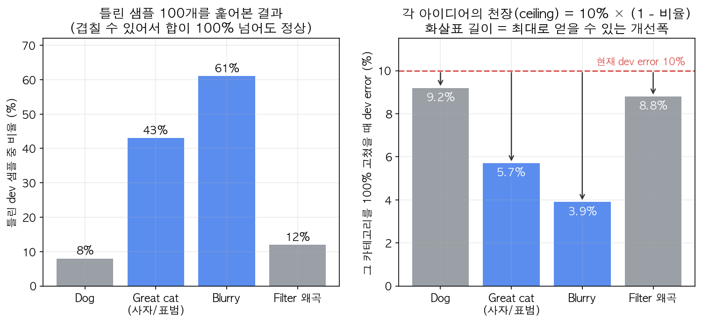

왼쪽은 스프레드시트의 "% of total" 줄을 막대로 그린 것, 오른쪽은 각 카테고리를 **100% 완벽하게** 고쳤을 때의 dev error($10\% \times (1 - \text{비율})$)다. 오른쪽 **화살표 길이**가 그 아이디어로 얻을 수 있는 최대 이득이다: Dog는 0.8%p, Filter는 1.2%p뿐인데 Great cat은 4.3%p, Blurry는 6.1%p까지 가능하다. 주의: 카테고리가 겹치기 때문에 Great cat과 Blurry를 둘 다 고친다고 $10 - 4.3 - 6.1 < 0$이 되는 게 아니다 — 천장은 **아이디어 하나씩** 따로 읽어야 한다.

### 잘못된 레이블(mislabeled data) 정리

"mislabeled"는 데이터셋의 **정답 라벨 $y$ 자체가 틀린** 경우다(강아지 사진에 $y = 1$(고양이)이 붙어 있음). 모델이 틀린 것(misclassified)과 구분하자.

| 용어 | 누가 틀렸나 | 예 |
|---|---|---|
| **misclassified** (오분류) | **모델**: 예측 $\hat y$가 라벨 $y$와 다름 | 고양이 사진($y=1$)에 모델이 $\hat y = 0$ |
| **mislabeled / incorrectly labeled** (오라벨) | **사람(라벨러)**: 라벨 $y$가 실제 정답과 다름 | 강아지 사진인데 라벨이 $y=1$ |

주의: 라벨이 틀린 샘플에서 모델이 **실제로는 맞게** 답해도($\hat y = 0$, 강아지니까) 라벨과 달라서 "misclassified"로 집계된다. 그래서 dev set에 mislabeled가 섞이면 **error 숫자 자체가 부정확**해진다 — 이게 아래 논의의 핵심.

**왜 필요한가**: 라벨 정리는 사람 손이 많이 드는 작업이라, "언제 해야 하고 언제 무시해도 되는지"를 알아야 시간을 아낀다.

**Training set**에 라벨이 잘못된 데이터가 섞여 있는 건 — 딥러닝 알고리즘이 **random error에 꽤 강건(robust)**한 편이라서, 전체 데이터 양에 비해 너무 크지 않고 무작위로(라벨러가 가끔 실수로 잘못 누른 정도) 발생한 거라면 굳이 고치지 않고 넘어가도 괜찮다. (**random error** = 특별한 패턴 없이 여기저기 무작위로 흩어진 라벨 실수. 틀린 라벨들이 서로 다른 방향으로 흩어져 있어서 대부분의 올바른 라벨에 묻혀 평균적으로 상쇄된다.) 단 **systematic error**(체계적 오류 = 특정 종류의 입력에서 **일관된 방향으로** 반복되는 라벨 실수)에는 약하다 — 예를 들어 라벨러가 **흰 강아지를 일관되게** 고양이로 라벨링했다면 모델도 "흰 강아지 = 고양이"를 그대로 배운다.

하지만 **dev/test set**에 잘못된 라벨이 있는 건 얘기가 다르다. 위 error analysis 스프레드시트에 "Incorrectly labeled" 열을 하나 추가해서 비율을 확인해보고, 이게 최종 dev set 정확도 판단에 영향을 줄 만큼 크면 고쳐야 한다. **판단 기준은 "전체 dev error 중 라벨 오류가 차지하는 몫"**이다:

$$E_{\text{label}} = E_{\text{dev}} \times f_{\text{label}}, \qquad E_{\text{other}} = E_{\text{dev}} - E_{\text{label}}$$

여기서 $E_{\text{dev}}$ = 전체 dev error, $f_{\text{label}}$ = error analysis로 훑어본 오분류 샘플 중 "Incorrectly labeled"에 체크된 비율, $E_{\text{label}}$ = 라벨 오류 탓에 생긴 error, $E_{\text{other}}$ = 그 밖의 원인(진짜 모델 실수) 탓인 error. 비교할 것은 $E_{\text{label}}$이 $E_{\text{dev}}$에서 차지하는 **비중**이다.

| | 상황 1 | 상황 2 |
|---|---|---|
| 전체 dev error | 10% | 2% |
| 그중 틀린 샘플의 6%가 라벨 오류 → 라벨 오류로 인한 error | 0.6% | 0.6% |
| 나머지 원인으로 인한 error | 9.4% | 1.4% |
| 판단 | 라벨 오류는 전체의 6%뿐 → **나중에**, 다른 9.4%부터 | 라벨 오류가 error의 **30%** → **고쳐야 함** |

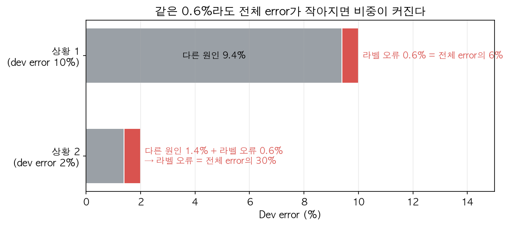

그림에서 빨간 조각(라벨 오류 0.6%)의 **절대 길이는 두 줄에서 똑같다.** 달라지는 건 막대 전체 길이다. 모델이 좋아져서 다른 원인(회색)이 줄어들수록 같은 라벨 오류가 상대적으로 커져서(6% → 30%), 어느 순간 무시할 수 없는 조각이 된다. 그래서 라벨 정리는 보통 프로젝트 **후반**에 우선순위가 올라온다.

상황 2가 특히 위험한 이유: dev set의 목적은 **두 모델 중 뭐가 나은지 고르는 것**인데, 모델 A 2.1% vs 모델 B 1.9%를 비교할 때 라벨 노이즈가 0.6%나 끼어 있으면 어느 쪽이 진짜 나은지 믿을 수가 없다.

고칠 때 지켜야 할 원칙:
1. **Dev와 test set에는 항상 동일한 프로세스를 적용**해서 고쳐야 한다 (분포가 갈라지지 않게 — dev만 고치면 dev와 test가 다른 분포가 된다)
2. 알고리즘이 틀린 것만이 아니라 **맞혔는데 라벨이 틀린 경우**도 검토 대상에 포함시켜야 한다. 틀린 것만 검토해서 고치면 "모델에 유리한 방향으로만" 라벨이 수정돼서 모델 성능이 부풀려진 편향된 평가가 된다 — 다만 모델이 98% 맞히면 맞힌 쪽이 49배 많아서 실무적으로 좀 더 어렵다
3. Training set은 고치지 않아도 괜찮다 — train이 dev/test와 약간 다른 분포가 되는데, 딥러닝은 이에 꽤 강건하다(아래 mismatched distribution 절)

### 첫 시스템은 빨리 만들고 반복하라 (Build first, iterate)

음성 인식을 새로 만든다고 하면 개선 방향이 수십 가지다: 소음 환경, 억양, 마이크에서 먼 화자(far-field), 어린이 목소리, 말 더듬기... 뭘 먼저 할지 미리 알 방법이 없다. 그래서 완벽한 시스템을 처음부터 설계하려 하지 말고:

1. Dev/test set과 metric을 빠르게 정한다 (과녁 걸기)
2. 빠르고 지저분해도 되니(quick and dirty) 초기 시스템을 일단 만든다
3. Bias/variance 분석과 error analysis로 다음에 뭘 우선순위로 둘지 찾는다 (예: error analysis 결과 대부분이 far-field 화자 문제면 그걸 공략)

이건 이 태스크에 대한 선행 연구가 없거나, 익숙하지 않은 분야일 때 특히 중요한 조언이다. 이미 그 분야에 확실한 경험/문헌이 있다면(예: 얼굴 인식처럼 연구가 많이 된 분야) 처음부터 좀 더 정교한 시스템으로 시작해도 되지만, 그게 아니라면 일단 뭐라도 돌아가는 걸 만들고 데이터를 기반으로 반복하는 게 시간을 아낀다. Ng의 관찰로는 실무 팀이 **너무 단순하게 시작하는 경우보다 너무 복잡하게 시작하는 경우가 훨씬 많다.**

### 다른 분포(mismatched distribution)의 train/test 다루기 — 모바일 앱 고양이 예시

딥러닝은 데이터를 많이 먹을수록 좋아서, 팀들은 **목표 분포가 아닌 데이터라도** 최대한 긁어모아 training set에 넣고 싶어 한다. 그러면 train과 dev/test의 분포가 달라진다. 이걸 어떻게 다룰까.

시나리오: 웹에서 크롤링한 고화질 고양이 사진 20만 장(training에 쓰기 좋음)과, 실제 모바일 앱 사용자가 찍은 저화질 고양이 사진 1만 장(이게 진짜 배포 환경)이 있다.

**틀린 방법**: 둘을 섞어서(21만 장) 랜덤하게 train 20.5만/dev 2,500/test 2,500으로 나눈다 → 기대값으로 dev 2,500장 중 웹 이미지가 $2500 \times \frac{200k}{210k} \approx 2{,}381$장, 모바일은 **119장뿐**이다. 팀은 대부분 웹 이미지로 이뤄진 과녁을 보고 최적화하게 되어, 정작 중요한 "모바일 사용자 사진에서 잘 동작하는가"를 평가하지 못하게 된다 (앞서 말한 "과녁을 잘못된 곳에 거는" 실수와 같은 패턴). 장점은 train/dev/test 분포가 같아서 관리가 쉽다는 것 하나뿐.

**권장 방법**:
- Training set = 웹 이미지 20만 장 + 모바일 이미지 중 일부(예: 5,000장)
- Dev set = 모바일 이미지 중 일부(예: 2,500장) — **목표 분포(target distribution)를 그대로 반영**
- Test set = 나머지 모바일 이미지(예: 2,500장) — 역시 목표 분포

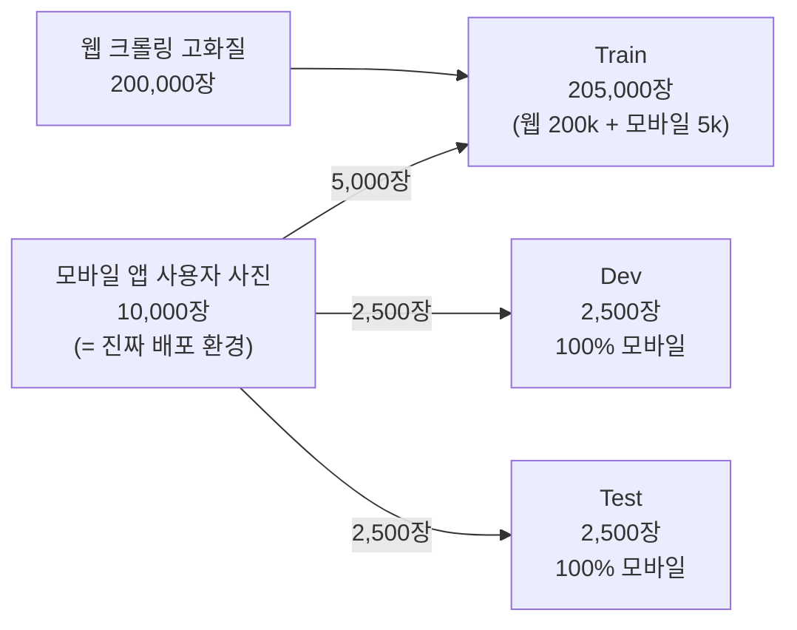

그림에서 보듯 **모바일 사진(진짜 목표)은 세 세트 모두에 들어가지만, 웹 사진은 train에만** 들어간다. 과녁(dev/test)은 100% 목표 분포로 채우고, 웹 사진은 "학습용 보충 자료"로만 쓰는 구조다.

즉, dev/test set은 "실제로 잘 작동하길 바라는 분포"를 그대로 담아야 하고, training set에는 이질적인 데이터를 더 섞어 넣어서 데이터 양을 늘리는 전략을 쓴다. 단점은 train과 dev 분포가 달라진다는 것인데, 장기적으로 이게 훨씬 좋은 성능을 낸다. 대신 아래의 새로운 진단 도구가 필요해진다.

같은 구조의 다른 예시(음성 인식 — 차량용 후방 거울 음성 비서): 기존에 모은 온갖 음성 데이터(스마트 스피커, 음성 검색 등) 50만 개 + 실제 후방 거울에서 녹음한 음성 2만 개 → train = 50만 + 거울 1만, dev/test = 거울 각 5천.

### Train-dev set으로 data mismatch 진단하기

문제: training과 dev의 분포가 다르면, dev error가 train error보다 나빠졌을 때 그 이유가 두 가지 중 뭔지 구분이 안 된다.
1. **variance 문제**(overfitting): 모델이 training set에서 본 것만 외워서, 처음 보는 데이터에 일반화를 못 함
2. **data mismatch 문제**: 일반화는 잘 하는데, dev 데이터가 **애초에 다른 분포**(더 어려운 모바일 사진)라서

두 요인이 섞여 있으니, 하나씩 분리하려고 새로운 세트를 하나 더 만든다.

**Train-dev set**: training set과 **같은 분포**에서 뽑았지만, **학습에는 쓰지 않고** 따로 떼어놓은 세트. (training set을 랜덤 셔플해서 일부를 떼어내면 된다.)

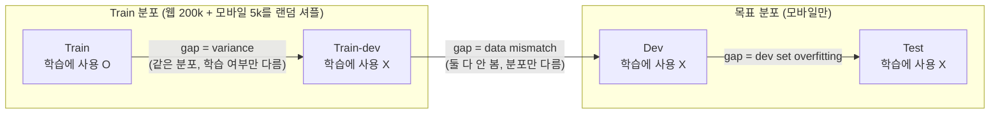

그러면 세트 사이의 차이가 하나씩만 남는다 (그림의 화살표 하나 = 조건 하나만 바뀜):
- train → train-dev: 분포는 같고, **"학습에 썼냐 안 썼냐"만 다르다** → 이 gap = variance
- train-dev → dev: 둘 다 학습에 안 썼고, **"분포만 다르다"** → 이 gap = data mismatch

실험에서 "변수를 하나씩만 바꿔야 원인을 알 수 있다"는 원칙과 똑같다. Train → dev로 바로 가면 "학습 여부"와 "분포"가 **동시에** 바뀌어서 gap이 어느 쪽 탓인지 모른다. 중간에 train-dev를 끼워 넣어 두 변화를 한 번에 하나씩 일어나게 만든 것이다.

| 지표 | 값 |
|---|---|
| Human-level error | 0% |
| Training error | 1% |
| **Training-dev error** | 9% |
| Dev error | 10% |
| Test error | 10% |

- Training → Training-dev 사이 gap(1% → 9%)이 크면 → **variance 문제** (같은 분포인데도 못 맞추니까)
- Training-dev → Dev 사이 gap(9% → 10%)이 작으면 → data mismatch는 아님

반대로 다른 예시:

| 지표 | 값 |
|---|---|
| Human-level error | 0% |
| Training error | 1% |
| **Training-dev error** | 1.5% |
| Dev error | 10% |
| Test error | 10% |

- Training → Training-dev gap이 작음(1% → 1.5%) → variance는 문제가 아님
- **Training-dev → Dev gap이 큼(1.5% → 10%) → data mismatch가 진짜 원인**

**전체 그림 — 각 gap이 뜻하는 것**:

| 비교 | gap이 뜻하는 것 |
|---|---|
| human-level → train | avoidable bias |
| train → train-dev | variance |
| train-dev → dev | data mismatch |
| dev → test | dev set에 overfitting한 정도 (크면 더 큰 dev set 필요) |

예: human 4%, train 7%, train-dev 10%, dev 12%, test 12% → avoidable bias 3, variance 3, mismatch 2 — 셋 다 있어서 셋 다 신경 써야 한다.

앞의 [error 분해 그림](assets/ch3-error-decomposition.png)의 아래 세 줄이 바로 이 절의 세 예시다. "Train-dev 예 1"은 주황(variance 8)이, "예 2"는 파랑(data mismatch 8.5)이 압도적이라 처방이 정반대다. 둘 다 train 1% / dev 10%로 겉보기 숫자는 똑같다는 점이 핵심이다 — train-dev 하나가 진단을 갈라놓는다.

이렇게 네 가지 숫자(human-level, train, train-dev, dev)를 나란히 놓고 gap을 비교하면 avoidable bias, variance, data mismatch 세 가지를 분리해서 진단할 수 있다. (실무에서는 여기에 dev-overfitting 여부를 보려고 test error까지 같이 비교하기도 한다.)

**숫자가 거꾸로 가는 경우도 있다**: train 7%, train-dev 10%, dev **6%** — dev가 train-dev보다 쉬운 경우(목표 분포 데이터가 오히려 깔끔한 경우). 이걸 확인하려면 목표 분포(거울 음성)에 대해서도 human error와 train error를 재볼 수 있다:

| | 일반 음성 데이터 | 후방 거울 음성 |
|---|---|---|
| Human level | 4% | 6% |
| 학습에 쓴 데이터의 error | 7% (train) | 6% (거울 데이터 일부를 train에 넣고 측정) |
| 학습에 안 쓴 데이터의 error | 10% (train-dev) | 6% (dev/test) |

오른쪽 열을 보면 거울 음성은 사람에게도 6%로 더 어려운 데이터였고, 모델이 이미 human-level에 도달해 있다 — 분포 차이 때문에 문제가 생긴 게 아니다. 필수 분석은 아니지만 이런 식으로 표를 채우면 추가 통찰을 얻을 수 있다.

### Data mismatch 해결하기

체계적인 이론(formal solution)은 없지만 실무에서 쓰는 접근:
1. Dev set에서 틀린 사례들을 직접 눈으로(귀로) 보고, training set과 dev/test set이 구체적으로 어떻게 다른지 error analysis로 파악한다 (예: 차량 소음, 저화질, 특정 억양, 도로 번호 같은 숫자를 많이 말함 등). 단 **test set은 보지 말 것** — test set에 overfit하게 된다.
2. 파악한 차이를 좁히는 방향으로 시도한다 — training data를 dev/test와 **비슷하게 만들거나**, dev/test와 비슷한 데이터를 **더 모은다**. 예: 차량 소음이 문제면 training 음성에 차량 소음을 입힌다(**artificial data synthesis**, 인공 데이터 합성). 숫자 말하는 게 문제면 사람들이 숫자 말하는 녹음을 더 모은다.

**Artificial data synthesis 주의점**: 음성 인식 예시로, 깨끗한 음성 데이터에 자동차 소음을 합성해서 "자동차 안에서 녹음된 것 같은" 데이터를 만드는 경우를 생각해보자. 만약 깨끗한 음성 10,000시간에 자동차 소음 1시간짜리를 반복해서 덧입히면, 사람 귀에는 그럴싸하게 들려도(사람에겐 차 소음이 다 비슷하게 들린다) 알고리즘 입장에서는 **그 1시간짜리 소음 샘플에 overfitting**해버릴 위험이 크다. 실제로 존재할 수 있는 무한히 다양한 자동차 소음 중 아주 작은 부분집합(subset)만 합성에 쓴 것이기 때문이다. 10,000시간짜리 서로 다른 차 소음을 구할 수 있으면 훨씬 낫다.

이미지도 마찬가지다: 자율주행용으로 게임 그래픽 엔진에서 자동차 이미지를 합성할 때, 게임에 등장하는 차 모델이 20종뿐이면 사람 눈엔 사실적이어도 모델은 그 20종에 overfit한다 (실제 도로에는 훨씬 다양한 차가 있다). 데이터 합성은 강력한 도구지만, 만들어낸 데이터가 실제 목표 분포 전체를 대표하는지 늘 의심해봐야 한다.

### Transfer learning — 언제 의미가 있나

**어떤 문제를 푸나**: X-ray 진단 모델을 만들고 싶은데 라벨 달린 X-ray가 100장뿐이라고 하자. 100장으로 수백만 개 파라미터를 가진 network를 처음부터(랜덤 초기값에서) 학습시키면 거의 확실히 overfit한다. 그런데 세상에는 라벨 달린 일반 사진(개, 고양이, 자동차...)은 100만 장씩 있다. **"다른 데서 배운 걸 빌려 쓸 수 없을까?"** 가 transfer learning(전이 학습)의 출발점이다. 사람으로 치면, 피아노를 오래 친 사람은 오르간을 처음 배워도 악보 읽기·손가락 쓰기를 이미 알아서 훨씬 빨리 는다 — 공통 기초를 옮겨오는(transfer) 것이다.

한 줄 정의: 이미 학습된 network(예: 이미지 인식용으로 100만 장 학습한 모델)의 뒷단 레이어(마지막 layer, 혹은 마지막 몇 개)를 새로운 task(예: X-ray 진단, 데이터는 100장뿐)에 맞게 다시 학습시키는 것.

**용어 먼저**:
- **Pre-training**(사전 학습): 데이터가 많은 원래 task(A)로 network를 먼저 학습시키는 단계. 여기서 얻은 가중치를 "pre-trained weights"라고 한다.
- **Head**(출력층 쪽 끝부분): network의 마지막 layer(들). task마다 출력 형태가 다르니(1000개 사물 클래스 vs 질병 유무) 보통 이 부분만 새 걸로 갈아 끼운다. 나머지 앞부분은 "backbone" 또는 feature extractor라고 부르기도 한다.
- **Fine-tuning**(미세 조정): pre-trained 가중치에서 **출발해서** 새 task(B) 데이터로 조금 더 학습시키는 단계. 처음부터가 아니라 이미 좋은 지점에서 살짝만 조정한다는 뉘앙스.
- **Freeze**(고정, 얼리기): 특정 layer의 가중치를 학습 중에 **업데이트하지 않도록** 막는 것. gradient descent가 그 layer의 $W, b$는 건드리지 않고 나머지만 바꾼다. 데이터가 적을 때 앞쪽 layer를 freeze하면, 이미 잘 배운 feature가 100장짜리 데이터에 휘둘려 망가지는 걸 막을 수 있다.

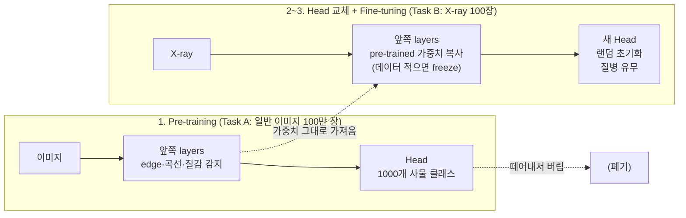

**구체적 절차**:
1. Task A(이미지 인식)로 network 전체를 학습 → **pre-training**
2. 마지막 output layer(와 그 가중치 $W^{[L]}, b^{[L]}$)를 떼어내고, 새 task에 맞는 output layer를 **랜덤 초기화**해서 붙인다 (X-ray 진단 클래스 수에 맞게)
3. 새 데이터(X-ray)로 학습 → **fine-tuning**
   - 새 데이터가 **적으면**: 앞쪽 레이어는 고정(freeze)하고 새로 붙인 마지막 레이어(또는 마지막 1~2개)만 학습
   - 새 데이터가 **많으면**: 전체 레이어를 다 다시 학습 (pre-trained 가중치는 좋은 초기값 역할)
   - 마지막 레이어 하나가 아니라 새 레이어를 여러 개 붙여도 된다

**왜 되나**: 이미지 100만 장으로 학습한 network의 앞쪽 레이어는 edge, 곡선, 질감, 부분 형태 같은 **low-level feature**를 이미 잘 감지한다. 이런 feature는 고양이 사진이든 X-ray든 공통으로 유용하다. X-ray 100장으로는 이런 걸 처음부터 배울 수 없지만, 이미 배운 걸 빌려오면 뒷단만 새 task에 맞추면 된다. 음성도 같다: 일반 음성 인식 10,000시간으로 학습 → wake word 감지(데이터 1시간)로 transfer.

Transfer learning이 의미 있으려면 (A → B 방향일 때):
- Task A(pre-training)와 Task B(fine-tuning)가 같은 종류의 input(이미지, 오디오 등)을 공유해야 함
- **Task A의 데이터가 Task B보다 훨씬 많아야** 의미가 있다. B 샘플 하나가 A 샘플 하나보다 훨씬 가치 있으니(B가 진짜 목표니까), A가 B보다 적으면 B 데이터로 그냥 학습하는 게 낫다 — 별 도움 안 됨
- Task A에서 배운 low-level feature(edge, shape, 음성의 기본 파형 등)가 Task B에도 유용해야 함

### Multi-task learning — 자율주행 예시

하나의 network가 여러 task를 동시에 학습하는 것. Transfer learning은 순차적(sequential, A→B)인 반면, multi-task learning은 **동시에** 여러 목표를 학습한다 — 각 task가 다른 task의 학습을 도와주기를 기대한다.

자율주행 예시: 이미지 한 장에서 보행자(pedestrian), 자동차(car), 정지 신호(stop sign), 신호등(traffic light) 네 가지를 동시에 감지해야 한다면, output을 4차원 벡터로 만들고 하나의 network가 4개를 동시에 예측하게 학습시킨다.

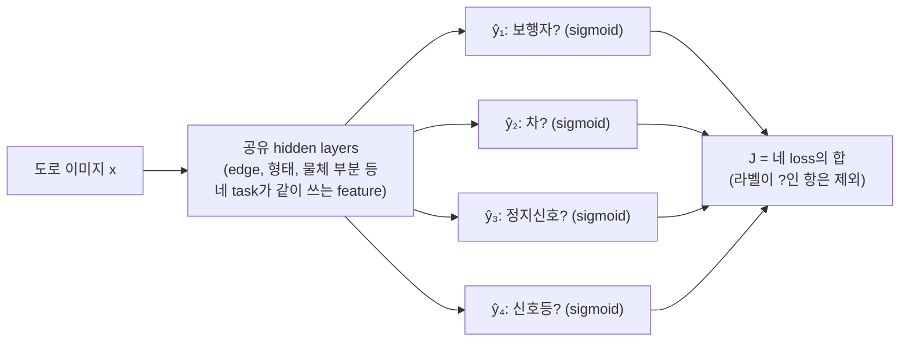

그림의 핵심은 **몸통(공유 layer)은 하나, 출력 칸만 4개**라는 점이다. 네 task의 loss가 합쳐져서 역전파되므로, 공유 layer는 네 task 모두에 쓸모 있는 feature를 배우도록 압력을 받는다.

$$y^{(i)} = \begin{bmatrix}\text{보행자?}\\ \text{차?}\\ \text{정지신호?}\\ \text{신호등?}\end{bmatrix} = \begin{bmatrix}0\\1\\1\\0\end{bmatrix}, \qquad Y: (4, m), \quad \hat y^{(i)}: (4, 1)$$

loss는 4개 task의 loss를 합산하고 샘플에 대해 평균낸다:

$$J = \frac{1}{m}\sum_{i=1}^{m}\sum_{j=1}^{4}\mathcal{L}\left(\hat y^{(i)}_j,\ y^{(i)}_j\right), \qquad \mathcal{L}(\hat y, y) = -\left[y\log\hat y + (1-y)\log(1-\hat y)\right]$$

| 기호 | 의미 |
|---|---|
| $m$ | training set의 샘플 수 (dev set이 아니라 **학습에 쓰는** 샘플 개수라 위 $m_{\text{dev}}$와는 다른 카운트다) |
| $i$ | 샘플 번호, $1 \le i \le m$. 바깥쪽 합 $\sum_i$는 **샘플에 대한 평균**을 낸다 |
| $j$ | task 번호, $1 \le j \le 4$(보행자/차/정지신호/신호등). 안쪽 합 $\sum_j$는 **한 샘플 안의 4개 task loss를 합산**한다 |
| $\hat y_j^{(i)}$ | $i$번째 샘플의 $j$번째 task에 대한 예측(0~1 사이 sigmoid 출력) |
| $y_j^{(i)}$ | $i$번째 샘플의 $j$번째 task 정답 라벨(0 또는 1) |
| $\mathcal{L}(\hat y, y)$ | 로지스틱 회귀의 cross-entropy loss(= chapter1의 그 손실 함수). $y=1$이면 $-\log\hat y$만 남아 $\hat y$가 1에 가까울수록 작아지고, $y=0$이면 $-\log(1-\hat y)$만 남아 $\hat y$가 0에 가까울수록 작아진다 — 예측이 정답에서 멀수록 벌점이 커지는 함수 |

**softmax와의 차이**: softmax는 "이미지 하나에 클래스가 **하나**"(고양이 **또는** 강아지)라서 출력 합이 1이다. 여기서는 한 이미지에 차와 정지신호가 **동시에** 있을 수 있어서, 4개 출력이 각각 독립적인 sigmoid(0~1)다.

**라벨이 일부만 있어도 된다**: 어떤 이미지는 라벨러가 보행자·차만 표시하고 정지신호·신호등은 표시 안 했을 수 있다($y = [1, 0, ?, ?]$). 이럴 땐 합산할 때 **라벨이 있는 $j$만** 더하면 된다 — "?"는 loss 계산에서 빼버린다 (Lab 4). 그래서 서로 다른 데이터셋을 합치기도 좋다.

**4개 network를 따로 학습하지 않는 이유**: 앞쪽 레이어의 low-level feature(edge, 형태)는 보행자·차·신호 감지 모두에 쓰인다. 하나의 network가 네 task의 데이터를 전부 보면서 공통 feature를 배우니까, 각 task 입장에서는 **학습 데이터가 늘어난 효과**가 난다.

Multi-task learning이 의미 있으려면:
- 여러 task가 **low-level feature를 공유**할 수 있어야 함 (자율주행의 물체 감지 예시처럼)
- (덜 중요하지만 도움 되는 조건) 각 task의 데이터 양이 어느 정도 비슷해서, 다른 task들의 데이터가 합쳐지면 개별 task 하나만 학습할 때보다 데이터가 훨씬 많아지는 효과. 예: task 100개가 각각 1,000개씩이면, 한 task 입장에서 나머지 99개 task의 99,000개가 도움을 준다
- 모든 task를 동시에 잘하기에 충분히 큰 network를 쓸 수 있어야 함 (network가 너무 작으면 오히려 하나씩 따로 학습시키는 것보다 성능이 떨어질 수 있음 — 연구에 따르면 성능이 떨어지는 경우는 대부분 network가 작은 경우다)

실무에서는 transfer learning이 multi-task learning보다 훨씬 자주 쓰인다 (Ng 언급). Multi-task learning은 object detection 같은 컴퓨터 비전 태스크 정도에서나 자주 보인다 — 조건(비슷한 양의 데이터를 가진 여러 task)을 만족하는 상황 자체가 드물기 때문.

### End-to-end deep learning

**먼저 "파이프라인"이 뭔지**: 예전(그리고 지금도 많은) ML 시스템은 문제를 여러 단계로 쪼개서, 각 단계를 따로 만든 다음 컨베이어 벨트처럼 이어 붙였다. 앞 단계의 출력이 다음 단계의 입력이 된다. 각 단계를 **어떻게 쪼갤지는 사람(엔지니어, 도메인 전문가)이 설계**한다 — 이런 사람이 정한 중간 단계를 hand-designed component라고 한다.

End-to-end(E2E)는 그 반대: 전통적 파이프라인(여러 단계를 손으로 설계) 대신, **input을 바로 output으로 매핑하는 하나의 큰 network**를 학습시키는 방식. "end(입력 끝)에서 end(출력 끝)까지 한 번에"라는 뜻이다.

**음성 인식 예시** (아래 그림 참고):
- **MFCC**: 오디오 파형에서 사람 귀가 민감한 주파수 특성을 뽑아내도록 **사람이 공식으로 설계한** 특징값. (light context: 이 코스에선 "손으로 만든 음성 feature" 정도로만 알면 된다.)
- **Phoneme(음소)**: 말소리를 이루는 최소 소리 단위. 예를 들어 영어 "cat"은 /k/ /æ/ /t/ 세 음소, 한국어 "밤"은 ㅂ/ㅏ/ㅁ에 해당하는 소리로 쪼갤 수 있다. 전통 시스템은 "오디오 → 음소열 → 단어"처럼 이 단위를 중간 다리로 썼다.

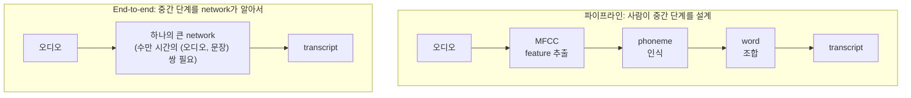

phoneme(음소)은 언어학자가 만든 개념인데, 사람이 만든 이 중간 단계가 실제로 최선인지는 알 수 없다. 데이터가 충분하면(수만~10만 시간) network가 스스로 더 좋은 중간 표현을 찾는다. 데이터가 적으면(3,000시간) 전통 파이프라인이 더 잘 된다. 중간 규모라면 일부 단계만 건너뛰는 절충도 있다.

**얼굴 인식 출입문 예시 — 두 단계로 쪼개는 게 나은 경우**: 카메라 이미지 → 사람 신원. 사람이 문에 다가오는 위치·거리가 매번 달라서 이미지 전체를 한 번에 처리하는 건 어렵다. 대신:
1. 이미지에서 얼굴을 찾아 잘라낸다 (face detection)
2. 잘라낸 얼굴을 확대해서 누구인지 판별 (face recognition)

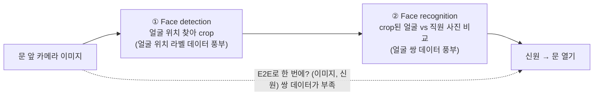

각 하위 문제는 훨씬 단순하고, **각각의 데이터가 풍부하다**(얼굴 위치 라벨 데이터, 얼굴 쌍 데이터는 많다). 반면 "문 앞 전체 이미지 → 신원" 짝지어진 데이터는 적다.

**그 외 예시**: 기계 번역(영어 → 프랑스어)은 **E2E가 잘 된다** — 영어-프랑스어 문장 쌍이 대량으로 존재하니까. 손 X-ray로 아이 나이 추정은 **파이프라인이 낫다** — (이미지 → 뼈 부위 분할) 데이터와 (뼈 길이 → 나이) 의학 표가 있지만, (X-ray → 나이) 짝 데이터는 적다.

**장점**:
- **Let the data speak** — 사람이 직접 설계한 중간 단계(hand-designed component, 예: phoneme)의 편향을 강요하지 않고, 데이터에 있는 진짜 패턴을 학습할 기회를 준다
- 손으로 짠 여러 개의 모듈을 설계/유지보수하는 엔지니어링 비용이 줄어든다

**단점**:
- **아주 많은 데이터가 필요**하다 (input-output 직접 매핑에 필요한 (x, y) 쌍의 데이터량이 훨씬 큼)
- 손으로 설계했으면 넣을 수 있었던 유용한 사전 지식(hand-designed component, 도메인 지식)을 배제하게 됨 — 특히 데이터가 적을 때는 손으로 설계한 컴포넌트가 오히려 더 낫다. 학습 알고리즘의 지식 원천은 **데이터**와 **사람이 넣은 설계** 두 가지뿐이라서, 데이터가 적으면 설계로 채워야 한다

**언제 쓸지 — 핵심 질문**: "**x에서 y로 가는 함수의 복잡도를 학습할 만큼 데이터가 충분한가?**" 데이터가 부족하면 문제를 여러 단계로 쪼개서(파이프라인 방식으로) 각 단계마다 상대적으로 적은 데이터로도 학습 가능한 sub-task로 만드는 게 낫다. 자율주행 예시: "카메라 이미지 → 바로 조향각(steering) 출력"은 데이터가 극도로 많이 필요해서 잘 안 되는 반면, "이미지 → 주변 차량/보행자 인식(딥러닝) → 인식 결과를 바탕으로 경로 계획(motion planning, 별도 알고리즘) → 조향 제어(control)"처럼 나누면 각 단계가 상대적으로 다루기 쉬운 문제가 된다. 각 단계에 딥러닝을 쓸지 다른 방법을 쓸지도 따로 고를 수 있다.

---

## 핵심 요약

- **Orthogonalization**: 문제 진단 단계(train/dev/test/real-world)마다 서로 겹치지 않는 전용 손잡이로 대응하라. Early stopping처럼 여러 단계에 동시에 영향을 주는 도구는 주의해서 써라.
- **평가는 숫자 하나로**: 여러 지표가 있으면 single-number metric(F1 = 조화평균 — 작은 쪽에 끌려감)으로 합치거나, optimizing 1개 + satisficing 나머지("maximize accuracy s.t. time ≤ 100ms")로 구조화해라.
- **Dev/test set = 과녁**: 반드시 같은 분포에서, 배포 목표 분포를 반영해서 뽑아라. 이걸 잘못 걸면 몇 달의 노력이 헛수고가 된다. metric이 사람들의 선호와 다르면 metric(가중 error 등)을, 데이터가 실사용과 다르면 dev/test를 바꿔라.
- **Human-level = Bayes error의 proxy**: 가장 잘하는 human 그룹을 기준으로. avoidable bias(train − human)와 variance(dev − train)를 나눠서 **더 큰 쪽부터** 공략해라. 절대 숫자만으로는 안 보이는 병목이 보인다. human-level을 넘으면 이 진단이 어려워진다.
- **Error analysis 먼저, 코드는 나중에**: 틀린 샘플 100개를 스프레드시트로 직접 분류해서 각 아이디어의 **천장(ceiling)**을 계산하고 어디에 시간을 쓸지부터 정해라.
- **Mislabeled data**: training은 random error에 강건해서 대개 둬도 됨. dev/test는 "전체 error 중 라벨 오류 몫"이 크면 고치되, dev/test에 같은 프로세스로, 맞힌 샘플도 검토.
- **Mismatched distribution**: dev/test는 목표 분포로, train에는 다른 분포 데이터도 넣어 양을 늘린다. 진단은 train-dev set으로: train → train-dev gap은 variance, train-dev → dev gap은 data mismatch. 해결은 error analysis + (과적합에 주의한) 데이터 합성.
- **Transfer/multi-task learning**: 데이터가 많은 쪽에서 적은 쪽으로(pre-training → fine-tuning), 혹은 low-level feature를 공유하는 task끼리 묶을 때(합산 loss, 라벨 없는 항은 제외) 의미가 있다.
- **End-to-end**: "x→y 매핑을 배울 만큼 (x, y) 데이터가 충분한가?"가 핵심 질문. 충분할 때만 강력하다. 부족하면 각 단계의 데이터가 풍부한 파이프라인으로 쪼개는 게 낫다.

## 의사결정 플로우차트

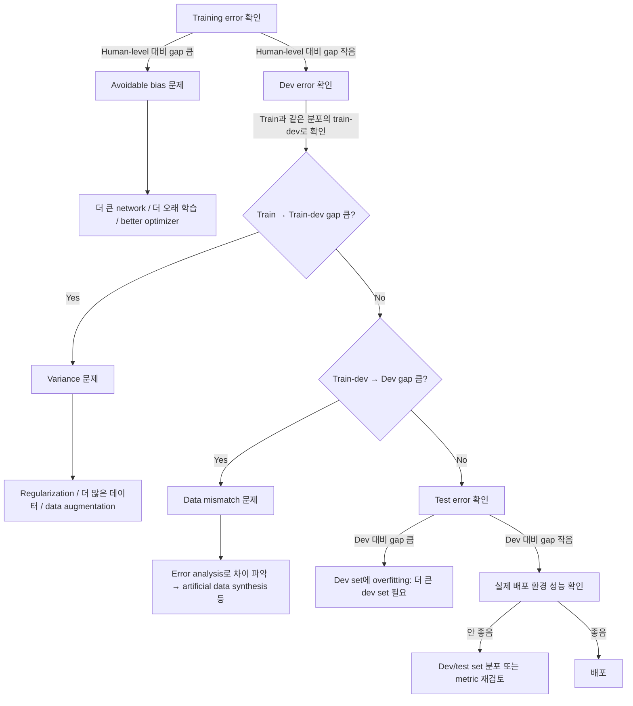

## 헷갈리기 쉬운 점

- **Variance ≠ dev error가 높다는 것 그 자체.** Variance는 "train error 대비 dev error가 얼마나 나빠졌는지"의 gap이다. Train error 자체가 이미 안 좋으면(=bias 문제) dev error가 나쁜 게 당연한 거라서 variance 문제로 오진하면 안 된다.
- **Data mismatch와 variance를 헷갈리기 쉽다.** 둘 다 "dev error가 train error보다 훨씬 나쁘다"는 증상은 같지만 원인이 다르다. Train-dev set 없이는 이 둘을 구분할 방법이 없다 — 반드시 같은 분포에서 뽑은 train-dev set을 만들어서 비교해야 한다.
- **Transfer learning의 방향을 거꾸로 착각하기 쉽다.** "데이터 많은 task → 데이터 적은 task" 방향이어야 의미가 있다. 반대로 하면 오히려 성능이 떨어질 수 있다.
- **Human-level performance는 하나의 고정된 숫자가 아니다.** 어떤 집단(일반인/의사/전문의 팀)을 기준으로 잡느냐에 따라 다르고, Bayes error의 근사치로 쓰려면 그 태스크에서 가장 성능 좋은 human 그룹을 기준으로 삼아야 한다.
- **Multi-task learning은 "여러 output을 예측하는 것" 전부를 뜻하지 않는다.** Loss를 여러 task에 대해 합산해서 하나의 network가 전부 학습하는 구조를 말하는 거다. 이게 의미 있으려면 low-level feature 공유가 가능해야 하고, 그냥 서로 무관한 task를 하나의 network에 욱여넣는다고 성능이 좋아지는 게 아니다.
- **End-to-end deep learning이 항상 정답은 아니다.** "많이 배웠으니까 무조건 end-to-end로 가야지"라는 접근은 위험하다. 데이터가 충분한지부터 확인하고, 부족하면 파이프라인으로 쪼개는 전통적 방식이 나을 수 있다.
- **Precision과 recall은 분모가 다르다.** Precision의 분모는 "모델이 고양이라고 한 것"(TP+FP), recall의 분모는 "진짜 고양이"(TP+FN)다. 헷갈리면 confusion matrix에서 precision = 예측 열, recall = 정답 행으로 기억하자.
- **Bayes error는 측정되는 값이 아니라 추정하는 값이다.** 진짜 $p(y\mid x)$를 모르니 직접 계산할 수 없다. 사람 성능은 "Bayes error ≤ 가장 잘하는 사람의 error"라는 **상한**을 알려줄 뿐이고, 그래서 가장 잘하는 그룹의 숫자를 proxy로 쓴다.
- **Fine-tuning ≠ 앞쪽 layer를 무조건 freeze하는 것.** Fine-tuning은 "pre-trained 가중치에서 출발해 새 데이터로 더 학습한다"는 큰 개념이고, freeze할지(얼마나 할지)는 새 데이터 양에 따라 고르는 옵션이다 — 적으면 head만, 많으면 전체를 학습한다.
- **첫 시스템을 빨리 만들라는 조언 = 대충 해도 된다는 뜻이 아니다.** 목적은 "완벽한 설계를 미리 다 고민하느라 시간 버리지 말고, 실제 데이터로 error analysis를 빨리 시작해서 다음 우선순위를 데이터 기반으로 정하라"는 거다.

---

## Lab 예제 — 직접 짜보기

> 이 코스는 알고리즘보다 "의사결정"이 핵심이라, lab도 **진단 도구를 직접 만들어보는** 방향으로 짰다. numpy + matplotlib만 쓴다.

### Lab 1. Single number metric + Satisficing/Optimizing으로 모델 고르기

**목표**: precision/recall/F1을 직접 계산하고, "실행시간 200ms 이하(satisficing) 중에서 F1 최대(optimizing)"라는 규칙으로 모델을 자동으로 고르는 함수를 만든다.

```python
import numpy as np

def precision_recall_f1(y_true, y_pred):
    tp = None   # TODO
    fp = None   # TODO
    fn = None   # TODO
    precision = None   # TODO (분모 0 조심)
    recall = None      # TODO
    f1 = None          # TODO: 조화평균
    return precision, recall, f1

np.random.seed(0)
y_true = (np.random.rand(1000) < 0.3).astype(int)
def fake_classifier(flip_pos, flip_neg):
    # 양성을 flip_pos 확률로 놓치고, 음성을 flip_neg 확률로 양성이라 우기는 가짜 분류기
    y = y_true.copy()
    pos, neg = y == 1, y == 0
    y[pos & (np.random.rand(1000) < flip_pos)] = 0
    y[neg & (np.random.rand(1000) < flip_neg)] = 1
    return y

classifiers = {
    "A": (fake_classifier(0.05, 0.20), 30),   # (예측, 실행시간 ms)
    "B": (fake_classifier(0.25, 0.02), 80),
    "C": (fake_classifier(0.10, 0.05), 150),
    "D": (fake_classifier(0.08, 0.04), 1500),
}
print(f"{'clf':>3} | {'P':>5} {'R':>5} {'F1':>5} | time")
for name, (pred, ms) in classifiers.items():
    p, r, f1 = precision_recall_f1(y_true, pred)
    print(f"{name:>3} | {p:.3f} {r:.3f} {f1:.3f} | {ms}ms")

def choose_model(classifiers, max_ms=200):
    # TODO: 실행시간 조건을 만족하는 것들 중 F1이 가장 큰 모델 이름 반환
    return None

print("F1 최대 + 200ms 이하 조건으로 고른 모델:", choose_model(classifiers))
```

**체크포인트**
- A는 recall 0.94 / precision 0.68, B는 precision 0.93 / recall 0.74 — P, R 두 개만 보면 "A가 나아? B가 나아?"를 못 정한다. F1으로 보면 A 0.788 < B 0.824 < C 0.885 < D 0.918.
- F1만 보면 D가 1등이지만 1500ms라 탈락 → 선택은 **C**. metric 하나(F1) + 조건(시간)으로 결정이 자동화된다.

<details>
<summary>정답 보기</summary>

```python
def precision_recall_f1(y_true, y_pred):
    tp = np.sum((y_pred == 1) & (y_true == 1))
    fp = np.sum((y_pred == 1) & (y_true == 0))
    fn = np.sum((y_pred == 0) & (y_true == 1))
    precision = tp / (tp + fp) if tp + fp > 0 else 0.0
    recall = tp / (tp + fn) if tp + fn > 0 else 0.0
    f1 = 2 * precision * recall / (precision + recall) if precision + recall > 0 else 0.0
    return precision, recall, f1

def choose_model(classifiers, max_ms=200):
    candidates = {n: precision_recall_f1(y_true, pred)[2]
                  for n, (pred, ms) in classifiers.items() if ms <= max_ms}   # satisficing
    return max(candidates, key=candidates.get)                                   # optimizing
```

</details>

### Lab 2. Bias / Variance / Data mismatch 진단기

**목표**: human-level, train, train-dev, dev, test error를 넣으면 각 gap(avoidable bias, variance, data mismatch, dev overfitting)을 계산하고, 가장 큰 문제와 처방을 알려주는 함수를 만든다. 강의의 의사결정 플로우차트를 코드로 옮기는 것.

```python
def diagnose(human, train, train_dev=None, dev=None, test=None):
    gaps = {}
    # TODO: avoidable bias = train - human
    # TODO: train_dev가 있으면 variance = train_dev - train, data mismatch = dev - train_dev
    #       없으면 variance = dev - train
    # TODO: test가 있으면 dev overfitting = test - dev
    advice = {
        "avoidable bias": "더 큰 모델 / 더 오래·더 좋은 optimizer / 아키텍처 변경",
        "variance": "데이터 추가 / regularization(L2, dropout, augmentation)",
        "data mismatch": "error analysis로 train vs dev 차이 파악, dev 분포 데이터 수집·합성",
        "dev overfitting": "더 큰 dev set",
    }
    for k, v in gaps.items():
        print(f"  {k:>15}: {v*100:5.1f}%")
    worst = None   # TODO: gap이 가장 큰 항목
    print(f"  => 가장 큰 문제: {worst} -> {advice[worst]}")
    return worst

cases = [
    ("고양이 분류(강의 예시 1)", dict(human=0.01, train=0.08, dev=0.10)),
    ("고양이 분류(강의 예시 2)", dict(human=0.075, train=0.08, dev=0.10)),
    ("모바일 앱 (train-dev 사용)", dict(human=0.0, train=0.01, train_dev=0.015, dev=0.10)),
    ("과적합된 dev", dict(human=0.01, train=0.02, train_dev=0.025, dev=0.03, test=0.08)),
]
for name, kw in cases:
    print(name)
    diagnose(**kw)
```

**체크포인트**
- 예시 1: avoidable bias 7% > variance 2% → **bias** 먼저.
- 예시 2: train/dev 숫자는 똑같은데 human이 7.5%라 avoidable bias 0.5% → **variance** 먼저. 같은 train/dev error라도 human-level에 따라 처방이 정반대가 된다는 게 핵심.
- 모바일 앱: data mismatch 8.5% — train-dev set이 없었으면 이걸 variance로 착각했을 것.
- 과적합된 dev: dev overfitting 5% → dev set을 너무 많이 들여다봤다는 신호.

<details>
<summary>정답 보기</summary>

```python
    gaps = {"avoidable bias": train - human}
    if train_dev is not None:
        gaps["variance"] = train_dev - train
        if dev is not None:
            gaps["data mismatch"] = dev - train_dev
    elif dev is not None:
        gaps["variance"] = dev - train
    if test is not None and dev is not None:
        gaps["dev overfitting"] = test - dev
    ...
    worst = max(gaps, key=gaps.get)
```

</details>

### Lab 3. Error analysis 표 만들기 — 어디부터 고칠까

**목표**: 틀린 dev 샘플 100개에 태그를 붙였다고 가정하고, 태그별 비율과 "그 카테고리를 완벽히 고쳤을 때 dev error가 최대 얼마까지 내려갈 수 있는지(ceiling)"를 계산한다. 강의의 스프레드시트를 코드로.

```python
import numpy as np
import matplotlib.pyplot as plt
from collections import Counter

np.random.seed(42)
tags = ["dog", "great cat", "blurry", "instagram filter", "mislabeled"]
true_rates = [0.08, 0.43, 0.61, 0.12, 0.06]
mistakes = []                       # 틀린 샘플 100개 각각에 붙은 태그 리스트 (여러 개 가능)
for i in range(100):
    mistakes.append([tag for tag, r in zip(tags, true_rates) if np.random.rand() < r])

def error_analysis(mistakes, dev_error):
    counts = None   # TODO: Counter로 태그별 등장 횟수
    n = len(mistakes)
    print(f"{'tag':>17} | {'% of errors':>11} | 이것만 다 고치면 dev error")
    rows = sorted(counts.items(), key=lambda kv: -kv[1])
    for tag, c in rows:
        best_case = None   # TODO: dev_error * (1 - 비율)
        print(f"{tag:>17} | {c / n * 100:10.0f}% | {dev_error*100:.1f}% -> {best_case*100:.2f}%")
    return rows

rows = error_analysis(mistakes, dev_error=0.10)
plt.barh([r[0] for r in rows][::-1], [r[1] for r in rows][::-1])
plt.xlabel("# of misclassified dev examples (out of 100)"); plt.title("Error analysis"); plt.show()
```

**체크포인트**
- blurry 59% → 고치면 10% → 4.1%, great cat 40% → 6.0%, dog 9% → 9.1%, mislabeled 4% → 9.6%.
- "개 사진을 고양이로 착각한다"는 팀원의 주장에 몇 달을 쓰기 전에, 고쳐봐야 10% → 9.1%라는 **상한**을 먼저 보는 게 포인트. mislabeled 4%도 지금은 우선순위가 낮다.
- 한 샘플에 태그가 여러 개 붙을 수 있어서 비율 합이 100%를 넘는 게 정상이다.

<details>
<summary>정답 보기</summary>

```python
    counts = Counter(tag for m in mistakes for tag in m)
    ...
        best_case = dev_error * (1 - c / n)
```

</details>

### Lab 4. Multi-task learning — 라벨이 비어있어도 되는 loss

**목표**: 자율주행 예시처럼 한 이미지에 여러 라벨(보행자/차/정지 표지판/신호등)을 동시에 예측하는 multi-task loss를 구현한다. 일부 라벨이 `?`(NaN)여도 그 칸만 빼고 학습하게 mask를 쓴다. 그리고 task들이 공통 구조를 공유할 때 hidden layer를 공유하는 게 task별로 따로 학습하는 것보다 나은지 실험한다.

```python
import numpy as np

def sigmoid(z): return 1 / (1 + np.exp(-z))

def multitask_loss(Y_hat, Y):
    # Y_hat, Y: (n_tasks, m). Y에 np.nan = 라벨 없음
    mask = None     # TODO: 라벨이 있는 칸만 True
    Y_filled = np.where(mask, Y, 0)
    loss = None     # TODO: task별 logistic loss를 원소별로 계산하고 mask 곱하기
    return np.sum(loss) / Y.shape[1]

def multitask_grad(Y_hat, Y):
    mask = ~np.isnan(Y)
    return None     # TODO: 라벨 있는 칸은 (Y_hat - Y) / m, 없는 칸은 0

Y = np.array([[1, 0, np.nan, 1],     # 보행자
              [0, 1, 1, np.nan],     # 차
              [1, np.nan, 0, 0],     # 정지 표지판
              [0, 0, 1, 0]])         # 신호등
np.random.seed(0)
Y_hat = sigmoid(np.random.randn(4, 4))
print("multi-task loss:", multitask_loss(Y_hat, Y))
print("dZ (라벨 없는 칸은 0):\n", np.round(multitask_grad(Y_hat, Y), 3))

# 공유 표현 vs 따로 학습: 4개 task가 low-rank 공통 구조를 공유하고, 데이터는 60개뿐
np.random.seed(1)
n_x, m = 20, 60
W_true = np.random.randn(4, 3) @ np.random.randn(3, n_x)
X = np.random.randn(n_x, m); X_test = np.random.randn(n_x, 2000)
Y_all = (W_true @ X > 0).astype(float)
Y_all[np.random.rand(*Y_all.shape) < 0.3] = np.nan            # 라벨 30%는 비어있음
Y_test = (W_true @ X_test > 0).astype(float)

def train_shared(X, Y, n_h, iters=3000, lr=0.5):
    rng = np.random.RandomState(0)
    W1 = rng.randn(n_h, X.shape[0]) * 0.1; W2 = rng.randn(Y.shape[0], n_h) * 0.1
    for _ in range(iters):
        H = W1 @ X; Yh = sigmoid(W2 @ H)          # 4개 task가 hidden H를 공유
        dZ = multitask_grad(Yh, Y)
        dW2 = dZ @ H.T; dW1 = (W2.T @ dZ) @ X.T
        W1 -= lr * dW1; W2 -= lr * dW2
    return lambda Xn: sigmoid(W2 @ (W1 @ Xn)) > 0.5

def train_separate(X, Y, iters=3000, lr=0.5):
    Ws = []
    for k in range(Y.shape[0]):                   # task마다 독립 로지스틱 회귀
        w = np.zeros((1, X.shape[0])); y = Y[k:k + 1]
        for _ in range(iters):
            w -= lr * multitask_grad(sigmoid(w @ X), y) @ X.T
        Ws.append(w)
    W = np.vstack(Ws)
    return lambda Xn: sigmoid(W @ Xn) > 0.5

acc_mt = np.mean(train_shared(X, Y_all, n_h=3)(X_test) == Y_test)
acc_sep = np.mean(train_separate(X, Y_all)(X_test) == Y_test)
print(f"test acc - multi-task(공유 hidden 3): {acc_mt:.3f}, task별 따로: {acc_sep:.3f}")
```

**체크포인트**
- loss ≈ 2.81, dZ에서 NaN이었던 위치 `(0,2), (1,3), (2,1)`이 정확히 0.
- multi-task ≈ 0.869 vs 따로 ≈ 0.843. task들이 공통 feature(여기선 rank-3 구조)를 공유하고 task별 데이터가 적을 때 multi-task가 이득 — 강의에서 말한 "multi-task가 의미 있는 조건" 그대로다. `W_true`를 task마다 완전히 독립적인 랜덤 행렬로 바꾸면 이득이 사라지는지도 실험해보자.

<details>
<summary>정답 보기</summary>

```python
def multitask_loss(Y_hat, Y):
    mask = ~np.isnan(Y)
    Y_filled = np.where(mask, Y, 0)
    loss = -(Y_filled * np.log(Y_hat) + (1 - Y_filled) * np.log(1 - Y_hat))
    loss = loss * mask
    return np.sum(loss) / Y.shape[1]

def multitask_grad(Y_hat, Y):
    mask = ~np.isnan(Y)
    return np.where(mask, Y_hat - np.nan_to_num(Y), 0) / Y.shape[1]
```

</details>
