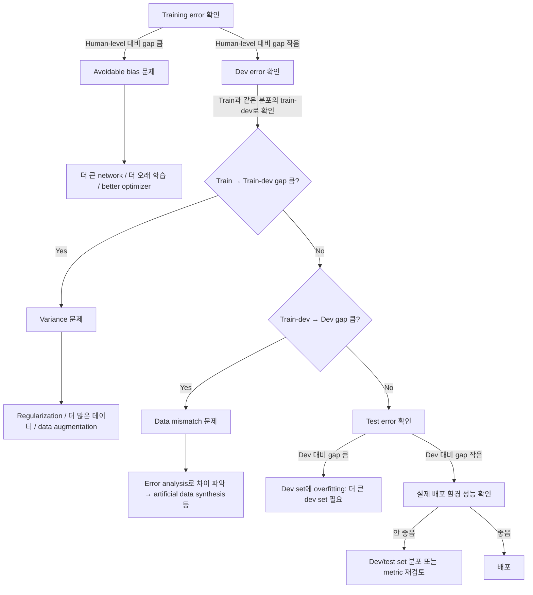

# Course 3: Structuring Machine Learning Projects

ML Specialization을 다 끝낸 상태에서, Deep Learning Specialization 전체를 들을 시간이 없을 때 Course 3만 압축해서 정리한 노트다. 이 코스는 사실 수식이 거의 없다 — Andrew Ng이 "나는 실리콘밸리랑 구글에서 이런 실수를 하는 팀을 수도 없이 봤다"면서 경험/전략을 풀어주는 코스라고 보면 된다. 모델을 어떻게 짜느냐가 아니라, **프로젝트를 어떻게 진단하고 다음에 뭘 해야 할지 판단하는 법**을 배우는 거다.

---

## Week 1: Orthogonalization과 평가 지표 설계

### Orthogonalization — TV 손잡이 비유

옛날 TV에는 화면 위치, 크기, 명암, 색상 등을 조절하는 손잡이(knob)가 따로따로 있었다. 손잡이 하나가 딱 하나의 효과만 내야(orthogonal) 조작하기가 쉽다. 만약 손잡이 하나를 돌렸는데 화면 크기랑 색상이 동시에 바뀌어버리면 원하는 그림을 맞추기가 거의 불가능해진다.

자동차 운전도 마찬가지다 — 핸들은 방향만, 가속페달/브레이크는 속도만 조절해야 운전이 직관적이다. 핸들을 꺾었는데 속도도 같이 변하면 운전을 못 한다.

ML 시스템도 이렇게 **"지금 내가 뭘 튜닝해야 이 문제가 풀리는지"가 명확한 구조**로 만들어야 한다. Andrew Ng은 supervised learning이 잘 되려면 아래 4단계 체인이 순서대로 통과해야 한다고 본다.

1. **Training set에서 잘 맞아야 한다** (사람 수준 성능 근처)
   - 안 되면 → 더 큰 network, better optimizer(Adam 등), 더 오래 학습
2. **Dev set에서 잘 맞아야 한다**
   - Training은 잘 되는데 dev가 안 되면 → regularization, 더 큰 training set
3. **Test set에서 잘 맞아야 한다**
   - Dev는 잘 되는데 test가 안 되면 → 더 큰 dev set (dev set에 overfitting 했을 가능성)
4. **실제 세상(real world)에서 잘 동작해야 한다**
   - Test는 잘 되는데 실전에서 안 되면 → dev/test set 분포를 바꾸거나 cost function을 바꿔야 함 (dev/test set이 실제 분포를 대표 못 하거나, 최적화하는 metric 자체가 틀렸다는 뜻)

핵심은 **각 단계마다 쓰는 "손잡이"가 달라야 한다**는 거다. Early stopping 같은 기법은 training error와 dev error 둘 다에 동시에 영향을 주기 때문에 orthogonal하지 않은 도구로 취급된다 (Ng이 딱 집어서 언급하는 예시). 그래서 어느 단계에서 문제가 생겼는지 먼저 진단하고, 거기에 맞는 orthogonal한 손잡이를 골라 써야 한다.

### Single number evaluation metric

팀 회의에서 "Classifier A는 precision이 좋은데 Classifier B는 recall이 좋다"는 식으로 논쟁하다가 시간을 다 날리는 경우를 많이 봤다고 한다. 두 개 이상의 지표를 동시에 보고 있으면 어떤 모델이 더 나은지 빠르게 판단할 수가 없다.

예시 (고양이 분류기):

| Classifier | Precision | Recall |
|---|---|---|
| A | 95% | 90% |
| B | 98% | 85% |

A가 나은지 B가 나은지 바로 말하기 어렵다. 이럴 때 **F1 score**(precision과 recall의 조화평균, harmonic mean)처럼 하나의 숫자로 합쳐버리면 비교가 즉시 가능해진다.

```
F1 = 2 * (Precision * Recall) / (Precision + Recall)
```

결론: 여러 후보 모델을 비교해야 하는 상황이면, 개발 초반에 **single real number metric**을 먼저 정해두는 게 반복 속도를 엄청나게 높여준다.

### Satisficing vs Optimizing metric

모든 걸 하나의 숫자로 합치기 애매한 경우도 있다. 예를 들어 정확도(accuracy)와 실행 시간(running time)을 같이 고려해야 한다면?

- **Optimizing metric**: 최대한 잘하고 싶은 지표 (예: accuracy는 최대화)
- **Satisficing metric**: 어떤 기준선만 넘으면 그걸로 충분한 지표 (예: running time은 100ms 이하면 OK, 더 빠르다고 딱히 추가 점수 안 줌)

N개의 지표가 있으면 보통 1개를 optimizing, 나머지 N-1개를 satisficing(문턱값 통과 여부)으로 두는 방식이 실용적이다. 예: "정확도는 최대화하되, false positive 알람은 하루 24시간 기준 1건 이하일 때만" 같은 식.

### Train/dev/test 분포 설정 — dev set은 과녁이다

Ng의 비유: dev set + metric을 정하는 건 **과녁(target)을 어디에 걸지 정하는 것**과 같다. 팀 전체가 그 과녁을 보고 화살(모델 개선)을 쏘게 되는데, 만약 과녁을 엉뚱한 위치(실제 사용자 데이터 분포와 다른 곳)에 걸어두면, 팀이 몇 달 동안 열심히 화살을 쏴서 과녁 정중앙을 맞혀도 정작 실전에서는 쓸모가 없는 모델이 나온다.

**규칙: dev set과 test set은 반드시 같은 분포(distribution)에서 뽑아야 한다.** 실수 사례로 자주 나오는 게 — 특정 지역 데이터로 dev set을 만들고, 다른 지역/다른 시기 데이터로 test set을 만드는 것. 이러면 몇 달 동안 dev set에 맞춰 튜닝해놓고 test에서 완전히 다른 결과가 나와서 그동안의 노력이 통째로 낭비된다.

권장 순서:
1. 미래에 실제로 잘 작동하길 원하는 데이터가 뭔지 먼저 정의한다 (= 실사용 분포)
2. 그 분포를 반영하도록 dev/test set을 무작위로 섞어서 나눈다 (같은 pool에서 랜덤 셔플 후 분리)
3. training set은 dev/test와 분포가 좀 달라도 괜찮다 (더 많은 데이터를 넣기 위해서)

### Dev/test set 크기

옛날 규칙(70/30, 60/20/20)은 데이터가 수백~수천 개일 때 얘기다. 지금처럼 데이터가 수백만 개 있는 시대에는 dev/test set의 목적이 "여러 모델 중 어떤 게 더 나은지 판단할 수 있을 정도의 신뢰도"만 있으면 충분하다.

- 데이터 100만 개라면 → train 98% / dev 1% / test 1% 정도로도 dev/test 각각 1만 개씩 확보되니 충분함
- Test set 크기는 "최종 시스템의 성능을 충분히 신뢰성 있게 평가할 수 있는 정도"로 정하면 됨. 극단적인 경우 test set 없이 train/dev만 두는 것도 실무에서는 종종 있다 (권장은 아니지만).

### 언제 metric이나 dev set을 바꿔야 하나

**Metric을 바꿔야 하는 경우**: 고양이 앱 예시 — Algorithm A가 error 3%, Algorithm B가 error 5%라서 metric상 A가 더 낫다고 나왔는데, 알고보니 A는 가끔 부적절한(포르노 등) 이미지를 고양이로 잘못 분류하고 있었다. 사용자 입장에서는 이게 훨씬 치명적인 실수인데 단순 error rate는 이런 종류의 실수를 구분하지 못한다.

해결책: **잘못된 예측에 가중치(weight)를 다르게 줘서** metric을 재정의한다.

```
Error = (1/sum(w_i)) * sum(w_i * I(y_pred_i != y_i))
```

부적절한 이미지를 고양이로 잘못 분류하면 w=10, 그냥 일반적인 오분류는 w=1, 이런 식으로 페널티를 다르게 준다.

**정리하면**: metric이 "어떤 알고리즘이 더 나은가"를 제대로 못 가려내고 있다면 metric을 바꿀 때고, dev/test set이 실제 배포될 때 마주칠 데이터 분포와 다르다면 dev/test set을 바꿀 때다. 이 둘은 별개의 문제다 — metric을 새로 만드는 것과 실제 배포 환경 데이터를 다시 모으는 것은 orthogonal한 두 단계로 나눠서 접근해야 한다 (한 번에 다 고치려 하지 말 것).

### Human-level performance와 Bayes error

왜 인간 수준 성능이랑 비교하나?
1. 많은 태스크에서 인간이 여전히 매우 잘하기 때문에, 인간과 비교하면서 왜 알고리즘이 아직 인간보다 못하는지 통찰을 얻을 수 있다
2. 인간 수준에 도달하기 전까지는 아래와 같은 전략들을 쓰기 쉽다:
   - 사람이 라벨링한 데이터를 더 얻는다
   - Manual error analysis로 사람은 왜 맞혔는데 알고리즘은 틀렸는지 분석한다
   - Bias/variance 분석을 더 잘 할 수 있다

**Bayes error(Bayes optimal error)**: 이론상 가능한 최소 error. 어떤 입력 x에 대해서도 완벽한 함수가 낼 수 있는 최선의 error 수준이며, 인간의 성능은 이 Bayes error에 대한 근사치(proxy)로 종종 쓰인다 (특히 이미지/음성처럼 사람이 원래 잘하는 태스크에서).

### Avoidable bias vs Variance

같은 "training error 8%, dev error 10%"라는 숫자도 human-level(≈ Bayes error 근사치)이 몇 %냐에 따라 완전히 다른 처방이 나온다.

| 상황 | Human error | Train error | Dev error | 진단 | 처방 |
|---|---|---|---|---|---|
| Case 1 | 1% | 8% | 10% | **Avoidable bias가 큼** (8-1=7%p) | Bigger network, train longer, better optimization — bias를 줄이는 데 집중 |
| Case 2 | 7.5% | 8% | 10% | **Variance가 큼** (10-8=2%p, avoidable bias는 0.5%p뿐) | Regularization, 더 많은 training data — variance를 줄이는 데 집중 |

- **Avoidable bias** = training error − human-level(Bayes proxy) error
- **Variance** = dev error − training error

숫자 자체(8%, 10%)는 두 케이스에서 똑같은데, human-level이 뭐냐에 따라 "지금 우리가 풀어야 할 병목이 bias냐 variance냐"가 완전히 뒤바뀐다. 이게 이 섹션에서 제일 중요한 통찰이다 — **절대적인 error 숫자가 아니라 human-level 대비 상대적인 gap을 봐야 한다.**

### Human-level을 어떻게 정의하나 — 의료 영상 예시

X-ray 이미지를 보고 진단하는 태스크가 있다고 하자.

| 그룹 | Error |
|---|---|
| 일반인(non-expert) | 3.0% |
| 일반 의사(doctor) | 1.0% |
| 전문의(experienced doctor) | 0.7% |
| 전문의 팀(team of experienced doctors) | 0.5% |

"Human-level performance"를 뭘로 잡을까? Bayes error의 근사치로 쓰고 싶은 거니까, **가장 낮은 error를 내는 그룹(0.5%, 전문의 팀)**을 human-level의 정의로 쓰는 게 맞다. Bayes error는 절대 이보다 높을 수 없으므로(전문의 팀이 낼 수 있는 성능보다 이론적 최선이 더 나쁠 리 없으니), 0.5%를 기준으로 avoidable bias를 계산해야 가장 보수적이고 정확한 진단이 나온다.

### 인간 능력을 넘어선 경우

일단 알고리즘이 human-level을 넘어서면, avoidable bias를 줄이기 위한 진행 방향(더 많은 데이터를 사람이 라벨링하거나, manual error analysis로 사람 대비 뭐가 문제인지 보는 것)이 더 이상 잘 안 통한다. 어느 방향으로 개선해야 할지 판단하기가 급격히 어려워진다.

그럼에도 인간을 크게 뛰어넘은 대표적인 사례들: online advertising, 구매 추천, 물류(logistics) 이동시간 예측, 대출 승인(loan approval) — 공통점은 **structured data**(정형 데이터, 자연스러운 인지 태스크가 아님)이고, 사람보다 훨씬 많은 데이터를 통해 학습한다는 점. 반면 이미지/음성/텍스트 같은 "자연스러운 지각(natural perception)" 태스크는 아직 인간을 뛰어넘기 어려운 영역이 많다(다만 일부 특정 태스크에서는 이미 넘어섰다).

### 모델 성능 개선 가이드라인 요약

Avoidable bias가 크면:
- 더 큰 모델(network) 사용
- 더 오래, 더 잘 학습(better optimization algorithm: momentum, Adam, RMSprop — 전부 gradient descent가 더 빨리, 더 안정적으로 수렴하도록 step을 조정해주는 최적화 기법들이다. DL Specialization Course 2에서 자세히 다루는 내용이라 여기서는 "이런 게 있다" 정도만 알면 된다)
- 다른 NN architecture / hyperparameter 탐색

Variance가 크면:
- 더 많은 데이터 확보
- Regularization (L2, dropout — dropout은 학습 시 뉴런을 랜덤하게 꺼버려서 특정 뉴런에 과의존하지 못하게 만드는 정규화 기법. 역시 DL Specialization Course 2 내용)
- Data augmentation
- 다른 architecture / hyperparameter 탐색

---

## Week 2: Error analysis와 다양한 데이터 분포 다루기

### Error analysis — 100개 샘플을 수작업으로 훑어봐라

모델을 개선하겠다고 바로 코드를 뜯어고치기 전에, **틀린 예측 100개 정도를 사람이 직접 눈으로 훑어보는 것**부터 시작하라는 게 핵심 조언이다. 이걸 안 하고 감으로 "아마 강아지를 고양이로 착각하는 게 문제일 거야"라고 추측해서 몇 주를 갈아 넣었는데, 알고보니 그 원인이 전체 오류의 5%밖에 안 되는 경우가 실제로 많다.

방법: 스프레드시트를 만들어서 각 오분류 이미지마다 카테고리별로 체크한다.

| Image | Dog | Great cat (사자/표범 등) | Blurry | Filter로 왜곡됨 | Comments |
|---|---|---|---|---|---|
| 1 | ✓ | | | | 핏불을 고양이로 착각 |
| 2 | | | ✓ | | 흐릿해서 사람도 헷갈림 |
| 3 | | ✓ | | | 표범 사진 |
| ... | | | | | |
| **% of total** | 8% | 43% | 61% | 12% | |

(카테고리는 서로 배타적이지 않아서 — 흐릿하면서 동시에 filter까지 씌워진 사진처럼 한 이미지가 여러 칸에 동시에 체크될 수 있다 — % of total을 다 더하면 100%를 넘을 수 있다. 정상이다.)

이렇게 보면 "great cat" 카테고리가 43%로 제일 크니까, 여기에 시간을 투자하는 게 ROI가 가장 높다는 걸 바로 알 수 있다. 이 표 하나 만드는 데 30분~1시간이면 되는데, 이걸 생략하고 잘못된 방향에 몇 주를 쓰는 팀을 많이 봤다는 게 Ng의 조언이다. 여러 개선 아이디어가 있으면 이렇게 병렬로(parallel) 평가해서 어디에 시간을 쓸지 우선순위를 정하면 된다.

### 잘못된 레이블(mislabeled data) 정리

Training set에 라벨이 잘못된 데이터가 섞여 있는 건 - 딥러닝 알고리즘이 random error에 꽤 강건(robust)한 편이라서, 전체 데이터 양에 비해 너무 크지 않고 무작위로 발생한 거라면 굳이 고치지 않고 넘어가도 괜찮다.

하지만 **dev/test set**에 잘못된 라벨이 있는 건 얘기가 다르다. 위 error analysis 스프레드시트에 "Incorrectly labeled" 열을 하나 추가해서 비율을 확인해보고, 이게 최종 dev set 정확도 판단에 영향을 줄 만큼 크면 고쳐야 한다.

고칠 때 지켜야 할 원칙:
1. **Dev와 test set에는 항상 동일한 프로세스를 적용**해서 고쳐야 한다 (분포가 갈라지지 않게)
2. 알고리즘이 맞혔는데 라벨이 틀린 경우도 검토 대상에 포함시켜야 한다 (맞힌 것만 그냥 넘기면 편향된 평가가 됨) — 다만 이건 실무적으로 좀 더 어렵다
3. Training set은 dev/test와 약간 다른 분포로 처리해도 괜찮다 (앞서 말한 orthogonalization 원칙과 같은 맥락)

### 첫 시스템은 빨리 만들고 반복하라 (Build first, iterate)

완벽한 시스템을 처음부터 설계하려 하지 말고:
1. Dev/test set과 metric을 빠르게 정한다
2. 빠르고 지저분해도 되니(quick and dirty) 초기 시스템을 일단 만든다
3. Bias/variance 분석과 error analysis로 다음에 뭘 우선순위로 둘지 찾는다

이건 이 태스크에 대한 선행 연구가 없거나, 익숙하지 않은 분야일 때 특히 중요한 조언이다. 이미 그 분야에 확실한 경험/문헌이 있다면 처음부터 좀 더 정교한 시스템으로 시작해도 되지만, 그게 아니라면 일단 뭐라도 돌아가는 걸 만들고 데이터를 기반으로 반복하는 게 시간을 아낀다.

### 다른 분포(mismatched distribution)의 train/test 다루기 — 모바일 앱 고양이 예시

시나리오: 웹에서 크롤링한 고화질 고양이 사진 20만 장(training에 쓰기 좋음)과, 실제 모바일 앱 사용자가 찍은 저화질 고양이 사진 1만 장(이게 진짜 배포 환경)이 있다.

**틀린 방법**: 둘을 섞어서 랜덤하게 train/dev/test로 나눈다 → dev/test에 웹 이미지가 대부분을 차지해버려서, 정작 중요한 "모바일 사용자 사진에서 잘 동작하는가"를 평가하지 못하게 된다 (앞서 말한 "과녁을 잘못된 곳에 거는" 실수와 같은 패턴).

**권장 방법**:
- Training set = 웹 이미지 20만 장 + 모바일 이미지 중 일부(예: 5,000장)
- Dev set = 모바일 이미지 중 일부(예: 2,500장) — **목표 분포(target distribution)를 그대로 반영**
- Test set = 나머지 모바일 이미지(예: 2,500장) — 역시 목표 분포

즉, dev/test set은 "실제로 잘 작동하길 바라는 분포"를 그대로 담아야 하고, training set에는 이질적인 데이터를 더 섞어 넣어서 데이터 양을 늘리는 전략을 쓴다.

### Train-dev set으로 data mismatch 진단하기

문제: training과 dev의 분포가 다르면, dev error가 나빠졌을 때 그게 **variance 문제**(overfitting)인지 **data mismatch 문제**(단순히 두 분포가 다르기 때문)인지 구분이 안 된다. 이걸 구분하려고 새로운 세트를 하나 더 만든다.

**Train-dev set**: training set과 같은 분포에서 뽑았지만, 학습에는 쓰지 않고 따로 떼어놓은 세트.

| 지표 | 값 |
|---|---|
| Human-level error | 0% |
| Training error | 1% |
| **Training-dev error** | 9% |
| Dev error | 10% |
| Test error | 10% |

- Training → Training-dev 사이 gap(1% → 9%)이 크면 → **variance 문제** (같은 분포인데도 못 맞추니까)
- Training-dev → Dev 사이 gap(9% → 10%)이 작으면 → data mismatch는 아님

반대로 다른 예시:

| 지표 | 값 |
|---|---|
| Human-level error | 0% |
| Training error | 1% |
| **Training-dev error** | 1.5% |
| Dev error | 10% |
| Test error | 10% |

- Training → Training-dev gap이 작음(1% → 1.5%) → variance는 문제가 아님
- **Training-dev → Dev gap이 큼(1.5% → 10%) → data mismatch가 진짜 원인**

이렇게 네 가지 숫자(human-level, train, train-dev, dev)를 나란히 놓고 gap을 비교하면 avoidable bias, variance, data mismatch 세 가지를 분리해서 진단할 수 있다. (실무에서는 여기에 dev-overfitting 여부를 보려고 test error까지 같이 비교하기도 한다.)

### Data mismatch 해결하기

체계적인 이론(formal solution)은 없지만 실무에서 쓰는 접근:
1. Dev set에서 틀린 사례들을 직접 눈으로 보고, training set과 dev/test set이 구체적으로 어떻게 다른지 error analysis로 파악한다 (예: 배경 소음, 저화질, 특정 억양 등)
2. 파악한 차이를 좁히는 방향으로 시도한다 — 예를 들면 **artificial data synthesis**(인공 데이터 합성)로 training set을 목표 분포와 비슷하게 만들어준다

**Artificial data synthesis 주의점**: 음성 인식 예시로, 깨끗한 음성 데이터에 자동차 소음을 합성해서 "자동차 안에서 녹음된 것 같은" 데이터를 만드는 경우를 생각해보자. 만약 깨끗한 음성 10,000시간에 자동차 소음 1시간짜리를 반복해서 덧입히면, 사람 귀에는 그럴싸하게 들려도 알고리즘 입장에서는 **그 1시간짜리 소음 샘플에 overfitting**해버릴 위험이 크다. 실제로 존재할 수 있는 무한히 다양한 자동차 소음 중 아주 작은 부분집합(subset)만 합성에 쓴 것이기 때문이다. 데이터 합성은 강력한 도구지만, 만들어낸 데이터가 실제 목표 분포 전체를 대표하는지 늘 의심해봐야 한다.

### Transfer learning — 언제 의미가 있나

이미 학습된 network(예: 이미지 인식용으로 100만 장 학습한 모델)의 뒷단 레이어(마지막 layer, 혹은 마지막 몇 개)를 새로운 task(예: X-ray 진단, 데이터는 100장뿐)에 맞게 다시 학습시키는 것.

Transfer learning이 의미 있으려면:
- Task A(pre-training)와 Task B(fine-tuning)가 같은 종류의 input(이미지, 오디오 등)을 공유해야 함
- **Task A의 데이터가 Task B보다 훨씬 많아야** 의미가 있다 (반대로 A가 B보다 적으면 별 도움 안 됨)
- Task A에서 배운 low-level feature(edge, shape, 음성의 기본 파형 등)가 Task B에도 유용해야 함

### Multi-task learning — 자율주행 예시

하나의 network가 여러 task를 동시에 학습하는 것. Transfer learning은 순차적(sequential, A→B)인 반면, multi-task learning은 **동시에** 여러 목표를 학습한다.

자율주행 예시: 이미지 한 장에서 보행자(pedestrian), 자동차(car), 정지 신호(stop sign), 신호등(traffic light) 네 가지를 동시에 감지해야 한다면, output을 4차원 벡터로 만들고 하나의 network가 4개를 동시에 예측하게 학습시킨다. 이때 loss는 4개 task의 loss를 합산한다.

Multi-task learning이 의미 있으려면:
- 여러 task가 **low-level feature를 공유**할 수 있어야 함 (자율주행의 물체 감지 예시처럼)
- (덜 중요하지만 도움 되는 조건) 각 task의 데이터 양이 어느 정도 비슷해서, 다른 task들의 데이터가 합쳐지면 개별 task 하나만 학습할 때보다 데이터가 훨씬 많아지는 효과
- 모든 task를 동시에 잘하기에 충분히 큰 network를 쓸 수 있어야 함 (network가 너무 작으면 오히려 하나씩 따로 학습시키는 것보다 성능이 떨어질 수 있음)

실무에서는 transfer learning이 multi-task learning보다 훨씬 자주 쓰인다 (Ng 언급). Multi-task learning은 object detection 같은 컴퓨터 비전 태스크 정도에서나 자주 보인다.

### End-to-end deep learning

전통적 파이프라인(여러 단계를 손으로 설계: 예를 들어 음성 인식 = features 추출 → phoneme 인식 → word 인식 → transcript) 대신, **input을 바로 output으로 매핑하는 하나의 큰 network**를 학습시키는 방식.

**장점**:
- 사람이 직접 설계한 중간 단계(hand-designed component)의 편향을 강요하지 않고, 데이터에 있는 진짜 패턴을 학습할 기회를 준다
- 손으로 짠 여러 개의 모듈을 설계/유지보수하는 엔지니어링 비용이 줄어든다

**단점**:
- **아주 많은 데이터가 필요**하다 (input-output 직접 매핑에 필요한 데이터량이 훨씬 큼)
- 손으로 설계했으면 넣을 수 있었던 유용한 사전 지식(hand-designed component, 도메인 지식)을 배제하게 됨 — 특히 데이터가 적을 때는 손으로 설계한 컴포넌트가 오히려 더 낫다

**언제 쓸지**: input과 output을 매핑하는 데 필요한 데이터가 충분히 많을 때. 데이터가 부족하면 문제를 여러 단계로 쪼개서(파이프라인 방식으로) 각 단계마다 상대적으로 적은 데이터로도 학습 가능한 sub-task로 만드는 게 낫다. 자율주행 예시: "카메라 이미지 → 바로 조향각(steering) 출력"은 데이터가 극도로 많이 필요해서 잘 안 되는 반면, "이미지 → 주변 차량/보행자 인식(하나의 network) → 인식 결과를 바탕으로 경로 계획(별도 알고리즘)"처럼 나누면 각 단계가 상대적으로 다루기 쉬운 문제가 된다.

---

## 핵심 요약

- **Orthogonalization**: 문제 진단 단계(train/dev/test/real-world)마다 서로 겹치지 않는 전용 손잡이로 대응하라. Early stopping처럼 여러 단계에 동시에 영향을 주는 도구는 주의해서 써라.
- **평가는 숫자 하나로**: 여러 지표가 있으면 single-number metric(F1 등)으로 합치거나, optimizing 1개 + satisficing 나머지로 구조화해라.
- **Dev/test set = 과녁**: 반드시 같은 분포에서, 배포 목표 분포를 반영해서 뽑아라. 이걸 잘못 걸면 몇 달의 노력이 헛수고가 된다.
- **Human-level = Bayes error의 proxy**: avoidable bias(train − human)와 variance(dev − train)를 나눠서 봐야, 절대 숫자만으로는 안 보이는 병목이 보인다.
- **Error analysis 먼저, 코드는 나중에**: 틀린 샘플 100개를 스프레드시트로 직접 분류해서 어디에 시간을 쓸지부터 정해라.
- **Mismatched distribution 진단은 train-dev set으로**: train → train-dev gap은 variance, train-dev → dev gap은 data mismatch.
- **Transfer/multi-task learning**: 데이터가 많은 쪽에서 적은 쪽으로, 혹은 low-level feature를 공유하는 task끼리 묶을 때 의미가 있다.
- **End-to-end**: 데이터가 충분할 때만 강력하다. 부족하면 파이프라인으로 쪼개는 게 낫다.

## 의사결정 플로우차트



## 헷갈리기 쉬운 점

- **Variance ≠ dev error가 높다는 것 그 자체.** Variance는 "train error 대비 dev error가 얼마나 나빠졌는지"의 gap이다. Train error 자체가 이미 안 좋으면(=bias 문제) dev error가 나쁜 게 당연한 거라서 variance 문제로 오진하면 안 된다.
- **Data mismatch와 variance를 헷갈리기 쉽다.** 둘 다 "dev error가 train error보다 훨씬 나쁘다"는 증상은 같지만 원인이 다르다. Train-dev set 없이는 이 둘을 구분할 방법이 없다 — 반드시 같은 분포에서 뽑은 train-dev set을 만들어서 비교해야 한다.
- **Transfer learning의 방향을 거꾸로 착각하기 쉽다.** "데이터 많은 task → 데이터 적은 task" 방향이어야 의미가 있다. 반대로 하면 오히려 성능이 떨어질 수 있다.
- **Human-level performance는 하나의 고정된 숫자가 아니다.** 어떤 집단(일반인/의사/전문의 팀)을 기준으로 잡느냐에 따라 다르고, Bayes error의 근사치로 쓰려면 그 태스크에서 가장 성능 좋은 human 그룹을 기준으로 삼아야 한다.
- **Multi-task learning은 "여러 output을 예측하는 것" 전부를 뜻하지 않는다.** Loss를 여러 task에 대해 합산해서 하나의 network가 전부 학습하는 구조를 말하는 거다. 이게 의미 있으려면 low-level feature 공유가 가능해야 하고, 그냥 서로 무관한 task를 하나의 network에 욱여넣는다고 성능이 좋아지는 게 아니다.
- **End-to-end deep learning이 항상 정답은 아니다.** "많이 배웠으니까 무조건 end-to-end로 가야지"라는 접근은 위험하다. 데이터가 충분한지부터 확인하고, 부족하면 파이프라인으로 쪼개는 전통적 방식이 나을 수 있다.
- **첫 시스템을 빨리 만들라는 조언 = 대충 해도 된다는 뜻이 아니다.** 목적은 "완벽한 설계를 미리 다 고민하느라 시간 버리지 말고, 실제 데이터로 error analysis를 빨리 시작해서 다음 우선순위를 데이터 기반으로 정하라"는 거다.

---

## Lab 예제 — 직접 짜보기

> 이 코스는 알고리즘보다 "의사결정"이 핵심이라, lab도 **진단 도구를 직접 만들어보는** 방향으로 짰다. numpy + matplotlib만 쓴다.

### Lab 1. Single number metric + Satisficing/Optimizing으로 모델 고르기

**목표**: precision/recall/F1을 직접 계산하고, "실행시간 200ms 이하(satisficing) 중에서 F1 최대(optimizing)"라는 규칙으로 모델을 자동으로 고르는 함수를 만든다.

```python
import numpy as np

def precision_recall_f1(y_true, y_pred):
    tp = None   # TODO
    fp = None   # TODO
    fn = None   # TODO
    precision = None   # TODO (분모 0 조심)
    recall = None      # TODO
    f1 = None          # TODO: 조화평균
    return precision, recall, f1

np.random.seed(0)
y_true = (np.random.rand(1000) < 0.3).astype(int)
def fake_classifier(flip_pos, flip_neg):
    # 양성을 flip_pos 확률로 놓치고, 음성을 flip_neg 확률로 양성이라 우기는 가짜 분류기
    y = y_true.copy()
    pos, neg = y == 1, y == 0
    y[pos & (np.random.rand(1000) < flip_pos)] = 0
    y[neg & (np.random.rand(1000) < flip_neg)] = 1
    return y

classifiers = {
    "A": (fake_classifier(0.05, 0.20), 30),   # (예측, 실행시간 ms)
    "B": (fake_classifier(0.25, 0.02), 80),
    "C": (fake_classifier(0.10, 0.05), 150),
    "D": (fake_classifier(0.08, 0.04), 1500),
}
print(f"{'clf':>3} | {'P':>5} {'R':>5} {'F1':>5} | time")
for name, (pred, ms) in classifiers.items():
    p, r, f1 = precision_recall_f1(y_true, pred)
    print(f"{name:>3} | {p:.3f} {r:.3f} {f1:.3f} | {ms}ms")

def choose_model(classifiers, max_ms=200):
    # TODO: 실행시간 조건을 만족하는 것들 중 F1이 가장 큰 모델 이름 반환
    return None

print("F1 최대 + 200ms 이하 조건으로 고른 모델:", choose_model(classifiers))
```

**체크포인트**
- A는 recall 0.94 / precision 0.68, B는 precision 0.93 / recall 0.74 — P, R 두 개만 보면 "A가 나아? B가 나아?"를 못 정한다. F1으로 보면 A 0.788 < B 0.824 < C 0.885 < D 0.918.
- F1만 보면 D가 1등이지만 1500ms라 탈락 → 선택은 **C**. metric 하나(F1) + 조건(시간)으로 결정이 자동화된다.

<details>
<summary>정답 보기</summary>

```python
def precision_recall_f1(y_true, y_pred):
    tp = np.sum((y_pred == 1) & (y_true == 1))
    fp = np.sum((y_pred == 1) & (y_true == 0))
    fn = np.sum((y_pred == 0) & (y_true == 1))
    precision = tp / (tp + fp) if tp + fp > 0 else 0.0
    recall = tp / (tp + fn) if tp + fn > 0 else 0.0
    f1 = 2 * precision * recall / (precision + recall) if precision + recall > 0 else 0.0
    return precision, recall, f1

def choose_model(classifiers, max_ms=200):
    candidates = {n: precision_recall_f1(y_true, pred)[2]
                  for n, (pred, ms) in classifiers.items() if ms <= max_ms}   # satisficing
    return max(candidates, key=candidates.get)                                   # optimizing
```

</details>

### Lab 2. Bias / Variance / Data mismatch 진단기

**목표**: human-level, train, train-dev, dev, test error를 넣으면 각 gap(avoidable bias, variance, data mismatch, dev overfitting)을 계산하고, 가장 큰 문제와 처방을 알려주는 함수를 만든다. 강의의 의사결정 플로우차트를 코드로 옮기는 것.

```python
def diagnose(human, train, train_dev=None, dev=None, test=None):
    gaps = {}
    # TODO: avoidable bias = train - human
    # TODO: train_dev가 있으면 variance = train_dev - train, data mismatch = dev - train_dev
    #       없으면 variance = dev - train
    # TODO: test가 있으면 dev overfitting = test - dev
    advice = {
        "avoidable bias": "더 큰 모델 / 더 오래·더 좋은 optimizer / 아키텍처 변경",
        "variance": "데이터 추가 / regularization(L2, dropout, augmentation)",
        "data mismatch": "error analysis로 train vs dev 차이 파악, dev 분포 데이터 수집·합성",
        "dev overfitting": "더 큰 dev set",
    }
    for k, v in gaps.items():
        print(f"  {k:>15}: {v*100:5.1f}%")
    worst = None   # TODO: gap이 가장 큰 항목
    print(f"  => 가장 큰 문제: {worst} -> {advice[worst]}")
    return worst

cases = [
    ("고양이 분류(강의 예시 1)", dict(human=0.01, train=0.08, dev=0.10)),
    ("고양이 분류(강의 예시 2)", dict(human=0.075, train=0.08, dev=0.10)),
    ("모바일 앱 (train-dev 사용)", dict(human=0.0, train=0.01, train_dev=0.015, dev=0.10)),
    ("과적합된 dev", dict(human=0.01, train=0.02, train_dev=0.025, dev=0.03, test=0.08)),
]
for name, kw in cases:
    print(name)
    diagnose(**kw)
```

**체크포인트**
- 예시 1: avoidable bias 7% > variance 2% → **bias** 먼저.
- 예시 2: train/dev 숫자는 똑같은데 human이 7.5%라 avoidable bias 0.5% → **variance** 먼저. 같은 train/dev error라도 human-level에 따라 처방이 정반대가 된다는 게 핵심.
- 모바일 앱: data mismatch 8.5% — train-dev set이 없었으면 이걸 variance로 착각했을 것.
- 과적합된 dev: dev overfitting 5% → dev set을 너무 많이 들여다봤다는 신호.

<details>
<summary>정답 보기</summary>

```python
    gaps = {"avoidable bias": train - human}
    if train_dev is not None:
        gaps["variance"] = train_dev - train
        if dev is not None:
            gaps["data mismatch"] = dev - train_dev
    elif dev is not None:
        gaps["variance"] = dev - train
    if test is not None and dev is not None:
        gaps["dev overfitting"] = test - dev
    ...
    worst = max(gaps, key=gaps.get)
```

</details>

### Lab 3. Error analysis 표 만들기 — 어디부터 고칠까

**목표**: 틀린 dev 샘플 100개에 태그를 붙였다고 가정하고, 태그별 비율과 "그 카테고리를 완벽히 고쳤을 때 dev error가 최대 얼마까지 내려갈 수 있는지(ceiling)"를 계산한다. 강의의 스프레드시트를 코드로.

```python
import numpy as np
import matplotlib.pyplot as plt
from collections import Counter

np.random.seed(42)
tags = ["dog", "great cat", "blurry", "instagram filter", "mislabeled"]
true_rates = [0.08, 0.43, 0.61, 0.12, 0.06]
mistakes = []                       # 틀린 샘플 100개 각각에 붙은 태그 리스트 (여러 개 가능)
for i in range(100):
    mistakes.append([tag for tag, r in zip(tags, true_rates) if np.random.rand() < r])

def error_analysis(mistakes, dev_error):
    counts = None   # TODO: Counter로 태그별 등장 횟수
    n = len(mistakes)
    print(f"{'tag':>17} | {'% of errors':>11} | 이것만 다 고치면 dev error")
    rows = sorted(counts.items(), key=lambda kv: -kv[1])
    for tag, c in rows:
        best_case = None   # TODO: dev_error * (1 - 비율)
        print(f"{tag:>17} | {c / n * 100:10.0f}% | {dev_error*100:.1f}% -> {best_case*100:.2f}%")
    return rows

rows = error_analysis(mistakes, dev_error=0.10)
plt.barh([r[0] for r in rows][::-1], [r[1] for r in rows][::-1])
plt.xlabel("# of misclassified dev examples (out of 100)"); plt.title("Error analysis"); plt.show()
```

**체크포인트**
- blurry 59% → 고치면 10% → 4.1%, great cat 40% → 6.0%, dog 9% → 9.1%, mislabeled 4% → 9.6%.
- "개 사진을 고양이로 착각한다"는 팀원의 주장에 몇 달을 쓰기 전에, 고쳐봐야 10% → 9.1%라는 **상한**을 먼저 보는 게 포인트. mislabeled 4%도 지금은 우선순위가 낮다.
- 한 샘플에 태그가 여러 개 붙을 수 있어서 비율 합이 100%를 넘는 게 정상이다.

<details>
<summary>정답 보기</summary>

```python
    counts = Counter(tag for m in mistakes for tag in m)
    ...
        best_case = dev_error * (1 - c / n)
```

</details>

### Lab 4. Multi-task learning — 라벨이 비어있어도 되는 loss

**목표**: 자율주행 예시처럼 한 이미지에 여러 라벨(보행자/차/정지 표지판/신호등)을 동시에 예측하는 multi-task loss를 구현한다. 일부 라벨이 `?`(NaN)여도 그 칸만 빼고 학습하게 mask를 쓴다. 그리고 task들이 공통 구조를 공유할 때 hidden layer를 공유하는 게 task별로 따로 학습하는 것보다 나은지 실험한다.

```python
import numpy as np

def sigmoid(z): return 1 / (1 + np.exp(-z))

def multitask_loss(Y_hat, Y):
    # Y_hat, Y: (n_tasks, m). Y에 np.nan = 라벨 없음
    mask = None     # TODO: 라벨이 있는 칸만 True
    Y_filled = np.where(mask, Y, 0)
    loss = None     # TODO: task별 logistic loss를 원소별로 계산하고 mask 곱하기
    return np.sum(loss) / Y.shape[1]

def multitask_grad(Y_hat, Y):
    mask = ~np.isnan(Y)
    return None     # TODO: 라벨 있는 칸은 (Y_hat - Y) / m, 없는 칸은 0

Y = np.array([[1, 0, np.nan, 1],     # 보행자
              [0, 1, 1, np.nan],     # 차
              [1, np.nan, 0, 0],     # 정지 표지판
              [0, 0, 1, 0]])         # 신호등
np.random.seed(0)
Y_hat = sigmoid(np.random.randn(4, 4))
print("multi-task loss:", multitask_loss(Y_hat, Y))
print("dZ (라벨 없는 칸은 0):\n", np.round(multitask_grad(Y_hat, Y), 3))

# 공유 표현 vs 따로 학습: 4개 task가 low-rank 공통 구조를 공유하고, 데이터는 60개뿐
np.random.seed(1)
n_x, m = 20, 60
W_true = np.random.randn(4, 3) @ np.random.randn(3, n_x)
X = np.random.randn(n_x, m); X_test = np.random.randn(n_x, 2000)
Y_all = (W_true @ X > 0).astype(float)
Y_all[np.random.rand(*Y_all.shape) < 0.3] = np.nan            # 라벨 30%는 비어있음
Y_test = (W_true @ X_test > 0).astype(float)

def train_shared(X, Y, n_h, iters=3000, lr=0.5):
    rng = np.random.RandomState(0)
    W1 = rng.randn(n_h, X.shape[0]) * 0.1; W2 = rng.randn(Y.shape[0], n_h) * 0.1
    for _ in range(iters):
        H = W1 @ X; Yh = sigmoid(W2 @ H)          # 4개 task가 hidden H를 공유
        dZ = multitask_grad(Yh, Y)
        dW2 = dZ @ H.T; dW1 = (W2.T @ dZ) @ X.T
        W1 -= lr * dW1; W2 -= lr * dW2
    return lambda Xn: sigmoid(W2 @ (W1 @ Xn)) > 0.5

def train_separate(X, Y, iters=3000, lr=0.5):
    Ws = []
    for k in range(Y.shape[0]):                   # task마다 독립 로지스틱 회귀
        w = np.zeros((1, X.shape[0])); y = Y[k:k + 1]
        for _ in range(iters):
            w -= lr * multitask_grad(sigmoid(w @ X), y) @ X.T
        Ws.append(w)
    W = np.vstack(Ws)
    return lambda Xn: sigmoid(W @ Xn) > 0.5

acc_mt = np.mean(train_shared(X, Y_all, n_h=3)(X_test) == Y_test)
acc_sep = np.mean(train_separate(X, Y_all)(X_test) == Y_test)
print(f"test acc - multi-task(공유 hidden 3): {acc_mt:.3f}, task별 따로: {acc_sep:.3f}")
```

**체크포인트**
- loss ≈ 2.81, dZ에서 NaN이었던 위치 `(0,2), (1,3), (2,1)`이 정확히 0.
- multi-task ≈ 0.869 vs 따로 ≈ 0.843. task들이 공통 feature(여기선 rank-3 구조)를 공유하고 task별 데이터가 적을 때 multi-task가 이득 — 강의에서 말한 "multi-task가 의미 있는 조건" 그대로다. `W_true`를 task마다 완전히 독립적인 랜덤 행렬로 바꾸면 이득이 사라지는지도 실험해보자.

<details>
<summary>정답 보기</summary>

```python
def multitask_loss(Y_hat, Y):
    mask = ~np.isnan(Y)
    Y_filled = np.where(mask, Y, 0)
    loss = -(Y_filled * np.log(Y_hat) + (1 - Y_filled) * np.log(1 - Y_hat))
    loss = loss * mask
    return np.sum(loss) / Y.shape[1]

def multitask_grad(Y_hat, Y):
    mask = ~np.isnan(Y)
    return np.where(mask, Y_hat - np.nan_to_num(Y), 0) / Y.shape[1]
```

</details>
