# Course 4: Convolutional Neural Networks

> ML Specialization은 끝냈고 신경망/역전파/최적화(Adam, batch norm 등)는 안다고 가정하고 쓰는 노트. Deep Learning Specialization Course 4를 강의 대신 이 문서 하나로 훑을 수 있게 밀도 있게 정리한다. Andrew Ng 특유의 "작은 숫자로 손계산 → 직관 → 일반화" 흐름을 그대로 따라간다.
>
> **읽는 법**: 이 노트만 읽어도 강의 내용을 이해할 수 있게 쓰는 것이 목표다. 개념마다 "무슨 문제를 풀려는 건지 → 어떻게 동작하는지 → 왜 그게 효과가 있는지" 순서로 설명하고, 수식은 꼭 필요한 곳(출력 크기 공식, 파라미터 개수, 연산량 비교, IoU, triplet loss, Gram matrix)만 유도한다. 처음 나오는 용어는 먼저 쉬운 말로 풀고 들어간다. 수식이 잘 안 읽히면 옆에 붙은 **숫자 예시**와 **그림**을 먼저 보고 수식으로 돌아오자. 그림은 `DL/assets/ch4-generate-plots.py`로 다시 그릴 수 있다. 아래 Lab과 연결되는 곳에는 "(→ Lab N)"을 달아뒀다.

---

## Week1: Convolution 연산의 기초

### 먼저 용어부터 — 이미지는 숫자 격자다

CNN 얘기를 하기 전에 앞으로 계속 나올 말들을 정리해두자.

- **이미지 = 숫자 행렬**: 흑백 사진은 픽셀마다 밝기 값(보통 0=검정 ~ 255=흰색) 하나가 들어있는 $n_H \times n_W$ 행렬이다. 컬러 사진은 R, G, B 세 장의 행렬을 겹친 $n_H \times n_W \times 3$ 텐서다. 이 "겹친 장 수"를 **channel**(채널)이라 부르고 $n_c$로 쓴다.
- **filter(= kernel)**: $3\times3$ 같은 작은 숫자 격자. 이미지 위에 올려서 "이 부분이 내가 찾는 패턴이랑 얼마나 비슷한가"를 숫자 하나로 계산하는 도구다.
- **feature map(= activation map)**: 필터 하나를 이미지 전체에 적용한 결과로 나오는 2D 격자. "이 위치에 그 패턴이 얼마나 강하게 있나"를 적은 지도라고 생각하면 된다.
- **volume(볼륨)**: 높이 × 너비 × 채널, 3차원으로 쌓인 activation 덩어리. CNN의 각 layer는 볼륨을 받아서 볼륨을 내보낸다.
- **element-wise product(원소별 곱)**: 같은 모양의 두 격자에서 같은 자리끼리 곱하는 것. convolution의 기본 동작이 "원소별 곱 → 전부 더하기"다.

### 왜 CNN인가 — fully-connected로는 이미지가 안 된다

**문제**: 1000x1000 컬러 이미지(=1000x1000x3)를 그냥 flatten해서 fully-connected(FC) layer에 넣으면 input feature 수가 300만 개다. 첫 hidden layer에 unit 1000개만 둬도 weight matrix가

$$3{,}000{,}000 \times 1{,}000 = 3{,}000{,}000{,}000 \ (30\text{억 개})$$

짜리가 된다. (여기서 $3{,}000{,}000 = 1000\times1000\times3$은 flatten한 입력 feature 수, $1{,}000$은 첫 hidden layer의 unit 수. FC layer의 weight 개수는 항상 "입력 개수 × 출력 unit 개수"다.) 이러면 계산량/메모리도 문제고, 파라미터가 이렇게 많으면 그만큼 데이터도 많아야 overfitting을 피하는데 현실적으로 불가능하다.

**아이디어**: 이미지는 "가까운 픽셀끼리 관련이 크고", "같은 패턴(가장자리, 눈, 바퀴)이 어느 위치에든 나타날 수 있다"는 특성이 있다. 그러니 이미지 전체와 연결된 거대한 weight 대신, **작은 필터 하나를 이미지 전체에 돌려쓰는(파라미터 재사용)** 구조를 쓰자 — 그게 convolution이다. 뒤에서 보겠지만 같은 입출력을 conv로 만들면 파라미터가 수만 배 적어진다(→ "왜 Convolution인가" 절).

### Edge detection — convolution의 가장 작은 예

**문제**: 신경망의 앞쪽 layer는 edge(가장자리, 밝기가 확 바뀌는 경계)를 찾고, 뒤쪽으로 갈수록 edge를 조합해 눈/코 → 얼굴 같은 복잡한 패턴을 찾는다. 그럼 "edge를 찾는다"는 걸 숫자 연산으로 어떻게 할까?

**convolution(합성곱)이란**: 작은 필터를 입력 위에 올려놓고 → 겹치는 칸끼리 원소별 곱 → 전부 더해서 숫자 하나를 얻고 → 필터를 옆으로 밀어서(slide) 같은 계산을 반복해, 그 숫자들을 격자로 모은 것이다. 그 격자가 곧 feature map이다. 이름의 "con-volve"는 "함께 말아 굴린다"는 뜻으로, 필터를 입력 위에서 굴리듯 밀면서 곱해 더하는 모양에서 왔다.

가장 기본적인 예로 수직(vertical) edge를 찾는 필터를 보자. $6\times6$ 흑백 이미지에 $3\times3$ filter(=kernel)를 convolve하면 $4\times4$ 결과가 나온다. 연산 기호는 $*$로 쓴다(곱셈 아님).

```
필터(수직 edge detector):
 1  0 -1
 1  0 -1
 1  0 -1
```

**어떻게 계산하나**: 필터를 이미지 왼쪽 위에 올려놓고, 겹치는 $3\times3$ 영역과 원소별로 곱한 뒤 9개를 다 더한다 → 출력의 (0,0) 칸. 그다음 필터를 한 칸 오른쪽으로 옮겨 같은 계산 → (0,1) 칸. 줄 끝에 닿으면 한 칸 내려가서 반복. $6\times6$ 위에서 $3\times3$ 필터가 놓일 수 있는 위치는 가로 4개 × 세로 4개라서 결과가 $4\times4$다.

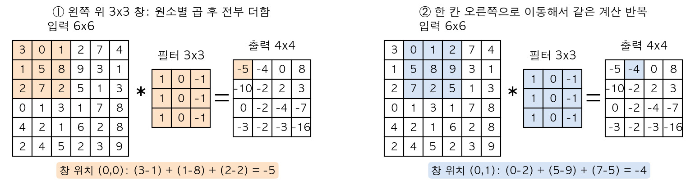

위 그림은 강의 첫 예제 숫자 그대로다. 왼쪽: 주황색 $3\times3$ 창과 필터를 원소별 곱하면 필터의 가운데 열은 0이라 사라지고, 결국 **(왼쪽 열 합) − (오른쪽 열 합)** = $(3+1+2) - (1+8+2) = -5$가 된다. 오른쪽: 창을 한 칸 옮기면 $(0+5+7) - (2+9+5) = -4$. 즉 이 필터는 "왼쪽이 오른쪽보다 얼마나 밝은가"를 재는 장치다.

(이걸 "convolution"이라 부르지만 신호처리 정의상으로는 **cross-correlation**이다 — 수학적 convolution은 필터를 상하좌우로 뒤집은(flip) 뒤 곱하는데, 딥러닝에서는 flip을 생략한다. 필터를 어차피 학습하니까 뒤집든 말든 결과가 같아서 관례상 convolution이라 부른다. 강의에서도 이 점을 짚고 넘어간다.)

**왜 이게 edge를 찾나 — 숫자로**: 왼쪽 절반이 밝고(10) 오른쪽 절반이 어두운(0) 이미지를 넣어보자.

- 창이 전부 밝은 영역(10) 위에 있으면: $(10+10+10) - (10+10+10) = 0$
- 창이 전부 어두운 영역(0) 위에 있으면: $0 - 0 = 0$
- 창이 경계에 걸쳐 왼쪽 열은 10, 오른쪽 열은 0이면: $30 - 0 = 30$

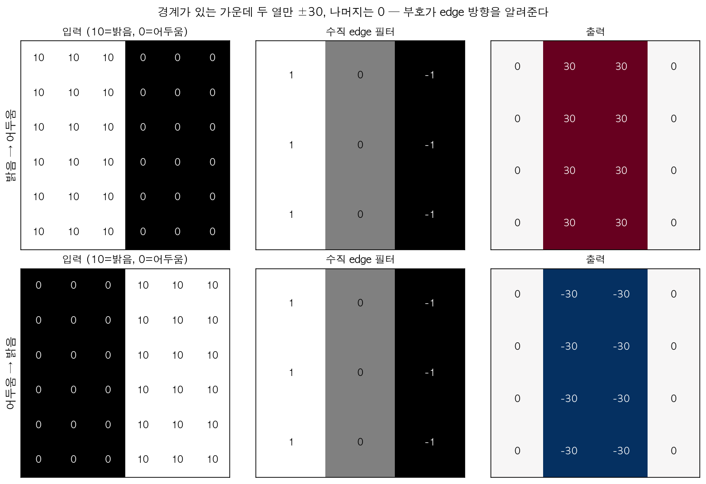

그림 윗줄: 결과가 `[0, 30, 30, 0]` — 가운데 두 열(경계가 있는 곳)만 30이고 나머지는 0이다. "30이 나온 곳 = edge"다. (출력 4칸 중 2칸이나 30이라 edge가 두껍게 보이는 건 이미지가 $6\times6$으로 너무 작아서고, 1000x1000 이미지라면 얇은 선으로 보인다.) 아랫줄: 밝기 방향을 뒤집으면(어두움→밝음) −30이 나온다. **부호가 edge의 방향(밝→어 vs 어→밝)까지 알려준다** — 방향이 상관없으면 절댓값을 쓰면 된다. (→ Lab 1에서 이 결과를 직접 재현)

- 수직 필터를 90도 돌리면(전치하면) 수평(horizontal) edge detector가 된다: 윗행 $1,1,1$ / 가운데 $0,0,0$ / 아랫행 $-1,-1,-1$. "위가 아래보다 얼마나 밝은가"를 잰다.
- $1,0,-1$ 대신 Sobel filter($1,0,-1 / 2,0,-2 / 1,0,-1$), Scharr filter($3,0,-3 / 10,0,-10 / 3,0,-3$) 같은 손으로 짠(hand-engineered) 필터들도 있다 — 기본형과 마찬가지로 열(column) 방향이 $+,0,-$ 패턴이라 여전히 수직 edge를 찾는 필터인데, 가운데 행에 더 큰 가중치를 줘서 노이즈에 좀 더 강건하게 만든 버전이다.
- 근데 핵심은: 이 9개 숫자를 사람이 정하지 않고, **학습으로 알아서 찾게** 하면 어떨까? 그게 CNN의 핵심 아이디어다. filter의 각 원소가 곧 학습 파라미터 $w_1, \dots, w_9$가 된다. 그러면 backprop이 45도 대각선 edge든, 사람이 생각 못 한 패턴이든 데이터에 맞는 필터를 알아서 만든다.

### Padding

**문제 두 가지**:
1. **이미지가 계속 작아진다**: $n\times n$에 $f\times f$ 필터를 쓰면 출력은 $(n-f+1)\times(n-f+1)$. (여기서 $n$ = 입력 한 변의 픽셀 수, $f$ = 필터 한 변의 길이. 필터 왼쪽 끝이 놓일 수 있는 위치가 $0$부터 $n-f$까지라서 $n-f+1$개.) $6\times6 \to 4\times4$처럼 매 layer마다 줄어서, 100층쯤 쌓으면 이미지가 $1\times1$이 되어 버린다.
2. **모서리 정보 손실**: 코너 픽셀은 필터가 딱 한 위치에서만 "밟고" 지나가지만, 가운데 픽셀은 9개 위치에서 계산에 참여한다. 가장자리 정보가 상대적으로 무시된다.

**padding이란**: 이미지 바깥에 테두리를 덧대서(pad = 덧대는 충전재) 크기를 키워놓고 convolution하는 것.

**해결**: 이미지 가장자리에 0을 한 겹(또는 여러 겹) 둘러준다(zero-padding). 두른 폭을 $p$라 한다(한쪽 변 기준 몇 겹인지. 위/아래, 왼쪽/오른쪽 양쪽에 붙으니까 한 변 길이는 $2p$ 늘어난다). $p=1$이면 $6\times6$이 $8\times8$이 되고, 여기에 $3\times3$ 필터를 쓰면 출력이 $8-3+1 = 6$, 즉 원래 크기 $6\times6$이 유지된다. 모서리 픽셀도 이제 여러 창에 참여한다.

- **Valid convolution**: padding 없음($p=0$). $n\times n$ 이미지에 $f\times f$필터 → $(n-f+1)\times(n-f+1)$.
- **Same convolution**: 출력 크기가 입력과 같도록 padding. $n+2p-f+1=n$ 을 풀면 $p=\dfrac{f-1}{2}$. ($f=3 \Rightarrow p=1$, $f=5 \Rightarrow p=2$.) 그래서 필터 크기 $f$는 관습적으로 홀수를 쓴다(1,3,5,7...) — 짝수면 $p$가 정수가 안 돼서 padding이 비대칭이 되고, 홀수면 필터에 "중심 픽셀"이 딱 하나 생겨서 위치를 말하기 편하다.

이름 뜻: **valid** = 필터가 이미지 안에 완전히 들어가는 "유효한(valid)" 위치에서만 계산, **same** = 출력 크기가 입력과 "같게(same)". (same 식 $n+2p-f+1=n$은 "padding 후 출력 크기 = 원래 입력 크기"를 그대로 쓴 것.)

**하이퍼파라미터 정리 ($f$, $p$)** — 둘 다 gradient descent로 학습되는 값이 아니라 사람이 고르는 값이다.

| 하이퍼파라미터 | 뜻 | 보통 값 | 너무 크면 | 너무 작으면 |
|---|---|---|---|---|
| $f$ (filter size) | 필터 한 변 길이 | 3 (가끔 1, 5, 7; AlexNet 첫 층은 11) | 한 번에 넓은 영역을 보지만 파라미터·곱셈 수가 $f^2$에 비례해 늘어남 | 싸지만 한 층이 보는 범위가 좁음 → 그래서 3x3을 여러 층 쌓는 게 VGG 이후 표준 |
| $p$ (padding) | 테두리 0 두께 | 숫자보다 "valid"($p=0$) / "same"($p=(f-1)/2$) 중 고름 (Keras `padding="valid"` / `"same"`) | 0뿐인 영역까지 계산해서 낭비, 가장자리 출력이 의미 없는 값이 됨 | ($p=0$) 층마다 $f-1$씩 줄고 모서리 정보가 덜 반영됨 |

### Stride

필터를 한 칸씩이 아니라 $s$칸씩 건너뛰며 슬라이딩하는 것. 가로로 $s$칸씩 가고, 줄을 바꿀 때도 $s$칸 내려간다. stride를 키우면 계산하는 위치 수가 줄어서 출력이 그만큼(대략 $1/s$배) 작아진다. "출력을 의도적으로 줄이고 싶을 때" 쓰는 도구다. (이름 stride = "성큼성큼 걷는 보폭".)

- $s$도 학습되지 않는 하이퍼파라미터. 보통 $s=1$(크기 유지, 모든 위치 계산) 또는 $s=2$(가로세로 절반으로 축소)를 쓴다.
- 너무 크면(특히 $s>f$) 필터가 아예 밟지 않고 건너뛰는 픽셀이 생겨서 정보가 버려진다. $s=1$이면 정보 손실은 없지만 출력이 크고 연산이 많다.

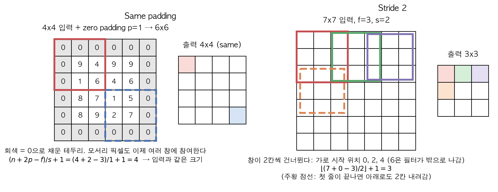

왼쪽: $4\times4$ 입력에 회색 0 테두리($p=1$)를 두르면 $3\times3$ 창이 모서리(빨강)부터 반대편 모서리(파랑 점선)까지 가로세로 4곳에 놓일 수 있어 출력도 $4\times4$. 오른쪽: $7\times7$에서 stride 2면 창의 시작 위치가 0, 2, 4(색깔별 테두리)뿐이다 — 6에서 시작하면 필터가 이미지 밖으로 나간다. 그래서 출력 $3\times3$.

### 출력 크기 공식 (꼭 외우기)

$n \times n$ 입력, $f \times f$ 필터, padding $p$, stride $s$ 일 때 출력 크기는

$$\left\lfloor \frac{n+2p-f}{s}+1 \right\rfloor \times \left\lfloor \frac{n+2p-f}{s}+1 \right\rfloor$$

| 기호 | 의미 |
|---|---|
| $n$ | 입력 한 변의 길이 |
| $p$ | padding 폭 (양쪽에 붙으니까 $2p$) |
| $f$ | 필터 한 변의 길이 |
| $s$ | stride (한 번에 건너뛰는 칸 수) |
| $\lfloor\cdot\rfloor$ | floor, 내림 (예: $\lfloor 2.5 \rfloor = 2$) |
| 결과 값 | 출력 한 변의 길이. 입력이 정사각형이 아니면($n_H \ne n_W$) 세로·가로에 따로 적용한다 |

**유도**: padding을 붙인 뒤 입력 길이는 $n+2p$. 필터의 왼쪽 끝이 놓일 수 있는 위치는 $0$부터 $n+2p-f$까지다(그보다 오른쪽이면 필터가 밖으로 삐져나감). 이 구간을 $s$칸 간격으로 밟으면 $0, s, 2s, \dots$ 이므로 밟는 횟수는 $\lfloor (n+2p-f)/s \rfloor + 1$ (시작점 0 포함해서 +1).

나눗셈이 딱 안 떨어지면 **floor**(내림) 처리한다 — 필터가 이미지 밖으로 완전히 못 나가면 그 위치는 그냥 계산 안 한다는 뜻. 예:

| 입력 $n$ | $f$ | $p$ | $s$ | 계산 | 출력 |
|---|---|---|---|---|---|
| 6 | 3 | 0 | 1 | $(6-3)/1+1$ | 4 |
| 6 | 3 | 1 | 1 | $(6+2-3)/1+1$ | 6 (same) |
| 7 | 3 | 0 | 2 | $(7-3)/2+1$ | 3 |
| 7 | 3 | 1 | 2 | $(7+2-3)/2+1$ | 4 |
| 8 | 3 | 0 | 2 | $\lfloor 5/2 \rfloor+1 = 2+1$ | 3 (floor 발생) |

(→ Lab 1 `conv_forward`에서 이 공식으로 `n_H`, `n_W`를 계산하고, pad/stride 조합별 shape을 확인한다.)

### 3D(볼륨) convolution — 컬러 이미지, 여러 필터

**문제**: 지금까지는 흑백($n\times n$)이었는데, 컬러 이미지는 채널이 3개(RGB)라서 $n\times n\times n_c$ 형태다($n_c$ = number of channels = depth). 필터는 어떻게 생겨야 할까?

**규칙**: 필터도 $f\times f\times n_c$ 로 **채널 수를 입력에 맞춘다**. 즉 $6\times6\times3$ 이미지에 $3\times3\times3$ 필터(정육면체 모양 숫자 27개)를 convolve하면, 필터를 올려놓은 위치에서 겹치는 27개 숫자를 다 곱해서 더한 **스칼라 하나**가 나온다. 필터는 가로세로로만 움직이고 채널 방향으로는 안 움직인다(깊이가 딱 맞으니까). 결과는 $4\times4\times1$ — 채널 차원이 없어진다(정확히는 1로 줄어든다).

- 예: 빨간색 채널의 수직 edge만 찾고 싶으면, 필터의 R층은 $1,0,-1$ 패턴, G층/B층은 전부 0으로 두면 된다. 색 상관없이 수직 edge를 찾고 싶으면 세 층 모두 $1,0,-1$ 패턴을 넣으면 된다. 이렇게 채널별 숫자를 다르게 둘 수 있다는 게 3D 필터의 표현력이다.

여기서 필터를 여러 개(예: 수직 edge용 1개 + 수평 edge용 1개, 총 2개) 쓰면, 각 필터의 결과($4\times4$ 한 장씩)를 쌓아서 $4\times4\times2$가 된다. 즉:

> **다음 층의 채널 수 = 이번 층에서 쓴 필터의 개수**

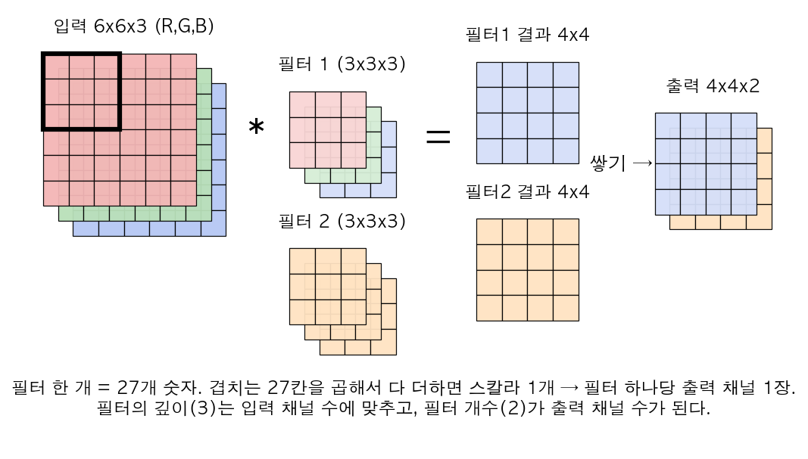

그림에서 필터마다 결과 한 장이 나오고, 그 장들을 쌓은 게 다음 층의 입력 볼륨이다. 공식으로 쓰면 $n\times n\times n_c \ * \ f\times f\times n_c$ (필터 $n_c'$개) $\to (n-f+1)\times(n-f+1)\times n_c'$ ($p=0, s=1$일 때).

| 기호 | 의미 |
|---|---|
| $n$ | 입력의 가로·세로 길이 (예: 6) |
| $n_c$ | 입력 채널 수 = 필터의 깊이 (예: RGB면 3). 둘이 반드시 같아야 한다 |
| $f$ | 필터 가로·세로 길이 (예: 3) |
| $n_c'$ | 쓰는 필터의 개수 = 출력 채널 수 (예: 2). 프라임($'$)은 "다음 볼륨의 채널 수"라는 표시 |
| $*$ | convolution 연산 (곱셈 아님) |

$n_c'$(필터 개수)도 사람이 고르는 하이퍼파라미터다. 각 필터가 feature 하나(수직 edge, 특정 색 등)를 담당하므로, 많을수록 더 다양한 패턴을 잡지만 파라미터·연산량이 비례해서 늘고(overfitting 위험도 증가), 너무 적으면 필요한 패턴을 다 못 담는다. 보통 16, 32, 64, … 512처럼 2의 거듭제곱으로, 깊은 layer로 갈수록 늘린다.

이게 CNN에서 채널 수가 점점 늘어나는 이유다(반대로 $n_H, n_W$는 점점 줄어든다). 앞 layer의 각 채널은 "edge 지도", "색 지도" 같은 것이고, 다음 layer의 필터는 이 지도 여러 장을 동시에 보면서 "수직 edge와 빨간색이 같이 있는 곳" 같은 조합 패턴을 찾는다.

### 한 Conv Layer의 표기법 (layer $l$)

**conv layer 한 층의 완전한 계산**: 필터 convolve → 필터마다 bias(실수 하나) 더하기 → ReLU 같은 비선형 함수 적용. 이건 Course 1의 $z = Wa + b,\ a = g(z)$와 **완전히 같은 구조**이고, 필터 숫자들이 $W$ 역할, 필터마다의 bias가 $b$ 역할을 할 뿐이다.

예: $6\times6\times3$ 입력, $3\times3\times3$ 필터 2개. 필터1 결과($4\times4$)에 $b_1$을 더하고 ReLU, 필터2 결과에 $b_2$를 더하고 ReLU → 쌓아서 $4\times4\times2$ = 이 layer의 activation $a^{[1]}$.

강의 표기 그대로 정리. 먼저 위첨자 읽는 법: $[l]$ = "layer $l$에 속한 값", $[l-1]$ = 바로 앞 layer의 값(= 이번 layer의 **입력**). 그래서 입력 shape엔 $[l-1]$, 출력·필터 개수엔 $[l]$이 붙는다. 아래에서 $f, p, s, n_c$는 사람이 정하는 하이퍼파라미터이고, 학습되는 건 필터 숫자(weight $W^{[l]}$)와 bias $b^{[l]}$뿐이다.

- $f^{[l]}$ = filter size
- $p^{[l]}$ = padding
- $s^{[l]}$ = stride
- $n_c^{[l]}$ = 이번 layer에서 쓰는 필터 개수(=출력 채널 수)
- 입력: $n_H^{[l-1]} \times n_W^{[l-1]} \times n_c^{[l-1]}$ ($H$=height, $W$=width. 정사각형이 아닐 수도 있어서 따로 씀)
- 필터 한 개의 크기: $f^{[l]} \times f^{[l]} \times n_c^{[l-1]}$ (입력 채널 수와 항상 일치해야 함)
- 출력: $n_H^{[l]} \times n_W^{[l]} \times n_c^{[l]}$, 여기서 $n_H^{[l]} = \left\lfloor \dfrac{n_H^{[l-1]}+2p^{[l]}-f^{[l]}}{s^{[l]}}+1 \right\rfloor$ ($n_W$도 동일한 식)
- weight 개수: 필터 1개당 $f^{[l]}\times f^{[l]}\times n_c^{[l-1]}$ 개, 필터가 $n_c^{[l]}$개니까 총 $f^{[l]}\times f^{[l]}\times n_c^{[l-1]}\times n_c^{[l]}$ (코드에서 W의 shape이 `(f, f, n_c_prev, n_c)`인 이유)
- bias 개수: 필터당 1개 → $n_c^{[l]}$개
- **파라미터 총합** = $(f^{[l]}\times f^{[l]}\times n_c^{[l-1]}+1)\times n_c^{[l]}$ (괄호 안의 $+1$이 필터 하나의 bias)
- activation: $a^{[l]} = g(z^{[l]})$, 여기서 $z^{[l]}$ = (convolution 결과 + bias), $g$ = 비선형 activation 함수(보통 ReLU)

**숫자 예 (강의 퀴즈)**: $3\times3\times3$ 필터 10개짜리 layer의 파라미터 수는? 필터 하나에 $27$개 weight + bias 1개 = 28, 필터가 10개니까 **280개**. 중요한 건 이 숫자가 **입력 이미지 크기와 무관**하다는 점이다 — 입력이 $64\times64$든 $1000\times1000$이든 280개 그대로. FC와 결정적으로 다른 부분이고, 이게 CNN이 overfitting에 덜 취약한 이유다.

이미지 개수(batch size) $m$을 포함하면 activation 텐서 shape는 $m \times n_H^{[l]} \times n_W^{[l]} \times n_c^{[l]}$ (TensorFlow 기본 convention, "channels last").

### 간단한 CNN 예시로 차원 추적 연습

$39\times39\times3$ 입력을 예로 손으로 따라가보자(padding은 전부 0).

| Layer | $f$ | $s$ | $n_c$(필터 개수) | 출력 크기 계산 | 출력 shape |
|---|---|---|---|---|---|
| Input | - | - | - | - | $39\times39\times3$ |
| Layer1 (CONV) | 3 | 1 | 10 | $(39-3)/1+1=37$ | $37\times37\times10$ |
| Layer2 (CONV) | 5 | 2 | 20 | $(37-5)/2+1=17$ | $17\times17\times20$ |
| Layer3 (CONV) | 5 | 2 | 40 | $(17-5)/2+1=7$ | $7\times7\times40$ |
| Flatten | - | - | - | $7\times7\times40$ | $1960$ |

이렇게 쭉 따라가다가 마지막엔 flatten(펼쳐서 벡터 하나로)해서 logistic/softmax unit에 넣는다. 전형적인 흐름: **공간 크기($n_H, n_W$)는 줄고 채널($n_c$)은 늘어난다.** 이게 습관이 되어야 함 — 새 아키텍처를 볼 때마다 층마다 shape을 손으로 계산해보는 것.

전형적인 ConvNet에는 세 종류 layer가 있다: **CONV**(convolution), **POOL**(pooling, 바로 다음 절), **FC**(fully connected). 

### Pooling — 학습 파라미터가 없는 층

**pooling이란**: 입력을 작은 영역들로 나누고, 영역마다 값들을 "모아서(pool)" 대표값 하나(최댓값 또는 평균)로 요약하는 연산. 필터 곱셈이 없다.

**문제**: conv layer만으로도 stride로 크기를 줄일 수 있지만, "크기를 줄이면서 중요한 특징은 남기는" 더 싸고 단순한 연산이 있으면 좋겠다.

- **Max pooling**: 입력을 $f\times f$ 영역으로 나누고(stride $s$), 각 영역에서 가장 큰 값만 남긴다. 직관: 어떤 채널이 "고양이 눈 detector"라면 큰 값 = 그 영역 어딘가에 눈이 있다는 뜻. 정확히 어느 픽셀인지보다 "이 영역 어딘가에 그 feature가 있었는지"만 살아남으면 되니까 max를 쓴다. (Ng도 "실험적으로 잘 되기 때문"이 가장 큰 이유라고 솔직하게 말한다.)
- **Average pooling**: 영역 평균. 최근엔 아주 깊은 네트워크 마지막에 (7x7x1000 같은 걸 1x1x1000으로 줄일 때) 가끔 쓰이는 정도.
- 보통 $f=2, s=2$를 많이 써서 $n_H, n_W$를 절반으로 줄인다. 출력 크기는 conv와 같은 공식 $\lfloor (n+2p-f)/s \rfloor + 1$ (pooling은 보통 $p=0$). 여기서 $f$ = pooling 창 한 변 길이, $s$ = 창을 옮기는 칸 수 — 기호는 conv와 같지만 "필터 숫자"가 없는 빈 창이다. $f=3, s=2$(AlexNet, 창이 살짝 겹침)도 쓴다. $f$를 너무 크게 잡으면 한 번에 너무 많이 줄여서 위치 정보가 급하게 사라지고, pooling을 아예 안 쓰면 크기를 줄이는 일을 stride conv가 다 떠맡아야 한다.

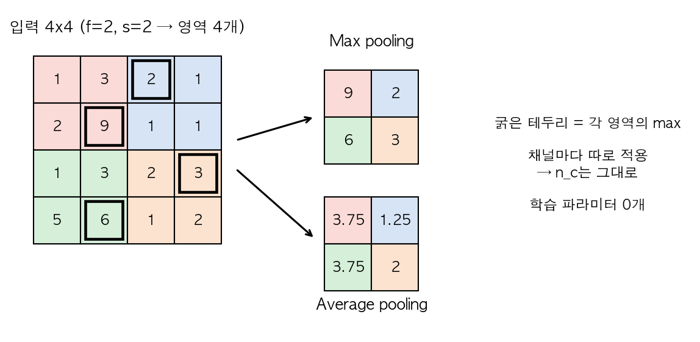

그림: 4x4를 색깔별 2x2 영역 4개로 나눈다. max pooling은 각 영역의 최댓값(굵은 테두리) → `[[9, 2], [6, 3]]`. average pooling은 평균 → 예를 들어 빨간 영역 $(1+3+2+9)/4 = 3.75$ → `[[3.75, 1.25], [3.75, 2]]`. (→ Lab 2에서 이 숫자 그대로 확인)

- **핵심**: pooling은 학습되는 파라미터가 0개다. 하이퍼파라미터 $f, s$와 max/average 선택만 있고, gradient descent로 배울 게 없는 고정된 연산이다. 그래서 파라미터 개수 표에서 pooling layer 줄은 항상 0.
- 채널마다 독립적으로 적용되므로 $n_c$는 pooling 전후로 안 바뀐다. ($5\times5\times2 \to$ $f=3, s=1$ max pool $\to 3\times3\times2$)

### LeNet-5 스타일 예시 — activation shape/size/파라미터 표

**흐름**: `CONV → POOL → CONV → POOL → FC → FC → softmax`. 관례상 "conv + 그 뒤 pool"을 묶어서 한 layer로 센다(pool은 파라미터가 없어서). 

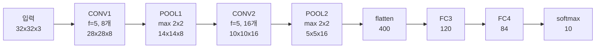

$32\times32\times3$ 입력 기준으로 강의에서 쓰는 표 형태를 재현하면:

| Layer | Activation shape | Activation size | # parameters |
|---|---|---|---|
| Input | $(32,32,3)$ | 3,072 | 0 |
| CONV1 ($f=5,s=1$, 필터 8개) | $(28,28,8)$ | 6,272 | $(5\times5\times3+1)\times8=608$ |
| POOL1 ($f=2,s=2$) | $(14,14,8)$ | 1,568 | 0 |
| CONV2 ($f=5,s=1$, 필터 16개) | $(10,10,16)$ | 1,600 | $(5\times5\times8+1)\times16=3216$ |
| POOL2 ($f=2,s=2$) | $(5,5,16)$ | 400 | 0 |
| FC3 (unit 120) | $(120,1)$ | 120 | $400\times120+120=48120$ |
| FC4 (unit 84) | $(84,1)$ | 84 | $120\times84+84=10164$ |
| Softmax (10 class) | $(10,1)$ | 10 | $84\times10+10=850$ |

**계산 따라가기**: CONV1은 $(32-5)/1+1 = 28$, 필터 하나가 $5\times5\times3 = 75$개 숫자 + bias 1 = 76, 필터 8개라 608. POOL1은 $(28-2)/2+1 = 14$. CONV2 필터는 입력 채널이 8이니까 $5\times5\times8 = 200$ + 1 = 201, 16개라 3216. FC3는 입력 400개 × 출력 120개 weight + bias 120.

관찰 포인트: 층이 깊어질수록 activation size는 대체로 서서히 줄어들고(너무 급격히 줄면 정보 손실이 큼), 파라미터 개수는 **conv layer보다 FC layer에 훨씬 많이 몰려있다.** conv 자체는 파라미터가 의외로 적다는 게 포인트. (→ Lab 2의 `summarize`가 이 표를 자동으로 뽑는다. Lab은 원조 LeNet처럼 CONV1 필터 6개로 해서 456/2416/48120/10164/850, 총 62,006개가 나온다 — 필터 개수만 다르고 계산법은 같다.)

### 왜 Convolution인가 (FC 대비 두 가지 장점)

먼저 숫자로 비교: $32\times32\times3$ (3,072개) → $28\times28\times6$ (4,704개)를 만드는 layer.

- conv ($5\times5$ 필터 6개): $(5\times5\times3+1)\times6 = 456$개
- FC (모든 입력 × 모든 출력): $3{,}072 \times 4{,}704 \approx 1{,}445$만 개

**약 3만 배 차이**. 이 차이가 어디서 오나:

1. **Parameter sharing**: 이미지 왼쪽 위 모서리에서 유용한 필터(예: 수직 edge detector)는 오른쪽 아래에서도 똑같이 유용하다. 그래서 같은 필터(=같은 weight 세트)를 이미지 전체 위치에 재사용한다. FC라면 위치마다 다른 weight를 새로 배워야 하는데, conv는 "한 번 배운 필터"를 이미지 전체에 그대로 슬라이딩만 시킨다.
2. **Sparsity of connections**: 출력의 각 값은 입력의 아주 일부(필터 크기만큼, 위 예에선 75개)에만 의존한다. 예를 들어 출력의 왼쪽 위 픽셀은 입력 오른쪽 아래 픽셀과 아무 관계가 없다. FC라면 모든 출력이 모든 입력(3,072개)과 연결되는 것과 대조적이다.

이 두 가지 덕분에 파라미터 수가 확 줄어서 (1) 학습 데이터가 적어도 overfitting이 덜 되고 (2) translation invariance(이미지가 몇 픽셀 이동해도 같은 특징을 잡아냄)를 자연스럽게 얻는다 — 고양이가 몇 픽셀 오른쪽으로 옮겨가도 같은 필터가 옮겨간 위치에서 같은 반응을 하니까.

**학습은 어떻게?**: 다른 신경망과 똑같다. 모든 conv 필터와 FC의 weight/bias를 파라미터로 두고, cost $J = \frac{1}{m}\sum \mathcal{L}(\hat y^{(i)}, y^{(i)})$를 gradient descent(또는 Adam 등)로 줄인다. (여기서 $m$ = 학습 샘플 수, 위첨자 $(i)$ = $i$번째 샘플, $\hat y^{(i)}$ = 네트워크의 예측, $y^{(i)}$ = 정답 레이블, $\mathcal{L}$ = 샘플 하나의 loss — 분류면 보통 softmax cross-entropy. $J$는 그 평균.) conv layer의 backprop은 프레임워크가 알아서 해준다.

---

## Week2: 유명 아키텍처들

**왜 남의 아키텍처를 공부하나**: 코딩을 배울 때 남의 코드를 읽는 게 도움이 되듯, 잘 작동하는 네트워크 구조를 보면 "필터 크기/개수, pooling 위치를 이런 식으로 짜면 되는구나"라는 감이 생긴다. 그리고 한 태스크(ImageNet 분류)에서 잘 된 구조는 다른 태스크에도 잘 되는 경우가 많다.

### Classic Networks

- **LeNet-5** (1998): 손글씨 숫자 인식용($32\times32\times1$ 흑백 입력). 위 표처럼 conv-pool을 반복하다가 FC로 마무리. 당시엔 ReLU가 없어서 sigmoid/tanh를 썼고, pooling은 average pooling, 파라미터 약 6만 개로 지금 기준으로는 작은 네트워크. "$n_H, n_W$는 줄고 $n_c$는 늘고, conv-pool 반복 후 FC" 패턴이 여기서 확립됐다.
- **AlexNet** (2012): LeNet과 구조는 비슷한 철학이지만 훨씬 크다(파라미터 6천만 개 수준). ReLU를 쓰고, 딥러닝이 이미지 분야에서 폭발적으로 뜨는 계기가 된 논문. Local Response Normalization(LRN)을 썼는데 요즘은 잘 안 씀. 차원 흐름을 보면 $227\times227\times3 \xrightarrow{11\times11,\ s=4,\ 96개} 55\times55\times96 \xrightarrow{\text{max }3\times3,\ s=2} 27\times27\times96 \to \cdots \to 6\times6\times256 = 9216 \to$ FC 4096 → FC 4096 → softmax 1000. (확인: $(227-11)/4+1 = 55$, $(55-3)/2+1 = 27$.)
- **VGG-16**: "16"은 학습 가능한 layer 수(conv 13 + FC 3). 특징이 아주 단순 — conv는 전부 $3\times3, s=1,$ same padding, pool은 전부 $2\times2, s=2$ max pooling. 필터 개수가 64→128→256→512로 매 블록마다 정확히 2배씩 늘어나고, pool마다 가로세로가 절반($224 \to 112 \to 56 \to 28 \to 14 \to 7$)이 된다. 구조가 규칙적이라 이해하기 쉽지만 파라미터가 약 1억 3800만 개(계산해보면 138,357,544개)로 매우 큼.

```mermaid
flowchart LR
    A["224x224x3"] -->|"conv64 x2"| B["224x224x64"]
    B -->|pool| C["112x112x64"]
    C -->|"conv128 x2"| D["112x112x128"]
    D -->|pool| E["56x56x128"]
    E -->|"conv256 x3"| F["56x56x256"]
    F -->|pool| G["28x28x256"]
    G -->|"conv512 x3"| H["28x28x512"]
    H -->|pool| I["14x14x512"]
    I -->|"conv512 x3"| J["14x14x512"]
    J -->|pool| K["7x7x512"]
    K --> L["FC4096 → FC4096 → softmax1000"]
```

### ResNet — Residual Network

**문제**: 이론적으로는 layer를 계속 쌓으면 training error가 계속 줄어들어야 한다(더 깊은 네트워크는 얕은 네트워크를 흉내 낼 수 있으니까 — 추가 layer가 그냥 입력을 그대로 통과시키면 됨). 근데 실제로는 아주 깊은 plain network(residual 없는 network)는 어느 순간부터 training error가 오히려 다시 올라간다. 원인은 Course 2에서 본 vanishing/exploding gradient — 신호와 gradient가 층을 지날 때마다 곱해지면서 0으로 사라지거나 폭발해서, 그리고 "그냥 입력을 그대로 통과시키기(identity)"조차 weight를 정교하게 맞춰야 해서 배우기 어렵다. ResNet은 이걸 해결한다.

**Residual block**: 원래 forward propagation("main path")은

$$z^{[l+1]} = W^{[l+1]}a^{[l]}+b^{[l+1]}, \quad a^{[l+1]} = g(z^{[l+1]})$$
$$z^{[l+2]} = W^{[l+2]}a^{[l+1]}+b^{[l+2]}, \quad a^{[l+2]} = g(z^{[l+2]})$$

| 기호 | 의미 |
|---|---|
| $a^{[l]}$ | layer $l$의 activation(출력). 이 block의 입력 |
| $z^{[l+1]}, z^{[l+2]}$ | activation 함수 적용 **전**의 선형 결과 (conv라면 convolution + bias) |
| $W^{[l+1]}, b^{[l+1]}$ | layer $l+1$의 weight와 bias (학습됨) |
| $g$ | activation 함수, ResNet에서는 ReLU: $g(z)=\max(0,z)$ |
| $[l+1], [l+2]$ | block 안에서 한 칸, 두 칸 뒤의 layer |

인데, residual block은 $a^{[l]}$을 **두 layer 건너뛰어서** 더해준다("skip connection" 또는 "shortcut"). 더하는 위치는 두 번째 ReLU **전**이다:

$$a^{[l+2]} = g\left(z^{[l+2]} + a^{[l]}\right)$$

(이름 뜻: **skip connection** = 중간 layer를 "건너뛰는(skip)" 연결, **shortcut** = "지름길". 새로 생긴 건 $+\,a^{[l]}$ 항 하나뿐이고, 여기엔 학습 파라미터가 없다 — 그냥 복사해서 더한다.)

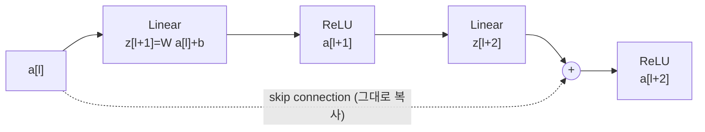

이런 block을 계속 쌓은 게 ResNet(예: ResNet-50, ResNet-101, ResNet-152). 이름의 "residual(잔차)"은, block이 출력 전체를 새로 만드는 게 아니라 입력 $a^{[l]}$에 **더할 보정량** $z^{[l+2]}$만 배운다는 뜻이다.

**왜 작동하나 (identity 논증)**: 식을 풀어 쓰면

$$a^{[l+2]} = g\left(W^{[l+2]}a^{[l+1]} + b^{[l+2]} + a^{[l]}\right)$$

$W^{[l+2]}, b^{[l+2]}$가 학습을 통해 0에 가깝게 수렴한다고 해보자(L2 regularization/weight decay가 weight를 0 쪽으로 당기니까 흔한 일이다). 그러면 $a^{[l+2]} = g(a^{[l]})$. 그리고 $a^{[l]}$은 이전 ReLU의 출력이라 $\ge 0$이므로 $g(a^{[l]}) = \text{ReLU}(a^{[l]}) = a^{[l]}$. 즉 **block이 아무것도 안 배워도 입력을 그대로 내보낸다 — identity function을 배우는 게 공짜다.**

그래서 최소한 "이 block을 추가해도 성능이 나빠지지는 않는다"가 보장되고, 운이 좋으면 추가 block이 뭔가 더 유용한 걸 배워서 성능이 더 좋아진다. plain network는 layer를 추가하면 identity조차 배우기 어려워서(weight를 아주 정교하게 맞춰야 함) 깊어질수록 오히려 손해를 볼 수 있다. gradient 관점에서도 skip connection은 "덧셈"이라 gradient가 곱해지지 않고 그대로 앞쪽으로 전달되는 고속도로 역할을 한다.

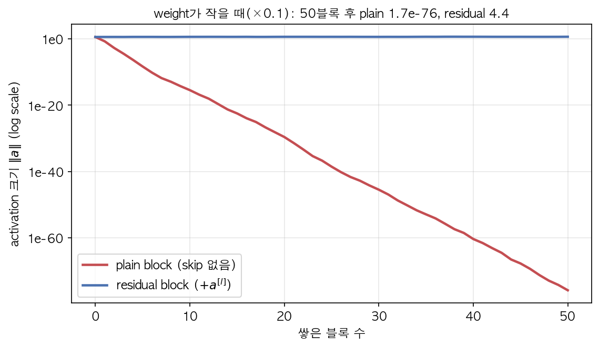

그림은 Lab 3과 같은 설정(작은 weight ×0.1로 8차원 block을 쌓음)이다. plain은 block을 지날 때마다 신호가 약 1/30씩 쪼그라들어 50개 뒤엔 $10^{-76}$ — 사실상 0이 되어 뒤쪽 layer는 아무 정보도 못 받는다. residual은 skip connection이 원래 신호를 계속 실어 나르니까 크기가 거의 그대로(≈4.4)다. (→ Lab 3)

*주의*: $z^{[l+2]}+a^{[l]}$를 더하려면 두 텐서의 차원이 같아야 한다. 그래서 ResNet 안에서는 same-padding conv를 많이 써서 차원을 유지하고, 차원이 다를 수밖에 없는 지점(예: 채널 수가 바뀌는 지점)에는 $a^{[l]}$에 $W_s$라는 별도의 행렬을 곱해서 차원을 맞춰준다: $a^{[l+2]} = g(z^{[l+2]} + W_s a^{[l]})$. 예를 들어 $a^{[l]}$이 128차원, $z^{[l+2]}$가 256차원이면 $W_s$는 $256\times128$. $W_s$는 학습되거나, 그냥 zero-padding으로 채널만 맞추는 고정된 방식일 수도 있다. (프로그래밍 과제에서는 차원이 같은 block을 "identity block", shortcut에 conv를 넣어 차원을 맞추는 block을 "convolutional block"이라 부른다.)

### 1x1 Convolution (Network in Network)

**처음 보면 이상한 점**: $1\times1$ 필터는 숫자 하나를 곱하는 거니까 의미가 없어 보인다. 실제로 채널이 1개인 $6\times6$ 이미지에 $1\times1$ 필터 `[2]`를 쓰면 그냥 모든 픽셀에 2를 곱한 것뿐이다.

**채널이 많으면 얘기가 달라진다**: $6\times6\times32$ 볼륨에 $1\times1\times32$ 필터를 쓰면, 각 위치(픽셀)에서 **32개 채널 값과 필터의 32개 숫자를 곱해서 더한 뒤 ReLU**를 적용한다. 이건 정확히 "입력 32개짜리 뉴런 하나"다. 필터를 $n_c'$개 쓰면 각 픽셀마다 32 → $n_c'$ 짜리 작은 FC layer를 통과시키는 것과 같다.

즉 $1\times1$ 필터가 $n_H\times n_W\times n_c$ 짜리 볼륨을 볼 때, 공간적으로는 아무것도 안 섞고(한 픽셀만 보니까) **채널 방향으로만** FC layer 하나를 통과시키는 것과 같다(모든 픽셀에 같은 FC를 공유). 그래서 두 가지 용도로 쓴다.

(이름 뜻: **Network in Network** = 픽셀마다 작은 FC 네트워크를 하나씩 통과시키는 셈이라 "네트워크 안의 네트워크". **bottleneck**은 병의 목처럼 중간을 좁게 만드는 구간을 말한다.)

1. **채널 수 줄이기(bottleneck)**: $28\times28\times192$ 를 $1\times1, s=1$ 필터 32개로 convolve하면 $28\times28\times32$가 된다 — 공간 크기는 그대로, 채널만 확 줄인다. (공간 크기를 줄이는 건 pooling, 채널을 줄이는 건 1x1 conv라고 짝지어 기억하면 좋다.) 뒤에 오는 비싼 연산(예: $5\times5$ conv)의 계산량을 크게 줄여준다(아래 Inception에서 숫자로 확인).
2. 채널 수를 유지하거나 늘리는 데도 쓸 수 있다 — 결국 "채널 차원의 비선형 조합"을 배우는 매우 저렴한 layer. 채널 수를 그대로 두더라도 ReLU가 붙으니까 비선형성이 한 번 더 추가된다.

### Inception Network

**동기**: conv layer 설계할 때 filter size($1\times1$? $3\times3$? $5\times5$?)나 pooling을 넣을지 매번 골라야 하는데, Inception은 "다 해보고 결과를 이어붙이자(concatenate)"는 아이디어다. 한 Inception module 안에서 $1\times1, 3\times3, 5\times5$ conv와 max pooling을 **병렬로** 다 계산해서 채널 방향으로 쌓는다. 어떤 필터 조합이 유용한지는 네트워크가 학습으로 정한다(쓸모없는 가지의 weight는 작아짐).

용어: **Inception module**은 이 병렬 가지 한 세트를 묶은 블록 하나를 말하고(module = 반복해서 쌓는 부품), **channel concatenation**은 같은 $n_H\times n_W$짜리 결과들을 채널 축으로 그냥 이어 붙여 한 볼륨으로 만드는 것이다(덧셈이 아니라 쌓기라서 채널 수가 합쳐진다).

**조건**: 채널 방향으로 이어 붙이려면 모든 가지의 출력 $n_H\times n_W$가 같아야 한다. 그래서 모든 conv는 same padding, max pooling도 특이하게 $s=1$ + same padding으로 크기를 유지한다.

강의 예시($28\times28\times192$ 입력):

| 가지 | 출력 |
|---|---|
| $1\times1$ conv, 64개 | $28\times28\times64$ |
| $3\times3$ same conv, 128개 | $28\times28\times128$ |
| $5\times5$ same conv, 32개 | $28\times28\times32$ |
| max pool ($3\times3, s=1$, same) | $28\times28\times192$ → (그대로 두면 채널이 너무 많아서) $1\times1$ conv 32개로 줄임 → $28\times28\times32$ |
| **concat** | $28\times28\times(64+128+32+32) = 28\times28\times256$ |

**문제 — 연산량**: $5\times5$ conv를 채널이 많은 볼륨에 그대로 쓰면 연산량이 어마어마하다. 계산해보자. 출력 원소 하나를 만들려면 필터 크기만큼($5\times5\times192$) 곱셈을 해야 하고, 출력 원소는 $28\times28\times32$개다.

$$\underbrace{28\times28\times32}_{\text{출력 원소 수}} \times \underbrace{5\times5\times192}_{\text{원소당 곱셈}} = 120{,}422{,}400 \approx 1.2\text{억}$$

**해결(bottleneck)**: $5\times5$ conv 앞에 $1\times1$ conv를 끼워서 채널을 먼저 줄인다. $192 \to 16$(1x1) $\to 32$(5x5). 연산량을 다시 세면:

$$\underbrace{28\times28\times16 \times 1\times1\times192}_{1\times1\text{ 단계}} + \underbrace{28\times28\times32 \times 5\times5\times16}_{5\times5\text{ 단계}} = 2{,}408{,}448 + 10{,}035{,}200 = 12{,}443{,}648$$

약 1240만 번으로 **10분의 1** 수준까지 줄어드는데, 출력 shape은 똑같이 $28\times28\times32$다. 비싼 $5\times5$ 연산이 192채널 대신 16채널만 보게 된 게 핵심. 성능은 거의 그대로 유지된다. 여기서 bottleneck 채널 수(위의 16)도 하이퍼파라미터인데, 너무 작게 잡으면 $5\times5$가 보기 전에 정보가 뭉개져서 성능이 떨어지고, 크게 잡으면 절감 효과가 줄어든다(극단적으로 192로 두면 아낀 게 없다). (→ Lab 3 `conv_cost`로 이 두 숫자를 직접 계산)

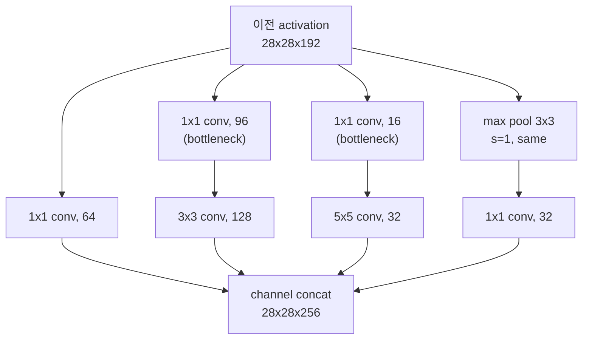

이런 bottleneck을 여러 크기의 conv 앞마다 넣은 게 하나의 Inception module이고, 이걸 여러 개 쌓은 게 GoogLeNet/Inception network. (중간중간 side branch — 중간 layer에서 바로 softmax로 예측하게 하는 가지 — 도 달려 있는데, 중간 feature도 쓸 만한 예측을 하게 만들어서 regularization 효과를 준다. 이름은 영화 Inception의 "we need to go deeper" 밈에서 따왔다.)

### MobileNet — Depthwise Separable Convolution

**동기**: 모바일/임베디드처럼 연산 자원이 부족한 환경을 위한 구조. 핵심은 일반 convolution을 두 단계로 쪼개서 곱셈 수를 줄이는 것.

**비용을 세는 법 (공통)**: conv 한 번의 곱셈 수 = (출력 원소 수) × (출력 원소 하나당 곱셈 수 = 필터 원소 수).

- **일반 convolution**: $n\times n\times n_c$ 입력에 $f\times f\times n_c$ 필터 $n_c'$개 → 출력 $n_{out}\times n_{out}\times n_c'$. 필터 하나가 공간(가로세로) 섞기와 채널 섞기를 **한꺼번에** 한다.

$$\text{cost}_{\text{normal}} = n_{out}^2 \cdot n_c' \cdot f^2 \cdot n_c$$

| 기호 | 의미 |
|---|---|
| $n$ | 입력 한 변의 길이 |
| $n_{out}$ | 출력 한 변의 길이 ($\lfloor (n+2p-f)/s\rfloor+1$). 출력 원소 수가 $n_{out}^2 \cdot n_c'$ |
| $n_c$ | 입력 채널 수 |
| $n_c'$ | 출력 채널 수 = 필터 개수 |
| $f$ | 필터 한 변의 길이 (보통 3) |
| cost | 곱셈 횟수 (파라미터 수가 아니라 **연산량**) |

- **Depthwise convolution**("depth(깊이=채널) 방향으로 한 장씩 따로"라는 뜻): 필터를 채널별로 따로 적용한다(입력 채널당 필터 1개, $f\times f\times1$짜리를 $n_c$개). 채널 $k$의 필터는 입력 채널 $k$만 본다. 채널끼리 안 섞고 공간 정보만 필터링. 출력 채널 수 = 입력 채널 수(그대로).

$$\text{cost}_{\text{depthwise}} = n_{out}^2 \cdot n_c \cdot f^2$$

- **Pointwise convolution**("한 점(point) = 픽셀 하나만 보고 채널을 섞는다"는 뜻): 그 결과에 $1\times1\times n_c$ 필터 $n_c'$개를 적용해서 채널을 원하는 개수로 섞어 조합한다(바로 앞에서 본 1x1 conv).

$$\text{cost}_{\text{pointwise}} = n_{out}^2 \cdot n_c' \cdot n_c$$

두 개를 합쳐 depthwise separable convolution이라 한다. "공간 섞기"와 "채널 섞기"를 분리(separable)했다는 뜻. 일반 conv 대비 비율을 구하면 $n_{out}^2 \cdot n_c$가 약분되어:

$$\frac{\text{cost}_{\text{depthwise}} + \text{cost}_{\text{pointwise}}}{\text{cost}_{\text{normal}}} = \frac{n_{out}^2 n_c f^2 + n_{out}^2 n_c n_c'}{n_{out}^2 n_c' f^2 n_c} = \frac{1}{n_c'} + \frac{1}{f^2}$$

(기호는 위 표와 같다. 분자 첫 항 ÷ 분모 $= f^2/(n_c' f^2) = 1/n_c'$, 둘째 항 ÷ 분모 $= n_c'/(n_c' f^2) = 1/f^2$. 비율이 $n_{out}, n_c$와 무관하다는 게 포인트 — 입력 크기와 상관없이 항상 같은 배율로 싸진다.)

**강의 숫자 예시**: $6\times6\times3$ 입력 → $3\times3$, 출력 $4\times4\times5$.

| 방식 | 계산 | 곱셈 수 |
|---|---|---|
| 일반 conv | $4\times4\times5 \times 3\times3\times3$ | 2,160 |
| depthwise | $4\times4\times3 \times 3\times3$ | 432 |
| pointwise | $4\times4\times5 \times 3$ | 240 |
| separable 합계 | $432+240$ | 672 |

비율 $672/2160 = 0.311 = \frac{1}{5}+\frac{1}{9}$ ✓. 현실적인 크기에서는 $f=3, n_c'=512$면 대략 $\frac{1}{512}+\frac{1}{9} \approx 0.113$, 즉 약 10배 가까이 저렴해진다 — 출력 채널이 많을수록 $1/n_c'$ 항이 작아져서 이득이 커지고, 결국 $1/f^2 = 1/9$ 근처에 수렴한다. (→ Lab 3 `depthwise_separable_cost`)

**MobileNet v1**: 이 depthwise separable block을 13번 쌓고 → pooling → FC → softmax.

**MobileNet v2**: 여기에 두 가지를 추가했다. (1) residual connection(skip connection), (2) **expansion layer** — "bottleneck block"이라 부르는데, 채널을 먼저 **넓혔다가**(1x1 conv로 보통 6배) depthwise를 하고 다시 **줄이는**(1x1 projection) 구조다. 강의 예: $n\times n\times3 \xrightarrow{1\times1,\ 18개} n\times n\times18 \xrightarrow{3\times3 \text{ depthwise}} n\times n\times18 \xrightarrow{1\times1,\ 3개} n\times n\times3$. 이 block을 17번 쌓는다.

용어: **expansion layer**는 채널을 $t$배로 "부풀리는(expand)" $1\times1$ conv이고, $t$를 **expansion factor**라 부른다(강의 예에서는 $3\to18$이니 $t=6$, MobileNet v2의 기본값도 6). **projection layer**는 다시 채널을 줄이는 $1\times1$ conv인데, 채널 수가 줄어드는 방향이라 "낮은 차원으로 사영(projection)한다"는 뜻으로 부른다. $t$는 학습되는 값이 아니라 고르는 하이퍼파라미터로, 크면 block 내부 표현력이 좋아지지만 depthwise 단계의 연산·메모리가 비례해 늘고, 작으면 싸지만 표현력이 부족해진다.

왜 넓혔다 줄이나: 넓은 공간(18채널)에서 depthwise를 하면 더 풍부한 표현(복잡한 함수)을 배울 수 있고, block의 입출력은 좁게(3채널) 유지하니까 다음 block으로 넘기는 activation의 메모리가 작다. "계산은 넓게, 저장은 좁게".

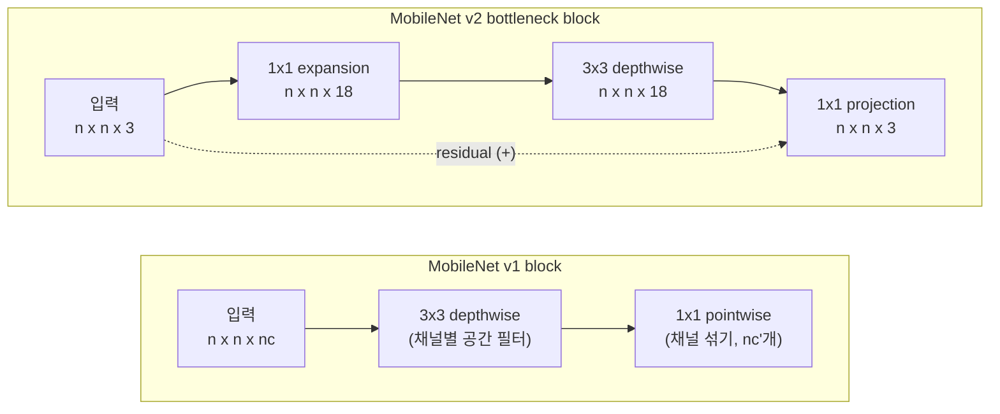

### EfficientNet (개념만)

네트워크의 성능은 resolution(입력 해상도 $r$), depth(층 개수 $d$), width(채널 개수 $w$) 세 가지를 키우면 좋아지는데, 셋 중 하나만 무작정 키우면 곧 한계에 부딪힌다(예: 해상도만 키우면 층이 얕아서 넓은 영역을 못 보고, 층만 늘리면 채널이 좁아 표현력이 부족). EfficientNet은 계산 자원 예산이 주어졌을 때 이 세 축을 **같이, 균형있게** 얼마나 키울지 정하는 compound scaling 규칙을 제안한 것 — 자원이 넉넉하면 EfficientNet-B7처럼 크게, 부족하면 B0처럼 작게 같은 계열 안에서 고를 수 있다. MobileNet이 "block 자체를 싸게", EfficientNet은 "싼 block을 예산에 맞게 얼마나 크게 쌓을지"라고 보면 된다.

### 오픈소스 구현 / Transfer Learning 실무 조언

> **처음부터 아키텍처를 새로 설계하려 하지 말고, 검증된 오픈소스 구현+pretrained weight를 가져다 쓰는 게 실무에서 훨씬 합리적이다.** (ResNet, MobileNet, Inception 등 GitHub에 코드+weight가 다 있음)

논문에 나온 네트워크는 learning rate decay 같은 세부 튜닝이 까다로워서 논문만 보고 재현하기 어렵다. 그리고 ImageNet(100만 장 이상) 같은 큰 데이터로 몇 주씩 학습한 weight를 그대로 가져올 수 있다.

**Transfer learning(전이학습)이란**: 다른 큰 데이터셋에서 이미 학습된 네트워크의 weight를 가져와 내 문제의 출발점으로 쓰는 것. 앞쪽 layer가 배운 edge/색/texture 감지는 어떤 이미지 문제에나 쓸모 있으니, 그걸 공짜로 얻는 셈이다. 예: 내 고양이 2마리(Tigger, Misty)를 구분하는 3-class 분류기(Tigger/Misty/둘 다 아님)를 사진 몇십 장으로 만들고 싶을 때.

전이학습 시 데이터 양에 따라 freeze(=그 layer의 weight를 학습 중 고정, 업데이트 안 함) 전략이 달라진다.

- **데이터가 아주 적을 때**: 마지막 softmax(출력) layer만 새로 만들고(1000 class → 내 3 class), 나머지 전체를 freeze. 사실상 pretrained network를 고정된 feature extractor로 쓰는 것. (팁: freeze된 부분의 activation을 미리 한 번 계산해서 디스크에 캐싱해두면, 그 이후엔 그 feature 위에서 shallow model만 빠르게 여러 번 학습할 수 있다.)
- **데이터가 어느 정도 있을 때**: 앞쪽(저수준 feature: edge, 색깔, texture 등 범용적인 것)은 freeze하고, 뒤쪽 layer 몇 개 + 새 출력 layer를 직접 학습(fine-tuning). 데이터가 많을수록 freeze하는 layer 수를 줄인다.
- **데이터가 아주 많을 때**: pretrained weight를 초기값(initialization)으로만 쓰고 네트워크 전체를 fine-tuning.

### Data Augmentation

**문제**: 컴퓨터 비전은 입력(픽셀)이 복잡해서 거의 항상 데이터가 부족하다. 이미지 데이터는 거의 항상 데이터가 "충분히 많다"고 느껴지지 않아서 augmentation이 사실상 기본값이다.

**아이디어**: 기존 이미지를 살짝 변형해도 레이블(고양이)은 안 바뀐다. 그러니 변형본을 추가 학습 데이터로 쓰면 데이터를 공짜로 불릴 수 있고, 모델은 "좌우가 바뀌어도 / 조금 잘려도 / 색이 좀 달라도 고양이"라는 불변성을 배운다.

- Mirroring(좌우 반전), Random cropping(이미지 일부를 랜덤하게 잘라냄 — 물체가 충분히 남아 있어야 함), Rotation, Shearing, Local warping
- Color shifting: RGB 채널 값에 작은 값을 랜덤하게 더하거나 빼서(예: R +20, G −20, B +20) 조명/색감 변화에 강건하게 만듦. 세 채널에 완전히 무작위로 더하는 대신, 그 이미지에서 실제로 자주 나타나는 색 변화 방향(픽셀들의 RGB 값에 PCA를 돌려서 구한 주성분) 위주로 왜곡을 주는 정교한 버전을 PCA color augmentation이라 부른다(AlexNet 논문에서 제안).
- 실무에서는 augmentation을 별도 CPU 스레드에서 미리 만들어두고, GPU는 그동안 학습만 계속 돌리는 파이프라인(hard disk → distortion → mini-batch → training)을 많이 씀.
- augmentation의 강도(얼마나 돌리고 얼마나 색을 바꿀지)도 하이퍼파라미터다 — 이것도 오픈소스 구현의 설정을 그대로 가져다 쓰는 게 좋은 출발점.

---

## Week3: Object Detection

### Localization vs Detection vs Classification

- **Image classification**: "이 이미지가 뭐냐" 한 개 레이블만 출력. ("자동차")
- **Classification with localization**: 객체가 1개라고 가정하고, 클래스 + bounding box(위치)까지 출력. ("자동차, 여기에")
- **Detection**: 이미지 안에 객체가 여러 개(개수도 모름) 있을 수 있고, 각각의 클래스+위치를 다 찾아야 함. ("자동차 2대, 보행자 1명, 각각 여기, 여기, 여기")

**bounding box**란: 물체를 감싸는 축 정렬 직사각형. 중심 좌표 $(b_x, b_y)$와 높이/너비 $(b_h, b_w)$ 4개 숫자로 표현한다. 좌표계는 이미지 왼쪽 위가 $(0,0)$, 오른쪽 아래가 $(1,1)$.

### Bounding box를 위한 출력 벡터 $y$

**아이디어**: 분류용 네트워크의 softmax 출력 옆에 "box 좌표 4개를 출력하는 unit"을 추가하면 된다 — 회귀(regression) 문제처럼 숫자를 직접 예측하게 하는 것.

Classification with localization 문제의 출력 $y$를 예로 들면(클래스 3개: 보행자/자동차/오토바이 + 배경):

$$y = \begin{bmatrix} p_c \\ b_x \\ b_y \\ b_h \\ b_w \\ c_1 \\ c_2 \\ c_3 \end{bmatrix}$$

- $p_c$: 객체가 존재하는지(1) 배경인지(0)
- $b_x, b_y$: bounding box 중심의 좌표(이미지 크기로 정규화, 보통 0~1)
- $b_h, b_w$: bounding box의 높이/너비(마찬가지로 이미지 크기 기준으로 정규화). 객체가 이미지 안에 통째로 들어있다고 가정하는 이 기본 설정에서는 보통 0~1 사이 값이다. *(주의: 뒤에 나올 YOLO처럼 grid cell 크기 기준으로 정규화하면 객체가 cell보다 커서 1을 넘는 경우가 생기는데, 그건 해당 부분에서 따로 짚는다.)*
- $c_1,c_2,c_3$: 각 클래스일 확률(원-핫)

**예**: 이미지 가운데쯤에 자동차 → $y = [1, 0.5, 0.7, 0.3, 0.4, 0, 1, 0]^T$. 배경뿐인 이미지 → $y = [0, ?, ?, ?, ?, ?, ?, ?]^T$.

$p_c=0$이면($=$배경) 나머지 값은 뭐가 나오든 loss 계산에서 무시(don't care, 위의 "?")한다. 즉 loss는

$$\mathcal{L}(\hat y, y) = \begin{cases} \sum_{i=1}^{8} (\hat y_i - y_i)^2 & y_1 = p_c = 1 \\ (\hat y_1 - y_1)^2 & y_1 = p_c = 0 \end{cases}$$

여기서 $\hat y$는 네트워크가 내놓은 8개짜리 예측 벡터, $y$는 정답 벡터($p_c, b_x, b_y, b_h, b_w, c_1, c_2, c_3$를 담은 위의 $y$와 같은 것)이고, 아래첨자 $i$는 (Week1 요약의 $\hat y^{(i)}$처럼 "몇 번째 샘플"이 아니라) "벡터의 몇 번째 원소"를 가리킨다 — 이 식은 샘플 하나에 대한 loss라서 위첨자 $(i)$가 없다. (강의는 설명을 위해 전부 squared error로 썼지만, 실전에서는 $p_c$엔 logistic loss, 클래스엔 softmax cross-entropy, box 좌표엔 squared error처럼 섞어 쓰는 게 보통이다.)

### Landmark Detection

bounding box 대신 "특정 점들의 좌표"를 직접 출력하게 할 수도 있다. 예: 얼굴 인식에서 눈꼬리 위치, 표정 인식에서 입/눈 주변 landmark 64개 등. 출력이 $(l_{1x}, l_{1y}), (l_{2x}, l_{2y}), \dots$ 형태가 될 뿐 나머지 아이디어는 동일하다. landmark 64개면 출력 unit은 "얼굴이 있나" 1개 + 좌표 $64\times2$ = **129개**. 사람 자세(pose) 추정도 어깨/팔꿈치/손목 같은 관절을 landmark로 두고 같은 방식으로 푼다. Snapchat 필터 같은 게 이 방식을 씀.

**주의**: landmark 번호의 의미가 **모든 학습 이미지에서 일관**되어야 한다(landmark 1은 항상 왼쪽 눈 바깥 꼬리, 2는 항상 왼쪽 눈 안쪽 꼬리...). 레이블링이 이미지마다 뒤섞이면 네트워크가 배울 게 없다.

### Sliding Window Detection과 Convolutional 구현

**원시적인 방법**: (1) 먼저 "딱 맞게 잘린(closely cropped) 자동차 사진 vs 자동차 아닌 사진"으로 분류용 ConvNet을 학습한다. (2) 테스트 이미지 위에 작은 window를 놓고, window 안 영역을 잘라서 ConvNet에 넣어 "자동차냐"를 판단, window를 stride만큼 옮기며 이미지 전체를 훑는다. (3) window 크기를 바꿔서 한 번 더, 또 한 번 더.

문제는 **계산량**이다. window 위치 하나하나가 ConvNet forward pass 한 번이다. stride를 촘촘히 하면 정확하지만 window 수가 폭발하고, stride를 크게 하면 빠르지만 위치가 부정확하다.

**Convolutional 구현(OverFeat 아이디어)**: 두 단계로 이해하자.

**1단계 — FC layer를 conv layer로 바꾸기**: $5\times5\times16$ 볼륨 뒤에 unit 400개짜리 FC가 있다고 하자. 이걸 "$5\times5\times16$ 필터 400개짜리 conv"로 바꾸면 출력이 $1\times1\times400$이 되는데, 이 400개 숫자 각각은 입력 전체($5\times5\times16$)를 weighted sum한 것이라 **수학적으로 FC와 똑같다**. 파라미터 수도 같다: FC $400\times400+400 = 160{,}400$, conv $(5\times5\times16+1)\times400 = 160{,}400$. 그 뒤 FC들도 $1\times1$ conv로 바꾼다.

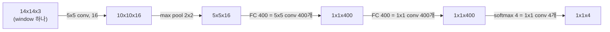

**2단계 — 큰 이미지를 통째로 넣기**: 이제 네트워크가 conv/pool로만 이뤄져 있으니 입력 크기를 키워도 그대로 돌아간다. $14\times14$용으로 학습한 네트워크에 $16\times16\times3$ 이미지를 넣으면:

| 입력 | conv 5x5 | pool 2x2 | "FC" conv 5x5 | 최종 출력 | 대응하는 window 수 |
|---|---|---|---|---|---|
| $14\times14\times3$ | $10\times10\times16$ | $5\times5\times16$ | $1\times1\times400$ | $1\times1\times4$ | 1 |
| $16\times16\times3$ | $12\times12\times16$ | $6\times6\times16$ | $2\times2\times400$ | $2\times2\times4$ | 4 (stride 2) |
| $28\times28\times3$ | $24\times24\times16$ | $12\times12\times16$ | $8\times8\times400$ | $8\times8\times4$ | 64 |

출력 $2\times2\times4$의 왼쪽 위 칸이 "왼쪽 위 $14\times14$ window의 분류 결과", 오른쪽 위 칸이 "2칸 오른쪽으로 옮긴 window의 결과"... 가 된다(pool이 $2\times2$라 window stride가 2가 됨). window 4개를 따로 돌리면 겹치는 부분을 4번 계산하지만, 한 번에 넣으면 **겹치는 계산을 자연스럽게 공유**한다 — 훨씬 빠름.

남은 약점: box 위치가 window 격자에 묶여서 부정확하다(물체가 window 경계에 걸치거나, 물체 모양이 정사각형이 아닐 때). → 이걸 YOLO가 해결한다.

### YOLO (You Only Look Once)

**Grid 나누기**: 이미지를 $S\times S$ (예: 강의 설명용 $3\times3$, 실제론 $19\times19$) grid cell로 나누고, 각 cell마다 위에서 본 $y$ 벡터($p_c,b_x,b_y,b_h,b_w,c_1,\dots$)를 출력하게 학습시킨다. 객체의 **중심점**이 속한 cell 하나만 그 객체에 대한 책임을 진다(라벨링 규칙) — 물체가 cell 여러 개에 걸쳐 있어도 중심이 있는 cell 하나에만 $p_c=1$을 준다. 최종 출력 텐서 shape은 $S\times S\times(5+\text{클래스수})$ — 여기에 anchor box까지 쓰면 채널이 더 늘어난다.

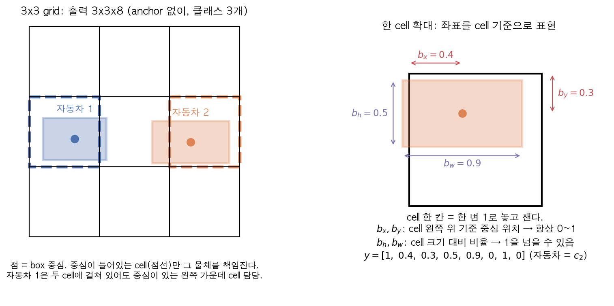

왼쪽 그림: $3\times3$ grid, 클래스 3개 → 출력 $3\times3\times8$. 자동차 1은 cell 두 개에 걸쳐 있지만 중심(점)이 있는 왼쪽 가운데 cell(점선) 하나만 책임진다. 오른쪽 그림: 그 cell을 확대해서 한 변을 1로 놓고 좌표를 잰다.

- $b_x,b_y$는 해당 cell 내부 기준 상대 좌표(0~1). 중심이 cell 안에 있으니까 항상 0~1이다(그래서 sigmoid로 출력하기 좋음).
- $b_h,b_w$는 cell 크기 기준 비율(1보다 커질 수 있음 — 객체가 cell보다 클 수 있으니까, 예: 그림의 $b_w=0.9$는 거의 cell 폭만 하고, 2.5면 cell 2.5개 폭).
- 그림 예시의 target: $y = [1, 0.4, 0.3, 0.5, 0.9, 0, 1, 0]^T$ (자동차가 $c_2$). 나머지 7개 cell 중 물체 중심이 없는 cell은 $y = [0, ?, \dots]$.
- 이 방식의 장점: bounding box 좌표가 신경망의 "출력"이라서(sliding window처럼 정해진 window 격자에 묶이지 않음) 어떤 비율/위치의 box도 표현할 수 있고, 앞 절의 convolutional 구현처럼 이미지 전체를 **한 번의 forward pass**로 처리해서 빠르다(실시간 가능해서 이름이 You Only Look **Once**). $19\times19$처럼 grid를 촘촘히 하면 한 cell에 중심이 두 개 들어갈 확률도 줄어든다.

**IoU (Intersection over Union)**: 두 bounding box가 얼마나 겹치는지 측정하는 지표. 예측 box가 정답 box와 "충분히 맞는지" 판단할 때, 그리고 NMS/anchor에서 "두 box가 같은 걸 가리키나" 판단할 때 쓴다.

$$\text{IoU} = \frac{\text{교집합 넓이}}{\text{합집합 넓이}} = \frac{|A\cap B|}{|A| + |B| - |A\cap B|}$$

합집합을 $|A|+|B|-|A\cap B|$로 계산하는 이유: 두 넓이를 그냥 더하면 겹친 부분을 두 번 셌으니 한 번 빼준다. 값은 0(전혀 안 겹침)~1(완전히 일치) 사이.

**교집합 계산법** (box를 왼쪽 위 $(x_1, y_1)$, 오른쪽 아래 $(x_2, y_2)$로 표현할 때): 교집합의 왼쪽 위는 두 box의 왼쪽 위 좌표 중 **큰 쪽**, 오른쪽 아래는 **작은 쪽**.

$$w_{\cap} = \max(0,\ \min(x_2^A, x_2^B) - \max(x_1^A, x_1^B)), \quad h_{\cap} = \max(0,\ \min(y_2^A, y_2^B) - \max(y_1^A, y_1^B))$$

$\max(0, \cdot)$은 안 겹칠 때 음수 길이가 나오는 걸 막는다.

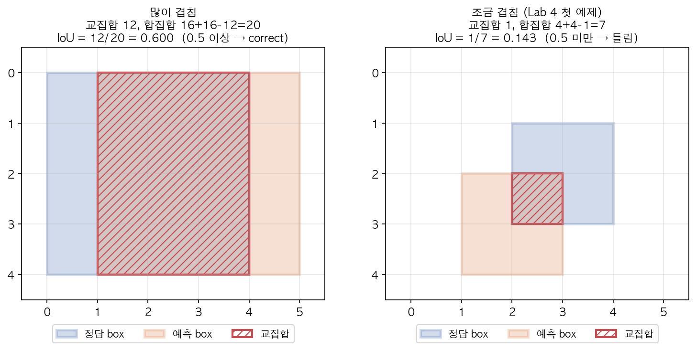

- 왼쪽: 정답 $(0,0)$–$(4,4)$, 예측 $(1,0)$–$(5,4)$. 교집합 $3\times4 = 12$, 합집합 $16+16-12 = 20$ → IoU $= 0.6$ → 맞은 걸로 침.
- 오른쪽(Lab 4 첫 예제): $(2,1)$–$(4,3)$과 $(1,2)$–$(3,4)$. 교집합 $1\times1 = 1$, 합집합 $4+4-1 = 7$ → IoU $= 1/7 \approx 0.143$ → 틀림.

보통 IoU $\ge 0.5$면 "맞다(correct)"고 판단하는 관례를 쓴다(더 엄격하게 하려면 0.6, 0.7도 씀). 0.5에 이론적 근거가 있는 건 아니고 관례다. 이 threshold를 높이면(예: 0.7) box가 정답과 아주 정확히 겹쳐야만 맞다고 쳐주는 엄격한 평가가 되고, 낮추면(예: 0.3) 대충 겹치기만 해도 맞다고 쳐주는 느슨한 평가가 된다. (→ Lab 4 `iou`)

**Non-max Suppression (NMS)**: 

*문제*: $19\times19$ grid에서는 자동차 한 대 근처의 cell 여러 개가 "내 cell에 자동차 중심이 있다"고 각자 주장할 수 있다. 결과적으로 한 물체에 box가 여러 개 겹쳐 나온다. 이 중복을 정리하는 후처리가 NMS다. 이름 그대로 "최대(max)가 아닌 것들을 억누른다(suppress)".

1. $p_c$(또는 $p_c\times$클래스확률)가 **score threshold**(예: 0.6, 하이퍼파라미터)보다 낮은 box는 다 버림.
2. 남은 box 중 $p_c$가 가장 높은 것을 하나 선택하고 출력에 포함.
3. 그 box와 IoU가 **NMS IoU threshold**(예: 0.5, 하이퍼파라미터) 이상인 나머지 box들은 다 버림(같은 객체를 가리키는 중복이라고 판단).
4. 남은 box가 없어질 때까지 2~3 반복. 클래스가 여러 개면 클래스별로 독립적으로 NMS를 돌린다(겹쳐 있는 사람과 자동차를 서로 지우면 안 되니까).

두 threshold 모두 사람이 고르는 값이라 값에 따른 trade-off가 있다. **score threshold**를 낮추면(예: 0.3) 자신 없는 box까지 살아남아 오탐(false positive)이 늘고, 높이면(예: 0.9) 확신이 아주 높은 box만 남아서 실제 물체를 놓치는 미탐(false negative)이 늘 수 있다. **NMS IoU threshold**를 낮추면(예: 0.3) 살짝만 겹쳐도 같은 물체로 보고 지워버려서 가까이 붙어있는 서로 다른 물체의 box까지 하나로 뭉개질 위험이 있고, 높이면(예: 0.9) 웬만큼 겹쳐도 다른 물체로 보고 안 지워서 같은 물체에 중복 box가 남을 수 있다.

**Walk-through (Lab 4 데이터)**: box 6개, score = [0.9, 0.75, 0.8, 0.7, 0.85, 0.4].

| 단계 | 한 일 | 남은 후보 |
|---|---|---|
| 1 | #5 (0.4 < 0.6) 탈락 | #0 0.9, #4 0.85, #2 0.8, #1 0.75, #3 0.7 |
| 2 | 최고 #0 선택 → IoU(#0,#1)=0.82, IoU(#0,#2)=0.63 → 둘 다 ≥0.5라 제거. #3, #4는 IoU 0 (다른 물체) | #4, #3 |
| 3 | 최고 #4 선택 → IoU(#4,#3)=0.81 → 제거 | 없음 |
| 결과 | **[#0, #4]** — 물체 2개에 box 2개 | |

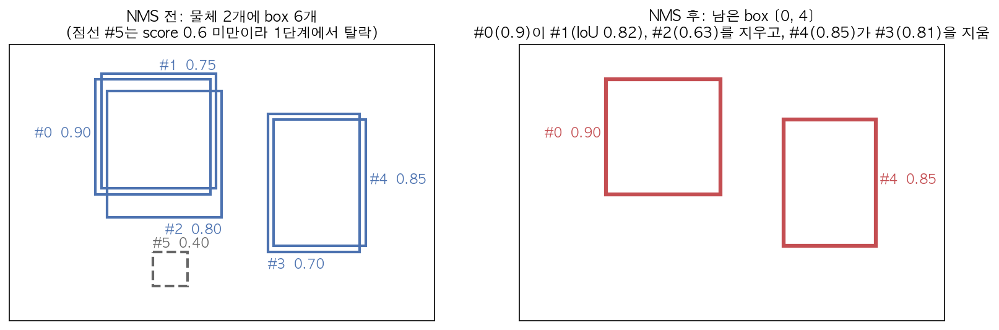

왼쪽: 물체 2개에 box 6개가 난립. 오른쪽: 각 물체마다 가장 확신 높은 box 하나만 남는다. (→ Lab 4 `non_max_suppression`)

**Anchor Box**: 

*문제*: 지금까지 한 cell은 물체 하나만 표현할 수 있다. 근데 보행자가 자동차 앞에 서 있으면 두 물체의 중심이 같은 cell에 들어갈 수 있다(예: 사람과 자동차가 겹쳐 있음) — $y$ 벡터 하나로는 둘 중 하나를 포기해야 한다.

*해결*: 미리 정해둔 모양(세로로 긴 anchor, 가로로 긴 anchor 등) 여러 개를 각 cell에 배정하고, $y$ 벡터를 anchor 개수만큼 이어붙인다. 각 실제 객체는 자기 실제 box와 **IoU가 가장 높은 anchor**에 할당된다. (이때 IoU는 위치 말고 **모양**만 비교하려고 두 box의 중심을 맞춰놓고 계산한다.)

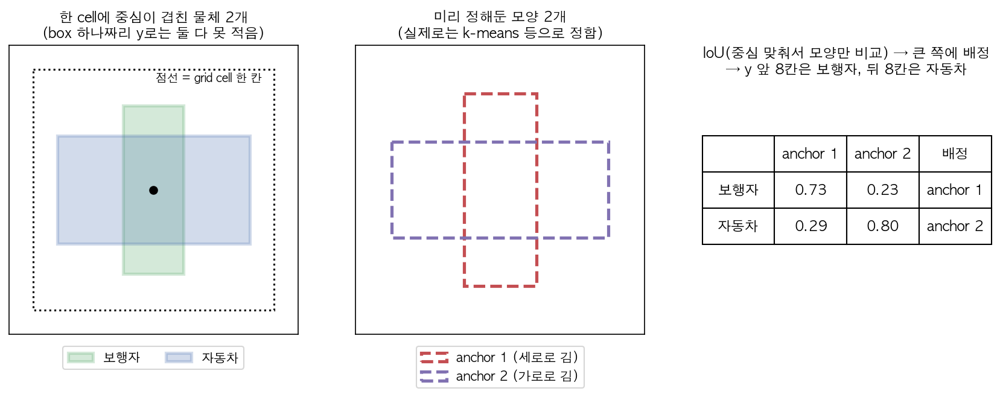

그림 예: anchor 1은 세로로 긴 $0.3\times0.8$ (폭×높이), anchor 2는 가로로 긴 $0.9\times0.4$. 보행자 $0.25\times0.7$은 anchor 1과 IoU 0.73, anchor 2와 0.23 → anchor 1 담당. 자동차 $0.8\times0.45$는 anchor 1과 0.29, anchor 2와 0.80 → anchor 2 담당. 그래서 이 cell의 target은

$$y = [\underbrace{1, b_x, b_y, b_h, b_w, 1, 0, 0}_{\text{anchor 1: 보행자}},\ \underbrace{1, b_x, b_y, b_h, b_w, 0, 1, 0}_{\text{anchor 2: 자동차}}]^T \quad (16\text{칸})$$

자동차만 있는 cell이면 anchor 1 부분은 $p_c=0$(나머지 don't care), anchor 2 부분에만 자동차를 적는다.

- 출력 텐서: $S\times S\times(\text{anchor 개수}\times(5+\text{클래스수}))$. $3\times3$ grid, anchor 2개, 클래스 3개면 $3\times3\times16$. 실제 YOLO 과제 설정($19\times19$, anchor 5개, 클래스 80개)이면 $19\times19\times5\times85 = 19\times19\times425$.
- anchor는 "두 물체 중심이 겹치는" 드문 경우보다, **anchor마다 특정 모양(키 큰 물체 / 넓은 물체)을 전담하게 해서 학습을 쉽게 만드는** 효과가 더 크다.
- 한계: 한 cell에 anchor 수보다 많은 물체가 오거나, 같은 모양 물체 두 개가 같은 anchor에 몰리면 처리 못 한다(드물어서 감수).
- anchor box shape은 사람이 직접 고르거나, 보통 k-means로 학습 데이터의 box 모양들(폭, 높이)을 클러스터링해서 대표 모양 몇 개를 정한다(YOLOv2 이후).
- **anchor 개수**도 하이퍼파라미터다(학습 데이터로 정하는 게 아니라 사람이 미리 정함, 실전 YOLO는 보통 5개). 개수를 늘리면 더 다양한 모양의 물체를 각 cell이 동시에 표현할 수 있지만, 그만큼 출력 채널 수($\text{anchor 개수}\times(5+\text{클래스수})$)와 계산량이 비례해서 늘고, 너무 적으면 바로 위 한계(같은 cell·같은 모양 충돌)가 더 자주 발생한다.

**YOLO 전체 흐름 정리**:

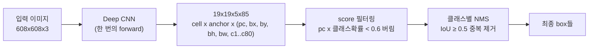

학습 시에는 각 이미지의 정답 box를 "중심이 속한 cell + IoU 최대 anchor" 칸에 적어 넣은 target 볼륨($19\times19\times5\times85$)을 만들어 그걸 맞추도록 학습하고, 테스트 시에는 위 흐름대로 필터링 + NMS를 한다.

### Region Proposal (R-CNN 계열, 간단히)

**문제**: Sliding window는 명백히 배경인 영역(하늘, 빈 도로)까지 다 검사한다는 낭비가 있다. 

**아이디어**: R-CNN(Regions with CNN)은 먼저 "객체가 있을 법한 후보 영역"만 segmentation 알고리즘(예: selective search — 색/텍스처/크기가 비슷한 인접 영역끼리 점점 합쳐나가며 물체 후보 blob들을 만들어내는 고전적인(딥러닝 이전의) 이미지 분할 알고리즘)으로 추려낸 뒤(보통 이미지당 ~2000개), 그 영역들에만 CNN을 돌린다. 출력은 클래스 + box 보정값(propose된 영역이 물체에 딱 맞지 않을 수 있으니 조정).

- **R-CNN**: region propose → 영역마다 각각 classify. 느림(영역 하나하나 forward pass).
- **Fast R-CNN**: propose는 그대로 하되, 전체 이미지에 conv를 한 번만 돌리고 그 feature map 위에서 영역별 classify(앞에서 본 convolutional 구현과 같은 아이디어). 훨씬 빠름. 이제 병목은 region proposal 단계.
- **Faster R-CNN**: region proposal 자체도 별도 알고리즘이 아니라 conv network로 하게 만듦 — 그래도 YOLO보다는 보통 느림.

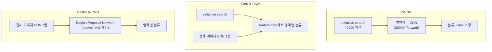

실무적으로는 요즘 1-stage(YOLO 계열 — 제안 단계 없이 한 번에 예측)가 속도 때문에 더 많이 쓰이지만, R-CNN 계열(2-stage — 먼저 제안, 그다음 정제)의 "propose 후 정제" 아이디어 자체는 알아둘 가치가 있다. Ng 개인 의견으로는 "굳이 두 단계로 나눌 필요 없이 한 번에 하는 게 장기적으로 더 유망해 보인다"고.

### Semantic Segmentation과 U-Net

**문제**: Object detection은 "박스"로 위치를 표시하지만, semantic segmentation은 **픽셀 하나하나**에 클래스를 매긴다(예: 자율주행에서 어느 픽셀이 도로인지, 의료 영상에서 장기/종양 경계를 픽셀 단위로 구분). box는 대략적인 위치만 주지만 segmentation은 물체의 정확한 모양을 준다.

출력은 입력과 같은 $n_H\times n_W$ 크기에, 픽셀마다 클래스 번호(또는 클래스 수만큼의 확률)를 가져야 한다. 즉 $h\times w\times3$ 입력 → $h\times w\times n_{\text{classes}}$ 출력. 그런데 일반 conv+pool은 계속 크기를 줄이는 쪽으로만 동작하므로 **다시 키우는 연산**이 필요하다.

**Transpose Convolution**: 일반 conv의 반대 방향 연산. 일반 conv는 "입력 여러 칸 → 출력 한 칸"(모아서 줄이기)이라면, transpose conv는 "입력 한 칸 → 출력 여러 칸"(펼쳐서 키우기)이다. 작은 입력에 필터를 대응시켜 큰 출력을 만든다(입력의 한 픽셀 값을 필터에 곱해서 출력에 "도장 찍듯" 찍고, stride만큼 옮겨서 다음 픽셀 도장, 겹치는 부분은 더함). 이걸 이용해서 작아진 feature map을 다시 원래 해상도로 upsampling한다. 필터 숫자는 역시 학습된다.

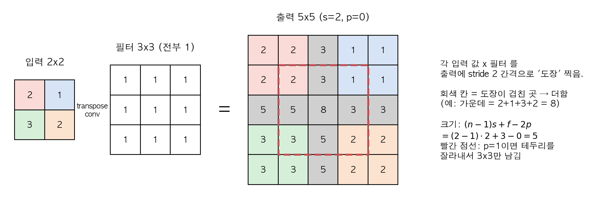

그림: 입력 $2\times2$의 각 값(2, 1, 3, 2)을 3x3 필터(설명용으로 전부 1)에 곱해서 출력에 2칸 간격으로 찍는다. 왼쪽 위 값 2 → 출력 왼쪽 위 $3\times3$ 영역에 전부 2, 오른쪽 위 값 1 → 2칸 오른쪽 영역에 1. 도장 영역이 겹치는 회색 칸은 더한다(가운데 칸은 네 도장이 다 겹쳐서 $2+1+3+2 = 8$). 출력 크기는

$$n_{out} = (n-1)\cdot s + f - 2p$$

$p=0$이면 $(2-1)\cdot2+3 = 5$. padding $p$를 주면 출력 테두리 $p$줄을 잘라낸다고 생각하면 된다(빨간 점선 = $p=1$일 때 남는 $3\times3$). 이 공식은 일반 conv 공식 $n = (n_{out}+2p-f)/s + 1$을 $n_{out}$에 대해 푼 것 — 크기 관계가 정확히 거꾸로라서 "transpose"다. 강의는 $2\times2$ 입력, $f=3, s=2, p=1$로 $4\times4$ 출력을 만드는 그림을 보여주는데, 공식대로면 3이 나오고, 실제 프레임워크(Keras `Conv2DTranspose(strides=2, padding="same")`)는 출력이 딱 $n\cdot s = 4$가 되도록 가장자리를 맞춰준다 — 세부 크기 규칙은 프레임워크마다 약간 다르니 "대략 $s$배로 키운다"로 기억하고 정확한 값은 문서/`.shape`로 확인하자.

**U-Net 구조**: 이름처럼 U자 모양.
- 앞부분(encoder, contracting path): 일반 conv+pooling으로 점점 작고 채널이 많은 feature map으로 압축(공간 정보는 줄고 "무엇이 있는지"에 대한 정보는 늘어남).
- 뒷부분(decoder, expanding path): transpose convolution으로 다시 키워서 원래 해상도로 복원. 마지막에 $1\times1$ conv로 채널을 클래스 수로 맞춰 $h\times w\times n_{\text{classes}}$를 만든다.
- **Skip connection**: encoder의 각 단계에서 나온 feature map을 decoder의 대응하는(같은 해상도) 단계에 직접 연결(concatenate)한다. 이유: decoder만으로 upsampling하면 "무엇이 있는지"는 알아도 "정확히 어디에 있었는지"(고해상도 공간 정보)가 이미 pooling으로 손실된 상태라서, encoder의 고해상도 feature를 다시 가져다 붙여줘야 픽셀 단위로 정밀한 경계를 그릴 수 있다. 비유하자면 decoder는 "여기 고양이가 있다"는 요약본을, skip connection은 "경계가 정확히 이 픽셀"이라는 원본 스케치를 준다. ResNet의 skip connection과 목적은 다르지만("gradient 잘 흐르게" vs "고해상도 정보 보존") 아이디어 형태는 비슷하다.

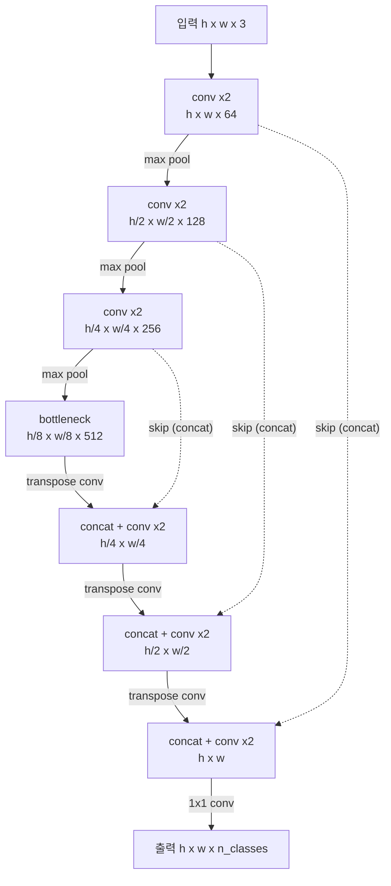

(채널 수 64/128/256/512는 전형적인 예시이고, 핵심은 "내려가며 줄이고, 올라가며 키우고, 같은 층끼리 옆으로 연결".)

---

## Week4: Face Recognition & Neural Style Transfer

### Verification vs Recognition

- **Face Verification**: "이 사람이 A가 맞습니까?" — 1:1 매칭 문제. 입력 이미지+주장하는 신원(ID/이름) → yes/no. (예: 휴대폰 얼굴 잠금 해제)
- **Face Recognition**: "이 사람이 DB에 있는 K명 중 누구입니까?" — 1:K 매칭이라서 verification보다 훨씬 어렵다(K명 각각과 비교하니까 오류 가능성이 대략 K배). 예: verification이 99% 정확해도(1% 오류) K=100명과 비교하면 틀릴 기회가 100번이라 recognition 시스템으로는 쓸 수 없다 — 그래서 verification 정확도를 99.9% 이상으로 끌어올려야 한다. (예: 회사 출입문 얼굴 인식)

### One-shot Learning 문제

**문제**: 회사 직원 얼굴 인식 같은 경우, 사람마다 학습 이미지가 **딱 1장**밖에 없는 경우가 흔하다. 이런 상황에서 일반적인 "클래스별로 softmax 학습" 방식(직원 4명 + 모름 = 5-class softmax)은 안 맞는다 — (1) 클래스당 1장으로는 ConvNet을 학습할 수 없고 (2) 새 직원이 입사할 때마다 출력 unit을 늘려서 네트워크를 다시 학습해야 한다.

**해결**: "이 사람이 누구인가를 분류"하는 대신 **"두 이미지가 얼마나 다른지를 재는 유사도 함수 $d(\text{img1}, \text{img2})$를 학습"**하는 방향으로 문제를 바꾼다.

$$d(\text{img1}, \text{img2}) \le \tau \Rightarrow \text{같은 사람}, \qquad d > \tau \Rightarrow \text{다른 사람}$$

($\tau$ = threshold, 학습되는 값이 아니라 검증 데이터로 골라야 하는 하이퍼파라미터.) Recognition은 새 사진을 DB의 모든 직원 사진과 $d$로 비교해서 가장 작은 사람(그마저 $\tau$보다 크면 "모르는 사람")을 고르면 된다. 새 직원이 오면 사진 한 장을 DB에 추가만 하면 되고 재학습이 필요 없다. $\tau$를 너무 크게 잡으면 다른 사람도 "같다"고 통과시켜버리고(false accept, 보안 시스템에서 특히 치명적), 너무 작게 잡으면 본인도 종종 "다르다"고 거부한다(false reject, 사용성 저하) — 그래서 실전에서는 verification 정확도(위에서 말한 99.9%대)를 이 $\tau$ 선택으로 맞춘다.

### Siamese Network

**embedding이란**: 이미지를 넣으면 128개 숫자짜리 벡터를 내놓는 함수 $f(x)$를 생각하자. 이 벡터를 이미지의 "encoding" 또는 **embedding**이라 부른다 — 얼굴의 특징을 128차원 공간의 점 하나로 요약한 것. 잘 학습되면 같은 사람 사진들은 이 공간에서 가까이 모이고, 다른 사람은 멀리 떨어진다. 구현은 보통 ConvNet에서 마지막 softmax를 떼고 그 앞 FC layer(128 unit)의 출력을 쓰는 것.

**Siamese network**: 같은 CNN(같은 weight를 **공유**, "쌍둥이")에 이미지 두 장을 각각 통과시켜서 각각 embedding 벡터 $f(x^{(1)}), f(x^{(2)})$를 얻고, 그 사이 거리를 유사도로 쓴다.

$$d(x^{(1)}, x^{(2)}) = \lVert f(x^{(1)}) - f(x^{(2)}) \rVert_2^2$$

(여기서 $\lVert v \rVert_2^2$는 벡터 $v$의 L2 norm 제곱, 즉 각 원소를 제곱해서 다 더한 것 $= \sum_k v_k^2$다. 그래서 $d$는 두 embedding 벡터의 128개 원소별 차이를 제곱해서 합한 값 — "두 점 사이 유클리드 거리의 제곱"이다.)

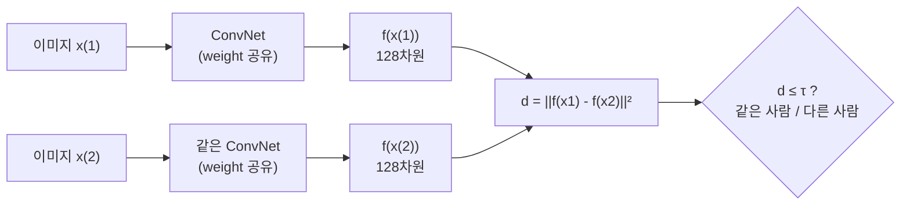

목표: 같은 사람 사진 쌍은 $d$가 작게, 다른 사람 사진 쌍은 $d$가 크게 나오도록 $f$(=embedding 함수, network의 파라미터)를 학습하는 것. 그 "작게/크게"를 loss로 만든 게 다음 절의 triplet loss다. (DeepFace 논문의 방식)

### Triplet Loss

**Anchor(A, 기준 사진)**, **Positive(P, A와 같은 사람의 다른 사진)**, **Negative(N, 다른 사람)** 세 장을 한 세트(triplet)로 학습한다. 원하는 조건: A는 N보다 P에 더 가까워야 한다.

$$\lVert f(A)-f(P) \rVert^2 + \alpha \le \lVert f(A)-f(N) \rVert^2$$

| 기호 | 의미 |
|---|---|
| $f(\cdot)$ | 학습 중인 embedding 네트워크 |
| $d(A,P) = \lVert f(A)-f(P)\rVert^2$ | 같은 사람끼리의 거리 (작아야 함) |
| $d(A,N) = \lVert f(A)-f(N)\rVert^2$ | 다른 사람과의 거리 (커야 함) |
| $\alpha$ | margin. "최소 이만큼은 차이 나야 한다" (하이퍼파라미터, 예: 0.2) |

$\alpha$는 **margin**으로, 이게 없으면($\alpha=0$) $f$가 항상 0을 출력하는 등 trivial한 답으로 조건을 만족해버릴 수 있다: 모든 embedding이 같은 점이면 $0 \le 0$으로 조건 통과. 그래서 "A-N 거리가 A-P 거리보다 최소 $\alpha$만큼은 더 커야 한다"고 강제하는 역할이다. $\alpha$를 너무 작게 잡으면(극단적으로 0) 방금 말한 collapse를 못 막고, 너무 크게 잡으면 만족시키기 어려운 조건이 되어 대부분의 triplet이 항상 양수 loss를 내버려 학습이 어느 한 점으로 잘 수렴하지 않는다(논문 기준 보통 0.2 근처를 씀). 이걸 손실함수로 만들면:

$$\mathcal{L}(A,P,N) = \max\left(\lVert f(A)-f(P) \rVert^2 - \lVert f(A)-f(N) \rVert^2 + \alpha,\ 0 \right)$$

$$J = \sum_{i=1}^{m} \mathcal{L}(A^{(i)}, P^{(i)}, N^{(i)})$$

$\max(\cdot, 0)$을 쓰는 이유는 "조건을 이미 만족했으면(음수가 되면) loss를 더 줄일 필요 없이 그냥 0"으로 처리하기 위함이다(SVM에서 쓰는 hinge loss, 즉 $\max(\text{마진 위반량}, 0)$ 형태와 같은 꼴).

**숫자로 보기** ($\alpha = 0.2$):

| 상황 | $d(A,P)$ | $d(A,N)$ | $d(A,P)-d(A,N)+\alpha$ | loss | 해석 |
|---|---|---|---|---|---|
| 쉬운 triplet | 0.5 | 0.9 | $-0.2$ | 0 | 이미 margin 밖, 배울 것 없음 |
| 애매한 triplet | 0.5 | 0.6 | $0.1$ | 0.1 | N이 더 멀긴 한데 margin 부족 → $d(A,P)$ 줄이고 $d(A,N)$ 키우는 쪽으로 학습 |
| 전부 collapse | 0 | 0 | $0.2$ | 0.2 | margin 덕분에 "다 같은 점" 답도 벌점 받음 |

**학습 데이터**: triplet을 만들려면 **같은 사람의 사진이 여러 장** 필요하다(A와 P). 예: 1만 명의 사진 10만 장. 학습이 끝나면 그 뒤로는 one-shot 상황(직원당 1장)에서 $f$를 그대로 쓴다. 상용 시스템은 수백만~수억 장으로 학습하므로, 이것도 공개된 pretrained weight를 가져다 쓰는 게 현실적이다.

**Hard Triplet 선택이 중요한 이유**: triplet을 완전히 무작위로 뽑으면 $d(A,P)$가 이미 $d(A,N)$보다 훨씬 작은, 너무 쉬운 조합이 대부분이라서(A,P는 같은 사람이라 원래 닮았고, 랜덤 N은 대체로 확연히 다르게 생김) 위 표의 첫 줄처럼 loss가 0 → gradient descent가 별로 배울 게 없다. 그래서 **hard negative**(다른 사람인데 $d(A,N)$이 $d(A,P)$에 가깝게 나오는, 헷갈리는 조합)를 의도적으로 골라 학습에 사용해야 학습이 효율적으로 진행된다. (→ Lab 5: easy negative는 loss 0, hard negative는 ≈0.17)

### Face Verification을 Binary Classification으로 풀기

Triplet loss 말고 다른 접근도 있다: 두 이미지를 같은 Siamese network에 통과시켜 embedding $f(x^{(i)}), f(x^{(j)})$을 얻은 뒤, 이 두 embedding을 원소별로 비교한 값(예: $|f(x^{(i)})_k - f(x^{(j)})_k|$)을 입력으로 로지스틱 회귀 unit 하나에 넣어서 "같은 사람(1)/다른 사람(0)"을 곧바로 이진분류로 학습시키는 방식이다.

$$\hat y = \sigma\left(\sum_{k=1}^{128} w_k \left| f(x^{(i)})_k - f(x^{(j)})_k \right| + b\right)$$

여기서 $\hat y$는 "같은 사람일 확률" 예측값, $\sigma$는 로지스틱 회귀의 sigmoid 함수 $\sigma(z) = 1/(1+e^{-z})$(출력을 0~1로 눌러줌), $w_k, b$는 이 로지스틱 unit의 학습되는 weight/bias(128개 원소별 차이마다 하나씩)다.

(원소별 차이 대신 $\frac{(f_k^{(i)} - f_k^{(j)})^2}{f_k^{(i)} + f_k^{(j)}}$ 같은 $\chi^2$ 형태를 쓰기도 한다.) Triplet처럼 (A,P,N) 세 장을 한 세트로 묶을 필요 없이 (이미지 쌍, 레이블) 데이터만 있으면 되고, 실전 배포할 때는 등록된 직원들의 embedding을 미리 한 번 계산해서 저장(precompute)해두면, 새 이미지가 들어올 때마다 그 저장된 embedding과 비교만 하면 되므로 편하다(DeepFace 논문에서 쓴 방식). 이 precompute 트릭은 triplet 방식에서도 똑같이 쓸 수 있다.

### Neural Style Transfer

**무엇을 하나**: Content 이미지 $C$(예: 내 사진)의 내용을 유지하면서 Style 이미지 $S$(예: 고흐 그림)의 화풍을 입힌 Generated 이미지 $G$를 만드는 문제.

**먼저 — ConvNet의 깊은 layer는 무엇을 보나**: ConvNet의 각 unit을 최대로 활성화시키는 입력 패치를 찾아보면, 얕은 layer의 unit들은 edge/색깔/간단한 texture에 반응하고, 층이 깊어질수록 점점 더 복잡한 패턴(질감 조합 → 사물의 부분 → 개/자동차 같은 전체 개념)에 반응하는 걸 관찰할 수 있다(Zeiler & Fergus의 시각화 연구). 즉 **layer의 activation = 그 깊이 수준에서 이미지를 요약한 설명**이다. Style transfer는 이 activation을 "내용"과 "스타일"을 재는 자로 쓴다. (그래서 "content는 중간 layer, style은 얕은~깊은 여러 layer를 섞어서" 쓴다.)

**어떻게**: 이미 학습된 ConvNet(보통 VGG)은 **고정**해두고, $G$의 픽셀 값 자체를 gradient descent로 최적화한다(네트워크의 weight가 아니라 이미지 픽셀이 학습 대상이라는 게 특이한 점).

1. $G$를 랜덤 노이즈(또는 $C$에 노이즈를 섞은 것)로 초기화. 예: $100\times100\times3$
2. 아래 cost $J(G)$를 계산하고 $\partial J/\partial G$를 구해서 $G := G - \alpha \frac{\partial J}{\partial G}$ (여기서 $\alpha$는 learning rate). 반복할수록 $G$가 C의 내용 + S의 스타일을 닮아간다.

전체 cost function:

$$J(G) = \alpha J_{content}(C,G) + \beta J_{style}(S,G)$$

($\alpha, \beta$는 두 cost의 상대적 비중을 정하는 하이퍼파라미터. 위 learning rate $\alpha$와는 다른 것 — 강의 표기를 그대로 따라서 같은 글자다. 사실 하나만 있어도 되는데 원 논문 표기를 따라 둘 다 쓴다.) $\alpha$(content 비중)를 상대적으로 키우면 $G$가 $C$의 내용은 잘 지키지만 $S$의 화풍은 옅게 입혀지고, $\beta$(style 비중)를 키우면 화풍은 강하게 입혀지지만 원래 내용의 윤곽이 style 패턴에 묻혀 흐려진다 — 실전에서는 비율(예: $\alpha=1, \beta=40$ 같은 식)을 몇 번 돌려보며 맞춘다.

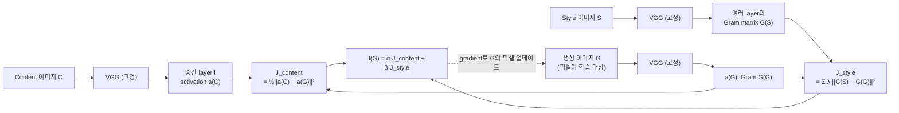

**Content Cost**: pretrained ConvNet의 **중간 정도 깊이**의 layer $l$을 하나 골라서, $C$와 $G$를 각각 통과시켰을 때 나오는 activation $a^{[l](C)}, a^{[l](G)}$가 비슷하면 내용이 비슷하다고 본다.

$$J_{content}(C,G) = \frac{1}{2}\lVert a^{[l](C)} - a^{[l](G)} \rVert^2$$

(두 activation 볼륨을 펼쳐서 원소별 차이 제곱합. 정규화 상수는 중요하지 않다 — 어차피 $\alpha$가 조절한다. 프로그래밍 과제/Lab 5는 $\frac{1}{4 n_H n_W n_C}$를 쓴다.) 너무 얕은 layer를 쓰면 픽셀 값 자체를 그대로 베끼라는 압박이 되고, 너무 깊은 layer를 쓰면 "이게 개다/고양이다" 같은 추상적 내용만 맞으면 되니까 layer 선택이 중간 정도가 적당하다.

**Style Cost와 Gram Matrix**:

*"스타일"을 숫자로 어떻게 정의하나?* 어떤 layer의 채널들은 각자 다른 feature를 감지한다(채널 1 = 세로 줄무늬, 채널 2 = 주황색...). 고흐 그림 같은 스타일은 "세로 붓질이 있는 곳엔 항상 주황색이 같이 있다" 같은 **feature들의 동시 등장 패턴**이다. 반대로 "어디에" 있는지는 스타일과 무관하다(스타일은 그림 전체에 퍼져 있으니까). 그래서 style을, 어떤 layer의 여러 채널이 **같은 위치에서 서로 얼마나 함께(correlate) 켜지는지**로 정의한다. 이걸 수치화한 게 Gram matrix다.

*배경 — 내적이 "함께 켜짐"을 잰다*: 두 벡터 $u, v$의 내적 $\sum_i u_i v_i$는 같은 자리 $i$에서 둘 다 클 때 크고, 한쪽이 0이면 그 자리 기여도 0이다. 채널 $k$의 activation을 위치별로 쭉 펼친 벡터(길이 $n_H n_W$)와 채널 $k'$의 벡터를 내적하면 "두 채널이 같은 위치에서 같이 켜지는 정도"가 된다.

layer $l$의 activation을 채널 $c$, 위치 $(i,j)$에 대해 $a_{i,j,c}^{[l]}$라 하면,

$$G_{kk'}^{[l]} = \sum_{i=1}^{n_H}\sum_{j=1}^{n_W} a_{i,j,k}^{[l]}\, a_{i,j,k'}^{[l]}$$

행렬로 쓰면 activation을 $(n_c, n_H n_W)$ 모양으로 펼친 $A$에 대해 $G = AA^T$. 이 $n_c^{[l]}\times n_c^{[l]}$ 짜리 행렬이 채널 $k$와 $k'$이 같이 활성화되는 경향(비대각 원소)과 각 채널 자체의 활성화 정도(대각 원소, 강도)를 담는다. (선형대수의 Gram matrix 정의 그대로이고, 평균을 빼지 않았으니 엄밀한 "상관계수"는 아니지만 강의에서도 correlation이라 부른다.)

**숫자 예**: 채널 3개, 위치 4개($2\times2$를 펼침).

| 채널 | 위치1 | 위치2 | 위치3 | 위치4 |
|---|---|---|---|---|
| $k=1$ (세로 붓질) | 1 | 2 | 0 | 1 |
| $k=2$ (주황색) | 2 | 4 | 0 | 2 |
| $k=3$ (파란 점) | 0 | 0 | 3 | 0 |

$$G = \begin{bmatrix} 6 & 12 & 0 \\ 12 & 24 & 0 \\ 0 & 0 & 9 \end{bmatrix}$$

$G_{12} = 1\cdot2 + 2\cdot4 + 0\cdot0 + 1\cdot2 = 12$: 채널 1과 2는 같은 위치에서 같이 켜진다(큰 값). $G_{13} = 0$: 채널 1과 3은 절대 같이 안 켜진다. 대각 $G_{33} = 9$: 채널 3의 전체 강도. 그리고 위치 1~4의 순서를 섞어도 $G$는 그대로다 — "어디에"는 버리고 "무엇과 무엇이 같이"만 남는다. (→ Lab 5에서 픽셀 위치만 섞은 이미지의 style cost가 ≈0이 되는 걸 확인)

$S$와 $G$ 각각에서 이 Gram matrix를 구해서($G^{[l](S)}, G^{[l](G)}$) 그 차이를 줄이는 게 style cost:

$$J_{style}^{[l]}(S,G) = \frac{1}{(2n_H n_W n_c)^2}\sum_{k,k'}\left(G_{kk'}^{[l](S)}-G_{kk'}^{[l](G)}\right)^2$$

(앞의 정규화 상수는 layer 크기가 달라도 cost 크기가 비슷하도록 맞추는 것이고, 어차피 $\beta$가 곱해지니 본질적이진 않다. $\sum_{k,k'}(\cdot)^2$는 두 행렬 차이의 Frobenius norm 제곱 $\lVert G^{(S)} - G^{(G)}\rVert_F^2$, 즉 모든 원소 차이의 제곱합이다.)

보통 layer 하나가 아니라 여러 layer의 style cost를 가중합해서 쓴다(얕은 layer는 색감/질감 같은 저수준 style, 깊은 layer는 더 큰 패턴의 style을 잡아내므로 섞어 쓰는 게 결과가 좋음):

$$J_{style}(S,G) = \sum_l \lambda^{[l]} J_{style}^{[l]}(S,G)$$

($\lambda^{[l]}$은 layer별 가중치 하이퍼파라미터.)

### Convolution의 1D/3D 일반화

지금까지 다룬 건 전부 2D 이미지($n_H\times n_W\times n_c$)에 대한 convolution인데, 같은 아이디어가 차원을 바꿔도 그대로 적용된다 — "작은 필터를 데이터 축을 따라 슬라이딩, 채널 깊이는 입력에 맞춤, 필터 개수 = 출력 채널 수".

- **1D convolution**: EKG(심전도) 신호처럼 시간축으로 값 하나가 쭉 이어지는 데이터($n\times n_c$ 형태)에도 필터를 슬라이딩시켜 convolution을 적용할 수 있다. 강의 예: 길이 14 신호 ($14\times1$) * 길이 5 필터 16개 → $10\times16$ → 다시 $5\times16$ 필터 32개 → $6\times32$. (이런 시계열 데이터는 뒤 course에서 배울 RNN으로도 다룰 수 있다.)
- **3D convolution**: CT 촬영 영상처럼 가로/세로에 (물리적인) 깊이 축까지 있는 volume 데이터($n_H\times n_W\times n_D\times n_c$)에는 3D 필터($f\times f\times f\times n_c$)를 슬라이딩시켜 적용한다. 강의 예: $14\times14\times14\times1$ * $5\times5\times5\times1$ 필터 16개 → $10\times10\times10\times16$ → $5\times5\times5\times16$ 필터 32개 → $6\times6\times6\times32$. 동영상(시간축을 깊이로 보는)에도 쓴다.
- 차원이 늘어나도 출력 크기 공식은 각 축에 대해 똑같이 $\lfloor (n+2p-f)/s+1 \rfloor$ 로 계산하면 된다. (예: $14-5+1 = 10$, $10-5+1 = 6$)

---

## 핵심 요약

- Convolution은 **작은 필터를 이미지 전체에 재사용**함으로써 FC 대비 파라미터를 극적으로 줄인다 (parameter sharing + sparsity of connections). 예: $32\times32\times3 \to 28\times28\times6$에 conv는 456개, FC는 약 1445만 개. 필터 파라미터 수는 입력 이미지 크기와 무관하다.
- 필터 = "원소별 곱 후 합"으로 특정 패턴(edge 등)과의 일치도를 재는 도구이고, 그 숫자들을 사람이 정하지 않고 **학습**하는 게 CNN이다. 한 conv layer는 결국 $z = W * a + b,\ a = g(z)$.
- 출력 크기는 항상 $\lfloor (n+2p-f)/s+1 \rfloor$로 손계산 가능해야 하고, 필터 깊이 = 입력 채널 수, **필터 개수 = 다음 layer의 채널 수**. 파라미터 수 $= (f\cdot f\cdot n_c^{[l-1]} + 1)\cdot n_c^{[l]}$.
- Padding은 크기 유지·모서리 보존용(same: $p=(f-1)/2$), stride는 의도적 축소용.
- Pooling은 학습 파라미터가 없는 고정 연산(max/average)이고, 공간 크기만 줄인다($n_c$ 불변).
- ResNet의 skip connection은 $a^{[l+2]} = g(z^{[l+2]} + a^{[l]})$ — weight가 0이어도 identity가 되므로 "block을 추가해도 손해는 안 본다"가 보장되어 아주 깊은 네트워크도 학습이 안정적으로 된다.
- $1\times1$ conv는 채널 방향 FC이자 bottleneck(연산량 절감) 도구로 Inception(1.2억 → 1240만 곱셈)/MobileNet 등 여러 아키텍처의 핵심 부품이다.
- Depthwise separable conv는 공간 섞기와 채널 섞기를 분리해서 비용을 $\frac{1}{n_c'} + \frac{1}{f^2}$배(3x3이면 약 1/9~1/3)로 줄인다. MobileNet v2는 여기에 expansion–depthwise–projection + residual.
- 실무에서는 새 아키텍처를 밑바닥부터 설계하기보다 **오픈소스+pretrained weight로 transfer learning**하는 게 기본값이고, freeze 범위는 보유 데이터 양에 반비례한다. data augmentation은 거의 항상 쓴다.
- Detection 계열: sliding window의 비효율을 conv 공유(OverFeat, FC→conv 변환)와 grid 기반 단일 forward pass(YOLO)로 해결. IoU(교집합/합집합)로 box 겹침을 재고, NMS는 가장 확신 높은 box만 남기고 IoU 큰 중복을 지우며, anchor box는 한 cell에서 모양이 다른 여러 물체를 표현하게 해준다. 출력 shape $= S\times S\times \#\text{anchor}\times(5+\#\text{class})$.
- Segmentation은 encoder(축소)-decoder(transpose conv로 확대) + skip connection(concat, U-Net)으로 픽셀 단위 출력을 만든다.
- Face recognition은 classification이 아니라 **embedding 거리 학습** 문제로 재정의(Siamese network, triplet loss with margin $\alpha$, 혹은 embedding 차이를 넣는 binary classification)해서 one-shot 상황에 대응한다. 학습엔 hard triplet이 필요하다.
- Style transfer는 네트워크의 weight가 아니라 **생성 이미지 $G$의 픽셀 자체를 최적화**하며, content는 중간 layer activation 유사도로, style은 Gram matrix(같은 위치에서 채널이 함께 켜지는 정도, 위치 정보는 버림) 유사도로 정의한다.

## 헷갈리기 쉬운 점

- **"Convolution" vs 실제 신호처리의 convolution**: 딥러닝에서 말하는 convolution은 필터를 뒤집지(flip) 않는 cross-correlation이다. 이름만 convolution.
- **Valid vs Same**: valid는 padding 없음($p=0$, 출력이 작아짐), same은 입력=출력 크기가 되도록 padding($p=(f-1)/2$). "same"이 padding=0이라고 착각하기 쉬운데 반대다. (same은 $s=1$일 때만 정확히 크기가 같다. stride가 있으면 same padding을 줘도 줄어든다.)
- **Floor를 잊지 말 것**: $(n+2p-f)/s$가 정수가 아니면 내림. 필터가 밖으로 삐져나가는 위치는 계산 안 한다.
- **필터 개수 = 다음 layer의 채널 수**이지, 필터 크기($f$)가 채널 수를 결정하는 게 아니다. 필터 자체의 깊이(채널 차원)는 항상 **입력**의 채널 수와 같아야 한다(그래서 필터 shape에 $n_c^{[l-1]}$이 들어감).
- **3D 필터 하나의 출력은 2D 한 장**이다. $3\times3\times3$ 필터를 써도 출력이 3채널이 되는 게 아니라, 27개를 전부 더해서 1채널이 된다.
- **Pooling은 파라미터가 0개**라서 "파라미터 개수 표"를 만들 때 pooling layer 줄을 빼먹거나 반대로 값을 넣는 실수를 하기 쉽다. 또 pooling은 채널마다 따로 하므로 $n_c$가 안 바뀐다.
- **파라미터 수와 연산량(곱셈 수)은 다른 것**이다. conv는 파라미터가 적어도(weight 공유) 모든 위치에서 계산하므로 곱셈 수는 많을 수 있다. Inception/MobileNet이 줄이는 건 주로 **곱셈 수**다.
- **ResNet의 skip connection vs U-Net의 skip connection**: 둘 다 "이전 layer 결과를 더 나중 layer로 직접 전달"한다는 점은 같지만, ResNet은 **더하기(add)**이고 목적은 gradient 흐름/identity 학습이다. U-Net은 **이어붙이기(concatenate)**이고 목적은 encoder의 고해상도 공간 정보를 decoder에 보존하는 것. 연산 자체도 다르다(add는 채널 수 그대로, concat은 채널 수가 합쳐짐).
- **ResNet에서 $a^{[l]}$을 더하는 위치는 ReLU 전**이다: $g(z^{[l+2]} + a^{[l]})$. ReLU 뒤에 더하는 게 아니다.
- **1x1 conv는 "아무것도 안 하는 층"이 아니다**. 채널이 1개일 때만 단순 곱셈이고, 채널이 많으면 픽셀마다 채널들을 섞는 FC + ReLU다.
- **IoU threshold와 NMS threshold는 별개의 값**일 수 있다(하나는 "이 예측이 맞다고 볼 기준", 하나는 "두 예측이 같은 객체를 가리킨다고 볼 기준"). 같은 0.5를 쓰는 경우가 많아서 같은 개념으로 착각하기 쉽다. 또 NMS 1단계의 **score threshold**(예: 0.6)는 IoU가 아니라 $p_c$에 대한 기준이다.
- **NMS는 클래스별로** 돌린다. 겹쳐 있는 사람 box와 자동차 box는 IoU가 커도 서로 지우면 안 된다.
- **YOLO의 $b_x, b_y$는 0~1, $b_h, b_w$는 1을 넘을 수 있다** — 앞의 둘은 cell 안의 중심 위치, 뒤의 둘은 cell 크기 대비 비율이라서.
- **Anchor box는 "미리 정해둔 모양의 틀"**이지 실제 예측된 box가 아니다. 네트워크는 각 anchor에 대한 **보정값**(offset)을 출력하고, 학습 시 각 실제 객체는 IoU가 가장 큰 anchor 하나에만 할당된다(한 cell에 anchor가 여러 개 있어도 객체 하나당 보통 anchor 하나만 책임짐).
- **Transpose conv는 conv의 역연산(inverse)이 아니다**. 크기 관계만 거꾸로일 뿐, 원래 입력 값을 복원하는 게 아니라 자기 필터로 새로 "펼치는" 학습 가능한 upsampling이다.
- **Triplet loss의 margin $\alpha$는 하이퍼파라미터**이지 학습되는 파라미터가 아니다. margin이 없으면 embedding이 전부 같은 점으로 collapse해도 loss가 0이 될 수 있다는 걸 막는 장치라는 걸 기억할 것.
- **One-shot learning은 "학습 데이터가 1장"이 아니다**. embedding 네트워크 $f$는 사람당 여러 장씩 있는 큰 데이터로 미리 학습하고, **배포 후 새 사람을 등록할 때** 1장만 있으면 된다는 뜻이다.
- **Style transfer에서 최적화 대상은 이미지 $G$의 픽셀 값**이지 네트워크의 weight가 아니다. VGG 등 ConvNet의 weight는 학습 내내 고정(frozen)이고, activation을 뽑아내는 용도로만 쓰인다.
- **Style transfer의 $\alpha, \beta$는 learning rate가 아니라** content/style cost의 비중이다.
- **Gram matrix의 대각 원소**는 채널 하나 자체의 활성화 강도(그 feature가 이미지에 얼마나 강하게 등장하는지)이고, **비대각 원소**가 두 채널이 "함께" 나타나는 정도(style의 핵심)다. 둘을 혼동해서 대각 원소만 style이라고 오해하기 쉽다. 그리고 Gram matrix는 위치 정보를 버리므로 content(어디에 뭐가 있는지)는 담지 못한다.

---

## Lab 예제 — 직접 짜보기

> 프레임워크 없이 numpy로 CNN의 핵심 연산을 직접 짠다. 뼈대의 `TODO`를 채우고 **체크포인트**와 비교해보자. 정답은 접혀있다.

### Lab 1. Convolution forward를 for문으로 직접

**목표**: `zero_pad` → `conv_single_step` → `conv_forward` 순서로 conv layer의 forward를 구현한다. 강의의 6×6 세로 edge 예제를 재현하고, padding/stride에 따른 출력 shape이 공식 $\lfloor\frac{n+2p-f}{s}\rfloor+1$과 맞는지 확인한다.

```python
import numpy as np
import matplotlib.pyplot as plt

def zero_pad(X, pad):
    # X: (m, n_H, n_W, n_C) — 높이/너비 축만 pad
    return None   # TODO: np.pad

def conv_single_step(a_slice, W, b):
    # a_slice, W: (f, f, n_C_prev), b: (1, 1, 1)
    return None   # TODO: 원소별 곱의 합 + b

def conv_forward(A_prev, W, b, stride=1, pad=0):
    # A_prev: (m, n_H_prev, n_W_prev, n_C_prev), W: (f, f, n_C_prev, n_C), b: (1, 1, 1, n_C)
    m, n_H_prev, n_W_prev, _ = A_prev.shape
    f, _, _, n_C = W.shape
    n_H = None    # TODO: 출력 크기 공식
    n_W = None    # TODO
    Z = np.zeros((m, n_H, n_W, n_C))
    A_pad = zero_pad(A_prev, pad)
    for i in range(m):
        for h in range(n_H):
            for w in range(n_W):
                # TODO: stride를 고려해 f x f 창(a_slice)을 잘라내고
                #       필터 c마다 conv_single_step(a_slice, W[..., c], b[..., c])
                pass
    return Z

# 강의 예제: 왼쪽 밝고(10) 오른쪽 어두운(0) 6x6 이미지
img = np.zeros((6, 6)); img[:, :3] = 10
vertical = np.array([[1, 0, -1], [1, 0, -1], [1, 0, -1]])
horizontal = vertical.T
Wk = np.stack([vertical, horizontal], axis=-1)[:, :, None, :]   # (3,3,1,2): 필터 2개
out = conv_forward(img[None, :, :, None], Wk, np.zeros((1, 1, 1, 2)))
print("세로 edge 필터 결과:\n", out[0, :, :, 0])
print("가로 edge 필터 결과:\n", out[0, :, :, 1])

np.random.seed(1)
A_prev = np.random.randn(2, 5, 7, 4)
W = np.random.randn(3, 3, 4, 8); b = np.random.randn(1, 1, 1, 8)
for pad, stride in [(0, 1), (1, 1), (1, 2)]:
    print(f"pad={pad}, stride={stride} -> Z.shape = {conv_forward(A_prev, W, b, stride, pad).shape}")

# 원 이미지에 Sobel 필터
yy, xx = np.mgrid[0:64, 0:64]
circle = ((xx - 32) ** 2 + (yy - 32) ** 2 < 20 ** 2).astype(float)
sobel_x = np.array([[1, 0, -1], [2, 0, -2], [1, 0, -1]])
edges = conv_forward(circle[None, :, :, None], sobel_x[:, :, None, None], np.zeros((1, 1, 1, 1)), pad=1)
fig, ax = plt.subplots(1, 2)
ax[0].imshow(circle, cmap="gray"); ax[0].set_title("input")
ax[1].imshow(edges[0, :, :, 0], cmap="gray"); ax[1].set_title("Sobel vertical edge")
plt.show()
```

**체크포인트**
- 세로 필터: 가운데 두 열이 30인 `4x4` (`[0, 30, 30, 0]` × 4) — 강의 그림 그대로. 가로 필터는 전부 0 (가로 방향 edge가 없으니까).
- shape: `(2, 3, 5, 8)`, `(2, 5, 7, 8)`(same padding), `(2, 3, 4, 8)`.
- Sobel 결과: 원의 왼쪽 테두리(어둡→밝)는 음수라 검게, 오른쪽 테두리(밝→어둡)는 양수라 희게 — 필터 부호가 edge의 "방향"(밝→어둡 vs 어둡→밝)까지 구분한다.

<details>
<summary>정답 보기</summary>

```python
def zero_pad(X, pad):
    return np.pad(X, ((0, 0), (pad, pad), (pad, pad), (0, 0)), mode="constant", constant_values=0)

def conv_single_step(a_slice, W, b):
    return np.sum(a_slice * W) + b.item()

def conv_forward(A_prev, W, b, stride=1, pad=0):
    m, n_H_prev, n_W_prev, _ = A_prev.shape
    f, _, _, n_C = W.shape
    n_H = (n_H_prev + 2 * pad - f) // stride + 1
    n_W = (n_W_prev + 2 * pad - f) // stride + 1
    Z = np.zeros((m, n_H, n_W, n_C))
    A_pad = zero_pad(A_prev, pad)
    for i in range(m):
        for h in range(n_H):
            vs = h * stride
            for w in range(n_W):
                hs = w * stride
                a_slice = A_pad[i, vs:vs + f, hs:hs + f, :]
                for c in range(n_C):
                    Z[i, h, w, c] = conv_single_step(a_slice, W[..., c], b[..., c])
    return Z
```

</details>

### Lab 2. Pooling + LeNet-5 shape/파라미터 계산기

**목표**: max/avg pooling을 구현하고, 레이어 목록만 넣으면 강의의 "activation shape / size / 파라미터 수" 표를 자동으로 뽑아주는 함수를 만든다. conv가 FC보다 파라미터가 얼마나 적은지(parameter sharing) 숫자로 체감한다.

```python
import numpy as np

def pool_forward(A_prev, f, stride, mode="max"):
    m, n_H_prev, n_W_prev, n_C = A_prev.shape
    n_H = (n_H_prev - f) // stride + 1
    n_W = (n_W_prev - f) // stride + 1
    A = np.zeros((m, n_H, n_W, n_C))
    for h in range(n_H):
        for w in range(n_W):
            window = None   # TODO: (m, f, f, n_C) 창
            A[:, h, w, :] = None   # TODO: 높이/너비 축(1,2)으로 max 또는 mean. 채널은 따로!
    return A

x = np.array([[1, 3, 2, 1], [2, 9, 1, 1], [1, 3, 2, 3], [5, 6, 1, 2]], dtype=float)
print("max pool:\n", pool_forward(x[None, :, :, None], 2, 2)[0, :, :, 0])
print("avg pool:\n", pool_forward(x[None, :, :, None], 2, 2, "avg")[0, :, :, 0])

def summarize(input_shape, layers):
    h, w, c = input_shape
    print(f"{'layer':>10} | {'shape':>14} | {'size':>6} | params")
    print(f"{'input':>10} | {str((h, w, c)):>14} | {h*w*c:>6} | 0")
    total = 0
    for layer in layers:
        kind = layer[0]
        if kind == "conv":
            _, f, s, p, n_c = layer
            params = None   # TODO: (f*f*이전채널 + 1) * 필터 수
            h, w, c = None, None, None   # TODO
        elif kind == "pool":
            _, f, s = layer
            params = 0      # pooling은 학습 파라미터 없음
            h, w = None, None            # TODO
        elif kind == "fc":
            params = None   # TODO: (입력 unit 수 + 1) * 출력 unit 수
            h, w, c = 1, 1, layer[1]
        total += params
        print(f"{kind:>10} | {str((h, w, c)):>14} | {h*w*c:>6} | {params}")
    print("총 파라미터:", total)

# LeNet-5 스타일: (conv f, s, p, 필터수) / (pool f, s) / (fc units)
summarize((32, 32, 3), [("conv", 5, 1, 0, 6), ("pool", 2, 2), ("conv", 5, 1, 0, 16), ("pool", 2, 2),
                        ("fc", 120), ("fc", 84), ("fc", 10)])
print("같은 32x32x3 -> 28x28x6 을 FC로 만들면 파라미터:", 32 * 32 * 3 * 28 * 28 * 6)
```

**체크포인트**
- max pool `[[9, 2], [6, 3]]`, avg pool `[[3.75, 1.25], [3.75, 2]]`.
- 표: conv1 `(28,28,6)` 456개 → pool `(14,14,6)` → conv2 `(10,10,16)` 2416개 → pool `(5,5,16)` → fc 48120 / 10164 / 850, 총 62006개.
- 첫 conv 레이어 456개 vs 같은 입출력을 FC로 하면 **약 1445만 개**. 파라미터 대부분이 뒤쪽 FC에 몰려있고, activation size는 점점 줄어든다는 것도 표에서 보인다.

<details>
<summary>정답 보기</summary>

```python
# pool_forward
            window = A_prev[:, h * stride:h * stride + f, w * stride:w * stride + f, :]
            A[:, h, w, :] = window.max(axis=(1, 2)) if mode == "max" else window.mean(axis=(1, 2))

# summarize
        if kind == "conv":
            _, f, s, p, n_c = layer
            params = (f * f * c + 1) * n_c
            h, w, c = (h + 2 * p - f) // s + 1, (w + 2 * p - f) // s + 1, n_c
        elif kind == "pool":
            _, f, s = layer
            params = 0
            h, w = (h - f) // s + 1, (w - f) // s + 1
        elif kind == "fc":
            params = (h * w * c + 1) * layer[1]
            h, w, c = 1, 1, layer[1]
```

</details>

### Lab 3. Residual block이 왜 깊어져도 괜찮은가 + 연산량 계산

**목표**: (1) W가 0이어도 residual block은 identity를 그대로 통과시킨다는 것, (2) 작은 가중치로 블록을 50개 쌓으면 plain network는 신호가 사라지지만 residual은 유지된다는 걸 확인한다. (3) 1×1 conv bottleneck(Inception)과 depthwise separable conv(MobileNet)의 곱셈 횟수를 직접 계산한다.

```python
import numpy as np

def relu(z): return np.maximum(0, z)

def plain_block(a, W1, W2):
    return relu(W2 @ relu(W1 @ a))

def residual_block(a, W1, W2):
    return None   # TODO: skip connection — 두 번째 relu "전에" a를 더한다

np.random.seed(0)
a = np.abs(np.random.randn(8, 1))
Z0 = np.zeros((8, 8))
print("W=0일 때 plain block 출력:", plain_block(a, Z0, Z0).ravel()[:4], "...")
print("W=0일 때 residual block 출력 == 입력?", np.allclose(residual_block(a, Z0, Z0), a))

def deep_forward(a, n_blocks, residual, scale=0.1):
    rng = np.random.RandomState(0)
    for _ in range(n_blocks):
        W1, W2 = rng.randn(8, 8) * scale, rng.randn(8, 8) * scale
        a = residual_block(a, W1, W2) if residual else plain_block(a, W1, W2)
    return np.linalg.norm(a)

for n in [1, 5, 20, 50]:
    print(f"블록 {n:>2}개 - plain |a|: {deep_forward(a, n, False):.2e}, residual |a|: {deep_forward(a, n, True):.2e}")

def conv_cost(n_out, f, n_c_in, n_c_out):
    return None   # TODO: 출력 원소 수(n_out*n_out*n_c_out) x 원소 하나당 곱셈 수(f*f*n_c_in)

def depthwise_separable_cost(n_out, f, n_c_in, n_c_out):
    depthwise = None   # TODO: 채널마다 f x f 필터 하나씩
    pointwise = None   # TODO: 1x1 x n_c_in 필터를 n_c_out개
    return depthwise + pointwise

normal, sep = conv_cost(4, 3, 3, 5), depthwise_separable_cost(4, 3, 3, 5)
print(f"강의 예시(6x6x3 -> 4x4x5): normal {normal}, separable {sep}, 비율 {sep/normal:.3f} (= 1/n_c' + 1/f^2 = {1/5 + 1/9:.3f})")
normal, sep = conv_cost(28, 3, 256, 512), depthwise_separable_cost(28, 3, 256, 512)
print(f"큰 레이어: normal {normal:,}, separable {sep:,}, 비율 {sep/normal:.3f}")
bottleneck = conv_cost(28, 1, 192, 16) + conv_cost(28, 5, 16, 32)
print(f"Inception 1x1 bottleneck: 5x5 직접 {conv_cost(28, 5, 192, 32):,} vs 1x1 거쳐서 {bottleneck:,}")
```

**체크포인트**
- W=0: plain은 전부 0, residual은 입력 그대로(`True`). "identity 함수를 배우기 쉽다" = 최악이어도 블록을 건너뛴 것과 같다는 뜻.
- 블록 50개: plain `|a|` ≈ `1e-76` (신호 소멸), residual ≈ `4.4` (유지).
- 곱셈 수: 강의 예시 2160 vs 672(비율 0.311), 큰 레이어는 비율 0.113 — 채널이 많을수록 MobileNet의 이득이 커진다. Inception: 약 1.2억 vs 1244만, 약 10배 절약.

<details>
<summary>정답 보기</summary>

```python
def residual_block(a, W1, W2):
    return relu(W2 @ relu(W1 @ a) + a)

def conv_cost(n_out, f, n_c_in, n_c_out):
    return n_out * n_out * n_c_out * f * f * n_c_in

def depthwise_separable_cost(n_out, f, n_c_in, n_c_out):
    depthwise = n_out * n_out * n_c_in * f * f
    pointwise = n_out * n_out * n_c_out * n_c_in
    return depthwise + pointwise
```

</details>

### Lab 4. IoU + Non-max Suppression (YOLO 후처리)

**목표**: 두 박스의 IoU를 계산하고, 같은 물체에 겹쳐 나온 박스들 중 가장 확신 높은 것만 남기는 NMS를 구현한다.

```python
import numpy as np
import matplotlib.pyplot as plt

def iou(box1, box2):
    # box = (x1, y1, x2, y2): 왼쪽 위, 오른쪽 아래 좌표
    inter = None   # TODO: 교집합 영역 (안 겹치면 0 — max(0, ...) 조심)
    union = None   # TODO: 넓이1 + 넓이2 - 교집합
    return inter / union

print("IoU 겹침:", iou((2, 1, 4, 3), (1, 2, 3, 4)))
print("IoU 안 겹침:", iou((1, 1, 2, 2), (3, 3, 4, 4)))
print("IoU 동일:", iou((1, 1, 3, 3), (1, 1, 3, 3)))

def non_max_suppression(boxes, scores, score_threshold=0.6, iou_threshold=0.5):
    # TODO:
    # 1) score < score_threshold 인 박스는 버린다
    # 2) 남은 것 중 score 최고인 박스를 keep에 넣고
    # 3) 그 박스와 IoU >= iou_threshold 인 박스들은 제거
    # 4) 남은 박스가 없을 때까지 2~3 반복
    keep = []
    return keep

boxes = np.array([[50, 50, 150, 150], [55, 45, 155, 145], [60, 60, 160, 170],
                  [200, 80, 280, 200], [205, 85, 285, 195], [100, 200, 130, 230]], dtype=float)
scores = np.array([0.9, 0.75, 0.8, 0.7, 0.85, 0.4])
keep = non_max_suppression(boxes, scores)
print("NMS 후 남은 박스:", keep)

fig, ax = plt.subplots()
for i, (x1, y1, x2, y2) in enumerate(boxes):
    color = "red" if i in keep else "lightgray"
    ax.add_patch(plt.Rectangle((x1, y1), x2 - x1, y2 - y1, fill=False, color=color, lw=2))
    ax.text(x1, y1 - 3, f"{scores[i]:.2f}", color=color)
ax.set_xlim(0, 320); ax.set_ylim(260, 0); ax.set_title("Non-max suppression (red = kept)")
plt.show()
```

**체크포인트**
- IoU: `0.1429`(=1/7), `0.0`, `1.0`.
- NMS 결과 `[0, 4]` — 왼쪽 물체는 0.9짜리, 오른쪽 물체는 0.85짜리만 남고, 0.4짜리 작은 박스는 score threshold에서 먼저 탈락.
- 실제 YOLO에서는 클래스마다 따로 NMS를 돌린다는 것도 기억.

<details>
<summary>정답 보기</summary>

```python
def iou(box1, box2):
    xi1, yi1 = max(box1[0], box2[0]), max(box1[1], box2[1])
    xi2, yi2 = min(box1[2], box2[2]), min(box1[3], box2[3])
    inter = max(0, xi2 - xi1) * max(0, yi2 - yi1)
    area1 = (box1[2] - box1[0]) * (box1[3] - box1[1])
    area2 = (box2[2] - box2[0]) * (box2[3] - box2[1])
    union = area1 + area2 - inter
    return inter / union

def non_max_suppression(boxes, scores, score_threshold=0.6, iou_threshold=0.5):
    idx = [i for i in np.argsort(-scores) if scores[i] >= score_threshold]
    keep = []
    while idx:
        best = idx.pop(0)
        keep.append(best)
        idx = [i for i in idx if iou(boxes[best], boxes[i]) < iou_threshold]
    return keep
```

</details>

### Lab 5. Triplet loss와 Style transfer의 Gram matrix

**목표**: face recognition의 triplet loss를 구현해서 easy/hard negative에서 loss가 어떻게 다른지 보고, 거리 threshold로 verification을 해본다. 이어서 Gram matrix와 style cost를 구현하고, "style은 위치와 무관한 채널 간 상관관계"라는 말을 실험으로 확인한다.

```python
import numpy as np

def triplet_loss(f_A, f_P, f_N, alpha=0.2):
    # f_*: (m, 128) 임베딩
    pos_dist = None   # TODO: ||f(A) - f(P)||^2  (샘플별)
    neg_dist = None   # TODO: ||f(A) - f(N)||^2
    return None       # TODO: sum(max(pos - neg + α, 0))

def l2_normalize(x): return x / np.linalg.norm(x, axis=1, keepdims=True)
np.random.seed(0)
person = l2_normalize(np.random.randn(3, 128))                       # 3명의 "진짜 얼굴" 임베딩
f_A = l2_normalize(person + 0.03 * np.random.randn(3, 128))          # anchor
f_P = l2_normalize(person + 0.03 * np.random.randn(3, 128))          # 같은 사람 다른 사진
f_N_easy = l2_normalize(np.random.randn(3, 128))                     # 전혀 다른 사람
f_N_hard = l2_normalize(person + 0.05 * np.random.randn(3, 128))     # 닮은 사람
print("triplet loss (easy negative):", triplet_loss(f_A, f_P, f_N_easy))
print("triplet loss (hard negative):", triplet_loss(f_A, f_P, f_N_hard))

def verify(f_img, f_db, threshold=0.7):
    d = np.linalg.norm(f_img - f_db)
    return d, d < threshold
print("같은 사람:", verify(f_A[0], f_P[0]), " 다른 사람:", verify(f_A[0], f_N_easy[0]))

def gram_matrix(A):
    # A: (n_H, n_W, n_C) -> G: (n_C, n_C), G[k, k'] = 채널 k와 k'가 같은 위치에서 같이 켜지는 정도
    return None   # TODO: (n_C, n_H*n_W)로 펴서 A A^T

def style_cost_layer(a_S, a_G):
    n_H, n_W, n_C = a_S.shape
    return None   # TODO: ||G_S - G_G||_F^2 / (2 n_H n_W n_C)^2

def content_cost(a_C, a_G):
    n_H, n_W, n_C = a_C.shape
    return np.sum((a_C - a_G) ** 2) / (4 * n_H * n_W * n_C)

np.random.seed(1)
a_S = np.random.rand(8, 8, 4)
a_S[..., 1] = a_S[..., 0] * 0.9           # 채널 0과 1이 항상 같이 켜지는 "스타일"
a_shuffled = a_S.reshape(-1, 4)[np.random.permutation(64)].reshape(8, 8, 4)   # 픽셀 위치만 섞음
print("Gram matrix of style:\n", np.round(gram_matrix(a_S), 2))
print("위치만 섞은 이미지 - style cost:", style_cost_layer(a_S, a_shuffled), ", content cost:", round(content_cost(a_S, a_shuffled), 4))
print("완전 다른 이미지 - style cost:", round(style_cost_layer(a_S, np.random.rand(8, 8, 4)), 6))
```

**체크포인트**
- easy negative loss = 0 (이미 margin 밖이라 학습에 기여 X), hard negative loss ≈ 0.17. 그래서 학습 때 **hard triplet**을 골라야 한다는 것.
- verify: 같은 사람 거리 ≈ 0.42 → True, 다른 사람 ≈ 1.25 → False.
- Gram matrix에서 `G[0,1]`이 크다(채널 0, 1이 같이 켜짐). 위치만 섞은 이미지는 style cost ≈ 0 (1e-33)인데 content cost는 0이 아님 — Gram matrix는 "어디에"는 버리고 "무엇과 무엇이 같이"만 본다.

<details>
<summary>정답 보기</summary>

```python
def triplet_loss(f_A, f_P, f_N, alpha=0.2):
    pos_dist = np.sum((f_A - f_P) ** 2, axis=1)
    neg_dist = np.sum((f_A - f_N) ** 2, axis=1)
    return np.sum(np.maximum(pos_dist - neg_dist + alpha, 0))

def gram_matrix(A):
    n_C = A.shape[-1]
    A_unrolled = A.reshape(-1, n_C).T      # (n_C, n_H*n_W)
    return A_unrolled @ A_unrolled.T

def style_cost_layer(a_S, a_G):
    n_H, n_W, n_C = a_S.shape
    G_S, G_G = gram_matrix(a_S), gram_matrix(a_G)
    return np.sum((G_S - G_G) ** 2) / (2 * n_H * n_W * n_C) ** 2
```

</details>
