# Chapter 5. Sequence Models (Deep Learning Specialization, Course 5)

> ML Specialization 다 듣고 신경망/역전파/최적화는 이미 아는 상태에서, Deep Learning Specialization의 5번째 코스(Sequence Models)만 압축해서 훑는 노트다. Andrew Ng 강의 특유의 "직관 먼저, 수식은 나중" 순서를 그대로 따라간다. 세부 수식은 시험 보는 게 아니니 다 외울 필요 없고, "이게 왜 필요한지"랑 "어디에 쓰는지"만 확실히 잡고 가면 된다.
>
> **읽는 법**: 이 노트만 읽어도 강의 내용을 이해할 수 있게 쓰는 것이 목표다. 개념마다 "무슨 문제를 풀려는 건지 → 어떻게 동작하는지 → 왜 그게 효과가 있는지" 순서로 설명하고, 수식이 나오면 그 직후에 기호 하나하나를 표로 정리해서 "수식만 봐도, 글만 봐도 다 이해되게" 썼다. 작은 손계산 예시(RNN 한 스텝, gate 값 compounding, cosine similarity, beam search, BLEU, attention 가중치 등)를 최대한 넣었고 전부 파이썬으로 검산했다. 그림(mermaid 다이어그램 + PNG)은 `assets/ch5-generate-plots.py`로 numpy 장난감 예시에서 직접 생성한 것이라, 숫자를 바꿔가며 다시 그려볼 수 있다. 아래 Lab과 연결되는 부분은 어느 Lab인지 표시해뒀다.

---

## Week 1. Recurrent Neural Networks (RNN)

### 왜 시퀀스 모델이 필요한가

지금까지 다룬 데이터(이미지, 정형 데이터)는 입력 하나에 출력 하나가 대응되는 구조였다. 근데 아래처럼 **순서(order)가 의미를 가지는 데이터**들이 있다:

- Speech recognition: 오디오 시퀀스 → 텍스트 시퀀스
- Music generation: 출력 자체가 시퀀스
- Sentiment classification: 문장(시퀀스) → 별점(고정 출력)
- DNA sequence analysis: 염기서열(A,C,G,T) 시퀀스
- Machine translation: 시퀀스 → 시퀀스 (길이도 다를 수 있음)
- Video activity recognition: 프레임 시퀀스 → 라벨
- Named entity recognition (NER): 단어 시퀀스 → 각 단어별 라벨

이런 문제들은 입력·출력 중 하나 또는 둘 다 시퀀스라는 공통점이 있고, 이걸 다루려고 만든 게 **RNN(Recurrent Neural Network, 순환 신경망)**이다. "Recurrent(순환)"라는 이름은 같은 계산(cell)이 매 타임스텝마다 반복해서(recur) 실행되고, 그 결과가 다음 실행에 다시 입력으로 들어간다는 뜻이다.

### 표기법(notation)

예시: NER 문제, "Harry Potter and Hermione Granger invented a new spell."

| 기호 | 의미 |
|---|---|
| $x^{<t>}$ | 입력 시퀀스의 $t$번째 원소 (여기선 $t$번째 단어) |
| $y^{<t>}$ | 출력 시퀀스의 $t$번째 원소 (여기선 $t$번째 단어의 라벨) |
| $T_x$ | 입력 시퀀스 길이 (총 단어 수) |
| $T_y$ | 출력 시퀀스 길이 (문제에 따라 $T_x$와 다를 수 있음) |
| $x^{(i)<t>}$ | $i$번째 훈련 샘플의 $t$번째 원소 |
| $T_x^{(i)}$ | $i$번째 샘플의 입력 길이 (샘플마다 문장 길이가 다르므로 다를 수 있음) |

**단어를 숫자로 표현하기**: **vocabulary(단어 사전)**란 모델이 알고 있는 단어들을 순서대로 나열한 리스트다(보통 1만~5만 단어). 각 단어는 이 사전에서의 "인덱스"로 식별되고, 그 인덱스를 **one-hot vector**로 표현한다 — 사전 크기만큼 긴 벡터에서 그 단어의 인덱스 위치만 1이고 나머지는 전부 0인 벡터다. 예: 사전에서 "a"가 367번째면 $x^{<t>}$는 길이 1만짜리 벡터 중 367번째 원소만 1. 사전에 없는 단어는 `<UNK>`(unknown) 토큰으로 처리한다. one-hot이라 벡터 크기 = 사전 크기라서 굉장히 sparse(대부분 0)한데, Week2의 word embedding이 이 한계를 풀어준다.

### 왜 표준 신경망(standard NN)이 안 되는가

1. **입력/출력 길이가 샘플마다 다르다**: 표준 NN은 입력층 크기가 고정돼 있는데, 문장마다 단어 수가 다르다.
2. **문장의 서로 다른 위치에서 학습한 특징(feature)을 공유하지 못한다**: 예를 들어 "Harry"가 문장 앞에서 이름이라는 걸 학습해도, 그 지식이 문장 뒤쪽 위치에 자동으로 전달되지 않는다 — 표준 NN은 위치 $t$마다 완전히 다른 weight를 쓰기 때문이다(CNN이 이미지 위치에 상관없이 필터를 공유하는 것과 반대되는 문제).
3. **입력 차원이 너무 커진다**: one-hot 벡터(길이 1만)를 문장 길이만큼(예: 20단어) 이어붙이면 입력층만 20만 차원이 된다.

### RNN forward propagation

**이게 무엇인가**: RNN은 "각 타임스텝마다 같은 파라미터를 공유"하는 신경망이다. 매 타임스텝에서 (1) 이전 타임스텝까지의 정보를 요약해 담고 있는 **활성값(activation)** $a^{<t-1>}$과 (2) 이번 타임스텝의 새 입력 $x^{<t>}$를 같이 받아서, 새 활성값 $a^{<t>}$와 그 타임스텝의 출력 $\hat y^{<t>}$를 만든다. 그림으로는 하나의 "셀(cell)"이 왼쪽에서 오른쪽으로 반복되면서, 화살표 하나가 옆(시간 방향, activation)으로, 화살표 하나가 위(출력)로 나가는 구조다.

**왜 이렇게 하나**: 위 3번 한계(표준 NN 문제)를 한 번에 푼다 — 같은 cell(=같은 $W_{aa}, W_{ax}, b_a$)을 모든 타임스텝에서 재사용하니까 파라미터 수가 시퀀스 길이와 무관해지고(길이가 다른 문장도 같은 모델로 처리 가능), 한 위치에서 배운 패턴("Harry"는 이름)이 같은 weight를 통해 다른 위치에도 그대로 적용된다.

```mermaid
flowchart LR
    a0(["a&lt;0&gt; = 0&#40;벡터&#41;"]) --> C1["RNN cell<br/>W_aa, W_ax, b_a 공유"]
    x1["x&lt;1&gt;<br/>(예: &quot;Harry&quot;)"] --> C1
    C1 --> a1["a&lt;1&gt;"]
    a1 --> C2["RNN cell<br/>(같은 파라미터)"]
    x2["x&lt;2&gt;<br/>(&quot;Potter&quot;)"] --> C2
    C2 --> a2["a&lt;2&gt;"]
    a2 --> C3["RNN cell<br/>(같은 파라미터)"]
    x3["x&lt;3&gt;<br/>(&quot;and&quot;)"] --> C3
    C3 --> a3["a&lt;3&gt; → ..."]
    C1 --> y1["ŷ&lt;1&gt;<br/>(W_ya, b_y)"]
    C2 --> y2["ŷ&lt;2&gt;"]
    C3 --> y3["ŷ&lt;3&gt;"]
```

위 그림을 "펼치지 않고(rolled)" 그리면 화살표가 자기 자신으로 돌아오는 셀 하나뿐인 그림이 되는데(그래서 "순환"), 계산 순서를 눈으로 보려고 타임스텝별로 옆으로 펼친(unroll) 게 위 그림이다. 수식으로 쓰면:

$$a^{<0>} = \vec{0}$$
$$a^{<t>} = g_1(W_{aa} a^{<t-1>} + W_{ax} x^{<t>} + b_a)$$
$$\hat{y}^{<t>} = g_2(W_{ya} a^{<t>} + b_y)$$

| 기호 | shape | 의미 |
|---|---|---|
| $n_x$ | — | 입력 벡터 하나의 차원(사전 크기, 혹은 word embedding 차원) |
| $n_a$ | — | activation(hidden state) 벡터의 차원. 사람이 정하는 하이퍼파라미터 — 크면 표현력↑ 계산량↑ |
| $n_y$ | — | 출력 벡터의 차원 (예: NER 라벨 종류 수) |
| $a^{<t>}$ | $(n_a,)$ | $t$ 시점까지의 정보를 요약한 "기억" |
| $x^{<t>}$ | $(n_x,)$ | $t$번째 입력 |
| $W_{aa}$ | $(n_a, n_a)$ | "이전 기억 → 새 기억"에 곱하는 가중치. **학습되는 파라미터** |
| $W_{ax}$ | $(n_a, n_x)$ | "이번 입력 → 새 기억"에 곱하는 가중치. **학습되는 파라미터** |
| $b_a$ | $(n_a,)$ | activation 쪽 bias. **학습되는 파라미터** |
| $W_{ya}$ | $(n_y, n_a)$ | "기억 → 출력"에 곱하는 가중치. **학습되는 파라미터** |
| $b_y$ | $(n_y,)$ | 출력 쪽 bias. **학습되는 파라미터** |
| $g_1$ | — | activation 함수, 보통 $\tanh$(또는 ReLU) |
| $g_2$ | — | 출력 activation, 문제에 따라 sigmoid(binary) 또는 softmax(multiclass) |

**표기 단순화(stacking trick)**: $W_{aa}$($n_a \times n_a$)와 $W_{ax}$($n_a \times n_x$)를 옆으로 이어붙여(concatenate, 가로로 붙이기) 하나의 행렬 $W_a$로 만들고, $a^{<t-1>}$와 $x^{<t>}$도 세로로 이어붙여 하나의 벡터로 만든다.

$$W_a = [W_{aa} \mid W_{ax}] \ \in \mathbb{R}^{n_a \times (n_a+n_x)}, \qquad [a^{<t-1>}, x^{<t>}] = \begin{bmatrix} a^{<t-1>} \\ x^{<t>} \end{bmatrix} \in \mathbb{R}^{(n_a+n_x)}$$
$$a^{<t>} = g_1\Big(W_a [a^{<t-1>}, x^{<t>}] + b_a\Big)$$

**왜 이렇게 묶나**: 원래 식 $W_{aa}a^{<t-1>} + W_{ax}x^{<t>}$은 행렬 두 개를 각각 곱해서 더하는 건데, 이건 **"행렬을 이어붙이고 벡터도 이어붙인 뒤 한 번에 곱하는 것"과 수학적으로 완전히 같은 연산**이다(블록행렬 곱셈). 즉 계산 결과는 똑같고 표기만 짧아진다. numpy로도 `np.concatenate`로 두 행렬을 이어붙이면 곱셈 한 줄로 끝나서 구현이 단순해지고(Lab 2에서 실제로 이 형태로 짠다), 나중에 GRU/LSTM 수식을 볼 때 `[a<t-1>; x<t>]` 표기가 계속 나오는데 그게 바로 이 트릭이다.

**작은 숫자 예시** ($n_a=3$, $n_x=2$, $n_y=2$, $a^{<0>}=\vec 0$이라 첫 스텝은 $W_{ax}x^{<1>}+b_a$만 남음):

$$W_{ax} = \begin{bmatrix}0.6 & -0.3\\0.2 & 0.4\\-0.1 & 0.5\end{bmatrix}, \ b_a = \begin{bmatrix}0.1\\-0.1\\0.0\end{bmatrix}, \ x^{<1>} = \begin{bmatrix}1.0\\0.5\end{bmatrix} \ \Rightarrow \ z^{<1>} = \begin{bmatrix}0.55\\0.30\\0.15\end{bmatrix}, \ a^{<1>} = \tanh(z^{<1>}) \approx \begin{bmatrix}0.501\\0.291\\0.149\end{bmatrix}$$

이어서 $W_{ya} = \begin{bmatrix}1&0&-1\\0&1&0.5\end{bmatrix}$, $b_y=\vec 0$이라면 $\hat y^{<1>}_z = W_{ya}a^{<1>} \approx [0.352,\, 0.366]$, softmax를 취하면 $\hat y^{<1>} \approx [0.496,\, 0.504]$ — 두 클래스가 거의 반반이라고 예측한 것. (Lab 1이 이 forward를 시퀀스 전체·여러 샘플로 일반화해서 벡터 shape을 `(n_x, m, T_x)`로 다루는 버전이다.)

**한계**: 이 기본 RNN은 시퀀스의 앞쪽 정보만 보고 뒤쪽 정보는 못 본다(단방향, $a^{<t>}$가 $x^{<1>},\dots,x^{<t>}$만 보고 $x^{<t+1>}$ 이후는 전혀 모름). "Teddy bears are on sale" vs "Teddy Roosevelt was a president"에서 "Teddy"가 이름인지 아닌지는 뒤에 나오는 단어("bears" vs "Roosevelt")를 봐야 아는데, 기본 RNN 구조로는 안 된다 → **bidirectional RNN**으로 해결(아래에서 다룸).

### RNN 구조 유형

풀고자 하는 문제에 따라 셀을 몇 번 돌리고 언제 출력을 내는지가 다르게 설계된다. $T_x$는 입력을 넣는 타임스텝 수, $T_y$는 출력을 내는 타임스텝 수다.

```mermaid
flowchart TB
    subgraph oto["one-to-one (표준 NN)"]
        direction LR
        ox["x"] --> oc["NN"] --> oy["ŷ"]
    end
    subgraph otm["one-to-many (예: music generation)"]
        direction LR
        mx["x"] --> mc1["cell"] --> mc2["cell"] --> mc3["cell → ..."]
        mc1 --> my1["ŷ&lt;1&gt;"]
        mc2 --> my2["ŷ&lt;2&gt;"]
        mc3 --> my3["ŷ&lt;3&gt;"]
    end
    subgraph mto["many-to-one (예: sentiment classification)"]
        direction LR
        sx1["x&lt;1&gt;"] --> sc1["cell"] --> sc2["cell"]
        sx2["x&lt;2&gt;"] --> sc2
        sc2 --> sc3["cell → ..."]
        sc3 --> sy["ŷ (마지막에만 출력)"]
    end
    subgraph mtm1["many-to-many, T_x = T_y (예: NER)"]
        direction LR
        nx1["x&lt;1&gt;"] --> nc1["cell"] --> ny1["ŷ&lt;1&gt;"]
        nc1 --> nc2["cell"]
        nx2["x&lt;2&gt;"] --> nc2 --> ny2["ŷ&lt;2&gt;"]
    end
    subgraph mtm2["many-to-many, T_x ≠ T_y (예: 기계번역, encoder-decoder)"]
        direction LR
        ex1["x&lt;1..T_x&gt;"] --> enc["Encoder<br/>(입력만 읽음, 출력 없음)"] --> dec["Decoder<br/>(context 받아서<br/>출력만 생성)"]
        dec --> dy1["ŷ&lt;1&gt;"] --> dec
        dec --> dy2["ŷ&lt;2&gt; ..."]
    end
```

| 유형 | 입력:출력 | 예시 |
|---|---|---|
| One-to-one | 1:1 | 그냥 표준 NN |
| One-to-many | 1:다 | Music generation (장르 하나 → 음악 시퀀스) |
| Many-to-one | 다:1 | Sentiment classification (문장 → 별점) |
| Many-to-many ($T_x = T_y$) | 다:다, 길이 같음 | NER (단어별로 라벨) |
| Many-to-many ($T_x \ne T_y$) | 다:다, 길이 다름 | Machine translation (encoder-decoder 구조, Week3에서 자세히) |

### Language model과 sequence generation

**이게 무엇인가**: Language model이란 어떤 단어 시퀀스가 "그럴듯한 문장"일 확률을 계산해주는 모델이다. 즉 $P(y^{<1>}, y^{<2>}, \dots, y^{<T_y>})$라는 결합확률(joint probability)을 추정하는 것.

**왜 필요한가**: 예를 들어 음성인식에서 "The apple and pair salad"와 "The apple and pear salad"는 발음이 거의 똑같이 들릴 수 있는데, language model이 후자에 훨씬 높은 확률을 주면 그걸 정답으로 고를 수 있다.

**학습 방법**: 큰 텍스트 corpus를 토큰화(tokenize, 문장을 단어 단위로 쪼개기)하고, RNN이 각 타임스텝에서 "지금까지 본 단어들이 주어졌을 때 다음 단어가 뭘지"를 예측하도록 훈련한다. 구체적으로 $t$번째 스텝의 입력 $x^{<t>}$엔 정답 시퀀스의 $y^{<t-1>}$을 그대로 넣어준다 — 이렇게 "모델이 예측한 값이 아니라 실제 정답을 다음 입력으로 넣어주는" 학습 방식을 **teacher forcing**이라 부른다(모델이 학습 초반에 잘못 예측해도 그 오류가 다음 스텝까지 전파되지 않게 "선생님이 정답을 알려주며(forcing)" 이끄는 것). 각 스텝의 softmax 출력은 "다음 단어가 사전의 각 단어일 확률"이고, 전체 문장 확률은 체인 룰(chain rule)로 각 스텝 확률의 곱이다: $P(y^{<1>},\dots,y^{<T_y>}) = P(y^{<1>})P(y^{<2>}\mid y^{<1>})\cdots$

**Sequence sampling(새 문장 생성)**: 학습이 끝난 모델에서, 첫 타임스텝엔 $x^{<1>} = \vec{0}$(또는 `<BOS>` 토큰)을 넣고 softmax 출력 확률분포에서 **랜덤 샘플링**(`np.random.choice`처럼 확률에 비례해서 뽑기, 가장 높은 것만 고르는 게 아님)으로 단어 하나를 뽑는다. 그 뽑힌 단어를 다음 스텝 입력으로 넣고 반복 → `<EOS>`(end of sentence) 토큰이 나오거나 정해진 최대 길이에 도달하면 멈춘다. (이 랜덤 샘플링 자체가 매번 다른 문장을 만들어내는 이유 — 매번 같은 단어를 고르면 항상 같은 문장만 나온다.)

**Character-level language model**: vocabulary를 단어 대신 알파벳/문자 단위로 잡는 방식. 장점은 `<UNK>` 문제가 없다는 것(어떤 신조어든 문자 조합으로 표현 가능), 단점은 시퀀스가 훨씬 길어져서(단어 하나가 문자 5~10개) 앞쪽 문맥(long-range dependency)을 잡기 어렵고 학습/계산 비용이 크다. 실무에서는 word-level이 기본이고, 특수한 경우(고유명사 많은 도메인 등)에 character-level을 섞어 쓴다.

### Backpropagation through time (BPTT)

**이게 무엇인가**: "시간을 통과하는 역전파"라는 이름 그대로, 시간 축을 따라 펼쳐놓은(unroll, 위 그림처럼) 계산 그래프에서 오른쪽 끝(마지막 타임스텝) loss부터 왼쪽(첫 타임스텝)으로 gradient를 흘려보내는 것이다. 표준 backprop과 원리는 완전히 같고, 다만 "레이어" 대신 "타임스텝"을 거슬러 올라간다는 점만 다르다. 각 타임스텝 loss를 다 더한 게 전체 loss:

$$\mathcal{L} = \sum_{t=1}^{T_y} \mathcal{L}^{<t>}(\hat{y}^{<t>}, y^{<t>})$$

여기서 $\mathcal{L}^{<t>}$는 $t$번째 타임스텝의 예측 $\hat y^{<t>}$과 정답 $y^{<t>}$ 사이의 손실(예: cross-entropy)이다. 직접 손으로 미분을 유도하는 건 프레임워크(TensorFlow/Keras/PyTorch)가 다 해주니까 세부 미분식은 안 외워도 된다.

**왜 중요한가**: 각 타임스텝은 **같은 파라미터** $W_{aa}$를 공유하므로, chain rule을 따라가면 $\partial \mathcal{L}^{<t>} / \partial a^{<1>}$을 구하는 과정에서 $W_{aa}^T$(정확히는 $\tanh$ 미분과 곱해진 형태)가 $(t-1)$번 연속으로 곱해지는 항이 나온다. 즉 **"시간 방향으로 gradient가 여러 번 곱해지면서 흘러간다"**는 그림이 핵심이고, 이게 바로 아래 vanishing/exploding gradient 문제의 근본 원인이다 — 같은 수를 반복해서 곱하면(복리처럼) 1보다 크면 폭발하고 1보다 작으면 소멸한다.

### Vanishing / Exploding gradients

**무슨 문제인가**: 시퀀스가 길어지면 BPTT 과정에서 비슷한 크기의 값이 여러 번 곱해지는데,

- 1보다 작은 값들이 계속 곱해지면 → **vanishing gradient**: gradient가 0에 수렴해서 먼 과거 타임스텝의 파라미터가 거의 업데이트되지 않는다 — 사실상 "그 시점의 정보를 학습에 반영 못 함". "The cat, which already ate ..., **was** full" 처럼 주어-동사 수 일치(long-term dependency, 주어 "cat"과 동사 "was" 사이에 긴 수식어가 낀 경우)를 기본 RNN이 잘 못 잡는 이유가 이거다 — "was"의 오차가 "cat"까지 거슬러 올라가기 전에 이미 사라져버린다. → 해결책이 **GRU, LSTM**(아래).
- 1보다 큰 값들이 곱해지면 → **exploding gradient**: gradient가 `NaN`까지 튈 수 있다. 이건 상대적으로 다루기 쉬운데, **gradient clipping**(gradient의 norm이 threshold를 넘으면 방향은 유지한 채 크기만 threshold로 줄이는 것)만 적용해도 대부분 해결된다.

**숫자로 감 잡기**: $W_{aa}$를 단순화해서 $s \cdot I$(스칼라 $s$를 대각선에 놓은 행렬)라고 하면, $k$번 곱해진 gradient의 크기는 $\|g_k\| = \|g_0\| \cdot s^k$로 정확히 지수함수다.

| $s$ | $k=50$일 때 배율 | 결과 |
|---|---|---|
| 0.5 | $0.5^{50} \approx 8.9\times10^{-16}$ | 사실상 0 (vanishing) |
| 0.9 | $0.9^{50} \approx 5.2\times10^{-3}$ | 거의 소멸 |
| 1.0 | $1.0^{50} = 1$ | 유지 (이상적이지만 불안정한 경계) |
| 1.5 | $1.5^{50} \approx 6.4\times10^{8}$ | 폭발 (exploding) |

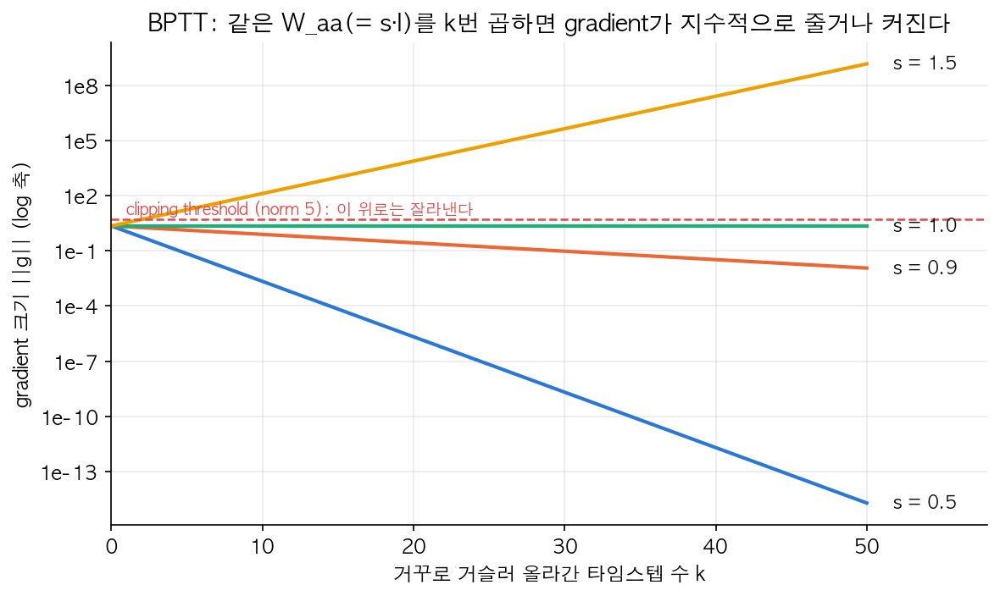

세로축이 **log scale**이라는 데 주의 — log scale에서 "매 스텝 같은 배율 곱하기"는 직선으로 보인다. $s=1.0$(초록)만 수평선이고, $s=1.5$(노랑)는 50 step 만에 $10^8$을 넘어 폭발, $s=0.5$(파랑)는 $10^{-15}$까지 떨어져 사실상 정보가 사라진다. 빨간 점선은 **gradient clipping threshold**(여기선 norm 5) — 이 선을 넘는 gradient는 방향은 그대로 두고 크기만 이 값으로 잘라낸다:

```python
# gradient clipping 개념 (의사코드)
if np.linalg.norm(gradient) > max_norm:
    gradient = gradient * max_norm / np.linalg.norm(gradient)
```

| 기호 | 의미 |
|---|---|
| `gradient` | 계산된 gradient 벡터(혹은 여러 파라미터의 gradient를 이어붙인 것) |
| `max_norm` | clipping 기준 threshold. 하이퍼파라미터, 보통 1~10 사이에서 실험적으로 고름. 너무 작으면 학습 신호 자체가 죽고, 너무 크면 clipping 효과가 없음 |
| `np.linalg.norm(gradient)` | gradient 벡터의 L2 norm(유클리드 길이) — "이 gradient가 전체적으로 얼마나 큰가"를 하나의 숫자로 요약 |

exploding은 이렇게 사후 처방(clipping)으로 다룰 수 있지만, vanishing은 애초에 "옛날 정보가 오래 살아남게" 구조 자체를 바꿔야 한다 — 그게 GRU/LSTM이다.

### GRU (Gated Recurrent Unit)

**이게 무엇인가**: "게이트가 달린 순환 유닛"이라는 이름대로, 매 타임스텝마다 "이 정보를 계속 기억할지, 새 정보로 덮어쓸지"를 **gate**(문/밸브라는 뜻 — 0~1 사이 값으로 정보를 얼마나 통과시킬지 조절하는 스위치)로 결정하게 만든 구조다.

**왜 필요한가**: 기본 RNN은 매 스텝 $a^{<t>}$ 전체를 $\tanh$로 새로 계산해버려서, 옛날 정보를 "그대로 보존"할 방법이 없다(항상 새 값과 섞인다). GRU는 "업데이트를 안 해도 되는 스텝에서는 옛날 값을 거의 그대로 통과시키는" 지름길을 만들어서 vanishing gradient를 완화한다. 직관: 문장 "The cat, which already ate a lot of food, **was** full"에서 "cat"이 단수라는 정보를 "was"가 나올 때까지 **memory cell**(기억을 담아두는 변수, 기호 $c$)에 담아두고 싶다 — 그 담아두는 스위치 역할을 하는 게 gate다.

**Simplified GRU** (직관 먼저, reset gate는 잠시 빼고):

$$\tilde{c}^{<t>} = \tanh(W_c [c^{<t-1>}, x^{<t>}] + b_c)$$
$$\Gamma_u = \sigma(W_u [c^{<t-1>}, x^{<t>}] + b_u)$$
$$c^{<t>} = \Gamma_u \odot \tilde{c}^{<t>} + (1 - \Gamma_u) \odot c^{<t-1>}$$

| 기호 | shape | 의미 |
|---|---|---|
| $c^{<t>}$ | $(n_a,)$ | memory cell — "지금까지 기억하고 있는 값". simplified GRU에서는 activation $a^{<t>}$과 사실상 같음 |
| $\tilde{c}^{<t>}$ | $(n_a,)$ | **후보(candidate) 값** — "만약 업데이트한다면 이 값으로 바꾸겠다"는 새 정보. $\tanh$라서 $-1\sim1$ |
| $\Gamma_u$ | $(n_a,)$, 각 원소 $0\sim1$ | **update gate** — "얼마나 새 값으로 업데이트할지"의 비율. $\sigma$(시그모이드)라서 항상 0~1 사이 |
| $W_c, W_u$ | 학습되는 가중치 행렬 | 후보값/게이트를 계산하는 파라미터 |
| $b_c, b_u$ | 학습되는 bias | 위와 동일 |
| $\odot$ | — | element-wise 곱(원소별로 각각 곱함, 행렬곱 아님) |

**왜 이 식이 vanishing gradient를 막는가**: $c^{<t>}$ 식은 $\tilde c^{<t>}$(새 값)와 $c^{<t-1>}$(옛날 값)을 $\Gamma_u$ 비율로 섞는 **가중 평균**이다. $\Gamma_u \approx 0$이면 $c^{<t>} \approx c^{<t-1>}$이 되어 **옛날 정보가 거의 그대로(항등함수처럼) 다음 스텝으로 복사**된다. 항등함수의 미분은 1이므로, gate가 닫혀있는 구간에서는 gradient도 거의 그대로(곱해져서 작아지지 않고) 통과한다 — 기본 RNN처럼 매번 $\tanh$와 $W_{aa}$를 통과하며 깎이는 게 아니라, gate로 만든 "우회로(shortcut)"를 타고 간다는 게 핵심이다.

**숫자로 확인**: update gate를 "옛날 값을 유지하는 비율" $(1-\Gamma_u)$로 보면, 이게 $t$번 연속으로 곱해질 때(=$t$ 스텝 동안 계속 gate가 닫혀있을 때) 남는 기억의 비율은:

| $1-\Gamma_u$ (유지 비율) | 100 step 뒤 남는 비율 |
|---|---|
| 0.5 | $0.5^{100} \approx 7.9\times10^{-31}$ (거의 즉시 소멸) |
| 0.9 | $0.9^{100} \approx 2.7\times10^{-5}$ (서서히 소멸) |
| **0.99** ($\Gamma_u=0.01$) | $0.99^{100} \approx 0.366$ (100 step 뒤에도 37%가 남음) |
| $\sigma(10)\approx0.99995$ | $\approx 0.995$ (거의 완벽히 보존) |

$\Gamma_u = 0.01$처럼 update gate가 거의 닫혀있으면(=거의 업데이트 안 함) 100 step을 지나도 처음 기억의 37%가 남아있지만, 기본 RNN처럼 매 스텝 $\tanh$로 새로 계산해버리면($1-\Gamma_u$가 없는 것과 같음) 몇 스텝 안에 거의 다 사라진다. **gate 값 하나 차이(0.9 vs 0.99)가 100 step 뒤에는 $10^4$배 차이**를 만든다는 게 이 표의 핵심 — gate가 왜 "vanishing gradient의 해결책"인지를 숫자로 보여준다.

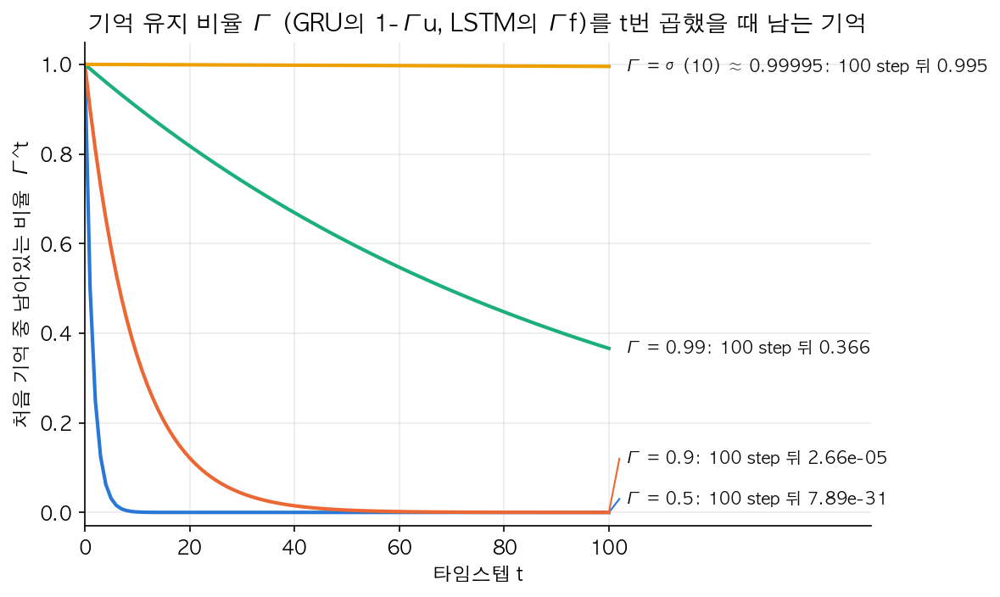

$\Gamma=0.5$(파랑)와 $0.9$(주황)는 20~40 step 안에 거의 0으로 떨어지지만, $0.99$(초록)는 100 step에서도 0.366이 남고, $\sigma(10)\approx0.99995$(노랑)는 거의 수평선에 가깝다 — 기울기 차이가 시간이 지날수록 기하급수적으로 벌어지는 걸 보여준다.

**Full GRU**는 여기에 **reset gate** $\Gamma_r$이 추가된다 — "새 후보값을 계산할 때 과거 정보($c^{<t-1>}$)를 얼마나 반영할지"를 조절하는 또 다른 gate:

$$\Gamma_r = \sigma(W_r [c^{<t-1>}, x^{<t>}] + b_r)$$
$$\tilde{c}^{<t>} = \tanh(W_c [\Gamma_r \odot c^{<t-1>}, x^{<t>}] + b_c)$$

| 기호 | 의미 |
|---|---|
| $\Gamma_r$ | reset gate. $\Gamma_r \approx 0$이면 새 후보값 계산 시 과거 정보를 거의 무시하고 현재 입력 $x^{<t>}$ 위주로 판단 |
| $W_r, b_r$ | reset gate의 학습 파라미터 |

기본 RNN에서는 $a^{<t>} = c^{<t>}$로 봐도 된다(GRU에선 activation과 memory cell이 개념적으로 같은 것, LSTM은 다르다 — 아래에서 구분).

### LSTM (Long Short-Term Memory)

**이게 무엇인가**: "긴 기간의(Long) 짧은 기간 기억(Short-Term Memory)"이라는 다소 역설적인 이름은 — 기본 RNN의 $a^{<t>}$가 매 스텝 지워지는 "단기 기억"이라면, LSTM은 그 단기 기억을 "오래 유지할 수 있게" 만들었다는 뜻이다. GRU보다 먼저 나온(1997년), 더 강력하고 일반적인 구조다. Gate가 3개(update, forget, output)고, **memory cell** $c^{<t>}$와 **activation** $a^{<t>}$을 분리해서 관리한다(GRU는 이 둘을 사실상 같은 것으로 취급했던 것과 다른 점).

$$\tilde{c}^{<t>} = \tanh(W_c [a^{<t-1>}, x^{<t>}] + b_c)$$
$$\Gamma_u = \sigma(W_u [a^{<t-1>}, x^{<t>}] + b_u)$$
$$\Gamma_f = \sigma(W_f [a^{<t-1>}, x^{<t>}] + b_f)$$
$$\Gamma_o = \sigma(W_o [a^{<t-1>}, x^{<t>}] + b_o)$$
$$c^{<t>} = \Gamma_u \odot \tilde{c}^{<t>} + \Gamma_f \odot c^{<t-1>}$$
$$a^{<t>} = \Gamma_o \odot \tanh(c^{<t>})$$

| 기호 | 의미 |
|---|---|
| $\Gamma_u$ | **update gate** — 새 후보값 $\tilde c^{<t>}$를 얼마나 반영할지 |
| $\Gamma_f$ | **forget gate** — 옛날 memory $c^{<t-1>}$을 얼마나 유지할지("잊을지"의 반대) |
| $\Gamma_o$ | **output gate** — memory $c^{<t>}$ 중 얼마나를 바깥(activation)으로 내보낼지 |
| $\tilde c^{<t>}$ | 새로 들어올 후보 정보 |
| $c^{<t>}$ | memory cell — 내부적으로 유지되는 "장기 기억" |
| $a^{<t>}$ | activation — 다음 스텝과 출력층으로 나가는 "지금 시점에 공개된 기억" |

GRU와의 차이가 핵심: GRU는 $\Gamma_u$와 $(1-\Gamma_u)$로 update/forget 비율이 **항상 합이 1이 되도록 묶여** 있지만(하나의 게이트로 "새로 채우는 양"과 "유지하는 양"이 자동으로 상보적), LSTM은 $\Gamma_u$와 $\Gamma_f$가 **독립적인 별개 게이트**라서 "새 정보도 많이 받아들이면서 옛날 정보도 많이 유지"하거나 "둘 다 조금씩만" 같은 조합이 가능하다 — 더 유연하지만 파라미터도 더 많다(게이트 3개 vs 2개).

GRU는 파라미터가 적고 계산이 가벼워서(큰 모델을 쌓기 유리) 상대적으로 단순하고, LSTM은 게이트가 독립적이라 더 유연하고 역사적으로 default 선택지였다. 실무 기준: 요즘은 대부분 GRU/LSTM 둘 다 시도해보고 데이터로 고르거나, 아예 Transformer(Week4) 계열로 넘어가는 경우가 많다 — 정답은 없다.

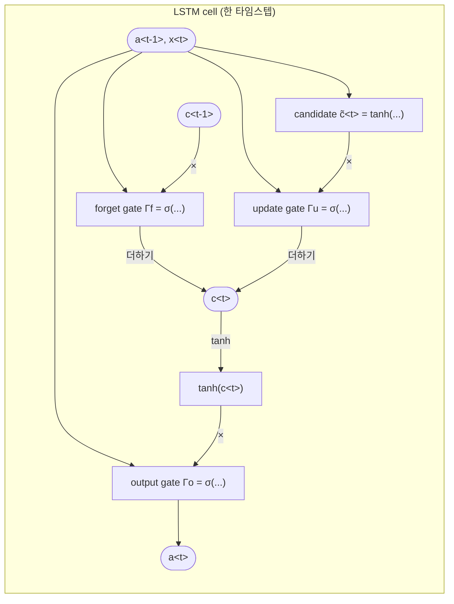

### Bidirectional RNN (BRNN)

**이게 무엇인가**: 한 방향(과거→미래)만 보는 한계를 풀려고, **정방향(forward) RNN**과 **역방향(backward) RNN**을 둘 다 돌려서 매 타임스텝 출력에서 두 방향의 activation을 합치는(concat) 구조다.

**왜 필요한가**: "Teddy bears are on sale" vs "Teddy Roosevelt was a president"에서 "Teddy"가 이름인지 판단하려면 그 뒤에 나오는 "bears"나 "Roosevelt"를 봐야 한다 — 단방향 RNN은 구조적으로 이게 불가능하다.

$$\hat{y}^{<t>} = g\big(W_y [\overrightarrow{a}^{<t>}, \overleftarrow{a}^{<t>}] + b_y\big)$$

| 기호 | 의미 |
|---|---|
| $\overrightarrow{a}^{<t>}$ | **정방향** RNN의 $t$번째 activation ($x^{<1>}$부터 $x^{<t>}$까지 본 정보) |
| $\overleftarrow{a}^{<t>}$ | **역방향** RNN의 $t$번째 activation ($x^{<T_x>}$부터 $x^{<t>}$까지 거꾸로 본 정보) |
| $[\overrightarrow{a}^{<t>}, \overleftarrow{a}^{<t>}]$ | 두 벡터를 이어붙인 것 — $t$ 시점에서 "과거 전체 + 미래 전체" 정보를 모두 가진 벡터 |

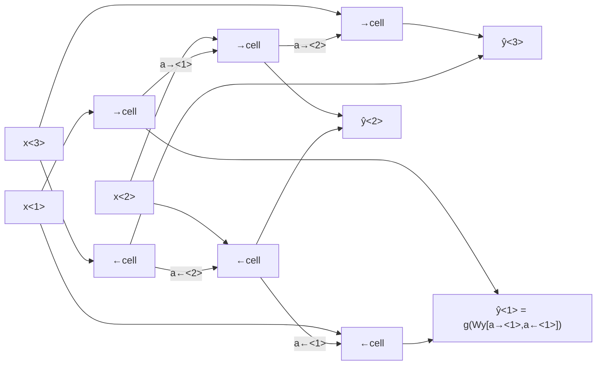

NER처럼 문장 전체를 다 보고 판단해도 되는 문제(offline)에는 아주 잘 맞는다. 단점은 예측하려면 **전체 시퀀스가 다 있어야** 한다는 것 — 역방향 RNN은 $x^{<T_x>}$까지 다 읽어야 $\overleftarrow a^{<1>}$을 계산할 수 있으니, 실시간 음성인식처럼 스트리밍이 필요한 곳엔 그대로 못 쓴다(더 복잡한 방식이 필요).

### Deep RNN

**이게 무엇인가**: 표준 신경망에서 레이어를 여러 층 쌓듯이, RNN도 "층"을 여러 개 쌓을 수 있다. 표기: $a^{[l]<t>}$ = $l$번째 layer, $t$번째 타임스텝의 activation. 각 층은 아래 층의 출력을 입력으로 받으면서, 동시에 자기 층 안에서는 시간 방향으로도 연결된다.

$$a^{[l]<t>} = g\Big(W_a^{[l]} [a^{[l]<t-1>}, a^{[l-1]<t>}] + b_a^{[l]}\Big)$$

| 기호 | 의미 |
|---|---|
| $a^{[l]<t>}$ | $l$번째 layer, $t$번째 타임스텝의 activation |
| $a^{[l-1]<t>}$ | 바로 아래 층의 같은 타임스텝 activation (첫 층이면 $a^{[0]<t>} = x^{<t>}$) |
| $a^{[l]<t-1>}$ | 같은 층의 이전 타임스텝 activation (시간 방향 연결) |
| $W_a^{[l]}, b_a^{[l]}$ | $l$번째 층 고유의 학습 파라미터 (층마다 따로 있음, 타임스텝끼리는 공유) |

```mermaid
flowchart BT
    x1["x&lt;1&gt;"] --> L1a["Layer1 cell"]
    x2["x&lt;2&gt;"] --> L1b["Layer1 cell"]
    L1a -->|a[1]&lt;1&gt;| L1b
    L1a --> L2a["Layer2 cell"]
    L1b --> L2b["Layer2 cell"]
    L2a -->|a[2]&lt;1&gt;| L2b
    L2a --> FC1["FC layer → ŷ&lt;1&gt;"]
    L2b --> FC2["FC layer → ŷ&lt;2&gt;"]
```

다만 시퀀스 방향으로도 이미 "깊은" 계산이라(타임스텝 수만큼 이미 펼쳐지므로) 3층 정도만 쌓아도 파라미터가 많아지고 학습이 무거워진다 — 그래서 보통 RNN layer를 2~3개 쌓은 뒤, 맨 위에 (시퀀스 축이 없는) 일반 fully-connected layer를 얹는 식으로 마무리하는 경우가 많다.

*(Lab 1: RNN forward + gradient clipping, Lab 2: LSTM/GRU 셀 구현과 gate retention 실험로 이어짐)*

---

## Week 2. Word Embeddings

### One-hot 표현의 한계

Week1에서 쓴 one-hot vector는 단어 간 **유사도 개념이 전혀 없다** — "orange"와 "apple"의 one-hot 벡터끼리 내적(inner product, 같은 위치 원소를 곱해서 다 더한 값)을 해도 0이다(서로 다른 위치가 1이니까). 즉 모델 입장에서 두 단어가 비슷한 단어라는 걸 전혀 알 수 없다. "I want a glass of orange ___"를 학습해도 그 지식이 "I want a glass of apple ___"로 전혀 일반화가 안 된다.

### Featurized representation → Word embedding

**이게 무엇인가**: 각 단어를 0/1 하나만 켜진 sparse 벡터 대신, **여러 개의 의미 특징(feature) 값을 가진 dense(빽빽한) 벡터**로 표현하자는 아이디어. "임베딩(embedding)"이라는 이름은 "단어를 (저차원) 벡터 공간에 심어 넣는다"는 뜻에서 왔다. 예를 들어 Gender, Royal, Age, Food 같은 축(실제로는 학습되는 추상적인 축이라 사람이 이름 붙인 게 아니라 사후에 대략 이런 의미로 보인다는 것)에서 "King"과 "Queen"은 Royal 축에서 비슷하고 Gender 축에서 다르다, "Apple"과 "Orange"는 Food 축에서 비슷하다 — 이런 식으로 저차원(보통 50~300차원) 실수 벡터에 의미를 녹여낸 게 **word embedding**이다.

**왜 필요한가**: one-hot과 정반대로, 벡터끼리의 "거리/각도"가 실제 의미 유사도와 상관관계를 갖게 만들어서, 한 단어에서 배운 패턴이 비슷한 단어로 자연스럽게 일반화되게 하려는 것.

| 기호 | 의미 |
|---|---|
| $e_w$ | 단어 $w$의 embedding 벡터 (보통 $d=50\sim300$차원) |
| $d$ | embedding 차원. 하이퍼파라미터 — 크면 표현력↑ 계산/메모리↑, 작으면 일반화는 쉬워도 세밀한 구분이 어려워질 수 있음 |

t-SNE(고차원 벡터를 2D/3D로 억지로 눌러서 사람이 볼 수 있게 하는 차원축소 기법) 같은 걸로 이 임베딩들을 2D에 뿌려보면 비슷한 의미의 단어들이 실제로 뭉쳐있는 걸 볼 수 있다.

### Word embedding과 transfer learning

절차:
1. 아주 큰 텍스트 corpus(웹 텍스트 등, 1B~100B 단어급)에서 word embedding을 미리 학습(**pre-train**)한다.
2. 이 임베딩을 상대적으로 작은 labeled 데이터셋(예: NER, 라벨링에 사람 손이 필요해서 데이터가 적음)에 **transfer**한다 — 즉 처음부터 랜덤 초기화하지 않고 이 임베딩으로 시작한다.
3. (선택) 작은 데이터셋 태스크에서 임베딩을 추가로 **fine-tuning**한다 — 단, task용 데이터셋이 충분히 클 때만(너무 작으면 fine-tuning이 오히려 pre-train된 좋은 표현을 망가뜨릴 수 있다).

이건 Course 4의 face recognition encoding(Siamese network 등)이랑 개념이 비슷하다 — 미리 학습된 표현을 가져다 쓴다는 점에서. 큰 데이터로 학습한 일반적인 언어 지식을 작은 task로 옮기는 전형적인 **transfer learning** 사례다.

### 유추(analogy) 문제와 cosine similarity

Word embedding의 유명한 성질: $e_{man} - e_{woman} \approx e_{king} - e_{queen}$. 즉 "man : woman = king : ?"을 풀 때, $e_{king} - e_{man} + e_{woman}$과 가장 유사한 벡터를 embedding 공간에서 찾으면 된다 — "man→woman"으로 가는 방향(벡터 차이)과 "king→queen"으로 가는 방향이 (성별이라는 같은 의미 축을 나타내니까) 거의 같은 방향이라는 성질을 이용하는 것.

**유사도를 어떻게 재나 — cosine similarity**: "이게 무엇인가" — 두 벡터 $u, v$ 사이의 **각도**가 얼마나 가까운지를 재는 지표다(내적을 두 벡터의 길이로 나눠서 크기 영향을 없앤 것).

$$\text{sim}(u, v) = \cos\theta = \frac{u \cdot v}{\|u\| \|v\|}$$

| 기호 | 의미 |
|---|---|
| $u \cdot v$ | 내적, $\sum_i u_i v_i$ |
| $\|u\|, \|v\|$ | 각 벡터의 L2 norm(길이), $\|u\| = \sqrt{\sum_i u_i^2}$ |
| $\theta$ | 두 벡터 사이의 각도 |
| 결과 범위 | $-1$(정반대 방향) ~ $1$(완전히 같은 방향), $0$이면 직교(무관) |

**왜 유클리드 거리 대신 cosine similarity를 쓰나**: 유클리드 거리($\|u-v\|$)는 벡터의 "크기(magnitude)"에 민감하다 — 같은 방향이라도 한쪽이 길이만 2배면 거리가 커진다. 반면 cosine similarity는 분모에서 $\|u\|,\|v\|$로 나눠버려서 **방향(의미)만 비교**하고 크기 차이는 무시한다. 단어 임베딩에서는 벡터의 절대 길이보다 "어느 방향을 가리키는가"가 의미를 담고 있어서 cosine을 선호한다.

**숫자 예시**: $u=(1,2,3)$, $v=(2,4,6.1)$(거의 같은 방향, $v \approx 2u$)이면 $\cos = \dfrac{1\cdot2+2\cdot4+3\cdot6.1}{\sqrt{14}\sqrt{4+16+37.21}} \approx 0.99997$ — 거의 1. 반대로 $w=(1,0,0)$과는 $\cos(u,w) = \dfrac{1}{\sqrt{14}\cdot1} \approx 0.267$로 훨씬 낮다(방향이 많이 다름).

Lab 3의 5차원 toy 임베딩([gender, royal, age, food, occupation])으로 확인해보면 cos(apple, orange) $\approx 0.999$(둘 다 food 축으로 몰려있어 거의 같은 방향)인데 cos(apple, king) $\approx -0.01$(관련 없는 축이라 거의 직교)이다. 아래 그림은 2차원으로 단순화한 toy 임베딩에서 이 analogy 성질을 직접 눈으로 확인한 것이다.

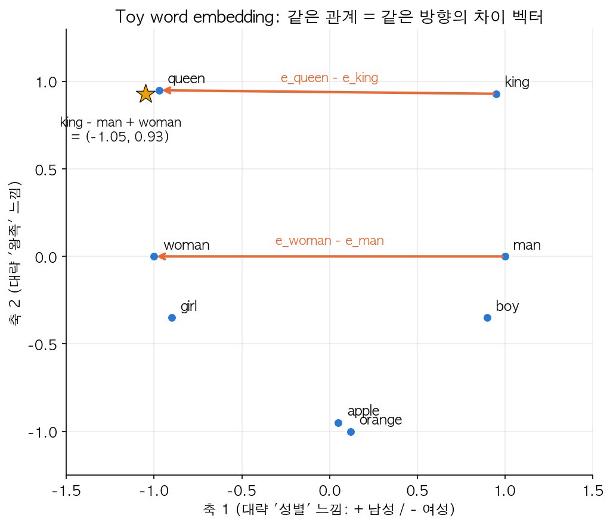

두 주황 화살표(man→woman, king→queen)가 거의 평행하다 — "성별을 뒤집는다"는 같은 의미 연산이 두 단어쌍에서 같은 벡터 이동으로 나타난다는 뜻이다. 별표(★)는 $e_{king} - e_{man} + e_{woman} = (-1.05, 0.93)$의 위치로, 실제 $e_{queen} \approx (-0.97, 0.95)$ 바로 옆이다 — "king에서 남성 성분을 빼고 여성 성분을 더하면 queen 근처로 간다"는 게 그림으로 확인된다.

### Embedding matrix

**이게 무엇인가**: 사전의 모든 단어의 embedding 벡터를 한 행렬에 모아둔 것. Vocabulary 크기가 $V$(사전 단어 수), 임베딩 차원이 $d$라면 embedding matrix $E$는 $(d, V)$ shape이고, 그 $j$번째 열(column)이 사전의 $j$번째 단어의 embedding이다.

$$e_w = E \cdot o_w$$

| 기호 | shape | 의미 |
|---|---|---|
| $E$ | $(d, V)$ | embedding matrix. **학습되는 파라미터** — 처음엔 랜덤 초기화, 학습 과정에서 값이 채워짐 |
| $o_w$ | $(V,)$ | 단어 $w$의 one-hot vector |
| $e_w$ | $(d,)$ | 단어 $w$의 embedding 벡터. $E o_w$는 정확히 $E$의 $w$번째 열을 뽑아내는 연산과 같다(one-hot이 그 열만 1이고 나머지는 0이라 행렬곱 결과가 그 열 그대로 나옴) |

실제 구현에서는 $E$와 one-hot의 행렬곱을 그대로 계산하지 않고(사전 크기 $V$가 수만이라 대부분 0을 곱하는 낭비), $E$에서 해당 열(column)을 그냥 **lookup(인덱싱)** 한다 — Keras의 `Embedding` layer가 내부적으로 이렇게 동작한다.

```python
# Keras 예시
from tensorflow.keras.layers import Embedding
embedding_layer = Embedding(input_dim=vocab_size, output_dim=embedding_dim)
```

### 학습 방법들

**1) Neural language model 방식**: 앞의 몇 단어(context)로 다음 단어를 예측하는 신경망을 학습하면서 그 과정에서 $E$가 같이 학습된다(word2vec 이전의 초기 접근, Bengio et al. 2003). "다음 단어 예측"이라는 감독학습(supervised) 문제를 푸는 부산물로 embedding이 얻어진다는 게 핵심 아이디어 — 이후 방법들이 다 이 발상을 변형한 것이다.

**2) Word2Vec — Skip-gram**: **이게 무엇인가** — 문장에서 하나의 단어를 **context(문맥)**로 잡고, 그 주변(window, 앞뒤로 몇 단어까지 볼지) 단어들을 **target**으로 예측하도록 학습하는 방식이다. 예: "I want a glass of orange juice to go along with my cereal"에서 context="orange"로 target="juice", "glass" 등을 예측하도록(정답을 이미 알고 있으니 학습 가능) 학습 쌍을 만든다.

$$P(t \mid c) = \frac{e^{\theta_t^T e_c}}{\sum_{j=1}^{V} e^{\theta_j^T e_c}}$$

| 기호 | 의미 |
|---|---|
| $c$ | context 단어의 인덱스 |
| $t$ | target 단어의 인덱스 |
| $e_c$ | context 단어의 embedding 벡터 |
| $\theta_t$ | target이 $t$일 때 쓰이는, target 단어마다 따로 있는 파라미터 벡터(softmax의 "출력층 가중치"에 해당). $e_c$와 별개로 학습되는 또 다른 파라미터 행렬 |
| 분모 $\sum_j$ | 사전의 **모든** 단어 $j$에 대해 합 — 이게 softmax를 "정규화된 확률"로 만들어주는 부분 |

**문제점**: vocabulary $V$가 수만~수십만이면 이 softmax 분모 계산이 매 학습 스텝마다 너무 비싸다(단어 하나 예측할 때마다 사전 전체를 훑어야 함). 해결책으로 **hierarchical softmax**(단어들을 이진 트리로 배치해서 $O(V)$ 대신 $O(\log V)$ 연산으로 줄임)를 쓰기도 하지만 구현이 복잡하고, 실무에서 더 널리 쓰인 건 아래 negative sampling이다.

**3) Negative sampling**: **이게 무엇인가** — skip-gram의 무거운 (사전 전체를 보는) softmax를, 여러 개의 **binary classification**(이진 분류) 문제로 바꾼 것. (context, target) 단어 쌍이 실제 문장에서 나온 "진짜(positive)" 쌍인지 아닌지를 로지스틱 회귀로 맞히는 문제로 재정의한다.

$$P(\text{positive} \mid c, t) = \sigma(\theta_t^T e_c)$$

**학습 방식**: 매 학습 스텝마다 진짜 (context, target) positive 쌍 1개와, 사전에서 무작위로 뽑은 (context, 랜덤 단어) negative 쌍 $k$개를 만들어서, positive는 라벨 1로 negative는 라벨 0으로 두고 $k+1$개의 binary classification을 학습한다.

| 기호 | 의미 |
|---|---|
| $k$ | 하나의 positive 쌍마다 만드는 negative 샘플 개수. 하이퍼파라미터 — 작은 데이터셋은 $k=5\sim20$(데이터가 적으니 negative를 많이 뽑아 신호를 보강), 큰 데이터셋은 $k=2\sim5$(데이터 자체가 많아 적은 negative로도 충분) |

**왜 훨씬 가벼운가**: 원래 softmax는 매 스텝마다 사전 크기 $V$짜리 확률분포를 정규화해야 했지만, negative sampling은 매 스텝 $k+1$개짜리 작은 binary classification만 풀면 된다 — $V$가 수만이어도 $k+1$은 보통 몇 개~몇십 개.

**Negative 단어 샘플링 분포**: 균등분포(모든 단어 동일 확률)로 뽑으면 "the", "of" 같은 흔한 단어가 negative로도 잘 안 뽑혀서 비효율적이고, 코퍼스 등장 빈도 그대로 뽑으면 반대로 흔한 단어만 계속 뽑혀서 학습이 편중된다. 경험적으로 좋은 성능을 낸다고 알려진 절충안은:

$$P(w_i) = \frac{f(w_i)^{3/4}}{\sum_{j=1}^{V} f(w_j)^{3/4}}$$

| 기호 | 의미 |
|---|---|
| $f(w_i)$ | 코퍼스에서 단어 $w_i$가 등장한 빈도(횟수 혹은 비율) |
| $3/4$ 제곱 | 빈도를 "눌러서" 아주 흔한 단어의 확률은 낮추고 드문 단어의 확률은 살짝 올리는 보정(heuristic). 이론적 유도라기보다 word2vec 논문의 실험적 결정 |

**4) GloVe (Global Vectors)**: 개념만 — 코퍼스 전체에서 단어 $i$, $j$가 함께 등장한 횟수 $X_{ij}$(co-occurrence count, "동시 등장 횟수")를 미리 계산해두고, $\theta_i^T e_j$가 $\log X_{ij}$를 잘 근사하도록 학습하는 방식이다.

| 기호 | 의미 |
|---|---|
| $X_{ij}$ | 단어 $i$가 context, 단어 $j$가 target으로 (또는 그 반대로) 코퍼스 전체에서 함께 등장한 횟수 |
| $\theta_i, e_j$ | 각각 단어 $i$, $j$의 (학습되는) 파라미터/임베딩 벡터 |

Skip-gram/negative sampling처럼 슬라이딩 윈도우로 매번 샘플링하지 않고, 통계($X_{ij}$)를 미리 다 세어두고 그걸 직접 근사하도록 회귀(regression)하듯 학습한다는 점이 다르다. Word2Vec보다 간단하면서 비슷하게 잘 작동해서 많이 쓰였다.

(참고: 요즘 실무에서는 word2vec/GloVe 같은 고정(static) 임베딩 — 같은 단어는 문맥과 무관하게 항상 같은 벡터 — 보다, Week4에서 다룰 Transformer 기반 **contextual embedding**(같은 단어도 문맥에 따라 다른 벡터, BERT 등)이 대세지만, 이 코스 범위상 static embedding까지만 다룬다.)

### Sentiment classification

문장 → 별점(1~5) 같은 many-to-one 문제. 간단 버전: 문장의 각 단어 임베딩을 평균/합산해서 softmax에 넣는 방식도 있지만, 단어 **순서**를 무시하기 때문에 "completely lacking in good taste, good service, and good ambiance" 같은 문장에서 "good"이 여러 번 나온다고 긍정으로 오분류하기 쉽다. 더 나은 방법은 RNN(many-to-one)에 임베딩 시퀀스를 그대로 넣는 것 — 순서 정보를 살릴 수 있다. 그리고 word embedding을 큰 corpus에서 pre-train해서 가져오면, sentiment 데이터셋 자체는 작아도(별점 라벨링은 비용이 드니까) 학습이 잘 된다 — 이게 transfer learning의 실전 이득이다.

### 임베딩의 편향(bias) 제거

**무슨 문제인가**: 큰 텍스트 corpus로 학습하다 보니, embedding이 "Man : Computer_Programmer = Woman : Homemaker" 같은 성별/인종 편향을 (사람 사회의 텍스트에 이미 있던 편향을) 그대로 학습해버린다.

**대응 절차**:
1. **Bias 방향 찾기**: "he"-"she", "male"-"female" 같은 단어쌍들의 차이 벡터를 평균(또는 SVD)으로 구해 bias 방향 $g$를 얻는다. 예: $g = \text{mean}(e_{he}-e_{she},\ e_{man}-e_{woman}, \dots)$
2. **Neutralize (중립화)**: bias와 무관해야 할 단어들(예: "doctor", "babysitter")을 $g$ 방향 성분을 제거해서 그 축에서 완전히 중립으로 만든다.
3. **Equalize (동등화)**: bias가 있어도 되는 쌍(예: "grandmother"-"grandfather")은 $g$ 축을 기준으로 대칭이 되도록 나머지 성분은 같게, $g$ 축 성분만 크기가 같고 부호만 반대가 되게 조정한다.

**Neutralize 수식**: 벡터 $e$에서 $g$ 방향의 성분(투영, projection)을 빼는 것.

$$e^{\text{bias\_component}} = \frac{e \cdot g}{\|g\|^2} g, \qquad e^{\text{debiased}} = e - e^{\text{bias\_component}}$$

| 기호 | 의미 |
|---|---|
| $e \cdot g / \|g\|^2$ | $e$를 $g$ 방향으로 투영했을 때의 (스칼라) 계수 — "$e$가 $g$ 방향으로 얼마나 뻗어 있는가" |
| $e^{\text{bias\_component}}$ | $e$ 중에서 순수하게 $g$ 방향인 성분(벡터) |
| $e^{\text{debiased}}$ | 그 성분을 뺀 나머지 — $g$와 직교(내적 0)하는 벡터, 즉 bias 축에서 완전히 중립 |

Lab 3에서 이 식으로 "doctor"(neutralize 전 $g$와의 cos $\approx+0.22$, 남성 쪽으로 치우침) → neutralize 후 $0.000$으로 정확히 직교하게 되는 걸 확인한다. 완벽한 해결책은 아니지만(bias 방향 하나로 모든 편향을 잡을 수 없고, 어떤 단어를 neutralize할지도 사람이 정해야 함), 모델이 사회적 편향을 그대로 증폭시키지 않도록 하는 실무적으로 중요한 단계다.

*(Lab 3: cosine similarity, analogy, neutralize/equalize 구현)*

---

## Week 3. Sequence-to-Sequence & Attention

### Seq2seq (Encoder-Decoder)

**이게 무엇인가**: 기계번역, 이미지 캡셔닝처럼 입출력 길이가 다른(many-to-many, $T_x \ne T_y$) 문제에 쓰는 구조. 두 개의 RNN을 이어붙인다 — **Encoder** RNN이 입력 시퀀스를 처음부터 끝까지 다 읽어서 그 정보를 하나의 고정 크기 벡터(**context**)로 압축하고, 그 벡터를 초기 상태로 받은 **Decoder** RNN이 출력 시퀀스를 한 단어씩 순서대로 생성한다.

```mermaid
flowchart LR
    subgraph Encoder
        direction LR
        e1["Jane"] --> ec1["cell"] --> ec2["cell"]
        e2["visite"] --> ec2 --> ec3["cell"]
        e3["l'Afrique ..."] --> ec3
    end
    ec3 -->|context 벡터<br/>(encoder 마지막 a)| Decoder
    subgraph Decoder
        direction LR
        dc1["cell"] --> dc2["cell"] --> dc3["cell → ..."]
        dc1 --> dy1["Jane"]
        dc2 --> dy2["visits"]
        dc3 --> dy3["Africa ..."]
        dy1 -.다음 입력으로.-> dc2
        dy2 -.다음 입력으로.-> dc3
    end
```

### 기계번역 = Conditional language model

Week1의 language model이 $P(y^{<1>}, \dots, y^{<T_y>})$를 모델링했다면, 번역은 입력 문장 $x$가 주어졌을 때의 조건부 확률 $P(y^{<1>}, \dots, y^{<T_y>} \mid x)$을 모델링하는 것 — 그래서 "**conditional** language model"이라고 부른다. Decoder 부분 구조는 language model이랑 거의 같고, 다른 건 시작 벡터가 $\vec{0}$이 아니라 encoder의 context라는 점뿐이다.

### Greedy search의 문제와 Beam search

**무슨 문제인가**: Language model 샘플링처럼 매 스텝 가장 확률 높은 단어 하나만 고르는 **greedy decoding**은 번역에서 최적이 아니다 — 번역의 목표는 전체 문장 확률 $\prod_t P(y^{<t>}\mid x, y^{<1>},\dots,y^{<t-1>})$을 최대화하는 문장을 찾는 것인데, 매 스텝 지역적으로(locally) 가장 그럴듯한 단어를 고른다고 해서 전체 곱이 최대가 되는 문장이 나온다는 보장은 없다(뒤에 더 좋은 선택지가 있어도 못 본다).

**Beam search란**: 매 스텝마다 확률이 높은 상위 $B$개의 "후보 문장(빔)"을 동시에 유지하면서 진행하는 탐색 방법이다.

| 기호 | 의미 |
|---|---|
| $B$ | **beam width**. 매 스텝 유지하는 후보 개수. 하이퍼파라미터 — $B=1$이면 정확히 greedy search와 같다. 클수록 더 좋은 문장을 찾을 확률은 높아지지만 메모리·속도 비용이 $B$에 비례해서 커진다 |

**진행 방식**:
- Step 1: 첫 단어 후보 중 확률 top $B$개를 유지.
- Step 2: 각 후보 뒤에 올 수 있는 다음 단어를 다 계산해서(후보 $B$개 × 사전 크기 $V$개 = $B\times V$개 조합), 누적 확률(로그 확률의 합) 기준 다시 top $B$개만 남긴다.
- `<eos>`가 나올 때까지(또는 최대 길이까지) 반복.

**Lab 4 확률표로 본 예시** (toy vocab, "Jane visite l'Afrique en septembre" 번역): greedy는 매 스텝 확률이 큰 단어("going" 0.5 > "visiting" 0.4)만 따라가서 최종적으로 `jane is going to september`, 문장 전체 확률 $P\approx0.1485$를 만든다. beam ($B=3$)은 "going"뿐 아니라 "visiting" 후보도 같이 들고 가다가, step 4에서 `jane is visiting africa`( 누적 $0.9\times1.0\times0.4\times0.95=0.342$)가 `jane is going to`(누적 $0.9\times1.0\times0.5\times0.6=0.27$)보다 높아지면서 역전된다. 최종적으로 `jane is visiting africa in september`, $P\approx0.3078$ — greedy보다 두 배 이상 높은 확률의 문장을 찾아낸다.

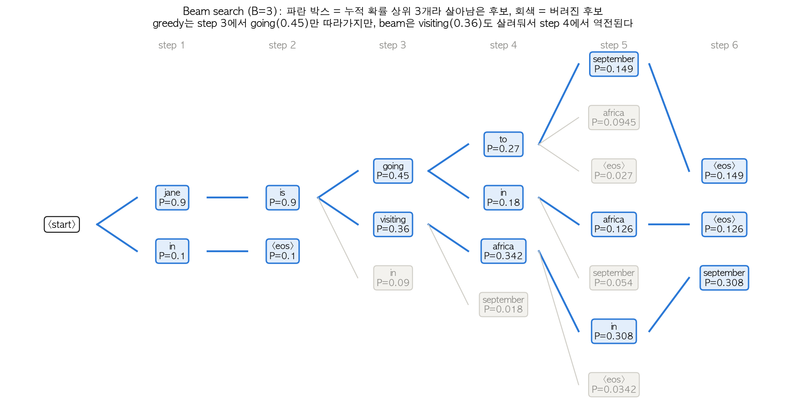

각 노드는 "지금까지의 단어 + 그 시점까지의 누적 확률"이다. step 3에서 파란 박스(살아남은 것)가 "going"(0.45)과 "visiting"(0.36) 둘 다인 게 핵심 — greedy였다면 "going"만 남기고 "visiting"은 그 즉시 버려졌을 것이다. step 4에서 "africa"(0.342, visiting 경로)가 "to"(0.27, going 경로)를 역전하면서, beam이 아니었다면 못 찾았을 더 좋은 문장을 찾아낸다.

**Length normalization**: 확률을 그대로 곱하면(0~1 사이 값들의 곱) 문장이 길어질수록 값이 계속 작아져서 (1) numerical underflow(컴퓨터가 표현 못 할 정도로 작은 수가 됨)가 나고, (2) beam search가 짧은 문장을 무조건 유리하게 취급하는 편향이 생긴다. 그래서 실제로는 확률의 곱 대신 **로그 확률의 합**을 쓰고(곱셈이 덧셈이 되어 underflow 방지, $\log(ab)=\log a+\log b$), 문장 길이로 정규화한다:

$$\text{score} = \frac{1}{T_y^{\alpha}} \sum_{t=1}^{T_y} \log P(y^{<t>} \mid x, y^{<1>}, \dots, y^{<t-1>})$$

| 기호 | 의미 |
|---|---|
| $T_y$ | 후보 문장의 길이(단어 수) |
| $\alpha$ | 정규화 세기를 정하는 하이퍼파라미터. $\alpha=0$이면 정규화 없음(그냥 로그확률 합, 짧은 문장 유리), $\alpha=1$이면 완전히 "단어당 평균 로그확률"(문장 길이를 거의 무시), 보통 $\alpha\approx0.7$을 써서 그 중간(softer normalization) |

**숫자로 확인**: 후보 A(3단어, 단어당 $P=0.5$)와 후보 B(6단어, 단어당 $P=0.7$)를 비교하면:

| $\alpha$ | A의 score | B의 score | 승자 |
|---|---|---|---|
| 0 (정규화 없음) | $3\log0.5=-2.079$ | $6\log0.7=-2.140$ | A (짧아서 유리) |
| 0.7 | $-2.079/3^{0.7}=-0.964$ | $-2.140/6^{0.7}=-0.611$ | B |
| 1 (단어당 평균) | $-2.079/3=-0.693$ | $-2.140/6=-0.357$ | B |

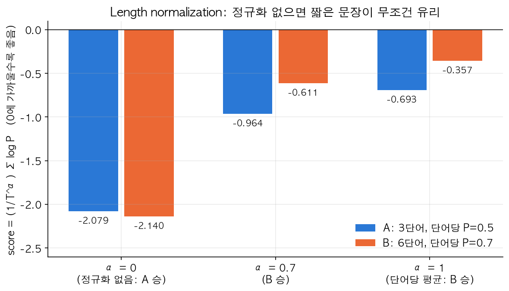

정규화가 없으면($\alpha=0$) 단어당 확률이 더 낮은(0.5 < 0.7) A가 오히려 이긴다 — 순전히 "짧아서" 유리한 것. $\alpha$를 올릴수록 "단어당 평균적으로 얼마나 그럴듯한가"를 더 많이 반영해서 실제로 더 자연스러운(단어당 확률이 높은) B가 이기게 된다.

실무에서는 $B=10$ 정도가 흔하고, 연구용으로 $B=1000\sim3000$까지 쓰기도 한다. Beam search는 (BFS/DFS 같은) **exact search가 아니라 근사(approximate) search**라는 걸 기억해두면 좋다 — 최적해를 보장하지 않는다(매 스텝 top $B$만 남기고 나머지를 버리므로, 버려진 후보 중에 진짜 최적해로 가는 길이 있었을 수도 있다).

### Error analysis: RNN 탓인가 Beam search 탓인가

번역 결과가 이상할 때, 문제가 RNN(모델 자체가 나쁜 문장을 그럴듯하다고 학습함)인지 beam search(탐색 폭이 좁아서 좋은 후보를 놓침)인지 구분하는 방법: 사람이 만든 정답 번역 $y^*$와 모델이 만든 번역 $\hat{y}$에 대해, 학습된 모델로 $P(y^* \mid x)$와 $P(\hat{y} \mid x)$를 각각 계산해서 비교한다.

- $P(y^*) > P(\hat{y})$인데 모델이 $\hat{y}$를 골랐다면 → **beam search가 문제** (모델 입장에서는 더 좋은 후보($y^*$)가 있었는데 탐색 폭이 좁아 못 찾은 것 — beam width $B$를 키우면 개선될 가능성이 높음)
- $P(y^*) \le P(\hat{y})$라면 → **RNN(모델)이 문제** (beam search는 자기가 할 수 있는 한 최선을 다해 $\hat y$를 찾았는데, 모델 자체가 $y^*$보다 $\hat y$를 더 그럴듯하다고 잘못 학습된 것 — 모델 구조/데이터/정규화 개선이 필요, beam width를 키워봐야 소용없음)

이런 식으로 여러 오류 샘플을 분석해서 어느 쪽 문제가 더 많은지 비율을 보고 개선 방향을 정한다.

### BLEU score

**이게 무엇인가**: **B**i**l**ingual **E**valuation **U**nderstudy의 약자로, 기계번역 문장이 사람이 쓴 정답(reference) 번역과 얼마나 겹치는지를 0~1(또는 0~100) 사이 점수로 자동 계산하는 지표다.

**왜 필요한가**: 번역 품질을 사람이 일일이 평가하는 건 느리고 비용이 크다 — 자동으로, 빠르게, 일관되게 여러 모델/설정을 비교할 수 있는 단일 숫자 지표가 필요하다.

**Modified n-gram precision**: 먼저 **n-gram**이란 연속된 $n$개의 단어 묶음이다(1-gram=단어 하나, 2-gram=연속 두 단어). 기본 아이디어는 "후보 문장의 n-gram들이 reference 문장에 몇 개나 등장하는가"의 비율(precision)을 재는 것인데, 그냥 재면 허점이 있다 — reference가 "the cat is on the mat"(the가 2번)일 때 후보로 "the the the the the the the"(the만 7번)를 내면 모든 the가 reference에 "등장"하니 naive precision이 100%가 되어버린다. 그래서 **clipping**을 한다: 후보의 n-gram 등장 횟수를 reference에서의 등장 횟수를 넘지 않게 자른다.

$$p_n = \frac{\sum_{\text{ngram}} \min(\text{Count}_{\text{cand}}(\text{ngram}),\ \text{Count}_{\text{ref,max}}(\text{ngram}))}{\sum_{\text{ngram}} \text{Count}_{\text{cand}}(\text{ngram})}$$

| 기호 | 의미 |
|---|---|
| $p_n$ | $n$-gram modified precision |
| $\text{Count}_{\text{cand}}(\cdot)$ | 후보 문장에서 그 n-gram이 등장한 횟수 |
| $\text{Count}_{\text{ref,max}}(\cdot)$ | reference(여러 개면 그중 최댓값)에서 그 n-gram이 등장한 횟수 — "clip" 기준 |
| 분모 | 후보 문장의 전체 n-gram 개수 |

**숫자로 확인** (reference = "the cat is on the mat", 6단어):

| 후보 | 1-gram precision | 2-gram precision |
|---|---|---|
| "the the the the the the the" (반복) | $2/7\approx0.286$ (the는 reference에 2번뿐이라 clip) | $0/6=0$ |
| "the cat is on the mat" (정확히 일치) | $6/6=1.0$ | $5/5=1.0$ |
| "the cat sat on the mat" ("is"→"sat") | $5/6\approx0.833$ | $3/5=0.6$ |

**Brevity penalty (BP)**: precision만 보면 아주 짧은 후보(단어 몇 개만 자신 있게 맞힌 것)가 유리해질 수 있다 — 예를 들어 "the cat"(2단어)만 내도 1-gram, 2-gram precision이 둘 다 1.0이 나온다. 이를 막기 위해 후보가 reference보다 짧으면 점수를 깎는 페널티를 곱한다.

$$BP = \begin{cases} 1 & \text{if } c > r \\ e^{(1-r/c)} & \text{if } c \le r \end{cases}$$

| 기호 | 의미 |
|---|---|
| $c$ | 후보 문장의 길이(단어 수) |
| $r$ | reference 문장의 길이(여러 개면 후보 길이와 가장 가까운 것을 기준으로) |
| BP 범위 | 후보가 reference보다 길거나 같으면 페널티 없음(1), 짧을수록 0에 가까워짐 |

**최종 BLEU**: n-gram precision들의 **기하평균(geometric mean)**에 BP를 곱한다.

$$BLEU = BP \times \exp\left(\sum_{n=1}^{N} w_n \log p_n\right), \qquad w_n = \frac{1}{N}\ (\text{보통 } N=4)$$

**숫자로 확인** (BLEU-2, $N=2$, $w_1=w_2=0.5$, reference 6단어):

| 후보 | $p_1, p_2$ | BP | BLEU-2 |
|---|---|---|---|
| "the cat is on the mat" (정확히 일치, 6단어) | $1.0, 1.0$ | $1.0$ | $1.0$ |
| "the cat sat on the mat" (6단어) | $0.833, 0.6$ | $1.0$ | $\sqrt{0.833\times0.6}\approx0.707$ |
| "the cat" (2단어만) | $1.0, 1.0$ | $e^{1-6/2}=e^{-2}\approx0.135$ | $0.135$ |

세 번째 줄이 brevity penalty의 효과를 정확히 보여준다 — precision은 완벽(1.0, 1.0)한데 문장이 너무 짧아서(reference의 1/3) 최종 점수가 크게 깎인다.

완벽한 지표는 아니다 — n-gram 겹침만 보기 때문에 의미는 같지만 단어 선택이 다른 좋은 번역("Ensure that you..." vs "Make sure you...")에 낮은 점수를 줄 수 있다. 그래도 모델/설정을 빠르게 비교하는 단일 실수값 지표로 유용해서 번역/캡셔닝 논문에서 표준처럼 쓰인다.

### Attention model

**무슨 문제인가**: 기본 encoder-decoder는 입력 문장 전체를 고정 크기 벡터 하나(context)로 압축한다. 문장이 짧으면 괜찮은데, 길어지면(예: 30~40단어 이상) 번역 품질(BLEU)이 뚝 떨어진다 — 사람은 긴 문장을 번역할 때도 한 번에 다 외워서 번역하지 않고, 원문의 관련된 부분을 그때그때 다시 보면서 번역하는데, 고정 벡터 하나짜리 기본 구조는 그걸 못 한다("병목(bottleneck)"이 되는 것).

**이게 무엇인가 — 직관**: decoder가 매 출력 단어를 만들 때, 입력 문장의 **모든 위치**에 대해 "지금 이 단어를 만드는 데 얼마나 관련 있는지"를 나타내는 가중치 $\alpha^{<t,t'>}$를 계산하고, 그 가중치로 입력 activation들을 가중합(weighted sum)해서 그때그때 다른 context를 만든다. 즉 매 출력 스텝마다 "입력의 어디를 볼지"가 달라진다 — 스포트라이트를 이동시키는 느낌이라 "attention(주의를 기울임)"이라는 이름이 붙었다.

$$context^{<t>} = \sum_{t'=1}^{T_x} \alpha^{<t,t'>} a^{<t'>}$$

| 기호 | 의미 |
|---|---|
| $context^{<t>}$ | decoder가 $t$번째 출력 단어를 만들 때 쓰는, 그 스텝 전용으로 만들어진 context 벡터 |
| $a^{<t'>}$ | encoder의 $t'$번째 activation (입력의 $t'$번째 단어를 처리한 결과) |
| $\alpha^{<t,t'>}$ | **attention weight** — 출력 $t$번째 단어가 입력 $t'$번째 단어에 주는 관심(가중치). 0~1 사이이고, 고정된 $t$에 대해 $\sum_{t'} \alpha^{<t,t'>} = 1$ |

**$\alpha$는 어디서 나오나**: 작은 신경망(보통 1~2층짜리 fully-connected)이 "decoder의 직전 상태 $s^{<t-1>}$"와 "encoder의 $t'$번째 activation $a^{<t'>}$"을 입력으로 받아 "이 둘이 얼마나 관련 있는지" 점수 $e^{<t,t'>}$를 출력하고, 이 점수들을 $t'$ 축으로 **softmax**를 취한 게 $\alpha^{<t,t'>}$다:

$$e^{<t,t'>} = \text{small NN}(s^{<t-1>}, a^{<t'>}), \qquad \alpha^{<t,t'>} = \frac{\exp(e^{<t,t'>})}{\sum_{t'} \exp(e^{<t,t'>})}$$

| 기호 | 의미 |
|---|---|
| $s^{<t-1>}$ | decoder의 (아직 이번 단어를 만들기 전) 이전 hidden state — "지금까지 뭘 번역했는지" |
| $e^{<t,t'>}$ | 정규화되기 전의 "관련도 raw score" |
| small NN | 학습되는 작은 신경망 — 전체 네트워크와 함께 backprop으로 같이 학습됨 |

왜 softmax를 쓰나: softmax는 임의의 실수 점수들을 "합이 1인 양수들"로 바꿔주므로, $\alpha^{<t,\cdot>}$를 "$t'$들에 대한 확률분포"(=가중 평균의 가중치로 쓸 수 있는 형태)로 만들어준다. 이 small NN도 전체 네트워크와 함께 backprop으로 학습되기 때문에, "어느 입력 단어에 집중할지"를 사람이 규칙으로 정해주지 않아도 모델이 데이터로부터 알아서 배운다.

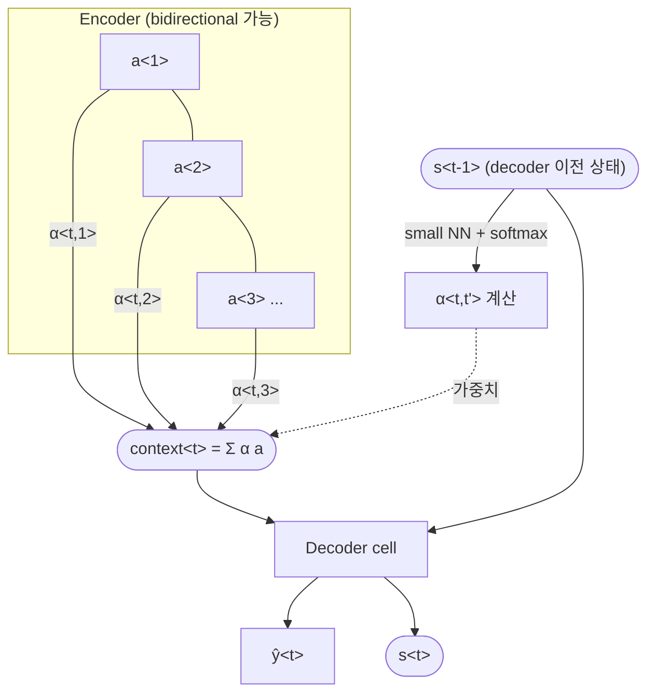

**숫자 예시** (Lab 1의 "Jane visite l'Afrique en septembre" → "Jane visits Africa in September" 번역, $5\times5$ attention score를 미리 만들어 softmax):

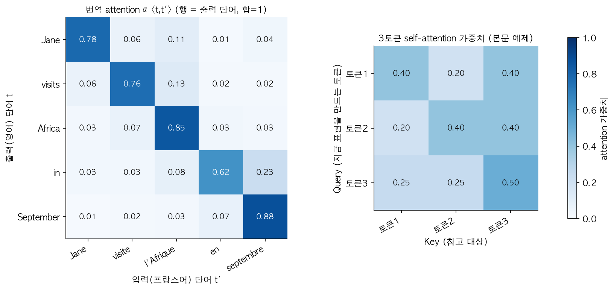

왼쪽 히트맵을 보면 각 행(출력 단어)의 가중치가 대체로 **대각선** 근처(같은 순서의 입력 단어)에 몰려있다 — "Jane"을 출력할 땐 입력 "Jane"에 0.78 집중, "Africa"를 출력할 땐 입력 "l'Afrique"에 0.85 집중. "in"을 출력할 땐 "en"(0.62)뿐 아니라 "septembre"(0.23)에도 어느 정도 퍼져있는데, 실제로 "in September"라는 표현이 원문의 두 단어("en septembre")에 걸쳐 있어서 그럴듯한 분산이다. 이 attention 아이디어가 나중에 Week4의 self-attention / Transformer로 발전한다(오른쪽 히트맵은 그 예고편 — 아래 Week4에서 정확히 같은 숫자로 다시 등장한다).

### Speech recognition과 CTC

오디오(시간축이 매우 긴 시퀀스, 예: 10초 오디오를 100Hz로 샘플링하면 1000 타임스텝) → 텍스트(훨씬 짧은 시퀀스) 문제라서, 입력과 출력 길이가 크게 다르다. **CTC (Connectionist Temporal Classification)** 방식은 매 입력 타임스텝마다 문자를 출력하게 하되, 반복된 문자와 특수 **blank 토큰**(`_`)을 허용한다. 예: "ttt\_h\_eee\_\_\_ \_qqq\_\_" 같은 raw 출력에서, "blank로 구분되지 않은 연속 반복 문자는 하나로 합치고 blank는 제거"하는 규칙으로 "the q..." 처럼 최종 텍스트를 복원한다. 이렇게 하면 입력 길이 = 출력 길이인 many-to-many 구조를 그대로 쓰면서도 실제 텍스트 길이가 짧은 문제를 풀 수 있다.

### Trigger word detection

"Hey Siri", "OK Google" 같은 wake word를 감지하는 문제. 오디오 시퀀스를 RNN에 흘려보내면서, trigger word가 끝나는 시점의 라벨을 0에서 1로 바꿔주고 그 뒤 몇 개 타임스텝 동안 1을 유지하도록(라벨을 약간 두껍게) 학습시키는 게 실전 트릭이다 — 그냥 정확히 그 순간 한 타임스텝만 1로 라벨링하면 0과 1의 비율이 너무 불균형해서(수천 개 중 1개) 학습이 잘 안 된다.

*(Lab 4: greedy vs beam search 구현, length normalization으로 이어짐)*

---

## Week 4. Transformer

### 동기: RNN의 한계

RNN/GRU/LSTM은 구조상 **순차적(sequential)**으로 계산해야 한다 — $t$번째 activation을 계산하려면 $t-1$번째가 끝나야 한다. 이건 두 가지 문제를 만든다:

1. **병렬화(parallelization)가 안 된다**: 긴 시퀀스일수록 학습이 느리다 — GPU는 많은 연산을 동시에(병렬로) 돌릴 때 빠른데, RNN은 시간 순서를 지켜야 해서 그 이점을 제대로 못 쓴다.
2. **여전히 vanishing gradient 계열 문제로 아주 긴 거리의 의존관계를 잡기 어렵다**: GRU/LSTM으로 완화는 했지만 완전히 해결은 아니다.

Transformer는 순차 계산을 버리고, **self-attention**으로 시퀀스 전체를 한 번에(병렬로) 처리하면서도 단어 간 관계를 잡아낸다는 게 핵심 아이디어다.

### Self-Attention

**이게 무엇인가**: 문장 "Jane visite l'Afrique en septembre, et elle admire la culture."에서 "l'Afrique"라는 단어를 제대로 이해하려면 — 이게 지리적 장소인지, 방문 대상인지 등 — 문장의 다른 단어들과의 관계를 봐야 한다. **Self-attention**은 각 단어에 대해 "같은 문장의 다른 모든 단어를 참고해서 이 단어의 의미를 다시 표현(re-represent)"하는 연산이다. Week3의 attention이 "decoder가 (다른 시퀀스인) encoder를 본다"였다면, self-attention은 "같은 시퀀스 안에서 서로를 본다"는 점이 다르다.

**Query, Key, Value**: 각 단어의 임베딩에서 세 개의 벡터를 만든다 — 학습되는 가중치 행렬 $W^Q, W^K, W^V$를 각각 곱해서 얻는다.

| 기호 | 의미 |
|---|---|
| $Q$ (Query) | "나는 지금 무엇을 찾고 있는가"에 대한 질문 벡터 |
| $K$ (Key) | "나는 이런 정보를 갖고 있다"는 이름표/색인 벡터 |
| $V$ (Value) | 실제로 (선택됐을 때) 전달할 내용물 |
| $W^Q, W^K, W^V$ | 학습되는 가중치 행렬. 입력 임베딩 $x$에 대해 $Q=xW^Q,\ K=xW^K,\ V=xW^V$ |

직관적으로, 각 단어의 $Q$를 다른 모든 단어의 $K$와 내적(dot product)해서 "얼마나 관련 있는지" 점수를 구하고(내적이 클수록 두 벡터가 비슷한 방향 = 관련도 높음), 그 점수를 softmax로 정규화한 뒤 그 가중치로 $V$들을 가중합한다. 도서관에서 질문(Q)을 들고 가서 책 제목(K)들과 비교해 가장 관련 있는 책을 찾고, 그 책의 실제 내용(V)을 가져오는 것에 비유할 수 있다.

$$\text{Attention}(Q, K, V) = \text{softmax}\left(\frac{QK^T}{\sqrt{d_k}}\right)V$$

| 기호 | shape | 의미 |
|---|---|---|
| $Q$ | $(T_q, d_k)$ | 쿼리들을 쌓은 행렬, $T_q$개의 단어 |
| $K$ | $(T_k, d_k)$ | 키들을 쌓은 행렬, $T_k$개의 단어. self-attention이면 $T_q=T_k$이고 $Q,K,V$ 모두 같은 시퀀스에서 나옴 |
| $V$ | $(T_k, d_v)$ | 값들을 쌓은 행렬 |
| $d_k$ | — | Query/Key 벡터의 차원 (하이퍼파라미터, head 하나가 다루는 폭) |
| $QK^T$ | $(T_q, T_k)$ | 모든 (query, key) 쌍의 내적 점수 — attention score 행렬 |
| $\sqrt{d_k}$ | — | scaling factor. 아래에서 왜 나누는지 설명 |
| $\text{softmax}(\cdot)$ | 행(=각 query)마다 적용 | 각 query 입장에서 모든 key에 대한 가중치 합이 1이 되도록 정규화 |

**$3$토큰 손계산 예시** (toy, $d_k=2$): 토큰 3개의 $Q=K=V$를 각각 $q_1=(1,0),\ q_2=(0,1),\ q_3=(1,1)$이라 하자(self-attention이므로 $Q=K=V=X$). $\sqrt{d_k}=\sqrt2\approx1.414$.

$$QK^T = \begin{bmatrix}1&0&1\\0&1&1\\1&1&2\end{bmatrix} \ \xrightarrow{\div\sqrt2} \ \begin{bmatrix}0.707&0&0.707\\0&0.707&0.707\\0.707&0.707&1.414\end{bmatrix} \ \xrightarrow{\text{행별 softmax}} \ \begin{bmatrix}0.40&0.20&0.40\\0.20&0.40&0.40\\0.25&0.25&0.50\end{bmatrix}$$

이 마지막 행렬이 위 attention 히트맵 그림의 오른쪽 패널과 정확히 같은 숫자다 — 토큰3(쿼리 $=(1,1)$)이 토큰1·토큰2보다 자기 자신(토큰3, 키 $=(1,1)$, 내적이 가장 큼)에 더 높은 가중치(0.50)를 주는 걸 볼 수 있다.

**왜 $\sqrt{d_k}$로 나누나**: $Q, K$의 각 성분이 평균 0, 분산 1짜리 값이라고 하면, 내적 $q\cdot k = \sum_{i=1}^{d_k} q_ik_i$는 서로 독립인 $d_k$개 항의 합이라 그 분산이 $d_k$에 **비례해서 커진다**(분산의 합은 각 항의 분산의 합, 여기서는 항마다 분산 1이라 총 분산 $\approx d_k$) — 표준편차로는 $\sqrt{d_k}$배. 즉 $d_k$가 커질수록(예: 64) 내적 값 자체의 크기(표준편차)가 커진다.

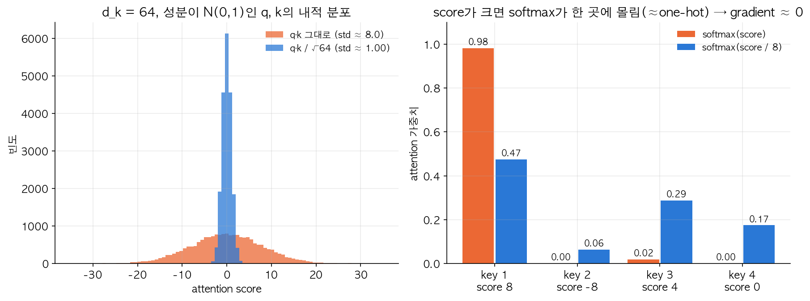

왼쪽: $d_k=64$일 때 성분이 $N(0,1)$인 랜덤 $q,k$의 내적은 표준편차가 실제로 $\approx8.0 \approx \sqrt{64}$로 커지는데, $\sqrt{64}=8$로 나누면 표준편차가 정확히 $\approx1.0$으로 되돌아온다. 오른쪽: score가 크면(예: $[8,-8,4,0]$) softmax가 거의 한 값에만 확률을 몰아준다(0.98) — 이러면 softmax의 gradient가 거의 0이 되어(이미 거의 one-hot인 분포는 조금 바뀌어도 출력이 거의 안 바뀜) 학습 신호가 사라진다. score를 8로 나누면($[1,-1,0.5,0]$) 분포가 훨씬 완만해져서(0.47, 0.06, 0.29, 0.17) gradient가 살아있다. 즉 **$\sqrt{d_k}$로 나누는 이유는 $d_k$가 커져도 softmax 입력 스케일을 일정하게 유지해서, softmax가 한쪽으로 쏠려 gradient가 죽는 걸 막기 위함**이다.

### Multi-head Attention

**이게 무엇인가**: 한 세트의 $Q,K,V$만 쓰면 "관련도"를 한 가지 관점으로만 보게 된다. Multi-head attention은 $W^Q, W^K, W^V$를 여러 세트(**head**, 보통 8개 등) 두고 각 head가 서로 다른 종류의 관계(예: 어떤 head는 "누가 누구에게 무엇을 했는가", 다른 head는 "언제 일어났는가")를 병렬로 학습하게 한 뒤, 각 head의 attention 출력을 이어붙이고(concat) 다시 한 번 선형변환한다.

$$\text{head}_i = \text{Attention}(QW_i^Q, KW_i^K, VW_i^V), \qquad \text{MultiHead}(Q,K,V) = \text{concat}(\text{head}_1, \dots, \text{head}_h) W^O$$

| 기호 | 의미 |
|---|---|
| $h$ | head 개수. 하이퍼파라미터, 보통 8~16. 많을수록 다양한 관점을 병렬로 볼 수 있지만 head 하나당 차원($d_k=d_{model}/h$)은 작아져서 표현력이 나뉜다 |
| $W_i^Q, W_i^K, W_i^V$ | $i$번째 head 전용 학습 파라미터 (head마다 다름) |
| $W^O$ | concat된 결과를 다시 $d_{model}$ 차원으로 섞어주는 출력 투영 행렬 |
| $d_{model}$ | 모델 전체의 embedding 차원 (Transformer 논문 기본값 512) |

CNN에서 필터를 여러 개 두어 서로 다른 특징을 잡는 것과 비슷한 발상이라고 생각하면 된다 — "필터 하나"가 "head 하나"에 대응.

### Transformer 전체 구조

기본은 여전히 encoder-decoder 구조인데, RNN 대신 attention block을 쌓아서 만든다.

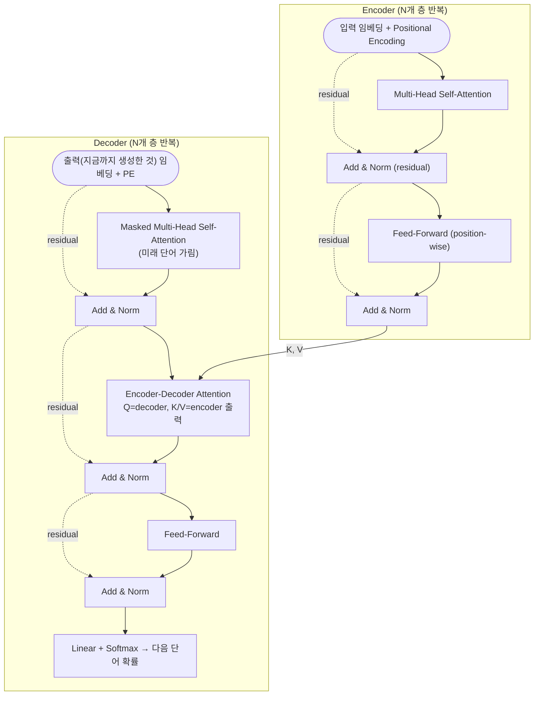

**Encoder** (여러 층 반복):
1. Multi-head self-attention (자기 문장 안에서 서로 참고)
2. Residual connection + Layer normalization ("Add & Norm")
3. Feed-forward network(단순 fully-connected, 위치마다 독립적으로 동일하게 적용 — "position-wise")
4. 다시 Residual + Layer norm

**Decoder** (여러 층 반복):
1. **Masked** multi-head self-attention — 아직 생성되지 않은 미래 단어를 "커닝"하지 못하도록, 자기 자신 이후 위치의 attention score를 $-\infty$로 masking한 뒤 softmax를 취한다(그러면 그 위치의 가중치가 사실상 0이 됨). Language model처럼 왼쪽 문맥만 보고 다음 단어를 예측하게 강제하는 장치.
2. Add & Norm
3. Encoder 출력을 $K,V$로, decoder 자신의 상태를 $Q$로 쓰는 **encoder-decoder attention**(=cross-attention, Week3의 attention과 개념적으로 같은 역할 — "출력을 만들 때 입력의 어디를 볼지")
4. Add & Norm → Feed-forward → Add & Norm

**Masking 손계산 예시** (Lab 5): 토큰 5개짜리 시퀀스에서 causal mask는 하삼각(lower triangular) 형태다 — 첫 토큰(위치 1)은 자기 자신만 볼 수 있어 attention weight가 `[1, 0, 0, 0, 0]`, 세 번째 토큰은 `[?, ?, ?, 0, 0]`처럼 앞의 3개까지만 0이 아니다. 위쪽 삼각형이 전부 0이라는 게 "미래를 못 본다"는 제약을 정확히 표현한다.

### Positional encoding

**무슨 문제인가**: self-attention 자체는 순서 개념이 없다 — 입력 단어들의 순서를 뒤죽박죽 섞어도(permutation) $QK^TV$ 계산 자체는 그 순서 섞임을 그대로 따라갈 뿐, "이게 2번째 단어다"라는 정보를 어디에도 담고 있지 않다(RNN처럼 순차 처리를 안 하기 때문에 위치 정보가 자연히 생기지 않는다). Lab 5에서 실제로 입력 순서를 섞어보면 attention 출력도 그냥 똑같이 섞일 뿐이라는 걸 확인한다 — "Jane visits Africa"와 "Africa visits Jane"을 구조적으로 구분 못 한다는 뜻.

**이게 무엇인가**: 각 위치 $pos$마다 고유한 "위치 바코드" 벡터를 만들어서 단어 임베딩에 더해주는 것. 학습되는 파라미터가 아니라 **고정된(fixed) 함수**로 미리 계산해둔다.

$$PE_{(pos, 2i)} = \sin\left(\frac{pos}{10000^{2i/d}}\right), \qquad PE_{(pos, 2i+1)} = \cos\left(\frac{pos}{10000^{2i/d}}\right)$$

| 기호 | 의미 |
|---|---|
| $pos$ | 시퀀스 안에서의 위치 (0, 1, 2, ...) |
| $i$ | 임베딩 차원의 인덱스를 2개씩 짝지은 번호 ($2i$, $2i+1$이 한 쌍 — 짝수 차원엔 sin, 그 다음 홀수 차원엔 cos) |
| $d$ | 임베딩 전체 차원 ($d_{model}$과 같음) |
| $10000^{2i/d}$ | 차원마다 다른 "주기(period)"를 만드는 분모. $i$가 작으면(앞쪽 차원) 분모가 작아 빠르게 진동, $i$가 크면(뒤쪽 차원) 분모가 커서 느리게 진동 |

**왜 sin/cos인가**: 이 함수들은 **주기적(periodic)**이라서 상대적 위치 관계("몇 칸 떨어져 있는가")를 표현하기 좋다 — $PE_{pos+k}$는 삼각함수의 덧셈정리로 $PE_{pos}$의 선형결합으로 나타낼 수 있어서, 모델이 "고정된 오프셋만큼 떨어진 위치"를 선형 연산으로 쉽게 학습할 수 있다는 이점이 있다. 또한 학습 때 본 적 없는 더 긴 시퀀스 길이에도(공식이 임의의 $pos$에 대해 정의되므로) 그대로 확장해서 쓸 수 있다.

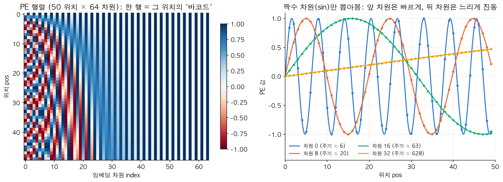

왼쪽 히트맵에서 앞쪽 차원(왼쪽)은 위치가 하나만 바뀌어도 값이 확 바뀌는 촘촘한 줄무늬(빠른 진동), 뒤쪽 차원(오른쪽)은 넓은 색 블록(느린 진동)으로 나타난다. 오른쪽 그래프는 짝수 차원 4개(0, 8, 16, 32)의 sin 곡선인데, 차원 0은 주기 $\approx6$으로 몇 스텝마다 한 번씩 요동치고, 차원 32는 주기 $\approx628$로 그림 범위(50 위치) 안에서는 거의 직선처럼 완만하게 증가한다 — **여러 주기의 진동을 조합해서 각 위치가 유일한(unique) 값 조합("바코드")을 갖게 만드는 것**이 positional encoding의 원리다.

### Residual connection + Layer normalization

**Residual(skip) connection이란**: sub-layer(위 그림의 attention이나 feed-forward 블록)의 입력을 그 출력에 그대로 더해주는 것이다.

$$x_{out} = x_{in} + \text{SubLayer}(x_{in})$$

**왜 필요한가**: 층이 깊어져도 gradient가 이 "지름길(shortcut)"을 타고 그대로 앞으로/뒤로 전달될 수 있어서, 신경망이 깊어질수록 오히려 학습이 안 되는 문제(degradation)를 완화해준다(Course 4 CNN 파트의 ResNet에서 처음 쓰인 아이디어를 그대로 가져온 것) — Week1의 vanishing gradient 논의와 같은 맥락: "곱해지는 경로"만 있으면 gradient가 작아질 위험이 있는데, "더해지는 경로"가 하나 있으면 최소한 그 경로로는 gradient가 1배로 그대로 통과한다(덧셈의 미분은 1).

**Layer normalization이란**: 이렇게 더한 결과를 정리(정규화)하는 방법인데, Course 2에서 다룬 **batch normalization**(미니배치 안에서, 같은 feature 축을 기준으로 여러 샘플에 걸쳐 평균/분산을 구해 정규화)과 다르다 — layer normalization은 **한 샘플(하나의 토큰 벡터) 안에서** 그 벡터의 모든 차원에 걸쳐 평균/분산을 구해 정규화한다.

$$\text{LayerNorm}(x) = \frac{x - \mu}{\sqrt{\sigma^2+\epsilon}}, \qquad \mu = \frac{1}{d}\sum_{j=1}^d x_j,\ \ \sigma^2 = \frac{1}{d}\sum_{j=1}^d (x_j-\mu)^2$$

| 기호 | 의미 |
|---|---|
| $x$ | 정규화할 벡터 (한 토큰의 $d_{model}$차원 표현) |
| $\mu, \sigma^2$ | 그 벡터 **자신의** 원소들에 대한 평균/분산 (다른 샘플이나 배치와 무관) |
| $\epsilon$ | 분모가 0이 되는 걸 막는 아주 작은 상수 |

**왜 batch norm 대신 layer norm인가**: NLP는 문장마다 길이가 다르고, 배치 안에 padding(빈 자리 채우기)이 섞이기 쉬워서 "배치 축으로" 통계를 내는 batch norm이 불안정하다. Layer norm은 샘플(토큰) 하나 안에서만 통계를 내므로 배치 크기나 시퀀스 길이에 영향을 받지 않는다 — 그래서 시퀀스마다 길이가 다른 NLP에서 batch norm보다 더 잘 맞는다.

```python
# 개념적 pseudo-code (Keras 스타일) — 위 encoder 그림 1개 층을 그대로 코드로
x = x + MultiHeadAttention(Q=x, K=x, V=x)   # self-attention + residual
x = LayerNorm(x)
x = x + FeedForward(x)                       # FFN + residual
x = LayerNorm(x)
```

*(Lab 5: scaled dot-product attention → multi-head → encoder sub-layer 하나를 처음부터 구현, positional encoding 없이는 순서를 모른다는 것을 실험으로 확인)*

---

## 핵심 요약

- 시퀀스 데이터는 표준 NN으로 못 다룬다(길이 가변, 위치 간 특징 공유 불가) → **RNN**이 타임스텝마다 파라미터($W_{aa}, W_{ax}, b_a$)를 공유하면서 activation $a^{<t>}$를 이어받는 구조로 해결. $[W_{aa}\mid W_{ax}]$ stacking trick으로 표기를 단순화한다.
- BPTT는 시간 방향으로 gradient가 반복해서 곱해지는 구조라, 이 곱이 1보다 작으면 **vanishing**(장기 의존성 학습 실패), 1보다 크면 **exploding**(clipping으로 대응)이 된다.
- Vanishing을 근본적으로 완화하려고 **GRU/LSTM**이 gate($\Gamma_u,\Gamma_f,\Gamma_o$ 등, 0~1 값으로 정보를 얼마나 통과시킬지 조절)로 "옛날 정보를 거의 그대로 통과시키는 우회로"를 만든다. GRU는 update/forget이 하나로 묶여 있고(합=1), LSTM은 3개 게이트가 독립적이라 더 유연하다.
- 문맥을 양방향으로 봐야 하는 문제(NER 등)엔 **Bidirectional RNN**(정방향+역방향 activation을 concat), 층을 더 쌓고 싶으면 **Deep RNN**($a^{[l]<t>}$).
- 단어를 one-hot이 아니라 **word embedding**(dense vector, embedding matrix $E$에서 lookup)으로 표현하면 cosine similarity로 유사도/유추(analogy, $e_{king}-e_{man}+e_{woman}\approx e_{queen}$)가 가능해지고, 큰 corpus에서 pre-train해서 작은 task로 transfer할 수 있다. 학습 방법은 Word2Vec(skip-gram + negative sampling, softmax 대신 binary classification $k$개로 근사), GloVe(co-occurrence 카운트 $X_{ij}$를 직접 회귀) 등. Bias는 neutralize(투영 제거)/equalize(대칭화)로 일부 완화.
- 입출력 길이가 다른 문제(번역 등)는 **encoder-decoder(seq2seq)** 구조, 조건부 언어모델 $P(y\mid x)$로 볼 수 있다. 디코딩은 greedy 대신 **beam search**(beam width $B$, +length normalization $1/T^\alpha$)로 여러 후보를 탐색. 품질 평가는 **BLEU**(modified n-gram precision × brevity penalty).
- 긴 문장에서 성능이 떨어지는 고정 context vector 문제를 **attention**(입력의 관련 부분에 매 스텝 다른 가중치 $\alpha^{<t,t'>}$를 주는 메커니즘, softmax로 정규화)으로 해결.
- RNN의 순차 처리 한계(병렬화 불가, 여전한 장거리 의존성 문제)를 **self-attention**으로 없앤 게 **Transformer** — Q/K/V(내적으로 관련도 계산, $\sqrt{d_k}$로 스케일링해 softmax gradient 보존), multi-head attention(여러 관점 병렬), positional encoding(sin/cos로 순서 정보 주입), residual+layer norm(깊은 층에서도 gradient 보존), masked attention(decoder가 미래를 못 보게)으로 구성되며 현재 NLP(그리고 그 너머)의 표준 구조가 됐다.

## 헷갈리기 쉬운 점

- **$T_x$ vs $T_y$**: 입력 길이와 출력 길이는 다를 수 있다. Many-to-many 유형에서도 "길이가 같은 경우"(NER, 매 타임스텝 출력)와 "다른 경우"(번역, encoder-decoder 필요)를 구분해야 한다.
- **GRU의 $c^{<t>}$ vs LSTM의 $c^{<t>}$, $a^{<t>}$**: GRU는 memory cell과 activation을 사실상 같은 것으로 취급하지만($a^{<t>} = c^{<t>}$), LSTM은 둘을 분리해서 관리한다(output gate $\Gamma_o$가 $c^{<t>}$에서 $a^{<t>}$를 걸러냄, $a^{<t>}=\Gamma_o\odot\tanh(c^{<t>})$).
- **Update gate 개수**: GRU는 update gate 하나로 "새로 채울 비율"과 "옛날 걸 유지할 비율"을 $\Gamma_u$, $1-\Gamma_u$로 묶어서 쓰고(합이 항상 1), LSTM은 update와 forget이 독립된 별개 게이트라 둘이 반드시 합이 1일 필요가 없다(둘 다 크거나 둘 다 작을 수도 있음).
- **Word2vec(skip-gram/negative sampling) vs GloVe**: 둘 다 word embedding 학습법이지만, word2vec은 (context, target) 쌍을 슬라이딩 윈도우로 뽑아 매번 예측 문제로 풀고, GloVe는 co-occurrence 통계(카운트 $X_{ij}$)를 미리 계산해서 직접 회귀하듯 맞춘다.
- **Attention(Week3) vs Self-attention(Week4)**: Week3 attention은 "decoder가 encoder의 어디를 볼지" 정하는 용도(서로 다른 두 시퀀스 사이의 attention, cross-attention과 같은 역할). Week4 self-attention은 "같은 시퀀스 내에서 단어들끼리 서로를 참고"하는 것 — Transformer에는 두 종류가 다 들어있다(encoder self-attention, decoder masked self-attention, encoder-decoder cross-attention).
- **Masking의 의미**: Transformer decoder의 masking(미래 위치 score를 $-\infty$로 만들어 softmax 후 사실상 0으로 만듦)은 gradient clipping의 "clipping"과 전혀 다른 개념이다 — masking은 "미래 정보를 못 보게 가리는 것"(순서 규칙), clipping은 "gradient 크기를 제한하는 것"(수치 안정성).
- **BLEU score는 완벽한 지표가 아니다**: n-gram 겹침만 보기 때문에 의미는 같지만 단어 선택이 다른 좋은 번역에 낮은 점수를 줄 수 있다. 그래도 모델 비교용 단일 지표로는 실무에서 표준으로 쓰인다.
- **Beam search는 근사 알고리즘**: beam width $B$가 작으면 최적해를 못 찾을 수 있다($B=1$이면 greedy와 같음). 번역이 이상할 때 이게 beam 탓인지 모델 탓인지 구분하려면 $P(y^*\mid x)$와 $P(\hat y\mid x)$를 직접 비교해봐야 한다(Week3 error analysis 참고).
- **$\sqrt{d_k}$ 스케일링을 빼먹으면**: $d_k$가 클수록 $QK^T$의 값 자체가 커져서 softmax가 거의 one-hot처럼 한쪽으로 쏠리고, 그러면 softmax의 gradient가 0에 가까워져 학습이 막힌다 — vanishing gradient와는 다른 경로지만 "학습 신호가 사라진다"는 결과는 비슷하다.

## RNN → GRU → LSTM → Attention → Transformer 한눈에 비교

| 구조 | 핵심 아이디어 | 해결한 문제 | 남은 한계 |
|---|---|---|---|
| **RNN** | 타임스텝마다 같은 파라미터($W_a$) 공유, activation을 다음 스텝에 전달 | 가변 길이 시퀀스, 위치 간 특징 공유 | Vanishing gradient로 장거리 의존성 학습 약함 |
| **GRU** | Update gate $\Gamma_u$로 memory cell $c^{<t>}$를 유지할지 갱신할지 조절 | Vanishing gradient 완화, 장거리 의존성 개선 | LSTM보다 단순하지만 표현력은 다소 제한적 |
| **LSTM** | Update/Forget/Output 3개 gate로 $c^{<t>}$와 $a^{<t>}$를 분리 관리 | GRU보다 더 유연한 정보 제어 | 여전히 순차 계산이라 병렬화 불가, 파라미터 많음 |
| **Attention (seq2seq)** | 출력 매 스텝마다 입력 전체에 대한 가중치 $\alpha^{<t,t'>}$ 계산 후 가중합 | 긴 문장에서 고정 context vector의 정보 손실 문제 | 여전히 RNN 기반이라 순차 계산 병목은 남아있음 |
| **Transformer (Self-Attention)** | Q/K/V 기반으로 시퀀스 내 모든 위치를 한 번에(병렬) 비교 | 순차 계산 제거(병렬화), 장거리 의존성도 한 번의 attention으로 직접 연결 | 시퀀스 길이에 대해 $O(n^2)$ 연산/메모리, 위치 정보 별도 주입(positional encoding) 필요 |

---

## Lab 예제 — 직접 짜보기

> numpy + matplotlib만으로 RNN 셀부터 Transformer의 attention까지 직접 짠다. 뼈대의 `TODO`를 채우고 **체크포인트**와 비교해보자. 정답은 접혀있다.

### Lab 1. RNN forward + gradient clipping + vanishing/exploding 체감

**목표**: RNN 셀 하나 → 시퀀스 전체 forward를 구현한다(shape: $x$는 `(n_x, m, T_x)`). exploding gradient 대책인 clipping 두 방식(값 기준 / norm 기준)을 짜보고, 같은 $W_{aa}$를 여러 번 곱할 때 gradient 크기가 어떻게 되는지 그래프로 본다.

```python
import numpy as np
import matplotlib.pyplot as plt

def softmax(z, axis=0):
    e = np.exp(z - np.max(z, axis=axis, keepdims=True))
    return e / np.sum(e, axis=axis, keepdims=True)

def rnn_cell_forward(xt, a_prev, p):
    # xt: (n_x, m), a_prev: (n_a, m)
    a_next = None    # TODO: tanh(Waa a_prev + Wax xt + ba)
    yt_pred = None   # TODO: softmax(Wya a_next + by)
    return a_next, yt_pred

def rnn_forward(x, a0, p):
    n_x, m, T_x = x.shape
    n_y, n_a = p["Wya"].shape
    a = np.zeros((n_a, m, T_x)); y_pred = np.zeros((n_y, m, T_x))
    a_next = a0
    # TODO: t = 0 ~ T_x-1 돌면서 셀 호출, a와 y_pred의 t번째 칸에 저장 (파라미터는 모든 t에서 공유!)
    return a, y_pred

np.random.seed(1)
n_x, n_a, n_y, m, T_x = 3, 5, 2, 10, 4
p = {"Waa": np.random.randn(n_a, n_a), "Wax": np.random.randn(n_a, n_x), "ba": np.random.randn(n_a, 1),
     "Wya": np.random.randn(n_y, n_a), "by": np.random.randn(n_y, 1)}
a, y_pred = rnn_forward(np.random.randn(n_x, m, T_x), np.random.randn(n_a, m), p)
print("a.shape:", a.shape, " y_pred.shape:", y_pred.shape, " y_pred 합(=1):", y_pred[:, 0, 0].sum())

def clip(grads, max_value):
    return None   # TODO: 모든 gradient를 [-max_value, max_value]로 자르기 (np.clip)

def clip_by_norm(grads, max_norm):
    return None   # TODO: 전체 gradient norm이 max_norm보다 크면 전체를 같은 비율로 축소 (방향 유지)

grads = {"dWaa": np.array([[50.0, -3.0], [0.5, -80.0]]), "db": np.array([[10.0], [-0.1]])}
print("value clip:", clip(grads, 5)["dWaa"].tolist())
print("norm clip:", np.round(clip_by_norm(grads, 5)["dWaa"], 3).tolist())

# BPTT에서 gradient가 매 step Waa^T를 곱하며 뒤로 간다고 단순화
for scale in [0.5, 1.0, 1.5]:
    Waa = np.eye(n_a) * scale
    g = np.ones((n_a, 1))
    norms = []
    for t in range(50):
        g = Waa.T @ g
        norms.append(np.linalg.norm(g))
    plt.semilogy(norms, label=f"Waa = {scale} * I")
plt.xlabel("steps back"); plt.ylabel("|grad|")
plt.legend(); plt.title("Vanishing / exploding gradients"); plt.show()
```

**체크포인트**
- `a.shape: (5, 10, 4)`, `y_pred.shape: (2, 10, 4)`, softmax 합 1.0.
- value clip `[[5, -3], [0.5, -5]]` — 원소마다 따로 잘려서 **방향이 바뀐다**. norm clip `[[2.634, -0.158], [0.026, -4.214]]` — 비율(방향)은 그대로, 크기만 줄어듦.
- 그래프: 0.5면 50 step 뒤 `1e-15` 수준으로 사라지고(vanishing), 1.5면 `1e9`로 폭발(exploding). 앞쪽 단어의 정보가 뒤까지 못 가는 이유.

<details>
<summary>정답 보기</summary>

```python
def rnn_cell_forward(xt, a_prev, p):
    a_next = np.tanh(p["Waa"] @ a_prev + p["Wax"] @ xt + p["ba"])
    yt_pred = softmax(p["Wya"] @ a_next + p["by"])
    return a_next, yt_pred

def rnn_forward(x, a0, p):
    n_x, m, T_x = x.shape
    n_y, n_a = p["Wya"].shape
    a = np.zeros((n_a, m, T_x)); y_pred = np.zeros((n_y, m, T_x))
    a_next = a0
    for t in range(T_x):
        a_next, yt = rnn_cell_forward(x[:, :, t], a_next, p)
        a[:, :, t] = a_next; y_pred[:, :, t] = yt
    return a, y_pred

def clip(grads, max_value):
    return {k: np.clip(g, -max_value, max_value) for k, g in grads.items()}

def clip_by_norm(grads, max_norm):
    total = np.sqrt(sum(np.sum(g ** 2) for g in grads.values()))
    scale = min(1.0, max_norm / total)
    return {k: g * scale for k, g in grads.items()}
```

</details>

### Lab 2. LSTM / GRU 셀 — gate가 memory를 지키는 걸 보기

**목표**: LSTM 셀과 GRU 셀의 forward를 구현한다. 그리고 gate bias를 극단적으로 줘서 (forget≈1, update≈0) 랜덤 입력을 100 step 넣어도 memory cell $c$가 거의 그대로 보존된다는 걸 확인한다 — vanishing gradient를 푸는 원리.

```python
import numpy as np

def sigmoid(z): return 1 / (1 + np.exp(-z))

def lstm_cell_forward(xt, a_prev, c_prev, p):
    concat = np.concatenate([a_prev, xt], axis=0)     # [a<t-1>; x<t>]
    ft = None       # TODO: forget gate  = σ(Wf concat + bf)
    it = None       # TODO: update gate  = σ(Wi concat + bi)
    cct = None      # TODO: 후보 memory   = tanh(Wc concat + bc)
    c_next = None   # TODO: ft * c_prev + it * cct
    ot = None       # TODO: output gate  = σ(Wo concat + bo)
    a_next = None   # TODO: ot * tanh(c_next)
    return a_next, c_next, (ft, it, ot)

def gru_cell_forward(xt, c_prev, p):
    concat = np.concatenate([c_prev, xt], axis=0)
    gamma_r = None   # TODO: relevance gate
    gamma_u = None   # TODO: update gate
    c_tilde = None   # TODO: tanh(Wc [Γr * c_prev; xt] + bc)
    c_next = None    # TODO: Γu * c_tilde + (1 - Γu) * c_prev
    return c_next, gamma_u

n_x, n_a, m = 3, 5, 10
np.random.seed(2)
lp = {k: np.random.randn(n_a, n_a + n_x) for k in ["Wf", "Wi", "Wc", "Wo"]}
lp.update({k: np.zeros((n_a, 1)) for k in ["bf", "bi", "bc", "bo"]})
a_next, c_next, gates = lstm_cell_forward(np.random.randn(n_x, m), np.random.randn(n_a, m), np.random.randn(n_a, m), lp)
print("LSTM a_next, c_next shape:", a_next.shape, c_next.shape)

lp["bf"][:] = 10; lp["bi"][:] = -10       # forget gate ≈ 1, update gate ≈ 0
c = np.ones((n_a, 1)); a_prev = np.zeros((n_a, 1))
for t in range(100):
    a_prev, c, _ = lstm_cell_forward(np.random.randn(n_x, 1), a_prev, c, lp)
print("100 step 뒤 memory cell (bf=10, bi=-10):", np.round(c.ravel(), 3))

gp = {k: np.random.randn(n_a, n_a + n_x) for k in ["Wr", "Wu", "Wc"]}
gp.update({"br": np.zeros((n_a, 1)), "bu": np.full((n_a, 1), -10.0), "bc": np.zeros((n_a, 1))})
c = np.ones((n_a, 1))
for t in range(100):
    c, gu = gru_cell_forward(np.random.randn(n_x, 1), c, gp)
print("GRU 100 step 뒤 (bu=-10 -> Γu≈0):", np.round(c.ravel(), 3))
```

**체크포인트**
- shape `(5, 10) (5, 10)`.
- LSTM: 100 step 뒤에도 $c$ ≈ `[0.98, 1.0, 0.99, 0.79, 1.0]` — 처음 넣은 1이 거의 그대로. bf/bi를 0으로 되돌리면 금방 다른 값으로 덮어써진다.
- GRU도 $\Gamma_u \approx 0$이면 $c^{<t>} \approx c^{<t-1>}$이라 ≈ 1 근처 유지. 강의의 "The cat, which already ate ..., **was** full"에서 단수/복수 정보를 문장 끝까지 들고 가는 원리가 이것.

<details>
<summary>정답 보기</summary>

```python
def lstm_cell_forward(xt, a_prev, c_prev, p):
    concat = np.concatenate([a_prev, xt], axis=0)
    ft = sigmoid(p["Wf"] @ concat + p["bf"])
    it = sigmoid(p["Wi"] @ concat + p["bi"])
    cct = np.tanh(p["Wc"] @ concat + p["bc"])
    c_next = ft * c_prev + it * cct
    ot = sigmoid(p["Wo"] @ concat + p["bo"])
    a_next = ot * np.tanh(c_next)
    return a_next, c_next, (ft, it, ot)

def gru_cell_forward(xt, c_prev, p):
    concat = np.concatenate([c_prev, xt], axis=0)
    gamma_r = sigmoid(p["Wr"] @ concat + p["br"])
    gamma_u = sigmoid(p["Wu"] @ concat + p["bu"])
    c_tilde = np.tanh(p["Wc"] @ np.concatenate([gamma_r * c_prev, xt], axis=0) + p["bc"])
    c_next = gamma_u * c_tilde + (1 - gamma_u) * c_prev
    return c_next, gamma_u
```

</details>

### Lab 3. Word embedding — cosine similarity, 유추, 편향 제거

**목표**: 직접 만든 5차원 toy 임베딩(gender, royal, age, food, occupation)으로 cosine similarity와 `man : woman = king : ?` 유추를 구현한다. 그 다음 gender 방향 $g$를 구해서 neutralize(직업 단어에서 성별 성분 제거)와 equalize(grandmother/grandfather를 대칭으로)를 해본다.

```python
import numpy as np

E = {   # [gender(+=male), royal, age, food, occupation]
    "man": [1.0, 0.0, 0.6, 0.0, 0.0], "woman": [-1.0, 0.0, 0.6, 0.0, 0.0],
    "king": [0.95, 0.95, 0.7, 0.0, 0.1], "queen": [-0.97, 0.95, 0.7, 0.0, 0.1],
    "apple": [0.0, 0.0, 0.0, 0.95, 0.0], "orange": [0.01, 0.0, 0.0, 0.97, 0.0],
    "boy": [1.0, 0.0, 0.1, 0.0, 0.0], "girl": [-1.0, 0.0, 0.1, 0.0, 0.0],
    "doctor": [0.3, 0.0, 0.5, 0.0, 0.95], "nurse": [-0.4, 0.0, 0.5, 0.0, 0.9],
    "babysitter": [-0.35, 0.0, 0.3, 0.0, 0.8],
    "grandmother": [-0.9, 0.0, 1.0, 0.0, 0.3],     # 일부러 occupation 쪽에 편향을 섞어둠
    "grandfather": [1.0, 0.0, 1.0, 0.0, 0.0],
}
np.random.seed(0)
E = {w: np.array(v) + np.random.randn(5) * 0.02 for w, v in E.items()}
E = {w: v / np.linalg.norm(v) for w, v in E.items()}   # equalize 공식은 단위벡터를 가정

def cosine_similarity(u, v):
    return None   # TODO

def complete_analogy(a, b, c, E):
    # a : b = c : ?  ->  e_b - e_a 와 e_? - e_c 의 cosine이 가장 큰 단어 (a, b, c 자신은 제외)
    return None   # TODO

print("cos(apple, orange):", round(cosine_similarity(E["apple"], E["orange"]), 3))
print("cos(apple, king):", round(cosine_similarity(E["apple"], E["king"]), 3))
print("man : woman = king :", complete_analogy("man", "woman", "king", E))
print("man : woman = boy :", complete_analogy("man", "woman", "boy", E))
print("boy : girl = man :", complete_analogy("boy", "girl", "man", E))

g = np.mean([E["man"] - E["woman"], E["boy"] - E["girl"], E["grandfather"] - E["grandmother"]], axis=0)

def neutralize(e, g):
    return None   # TODO: e에서 g 방향 성분(projection)을 뺀다

def equalize(pair, g, E):
    e1, e2 = E[pair[0]], E[pair[1]]
    mu = (e1 + e2) / 2
    mu_B = np.dot(mu, g) / np.sum(g ** 2) * g
    mu_orth = mu - mu_B                                   # 두 단어가 공유할 "성별 없는" 부분
    scale = np.sqrt(np.abs(1 - np.sum(mu_orth ** 2)))
    e1B = np.dot(e1, g) / np.sum(g ** 2) * g
    e2B = np.dot(e2, g) / np.sum(g ** 2) * g
    e1B_c = scale * (e1B - mu_B) / np.linalg.norm(e1B - mu_B)
    e2B_c = scale * (e2B - mu_B) / np.linalg.norm(e2B - mu_B)
    return mu_orth + e1B_c, mu_orth + e2B_c

for w in ["doctor", "nurse", "babysitter"]:
    before = cosine_similarity(E[w], g)
    after = cosine_similarity(neutralize(E[w], g), g)
    print(f"{w:>10}: gender 방향과 cos {before:+.3f} -> neutralize 후 {after:+.3f}")
e_gm, e_gf = equalize(("grandmother", "grandfather"), g, E)
e_bs = neutralize(E["babysitter"], g)
print("equalize 전 babysitter와의 거리:", round(np.linalg.norm(e_bs - E["grandmother"]), 3), round(np.linalg.norm(e_bs - E["grandfather"]), 3))
print("equalize 후 babysitter와의 거리:", round(np.linalg.norm(e_bs - e_gm), 3), round(np.linalg.norm(e_bs - e_gf), 3))
```

**체크포인트**
- cos(apple, orange) ≈ 0.999, cos(apple, king) ≈ -0.01.
- 유추: `queen`, `girl`, `woman`.
- neutralize 전: doctor `+0.22`(남성 쪽), nurse `-0.40`, babysitter `-0.43`(여성 쪽) → 후: 전부 `0.000`.
- equalize 전 babysitter와의 거리 `1.024 vs 1.151`(grandmother 쪽이 더 가까움 = 편향) → 후 `1.089 vs 1.089`로 동일.

<details>
<summary>정답 보기</summary>

```python
def cosine_similarity(u, v):
    return np.dot(u, v) / (np.linalg.norm(u) * np.linalg.norm(v))

def complete_analogy(a, b, c, E):
    target = E[b] - E[a]
    best, best_sim = None, -np.inf
    for w, vec in E.items():
        if w in (a, b, c):
            continue
        sim = cosine_similarity(target, vec - E[c])
        if sim > best_sim:
            best, best_sim = w, sim
    return best

def neutralize(e, g):
    e_bias = np.dot(e, g) / np.sum(g ** 2) * g
    return e - e_bias
```

</details>

### Lab 4. Greedy search vs Beam search

**목표**: 작은 가짜 "번역 모델" $P(y^{<t>} \mid x, y^{<1>},\dots,y^{<t-1>})$ 확률표 위에서 greedy search와 beam search(+ length normalization)를 구현하고, greedy가 당장 확률 높은 단어("going")를 고르다가 전체 문장 확률에서 손해 보는 걸 확인한다.

```python
import numpy as np

def next_word_probs(prefix):
    # "Jane visite l'Afrique en septembre" 번역 모델을 흉내낸 확률표
    table = {
        (): {"jane": 0.9, "in": 0.1},
        ("jane",): {"is": 1.0},
        ("jane", "is"): {"going": 0.5, "visiting": 0.4, "in": 0.1},
        ("jane", "is", "going"): {"to": 0.6, "in": 0.4},
        ("jane", "is", "going", "to"): {"september": 0.55, "africa": 0.35, "<eos>": 0.1},
        ("jane", "is", "going", "in"): {"september": 0.3, "africa": 0.7},
        ("jane", "is", "visiting"): {"africa": 0.95, "september": 0.05},
        ("jane", "is", "visiting", "africa"): {"in": 0.9, "<eos>": 0.1},
        ("jane", "is", "visiting", "africa", "in"): {"september": 1.0},
    }
    return table.get(tuple(prefix), {"<eos>": 1.0})

def greedy_search(max_len=8):
    seq, logp = [], 0.0
    # TODO: 매 step 가장 확률 높은 단어 하나만 고르고 log 확률을 누적. <eos>면 종료
    return seq, logp

def beam_search(B=3, max_len=8, alpha=0.7):
    beams = [([], 0.0, False)]           # (seq, log P, 끝났는지)
    for _ in range(max_len):
        candidates = []
        # TODO: 각 beam마다
        #   - 이미 끝났으면 그대로 candidates에
        #   - 아니면 모든 다음 단어로 확장 (<eos>면 끝난 상태로)
        # TODO: log P 기준 상위 B개만 남기기
        if all(done for _, _, done in beams):
            break
    # TODO: length normalization — log P / T^alpha 가 가장 큰 후보의 (seq, logp) 반환
    return None

for name, (seq, logp) in [("greedy", greedy_search()), ("beam B=1", beam_search(B=1)), ("beam B=3", beam_search(B=3))]:
    print(f"{name:>9}: {' '.join(seq):<40} P = {np.exp(logp):.4f}")
```

**체크포인트**
- greedy: `jane is going to september` P = 0.1485 — 이상한 번역인데 고른 이유는 매 step "going"(0.5 > 0.4), "to"(0.6)가 당장 높았기 때문.
- beam B=1은 greedy와 똑같다(B=1 beam search = greedy).
- beam B=3: `jane is visiting africa in september` P = 0.3078 — 두 배 더 높은 확률의 문장을 찾는다.
- log 확률을 더하는 이유: 확률을 계속 곱하면 문장이 길어질 때 underflow. `alpha`를 0으로 하면 짧은 문장이 유리해지는 것도 확인해보자.

<details>
<summary>정답 보기</summary>

```python
def greedy_search(max_len=8):
    seq, logp = [], 0.0
    for _ in range(max_len):
        probs = next_word_probs(seq)
        w = max(probs, key=probs.get)
        logp += np.log(probs[w])
        if w == "<eos>":
            break
        seq.append(w)
    return seq, logp

def beam_search(B=3, max_len=8, alpha=0.7):
    beams = [([], 0.0, False)]
    for _ in range(max_len):
        candidates = []
        for seq, logp, done in beams:
            if done:
                candidates.append((seq, logp, True))
                continue
            for w, pr in next_word_probs(seq).items():
                if w == "<eos>":
                    candidates.append((seq, logp + np.log(pr), True))
                else:
                    candidates.append((seq + [w], logp + np.log(pr), False))
        beams = sorted(candidates, key=lambda c: -c[1])[:B]
        if all(done for _, _, done in beams):
            break
    return max(beams, key=lambda c: c[1] / max(len(c[0]), 1) ** alpha)[:2]
```

</details>

### Lab 5. Scaled dot-product attention → Multi-head → Transformer encoder 한 층

**목표**: $\text{softmax}(\frac{QK^T}{\sqrt{d_k}})V$를 구현하고, decoder용 causal mask, multi-head attention, sin/cos positional encoding, Add & Norm까지 이어 붙여 encoder sub-layer 하나를 만든다. 마지막으로 "positional encoding이 없으면 self-attention은 순서를 모른다"를 실험으로 확인한다.

```python
import numpy as np
import matplotlib.pyplot as plt

def softmax(z, axis=-1):
    e = np.exp(z - np.max(z, axis=axis, keepdims=True))
    return e / np.sum(e, axis=axis, keepdims=True)

def scaled_dot_product_attention(Q, K, V, mask=None):
    # Q: (T_q, d_k), K: (T_k, d_k), V: (T_k, d_v)
    scores = None    # TODO: Q K^T / sqrt(d_k)
    if mask is not None:
        scores = None   # TODO: mask가 False인 곳을 -1e9로 (softmax 후 0이 되게)
    weights = None   # TODO: 행(쿼리)마다 softmax
    return weights @ V, weights

def multi_head_attention(X, Wq, Wk, Wv, Wo, n_heads, mask=None):
    # TODO: head마다 X@Wq[h], X@Wk[h], X@Wv[h]로 attention -> 결과를 concat -> @ Wo
    return None

def positional_encoding(T, d):
    PE = np.zeros((T, d))
    # TODO: PE[pos, 2i] = sin(pos / 10000^(2i/d)), PE[pos, 2i+1] = cos(같은 각도)
    return PE

def layer_norm(x, eps=1e-6):
    # batch norm과 달리 "한 토큰 벡터 안에서"(마지막 축) 평균/분산
    return (x - x.mean(axis=-1, keepdims=True)) / np.sqrt(x.var(axis=-1, keepdims=True) + eps)

np.random.seed(0)
T, d_model, n_heads = 5, 16, 4
d_k = d_model // n_heads
X = np.random.randn(T, d_model) + positional_encoding(T, d_model)   # 단어 임베딩 + 위치
out, w = scaled_dot_product_attention(X, X, X)                      # self-attention: Q=K=V=X
print("attention weights 각 행의 합:", np.round(w.sum(axis=1), 3))

causal = np.tril(np.ones((T, T), dtype=bool))    # 자기 자신 + 과거만 볼 수 있음
_, w_masked = scaled_dot_product_attention(X, X, X, mask=causal)
print("causal mask weights:\n", np.round(w_masked, 2))

Wq = np.random.randn(n_heads, d_model, d_k) * 0.3
Wk = np.random.randn(n_heads, d_model, d_k) * 0.3
Wv = np.random.randn(n_heads, d_model, d_k) * 0.3
Wo = np.random.randn(n_heads * d_k, d_model) * 0.3
Z = layer_norm(X + multi_head_attention(X, Wq, Wk, Wv, Wo, n_heads))   # Add & Norm
print("encoder sub-layer 출력 shape:", Z.shape, " 위치별 평균≈0:", np.round(Z.mean(axis=-1), 3))

# PE 없이 입력 순서를 섞으면?
perm = np.random.permutation(T)
X_raw = np.random.randn(T, d_model)
o1, _ = scaled_dot_product_attention(X_raw, X_raw, X_raw)
o2, _ = scaled_dot_product_attention(X_raw[perm], X_raw[perm], X_raw[perm])
print("PE 없이 순서 섞으면 출력도 똑같이 섞이기만 함(순서 정보 없음):", np.allclose(o1[perm], o2))

PE = positional_encoding(50, 64)
plt.imshow(PE, aspect="auto", cmap="RdBu"); plt.xlabel("dimension i"); plt.ylabel("position")
plt.colorbar(); plt.title("Positional encoding"); plt.show()
```

**체크포인트**
- attention weights 각 행의 합 = 1.
- causal mask: **위쪽 삼각형이 전부 0**인 하삼각 행렬. 첫 토큰은 자기 자신만 봐서 `[1, 0, 0, 0, 0]`.
- encoder 출력 shape `(5, 16)` — 입력과 같은 shape이라 층을 계속 쌓을 수 있다. layer norm 덕분에 토큰별 평균 ≈ 0.
- `True` — self-attention은 순서를 바꾸면 결과도 똑같이 섞일 뿐(permutation equivariant)이라 "Jane visits Africa"와 "Africa visits Jane"을 구분 못 한다. 그래서 positional encoding을 더해줘야 한다.
- PE 히트맵: 앞쪽 차원은 빠르게, 뒤쪽 차원은 느리게 진동하는 줄무늬 — 차원마다 주기가 다른 "위치 바코드".

<details>
<summary>정답 보기</summary>

```python
def scaled_dot_product_attention(Q, K, V, mask=None):
    d_k = Q.shape[-1]
    scores = Q @ K.T / np.sqrt(d_k)
    if mask is not None:
        scores = np.where(mask, scores, -1e9)
    weights = softmax(scores, axis=-1)
    return weights @ V, weights

def multi_head_attention(X, Wq, Wk, Wv, Wo, n_heads, mask=None):
    heads = []
    for h in range(n_heads):
        out, _ = scaled_dot_product_attention(X @ Wq[h], X @ Wk[h], X @ Wv[h], mask)
        heads.append(out)
    return np.concatenate(heads, axis=-1) @ Wo

def positional_encoding(T, d):
    pos = np.arange(T)[:, None]
    i = np.arange(d)[None, :]
    angle = pos / np.power(10000, (2 * (i // 2)) / d)
    PE = np.zeros((T, d))
    PE[:, 0::2] = np.sin(angle[:, 0::2])
    PE[:, 1::2] = np.cos(angle[:, 1::2])
    return PE
```

</details>
