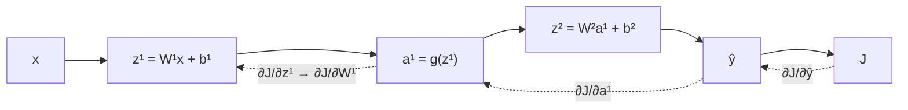

# 선형회귀 vs 신경망: 역전파와 경사하강법의 관계

## 헷갈렸던 점

> 선형회귀에서는 `ŷ = wx + b`를 구한 뒤 바로 y와의 오차(MSE)로 cost function을 잡고 경사하강법을 돌렸다.
> 신경망은 똑같이 MSE를 구하는데, 경사하강법 대신 역전파를 먼저 해서 가중치를 구하고 그걸로 업데이트하는 건가?

## 결론

**역전파(backprop)는 가중치를 구하는 게 아니라 기울기(gradient, ∂J/∂w)를 구하는 방법이다.**
경사하강법을 대신하는 게 아니라, 경사하강법에 넣을 기울기를 계산해 주는 단계다.

- 역전파 = 기울기 계산
- 경사하강법 = 그 기울기로 가중치 업데이트

## 두 모델은 같은 루프를 돈다

```
1. 순전파(forward)   : 입력 x → 예측값 ŷ 계산
2. 비용 계산         : J = MSE(ŷ, y)  (분류라면 cross-entropy)
3. 기울기 계산       : ∂J/∂w, ∂J/∂b 구하기   ← 역전파가 하는 일
4. 경사하강 업데이트 : w := w − α·∂J/∂w,  b := b − α·∂J/∂b
```

- `J`: 비용(cost). 예측이 정답에서 얼마나 틀렸는지를 하나의 숫자로 나타낸 값
- `α`: learning rate. 한 번 업데이트할 때 얼마나 움직일지
- `∂J/∂w`: w를 아주 조금 바꿨을 때 J가 얼마나 변하는지. 부호가 방향, 크기가 경사의 가파름

선형회귀와 신경망의 차이는 **3번을 어떻게 계산하느냐** 하나뿐이다.

## 선형회귀: 기울기를 손으로 바로 유도할 수 있다

- 모델: `ŷ = wx + b`
- 비용: `J = (1/2m)·Σ(ŷ − y)²` (`m`: 학습 데이터 개수)

미분하면 한 줄로 끝난다.

```
∂J/∂w = (1/m)·Σ(ŷ − y)·x
∂J/∂b = (1/m)·Σ(ŷ − y)
```

Course 1 lab의 `compute_gradient`가 이 공식을 그대로 코드로 옮긴 것이다.
역전파 단계가 따로 없는 것처럼 보이지만, 층이 1개라 연쇄법칙(chain rule)이 한 번으로 끝나서 그렇다.

## 신경망: 층이 여러 개라 연쇄법칙을 거꾸로 이어 붙여야 한다

2층 신경망 예시:

```
x → z¹ = W¹x + b¹ → a¹ = g(z¹) → z² = W²a¹ + b² → ŷ → J
```

- `W¹, b¹`: 1층의 가중치, 편향 (위첨자는 층 번호)
- `z¹`: 1층의 선형 계산 결과
- `g`: 활성화 함수 (ReLU, sigmoid 등)
- `a¹`: 1층의 출력(활성값). 2층의 입력이 된다

첫 층 가중치 W¹이 J에 미치는 영향은 여러 단계를 거쳐 전달되니까 연쇄법칙으로 곱해야 한다.

```
∂J/∂W¹ = ∂J/∂ŷ · ∂ŷ/∂a¹ · ∂a¹/∂z¹ · ∂z¹/∂W¹
```

층이 수십 개, 파라미터가 수백만 개면 가중치마다 이걸 따로 유도하는 건 불가능하다.
**역전파는 출력층에서 입력층 방향으로 거꾸로 가면서, 앞에서 이미 계산한 미분값(∂J/∂ŷ, ∂J/∂a¹ …)을 재사용**해서
모든 가중치의 기울기를 순전파 한 번과 비슷한 비용으로 한꺼번에 구하는 알고리즘이다.



실선 = 순전파(값 계산), 점선 = 역전파(기울기가 거꾸로 전달됨)

## 한눈에 비교

| | 선형회귀 | 신경망 |
|---|---|---|
| 순전파 | `ŷ = wx + b` | 층마다 `z = Wa + b`, `a = g(z)` 반복 |
| 비용 | MSE | MSE(회귀) / cross-entropy(분류) |
| **기울기 계산** | **공식을 손으로 유도** | **역전파 (연쇄법칙을 자동으로 거꾸로 적용)** |
| 업데이트 | 경사하강법 | 경사하강법 (또는 Adam 같은 변형) |

## 기억할 것

- 선형회귀는 **은닉층도 활성화 함수도 없는 1층짜리 신경망**이다.
  이 경우 역전파 결과는 위에서 손으로 유도한 공식과 똑같다.
- TensorFlow의 `model.fit()` 안에서도 위 4단계가 돌고 있다.
  3번(기울기 계산)은 자동미분(`tf.GradientTape`)이, 4번(업데이트)은 optimizer가 맡는다.
