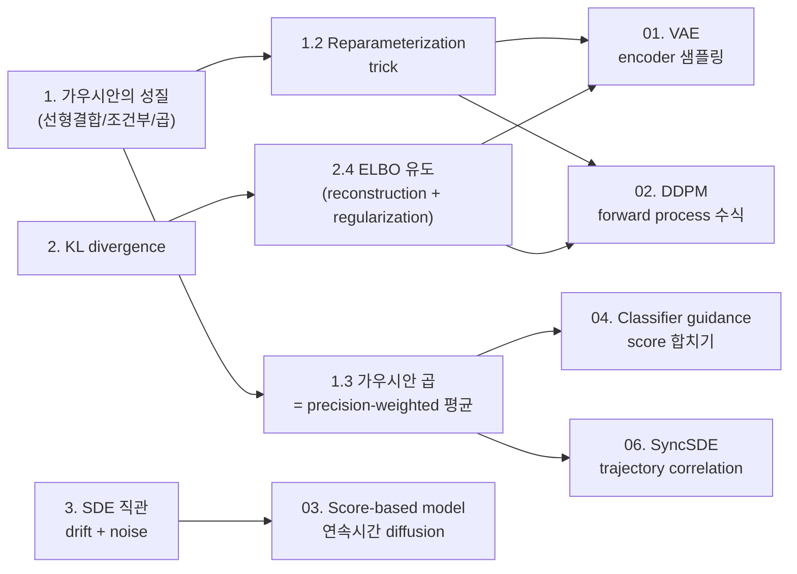
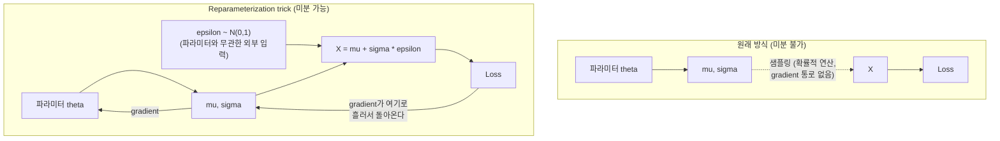
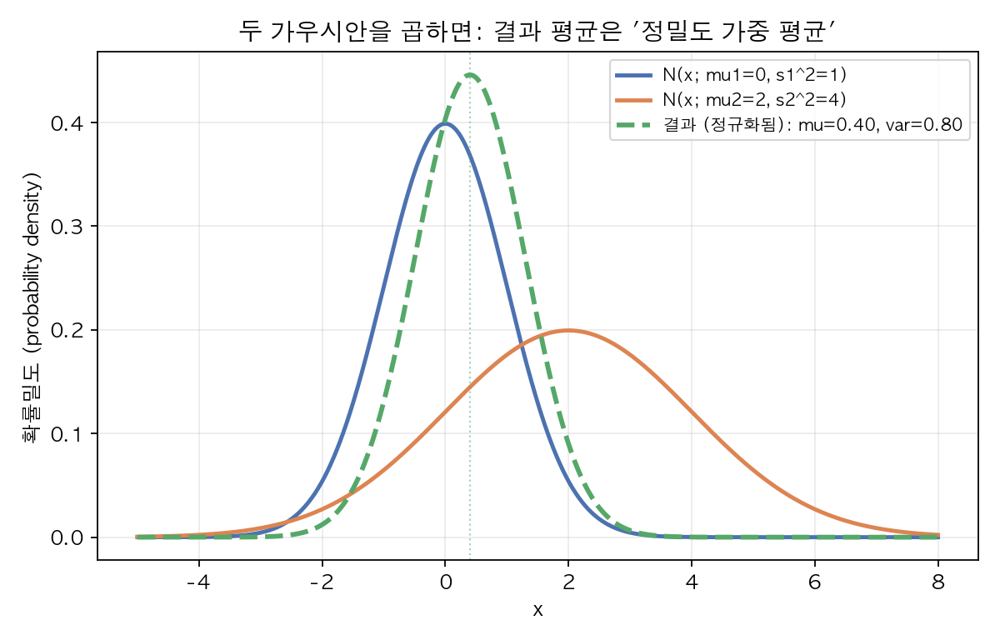
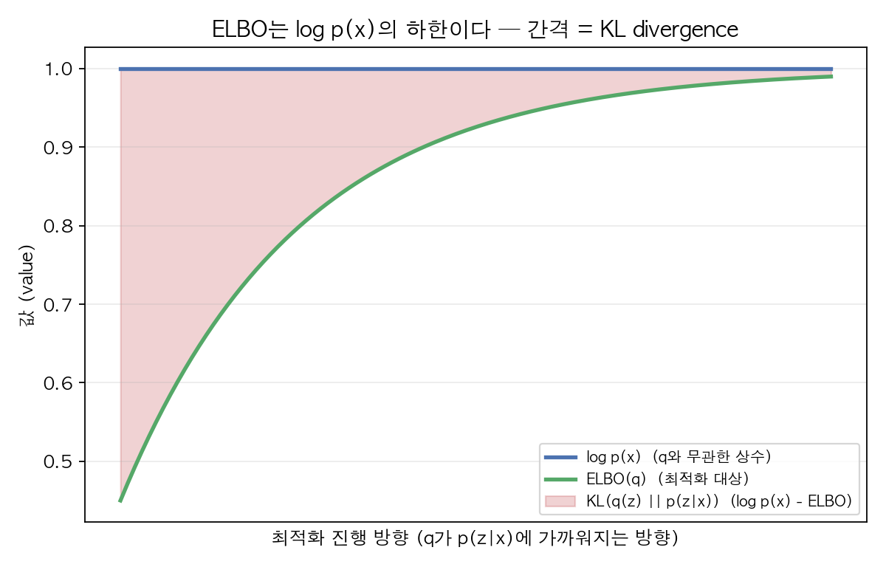

# 00. Math Foundations (Day 1-2)

Diffusion 논문이 안 읽히는 이유의 8할은 코드가 아니라 이 세 가지 - **다변량 가우시안의 성질**, **KL divergence / ELBO**, **확률과정(stochastic process)에 대한 최소한의 직관** - 이 손에 안 익어서다. 이 챕터에서 이 세 개를 "논문을 읽는 데 필요한 만큼만" 정리한다. 측도론 수준의 엄밀함은 목표가 아니다.

## 선수 확인

- 단변량 가우시안 `N(mu, sigma^2)`의 확률밀도함수 형태를 안다
- 조건부확률, 베이즈 정리를 안다 (ML Specialization 수준이면 충분)
- 편미분, 체인룰을 안다

## 이 챕터가 왜 중요한가 (미리 보는 지도)

이 챕터에서 다루는 세 덩어리 - 가우시안 성질, ELBO, SDE 직관 - 는 한 번 배우고 끝나는 게 아니라 뒤 챕터 전체에서 계속 재활용되는 "공용 부품"이다. 아래 그림을 먼저 보고, 지금 배우는 개념이 나중에 어디서 다시 튀어나오는지 감을 잡은 다음 본문으로 들어가자.



지금 당장 오른쪽 칸(01~06 챕터)이 뭔지 몰라도 상관없다. "왼쪽에서 배우는 이 네 개(reparameterization, 가우시안 곱, ELBO 분해, SDE 직관)를 정확히 잡아두면 뒤가 편해진다"는 것만 기억하고 넘어가면 된다.

## 1. 다변량 가우시안의 성질 - 이게 diffusion 수식의 8할이다

### 1.1 왜 하필 가우시안인가

Diffusion model은 forward/reverse process를 전부 가우시안 분포로 정의한다. 이유는 단 하나 - **가우시안은 연산에 대해 닫혀있어서(closed-form, "닫힌 형태로 답이 나온다"는 뜻) 계산이 가능**하기 때문이다.

- 가우시안의 선형결합은 다시 가우시안이다: `X ~ N(mu1, s1^2)`, `Y ~ N(mu2, s2^2)`이고 독립이면, `aX + bY ~ N(a*mu1 + b*mu2, a^2*s1^2 + b^2*s2^2)`
- 가우시안의 조건부 분포도 가우시안이다
- 가우시안끼리 곱하면 (정규화 상수만 다시 맞추면) 또 가우시안이다

만약 forward process에서 노이즈를 라플라스 분포나 균등분포로 섞었다면, reverse process의 분포가 무슨 모양인지 닫힌 형태로 못 구해서 애초에 학습이 불가능했을 것이다. **"가우시안을 쓰는 이유 = 수학이 풀리기 때문"** — 이 문장 하나가 diffusion model 설계 전체를 관통한다.

### 1.2 Reparameterization trick

**문제 상황부터 보자.** 신경망이 어떤 분포의 평균 `mu`와 표준편차 `sigma`를 출력하고, 거기서 샘플 `X`를 하나 뽑아서(`X ~ N(mu, sigma^2)`) 그 샘플을 다음 계산에 쓴다고 하자. 이 네트워크를 학습시키려면 loss를 `mu`, `sigma`를 만들어낸 파라미터에 대해 미분해서 backpropagation을 해야 하는데, 문제는 **"샘플링"이라는 연산 자체가 미분이 안 된다**는 것이다. `X ~ N(mu, sigma^2)`이라는 식은 "이런 확률분포에서 랜덤하게 하나 뽑아라"는 명령이지, `mu`나 `sigma`를 입력으로 받아 `X`를 출력하는 결정론적 함수가 아니다. 미분이라는 연산 자체가 "입력을 아주 조금 바꿨을 때 출력이 얼마나 바뀌는가"를 함수에 대해 묻는 것이므로, 애초에 함수가 아닌 확률적 연산에는 적용할 수가 없다.

**해결책은 "랜덤성을 분리해내는 것"이다.** 아래처럼 바꿔 쓰면:

```
X = mu + sigma * epsilon,   epsilon ~ N(0, 1)
```

이 식은 수학적으로 완전히 동일한 확률분포를 만들어낸다 (표준정규분포 `epsilon`을 `sigma`배 해서 늘리고 `mu`만큼 평행이동한 것 = `N(mu, sigma^2)`, 앞서 본 "가우시안 선형결합" 성질 그대로다). 그런데 관점이 바뀌었다. 이제 무작위성은 전부 `epsilon`이라는, 신경망 파라미터와 아무 상관없는 "외부에서 던져 넣는 난수"에게 떠넘겨졌고, `mu`와 `sigma`는 신경망 파라미터의 결정론적 함수로 남는다. `epsilon`은 매번 새로 뽑히는 상수 취급을 받으니 미분 경로에서 빠지고, `mu`, `sigma`를 만들어내는 파라미터에 대해서는 평범한 체인룰로 backpropagation이 가능해진다.



→ 이 트릭이 VAE(01번 챕터)에서 처음 핵심적으로 쓰이고, DDPM(02번 챕터)의 forward process 수식이 정확히 이 형태로 쓰인다. **지금 이 식을 외워두면 뒤 챕터에서 계속 재사용된다.**

### 1.3 두 가우시안을 곱하면? (SyncSDE까지 이어지는 포인트)

**왜 이걸 알아야 하는가부터 보자.** Diffusion 계열 논문을 읽다 보면 "두 개의 확률적인 추정(estimate)을 하나로 합치고 싶다"는 상황이 계속 나온다. 예를 들면 "이미지가 그럴듯해야 한다"는 신호와 "특정 클래스로 분류돼야 한다"는 신호를 합쳐서 하나의 방향으로 만들거나, 여러 diffusion trajectory에서 나온 서로 다른 예측을 하나로 합치는 경우다. 이때 각 신호를 가우시안으로 표현해두면, "두 가우시안을 곱한다"는 연산이 정확히 이 문제("두 확률적 추정을 하나로 합친다")에 대한 가장 기본적인 답이 된다. 그래서 이 계산을 완전히 손에 익혀야 한다.

**직접 계산해보자.** 두 가우시안의 확률밀도함수(PDF)를 곱한 것을 `x`에 대한 함수로 보면:

```
N(x; mu1, s1^2) * N(x; mu2, s2^2)
  = [1/sqrt(2*pi*s1^2)] * exp( -(x-mu1)^2 / (2*s1^2) )
    * [1/sqrt(2*pi*s2^2)] * exp( -(x-mu2)^2 / (2*s2^2) )
```

앞의 정규화 상수(`1/sqrt(2*pi*s^2)` 부분)들은 `x`와 무관한 상수이므로 일단 옆으로 치워두고, `exp(...)` 안의 지수 부분(`x`에 대한 식)만 따로 떼어서 전개해보자.

```
지수 부분 = -(1/2) * [ (x-mu1)^2/s1^2 + (x-mu2)^2/s2^2 ]
```

각 항을 전개하면 (`(x-mu)^2 = x^2 - 2*mu*x + mu^2`):

```
(x-mu1)^2/s1^2 = x^2/s1^2 - 2*mu1*x/s1^2 + mu1^2/s1^2
(x-mu2)^2/s2^2 = x^2/s2^2 - 2*mu2*x/s2^2 + mu2^2/s2^2
```

이 둘을 더해서 `x^2`, `x^1`, `x^0` 차수별로 묶으면:

```
지수 부분 안쪽 합 = x^2 * (1/s1^2 + 1/s2^2)
                    - 2*x * (mu1/s1^2 + mu2/s2^2)
                    + (mu1^2/s1^2 + mu2^2/s2^2)
```

여기서 **정밀도(precision)**라는 용어를 도입한다 - 정밀도는 그냥 "분산의 역수(`1/분산`)"를 부르는 이름이다. 분산이 클수록(불확실할수록) 정밀도는 작아지고, 분산이 작을수록(확신이 강할수록) 정밀도는 커진다. 아래처럼 줄여 쓰자:

```
A = 1/s1^2 + 1/s2^2     (두 정밀도의 합)
B = mu1/s1^2 + mu2/s2^2  (평균을 정밀도로 가중해서 더한 것)
```

그러면 지수 부분 안쪽 합은 `A*x^2 - 2*B*x + (상수)` 형태다. 이제 "완전제곱식 만들기(completing the square)"를 적용한다 - 목표는 이 식을 `A*(x - m)^2 + (x와 무관한 상수)` 형태로 바꿔서, 이게 또 다른 가우시안의 지수 부분과 같은 모양이라는 걸 보이는 것이다.

```
A*x^2 - 2*B*x = A * (x^2 - 2*(B/A)*x)
              = A * [ (x - B/A)^2 - (B/A)^2 ]
              = A*(x - B/A)^2 - B^2/A
```

`x`와 무관한 항(`mu1^2/s1^2 + mu2^2/s2^2`, `-B^2/A`)들은 전부 다시 정규화 상수 쪽으로 흡수되므로 (어차피 뒤에서 "전체 적분이 1이 되도록" 정규화 상수를 다시 계산하면 되기 때문에, `x`가 안 들어간 항은 신경 쓸 필요가 없다), `x`에 의존하는 부분만 남기면:

```
지수 부분 = -(1/2) * A * (x - B/A)^2 + (x와 무관한 상수)
```

이 형태는 정확히 `N(x; mu, s^2)`의 지수 부분(`-(x-mu)^2/(2*s^2) = -(1/2)*(1/s^2)*(x-mu)^2`)과 똑같은 모양이다. 즉 `1/s^2 = A`, `mu = B/A`로 두면 된다. 원래 표기로 되돌리면:

```
결합된 분산:   1/s^2 = 1/s1^2 + 1/s2^2
결합된 평균:   mu = (mu1/s1^2 + mu2/s2^2) / (1/s1^2 + 1/s2^2)
```

**즉, 두 가우시안을 곱한 결과도 가우시안이고, 그 평균은 "각 평균을 정밀도(확신의 정도)로 가중 평균한 것"이다.** 분산이 작은(확신이 강한) 쪽이 결과 평균을 더 세게 끌어당긴다는 뜻이다. 아래 그림은 `mu1=0, s1=1`과 `mu2=2, s2=2`를 곱했을 때 실제로 결과가 어떻게 나오는지 보여준다 (숫자는 실습 과제 1과 동일하다).



파란 곡선(분산이 작아 뾰족하고 확신이 강함)과 주황 곡선(분산이 커서 완만하고 확신이 약함)을 곱하면, 초록 점선처럼 파란 쪽 평균(`mu1=0`)에 훨씬 가깝게 당겨진 결과가 나온다. 이게 "정밀도 가중 평균"이 시각적으로 의미하는 바다 - 확신이 강한(분산이 작은) 신호가 결과를 더 세게 끌어당긴다.

이게 바로 **"두 개의 확률적 예측을 어떻게 하나로 합칠 것인가"**의 가장 기본적인 답이다. Classifier guidance에서 두 score를 더하는 것, diffusion synchronization에서 여러 trajectory의 score를 섞는 것 모두 결국 이 "가우시안 곱하기 = 정밀도 가중 평균" 아이디어의 변형이다. 지금 당장 완전히 와닿지 않아도 괜찮다 — 04번, 06번 챕터에서 이 식을 다시 꺼내 쓸 것이다.

## 2. KL Divergence와 ELBO (변분추론)

### 2.1 KL Divergence: 두 분포가 얼마나 다른가

생성모델을 만들다 보면 "내가 다루기 쉬운 분포 `q`"와 "내가 진짜로 원하는(하지만 다루기 어려운) 분포 `p`"가 얼마나 가까운지를 숫자 하나로 재고 싶을 때가 계속 나온다. 이 "두 분포 사이의 거리"를 재는 대표적인 도구가 **KL divergence(Kullback-Leibler divergence)**다.

```
KL(q || p) = E_q[ log(q(x) / p(x)) ]
```

`E_q[...]`는 "분포 `q`를 따르는 `x`에 대해 평균을 낸다(expectation)"는 뜻이다. 직관은 이렇다 - `q`라는 분포를 따르는 샘플을 하나 뽑았을 때, "만약 진짜 분포가 `p`였다면 이 샘플이 얼마나 놀라운(unlikely) 사건인가"를 `log(q(x)/p(x))`로 측정하고, 그걸 `q`에서 나올 법한 모든 샘플에 대해 평균낸 값이 KL divergence다. `q`와 `p`가 완전히 같은 분포면 이 비율이 항상 1이라서 `log`값이 0이 되고, 결과적으로 KL도 0이 된다. 그리고 뒤에서 증명하겠지만 KL은 **항상 0 이상**이다.

한 가지 꼭 기억해야 할 성질은 **비대칭(asymmetric)**이라는 것이다 - `KL(q||p) != KL(p||q)`. "q 기준으로 잰 p와의 차이"와 "p 기준으로 잰 q와의 차이"는 일반적으로 다른 숫자가 나온다. 그래서 "거리(distance)"라는 말 대신 "divergence"라는 이름을 쓴다 (진짜 거리는 대칭이어야 하니까).

### 2.2 Jensen's inequality: KL이 항상 0 이상인 이유

뒤에서 ELBO를 유도할 때도 그대로 쓰이는 도구라서, 여기서 미리 정리하고 넘어간다. **Jensen's inequality**는 "오목함수(concave function)에 대해서는, 함수값의 평균이 평균의 함수값보다 작거나 같다"는 정리다.

```
f가 concave하면:   E[f(X)] <= f(E[X])
f가 convex하면:    E[f(X)] >= f(E[X])
```

직관은 그림으로 그려보면 쉽다 - concave 함수(위로 볼록, 예: `log`)는 그래프가 항상 "두 점을 잇는 직선(현, chord)"보다 위에 있다. 그래서 여러 점의 `f`값을 평균 낸 것(직선 위의 값)은, 그 점들의 `x`값을 먼저 평균 내고 나서 `f`를 적용한 것(곡선 위의 값)보다 작거나 같다. `log`는 대표적인 concave 함수이고, `-log`는 반대로 convex 함수다.

이걸 이용해서 KL이 항상 0 이상임을 증명해보자.

```
KL(q||p) = E_q[ log(q(x)/p(x)) ]
         = E_q[ -log(p(x)/q(x)) ]
```

`-log`는 convex 함수이므로 Jensen's inequality(convex 버전, `E[f(X)] >= f(E[X])`)를 적용하면:

```
E_q[ -log(p(x)/q(x)) ] >= -log( E_q[ p(x)/q(x) ] )
```

이제 우변의 `E_q[p(x)/q(x)]`를 직접 계산해보면:

```
E_q[ p(x)/q(x) ] = integral of q(x) * (p(x)/q(x)) dx
                  = integral of p(x) dx
                  = 1   (p는 확률분포이므로 전체 적분이 1)
```

따라서:

```
KL(q||p) >= -log(1) = 0
```

**즉 KL divergence는 항상 0 이상이고, `q = p`일 때만 등호가 성립한다.** 이 사실을 다음 절 ELBO 유도에서 그대로 재사용한다.

### 2.3 왜 KL이 필요한가: Marginal Likelihood를 직접 최적화할 수 없어서

생성모델의 목표는 결국 `log p(x)` (데이터가 관측될 확률의 로그, 이걸 marginal likelihood라고 부른다)를 최대화하는 것이다. 그런데 잠재변수(latent variable, 직접 관측되지 않고 모델 내부에만 존재하는 변수 - VAE의 압축된 코드, diffusion의 중간 노이즈 이미지들이 여기 해당한다) `z`가 있는 모델에서는

```
p(x) = integral over z of p(x, z) dz
```

이 적분이 **계산 불가능(intractable, "닫힌 형태의 해를 구할 수도 없고 직접 계산하기에는 너무 비싸다"는 뜻)**한 경우가 대부분이다. `z`가 고차원이면 이 적분을 모든 `z`에 대해 직접 계산하는 건 사실상 불가능하다. VAE, diffusion model 둘 다 이 문제를 안고 있다.

### 2.4 ELBO 유도: Jensen's inequality부터 한 줄씩

**직접 계산할 수 없는 `log p(x)`를, 계산 가능한 다른 양으로 바꿔치기하는 것**이 이 절의 목표다. 그 계산 가능한 대체물이 바로 **ELBO(Evidence Lower BOund)**다.

**1단계. `log p(x)`를 임의의 분포 `q(z)`를 끼워 넣어서 다시 쓴다.**

`q(z)`는 우리가 자유롭게 고를 수 있는, 다루기 쉬운 분포다 (예: 신경망이 출력하는 가우시안). 적분 안에 `q(z)/q(z) = 1`을 곱해도 값은 바뀌지 않는다는 트릭을 쓴다.

```
log p(x) = log( integral over z of p(x,z) dz )
         = log( integral over z of q(z) * [p(x,z)/q(z)] dz )
         = log( E_q[ p(x,z)/q(z) ] )
```

마지막 줄은 "`q(z)`에 대한 가중평균"의 정의를 그대로 적용한 것뿐이다 (`integral of q(z)*(...) dz` = `E_q[...]`).

**2단계. Jensen's inequality를 적용한다.**

`log`는 concave 함수이므로 `E[f(X)] <= f(E[X])`, 즉 `f(E[X]) >= E[f(X)]`가 성립한다. 여기서 `f = log`, `X = p(x,z)/q(z)`로 놓으면:

```
log( E_q[ p(x,z)/q(z) ] )  >=  E_q[ log( p(x,z)/q(z) ) ]
```

좌변은 1단계에서 구한 `log p(x)`와 정확히 같다. 우변을 **ELBO(q)**라고 이름 붙인다:

```
ELBO(q) := E_q[ log p(x,z) - log q(z) ]
```

이렇게 해서 `log p(x) >= ELBO(q)`라는 부등식을 얻었다 - 이게 "ELBO는 log p(x)의 하한(lower bound)"이라는 이름의 유래다. 그런데 부등식만으로는 "얼마나 차이나는지"를 모른다. 3단계에서 그 차이(gap)를 정확히 구해본다.

**3단계. 등호까지 포함한 정확한 항등식을 유도한다.**

베이즈 정리에서 `p(x,z) = p(z|x) * p(x)`이므로, 양변에 로그를 씌우면 `log p(x,z) = log p(z|x) + log p(x)`, 즉:

```
log p(x) = log p(x,z) - log p(z|x)
```

우변에 `- log q(z) + log q(z)` (=0)를 끼워 넣어서 두 덩어리로 묶는다:

```
log p(x) = [ log p(x,z) - log q(z) ]  +  [ log q(z) - log p(z|x) ]
```

이제 양변에 `E_q[...]`를 취한다. 좌변 `log p(x)`는 `z`에 의존하지 않는 상수이므로 평균을 취해도 그대로다:

```
log p(x) = E_q[ log p(x,z) - log q(z) ]  +  E_q[ log q(z) - log p(z|x) ]
```

우변 첫 덩어리는 방금 정의한 `ELBO(q)`와 정확히 같다. 두 번째 덩어리 `E_q[ log q(z) - log p(z|x) ] = E_q[ log(q(z)/p(z|x)) ]`는 KL divergence의 정의 그대로다 (`q(z)`와 `p(z|x)`, 즉 "true posterior"라고 부르는 - 데이터 `x`가 주어졌을 때 잠재변수 `z`의 진짜 사후분포 - 사이의 KL). 정리하면:

```
log p(x) = ELBO(q) + KL(q(z) || p(z|x))
```

**이게 완전한 등식이다** (2단계의 부등식과 달리 근사나 부등호가 전혀 없는 정확한 분해다). 그리고 2.2절에서 증명했듯 `KL(...)`은 항상 0 이상이므로, 이 등식에서 바로 `log p(x) >= ELBO(q)`가 다시 나온다 - 2단계의 결과와 정확히 일치한다. 또한 이 등식은 "ELBO와 log p(x) 사이의 간격이 정확히 `q`와 true posterior 사이의 KL이다"라는 것도 알려준다. 즉 **`q`를 true posterior `p(z|x)`에 가깝게 만들수록 ELBO는 log p(x)에 더 바짝 붙는다.**



위 그림은 이 관계를 개념적으로 보여준다 (실제 학습 곡선이 아니라 예시로 그린 그래프다). `log p(x)`는 `q`를 어떻게 고르든 변하지 않는 상수이고, 학습 과정에서 `q`가 true posterior `p(z|x)`에 가까워질수록 빨간 영역(`KL(q||p(z|x))`)이 줄어들면서 초록색 `ELBO(q)` 곡선이 파란색 `log p(x)` 선에 점점 붙는 것을 볼 수 있다. `log p(x)`는 직접 계산할 수 없으니, 대신 계산 가능한 `ELBO`를 최대화하면 `log p(x)`도 간접적으로 끌어올려지는 셈이다. 이게 "Evidence Lower BOund"라는 이름의 유래이자, 변분추론(variational inference)이라는 방법론 전체의 핵심 아이디어다.

**ELBO를 한 번 더 풀어쓰면 흔히 보는 형태가 나온다.** `ELBO(q) = E_q[log p(x,z) - log q(z)]`에서 `p(x,z) = p(x|z) * p(z)` (베이즈 정리를 반대 방향으로 적용)를 대입하면:

```
ELBO(q) = E_q[ log p(x|z) + log p(z) - log q(z) ]
        = E_q[ log p(x|z) ]  -  E_q[ log q(z) - log p(z) ]
        = E_q[ log p(x|z) ]  -  KL(q(z) || p(z))
```

즉:

```
ELBO(q) = E_q[ log p(x|z) ]  -  KL(q(z) || p(z))
          ^^^^^^^^^^^^^^^^     ^^^^^^^^^^^^^^^^^^
          재구성(reconstruction) 항      정규화(regularization) 항
```

- 첫 항: `z`로부터 `x`를 얼마나 잘 복원하는가 (VAE의 reconstruction loss)
- 둘째 항: `q(z)`가 사전분포(prior, "데이터를 보기 전에 `z`에 대해 가정하는 분포") `p(z)`에서 너무 멀어지지 않게 하는 정규화

**이 두 항 분해가 VAE loss의 정체이고, DDPM loss도 결국 이 ELBO를 시간축으로 여러 단계에 걸쳐 확장한 것에 불과하다.** 02번 챕터에서 정확히 같은 논리가 다시 나온다.

### 2.5 SyncSDE 예고

지난 대화에서 다뤘던 SyncSDE 논문도 "목적함수를 두 개의 항(개별 fidelity 항 + trajectory 간 correlation 항)으로 분해한다"고 했는데, 이 분해 방식이 지금 본 ELBO의 "재구성 항 + 정규화 항" 분해와 **논리 구조가 완전히 동일**하다. 이 패턴(하나의 어려운 목적함수를 계산 가능한 두 항으로 쪼갠다)을 지금 확실히 잡아두면 06번 챕터가 훨씬 쉬워진다.

## 3. 확률과정(Stochastic Process) 최소 직관

엄밀한 이토 계산(Ito calculus)까지는 필요 없다. 아래 두 문장만 직관적으로 이해하면 03번 챕터 진입이 가능하다.

- **브라운 운동(Brownian motion) `w(t)`**: 아주 작은 시간 `dt` 동안 `N(0, dt)`만큼 랜덤하게 흔들리는 연속적인 랜덤 경로. "매 순간 미세하게 무작위로 흔들리는 점의 궤적"이라고 생각하면 된다.
- **확률미분방정식(SDE)**: `dx = f(x,t) dt + g(t) dw` 형태의 식. 우변 첫 항은 "정해진 방향으로 흘러가는 힘(drift)", 둘째 항은 "브라운 운동만큼 랜덤하게 흔들리는 잡음(diffusion)". 즉 "결정론적 흐름 + 무작위 흔들림"의 합으로 시간에 따른 `x`의 변화를 표현한 식이다.

Diffusion model의 forward process(이미지에 점점 노이즈를 섞는 것)를 이산적인 여러 스텝이 아니라 연속적인 시간 `t`에 대한 하나의 SDE로 쓸 수 있다는 게 03번 챕터의 핵심이다. 지금은 "SDE = drift + noise"라는 형태만 눈에 익혀두면 충분하다.

## 실습 과제 (Day 1-2)

1. 손으로 계산: 1차원 가우시안 두 개(`mu1=0, s1=1`), (`mu2=2, s2=2`)를 곱했을 때 결과 가우시안의 평균/분산을 직접 계산해보기 (섹션 1.3 공식 검증용) — 풀이는 부록 A
2. 손으로 유도: ELBO 식 `log p(x) = ELBO + KL(...)`을 Jensen's inequality로 직접 증명해보기 (막히면 아래 참고자료의 유도 과정을 보고 따라 쓰기) — 풀이는 부록 B
3. numpy로 reparameterization trick 코드 3줄 작성해서, `epsilon`을 통해 만든 샘플의 평균/분산이 실제로 `mu`, `sigma^2`에 수렴하는지 확인 (샘플 10000개 정도로) — 풀이는 부록 C

## 참고 자료

- Bishop, *Pattern Recognition and Machine Learning* 2.3절 (가우시안 성질), 9.4절/10장 초반 (ELBO 유도) — 이 분야 사실상 표준 교재, PDF 검색하면 쉽게 구함
- Lilian Weng 블로그, "From Autoencoder to Beta-VAE" 도입부 — ELBO 유도를 아주 친절하게 풀어씀
- 3Blue1Brown 유튜브, "But what is a neural network?" 시리즈 중 확률/가우시안 관련 영상 (직관 보강용, 필수 아님)

## 부록: 실습 과제 풀이

### 부록 A. 문제 1 풀이 - 가우시안 곱 직접 계산

주어진 값: `mu1 = 0, s1 = 1` (분산 `s1^2 = 1`), `mu2 = 2, s2 = 2` (분산 `s2^2 = 4`)

**1단계: 정밀도(1/분산)를 각각 구한다.**

```
precision1 = 1/s1^2 = 1/1 = 1
precision2 = 1/s2^2 = 1/4 = 0.25
```

**2단계: 결합된 분산을 구한다 (섹션 1.3의 `1/s^2 = 1/s1^2 + 1/s2^2`).**

```
1/s^2 = precision1 + precision2 = 1 + 0.25 = 1.25
s^2 = 1 / 1.25 = 0.8
```

**3단계: 결합된 평균을 구한다 (섹션 1.3의 `mu = (mu1/s1^2 + mu2/s2^2) / (1/s1^2 + 1/s2^2)`).**

```
분자 = mu1*precision1 + mu2*precision2 = 0*1 + 2*0.25 = 0.5
mu = 분자 / (1/s^2) = 0.5 / 1.25 = 0.4
```

**결론: 결과 가우시안은 `mu = 0.4, s^2 = 0.8` (표준편차로는 약 `0.894`).** `mu1=0` 쪽이 분산이 더 작아(더 확신이 강해) 결과 평균이 `mu1=0`과 `mu2=2`의 정중앙(`1.0`)이 아니라 `mu1` 쪽으로 더 당겨진 `0.4`가 나온 것을 볼 수 있다. 본문의 시각화(`assets/00-gaussian-product.png`)에서 초록 점선의 봉우리 위치가 정확히 이 값과 일치한다.

### 부록 B. 문제 2 풀이 - ELBO를 Jensen's inequality로 유도

본문 2.4절에서 이미 전개했지만, "손으로 유도해보기" 과제의 답안 형태로 다시 한번 압축해서 정리한다.

**목표: `log p(x) = ELBO(q) + KL(q(z)||p(z|x))`를 보이고, 그 결과로 `log p(x) >= ELBO(q)`가 성립함을 확인한다.**

1) `q(z)/q(z) = 1`을 끼워 넣어 기댓값 형태로 바꾼다.

```
log p(x) = log( integral p(x,z) dz ) = log( E_q[ p(x,z)/q(z) ] )
```

2) `log`는 concave 함수이므로 Jensen's inequality(`f(E[X]) >= E[f(X)]`)를 적용한다.

```
log( E_q[ p(x,z)/q(z) ] ) >= E_q[ log(p(x,z)/q(z)) ] = ELBO(q)
```

→ 여기까지가 "부등식 버전" 증명이다. `log p(x) >= ELBO(q)`.

3) 등호를 포함한 정확한 차이를 구하려면, `log p(x,z) = log p(z|x) + log p(x)`을 이용해서

```
log p(x) = [log p(x,z) - log q(z)] + [log q(z) - log p(z|x)]
```

로 쪼갠 뒤 양변에 `E_q[...]`를 취하면 (좌변은 `z`와 무관하므로 그대로):

```
log p(x) = E_q[log p(x,z) - log q(z)] + E_q[log q(z) - log p(z|x)]
         = ELBO(q) + KL(q(z) || p(z|x))
```

4) `KL(...) >= 0`은 2.2절에서 Jensen's inequality(이번엔 `-log`가 convex라는 방향)로 이미 증명했으므로, 이 등식에서 바로 `log p(x) >= ELBO(q)`가 다시 확인된다. **핵심은 Jensen's inequality가 정확히 두 번 쓰인다는 것** - 한 번은 KL이 0 이상임을 보이는 데, 한 번은 (혹은 등가적으로 동일한 부등식 형태로) ELBO가 하한이 됨을 보이는 데.

### 부록 C. 문제 3 풀이 - reparameterization trick numpy 검증

```python
import numpy as np

mu, sigma = 3.0, 2.0
epsilon = np.random.randn(10000)      # epsilon ~ N(0, 1)
X = mu + sigma * epsilon              # reparameterization trick

print(X.mean(), X.var())              # 대략 3.0, 4.0 (sigma^2) 근처로 나온다
```

`epsilon`이 표준정규분포에서 뽑혔으므로, `X = mu + sigma*epsilon`은 섹션 1.1에서 본 "가우시안의 선형결합은 다시 가우시안"이라는 성질에 의해 정확히 `N(mu, sigma^2)`를 따른다. 샘플이 10000개면 표본평균은 `mu=3.0`에, 표본분산은 `sigma^2=4.0`에 (완전히 정확하게는 아니지만) 상당히 가깝게 수렴하는 것을 실제로 실행해보면 확인할 수 있다. 이 3줄이 정확히 VAE/DDPM에서 쓰이는 샘플링 코드의 원형이다.

## 시각자료 생성 스크립트

본문의 두 PNG 이미지(`assets/00-gaussian-product.png`, `assets/00-elbo-lower-bound.png`)는 `assets/00-generate-plots.py`에서 numpy/matplotlib만으로 생성했다 (외부 데이터셋이나 신경망 학습 없음). 재생성하려면:

```
python3 assets/00-generate-plots.py
```
