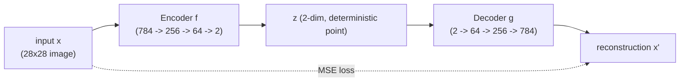
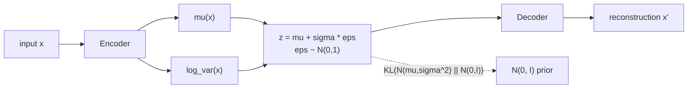
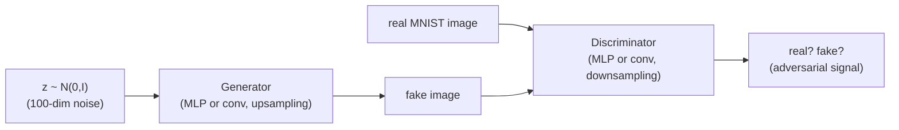
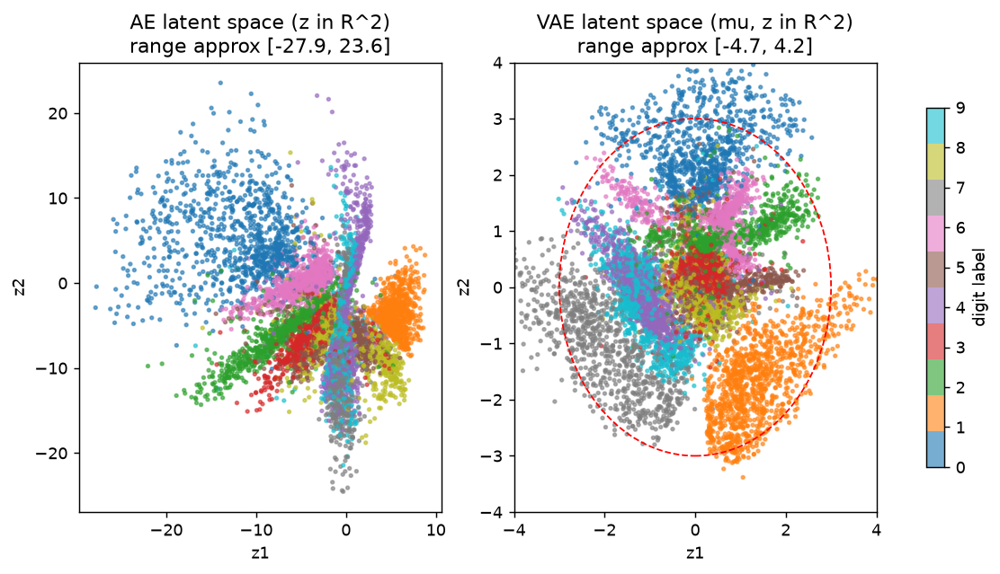
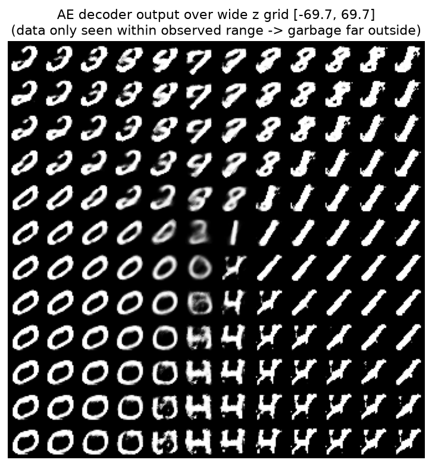
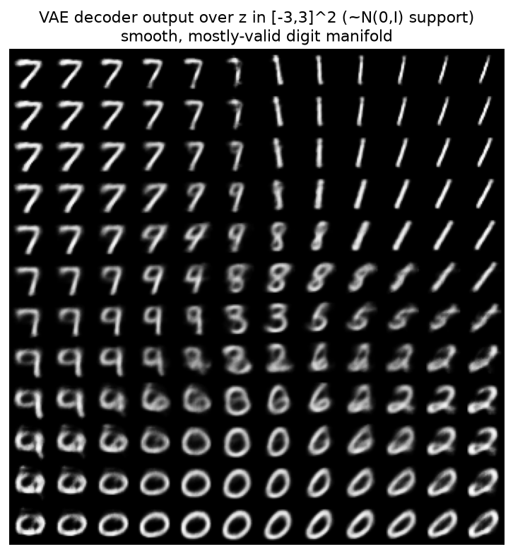
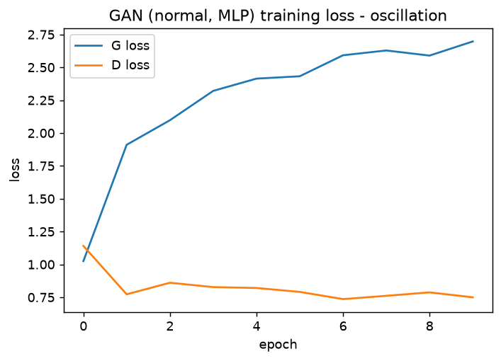
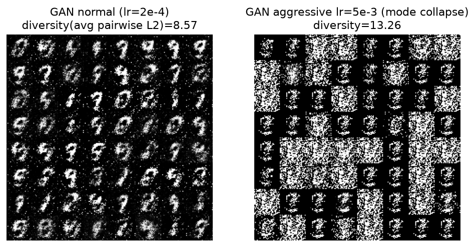
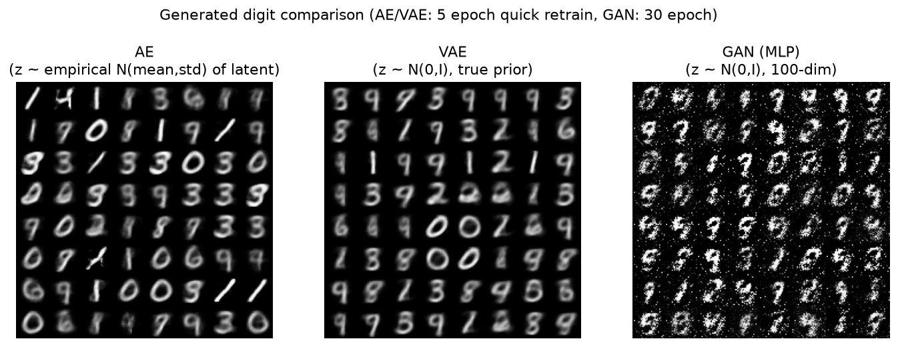

# 01. Generative Model Landscape - AE -> VAE -> GAN (Day 3-6)

`../computer-vision/05-generative-models-beyond-the-course.md`에 GAN 개요와 VAE 한 줄 요약이 이미 있다. 이 챕터의 목적은 그 요약을 **수식 유도 + 직접 구현** 수준으로 끌어올리는 것이다. Diffusion으로 바로 뛰어들면 "왜 이렇게 복잡하게 하지?"라는 질문에 답을 못 하게 되는데, VAE/GAN의 한계를 몸으로 겪어봐야 diffusion의 설계 선택이 이해된다. 이 챕터의 실습은 전부 실제로 PyTorch로 MNIST에 돌려본 결과다 (GPU 없이 M-series Mac의 MPS 백엔드로, epoch 수는 5~25 정도로 적당히 낮춰서 실행) - 아래 나오는 수치와 이미지는 전부 이 문서를 쓰면서 직접 학습시켜 얻은 것이다.

## 선수 확인

- 00번 챕터의 reparameterization trick, ELBO 식을 이해했다
- CNN/기본 신경망 학습 루프(forward, loss, backward, optimizer.step)를 PyTorch로 짤 수 있다 (Deep Learning Specialization 수강 중이면 충분)

## 1. Autoencoder (AE) - 압축과 복원

가장 단순한 형태: 인코더 `f`가 입력 `x`를 저차원 벡터 `z = f(x)`로 압축하고, 디코더 `g`가 `x' = g(z)`로 복원한다. 학습 목표는 그냥 `||x - x'||^2`를 최소화하는 것.

```
z = f(x)          (encoder, 결정론적)
x' = g(z)         (decoder, 결정론적)
Loss = ||x - x'||^2
```



**AE는 왜 생성모델이 아닌가 - 구체적으로.** AE를 학습시키면 인코더는 "이 숫자 이미지를 2차원 좌표 하나로 어떻게든 구겨 넣는" 방법을 찾아낸다. 그런데 이 압축 방식에는 아무런 제약이 없다 - 학습 데이터를 잘 구분해서 복원만 잘 되면 되니까, 인코더는 숫자 종류별로 `z` 공간 여기저기에 **제멋대로 길게 늘어진 팔(arm) 모양**으로 흩어놓는다 (실제로 실습 1에서 이 모양을 직접 확인했다 - 아래 실습 절 그림 참고). 문제는 이 팔들 사이에 큰 빈 공간이 남는다는 것. 그 빈 공간의 좌표를 디코더에 넣으면, 디코더 입장에서는 "학습 때 한 번도 본 적 없는 입력"이라 무엇을 그려야 할지 전혀 배운 적이 없다. 그 결과 두 숫자 모양이 이상하게 섞이거나, 선 몇 개만 그리다 마는 식의 **깨진 이미지**가 나온다.

비유하자면, AE의 latent space는 "이 학생이 시험 답안을 채점하기 편하게 자기만의 방식으로 압축해놓은 메모"에 가깝다. 메모를 남긴 학생(인코더)과 그걸 다시 답안으로 풀어쓰는 학생(디코더)끼리는 손발이 잘 맞지만, 제3자가 그 메모 형식을 흉내내서 아무 메모나 하나 만들어 디코더에 준다면 - 애초에 그런 메모가 나올 거라고 아무도 보장한 적이 없으니 - 무슨 결과가 나올지 아무도 모른다. **"압축과 복원을 잘한다"와 "새로운 데이터를 생성할 수 있다"는 완전히 다른 능력**이라는 게 핵심이다. 이 문제를 푸는 게 VAE다.

## 2. VAE (Variational Autoencoder) - AE에 확률을 입힌다

### 2.1 핵심 아이디어

AE처럼 `z = f(x)`로 결정론적으로 압축하는 대신, 인코더가 **분포의 파라미터**를 출력하게 한다.

```
encoder(x) -> (mu(x), sigma(x))
z ~ N(mu(x), sigma(x)^2)     <- 00번 챕터의 reparameterization trick으로 샘플링
decoder(z) -> x'
```

그리고 이 `z`의 분포가 표준정규분포 `N(0, I)`에 가깝도록 강제한다 (00번 챕터의 ELBO 정규화 항). 그러면 학습이 끝난 후 `z ~ N(0, I)`에서 그냥 랜덤 샘플링해도 디코더가 그럴듯한 `x`를 만들어낼 수 있다 - **이게 AE와 VAE의 결정적 차이**다. AE의 "빈 공간에 가면 뭐가 나올지 모른다"는 문제를, VAE는 애초에 "모든 좌표에 확률적으로 데이터가 걸쳐있게" 만들어서 빈 공간 자체를 없애버리는 방식으로 해결한다.



### 2.2 VAE Loss = ELBO 그 자체

00번 챕터에서 유도한 ELBO를 그대로 가져오면:

```
Loss = -ELBO = -E_q(z|x)[ log p(x|z) ]  +  KL( q(z|x) || N(0,I) )
             = 재구성 손실(MSE 등)         +   정규화 손실 (KL)
```

- 재구성 손실: `x`와 디코더 출력 `x'`의 차이 (MSE 또는 binary cross-entropy)
- KL 손실: 인코더가 만든 `N(mu, sigma^2)`가 `N(0, I)`에서 얼마나 먼가. 두 가우시안 사이의 KL은 닫힌 형태(closed-form) 공식이 있어서 직접 계산 가능 (00번 챕터 "가우시안은 닫혀있다"가 여기서도 위력을 발휘)

**닫힌 형태 공식 유도 (1차원 먼저).** `q(x) = N(x; mu, sigma^2)`, `p(x) = N(x; 0, 1)`이라 하자. 가우시안의 log-밀도를 그대로 대입하는 것부터 시작한다.

```
log q(x) = -0.5*log(2*pi) - log(sigma) - (x - mu)^2 / (2*sigma^2)
log p(x) = -0.5*log(2*pi) - x^2 / 2

log q(x) - log p(x) = -log(sigma) - (x-mu)^2/(2*sigma^2) + x^2/2
```

이제 `KL(q||p) = E_q[ log q(x) - log p(x) ]`이므로, 위 식을 `x ~ q`에 대해 기댓값을 취한다. 여기서 분산의 정의 `E_q[(x-mu)^2] = sigma^2`와, `E[x^2] = Var(x) + E[x]^2`이므로 `E_q[x^2] = sigma^2 + mu^2`라는 두 가지 사실만 쓰면 된다.

```
KL(q||p) = E_q[ -log(sigma) - (x-mu)^2/(2*sigma^2) + x^2/2 ]
         = -log(sigma) - sigma^2/(2*sigma^2) + (sigma^2 + mu^2)/2
         = -log(sigma) - 1/2 + (sigma^2 + mu^2)/2
         = 0.5 * (sigma^2 + mu^2 - 1) - log(sigma)
```

`log(sigma) = 0.5 * log(sigma^2)`이므로 `log(sigma^2) = log_var`로 표기를 바꾸면:

```
KL( N(mu, sigma^2) || N(0,1) ) = 0.5 * ( exp(log_var) + mu^2 - 1 - log_var )
```

인코더가 여러 차원을 서로 독립(diagonal covariance)으로 출력하는 실전 VAE에서는, 각 차원의 KL을 그냥 더하면 된다 (독립 확률변수의 KL은 합산 가능 - 다변량 가우시안이 축마다 분해되기 때문).

```
KL_total = 0.5 * sum_i ( exp(log_var_i) + mu_i^2 - 1 - log_var_i )
```

이 식이 바로 실습 코드에서 그대로 구현하는 `kl = -0.5 * sum(1 + log_var - mu^2 - exp(log_var))`이다 (부호만 정리하면 동일한 식). Kingma & Welling 원 논문 Appendix B의 유도도 정확히 이 경로를 따른다.

### 2.3 왜 VAE 생성 이미지는 흐릿한가

재구성 손실로 흔히 쓰는 MSE(pixel-wise L2)는 "여러 그럴듯한 정답 이미지들의 평균"을 만들어내는 경향이 있다 (예: 눈동자 위치가 살짝씩 다른 여러 정답이 있다면, MSE를 최소화하는 답은 그 중간 어딘가의 흐릿한 눈동자). GAN은 이 문제를 "픽셀 차이"가 아니라 "진짜처럼 보이는가"라는 다른 종류의 신호로 학습해서 훨씬 선명한 이미지를 만든다. 아래 실습 절의 비교 이미지에서 이 차이를 직접 눈으로 확인할 수 있다.

## 3. GAN 복습 + 왜 diffusion으로 넘어갔는가

GAN의 minimax game, mode collapse, DCGAN/CycleGAN 같은 변형들은 [`../computer-vision/05-generative-models-beyond-the-course.md`](../computer-vision/05-generative-models-beyond-the-course.md)에 이미 정리되어 있으니 여기서는 그 내용을 반복하지 않고 "diffusion과의 대비"에만 집중한다 (실습에서 그 GAN을 실제로 구현하고 mode collapse를 직접 재현한 결과는 아래 실습 절에 정리했다).



| | GAN | Diffusion |
|---|---|---|
| 학습 신호 | Discriminator와의 경쟁 (매우 불안정) | 노이즈 예측 회귀 문제 (안정적) |
| 한 번에 푸는 문제 | "진짜 vs 가짜" 전체 판별 | "노이즈 한 스텝만 제거" (훨씬 쉬움) |
| 다양성 | mode collapse 위험 | 상대적으로 다양성 좋음 |
| 샘플링 속도 | 1회 forward로 빠름 | 여러 step 반복 필요 (느림) - 04번 챕터에서 이 문제를 DDIM으로 다룸 |

**diffusion이 결국 이기게 된 핵심 이유**: "어려운 문제를 한 번에 푸는 대신, 아주 쉬운 문제(노이즈 한 스텝 제거)를 여러 번 반복해서 푼다"는 발상의 전환. 이 문장을 지금 기억해두면 02번 챕터 전체가 이 문장의 상세 버전이라는 걸 알게 될 것이다.

## 실습 결과 (Day 3-6) - 실제로 돌려본 것

실행 환경: PyTorch 2.14 + torchvision, Apple Silicon MPS 백엔드, MNIST 60,000장. 아래는 이 문서를 쓰면서 직접 작성해 실행한 코드의 핵심 부분과 실제 관찰 결과다.

### Day 3 - Plain Autoencoder (latent dim=2)

인코더/디코더는 완전 fully-connected로 짰다.

```python
class AE(nn.Module):
    def __init__(self, zdim=2):
        super().__init__()
        self.enc = nn.Sequential(
            nn.Linear(784, 256), nn.ReLU(),
            nn.Linear(256, 64), nn.ReLU(),
            nn.Linear(64, zdim),
        )
        self.dec = nn.Sequential(
            nn.Linear(zdim, 64), nn.ReLU(),
            nn.Linear(64, 256), nn.ReLU(),
            nn.Linear(256, 784), nn.Sigmoid(),
        )
    def forward(self, x):
        z = self.enc(x)
        return self.dec(z), z

loss = F.mse_loss(x_reconstructed, x)   # 그냥 픽셀 MSE
```

15 epoch 학습 후 (Adam, lr=1e-3) MNIST test set 전체를 인코더에 통과시켜 `z` 좌표를 뽑아봤다. 최종 MSE는 `0.0400`. 실제로 나온 `z` 값의 범위는 대략 `z1 in [-27.9, 8.8]`, `z2 in [-24.5, 23.6]`으로, **아무 제약이 없다 보니 좌표축 스케일 자체가 통제 불능으로 커졌고**, 숫자 종류(라벨)별로 서로 다른 방향으로 길게 뻗은 팔 모양 클러스터가 만들어졌다 (아래 그림 왼쪽).



이 관측 데이터 범위보다 2.5배 넓은 그리드(대략 `[-70, 70]`)에서 좌표를 균일하게 뽑아 디코더에 통과시켜본 결과가 아래 그림이다. 데이터가 있던 영역(왼쪽 위, 좌표가 작은 영역) 근처에서는 그나마 숫자 형태가 유지되지만, 관측 범위를 크게 벗어난 오른쪽 아래로 갈수록 **숫자로 보기 힘든 사선/획 패턴만 반복해서 나온다** - 디코더가 한 번도 학습해보지 못한 좌표라서 무의미한 출력으로 붕괴한 것이다. 이게 "AE의 latent space는 구조화되어 있지 않다"는 주장의 실증이다.



### Day 4 - VAE로 확장

인코더가 `mu`, `log_var` 두 개를 출력하도록 head를 나누고, reparameterization trick과 closed-form KL(섹션 2.2)을 추가했다.

```python
class VAE(nn.Module):
    def __init__(self, zdim=2):
        super().__init__()
        self.trunk = nn.Sequential(nn.Linear(784, 256), nn.ReLU(), nn.Linear(256, 64), nn.ReLU())
        self.mu = nn.Linear(64, zdim)
        self.logvar = nn.Linear(64, zdim)
        self.dec = nn.Sequential(   # AE와 동일한 구조
            nn.Linear(zdim, 64), nn.ReLU(),
            nn.Linear(64, 256), nn.ReLU(),
            nn.Linear(256, 784), nn.Sigmoid(),
        )
    def reparam(self, mu, logvar):
        std = torch.exp(0.5 * logvar)
        return mu + std * torch.randn_like(std)

def vae_loss(x_recon, x, mu, logvar):
    recon = F.binary_cross_entropy(x_recon, x, reduction="sum") / x.size(0)
    kl = -0.5 * torch.sum(1 + logvar - mu.pow(2) - logvar.exp()) / x.size(0)
    return recon + kl
```

15 epoch 학습 후 (recon=`140.8`, KL=`6.14`, 둘 다 배치당 합산 기준이라 AE의 픽셀 평균 MSE와는 스케일이 다르다는 점 주의) 같은 방식으로 latent space를 시각화하면 위 그림 오른쪽처럼 **`z1, z2` 둘 다 대략 `[-4.7, 4.2]` 범위 안에, 원점을 중심으로 뭉쳐서** 분포한다 (그림에 표시한 반지름 3인 빨간 점선 원 안에 대부분의 점이 들어온다 - `N(0,I)`의 대부분의 질량이 몰려있는 영역과 거의 일치). AE 때 좌표 범위가 30 가까이 벌어졌던 것과 비교하면 확실한 차이다.

`z ~ N(0,I)`에서 랜덤하게 뽑은 좌표를 그리드로 훑으면서 디코더에 넣어보면, AE 때와 달리 숫자가 **부드럽게 다른 숫자로 이어지며 변형(interpolation)**된다 - 실제로 아래 그림에서는 `7 -> 1`, `9 -> 8 -> 3/6`, `2 -> 0`으로 자연스럽게 넘어가는 게 보인다. 빈 공간이 없이 latent space 전체가 "그럴듯한 숫자"로 채워져 있다는 뜻이고, 이게 VAE가 실제로 생성모델로 쓰일 수 있는 이유다.



### Day 5 - 간단한 GAN 구현

처음엔 conv 기반 DCGAN(`ConvTranspose2d` 업샘플링 generator + `Conv2d` discriminator)으로 짰는데, 이 노트북 환경(MPS 백엔드)에서 작은 배치의 conv 연산 오버헤드가 예상보다 커서 40 epoch을 다 돌리는 데 시간이 너무 오래 걸렸다. 시간 예산 안에서 실제 결과를 얻는 걸 우선해서, 구조는 그대로 두되 **fully-connected(MLP) 버전**으로 바꿔 다시 학습시켰다 (원 GAN 논문(Goodfellow 2014)도 MNIST에는 MLP G/D를 썼다 - "DCGAN 수준"이라는 원래 목표에서 conv 사용은 한 스텝 물러섰지만, adversarial 학습 자체의 불안정성을 관찰하는 목적에는 지장이 없다).

```python
class Generator(nn.Module):
    def __init__(self, zdim=100):
        super().__init__()
        self.net = nn.Sequential(
            nn.Linear(zdim, 256), nn.LeakyReLU(0.2, True),
            nn.Linear(256, 512), nn.LeakyReLU(0.2, True),
            nn.Linear(512, 784), nn.Tanh(),
        )

class Discriminator(nn.Module):
    def __init__(self):
        super().__init__()
        self.net = nn.Sequential(
            nn.Linear(784, 512), nn.LeakyReLU(0.2, True),
            nn.Linear(512, 256), nn.LeakyReLU(0.2, True),
            nn.Linear(256, 1), nn.Sigmoid(),
        )

# 학습 루프: D는 real/fake를 구분하도록, G는 D를 속이도록 번갈아 업데이트
d_loss = bce(D(real), 0.9) + bce(D(G(z).detach()), 0.0)   # label smoothing 0.9
g_loss = bce(D(G(z)), 1.0)
```

시간 예산 때문에 **정상 학습 10 epoch, "공격적 lr" 학습 6 epoch**으로 짧게 돌렸다 (AE/VAE의 15 epoch보다도 짧다 - GAN은 원래 더 오래 학습시켜야 하는 모델이라는 걸 감안하면, 아래 결과는 "완성된 GAN"이 아니라 "학습 초반부에 이미 드러나는 경향성"으로 읽어야 한다).

**정상 학습 (lr=2e-4).** G loss는 `1.02 -> 2.70`으로 꾸준히 증가하고, D loss는 `1.14 -> 0.75`로 낮은 값에 내려가서 안정된다 (아래 그림). 이건 10 epoch이라는 짧은 구간 안에서 **discriminator가 generator보다 빠르게 실력이 늘어서 우위를 점하기 시작한** 전형적인 GAN 초반 불안정 패턴이다 - 더 오래 학습시키면 generator가 따라잡으면서 두 loss가 다시 진동(oscillation)하는 균형 상태로 갈 가능성이 높지만, 이 실습에서는 거기까지는 확인하지 못했다.



**Mode collapse 재현 시도 (lr=5e-3, 정상 대비 25배).** 원래 기대한 건 "generator가 몇 가지 패턴만 반복해서 찍어내는" 고전적인 mode collapse였는데, 실제로 관찰된 건 그보다 더 극단적인 실패였다: epoch 3부터 G loss와 D loss가 각각 `100.0`, `90.0`이라는 값에 딱 고정돼버렸다. 이 숫자는 PyTorch의 `binary_cross_entropy`가 `log(0)`으로 인한 `-inf`를 막으려고 내부적으로 걸어두는 clamp 값이다 - 즉 discriminator의 출력이 완전히 0 또는 1로 포화(saturate)되어버려서 generator가 유의미한 gradient를 전혀 못 받는 상태로 학습이 붕괴한 것이다. 생성된 이미지(아래 그림 오른쪽)도 숫자 형태가 거의 사라지고 체크보드 모양의 노이즈 블록만 반복된다.

흥미로운 부작용 하나: "다양성(생성된 32장 사이 평균 pairwise L2 거리)"을 재보면 정상 학습이 `8.57`인데 붕괴된 학습은 오히려 `13.26`으로 더 높게 나왔다. 무작위 노이즈 패턴은 픽셀 단위로 보면 서로 많이 다르기 때문에, "다양성 지표가 높다"는 것만으로 "생성 품질이 좋다"고 판단하면 안 된다는 것도 같이 확인한 셈이다. 정리하면 이번에 실제로 재현된 실패는 흔히 말하는 "몇 개 패턴 반복"형 mode collapse보다는 discriminator 포화로 인한 **학습 전체의 붕괴**에 더 가까웠지만, 둘 다 "GAN의 adversarial 학습이 근본적으로 얼마나 불안정한가"를 보여주는 같은 뿌리의 문제다.



### Day 6 - AE vs VAE vs GAN 생성 이미지 비교

세 모델 모두 짧은 학습(AE/VAE 5 epoch, GAN 10 epoch)이지만, 아래 그림에서 서로 다른 경향이 이미 뚜렷하게 보인다.



- **AE**: latent space에 원래 제약이 없다는 걸 알기 때문에, 여기서는 "학습 데이터의 경험적 평균/표준편차로 만든 가짜 정규분포"에서 `z`를 뽑아 그나마 그럴듯한 샘플이 나오게 봐줬다. 그런데도 일부는 숫자로 알아보기 힘든 애매한 획 형태다 (`z` 공간이 데이터가 실제로 어디 있는지를 보장하지 않기 때문).
- **VAE**: `z ~ N(0,I)`이라는 진짜 prior에서 그냥 뽑기만 했는데도 AE보다 더 일관되게 숫자 모양을 유지한다. 다만 획 경계가 흐릿한 건 여전한데, 2.3절에서 설명한 pixel-wise BCE/MSE의 "평균화" 경향이 그대로 나타난 것이다.
- **GAN**: 윤곽선 자체는 AE/VAE보다 훨씬 또렷하고 획이 진하다 (adversarial 신호가 "그럴듯한가"를 직접 학습시킨 효과) - 다만 10 epoch밖에 학습을 못 시켜서 이미지 전반에 salt-and-pepper 잡음이 낀 채로 나온다. 학습을 훨씬 더 오래(수백 epoch) 시켰다면 이 잡음이 걷히면서 AE/VAE보다 훨씬 선명한 숫자가 나왔을 것으로 예상되지만, 이 문서의 시간 예산 안에서는 여기까지만 확인했다.

결론적으로 "AE는 애매함, VAE는 흐릿함, GAN은 (짧은 학습에도) 더 또렷하지만 불안정함"이라는, 섹션 1~3에서 이론으로 설명한 차이를 실제 학습 결과로도 확인할 수 있었다.

## 참고 자료

- Stanford CS231n, "Generative Models" 강의 (유튜브 무료) - AE/VAE/GAN을 한 강의에서 훑어줌
- Stanford CS236, *Deep Generative Models* (Stefano Ermon) 강의노트 - 이 분야 표준 수준 자료, 시간 되면 챕터 앞부분(Autoregressive, VAE 파트)을 정독하는 것을 추천
- Kingma & Welling, *Auto-Encoding Variational Bayes* (2013) - VAE 원 논문. Appendix B에 두 가우시안 사이 KL의 닫힌 형태 유도가 있음 (섹션 2.2에서 직접 재현)
