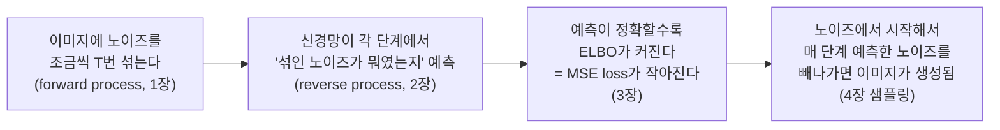
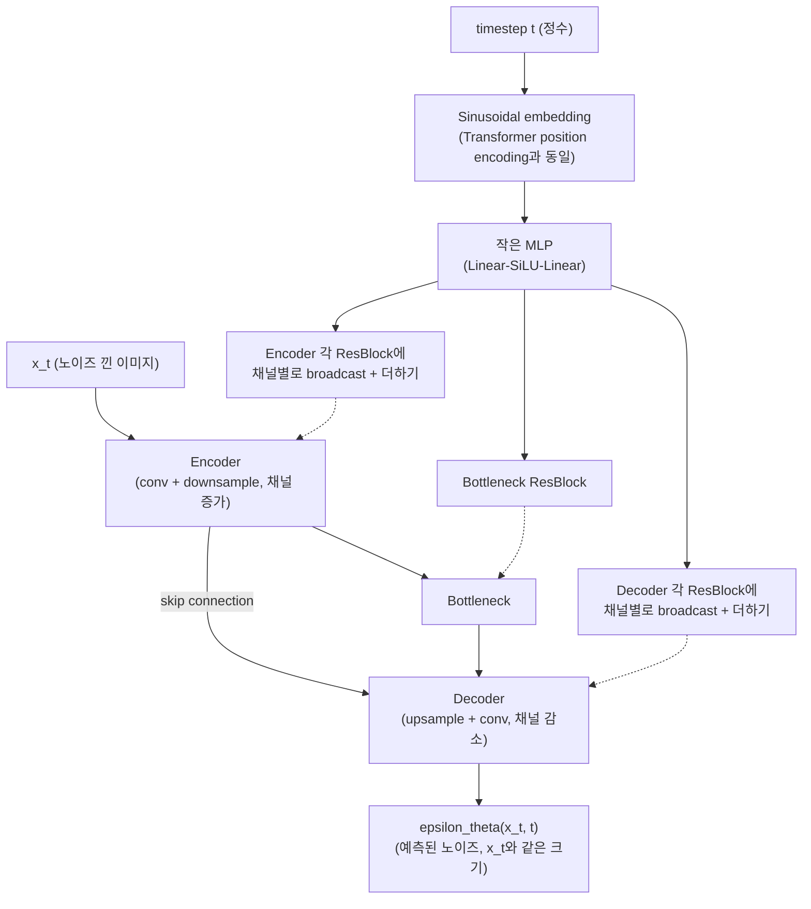
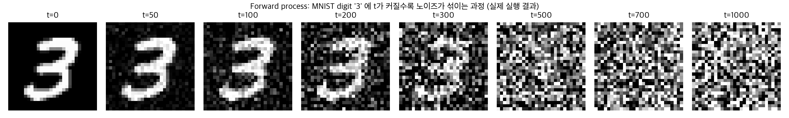
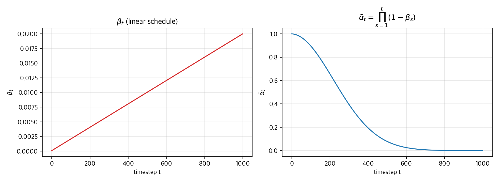
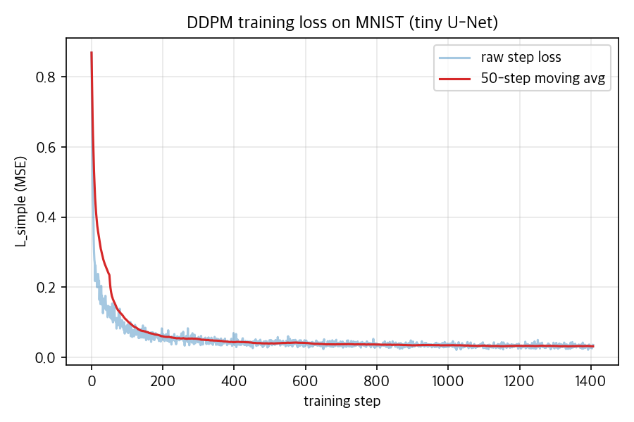
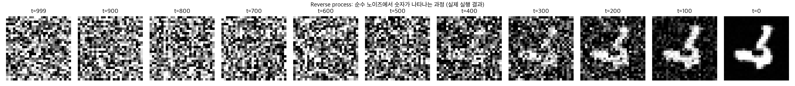
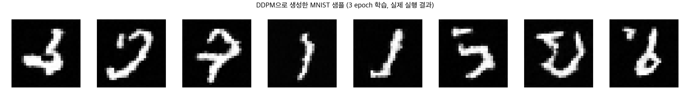

# 02. DDPM Deep Dive (Day 8-14)

이 커리큘럼의 심장부. Ho, Jain, Abbeel, *Denoising Diffusion Probabilistic Models* (NeurIPS 2020)의 수식을 처음부터 끝까지 손으로 따라가고, 반드시 코드로 구현한다. `05-generative-models-beyond-the-course.md`에 이미 forward/reverse process의 직관은 정리되어 있으니, 여기서는 **왜 그 수식이 그렇게 생겼는지**를 유도한다.

## 선수 확인

- 00번 챕터: 가우시안의 선형결합 성질, reparameterization trick, KL divergence, ELBO 유도(Jensen's inequality), "가우시안 곱 = 완전제곱식(completing the square)" 계산
- 01번 챕터: VAE의 ELBO loss 구조 (재구성 + KL)

이 두 챕터에서 배운 도구가 이 챕터에서 전부 다시 쓰인다 - 특히 "가우시안의 선형결합은 가우시안"과 "완전제곱식 만들기"는 이번 챕터의 핵심 트릭 두 개와 정확히 같은 계산이다.

## 0. 시작하기 전에: "노이즈를 예측한다"는 게 대체 뭘 하는 건가

수식으로 들어가기 전에 직관부터 잡고 가자. 이 직관 하나만 붙잡고 있으면 뒤에 나오는 모든 유도가 "왜 이렇게 하는지"를 알고 하는 계산이 된다.

**질문을 이렇게 바꿔보자**: "숫자 손글씨처럼 그럴듯한 이미지를 새로 만들어내라"는 문제를, 어떻게 신경망이 풀 수 있는 문제로 바꿀 수 있을까?

생성모델의 근본적인 목표는 "그럴듯한 이미지들이 모여있는 확률분포 `p(x)`에서 새 샘플을 뽑는 것"이다. 문제는 이 `p(x)`가 어떤 모양인지 아무도 모른다는 것 - 안다면 애초에 생성모델을 만들 필요가 없다. 그런데 만약 **"지금 있는 이미지 `x`를 아주 조금 바꿔서 `p(x)`가 더 커지는 방향"**을 매 지점마다 알려주는 나침반이 있다면 어떨까? 이 나침반을 따라 이미지를 계속 조금씩 움직이면, 결국 확률이 높은(=그럴듯한) 이미지 쪽으로 흘러가게 될 것이다. 이 나침반, 즉 `log p(x)`를 `x`에 대해 미분한 벡터(`∇_x log p(x)`)를 **score**라고 부른다 (03번 챕터에서 정식으로 다룰 개념을 여기서 먼저 맛본다).

DDPM은 이 나침반을 직접 구하는 대신 아주 영리한 우회로를 택한다. 원본 이미지 `x_0`에 노이즈 `epsilon`을 섞어서 `x_t`를 만들었다고 하자 (1장에서 정확히 정의한다). 이때 "`x_t`에서 원래 섞였던 노이즈 `epsilon`이 정확히 무엇이었는가"를 맞히는 것과, "`x_t`를 어느 방향으로 옮겨야 확률이 높은 원본 이미지 쪽으로 되돌아가는가"를 아는 것은 **수학적으로 거의 같은 정보**다. 왜냐면 노이즈를 섞은 방향을 정확히 알면, 그 반대 방향이 바로 "노이즈가 없는 깨끗한 이미지 쪽", 즉 확률이 높아지는 방향이기 때문이다. (정확한 관계식 `epsilon_theta ∝ -∇_{x_t} log q(x_t)`는 03번 챕터에서 score-based model을 다룰 때 정식으로 유도한다 - 지금은 "노이즈 예측 방향의 반대가 확률이 커지는 방향"이라는 직관만 챙기면 된다.)

즉:

```
"노이즈가 뭐였는지 맞혀라" (regression, 지도학습으로 풀 수 있는 쉬운 문제)
        ↓ (수학적으로 거의 동치)
"확률이 커지는 방향을 알려달라" (생성모델의 진짜 목표, 그 자체로는 풀기 어려운 문제)
```

**DDPM의 발상의 전환은 이거다**: 풀기 어려운 문제(확률분포 자체를 다루는 것)를, 매 순간 아주 쉬운 문제(지금 낀 노이즈 하나 맞히기)로 잘게 쪼개서 반복하면 결국 풀린다. 01번 챕터에서 "diffusion이 GAN을 이기게 된 이유"로 예고했던 문장 - "어려운 문제를 한 번에 푸는 대신, 아주 쉬운 문제를 여러 번 반복해서 푼다" - 이 바로 이 얘기다. 이 챕터는 이 문장이 수식으로 어떻게 정당화되는지를 끝까지 따라간다.



## 1. Forward Process: 노이즈를 섞는 고정된 규칙

### 1.1 한 스텝씩 정의

```
q(x_t | x_{t-1}) = N(x_t; sqrt(1 - beta_t) * x_{t-1}, beta_t * I)
```

`beta_t`는 스텝 `t`마다 미리 정해둔 아주 작은 값(noise schedule, 예: 0.0001 ~ 0.02 사이에서 선형 증가)이다. Reparameterization trick(00번 챕터 1.2절)을 적용하면:

```
x_t = sqrt(1 - beta_t) * x_{t-1} + sqrt(beta_t) * epsilon_t,   epsilon_t ~ N(0, I)
```

표기를 간단히 하려고 `alpha_t := 1 - beta_t`로 정의하면:

```
x_t = sqrt(alpha_t) * x_{t-1} + sqrt(1 - alpha_t) * epsilon_t
```

### 1.2 임의의 t로 한 번에 뛰어넘기 (닫힌 형태) - 구현에서 제일 중요한 식

매 스텝을 순차적으로 계산하면 학습 때마다 `t`번 반복 연산을 해야 해서 비효율적이다. 그런데 "가우시안의 선형결합은 가우시안"(00번 챕터 1.1절)이라는 성질 덕분에, `x_0`에서 `x_t`로 **한 번에** 갈 수 있는 닫힌 형태가 존재한다. 지금부터 이걸 수학적 귀납법으로 처음부터 끝까지 증명한다.

**표기 정리.**

```
alpha_bar_t := alpha_1 * alpha_2 * ... * alpha_t   (누적곱)
```

**주장(닫힌 형태 공식)**:

```
x_t = sqrt(alpha_bar_t) * x_0 + sqrt(1 - alpha_bar_t) * epsilon,   epsilon ~ N(0, I)
```

**증명 (수학적 귀납법).**

*기저 사례 (t=1).* `x_1 = sqrt(alpha_1) * x_0 + sqrt(1 - alpha_1) * epsilon_1`이고, `alpha_bar_1 = alpha_1`이므로 주장은 `t=1`에서 정확히 성립한다.

*귀납 가정.* `t-1`에서 주장이 성립한다고 가정하자. 즉 어떤 `eps_bar ~ N(0, I)`에 대해:

```
x_{t-1} = sqrt(alpha_bar_{t-1}) * x_0 + sqrt(1 - alpha_bar_{t-1}) * eps_bar
```

*귀납 단계.* 이걸 1.1절의 한 스텝 정의에 대입한다:

```
x_t = sqrt(alpha_t) * x_{t-1} + sqrt(1 - alpha_t) * epsilon_t
    = sqrt(alpha_t) * [ sqrt(alpha_bar_{t-1}) * x_0 + sqrt(1 - alpha_bar_{t-1}) * eps_bar ] + sqrt(1 - alpha_t) * epsilon_t
    = sqrt(alpha_t * alpha_bar_{t-1}) * x_0
      + sqrt(alpha_t * (1 - alpha_bar_{t-1})) * eps_bar + sqrt(1 - alpha_t) * epsilon_t
```

`alpha_t * alpha_bar_{t-1} = alpha_bar_t` (정의 그대로)이므로 `x_0`의 계수는 이미 `sqrt(alpha_bar_t)`로 원하는 형태다. 문제는 뒤의 두 노이즈 항이다 - `eps_bar`와 `epsilon_t`는 서로 독립인 두 개의 `N(0,I)` 확률변수인데, 이 둘의 선형결합이 정말 하나의 `N(0, (1-alpha_bar_t) I)`로 합쳐지는지를 보여야 한다.

00번 챕터 1.1절의 "가우시안 선형결합" 성질(`aX + bY ~ N(a*mu_X+b*mu_Y, a^2*var_X+b^2*var_Y)`, 독립일 때)을 그대로 적용하면, 두 항의 합은 평균 0, 분산은 각 계수의 제곱을 더한 값을 갖는 가우시안이 된다:

```
분산 = alpha_t * (1 - alpha_bar_{t-1}) + (1 - alpha_t)
     = alpha_t - alpha_t * alpha_bar_{t-1} + 1 - alpha_t
     = 1 - alpha_t * alpha_bar_{t-1}
     = 1 - alpha_bar_t
```

즉 두 노이즈 항의 합은 `N(0, (1-alpha_bar_t) I)`를 따르므로, 새로운 표준정규 노이즈 `epsilon ~ N(0,I)` 하나로 `sqrt(1-alpha_bar_t) * epsilon`이라고 다시 쓸 수 있다. 정리하면:

```
x_t = sqrt(alpha_bar_t) * x_0 + sqrt(1 - alpha_bar_t) * epsilon
```

이는 정확히 `t`에서의 주장이므로, 수학적 귀납법에 의해 모든 `t`에 대해 성립한다. **증명 끝.**

이 과정에서 "두 노이즈 항의 분산을 더하면 정확히 `1 - alpha_bar_t`가 나온다"는 계산이 핵심 트릭인데, 이 정확히 같은 대수 조작(`alpha_t + beta_t = 1`을 이용해 항을 정리하는 것)이 2.1절 posterior 유도에서 다시 한 번 나온다 - 지금 이 계산을 눈에 익혀두면 2.1절이 훨씬 수월해진다.

**결론**: `t`가 커질수록 `alpha_bar_t`가 0에 가까워지고 `x_t`는 거의 순수 노이즈가 된다. **학습 코드에서는 항상 이 닫힌 형태 식으로 임의의 `t`에 대해 즉시 `x_t`를 만든다** - 순차 계산은 절대 하지 않는다. 아래 실습 결과(6장)에서 이 식을 실제로 실행해서 `t=0`부터 `t=1000`까지 노이즈가 섞이는 과정을 눈으로 확인한다.

## 2. Reverse Process: 어디까지가 계산 가능하고 어디부터 신경망이 필요한가

### 2.1 진짜 reverse posterior는 사실 계산 가능하다 (단, x_0을 안다는 조건 하에)

베이즈 정리를 쓰면, `x_0`을 알고 있을 때의 진짜 posterior `q(x_{t-1} | x_t, x_0)`은 놀랍게도 닫힌 형태의 가우시안이다. 지금부터 이걸 처음부터 끝까지 유도한다.

**1단계. 베이즈 정리를 적용한다.**

```
q(x_{t-1} | x_t, x_0) = q(x_t | x_{t-1}, x_0) * q(x_{t-1} | x_0) / q(x_t | x_0)
```

여기서 forward process는 Markov chain(다음 상태가 오직 바로 직전 상태에만 의존)이므로, `x_{t-1}`이 주어지면 `x_t`는 `x_0`과 무관하다: `q(x_t | x_{t-1}, x_0) = q(x_t | x_{t-1})`. 그리고 이 세 분포 모두 이미 아는 형태다:

```
q(x_t | x_{t-1})   = N(x_t;     sqrt(alpha_t) * x_{t-1},       (1-alpha_t) * I)        <- 1.1절
q(x_{t-1} | x_0)   = N(x_{t-1}; sqrt(alpha_bar_{t-1}) * x_0,    (1-alpha_bar_{t-1}) * I) <- 1.2절 (t-1 시점)
q(x_t | x_0)       = N(x_t;     sqrt(alpha_bar_t) * x_0,        (1-alpha_bar_t) * I)     <- 1.2절 (t 시점)
```

세 개 모두 가우시안이라는 게 핵심이다 - 이게 안 됐다면 posterior도 닫힌 형태로 안 나왔을 것이다 (00번 챕터 1.1절 "가우시안을 쓰는 이유 = 수학이 풀리기 때문"이 여기서도 그대로 적용된다).

**2단계. `x_{t-1}`에 대한 함수로 보고, 지수 부분만 모아 정리한다.**

세 가우시안의 PDF를 대입하면 앞의 정규화 상수들은 `x_{t-1}`과 무관하므로 나중에 한꺼번에 처리하기로 하고, 지수(exponent) 부분만 모아서 본다. `q(x_t|x_0)`는 분모에 있지만 `x_{t-1}`을 포함하지 않으므로 이것도 `x_{t-1}`에 대해서는 상수 취급한다 (나눗셈이 곧 지수에서 빼기이므로, `x_{t-1}`이 없는 항은 전체를 정규화 상수 쪽으로 흡수시킬 수 있다). 남는 것은:

```
지수 = -(1/2) * [ (x_t - sqrt(alpha_t)*x_{t-1})^2 / (1-alpha_t)
                 + (x_{t-1} - sqrt(alpha_bar_{t-1})*x_0)^2 / (1-alpha_bar_{t-1}) ]
       + (x_{t-1}과 무관한 상수)
```

이건 정확히 00번 챕터 1.3절에서 "두 가우시안을 곱하면?"을 유도할 때 했던 것과 똑같은 상황이다 - 거기서는 `x`에 대한 이차식을 완전제곱식으로 정리해서 결과가 다시 가우시안임을 보였는데, 여기서는 변수 이름만 `x_{t-1}`로 바뀌었을 뿐 계산 절차가 완전히 동일하다.

**3단계. `x_{t-1}`의 이차항(`x_{t-1}^2`) 계수를 모은다.**

각 항을 `(a-b)^2 = a^2 - 2ab + b^2` 형태로 펼친 뒤 `x_{t-1}^2` 계수만 추리면:

```
x_{t-1}^2 계수 = -(1/2) * [ alpha_t/(1-alpha_t) + 1/(1-alpha_bar_{t-1}) ]
```

두 분수를 통분하면:

```
alpha_t/(1-alpha_t) + 1/(1-alpha_bar_{t-1})
  = [ alpha_t*(1-alpha_bar_{t-1}) + (1-alpha_t) ] / [ (1-alpha_t)*(1-alpha_bar_{t-1}) ]
```

분자를 정리한다 (`1-alpha_t = beta_t`로 되짚어 쓰면 1.2절 증명에서 봤던 것과 똑같은 계산이 나온다):

```
alpha_t*(1-alpha_bar_{t-1}) + (1-alpha_t) = alpha_t - alpha_t*alpha_bar_{t-1} + 1 - alpha_t
                                            = 1 - alpha_bar_t
```

따라서:

```
x_{t-1}^2 계수 = -(1/2) * (1 - alpha_bar_t) / [ (1-alpha_t)*(1-alpha_bar_{t-1}) ]
```

이 계수를 `-(1/2) / beta_tilde_t` 형태(가우시안 지수의 표준형)로 놓으면, 분산이 바로 나온다:

```
beta_tilde_t = (1-alpha_t) * (1-alpha_bar_{t-1}) / (1 - alpha_bar_t)
             = beta_t * (1-alpha_bar_{t-1}) / (1 - alpha_bar_t)
```

**4단계. `x_{t-1}`의 일차항(선형) 계수를 모은다.**

같은 방식으로 `x_{t-1}^1` 계수를 모으면:

```
x_{t-1} 계수 = sqrt(alpha_t)*x_t/(1-alpha_t) + sqrt(alpha_bar_{t-1})*x_0/(1-alpha_bar_{t-1})
```

가우시안 지수의 표준형이 `-(1/2)*A*(x-mu)^2 = -(1/2)*A*x^2 + A*mu*x + ...`이므로, `x_{t-1}` 계수(`A*mu`에 해당)를 `A = 1/beta_tilde_t`로 나누면 평균 `mu_tilde`가 나온다:

```
mu_tilde(x_t, x_0) = beta_tilde_t * [ sqrt(alpha_t)*x_t/(1-alpha_t) + sqrt(alpha_bar_{t-1})*x_0/(1-alpha_bar_{t-1}) ]
```

3단계에서 구한 `beta_tilde_t = beta_t*(1-alpha_bar_{t-1})/(1-alpha_bar_t)`를 대입하고 정리하면 (분수의 통분과 약분을 차분히 진행하면):

```
mu_tilde(x_t, x_0) = (sqrt(alpha_bar_{t-1}) * beta_t) / (1 - alpha_bar_t) * x_0
                     + (sqrt(alpha_t) * (1 - alpha_bar_{t-1})) / (1 - alpha_bar_t) * x_t
```

**결론**:

```
q(x_{t-1} | x_t, x_0) = N(x_{t-1}; mu_tilde(x_t, x_0), beta_tilde_t * I)
```

이 결과가 애초에 문서 상단에 있던 그 식이다 - 이제 중간 과정 없이 결과만 보는 게 아니라, 베이즈 정리 -> 지수부 정리 -> 완전제곱식(00번 챕터와 동일한 트릭)이라는 절차로 어떻게 나왔는지 손으로 다 따라간 것이다.

**그런데 문제가 있다.** 이 `mu_tilde`는 `x_0`을 입력으로 요구한다. 하지만 **생성(샘플링) 시점에는 x_0을 모른다** - x_0을 아는 게 곧 답을 아는 것이기 때문이다. 그래서 이 `mu_tilde`를 신경망으로 근사해야 한다. 이게 reverse process에 신경망이 필요한 이유다.

### 2.2 신경망이 예측하는 파라미터화 (parameterization) - 세 가지 동치 표현

신경망 `p_theta(x_{t-1} | x_t) = N(x_{t-1}; mu_theta(x_t, t), sigma_t^2 I)`에서 `mu_theta`를 무엇으로 예측하게 할지가 설계 선택인데, 다음 세 가지가 수학적으로 동치다:

1. **x_0을 직접 예측**: 그럴듯해 보이지만 초반 스텝(노이즈가 아직 적을 때)엔 쉽고 후반 스텝(거의 순수 노이즈)엔 극도로 어려운 문제라 학습 난이도가 스텝마다 들쭉날쭉하다
2. **평균 mu를 직접 예측**: 위 2.1절 식을 그대로 신경망 출력으로 대체
3. **노이즈 epsilon을 예측** (DDPM이 실제로 택한 방법): 1.2절 식 `x_t = sqrt(alpha_bar_t) x_0 + sqrt(1-alpha_bar_t) epsilon`을 `x_0`에 대해 풀면 `x_0 = (x_t - sqrt(1-alpha_bar_t)*epsilon) / sqrt(alpha_bar_t)`이고, 이걸 2.1절 `mu_tilde` 식에 대입해서 정리하면 (`alpha_bar_{t-1}/alpha_bar_t = 1/alpha_t`라는 관계를 쓰면 상당 부분이 약분된다):

```
mu_tilde(x_t, x_0) = (1/sqrt(alpha_t)) * ( x_t - (beta_t / sqrt(1-alpha_bar_t)) * epsilon )
```

즉 `mu_theta`가 결국 `epsilon_theta(x_t, t)`라는 노이즈 예측값의 함수로 정리된다:

```
mu_theta(x_t, t) = (1/sqrt(alpha_t)) * ( x_t - (beta_t / sqrt(1-alpha_bar_t)) * epsilon_theta(x_t, t) )
```

(이 식은 4장 샘플링 알고리즘의 업데이트 식과 정확히 같은 모양이다 - 우연이 아니라, 저 알고리즘 자체가 이 `mu_theta`에서 그대로 나온 것이다.)

DDPM 저자들이 실험적으로 확인한 것: **3번(노이즈 예측)이 학습이 제일 안정적이고 샘플 품질도 제일 좋다.** 그래서 "diffusion model은 노이즈를 예측하는 모델이다"라는 말이 나온 것이고, 0장에서 얘기한 "노이즈 예측 = 확률이 커지는 방향을 아는 것"이라는 직관이 여기서 구체적인 수식으로 확정된다.

## 3. Loss 함수: ELBO에서 놀랍도록 단순한 형태로

### 3.1 ELBO를 시간축으로 확장

00번/01번 챕터의 ELBO는 잠재변수가 `z` 하나였는데, DDPM은 `x_1, ..., x_T`라는 `T`개의 "잠재변수 체인"을 가진 VAE라고 볼 수 있다 (00번 챕터 2.4절의 `log p(x) = ELBO(q) + KL(...)` 유도를 그대로 이 체인에 적용한 것). 이 체인에 ELBO를 적용하고 각 시점의 KL을 분리해내면(전개 과정은 논문 Appendix A 참고 - 이 챕터에서는 결과 형태에 집중한다), loss가 `T`개의 KL divergence 항의 합으로 분해된다:

```
-ELBO = L_0 + L_1 + ... + L_{T-1} + L_T

여기서 t=1,...,T-1 구간의 각 항:
L_{t-1} = KL( q(x_{t-1}|x_t,x_0) || p_theta(x_{t-1}|x_t) )
```

각 항이 "타임스텝 `t`에서 2.1절의 진짜 posterior `q(x_{t-1}|x_t,x_0)`와 신경망이 예측한 `p_theta(x_{t-1}|x_t)`가 얼마나 다른가"를 재는 KL이다. 두 분포 모두 가우시안이므로, 이 KL도 닫힌 형태로 계산할 수 있다 - 다음 절에서 처음부터 유도한다.

### 3.2 두 가우시안 사이 KL -> 결국 MSE

**목표**: `KL( q(x_{t-1}|x_t,x_0) || p_theta(x_{t-1}|x_t) )`를 계산 가능한 형태로 풀어내고, 왜 이게 결국 `epsilon`과 `epsilon_theta`의 MSE로 끝나는지 처음부터 보인다.

**1단계. 일반적인 두 1차원 가우시안 사이 KL의 닫힌 형태부터 유도한다.**

`q = N(mu_1, sigma_1^2)`, `p = N(mu_2, sigma_2^2)`라 하자. KL의 정의(00번 챕터 2.1절)와 가우시안 log-밀도를 대입한다:

```
KL(q||p) = E_q[ log q(x) - log p(x) ]

log q(x) = -(1/2)*log(2*pi*sigma_1^2) - (x-mu_1)^2/(2*sigma_1^2)
log p(x) = -(1/2)*log(2*pi*sigma_2^2) - (x-mu_2)^2/(2*sigma_2^2)

log q(x) - log p(x) = log(sigma_2/sigma_1) - (x-mu_1)^2/(2*sigma_1^2) + (x-mu_2)^2/(2*sigma_2^2)
```

이제 `x ~ q = N(mu_1, sigma_1^2)`에 대해 기댓값을 취한다. 첫째, `E_q[(x-mu_1)^2] = sigma_1^2` (분산의 정의 그 자체)이므로:

```
E_q[ -(x-mu_1)^2/(2*sigma_1^2) ] = -sigma_1^2/(2*sigma_1^2) = -1/2
```

둘째, `(x-mu_2)^2`는 `x-mu_1`을 기준으로 다시 쓴다 (`x-mu_2 = (x-mu_1) + (mu_1-mu_2)`):

```
E_q[(x-mu_2)^2] = E_q[(x-mu_1)^2] + 2*(mu_1-mu_2)*E_q[x-mu_1] + (mu_1-mu_2)^2
                = sigma_1^2 + 0 + (mu_1-mu_2)^2         (E_q[x-mu_1]=0 이므로 가운데 항 소거)
```

두 결과를 합치면:

```
KL(q||p) = log(sigma_2/sigma_1) - 1/2 + [ sigma_1^2 + (mu_1-mu_2)^2 ] / (2*sigma_2^2)
```

이게 두 가우시안 사이 KL의 일반적인 닫힌 형태다. (00번 챕터 1.3절에서 두 가우시안의 "곱"을 완전제곱식으로 풀었던 것과 마찬가지로, 여기서도 가우시안이 닫혀있다는 성질이 계산을 가능하게 만든다.)

**2단계. DDPM의 설정을 대입해서 단순화한다.**

DDPM은 `p_theta`의 분산 `sigma_t^2`를 학습 대상에서 제외하고 `q`의 분산 `beta_tilde_t`와 같은 상수로 고정해버린다 (저자들이 실험적으로, 분산까지 학습해도 샘플 품질 이득이 별로 없다는 걸 확인했다). 즉 `sigma_1 = sigma_2 = sigma_t`로 두면:

```
log(sigma_2/sigma_1) = log(1) = 0
sigma_1^2/(2*sigma_2^2) = 1/2   (같은 분산이므로)
```

이를 1단계 결과에 대입하면:

```
KL = 0 - 1/2 + [ sigma_t^2 + (mu_1-mu_2)^2 ] / (2*sigma_t^2)
   = -1/2 + 1/2 + (mu_1-mu_2)^2 / (2*sigma_t^2)
   = (mu_1 - mu_2)^2 / (2*sigma_t^2)
```

분산 항이 완전히 상쇄되고, **분산이 같은 두 가우시안 사이의 KL은 평균 차이의 제곱에 (상수를 곱한 만큼) 비례한다**는 깔끔한 결과가 나온다. `mu_1 = mu_tilde` (2.1절 진짜 평균), `mu_2 = mu_theta` (신경망이 예측한 평균)로 놓으면:

```
L_{t-1} = || mu_tilde(x_t, x_0) - mu_theta(x_t, t) ||^2 / (2 * sigma_t^2)
```

**3단계. epsilon 파라미터화(2.2절 3번)를 대입한다.**

2.2절에서 구했듯 `mu_tilde`와 `mu_theta`는 각각:

```
mu_tilde(x_t, x_0) = (1/sqrt(alpha_t)) * ( x_t - (beta_t/sqrt(1-alpha_bar_t)) * epsilon )
mu_theta(x_t, t)   = (1/sqrt(alpha_t)) * ( x_t - (beta_t/sqrt(1-alpha_bar_t)) * epsilon_theta(x_t,t) )
```

`x_t` 항은 완전히 같으므로 빼면 사라지고, `epsilon`이 걸린 항만 남는다:

```
mu_tilde - mu_theta = - (1/sqrt(alpha_t)) * (beta_t/sqrt(1-alpha_bar_t)) * (epsilon - epsilon_theta)
```

이걸 제곱해서 2단계 결과에 대입하면:

```
L_{t-1} = [ beta_t^2 / (2 * sigma_t^2 * alpha_t * (1-alpha_bar_t)) ] * || epsilon - epsilon_theta(x_t, t) ||^2
                    ^^^^^^^^^^^^^^^^^^^^^^^^^^^^^^^^^^^^^^^^^^^^^^^^^^^^
                    t마다 다른 값을 갖는 가중치 상수 (x_0, epsilon, 신경망 출력과 무관)
```

**4단계. "가중치 상수를 무시하면 MSE가 된다"는 부분.**

대괄호 안의 가중치는 `t`에는 의존하지만 데이터나 신경망 예측과는 무관한 순수한 스칼라 상수다. DDPM 저자들은 논문에서 이 계수를 이론적으로 최적인 값 그대로 두는 대신, **그냥 1로 놓고(=이 가중치를 무시하고) 학습시켰더니 오히려 샘플 품질이 더 좋아졌다**는 것을 실험으로 발견했다. 직관적으로는, 이 가중치가 `t`가 클수록(노이즈가 거의 다 낀 후반 스텝일수록) 작아지는 경향이 있어서 그대로 두면 "어려운(초반) 스텝"의 loss 비중이 과도하게 커지는데, 가중치를 1로 통일하면 모든 스텝이 공평하게 학습에 기여하게 되어 실전에서 더 안정적으로 학습된다.

가중치를 1로 놓고, 3.1절의 다른 항들(`L_0`, `L_T` - 이들은 이산화 오차나 사전분포 관련 항으로 학습에 거의 기여하지 않아 통상 무시한다)도 정리하면, 모든 `t`에 대한 기댓값으로 합쳐서 최종 loss가 놀랍도록 단순해진다:

```
L_simple(theta) = E_{t, x_0, epsilon} [ || epsilon - epsilon_theta(x_t, t) ||^2 ]

여기서  x_t = sqrt(alpha_bar_t) * x_0 + sqrt(1 - alpha_bar_t) * epsilon,   t ~ Uniform(1,T)
```

**즉 diffusion model 학습은 결국: "노이즈 낀 이미지 `x_t`와 시각 `t`를 보고, 거기 섞인 노이즈 `epsilon`이 뭐였는지 맞추는 회귀(regression) 문제"의 MSE loss일 뿐이다.** ELBO, KL, 베이즈 정리라는 무거운 이론을 거쳐 나온 결과가 이렇게 단순한 MSE라는 게 DDPM 논문의 놀라운 지점이고, 이게 "diffusion model 학습이 안정적인" 근본 이유이기도 하다 (복잡한 min-max 게임인 GAN과 대비 - 01번 챕터 3절 비교표 참고).

## 4. 학습/샘플링 알고리즘 (의사코드)

**학습(training)**:
```
반복:
  x_0 ~ 데이터셋에서 샘플
  t ~ Uniform(1, T)
  epsilon ~ N(0, I)
  x_t = sqrt(alpha_bar_t) * x_0 + sqrt(1 - alpha_bar_t) * epsilon
  loss = || epsilon - epsilon_theta(x_t, t) ||^2
  loss로 epsilon_theta 파라미터 업데이트
```

**샘플링(sampling)**:
```
x_T ~ N(0, I)
for t = T, T-1, ..., 1:
  z ~ N(0, I)  (t=1이면 z=0)
  x_{t-1} = 1/sqrt(alpha_t) * (x_t - (beta_t/sqrt(1-alpha_bar_t)) * epsilon_theta(x_t, t)) + sigma_t * z
반환 x_0
```

샘플링 업데이트 식의 앞부분(`1/sqrt(alpha_t) * (x_t - ...)`)이 정확히 2.2절에서 유도한 `mu_theta(x_t,t)`이고, 뒤에 더해지는 `sigma_t * z`는 `p_theta(x_{t-1}|x_t) = N(x_{t-1}; mu_theta, sigma_t^2 I)`에서 실제로 샘플을 뽑는 reparameterization trick(00번 챕터 1.2절)이다 - 즉 이 알고리즘 한 줄 한 줄이 전부 앞 절에서 유도한 수식 그대로다.

학습은 매 스텝 랜덤한 `t` 하나만 뽑아서 병렬로 빠르게 할 수 있는 반면, 샘플링은 `T`번(보통 1000번) 순차적으로 신경망을 통과시켜야 해서 느리다 - 이 비대칭이 04번 챕터에서 다룰 "샘플링 가속" 연구(DDIM 등)의 동기가 된다.

## 5. 신경망 구조: U-Net

Encoder-decoder + skip connection이라는 U-Net의 기본 구조 자체는 `computer-vision/03-object-detection.md`의 "U-Net 구조" 절에서 이미 자세히 다뤘다 - contracting path/expanding path, transpose convolution, skip connection이 왜 필요한지는 그 문서를 참고. 여기서는 **diffusion에서 달라지는 단 하나의 지점, 시간 정보 주입**에만 집중한다.

Semantic segmentation용 U-Net은 입력이 이미지 하나뿐이지만, diffusion의 `epsilon_theta(x_t, t)`는 입력이 **이미지 `x_t`와 시각 `t` 두 개**다. 네트워크가 "지금이 노이즈가 살짝만 낀 초반 단계(`t`가 작음)인지, 거의 순수 노이즈인 후반 단계(`t`가 큼)인지"를 알아야 올바른 크기의 노이즈를 예측할 수 있기 때문이다. 이 스칼라 `t`를 네트워크에 주입하는 방법이 아래와 같다.

**Sinusoidal time embedding.** Transformer의 positional encoding과 완전히 같은 방식으로, 정수 `t`를 고차원 벡터로 변환한다:

```
PE(t)_{2i}   = sin( t / 10000^(2i/d) )
PE(t)_{2i+1} = cos( t / 10000^(2i/d) )
```

이렇게 만들어진 벡터는 MLP(작은 fully-connected 레이어 몇 개)를 한 번 더 거친 뒤, U-Net의 **각 conv 블록마다** 채널별 bias처럼 broadcast되어 더해진다(아래 실습 코드의 `ResBlock.forward`에서 `h + self.time_proj(t_emb)[:, :, None, None]` 부분). 즉 이미지의 모든 위치(pixel)에 "지금은 timestep `t`다"라는 정보가 똑같이 더해지는 것 - 이게 encoder/decoder의 모든 해상도 단계에서 반복된다.



Self-attention 블록을 중간 해상도(주로 bottleneck 근처)에 섞어 넣는 것도 흔한 구성이다 - 이미지 전역에 걸친 구조(예: "이 글씨가 전체적으로 대칭인가")를 conv의 국소적 시야만으로는 못 잡아내는 경우가 있어서다. 이번 실습의 작은 U-Net은 MNIST 정도 난이도에서는 attention 없이도 충분해서 생략했다 (04번 챕터의 Latent Diffusion에서 attention이 훨씬 중요해진다).

## 6. 실습: 직접 구현하고 실행한 결과

이 절의 모든 결과는 실제로 로컬에서 PyTorch(2.14, MPS backend, Apple Silicon)로 실행한 것이다. MNIST는 `torchvision.datasets.MNIST`로 다운로드했다.

### 6.1 Forward process 시각화 (실습 2) - 학습 없이 순수 수식만으로

1.2절의 닫힌 형태 `x_t = sqrt(alpha_bar_t)*x_0 + sqrt(1-alpha_bar_t)*epsilon`을 그대로 코드로 옮겨서, MNIST 숫자 이미지 하나에 `t`를 늘려가며 노이즈를 섞었다.

```python
betas = torch.linspace(1e-4, 0.02, T)          # linear schedule
alphas = 1.0 - betas
alpha_bars = torch.cumprod(alphas, dim=0)      # 누적곱

def q_sample(x0, t, noise):
    ab = alpha_bars[t]
    return torch.sqrt(ab) * x0 + torch.sqrt(1 - ab) * noise
```



`t=0`에서는 원본 숫자 '3'이 선명하지만, `t=100` 근처부터 노이즈가 눈에 띄기 시작하고, `t=300`을 넘어가면 숫자의 형태는 남아있지만 얼룩덜룩해지며, `t=700` 이후로는 육안으로 숫자를 알아보기 거의 불가능한 순수 노이즈에 가까워진다. 실제 `alpha_bar_t` 값을 같이 출력해보면 이 시각적 변화가 왜 이런 속도로 일어나는지 정량적으로 확인된다:

| t | alpha_bar_t | sqrt(alpha_bar_t) (원본 비중) | sqrt(1-alpha_bar_t) (노이즈 비중) |
|---|---|---|---|
| 0 | 1.0 | 1.000 | 0.000 |
| 100 | 0.8970 | 0.947 | 0.321 |
| 300 | 0.3964 | 0.630 | 0.777 |
| 500 | 0.0786 | 0.280 | 0.960 |
| 1000 | 0.00004 | 0.006 | 1.000 |

`t=300` 근처에서 이미 원본 비중(0.63)보다 노이즈 비중(0.78)이 더 커지고, `t=500`을 넘어가면 원본은 거의 안 보이고(`0.28`) 노이즈가 사실상 전부(`0.96`)라는 걸 표에서도, 위 이미지에서도 똑같이 확인할 수 있다.

Noise schedule 자체(`beta_t`가 선형으로 커지는 모습과, 그 누적곱인 `alpha_bar_t`가 S자 모양으로 0에 수렴하는 모습)도 따로 그려봤다:



`beta_t`는 정의 그대로 직선이지만, `alpha_bar_t = prod(1-beta_s)`는 누적곱이라 초반엔 완만하다가 중반부(`t≈200~500`)에서 급격히 떨어지고 후반엔 거의 0에 붙어서 평평해지는 S자 곡선을 그린다 - 위 표에서 `t=300~500` 구간에 원본/노이즈 비중이 급격히 역전되는 이유가 바로 이 곡선의 급경사 구간과 정확히 일치한다.

### 6.2 U-Net + MNIST로 실제 DDPM 학습 (실습 3)

작은 U-Net(`base_ch=32`, 파라미터 총 **457,409개**)을 5장 구조 그대로 구현하고, `L_simple` MSE loss로 MNIST train set(60,000장) 전체에 대해 3 epoch(총 1,407 스텝, batch size 128) 학습시켰다. 핵심 코드(ResBlock에 시간 임베딩을 주입하는 부분):

```python
class ResBlock(nn.Module):
    def __init__(self, in_ch, out_ch, t_emb_dim):
        super().__init__()
        self.conv1 = nn.Conv2d(in_ch, out_ch, 3, padding=1)
        self.conv2 = nn.Conv2d(out_ch, out_ch, 3, padding=1)
        self.norm1 = nn.GroupNorm(8, out_ch)
        self.norm2 = nn.GroupNorm(8, out_ch)
        self.time_proj = nn.Linear(t_emb_dim, out_ch)   # 시간 임베딩 -> 채널별 값
        self.skip = nn.Conv2d(in_ch, out_ch, 1) if in_ch != out_ch else nn.Identity()

    def forward(self, x, t_emb):
        h = F.silu(self.norm1(self.conv1(x)))
        h = h + self.time_proj(t_emb)[:, :, None, None]  # 5장에서 설명한 broadcast 주입
        h = F.silu(self.norm2(self.conv2(h)))
        return h + self.skip(x)
```

`SinusoidalTimeEmbedding`은 5장의 `PE(t)` 공식을 그대로 구현했고, `TinyUNet`은 28x28 -> 14x14 -> 7x7로 줄었다가 다시 28x28로 돌아오는 encoder-decoder + skip connection 구조다 (구조 자체는 `computer-vision/03-object-detection.md`의 U-Net과 동일).

학습 결과, MPS(Apple Silicon GPU)에서 총 **222초** 만에 loss가 `0.87`(step 0) -> `0.03`대(step 1400)까지 떨어졌다:



loss가 처음 100~200 스텝 사이에 급격히 떨어지고(`0.87 -> 0.05` 근처) 이후로는 `0.03~0.04` 부근에서 완만하게 수렴하는 전형적인 회귀 문제의 loss 곡선을 보인다 - 3.2절에서 유도한 대로 이 문제가 "노이즈를 맞히는 MSE 회귀"일 뿐이라는 걸 학습 곡선의 모양으로도 확인할 수 있다.

### 6.3 샘플링: 순수 노이즈에서 숫자가 나타나는 과정 (실습 4)

학습된 `epsilon_theta`로 4장의 샘플링 알고리즘을 그대로 구현해서, `x_T ~ N(0,I)`에서 시작해 100 스텝마다 중간 결과를 기록했다.



`t=999`(거의 시작 지점)에서는 완전한 노이즈였다가, `t=600~400` 구간을 지나면서 흐릿하게 선의 형태가 보이기 시작하고, `t=300` 근처부터 숫자의 획(stroke)이 뚜렷해지며, `t=0`에 도달하면 하나의 완성된 손글씨 숫자 모양이 나타난다. 이 순서가 정확히 forward process(6.1절)를 거꾸로 재생한 모습이라는 걸 두 이미지를 나란히 비교하면 확인할 수 있다.

같은 모델로 8개를 한번에 생성한 결과:



**솔직한 평가**: 3 epoch, 채널 32짜리 아주 작은 U-Net이라는 제약 안에서, 생성된 결과들은 선명한 손글씨 숫자라기보다는 "숫자처럼 휘어지고 끊어지는 획"에 가깝다 - 일부는 특정 숫자로 읽히지만(예: 첫 번째와 여섯 번째는 각각 4, 5에 가까워 보인다), 전체적으로 MNIST 숫자 특유의 곡선/직선 조합은 확실히 학습되었지만 획의 마감이나 전체적인 숫자 형태의 일관성은 아직 흐릿하다. 이건 모델 용량과 학습 시간을 의도적으로 극소화했기 때문이지 수식이나 구현이 잘못된 게 아니다 - loss가 정상적으로 수렴했고(6.2절), forward/reverse가 서로 대칭적으로 잘 맞아떨어지는 것(6.1절 vs 6.3절 비교)이 파이프라인이 올바르게 동작한다는 증거다. Epoch을 10~20으로 늘리거나 `base_ch`를 64로 올리면 훨씬 선명해질 것으로 예상되는데, 이건 "MNIST로 먼저 빠르게 파이프라인을 검증하고, 필요하면 나중에 스케일을 키운다"는 실습 과제 원래 취지(빠른 반복)에 맞게 의도적으로 짧게 끊은 결과다.

## 7. 다음 챕터로

지금까지는 시간이 `t=1,2,...,T`로 딱딱 끊어진 **이산적인(discrete)** 스텝이었다. 그런데 0장에서 잠깐 언급한 score(`∇_x log p(x)`) 개념을 정식으로 파고들면, 이 이산적인 스텝들을 `t`가 연속적으로 흐르는 하나의 확률미분방정식(SDE, 00번 챕터 3절에서 맛본 개념)으로 통합해서 볼 수 있다는 게 03번 챕터의 핵심이다. DDPM이 "왜 그렇게 생겼는지"는 이 챕터에서 다 봤지만, "DDPM과 score-based model이 사실 같은 것의 다른 관점이었다"는 걸 확인하는 게 다음 단계다.

## 참고 자료

- Ho, Jain, Abbeel, *Denoising Diffusion Probabilistic Models* (2020) 원 논문 - Appendix A에 이 챕터의 모든 수식 유도가 있음 (이 문서의 2.1, 3.2절 유도와 대조해보면 좋음)
- **"The Annotated Diffusion Model"** (Hugging Face 블로그, Niels Rogge & Kashif Rasul) - 수식 한 줄마다 코드가 옆에 붙어있어서 구현할 때 최고의 대조 자료
- Hugging Face **"Diffusion Models Course"** Unit 1 (무료) - 실습형이라 손으로 따라가기 좋음
- GitHub `lucidrains/denoising-diffusion-pytorch` - 막힐 때 대조용 레퍼런스 구현체 (베끼지 말고 이해하며 참고)
- Lilian Weng 블로그, "What are Diffusion Models?" - 전체 수식을 사전처럼 참고하기 좋게 정리한 글

## 실습 코드 및 시각자료 생성 스크립트

본문의 이미지 5개(`assets/02-noise-schedule.png`, `02-forward-process-grid.png`, `02-training-loss.png`, `02-generated-samples.png`, `02-sampling-process-grid.png`)는 아래 두 스크립트로 실제 생성했다.

- Forward process + noise schedule (학습 불필요, 수식만으로 즉시 실행 가능): `assets/02-forward-process.py`
- U-Net 정의 + MNIST 학습 + 샘플링 (MPS/CPU에서 몇 분 내로 완료): `assets/02-train-ddpm-mnist.py`

```
python3 assets/02-forward-process.py
python3 assets/02-train-ddpm-mnist.py
```
