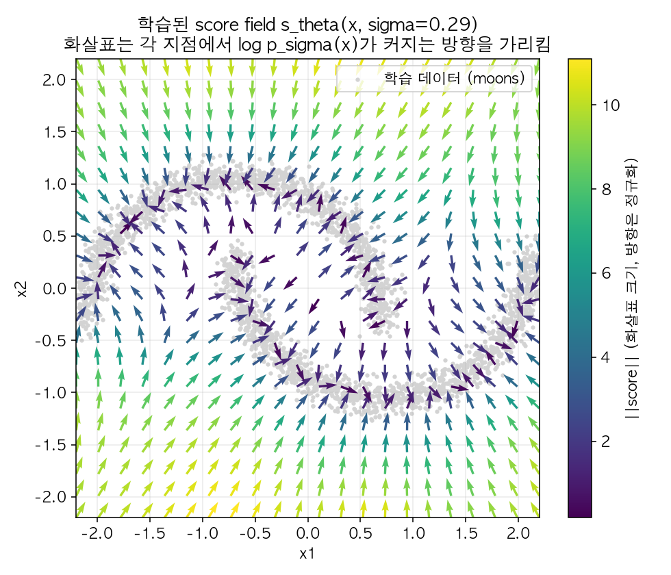
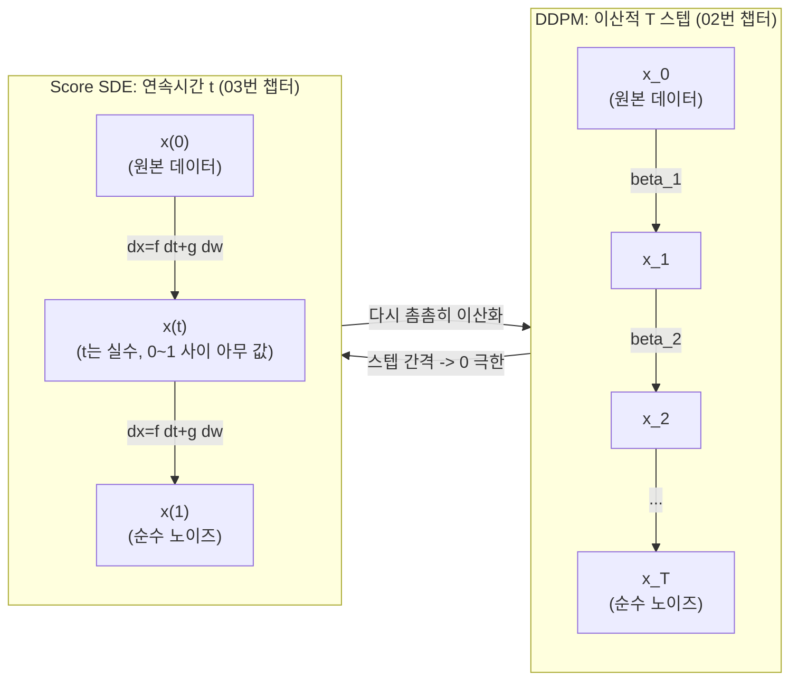
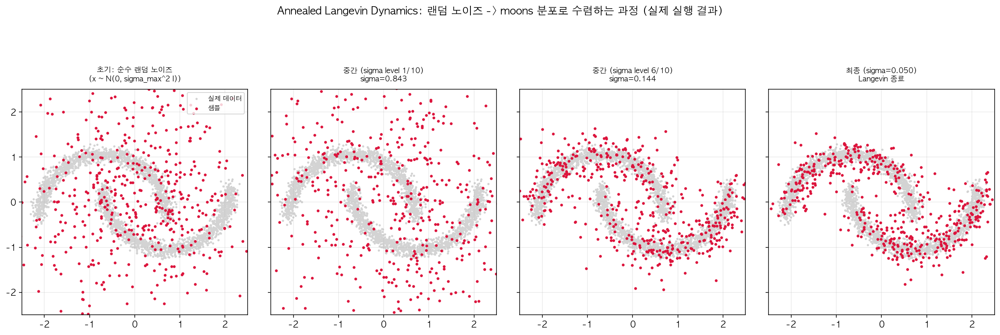

# 03. Score-based Generative Model & SDE (Day 15-17)

02번 챕터에서 "신경망이 노이즈 `epsilon`을 예측한다"고 했는데, 사실 이게 **score function**이라는 훨씬 일반적인 개념의 특수한 경우다. 이 챕터에서는 DDPM을 "score를 추정해서 샘플링하는" 더 큰 틀 안에 재배치하고, 이산적인 `T`개 스텝을 연속적인 시간의 SDE로 일반화한다 (Song et al., ICLR 2021). SyncSDE 논문 제목의 "SDE"가 바로 이 프레임워크다.

## 선수 확인

- 02번 챕터: 노이즈 예측 `epsilon_theta`, forward/reverse process
- 00번 챕터: SDE = drift + noise 라는 최소 직관

## 1. 그림으로 먼저 보는 score

수식으로 들어가기 전에, score가 뭘 하는 놈인지부터 그림으로 감을 잡자. 1차원에 데이터가 두 군데(예: -2 근처와 3 근처)에 몰려 있는 분포 `p(x)`가 있다고 하자.

```
p(x)
              봉우리 1                       봉우리 2
                /\                             /\
               /  \                           /  \
              /    \                         /    \
    ─────────/      \_______________________/      \─────────
             -2                                      3
              x축 →

score s(x) = d/dx log p(x) 의 방향(화살표로 표시):

    →→→ →→   (봉우리 왼쪽: 오른쪽으로 갈수록 확률이 커짐 → 화살표가 +방향)
              ←← ←←←   (봉우리 오른쪽: 왼쪽으로 갈수록 확률이 커짐 → 화살표가 -방향)
    ─────────/      \_______________________/      \─────────
             -2                                      3
```

즉 어느 봉우리든, **그 봉우리를 향해 양쪽에서 화살표가 모여드는 벡터장**이 score다. 봉우리 정중앙(확률이 최댓값)에서는 더 이상 오르막이 없으니 화살표 크기가 0이 되고, 평평한 저확률 지대(두 봉우리 사이 골짜기 근처)에서는 어느 쪽으로든 조금만 움직여도 확률이 크게 바뀌므로 화살표가 크게 나온다.

2차원으로 확장해도 이야기는 똑같다 - 아래는 이 챕터에서 실제로 학습시킨 score network가 초승달(moons) 모양 데이터에 대해 만들어낸 진짜 벡터장이다 (자세한 실습 내용은 5번 섹션).



회색 점들이 실제 데이터(두 개의 초승달), 화살표가 각 위치에서의 score 방향이다. 데이터가 몰려 있는 곡선을 향해 사방에서 화살표가 모여드는 걸 볼 수 있다 - 딱 위 1차원 그림의 2차원 버전이다. 이 직관 하나만 붙잡고 있으면 아래 수식들이 훨씬 편하게 읽힌다: **"score를 따라가면 그럴듯한 데이터 쪽으로 이동한다."**

## 2. Score Function이란

데이터 분포 `p(x)`에 대해, score function은 다음과 같이 정의된다:

```
s(x) = grad_x log p(x)
```

직관: **"확률밀도가 가장 빠르게 커지는 방향을 가리키는 벡터장"** (위 그림 그대로). 어떤 점 `x`에 있든, score를 따라 조금씩 이동하면 확률이 더 높은(더 "그럴듯한" 데이터에 가까운) 영역으로 이동하게 된다.

중요한 성질: score는 `p(x)`의 정규화 상수(normalizing constant)에 무관하다. `p(x) = f(x) / Z`라고 하면 `log p(x) = log f(x) - log Z`이고, `Z`는 `x`에 대한 상수이므로 미분하면 사라진다. 이게 중요한 이유: 딥러닝에서 확률분포를 직접 모델링할 때 골칫거리인 "정규화 상수를 계산하기 어렵다"는 문제를 score 기반 접근은 **아예 우회**한다.

## 3. Langevin Dynamics: Score만 있으면 샘플링이 가능하다

Score function `s(x)`를 정확히 알고 있다면, 아래 반복 규칙(Langevin dynamics)으로 `p(x)`에서 샘플링할 수 있다는 게 통계물리학에서 이미 알려진 결과다:

```
x_{k+1} = x_k + (eps/2) * s(x_k) + sqrt(eps) * z_k,   z_k ~ N(0, I)
```

`eps`가 충분히 작고 반복 횟수가 충분히 많으면, 어디서 시작하든(`x_0`이 랜덤 노이즈여도) 이 과정을 따라가면 결국 `p(x)`를 따르는 샘플이 나온다. 직관적으로는 "score 방향(화살표)으로 한 발짝 걸어가고, 다시 랜덤하게 한 발짝 흔들리고"를 반복하는 것 - 화살표를 따라가는 힘과 랜덤 노이즈가 균형을 이루는 지점에 결국 `p(x)`가 만들어내는 확률적인 분포가 재현된다. **이게 diffusion model의 reverse process(순수 노이즈에서 시작해서 점점 그럴듯한 이미지로 다가가는 것)와 발상이 완전히 같다** - 다만 DDPM은 이 아이디어를 "score" 대신 "노이즈 예측"이라는 다른 이름으로 부르고 있었을 뿐이다.

## 4. Score Matching: Score를 어떻게 학습하는가

문제는 `p(x)`(진짜 데이터 분포)의 score를 직접 알 방법이 없다는 것 - 애초에 `p(x)` 자체를 모르니까. 그래서 신경망 `s_theta(x)`로 score를 근사(추정)하도록 학습시켜야 한다.

**Denoising Score Matching** (핵심 트릭): 원본 데이터 `x`에 약간의 가우시안 노이즈를 섞어서 `x_tilde = x + sigma*epsilon`을 만들면, 노이즈 낀 조건부 분포 `p_sigma(x_tilde | x)`의 score는 닫힌 형태(closed form)를 가진다. 결과만 보면:

```
grad_{x_tilde} log p_sigma(x_tilde | x) = -(x_tilde - x) / sigma^2 = -epsilon / sigma
```

### 4.1 위 식을 실제로 미분해서 확인하기

`x_tilde = x + sigma*epsilon`이라는 노이즈 주입 과정은 곧 `x_tilde`가 `x`를 평균으로, `sigma^2`를 분산으로 갖는 가우시안을 따른다는 뜻이다:

```
p_sigma(x_tilde | x) = N(x_tilde; x, sigma^2 * I)
```

다변량 가우시안의 log-밀도를 그대로 쓰면 (00번 챕터에서 다룬 형태, `d`는 차원 수):

```
log p_sigma(x_tilde | x) = - (1 / (2*sigma^2)) * ||x_tilde - x||^2  -  (d/2) * log(2*pi*sigma^2)
```

여기서 두 번째 항은 `x_tilde`가 전혀 들어있지 않은 순수한 상수다. `x_tilde`에 대해 gradient를 취하면(즉 `x`는 고정해두고, `x_tilde`만 살짝 움직였을 때 log-확률이 얼마나 변하는지 본다) 상수 항은 그대로 사라지고, 남는 항만 체인룰로 미분한다:

```
grad_{x_tilde} log p_sigma(x_tilde | x)
    = grad_{x_tilde} [ - (1 / (2*sigma^2)) * ||x_tilde - x||^2 ]
    = - (1 / (2*sigma^2)) * grad_{x_tilde} [ ||x_tilde - x||^2 ]
    = - (1 / (2*sigma^2)) * 2*(x_tilde - x)          <- (||u||^2의 미분은 2u, u = x_tilde - x)
    = - (x_tilde - x) / sigma^2
```

마지막으로 `x_tilde = x + sigma*epsilon` 이었으므로 `x_tilde - x = sigma*epsilon`을 그대로 대입하면:

```
grad_{x_tilde} log p_sigma(x_tilde | x) = - (sigma * epsilon) / sigma^2 = - epsilon / sigma
```

**정확히 원하던 결과가 나왔다.** 즉 "노이즈 낀 데이터 `x_tilde`의 (조건부) score를 맞추는 문제" = "얼마만큼의 노이즈 `epsilon`이 섞였는지 맞추는 문제"로 정확히 환원된다 - 부호와 `sigma`로 나누는 스케일링만 붙을 뿐이다.

### 4.2 그런데 왜 "조건부" score만 맞춰도 되는가 (Vincent, 2011)

한 가지 짚고 넘어갈 점: 우리가 진짜로 원하는 건 노이즈 낀 데이터의 **marginal** score `grad log p_sigma(x_tilde)` (모든 가능한 원본 `x`에 대해 평균 낸 것)인데, 방금 유도한 건 특정 `x` 하나를 조건으로 건 **conditional** score `grad log p_sigma(x_tilde | x)`이다. 이 둘이 다른데 conditional만 학습해도 되는 이유는?

직관적으로 설명하면: marginal score `grad log p_sigma(x_tilde)`는 사실 "`x_tilde`라는 값이 나올 수 있었던 모든 원본 후보 `x`들에 대해, 각 후보가 알려주는 조건부 score `grad log p_sigma(x_tilde|x)`를 (그 후보일 확률로 가중 평균한 것)"과 정확히 같다는 사실이 증명되어 있다 (Vincent, *A Connection Between Score Matching and Denoising Autoencoders*, 2011). 그래서 "무작위로 뽑은 `(x, epsilon)` 쌍에 대해 조건부 score를 맞추도록 학습"시키면, 평균적으로(기댓값 관점에서) marginal score를 맞추는 것과 동일한 학습 신호를 준다 - 엄밀한 등식 증명은 논문에 맡기고, 여기서는 "조건부를 많이 평균 내면 marginal이 된다"는 논리만 기억해두면 충분하다.

02번 챕터에서 본 `L_simple = E[||epsilon - epsilon_theta||^2]`가 사실 이 score matching loss와 상수배(scaling factor)만 다를 뿐 동일한 식이다.

### 4.3 결론 (이 챕터에서 제일 중요한 문장)

DDPM의 노이즈 예측 신경망 `epsilon_theta(x_t, t)`와 score-based 모델의 score 신경망 `s_theta(x_t, t)`는 다음 관계로 완전히 동치다.

```
s_theta(x_t, t) = -epsilon_theta(x_t, t) / sqrt(1 - alpha_bar_t)
```

**02번 챕터와의 교차 검증**: 이 식이 어디서 나오는지 직접 확인해보자. 02번 챕터 1.2절의 DDPM forward 식은 `x_t = sqrt(alpha_bar_t)*x_0 + sqrt(1-alpha_bar_t)*epsilon`이었다. 이건 `q(x_t|x_0) = N(x_t; sqrt(alpha_bar_t)*x_0, (1-alpha_bar_t)*I)`라는 뜻이므로, 4.1절과 완전히 같은 방식으로 미분하면:

```
grad_{x_t} log q(x_t | x_0) = -(x_t - sqrt(alpha_bar_t)*x_0) / (1 - alpha_bar_t)
                             = -(sqrt(1-alpha_bar_t)*epsilon) / (1 - alpha_bar_t)
                             = -epsilon / sqrt(1 - alpha_bar_t)
```

즉 DDPM의 forward process는 "노이즈 표준편차 `sigma = sqrt(1-alpha_bar_t)`인 denoising score matching"과 정확히 같은 구조다. 그래서 `s_theta(x_t,t) = -epsilon_theta(x_t,t)/sqrt(1-alpha_bar_t)`로 바꿔치기하면 위 식과 정확히 들어맞는다 - 4.1절에서 손으로 미분한 것과 토씨 하나 안 틀리고 같은 패턴이라는 걸 확인할 수 있다.

DDPM 논문과 Score-based 논문은 1~2년 사이에 각자 독립적으로 나왔는데, **결국 같은 것을 다른 언어로 설명한 것**이었다는 게 이 분야에서 유명한 통합의 순간이다.

## 5. 이산적인 T 스텝에서 연속적인 SDE로

02번 챕터의 forward process(`beta_1, ..., beta_T`라는 이산적인 노이즈 스케줄)를, 스텝 간격을 0으로 보내는 극한을 취하면 연속시간 `t in [0,1]`에 대한 SDE로 수렴한다:

```
dx = f(x,t) dt + g(t) dw
```

DDPM의 forward process는 이 중에서도 **VP-SDE (Variance Preserving SDE)**라고 불리는 특수한 형태에 해당한다 (분산이 발산하지 않고 일정 범위로 유지되도록 설계된 형태라서 이런 이름이 붙었다).

아래 그림은 "이산 스텝 `t=0,1,...,T`"와 "연속 시간 `t in [0,1]`"이 어떻게 같은 대상을 다르게 표현한 것인지 보여준다:



즉 DDPM의 `t=0,1,...,1000`이라는 정수 인덱스는 연속시간 SDE의 `t in [0,1]`을 1000등분해서 이산적으로 샘플링한 것에 불과하다. 이 관점을 얻으면 "스텝 수 `T`를 꼭 1000으로 고정할 필요가 있나?"라는 질문이 자연스럽게 떠오르는데, 이게 04번 챕터의 DDIM(적은 스텝으로 샘플링)이 가능한 이유의 이론적 배경이다.

### 5.1 Reverse-time SDE - Anderson (1982)의 결과

이 forward SDE를 시간을 거꾸로 돌리는 reverse-time SDE가 존재하고, 그 형태는 다음과 같다:

```
dx = [f(x,t) - g(t)^2 * grad_x log p_t(x)] dt + g(t) d(w_bar)
```

`w_bar`는 시간이 거꾸로 흐르는 브라운 운동이다. **이 식에 필요한 건 오직 score `grad_x log p_t(x)` 하나뿐이다.**

**어떻게 이런 결과가 나오는가 (엄밀하지 않은 논리 흐름)**: forward SDE `dx = f dt + g dw`를 따라가는 확률과정은, 각 시각 `t`마다 확률밀도 `p_t(x)`를 만들어낸다. 이 `p_t(x)`가 시간에 따라 어떻게 변하는지는 SDE와는 별개로 **Fokker-Planck 방정식**(Kolmogorov forward equation이라고도 부름)이라는 PDE로 정확히 기술할 수 있다는 게 확률과정 이론의 표준 결과다 - "SDE가 만들어내는 확률질량이 시간에 따라 어떻게 흘러 다니는지"를 그리는 방정식이라고 생각하면 된다.

Anderson(1982)이 한 일은 이렇다: "시간을 거꾸로 돌린 과정"(즉 `t`가 `T`에서 `0`으로 흐르는 과정)도 어떤 SDE를 따른다고 가정하고, 그 가상의 reverse SDE가 만들어내는 확률밀도의 흐름이 **원래 forward 과정과 정확히 같은 `p_t(x)`들을 시간만 거꾸로 재생**하도록 요구했다. 이 조건을 Fokker-Planck 방정식에 대입해서 풀면, reverse SDE의 drift 항이 원래 forward의 drift `f(x,t)`에서 `g(t)^2 * grad_x log p_t(x)`라는 보정항을 **빼야만** 두 방향의 확률 흐름이 정확히 들어맞는다는 게 대수적으로 나온다.

직관적으로 풀어보면: 잉크가 물에 퍼지는 영상을 거꾸로 재생한다고 생각해보자. 단순히 "무작위로 흔들리던 입자들의 무작위성만 거꾸로" 재생해서는 잉크가 다시 뭉쳐지지 않는다 - 확산은 원래 방향에서도 무작위였기 때문에, 되감기만 해서는 그 무작위성이 상쇄되지 않는다. 잉크가 원래 있던 곳(농도가 높았던, 즉 확률밀도가 높았던 곳)으로 다시 모이게 하려면, 각 위치에서 **"밀도가 높은 쪽으로 끌어당기는 추가적인 힘"**이 필요하다 - 그리고 그 힘의 방향과 크기가 정확히 score `grad_x log p_t(x)`다. 이게 바로 reverse-time SDE에 score 보정항이 등장하는 이유다.

즉 "모든 시각 `t`에서의 score만 알면, forward process를 정확히 역전시켜서 노이즈로부터 데이터를 복원할 수 있다"는 게 이 이론의 핵심 결론이다. DDPM의 reverse process 샘플링 알고리즘(02번 챕터 섹션 4)은 이 reverse-time SDE를 이산적으로(discretize) 근사 계산한 특수 사례에 불과하다.

### 5.2 Probability Flow ODE (참고만)

같은 주변분포(marginal distribution) `p_t(x)`를 갖는 **결정론적** ODE도 유도할 수 있다:

```
dx = [f(x,t) - (1/2) * g(t)^2 * grad_x log p_t(x)] dt
```

랜덤 항(`dw`)이 없어서 같은 시작점 `x_T`에서는 항상 같은 결과가 나온다 (재현 가능). 이 아이디어가 04번 챕터에서 다룰 **DDIM**의 이론적 배경이다 - "왜 DDIM이 결정론적 샘플링을 할 수 있는가"에 대한 답이 바로 여기 있다.

## 6. 실습: 2D Toy 데이터로 score matching + Langevin dynamics 직접 구현

이론만으로는 "score를 따라가면 데이터가 만들어진다"는 말이 잘 안 믿긴다. 그래서 실제로 작은 2D 데이터셋에서 처음부터 끝까지 돌려봤다 (PyTorch 없이 numpy로 MLP의 forward/backward를 직접 구현 - 이 환경엔 PyTorch가 없어서, 오히려 "역전파가 실제로 뭘 하는지" 한 번 더 복습하는 계기가 됐다). 전체 코드는 `assets/03-generate-plots.py`에 있고, 아래 명령으로 그대로 재현할 수 있다:

```
python3 assets/03-generate-plots.py
```

### 6.1 데이터와 학습 설정

- 데이터: `sklearn.datasets.make_moons(n_samples=3000, noise=0.06)`로 만든 두 개의 초승달 모양 2D 점(인터넷 접속 없이 로컬에서 바로 생성됨). 평균 0, 대략 표준편차 1이 되도록 스케일만 정규화했다.
- Score network `s_theta(x, sigma)`: 입력이 `[x1, x2, log(sigma)]`인 3->128->128->2 크기의 MLP (활성화 함수 tanh). 4번 섹션에서 배운 걸 그대로 실전에 옮기면, "noise 표준편차 `sigma` 하나를 고정해서" 학습할 수도 있지만, 그러면 `sigma`가 큰 영역(데이터에서 멀리 떨어진 곳)에서는 score가 부정확해서 Langevin dynamics가 순수 노이즈에서 출발했을 때 데이터 쪽으로 못 찾아간다. 그래서 Song & Ermon(2019, NCSN)이 제안한 대로 **여러 개의 noise scale `sigma_1 > sigma_2 > ... > sigma_L`**(큰 값 1.2에서 작은 값 0.05까지 등비수열로 10개)을 동시에 학습시키고, 샘플링할 때는 큰 `sigma`에서 작은 `sigma`로 서서히 낮춰가며 Langevin dynamics를 반복하는 **annealed Langevin dynamics**를 썼다. (이렇게 "노이즈 스케일이 여러 개 있고, 그 사이를 촘촘하게 채우면 결국 연속적인 시간 축이 된다"는 게 정확히 5번 섹션에서 다룬 "이산 -> 연속 SDE" 아이디어의 축소판이다.)
- Loss: 4번 섹션에서 유도한 denoising score matching, NCSN 가중치 `lambda(sigma) = sigma^2`를 적용한 형태:

```
loss = E_{sigma, x_0, epsilon} [ || sigma * s_theta(x_0 + sigma*epsilon, sigma) + epsilon ||^2 ]
```

- Optimizer: Adam(learning rate 2e-3)도 numpy로 직접 구현. batch size 256, 6000 iteration 학습.

### 6.2 학습 결과

실제로 돌린 결과, loss는 초기 `2.17`에서 후반 `1.25~1.45` 대로 떨어지며 수렴했다 (아래는 실행 로그 일부):

```
iter     1  loss 2.1707
iter  1000  loss 1.5674
iter  3000  loss 1.4720
iter  6000  loss 1.4537   (최근 200 iter 평균 1.3773)
```

**시각자료 (a) - 학습된 score field (quiver plot)**: 1번 섹션에서 이미 보여준 그림이 바로 이 학습 결과다 (`assets/03-score-quiver.png`, `sigma≈0.29`). 화살표가 데이터 곡선을 향해 사방에서 모여드는 걸 실제로 확인할 수 있다. 재미있는 관찰: 데이터에서 멀리 떨어진 영역(그림 가장자리, 노란색)일수록 오히려 화살표 크기(`||score||`)가 커진다 - 가우시안으로 뭉갠 밀도의 score는 대략 `-(거리)/sigma^2`에 비례하기 때문에 멀리 있을수록 "끌어당기는 힘"이 세지는 게 수학적으로도 자연스럽다.

### 6.3 Annealed Langevin Dynamics 샘플링 결과

학습된 `s_theta(x, sigma)`로 3번 섹션의 Langevin dynamics를, `sigma`를 `1.2 -> ... -> 0.05`까지 서서히 낮춰가며(각 스케일마다 100 스텝) 500개의 점에 대해 실제로 돌렸다.

**시각자료 (b) - 샘플링 과정 스냅샷**:



왼쪽부터: (1) 초기 순수 랜덤 노이즈, (2)(3) 노이즈 스케일을 낮춰가는 중간 단계, (4) 최종 결과. 정량적으로도 확인했다 - 각 점에서 가장 가까운 실제 데이터 점까지의 평균 거리가:

```
초기 노이즈 -> 최근접 데이터점 평균 거리: 0.427
최종 샘플   -> 최근접 데이터점 평균 거리: 0.078
```

즉 무작위로 흩뿌려져 있던 점들이 Langevin dynamics를 거치며 실제로 초승달 모양 위로 5배 넘게 더 가까워졌다는 걸 숫자로도 확인했다 - "score를 따라 걸어가면 데이터 분포가 재현된다"는 이론이 장난감 예제에서나마 눈으로, 숫자로 검증된 셈이다.

## 7. 이 챕터가 어디로 이어지는가

- **04번 챕터 (DDIM)**: probability flow ODE의 이산화 버전
- **06번 챕터 (SyncSDE)**: 여러 diffusion trajectory를 SDE 레벨에서 결합하는 문제. 지금 배운 "score = grad log p" 언어를 그대로 써서 "여러 trajectory의 joint score를 어떻게 모델링할 것인가"라는 질문으로 이어짐

## 참고 자료

- Yang Song 블로그, "Generative Modeling by Estimating Gradients of the Data Distribution" - 이 챕터 전체 내용을 애니메이션과 그림으로 설명한 최고의 입문 자료. **논문보다 먼저 읽을 것**
- Song et al., *Score-Based Generative Modeling through Stochastic Differential Equations* (ICLR 2021) - 원 논문
- Song & Ermon, *Generative Modeling by Estimating Gradients of the Data Distribution* (NeurIPS 2019) - NCSN 원 논문, 6번 섹션 실습에서 그대로 가져다 쓴 annealed Langevin dynamics + multi-scale noise 아이디어가 여기서 나온다
- Vincent, *A Connection Between Score Matching and Denoising Autoencoders* (2011) - 4.2절 denoising score matching 이론의 원 논문
- GitHub `yang-song/score_sde` - 공식 구현체에 2D 토이 데이터 튜토리얼 노트북이 포함되어 있음
- Anderson, *Reverse-time diffusion equation models* (1982) - reverse-time SDE의 원조 증명 (수학적으로 깊게 파고 싶을 때만)
