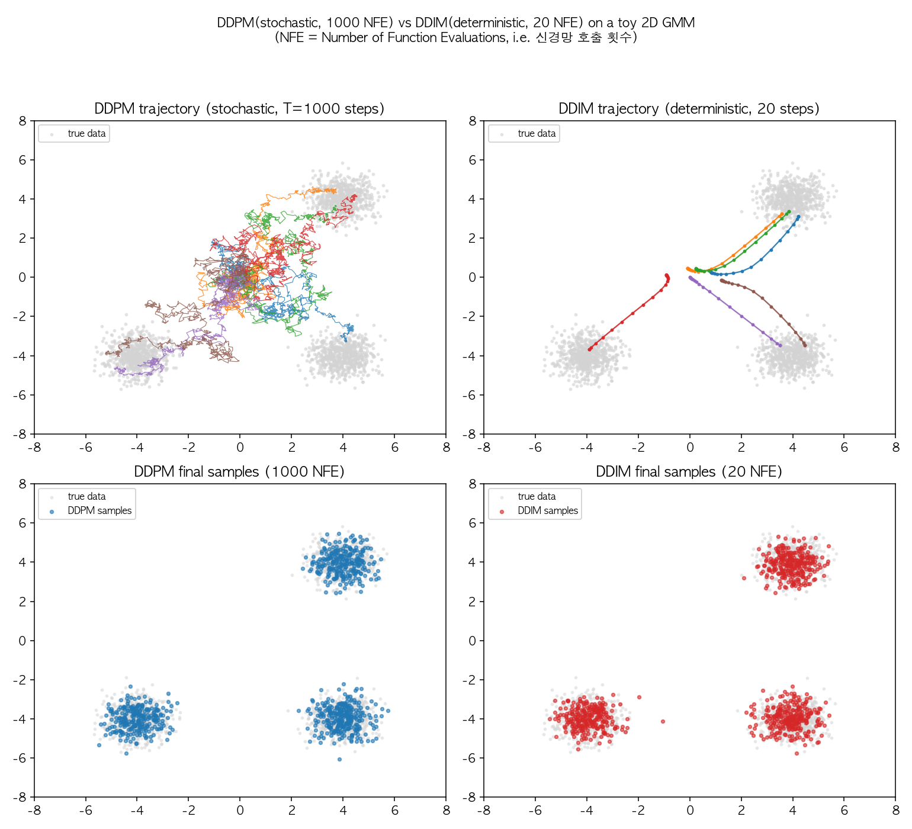
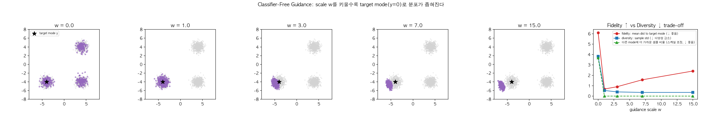
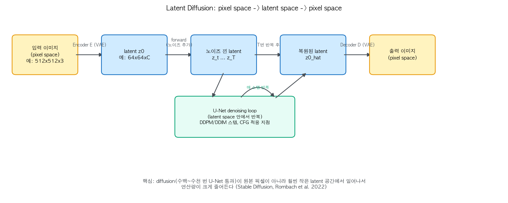
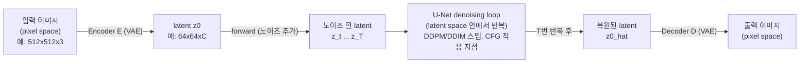

# 04. Sampling & Guidance - DDIM, Classifier(-Free) Guidance, Latent Diffusion (Day 18-21)

02번 챕터의 DDPM 샘플링은 1000 스텝을 순차로 거쳐야 해서 느리고, "원하는 조건대로" 생성하는 방법도 아직 안 다뤘다. 이 챕터는 실전에서 diffusion model을 쓸 때 항상 등장하는 세 가지 - **빠른 샘플링(DDIM)**, **조건부 생성(Guidance)**, **연산량 절감(Latent Diffusion)** - 을 다룬다. `../computer-vision/05-generative-models-beyond-the-course.md`에 이미 개요가 있으니, 여기서는 "왜/어떻게 되는지"에 집중하고, 가능한 부분은 직접 코드로 돌려서 눈으로 확인한다.

## 선수 확인

- 02번 챕터: DDPM 샘플링 알고리즘, `epsilon_theta` 파라미터화
- 03번 챕터: Score function, Probability Flow ODE (섹션 4.2) - DDIM의 이론적 배경
- 00번 챕터: 가우시안의 성질, 특히 섹션 1.3 "가우시안 곱 = score 더하기"

## 1. DDIM: 결정론적이고 빠른 샘플링

### 1.1 핵심 관찰

DDPM의 reverse process는 반드시 마르코프 체인(Markov chain, `x_t`는 오직 `x_{t+1}`에만 의존)일 필요가 없다는 게 DDIM 논문(Song et al., 2021)의 통찰이다. `q(x_{t-1}|x_t, x_0)`와 같은 marginal(주변분포)들을 그대로 유지하면서도, non-Markovian한 다른 형태의 reverse process를 정의할 수 있다.

### 1.2 왜 이게 가능한가 - non-Markovian 가정에서 샘플링 식이 나오는 논리

이게 처음 보면 마법처럼 느껴지는데, 사실 DDPM의 학습 목적함수(`L_simple`, 02번 챕터 섹션 3)를 다시 들여다보면 왜 이런 자유도가 생기는지 알 수 있다.

**1단계 - DDPM이 정말로 강제하는 조건은 무엇인가.** DDPM의 loss `L_simple = E[||epsilon - epsilon_theta(x_t, t)||^2]`는 `x_t`를 만들 때 오직 다음 관계식(닫힌 형태 forward process, 02번 챕터 1.2)만 쓴다:

```
x_t = sqrt(alpha_bar_t) * x_0 + sqrt(1 - alpha_bar_t) * epsilon,   epsilon ~ N(0, I)
```

즉 학습이 실제로 요구하는 건 "**주변분포** `q(x_t|x_0)`가 이 식을 만족해야 한다"는 것뿐이다. `x_0 -> x_1 -> x_2 -> ... -> x_t`처럼 반드시 한 스텝씩 순차적으로(Markov chain으로) 노이즈를 쌓아야 한다는 조건은 어디에도 없다 - 그건 원 논문이 수식을 유도하기 편해서 골랐던 하나의 선택이었을 뿐이다.

**2단계 - 그렇다면 다른 reverse process를 만들어도 되지 않을까.** Song et al.은 파라미터 `sigma_t`로 인덱싱되는 **reverse 방향의 조건부 분포족** `q_sigma(x_{t-1}|x_t, x_0)`를 새로 정의한다:

```
q_sigma(x_{t-1} | x_t, x_0) = N( x_{t-1};
    sqrt(alpha_bar_{t-1}) * x_0
    + sqrt(1 - alpha_bar_{t-1} - sigma_t^2) * (x_t - sqrt(alpha_bar_t) * x_0) / sqrt(1 - alpha_bar_t) ,
    sigma_t^2 * I )
```

복잡해 보이지만 뜯어보면, 이 식은 `sigma_t`를 무엇으로 고르든(!) `x_t`를 marginalize해서 계산해보면 정확히 원래의 `q(x_t|x_0) = N(sqrt(alpha_bar_t) x_0, (1-alpha_bar_t) I)`가 그대로 재현되도록 **역산해서** 설계된 식이다 (증명은 귀납적으로 `t=T`부터 내려오며 가우시안 marginalization을 반복 - 00번 챕터 1.1 "가우시안의 선형결합은 가우시안"이 여기서도 그대로 쓰인다). 즉:

> **핵심 통찰**: `sigma_t`가 뭐든 상관없이 forward marginal `q(x_t|x_0)`는 항상 똑같이 유지된다. 그런데 DDPM의 `L_simple` loss는 오직 이 marginal에만 의존하므로, **`sigma_t`를 어떻게 고르든 같은 학습 loss, 같은 학습된 `epsilon_theta`를 재사용할 수 있다.**

**3단계 - 학습된 모델을 그대로 대입.** 진짜 `x_0`은 샘플링 시점에 모르니, 02번 챕터 2.2에서 쓴 관계식(`x_t = sqrt(alpha_bar_t) x_0 + sqrt(1-alpha_bar_t) epsilon`을 `x_0`에 대해 풀기)으로 추정치를 만든다:

```
x0_hat = ( x_t - sqrt(1 - alpha_bar_t) * epsilon_theta(x_t, t) ) / sqrt(alpha_bar_t)
```

이 `x0_hat`과 (진짜 `epsilon` 대신) `epsilon_theta(x_t, t)`를 위 `q_sigma` 식에 대입해서 정리하면, 바로 아래 1.3절의 DDIM 샘플링 식이 나온다. **결국 DDIM은 "새로운 모델"이 아니라, 같은 학습 결과물을 다른 (그러나 marginal이 똑같이 맞는) reverse process 식에 대입한 것**이다 - 그래서 재학습이 필요 없다.

### 1.3 결과: 노이즈 항을 0으로 만들 수 있다

위 유도를 그대로 옮기면, DDIM에서 실제로 쓰는 샘플링 식은 다음과 같다 (핵심 부분만):

```
x_{t-1} = sqrt(alpha_bar_{t-1}) * x0_hat  +  sqrt(1 - alpha_bar_{t-1} - sigma_t^2) * epsilon_theta(x_t, t)  +  sigma_t * z
```

(`x0_hat`은 위 2단계에서 `epsilon_theta`로부터 역산한 `x_0`의 추정값)

여기서 `sigma_t`를 **0으로 설정**하면 랜덤 항(`z`)이 완전히 사라져서 **결정론적(deterministic)** 샘플링이 된다 - 같은 `x_T`에서 시작하면 항상 같은 결과가 나온다. 분산이 정확히 0이 되어 `x_{t-1}`이 `x_t`의 결정론적 함수가 되는 이 극한이, 03번 챕터에서 본 probability flow ODE(섹션 4.2)를 이산적으로 구현한 것과 정확히 같다 - "왜 DDIM이 결정론적일 수 있는가"에 대한 답이 여기서 자연스럽게 나온다.

### 1.4 왜 빠른가

2단계에서 봤듯이 `sigma_t`(그리고 사실은 어떤 시각 `t`들을 reverse 과정에 쓸지도)는 학습과 무관한 **샘플링 시점의 선택**이다. 그래서 DDPM처럼 매 스텝(t, t-1, t-2, ...)을 다 거칠 필요 없이, **스텝을 듬성듬성 건너뛰어도**(예: 1000 스텝 중 20~50 스텝만 골라서) 같은 marginal-보존 논리가 그대로 적용된다. 학습은 그대로 DDPM 방식(`L_simple`)으로 하고, **샘플링할 때만** DDIM 식으로 스텝 수를 줄이는 것 - 재학습이 필요 없다는 게 실무적으로 중요한 장점이다.

### 1.5 실습으로 직접 확인: DDPM vs DDIM (Day 18)

이 절부터는 실제로 코드를 돌려서 나온 결과다. 02, 03번 챕터에서 신경망으로 근사해야 했던 score/`epsilon_theta`를, 여기서는 **오라클(oracle, 정답을 아는) score**로 대체해서 "DDIM/CFG 자체의 수학적 효과"만 깨끗하게 관찰한다. 방법은:

- 진짜 데이터 분포 `p(x)`를 2D 평면 위 3개의 봉우리(mode)를 가진 Gaussian mixture로 정의한다 (`(-4,-4)`, `(4,4)`, `(4,-4)` 중심, 등방성 분산).
- 가우시안을 가우시안으로 convolve하면 다시 가우시안이므로(00번 챕터 1.1), 노이즈 낀 주변분포 `p_t(x_t)`도 정확히 계산 가능한 Gaussian mixture다. 이 mixture의 score는 "책임도(responsibility)로 가중한 각 성분 score의 평균"으로 닫힌 형태로 나온다 - 신경망 없이 **정답 score**를 바로 손에 쥘 수 있다.
- 03번 챕터의 동치 관계 `score = -epsilon / sqrt(1-alpha_bar_t)`로 오라클 `epsilon_theta`를 만든다.

```python
def gmm_score(x, means, var, weights):
    """등방성 Gaussian mixture의 score = grad_x log sum_k w_k N(x; m_k, var_k I).
    00번 챕터 1.3 "여러 가우시안을 섞는다"는 아이디어의 연장선."""
    diffs = x[:, None, :] - means[None, :, :]                      # (N,K,2)
    sq = np.sum(diffs**2, axis=-1) / var[None, :]
    logp_k = np.log(weights)[None,:] - 0.5*sq - np.log(2*np.pi*var)[None,:]
    resp = np.exp(logp_k - logp_k.max(1, keepdims=True))
    resp /= resp.sum(1, keepdims=True)                              # 책임도
    comp_score = -diffs / var[None, :, None]
    return np.sum(resp[:, :, None] * comp_score, axis=1)

def eps_uncond(x, t_idx):                      # score -> epsilon (03번 챕터 동치식)
    m, var, w = marginal_params(t_idx)
    return -np.sqrt(1 - alpha_bars[t_idx]) * gmm_score(x, m, var, w)
```

이 오라클 `eps_uncond`로 02번 챕터 섹션 4의 DDPM 알고리즘(T=1000, 매 스텝 랜덤 노이즈 `z` 추가)과, 위 1.3절의 DDIM 알고리즘(20 스텝, `sigma_t=0`)을 그대로 구현해서 같은 `x_T`에서 출발한 경로를 비교했다.



| 방식 | NFE(신경망 호출 횟수) | 경로 형태 | 진짜 데이터와의 평균 최근접 거리 |
|---|---|---|---|
| DDPM (ancestral) | 1000 | 매 스텝 랜덤 `z`가 섞여 지그재그로 흔들림 | 0.0566 |
| DDIM (`sigma_t=0`) | 20 | 완전히 매끈한 곡선, 재현 가능(deterministic) | 0.0535 |

**관찰**: 위 그림 왼쪽 위(DDPM 경로)는 각 궤적이 부들부들 떨면서 목적지 mode로 흘러가는 반면, 오른쪽 위(DDIM 경로)는 같은 출발점에서 시작해도 매끈한 곡선을 그리며 이동한다 - `sigma_t=0`이라 랜덤성이 개입할 자리가 없기 때문이다. 그런데 아래 행(최종 샘플 분포)을 보면, **NFE를 1000에서 20으로 50배 줄였는데도** 최종 분포는 진짜 데이터 분포(회색 점)를 거의 동일한 정확도로 재현한다 (최근접 거리 0.0566 vs 0.0535로 오히려 DDIM 쪽이 살짝 더 낮게 나올 정도). 이게 "왜 DDIM이 빠른가"의 직접적인 실증이다.

(전체 실행 코드: `code/04_ddim_cfg_toy.py`)

## 2. Guidance: 원하는 조건대로 생성하게 만들기

### 2.1 Classifier Guidance - 00번 챕터의 "score 더하기"가 실제로 쓰이는 곳

조건 `y`(예: 클래스 라벨)가 주어졌을 때의 score는 베이즈 정리로 다음처럼 분해된다:

```
grad_x log p(x|y) = grad_x log p(x)  +  grad_x log p(y|x)
                     ^^^^^^^^^^^^^^     ^^^^^^^^^^^^^^^^^^
                     무조건부 score      별도 학습된 classifier의 gradient
```

즉 **"조건부 score = 무조건부 score + 분류기(classifier)의 gradient"**로, 두 score를 단순히 **더하기만** 하면 조건부 생성이 된다.

이게 왜 00번 챕터 섹션 1.3 "가우시안 곱 = score 더하기"의 실전 사례인지 짚어보자. 베이즈 정리 `p(x|y) proportional to p(x) * p(y|x)`는 **두 밀도함수의 곱**이다. 양변에 로그를 씌우면 `log p(x|y) = log p(x) + log p(y|x) + const`가 되고, 여기에 `x`로 미분(grad)을 취하면 상수항은 사라지면서 정확히 위 식이 나온다. 즉:

> **"두 분포를 곱한다" -> "로그를 더한다" -> "score(로그의 gradient)를 더한다"**는 한 줄의 논리가 여기서도 똑같이 적용된 것이다.

00번 챕터에서는 두 분포가 둘 다 가우시안이라서 곱한 결과가 "정밀도(precision) 가중 평균"이라는 아주 깔끔한 닫힌 형태로 나왔다. 여기서는 `p(y|x)`(classifier)가 가우시안이 아니라 임의의 분류기라서 그런 닫힌 형태는 없지만, "곱셈 -> 덧셈"이라는 **연산 구조 자체**는 완전히 동일하다. 단점: 별도로 (노이즈 낀 이미지에 대해 작동하는) classifier를 새로 학습시켜야 한다.

### 2.2 Classifier-Free Guidance (CFG) - 지금 실무 표준

Classifier 없이, **하나의 diffusion model을 조건부/무조건부 두 가지 모드로 같이 학습**시킨다 (학습 중 일정 확률로 조건 `y`를 빈 값으로 치환). 그러면 추론 시 아래처럼 두 예측을 외삽(extrapolate)해서 조건을 원하는 만큼 강하게 반영할 수 있다:

```
epsilon_guided = epsilon_theta(x_t, t, empty)
                 + w * ( epsilon_theta(x_t, t, y) - epsilon_theta(x_t, t, empty) )
```

**이 식도 결국 2.1절의 "score 더하기"다.** `epsilon`과 score의 관계식(`epsilon = -sigma_t * score`, 03번 챕터)을 대입해서 정리하면:

```
epsilon_cond - epsilon_uncond = -sigma_t * (score_cond - score_uncond) = -sigma_t * grad_x log p(y|x)
```

즉 CFG의 "두 예측값의 차이"는 다름 아닌 **2.1절에서 등장한 classifier gradient `grad_x log p(y|x)` 그 자체**다 (classifier를 명시적으로 학습시키지 않았을 뿐, 조건부/무조건부 모델의 차이가 암묵적으로(implicitly) 같은 정보를 담고 있다). 이걸 score 식으로 다시 쓰면:

```
score_guided = score_uncond + w * grad_x log p(y|x) = grad_x log [ p(x) * p(y|x)^w ]
```

**`w`를 키운다는 것은 곧 classifier의 확신도 `p(y|x)`를 `w`제곱만큼 과장한다는 뜻이다.** `w>1`이면 `p(y|x)^w`는 원래보다 훨씬 뾰족한(sharper) 분포가 되어(softmax에서 temperature를 낮추는 것과 같은 효과), 조건에 딱 맞는 영역에만 확률을 몰아준다 - 이게 guidance scale이 커질수록 조건 충실도는 올라가지만 다양성이 줄어드는 수학적 근원이다.

**직관 - 스포트라이트 비유**: 무조건부 score `p(x)`는 무대 전체를 은은하게 비추는 조명이라고 생각하면, classifier gradient(=CFG의 차이항)는 특정 배우 한 명만 가리키는 스포트라이트다. `w=0`이면 스포트라이트가 꺼진 상태라 배우도 무대도 골고루 보이고(=조건 무시, 다양성 최대), `w=1`이면 배우가 좀 더 밝게 보이되 나머지 무대도 여전히 눈에 들어온다. `w`를 계속 키우면 스포트라이트 폭이 점점 좁아지면서 그 배우만 강렬하게 드러나고 무대의 다른 디테일(다양성)은 어둠에 묻힌다. 그런데 조명을 극단적으로 세게 켜면 오히려 배우의 얼굴조차 하얗게 날아가버리듯(과다노출, oversaturation), 이미지 모델에서도 `w`가 너무 크면 색이 과포화되고 형태가 부자연스러워진다 - "충실도를 얻는 대신 다양성뿐 아니라 결국 품질까지 잃는" 트레이드오프다.

Stable Diffusion, DALL-E 등 대부분의 실전 text-to-image 모델이 이 방식을 쓴다.

### 2.3 실습으로 직접 확인: CFG scale sweep (Day 19-20)

1.5절과 같은 3-mode toy 분포를 그대로 재사용한다. 이번엔 mode `k=0`(중심 `(-4,-4)`)을 "조건 `y`"로 지정하고, `eps_cond`(그 mode 하나만 남긴 가우시안의 score)와 `eps_uncond`(mixture 전체의 score)를 2.2절 식대로 외삽해서 DDIM(50 스텝)으로 샘플링했다.

```python
def eps_cfg(x, t_idx, k, w):
    e_u, e_c = eps_uncond(x, t_idx), eps_cond(x, t_idx, k)
    return e_u + w * (e_c - e_u)          # 섹션 2.2 식 그대로
```



| guidance scale `w` | target mode까지 평균 거리 (fidelity, ↓좋음) | 샘플 표준편차 (diversity) | 다른 mode에 더 가까운 샘플 비율 |
|---|---|---|---|
| 0.0 (무조건부) | 6.11 | 3.82 | 60.4% |
| 1.0 | 0.68 | 0.54 | 0.0% |
| 3.0 | 0.90 | 0.40 | 0.0% |
| 7.0 | 1.57 | 0.35 | 0.0% |
| 15.0 | 2.41 | 0.36 | 0.0% |

**관찰 1 (다양성 감소는 분명하고 빠르다)**: `w=0`(무조건부)에서는 샘플이 세 mode에 고르게 퍼져 있어 표준편차가 3.82로 크지만, `w=1`만 되어도 표준편차가 0.54로 급격히 줄고 "다른 mode에 더 가까운 샘플"이 0%가 된다 - **아주 약한 guidance만으로도 조건 충실도는 거의 확보된다.**

**관찰 2 (`w`를 계속 키우면 오히려 과녁을 벗어난다 - "과잉교정" 현상)**: 직관적으로는 `w`가 클수록 target mode 중심에 더 가까이 모일 것 같지만, 표에서 target까지의 평균 거리는 `w=1`일 때 0.68로 최소이고, 오히려 `w=7, 15`로 갈수록 1.57, 2.41로 **다시 멀어진다**. CFG가 두 score 벡터의 **선형 외삽(extrapolation)**이라서, `w`가 커질수록 실제 데이터가 존재하는 밀도가 높은 영역을 지나쳐(overshoot) 그 바깥쪽으로 밀려나기 때문이다. 표준편차는 계속 줄어드니(0.54 -> 0.35 -> 0.36) "다양성은 계속 잃으면서, 정확도조차 더 이상 좋아지지 않고 오히려 나빠지는" 이중으로 손해 보는 구간에 들어선 것이다. 실제 이미지 모델에서 guidance scale을 과하게 높이면 색이 과포화되고 이미지가 부자연스러워지는 현상(2.2절 스포트라이트 비유의 "과다노출")이 바로 이 toy 실험에서 본 "overshoot"의 시각적 표현이라고 볼 수 있다.

**두 방식의 공통점 (다음 챕터 예고)**: 결국 classifier guidance와 CFG 둘 다 "여러 개의 score 예측값을 선형결합(더하거나 외삽)해서 새로운 생성 방향을 만든다"는 트릭이고, 방금 본 것처럼 그 결합 강도(`w`)를 어떻게 잡느냐에 따라 다양성/충실도뿐 아니라 "결합 강도가 과하면 오히려 실제 분포를 벗어난다"는 부작용까지 생긴다. 05, 06번 챕터에서 다룰 diffusion synchronization은 이 트릭을 "조건부 vs 무조건부"라는 두 개의 특수한 경우에서, "서로 다른 이미지 영역/시점을 담당하는 여러 개의 독립적인 diffusion trajectory"로 일반화한 것이라고 볼 수 있다 - 그리고 방금 CFG에서 본 "결합 강도가 과하면 오버슈트한다"는 문제도, trajectory를 여러 개 섞는 synchronization 논문들에서 형태를 바꿔 그대로 다시 등장한다 (예: 여러 trajectory를 너무 강하게 잡아당기면 개별 trajectory가 원래 학습된 분포에서 이탈하는 문제).

## 3. Latent Diffusion (Stable Diffusion)

### 3.1 문제

512x512x3 같은 원본 픽셀 공간에서 매 스텝 U-Net을 통과시키면 연산량이 지나치게 크다.

### 3.2 해결책

1. 먼저 오토인코더(01번 챕터의 VAE와 유사한 구조)를 별도로 학습시켜, 이미지를 훨씬 작은 latent space(예: 64x64xC)로 압축/복원할 수 있게 만든다
2. Diffusion(forward/reverse process, U-Net)을 원본 픽셀이 아니라 **이 latent space 안에서** 수행한다
3. 최종적으로 생성된 latent를 VAE decoder에 통과시켜 원래 해상도의 이미지로 복원한다

VAE의 latent space가 원본 픽셀 공간보다 훨씬 저차원이면서도 지각적으로 중요한 정보는 보존하고 있어서, 훨씬 적은 연산으로 고해상도 이미지 생성이 가능해진다. 이게 Stable Diffusion(Rombach et al., 2022)의 핵심 아이디어다. 전체 흐름을 그림으로 정리하면:





(위 mermaid 블록은 GitHub 등 mermaid를 지원하는 뷰어에서 그대로 렌더링된다. 이 저장소를 일반 텍스트 에디터로 볼 경우를 대비해 같은 내용을 PNG로도 `assets/`에 저장해뒀다.)

### 3.3 이 챕터가 왜 diffusion synchronization과 관련 있는가

MultiDiffusion, SyncSDE 등 여러 논문이 실험을 Latent Diffusion(Stable Diffusion) 위에서 수행한다. "여러 trajectory를 합친다"는 연산을 **픽셀 공간에서** 할지 **latent 공간에서** 할지도 태스크에 따라 결과가 달라지는 설계 선택 중 하나다 - 05, 06번 챕터를 읽을 때 이 논문들이 어느 공간에서 score를 섞는지 유심히 볼 것.

### 3.4 실제 `diffusers` 코드로 컴포넌트 구조 확인 (Day 21, 부분적으로 시도)

Day 21 과제(사전학습된 Stable Diffusion으로 실제 생성)를 이 문서 작성 시점에 그대로 시도해봤다. 결과부터 정리하면:

- **실제 이미지 품질 생성은 생략했다.** 진짜 `runwayml/stable-diffusion-v1-5` 같은 체크포인트는 가중치가 ~4GB라 이 연습의 범위를 넘어선다고 판단했다.
- 대신 Hugging Face가 테스트 용도로 올려둔 **`hf-internal-testing/tiny-stable-diffusion-torch`** (가중치가 랜덤 초기화된 아주 작은 테스트 체크포인트, 수 MB) 를 `diffusers.StableDiffusionPipeline`으로 실제로 로드/실행해서, **3.2절 다이어그램이 코드에서 정확히 어떻게 나뉘어 있는지**는 확인했다:

```python
from diffusers import StableDiffusionPipeline
pipe = StableDiffusionPipeline.from_pretrained(
    "hf-internal-testing/tiny-stable-diffusion-torch", safety_checker=None)

# 실제로 확인된 컴포넌트 구성:
# pipe.vae            -> AutoencoderKL          (3.2절의 Encoder E / Decoder D)
# pipe.unet           -> UNet2DConditionModel   (3.2절의 U-Net denoising loop, latent_channels=4)
# pipe.text_encoder   -> CLIPTextModel          (텍스트 조건 y를 임베딩 -> CFG의 "조건" 입력)
# pipe.scheduler      -> PNDMScheduler          (1절의 DDIM류 스케줄러와 같은 역할군)

image = pipe("a red cube on a table", num_inference_steps=8, guidance_scale=7.5).images[0]
```

파이프라인은 정상적으로 끝까지(text encoding -> latent 초기화 -> U-Net denoising loop 8스텝 -> VAE decode) 실행됐다. 다만 가중치가 학습되지 않은 랜덤 값이라 결과 이미지는 의미 없는 노이즈 텍스처였다 - **이 시도의 목적은 "코드 레벨에서 VAE encode/decode와 U-Net denoising 루프가 어떻게 나뉘어 있는지" 확인하는 것이었지, 생성 품질을 보려는 게 아니었다.** 실제 품질을 보고 싶다면 `model_id`만 `"stable-diffusion-v1-5/stable-diffusion-v1-5"`처럼 정식 체크포인트로 바꾸면 되고, 코드 구조(위 4개 컴포넌트 + guidance_scale 인자가 그대로 2.2절 CFG의 `w`로 들어간다는 점)는 완전히 동일하다.

## 실습 과제 (Day 18-21) - 진행 현황

1. **Day 18** (완료, 1.5절): 오라클 score로 DDIM 샘플링 구현, DDPM(1000 step) vs DDIM(20 step) 경로/최종분포 비교. 결과: NFE를 50배 줄여도 데이터 분포 근접도가 거의 동일했다.
2. **Day 19-20** (toy 버전으로 완료, 2.3절 / 실제 MNIST 학습은 심화 과제로 남김): 조건부/무조건부 score를 analytic하게 정의하고 CFG 외삽으로 `w in {0,1,3,7,15}` 스윕. 결과: `w=1`에서 이미 조건 충실도 대부분 확보, `w`를 더 키우면 다양성은 계속 줄지만 target까지 거리는 오히려 늘어나는 overshoot 관찰. (실제 신경망으로 MNIST 조건부 학습 + CFG까지 하는 건 02번 챕터의 U-Net 구현이 선행돼야 하므로, 이 문서에서는 "현상 자체"를 analytic toy로 먼저 검증하고 신경망 버전은 02번 챕터 실습과 이어서 진행하는 것을 권장한다.)
3. **Day 21** (부분 완료, 3.4절): `diffusers` `StableDiffusionPipeline`을 실제로 로드/실행해서 컴포넌트 구조(VAE/U-Net/텍스트 인코더/스케줄러)를 코드 레벨로 확인. 실제 고품질 생성(정식 SD1.5 체크포인트, ~4GB 다운로드)은 이 연습 범위 밖이라 생략했다 - 필요하면 `model_id`만 바꿔서 그대로 재현 가능하다.

## 참고 자료

- Song, Meng, Ermon, *Denoising Diffusion Implicit Models* (ICLR 2021) - DDIM 원 논문
- Ho & Salimans, *Classifier-Free Diffusion Guidance* (2022 워크숍 논문)
- Dhariwal & Nichol, *Diffusion Models Beat GANs on Image Synthesis* (2021) - Classifier guidance 원 논문
- Rombach et al., *High-Resolution Image Synthesis with Latent Diffusion Models* (CVPR 2022) - Stable Diffusion 원 논문
- Hugging Face `diffusers` 라이브러리 문서/소스코드
- 이 챕터의 toy 실험 전체 코드: `code/04_ddim_cfg_toy.py` (numpy/matplotlib만 사용, 재실행 가능)
