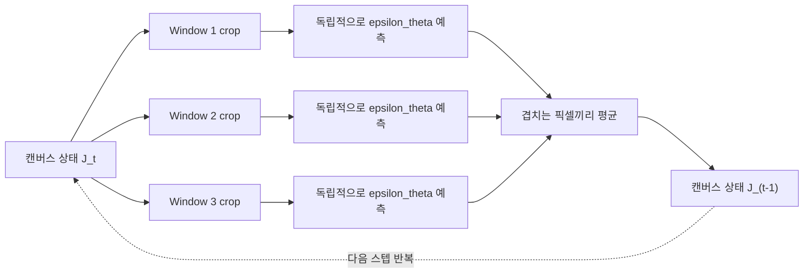
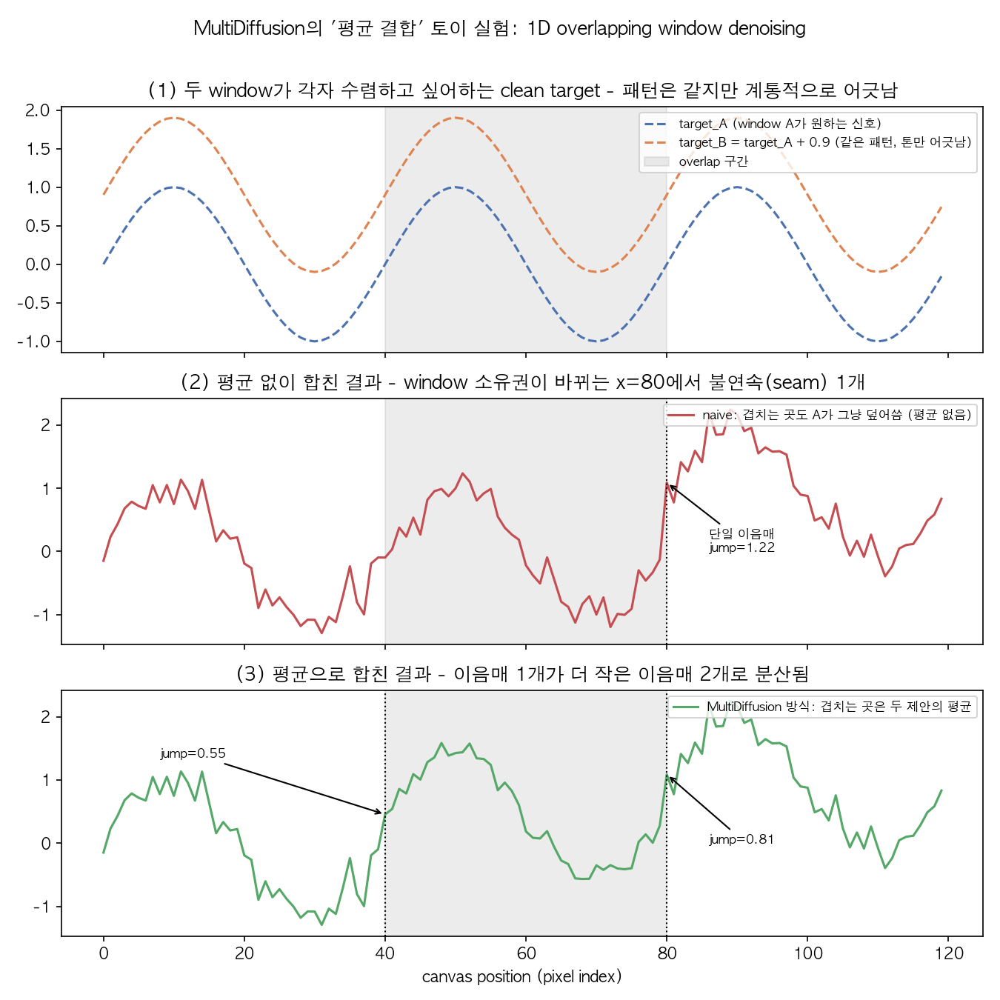

# 05. Diffusion Synchronization 연구 서베이 (Day 22-24)

이제 SyncSDE(06번 챕터)가 "왜?"라고 반문하는 대상이 되는 선행 연구들을 시간순으로 읽는다. 공통 주제: **하나의 diffusion model로는 만들 수 없는 크거나 복잡한 결과물을, 여러 개의 diffusion trajectory를 동시에 돌리면서 서로 정보를 교환하게 만들어서 만든다.**

## 선수 확인

- 02번 챕터: score/noise 예측, reverse process
- 04번 챕터 섹션 2: "여러 score를 선형결합한다"는 트릭 (classifier guidance, CFG)

## 1. 문제 설정: 왜 "여러 diffusion을 합쳐야" 하는가

하나의 diffusion model은 보통 고정된 해상도(예: 512x512)의 이미지 하나를 생성하도록 학습된다. 그런데 다음과 같은 요구가 생기면 문제가 생긴다:

- 512x512보다 훨씬 넓은 파노라마 이미지를 만들고 싶다 (학습 때 본 적 없는 종횡비)
- 이미지의 왼쪽 절반은 "숲", 오른쪽 절반은 "바다"처럼 서로 다른 프롬프트를 영역별로 반영하고 싶다
- 3D 메시의 표면을 여러 카메라 시점에서 각각 2D로 렌더링해 diffusion을 적용했는데, 시점마다 따로 생성하면 이음매가 어긋난다 (예: 앞에서 본 텍스처와 옆에서 본 텍스처가 안 맞음)

공통점: **여러 개의 이미지(또는 이미지 조각, 여러 시점)를 동시에 생성해야 하는데, 서로 무관하게 생성하면 안 되고 일관성(consistency)이 있어야 한다.**

이 챕터는 이 문제에 대한 서로 다른 시대/서로 다른 답을 시간순으로 훑는다: **MultiDiffusion(2023.02) -> SyncDiffusion(2023.06) -> TexFusion(2023.10)**. 이 순서 자체가 스토리라인이다 - 뒤에 나온 논문일수록 앞선 논문의 결합 방식이 어디서 부족했는지에 대한 대답이다. DreamFusion은 이 셋과는 "결이 다른 사촌"으로 중간에 곁들여 짚는다.

## 2. MultiDiffusion (Bar-Tal et al., *MultiDiffusion: Fusing Diffusion Paths for Controlled Image Generation*, ICML 2023, arXiv:2302.08113) - 이 라인의 시작점

### 2.1 아이디어: Overlapping Window + 평균

파노라마를 만들고 싶다면:

1. 최종 넓은 캔버스를 여러 개의 겹치는(overlapping) 정사각형 window로 나눈다 (사전학습된 diffusion model이 처리 가능한 크기로)
2. 매 diffusion 스텝마다, **각 window마다 독립적으로** 노이즈 예측(`epsilon_theta`)을 계산한다
3. 겹치는 영역의 픽셀은 여러 window에서 각각 다른 예측값을 받게 되는데, 이 값들을 **단순 평균**내서 하나의 값으로 합친다
4. 합쳐진 결과로 전체 캔버스를 한 스텝 업데이트하고, 다음 스텝을 반복한다

구조를 그림으로 그리면 (숫자는 예시 - 사전학습 모델이 처리하는 window 크기를 512, window 사이 간격(stride)을 384로 뒀을 때):

```
캔버스 (예: 폭 1280짜리 파노라마, pixel 좌표)

Window 1:  [   0 ─────────────── 512)
Window 2:            [ 384 ─────────────── 896)
Window 3:                       [ 768 ─────────────── 1280)
                      └──┬──┘             └──┬──┘
                    겹침 128px          겹침 128px
                  (W1, W2 둘 다 예측)  (W2, W3 둘 다 예측)

매 diffusion 스텝:
  1) 각 window가 "자기 crop만 보고" 독립적으로 epsilon_theta 예측
  2) 겹치는 128px 구간은 두 window의 예측을 평균
  3) 평균 결과로 캔버스 전체를 한 스텝 업데이트
  4) 다음 스텝 반복 (T -> T-1 -> ... -> 0)
```

각 window는 서로의 존재를 전혀 모른 채(자기 crop만 보고) 매 스텝 독립적으로 노이즈를 예측한다는 게 핵심이다 - "합침(fusion)"은 오직 겹치는 영역의 평균이라는 딱 한 단계에서만 일어난다. 한 스텝 안에서 실제로 일어나는 순서를 흐름도로 그리면:



각 window는 왼쪽 화살표(crop, 예측)까지는 완전히 독립적이고, 오직 "겹치는 픽셀끼리 평균" 단계에서만 서로의 정보가 섞인다.

### 2.2 왜 평균이 (그럭저럭) 말이 되는가 - 실제 수식

> 아래 수식은 arXiv HTML판(논문 3장)에서 가져온 것이다. 아래첨자 등 세세한 표기가 조판 원본과 100% 동일하다고 보장하기는 어렵지만(HTML 자동 추출 결과이므로), **목적함수의 구조와 "닫힌 해가 가중평균"이라는 결론(Proposition 1)은 논문 본문과 일치함을 확인했다.**

논문의 표기를 따라가면:

```
Phi : 사전학습된 reference diffusion model (하나의 window 크기에서 동작)
      Phi(I_t | y) = 노이즈 낀 이미지 I_t를 조건 y로 한 스텝 denoise한 결과

J_t : 전체 캔버스(파노라마)의 t 시점 상태
Psi(J_t | z) = 캔버스 전체를 한 스텝 진행시키는, 우리가 새로 정의하려는 process

F_i : J -> I,  i번째 window를 캔버스에서 잘라내는 매핑 (crop)
      I_t^i = F_i(J_t),   y_i = 조건 z 중 i번째 window에 해당하는 부분
```

각 window i는 "나는 이렇게 바뀌고 싶다"고 요구한다: `F_i(J) ≈ Phi(I_t^i | y_i)`. 이 n개의 요구를 동시에 최대한 만족시키는 캔버스 J를 찾는 문제를, 논문은 아래와 같은 **최소제곱(least-squares) 목적함수**로 정식화한다:

```
Psi(J_t | z) = argmin_J  sum_i  || W_i (.) [F_i(J) - Phi(I_t^i | y_i)] ||^2

  (W_i : window i의 픽셀별 가중치 마스크, (.) : element-wise 곱)
```

F_i가 "그냥 픽셀을 그대로 골라내는" 연산(direct pixel sampling)일 때, 위 목적함수는 각 픽셀에 대해 완전히 독립적으로 분리되는 이차식이 된다. 즉 캔버스의 한 픽셀 값 v에 대해 `sum_i w_i * (v - target_i)^2` 형태의 1변수 이차함수를 최소화하는 문제가 되고, 미분해서 0으로 두면 바로 **가중평균**이 답으로 나온다 (논문 Proposition 1). 정리된 닫힌 해는:

```
Psi(J_t | z) = sum_i  [ F_i^{-1}(W_i) / sum_j F_i^{-1}(W_j) ]  (.)  F_i^{-1}( Phi(I_t^i | y_i) )
```

말로 풀면: **"겹치는 각 픽셀의 다음 값 = 그 픽셀을 포함하는 모든 window가 내놓은 denoising 결과를, 가중치로 정규화해서 평균낸 것"**. 모든 W_i를 동일한 값(예: 전부 1)으로 두면 이게 정확히 2.1절에서 말한 "단순 평균"이 된다.

즉 "평균"은 그냥 편의상 고른 방식이 아니라 **"L2 거리로 잰 불일치를 최소화한다"는 특정 목적함수를 선택했을 때 나오는 유일한 최적해**다. 여기까지는 엄밀하다.

### 2.3 한계 (SyncSDE가 정확히 지적하는 지점)

문제는 "왜 하필 L2 거리이고, 왜 하필 모든 window에 동일한 가중치 `W_i`를 줘야 하는가"에는 원리적인 답이 없다는 것이다. 이건 **모든 태스크에 대해 하나로 고정된 특별한 선택**이다. 논문 스스로도 이게 유일하게 옳은 결합 방식이라는 보장은 하지 않는다 - 실제로는 태스크에 따라 (예: 이음매를 좀 더 부드럽게 하려면, 혹은 특정 영역의 정체성을 더 강하게 유지하려면) 다른 손실 함수나 다른 가중치가 더 나을 수 있다.

### 2.4 실습: 평균 결합을 직접 눈으로 보기 (토이 실험)

02번 챕터의 DDPM을 그대로 쓰는 대신, "여러 개의 독립적인 denoising 과정을 겹치는 구간에서 평균낸다"는 MultiDiffusion의 핵심 아이디어만 뽑아 1차원 신호로 극단적으로 단순화한 toy 실험을 직접 구현하고 실행했다.

**설정** (`assets/05-multidiffusion-toy-average-vs-naive.png`를 만든 스크립트 기준):

- 길이 120짜리 1D 캔버스, window A = `[0, 80)`, window B = `[40, 120)`, 겹치는 구간 = `[40, 80)`
- 각 window는 "자기가 수렴하고 싶어하는" clean target을 갖는다. 둘 다 같은 sine 패턴이지만, 서로 조율 없이 독립적으로 샘플링됐다는 것을 표현하기 위해 window B의 target에 상수 offset(+0.9)을 더했다 - 실제 MultiDiffusion 논문에서도 보고되는 "패널마다 색감/밝기가 미묘하게 어긋나는" 현상을 극단적으로 단순화한 것.
- reverse diffusion을 흉내낸 업데이트: 매 스텝 `x <- x*(1 - step_size) + target*step_size + sigma_t * noise` (sigma_t는 스텝이 진행될수록 선형으로 0에 가까워짐 - "점점 노이즈가 걷히는" 스케줄)
- 두 조건을 비교: **(a) naive** - 겹치는 구간도 그냥 window A의 예측이 덮어씀 (합치지 않음), **(b) average** - 겹치는 구간은 두 window 예측의 평균 (MultiDiffusion 방식)

**결과** (직접 실행, 시드 고정):

- naive 방식: window의 "소유권"이 A에서 B로 바뀌는 경계(x=80)에서 큰 이음매(seam)가 한 번에 발생 - 이번 실행에서 점프 크기 약 **1.22**
- average 방식: 같은 크기의 불일치가 겹치는 구간의 양 끝(x=40, x=80) **두 곳으로 분산**되어, 각각 약 **0.55**, **0.81** 크기의 더 작은 점프로 나뉨



이 실험이 보여주는 것은 정확히 2.2절 수식이 말하는 내용이다 - 평균은 이음매를 "완전히 없애지" 않는다(위 실험에서도 여전히 자잘한 요철이 남아있다). 다만 **한 곳에 집중된 큰 불연속을 여러 개의 작은 불연속으로 분산시켜서 덜 눈에 띄게 만드는 것**이다. 이게 정확히 2.3절에서 말한 한계와 연결된다 - 평균은 불일치를 "완화"할 뿐 "해소"하지 않으며, 왜 이 완화 방식(균등 평균)이 최선인지는 여전히 근거가 없다.

## 3. SyncDiffusion (Lee et al., *SyncDiffusion: Coherent Montage via Synchronized Joint Diffusions*, NeurIPS 2023, arXiv:2306.05178)

MultiDiffusion의 "단순 평균" 방식은 각 window가 그 안에서는 자연스러운 이미지를 만들지만, **window 사이의 스타일/구조 일관성**까지 보장하지는 않는다 (예: 파노라마의 왼쪽은 낮 풍경, 오른쪽은 밤 풍경처럼 어긋날 수 있음). 2.4절 토이 실험에서 "평균이 불일치를 분산시킬 뿐 없애지는 못한다"고 확인한 것과 같은 맥락의 문제다.

### 3.1 MultiDiffusion 단계는 그대로 재사용

SyncDiffusion 논문은 각 window(논문에서는 "view"라고 부른다)의 상태를 `x_t^{(i)}`, 캔버스 좌표로 되돌리는 연산을 `T_{i->z}`, window의 마스크를 `m^{(i)}`라고 표기한다. MultiDiffusion에 해당하는 평균 단계는 논문 (13)식 그대로:

```
z_t = ( sum_i T_{i->z}(x_t^{(i)}) ) / ( sum_i m^{(i)} )
```

(2.2절의 `F_i^{-1}(...)` 가중평균과 본질적으로 같은 연산이다 - 캔버스 좌표계로 되돌려서 평균.)

### 3.2 여기에 더해지는 gradient 항 (실제 수식)

먼저 diffusion model의 노이즈 예측 `epsilon_theta`로부터 "지금 이 노이즈 낀 상태가 최종적으로 어떤 깨끗한 이미지로 수렴할 것 같은지"를 한 번에 추정하는 posterior mean 예측값(x0-예측, 논문 (11)식)을 `phi_theta`로 쓴다:

```
phi_theta(x_t, t) = (1 / sqrt(alpha_t)) * ( x_t - sqrt(1 - alpha_t) * epsilon_theta(x_t, t) )
```

전체 N개 window 중 하나(보통 파노라마의 중앙 window)를 **anchor**(index 0)로 고정하고, 나머지 각 window i에 대해 anchor와의 지각적 유사도 손실(perceptual loss - LPIPS 또는 style loss)을 정의한 뒤, 이 손실을 줄이는 방향으로 window i의 현재 상태를 gradient descent 한 스텝 이동시킨다 (논문 (15)식, Algorithm 1):

```
x_hat_t^{(i)} = x_t^{(i)} - w * grad_{x_t^{(i)}} L( D(phi_theta(x_t^{(i)}, t)), D(phi_theta(x_t^{(0)}, t)) )

  (D: latent decoder, w: step size, L: perceptual similarity loss, i = 1, ..., N-1)
  (anchor 자신 x_t^{(0)}은 이동시키지 않는다)
```

한 스텝 안에서 실제로 실행되는 순서는 (논문 Algorithm 1을 그대로 옮기면):

```
1) SyncDiffusion: 각 window x_t^{(i)}를 anchor 쪽으로 perceptual gradient만큼 이동  -> x_hat_t^{(i)}
2) 표준 diffusion 샘플러로 한 스텝 denoise                                        -> x_tilde_{t-1}^{(i)}
3) MultiDiffusion: 겹치는 영역을 평균내서 캔버스에 합침                            -> x_{t-1}^{(i)}
```

**"평균을 낸다" + "스타일이 비슷해지도록 gradient를 하나 더 추가한다"**는 두 가지 결합 방식이 순서대로 적용되는 것 - 평균이 사라진 게 아니라, 평균 *이전에* anchor와의 격차를 미리 줄여두는 보정 단계가 하나 더 끼어든 것이다.

## 4. DreamFusion과 Score Distillation Sampling(SDS) - 다른 종류의 "score 재활용"

`05-generative-models-beyond-the-course.md` 섹션 4에서 이미 다뤘지만(Poole et al., *DreamFusion: Text-to-3D using 2D Diffusion*, ICLR 2023, arXiv:2209.14988), 이 챕터의 맥락에서 짧게만 다시 짚는다.

핵심 gradient는 (원 논문 식 3, 널리 인용되는 표준형):

```
grad_theta L_SDS  ~=  E_{t, eps} [ w(t) * ( epsilon_theta(x_t; y, t) - eps ) * dx/dtheta ]

  (theta: NeRF 파라미터, x = g(theta): NeRF를 랜덤 시점에서 렌더링한 2D 이미지,
   x_t = 렌더링 결과에 노이즈를 씌운 것, w(t): 시점 t에 따른 가중치)
```

- MultiDiffusion/SyncDiffusion은 "여러 개의 2D diffusion trajectory를 서로 동기화"하는 문제였다면, DreamFusion(SDS)은 "하나의 2D diffusion model의 score를, diffusion trajectory가 아닌 전혀 다른 대상(NeRF 파라미터 theta)을 최적화하는 gradient 신호로 재활용"하는 문제다.
- 즉 "여러 trajectory를 어떻게 합칠까"와는 결이 다르지만, **"diffusion model이 만들어내는 score/gradient를 원래 목적(이미지 생성) 밖에서 어떻게 활용할 것인가"**라는 더 큰 질문의 사촌 관계에 있다. SyncSDE의 확률론적 프레임워크가 이런 "score 재활용" 계열 방법들 전반에 시사점을 줄 수 있는지 06번 챕터를 읽으며 생각해볼 것.

## 5. TexFusion (Cao et al., *TexFusion: Synthesizing 3D Textures with Text-Guided Image Diffusion Models*, ICCV 2023, arXiv:2310.13772) - 3D 메시 텍스처링, 그리고 "평균을 거부한" 사례

3D 메시의 표면을 여러 카메라 시점에서 렌더링한 뒤, 각 시점마다 2D diffusion을 적용해서 텍스처를 생성하고, 그 결과를 다시 3D 텍스처 공간(UV space)으로 투영(project)해서 합친다는 **문제 구조**는 MultiDiffusion과 똑같다 - "겹치는 window"가 여기서는 "겹치는 카메라 시점"으로 바뀐 것뿐이다.

**그런데 논문을 실제로 확인해보면, 이 라인의 다른 두 논문과 달리 오히려 "평균을 명시적으로 피한다".** 논문은 Concurrent Work 절에서 MultiDiffusion을 직접 언급하며 "여러 이미지 crop의 denoising 예측을 합친다는 알고리즘적 구조가 TexFusion의 여러 시점 합성과 밀접하게 관련된다"고 인정하면서도, 정작 자기 방법인 **Sequential Interlaced Multiview Sampler(SIMS)**는 평균을 쓰지 않는다.

논문이 직접 드는 이유: **diffusion 초기(t가 커서 노이즈가 지배적인 구간)에 여러 시점의 latent 예측을 평균 내면, interpolation/mipmapping 과정에서 픽셀의 분산(variance)이 왜곡되어 결과물이 모델이 학습한 노이즈 분포를 벗어나 버린다**는 것이다 - 즉 평균이 오히려 흐릿함(blur)과 품질 저하의 원인이 된다고 논문 스스로 보고한다. 그래서 SIMS는 매 diffusion 스텝마다:

1. 카메라들을 순차적으로(sequentially) 하나씩 방문하며 공유 latent texture map을 갱신한다 (평균이 아니라 "이전 카메라가 갱신한 값 위에 다음 카메라가 이어서 갱신").
2. 여러 카메라가 겹치는 texel에 대해서는 단순 평균 대신, **screen-space Jacobian의 크기로 측정한 "얼마나 정면에서 가까이 봤는가"라는 화질 지표가 가장 높은 카메라의 예측값**을 채택한다 (quality 기반 선택).

즉 기존 초안에 있던 "TexFusion 등 = 평균/투영 기반"이라는 서술은 부정확했다 - **TexFusion은 오히려 "평균이 실패하는 구체적 사례를 논문 스스로 보고하고, 평균을 대체하는 quality 기반 순차 합성 규칙을 제안한 사례"**로 이해하는 게 정확하다.

### 왜 이게 SyncSDE 스토리에서 더 중요한 사례인가

TexFusion의 존재는 이 라인의 문제의식을 한 단계 더 강하게 만든다: "평균이 그럭저럭 통하는 태스크(파노라마)도 있지만, 평균 자체가 명백히 실패하는 태스크(3D 텍스처, 특히 초기 노이즈 단계)도 있다"는 것을 실증적으로 보여주기 때문이다. 그런데 TexFusion이 내놓은 해법(순차적, quality 기반 선택)도 "왜 이 규칙이 맞는가"에 대한 확률론적 근거는 없다 - 여전히 도메인에 특화된 휴리스틱이다. SyncSDE가 채우려는 빈칸이 정확히 여기다.

## 6. 정리 - 이 서베이가 SyncSDE로 이어지는 지점

| 논문 | 결합 방식 | 결정 근거 |
|---|---|---|
| **MultiDiffusion** (ICML 2023) | 겹치는 영역을 **단순(균등) 평균** | 각 window의 L2 목적함수 합을 최소화하는 최적화 문제의 닫힌 해 (Proposition 1) - 그러나 "L2 손실 + 균등 가중치"라는 선택 자체를 정당화할 원리적 근거는 없음 |
| **SyncDiffusion** (NeurIPS 2023) | 평균(MultiDiffusion 그대로) + **anchor window와의 perceptual-similarity gradient**를 평균 이전에 매 스텝 추가 | 평균만으로는 window 간 전역 스타일 일관성이 보장되지 않는다는 **관찰된 실패 사례**에 대한 경험적 보완 (원리적 유도 없음) |
| **TexFusion** (ICCV 2023) | **평균을 명시적으로 회피** - 카메라를 순차적으로 방문하며, 겹치는 texel은 "가장 정면에서 본" 카메라의 예측을 채택 | 평균이 diffusion 초기(노이즈 지배 구간)에 분산을 왜곡시켜 학습 분포를 벗어난다는 것을 논문이 직접 관찰 -> 3D 렌더링 기하에 특화된 대체 휴리스틱으로 대응 |

**공통적으로, "왜 이 결합 방식이 맞는가"에 대한 통일된 이론적 근거가 없다.** 그리고 세 논문의 답이 서로 다르다는 사실(단순 평균 / 평균+사후 보정 / 평균 자체를 회피) 자체가 그 증거다 - 같은 문제 구조에서 출발했는데도, "겹치는 정보를 어떻게 합칠 것인가"에 대한 답이 매번 새로운 휴리스틱이었다는 뜻이다. SyncSDE는 이 표의 "결정 근거" 칸을 확률론(joint distribution 위에서 여러 diffusion 변수 사이의 correlation을 모델링하는 것)으로 통일해서 채우려는 시도라고 이해하면 06번 챕터가 훨씬 쉽게 읽힌다.

## 실습 과제 (Day 22-24)

1. **Day 22**: MultiDiffusion 논문을 정독하며 "목적함수 합 최소화 -> 평균"이 유도되는 부분(Method 섹션, Proposition 1)을 손으로 따라가기. (이 챕터의 2.2절이 그 결과를 정리해둔 것이니, 직접 arXiv HTML/PDF의 원문 조판과 대조해볼 것 - 자동 추출한 수식이라 표기가 약간 다를 수 있다.)
2. **Day 23 (완료)**: 02번 챕터 수준의 실제 DDPM 대신, "겹치는 두 신호를 독립적으로 denoise하면서 평균으로 합친다"는 아이디어만 뽑아낸 1D toy 실험을 직접 구현하고 실행했다 - 2.4절 참고. 평균 방식이 하나의 큰 이음매를 두 개의 작은 이음매로 "분산"시킨다는 걸 수치와 그래프로 확인함.
3. **Day 24**: SyncDiffusion 논문을 읽고, 위 toy 구현에 "anchor와의 유사도를 줄이는 gradient 항"(3.2절 수식)을 추가해서 결합 방식이 바뀌었을 때 이음매/일관성이 어떻게 달라지는지 비교해볼 것 (이 챕터에서는 다루지 않았으니 직접 확장해보는 걸 권장한다).

## 참고 자료

- Bar-Tal, Yariv, Lipman, Dekel, *MultiDiffusion: Fusing Diffusion Paths for Controlled Image Generation* (ICML 2023, [arXiv:2302.08113](https://arxiv.org/abs/2302.08113))
- Lee et al., *SyncDiffusion: Coherent Montage via Synchronized Joint Diffusions* (NeurIPS 2023, [arXiv:2306.05178](https://arxiv.org/abs/2306.05178))
- Poole, Jain, Barron, Mildenhall, *DreamFusion: Text-to-3D using 2D Diffusion* (ICLR 2023, [arXiv:2209.14988](https://arxiv.org/abs/2209.14988)) - `05-generative-models-beyond-the-course.md` 섹션 4와 함께 참고
- Cao et al., *TexFusion: Synthesizing 3D Textures with Text-Guided Image Diffusion Models* (ICCV 2023, [arXiv:2310.13772](https://arxiv.org/abs/2310.13772))
