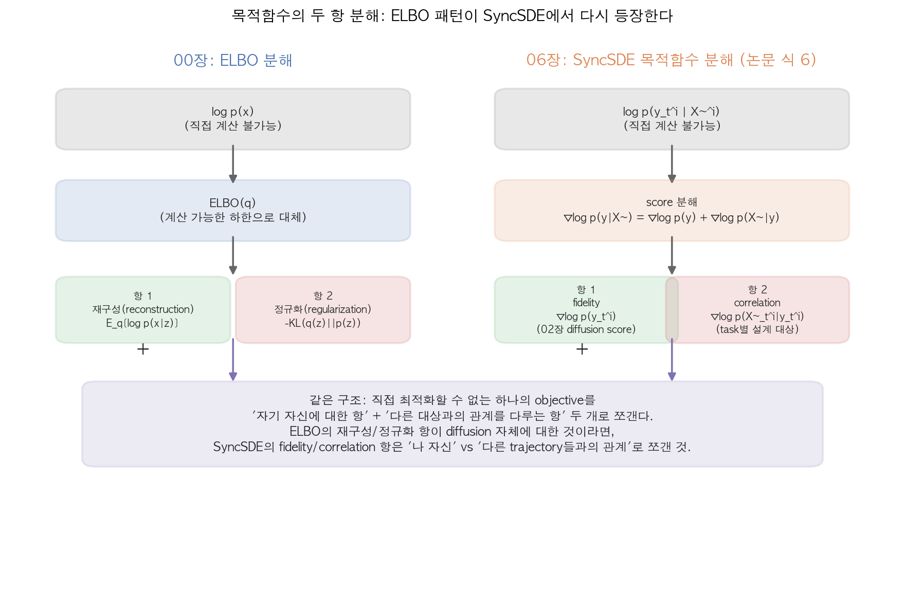
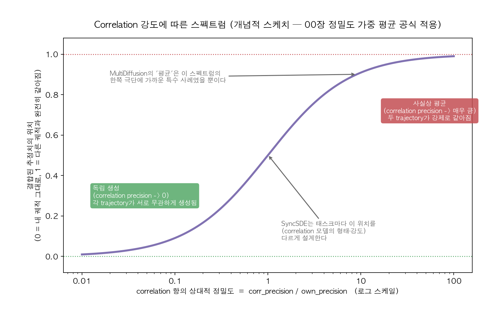
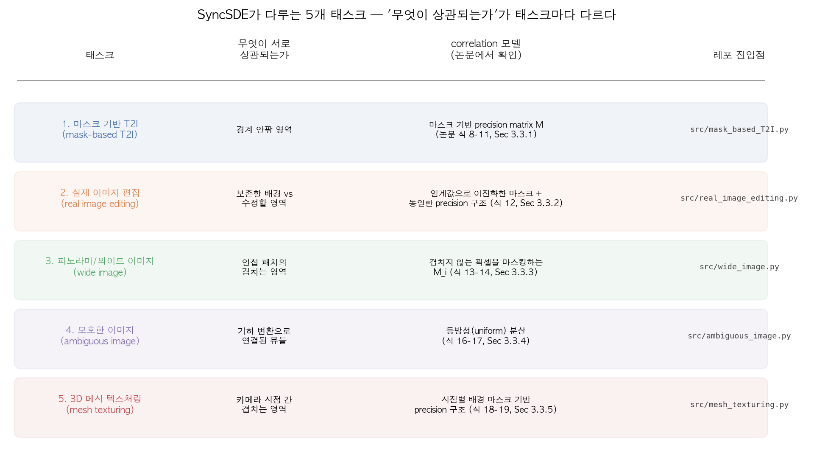

# 06. SyncSDE 논문 완전 정독 (Day 25-26)

이 커리큘럼 전체의 최종 목표였던 논문. Hyunjun Lee, Hyunsoo Lee, Sookwan Han, *SyncSDE: A Probabilistic Framework for Diffusion Synchronization* (CVPR 2025, arXiv:2503.21555). 코드: `github.com/hjl1013/SyncSDE`.

이 챕터를 시작하기 전에 00, 02, 05번 챕터를 반드시 끝내둘 것 - 특히 00번 챕터의 "가우시안 곱 = 정밀도 가중 평균", "ELBO = 두 항 분해" 두 가지와, 02번 챕터의 DDIM/score 표기법, 05번 챕터의 "기존 방법들은 왜 원리적 근거가 없는가"를 기억하고 있어야 이 챕터가 새로운 내용이 아니라 지금까지 배운 것의 재조립이라는 걸 느낄 수 있다.

> **이 챕터의 사실관계 확인 범위 (먼저 읽어둘 것)**: 이 챕터의 식 (1)~(19) 번호와 형태, Section 번호(3.1~3.3, 4.2)는 arXiv HTML 버전(`arxiv.org/html/2503.21555`)과 GitHub 저장소(`github.com/hjl1013/SyncSDE`)를 실제로 조회해서 얻은 내용이다. 다만 논문 수식은 PDF를 직접 읽은 게 아니라 웹 조회 도구로 발췌·재구성한 것이라, **아주 미세한 아래첨자/부호까지 100% 축자 일치를 보장하지는 못한다** - 큰 구조와 항의 의미는 두 번 이상 교차 확인했지만, 정말 정확한 수식이 필요하면 반드시 PDF 원문의 해당 절을 직접 대조할 것. 반대로 "무엇이 확인된 사실이고 무엇이 이 노트 저자가 추론/유도한 것인지"는 각 절에서 명시적으로 구분해뒀다.

## Abstract (원문)

> There have been many attempts to leverage multiple diffusion models for collaborative generation, extending beyond the original domain. A prominent approach involves synchronizing multiple diffusion trajectories by mixing the estimated scores to artificially correlate the generation processes. However, existing methods rely on naive heuristics, such as averaging, without considering task specificity. These approaches do not clarify why such methods work and often produce suboptimal results when a heuristic suitable for one task is blindly applied to others. In this paper, we present a probabilistic framework for analyzing why diffusion synchronization works and reveal where heuristics should be focused; modeling correlations between multiple trajectories and adapting them to each specific task. We further identify optimal correlation models per task, achieving better results than previous approaches that apply a single heuristic across all tasks without justification.

(CVPR 2025 accepted, 최초 제출 2025-03-27 / 최종 개정 2025-06-03, CC BY 4.0. 프로젝트 페이지 `hjl1013.github.io/SyncSDE`.)

## 1. 문제의식 재확인 (05번 챕터 요약)

MultiDiffusion류의 방법들은 여러 diffusion trajectory의 score를 "평균"이라는 단일 휴리스틱으로 섞는다. 이 논문은 정확히 그 지점을 파고든다: **"평균이 왜 맞는지 아무도 설명하지 않았고, 그래서 평균이 안 맞는 태스크에서는 결과가 나쁘다."**

## 2. 문제를 확률론 언어로 재정의 - 여기가 핵심 전환점

기존 접근: "score `epsilon_1`, `epsilon_2`, ...를 어떤 공식으로 섞을까?" (공학적 질문)

SyncSDE의 재정의: 여러 diffusion trajectory `x^(1)_t, x^(2)_t, ...`를 **독립이 아니라 서로 상관된(correlated) 확률변수들**로 보고, 이들의 **joint 분포** `p(x^(1)_t, x^(2)_t, ...)`를 정의하는 문제로 바꾼다. (통계적 질문)

이 재정의가 왜 강력한가: "score를 어떻게 섞을까"라는 질문에는 무한히 많은 답이 있을 수 있어서 뭐가 맞는지 판단할 기준이 없다. 반면 "이 여러 trajectory들이 서로 얼마나/어떻게 상관되어 있다고 가정할까"라는 질문은, 00번 챕터에서 배운 **가우시안의 조건부/결합 분포 공식**을 그대로 적용해서 "정답이 뭔지 유도해낼 수 있는" 형태의 질문이 된다.

## 3. 목적함수의 두 항 분해 (논문 확인: Section 3.1-3.2, 식 (1)~(7))

### 3.1 Preliminaries에서 다시 보는 익숙한 얼굴들 (식 1-5)

논문 Section 3.1은 표준 DDIM/SDE 정식화를 정리하는 절이다. 이미 02번 챕터에서 본 것과 같은 내용이라 이름만 새로 익히면 된다.

- 식 (1): DDIM의 `q_sigma(x_{t-1}|x_t,x_0)` 분포 정의
- 식 (2): `x_hat_0(x_t,t) = (x_t - sqrt(1-alpha_t)*epsilon_theta(x_t,t)) / sqrt(alpha_t)` - noise predictor로부터 깨끗한 이미지 추정치를 복원하는 식 (02번 챕터의 그 식)
- 식 (3): 표준 DDIM 업데이트 `x_{t-1} = sqrt(alpha_{t-1}/alpha_t)*x_t + (1-alpha_t)*gamma_t*grad_{x_t} log p(x_t)` (여기 `gamma_t`는 스텝별 계수)
- 식 (4): forward SDE `dx = f(x,t)dt + g(t)dw`
- 식 (5): reverse SDE `dx = [f(x,t) - g(t)^2 * grad_x log p_t(x)] dt + g(t) dw_bar`

지금까지는 그냥 02번/03번 챕터 표기법 복습이다. **논문이 새로 하는 일은 여기서부터다.**

### 3.2 새로운 정의: 여러 trajectory는 서로 조건부인 확률변수다 (식 6-7)

논문은 `i`번째 trajectory `y_t^i`를 정의하면서, 이전까지 생성된 다른 trajectory들의 값 전체를 하나의 조건 변수로 묶는다:

```
X~^i := union_{j=1}^{i-1} { y_t^j }_{t=1}^{T}     (Section 3.1.3 표기법)
```

즉 `X~^i`는 "나(trajectory i)보다 먼저 만들어진 다른 trajectory들의 전체 경로"다. 그리고 이 조건부 확률의 score를 Bayes 법칙으로 그대로 쪼갠 것이 **논문의 (6)식**이다:

```
grad_{y_t^i} log p(y_t^i | X~^i)  =  grad_{y_t^i} log p(y_t^i)   +   grad_{y_t^i} log p(X~_t^i | y_t^i)
                                     ^^^^^^^^^^^^^^^^^^^^^^^^^^       ^^^^^^^^^^^^^^^^^^^^^^^^^^^^^^^^^^
                                     항 1: fidelity                  항 2: correlation
                                     (사전 확률의 score,             (다른 trajectory들과
                                      = 원래 pretrained diffusion    얼마나/어떻게 닮아야
                                      모델이 그대로 뱉는 score)      하는지 - 태스크별 설계 대상)
```

그리고 이 score 분해를 실제 샘플링 업데이트 식에 대입한 것이 **(7)식**이다:

```
y_{t-1}^i = sqrt(alpha_{t-1}/alpha_t) * y_t^i
            - sqrt(1-alpha_t) * gamma_t * epsilon_theta(y_t^i, t)      <- 표준 DDIM 업데이트 (항 1)
            + (1-alpha_t) * gamma_t * grad_{y_t^i} log p(X~_t^i | y_t^i)   <- 새로 추가된 correlation 보정 (항 2)
```

**여기서부터가 이 챕터의 "아하" 포인트다.** (6)식은 사실 다음처럼 읽을 수 있다:

```
"복잡해서 직접 모델링할 수 없는 조건부 score"
   =  "이미 갖고 있는 것 (pretrained diffusion score, 항 1)"
   +  "새로 설계해야 하는 것 (correlation score, 항 2)"
```

00번 챕터 2.3절의 ELBO 분해(`ELBO = 재구성 항 + 정규화 항`)와 **패턴이 똑같다** - "직접 다루기 어려운 하나의 목적함수를, 계산 가능한 항 두 개(자기 자신에 대한 항 + 다른 것과의 관계를 다루는 항)로 쪼갠다"는 구조. 다만 정확히 하려면 한 가지는 구분해야 한다: **ELBO는 Jensen's inequality로 만든 부등식(하한)**이고, **SyncSDE의 (6)식은 조건부확률의 chain rule(Bayes 법칙)을 score(로그밀도의 그래디언트) 공간에 그대로 적용한 등식(항등식)**이다. 즉 유도 방식은 다르지만 - "하나의 어려운 quantity를 자기자신 항 + 관계 항으로 쪼갠다"는 **설계 사상**은 정확히 같다. 이 등식은 오히려 classifier guidance의 `grad log p(x|y) = grad log p(x) + grad log p(y|x)` 분해(04번 챕터에서 다룰 그 패턴)와 형태가 더 가깝다는 점도 같이 기억해두면 좋다.



## 4. Correlation 모델 = task마다 다른 Gaussian 정밀도 구조 (논문 확인: Section 3.3, 식 8-19)

### 4.1 공통 뼈대: correlation 항을 Gaussian으로 모델링한다

논문은 (6)식의 항 2, `p(X~_t^i | y_t^i)`를 태스크마다 다른 형태의 **Gaussian**으로 정의한다. 확인된 여러 태스크의 식을 보면 공통적으로 다음 꼴이다:

```
p(X~_t^i | y_t^i) ~ N( y_t^i,  lambda * (1 - alpha_t) * M_i^{-1} )
```

- `M_i`: 태스크마다 다르게 설계하는 **precision matrix**(공분산의 역수) - 이게 논문이 "여기가 휴리스틱을 넣을 지점"이라고 말하는 바로 그 자리다.
- `lambda`: correlation 강도를 조절하는 스칼라 하이퍼파라미터 (레포 코드의 `inv_lambda` 인자가 이 역할)

태스크별로 확인된 식:

- **마스크 기반 T2I** (Section 3.3.1, 식 8-11): `M`이 마스크 기반 대각(diagonal) precision matrix. 배경/전경에 서로 다른 분산을 할당한다 - 배경은 원래 값을 강하게 보존해야 하니 분산을 작게(정밀도를 크게), 전경은 새로운 오브젝트를 자유롭게 형성해야 하니 분산을 크게(정밀도를 작게) 준다.
- **실제 이미지 편집** (Section 3.3.2, 식 12): 소프트 마스크 `B~`를 임계값 `tau`로 이진화해서 `B[h,w] = indicator(B~[h,w] >= tau)`를 만든 뒤, 마스크 기반 T2I와 동일한 precision-matrix Gaussian 구조를 재사용 - "보존할 배경"과 "수정할 영역"을 가르는 문제라서 구조가 그대로 넘어온다.
- **파노라마/와이드 이미지** (Section 3.3.3, 식 13-14): `p(X~_t^i|y_t^i) ~ N(y_t^i, lambda(1-alpha_t) M_i^{-1})`에서 `M_i`가 **인접 패치와 겹치지 않는 픽셀을 마스킹**한다 - 즉 겹치는 영역에서만 correlation을 강하게 걸고, 겹치지 않는 영역은 완전히 독립적으로 놔둔다.
- **모호한(ambiguous) 이미지** (Section 3.3.4, 식 16-17): `p(X~_t^i|y_t^i) ~ N(y_t^i, lambda(1-alpha_t) I)` - 공간적 마스킹 없이 **등방성(isotropic) 분산**을 쓴다. 대신 correlation은 회전/반전/기울임 같은 **기하 변환**으로 연결된 다른 뷰를 통해 걸린다 (자세한 변환 정의 식은 15번으로 추정되나, 이번 조사에서 직접 확인하지 못했다 - 정확한 형태는 원문 확인 필요).
- **3D 메시 텍스처링** (Section 3.3.5, 식 18-19): 다른 태스크들과 비슷한 마스크 기반 precision 구조를, "카메라 시점별 배경 마스크"에 적용한 형태.

### 4.2 00장 정밀도 가중 평균으로 correlation 항 뜯어보기 (이 챕터 저자의 유도 - 논문이 이 형태로 명시하는지는 별도 확인 필요)

`p(X~|y) ~ N(y, sigma^2)` 라는 Gaussian의 로그를 `y`에 대해 미분하면:

```
grad_y log N(X~; y, sigma^2)  =  (X~ - y) / sigma^2  =  M * (X~ - y)      (M = 1/sigma^2, precision)
```

이게 바로 (7)식의 correlation 보정항이다. 즉 **correlation 항의 정체는 "내 값을 다른 trajectory의 값 쪽으로, precision(M)만큼의 세기로 끌어당기는 힘"**이다 - 00번 챕터 1.3절에서 본 "두 가우시안을 곱하면 정밀도 가중 평균이 나온다"는 그 메커니즘이 여기서 그대로 재사용된 것. `M`(=마스크, 즉 precision)이 0에 가까우면 끌어당기는 힘이 없어서 사실상 독립 생성이 되고, `M`이 커지면 두 trajectory가 강하게 같아지도록 밀어붙여서 결과적으로 "평균을 낸 것"과 비슷해진다. **"평균"이라는 기존 휴리스틱은 이 스펙트럼의 한쪽 극단(매우 큰 precision, 혹은 정확히 대칭적인 precision)에 해당하는 특수 사례였을 뿐**이라는 게 이 프레임워크가 드러내는 것이다.

(이 미분 유도 자체는 논문이 위 형태로 명시적으로 전개하는지 이번 조사에서 원문 절을 짚어 확인하지는 못했다 - 다만 6번 섹션에서 볼 실제 코드가 정확히 "내 값 - 다른 trajectory 값" 차이에 마스크/람다를 곱해 빼주는 연산을 하고 있어서, 이 해석이 코드 레벨에서는 뒷받침된다.)

아래 그림은 이 스펙트럼을 개념적으로 그린 것이다 (논문에 실린 그래프가 아니라 위 유도를 시각화한 것):



## 5. 적용 태스크와 정성적 결과 (논문 확인: Section 4.2)

논문은 아래 5개 태스크에 프레임워크를 적용하고, 각 태스크의 실험 섹션(Figure)에서 baseline과 비교한다.



- **마스크 기반 T2I** (Fig. 3, Section 4.2.1): "전경과 배경을 이음매 없이(seamlessly) 합성한 그럴듯한 이미지를 생성한다"고 보고 - 비교 대상인 SyncTweedies는 상대적으로 흐릿한(blurry) 결과를 낸다고 서술.
- **실제 이미지 편집** (Fig. 4, Section 4.2.2): text-driven 실제 이미지 편집에서 우수한 성능, 특히 배경 보존이 더 잘 된다고 서술.
- **파노라마/와이드 이미지** (Fig. 5, Section 4.2.3): baseline들이 이음새에서 불연속(discontinuity)을 보이는 것과 달리, "연속적인 형태의 더 고품질 wide image"를 만든다고 서술 - 05번 챕터에서 다룬 MultiDiffusion과 직접 비교되는 지점.
- **모호한(ambiguous) 이미지** (Fig. 6, Section 4.2.4): "두 프롬프트를 그럴듯하게 섞은(blending) 사실적인 이미지"를 생성하는 반면, 대안들은 "단순 평균처럼 보이는 흐릿한 이미지"를 낸다고 서술 - 이게 바로 "평균은 특수 사례일 뿐"이라는 4장 주장의 실험적 증거다.
- **3D 메시 텍스처링** (Fig. 7, Section 4.2.5): 더 높은 디테일 보존을 갖는 고품질 텍스처를 만든다고 서술 - TexFusion류와 비교되는 태스크.

(위 정성적 서술은 arXiv HTML을 조회해 얻은 요약이며, 실제 이미지 비교 결과 자체는 이 조사에서 직접 눈으로 보지 못했다 - Figure 원본은 PDF에서 직접 확인할 것.)

## 6. 코드 저장소 구조 (GitHub 확인: hjl1013/SyncSDE, main 브랜치)

### 6.1 실제 디렉터리 구조

```
SyncSDE/
├── src/                              # 태스크별 CLI 실행 스크립트 (argparse 진입점)
│   ├── mask_based_T2I.py
│   ├── real_image_editing.py
│   ├── inversion.py                  # 실제 이미지 편집 전, DDIM inversion 단계
│   ├── wide_image.py
│   ├── ambiguous_image.py
│   └── mesh_texturing.py
├── syncsde/
│   ├── pipelines/                    # 실제 diffusers Pipeline 서브클래스 - correlation 보정이 여기서 일어난다
│   │   ├── base_pipeline.py
│   │   ├── ddim_inv.py
│   │   ├── pipeline_mask_T2I.py
│   │   ├── pipeline_image_edit.py
│   │   ├── pipeline_wide_image.py
│   │   ├── pipeline_ambiguous_rotation_df.py   # df = DeepFloyd (아래 참고)
│   │   ├── pipeline_ambiguous_skew_df.py
│   │   ├── pipeline_ambiguous_ver_flip_df.py
│   │   └── pipeline_mesh_texturing.py
│   ├── synctweedies/                 # 비교 baseline (SyncTweedies) 구현
│   └── utils/
├── data/                              # 샘플 프롬프트/마스크/메시
├── requirements.txt
└── setup.py
```

`src/*.py`는 인자를 받아 대응하는 `syncsde/pipelines/pipeline_*.py`의 Pipeline 클래스를 호출하는 얇은 CLI일 뿐이고, **실제로 latent(사실상 score)를 섞는 연산은 각 `pipeline_*.py`의 denoising loop 안**에 있다.

**하나 바로잡을 점**: 이 챕터 초안에는 "DeepFloyd-IF(픽셀 기반) 기반"이라고만 적혀 있었는데, 실제로 확인해보니 그렇지 않다. `requirements.txt`와 각 `src/*.py`의 기본값을 보면:

- 마스크 T2I / 실제 이미지 편집 / 와이드 이미지 / 3D 텍스처링: `diffusers`의 latent diffusion 모델(`stabilityai/stable-diffusion-2-base`, latent 공간에서 동작)을 그대로 사용.
- **DeepFloyd-IF(픽셀 공간 diffusion)는 오직 모호한(ambiguous) 이미지 태스크에서만 사용**된다 (README의 "Ambiguous Image Generation" 섹션에서 명시). 이유를 추론해보면(이 챕터 저자의 추정) - 회전/반전/기울임 같은 기하 변환을 latent 공간에서 하면 VAE의 encode/decode 과정 때문에 변환 등변성(equivariance)이 깨지기 쉬운데, 픽셀 공간에서 바로 diffusion을 하는 DeepFloyd-IF를 쓰면 이 문제를 피할 수 있어서로 보인다. `pipeline_ambiguous_*_df.py` 세 파일의 `_df` 접미사가 DeepFloyd를 가리키는 것으로 보인다.
- 3D 메시 텍스처링에는 별도로 `pytorch3d`가 필요하다 (README에 conda 설치 커맨드 있음).

### 6.2 실제 코드: score(latent)를 섞는 지점

`syncsde/pipelines/pipeline_mask_T2I.py`의 denoising loop 마지막 부분을 그대로 가져오면 (실제 코드, 변수명도 그대로):

```python
gamma_t = (alpha_prev / alpha_cur).sqrt() - ((1.0 - alpha_prev) / (1.0 - alpha_cur)).sqrt()

latents[1:2] = latents[1:2] - gamma_t * (1.0 - mask[1:2]) * inv_lambda * (t.item() / T) * (old_latents[1:2] - old_latents[0:1])
latents[2:] = latents[2:] - gamma_t * ((1.0 - mask[1:2]) * inv_lambda * (t.item() / T) * (old_latents[2:] - old_latents[0:1]) + \
                                        mask[1:2] * inv_lambda * (t.item() / T) * (old_latents[2:] - old_latents[1:2]))
```

이 블록 바로 위에서 `latents = self.scheduler.step(noise_pred, t, latents, ...).prev_sample`로 **이미 표준 DDIM 업데이트((7)식의 첫 두 항)를 끝낸 뒤**, 이 블록이 **(7)식의 correlation 보정항을 구현**한다:

- `mask` = 4장에서 말한 precision matrix `M` 역할 (마스크 기반 T2I이므로 마스크 그 자체가 precision 구조)
- `inv_lambda` = `1/lambda`
- `(old_latents[...] - old_latents[...])` = 4.2절에서 유도한 `(X~ - y)` 차이항, 즉 "내 값 - 다른 trajectory 값"
- 부호가 `-`인 이유: correlation 항이 "차이를 줄이는 방향(다른 trajectory 쪽으로 끌어당기는 방향)"으로 latent를 보정하기 때문 - 00장의 "정밀도 가중 평균으로 서로 가까워진다"는 그림이 그대로 코드가 된 것.
- `(t.item() / T)`: 타임스텝에 비례해 correlation 세기를 스케줄링하는 항 (초반 timestep, 즉 노이즈가 많이 낀 시점일수록 강하게, 후반으로 갈수록 약하게 - 정확한 설계 의도는 원문 확인 필요).

`syncsde/pipelines/pipeline_wide_image.py`도 구조는 완전히 같고, `patch_mapping()` 메서드로 "인접 패치와 겹치는 영역"만 잘라내 비교한다는 점이 다르다 - 이게 4장에서 본 "`M_i`가 겹치지 않는 픽셀을 마스킹한다"(식 13-14)는 서술과 정확히 대응된다.

## 실습 과제 (Day 25-26)

1. **Day 25**: 논문 원문(arXiv:2503.21555) PDF를 정독하며, Section 3.2의 (6)~(7)식과 Section 3.3의 태스크별 (8)~(19)식을 손으로 옮겨 적고, 이 챕터 3장/4장에서 정리한 해석(특히 4.2절의 "correlation 항 = 정밀도 가중 평균의 재사용" 유도)이 원문과 실제로 맞는지 검증하기. 이 챕터가 확실하게 표시해둔 "확인 필요" 부분(식 15의 형태, 배경/전경 분산 대소 관계, `(t/T)` 스케줄링의 설계 의도)을 원문에서 찾아 채워보기.
2. **Day 26**: `github.com/hjl1013/SyncSDE` 저장소를 clone해서, `syncsde/pipelines/pipeline_mask_T2I.py`와 `pipeline_wide_image.py`의 denoising loop를 직접 디버거로 스텝 실행해보며, `mask`, `inv_lambda`, `old_latents` 값이 실제로 어떻게 correlation 보정을 만들어내는지 관찰하기. DeepFloyd-IF/pytorch3d 등 대형 모델 다운로드가 부담되면 마스크 T2I 태스크(Stable Diffusion 2 base, 상대적으로 가벼움)만 로컬에서 돌려봐도 충분하다.

## 참고 자료

- arXiv:2503.21555 (SyncSDE 원 논문, CVPR 2025) - Section 3.1(Preliminaries, 식 1-5), 3.2(Proposed framework, 식 6-7), 3.3(Applications, 식 8-19), 4.2(정성적 결과)
- 프로젝트 페이지: `hjl1013.github.io/SyncSDE`
- GitHub: `github.com/hjl1013/SyncSDE` - `syncsde/pipelines/` 안의 `pipeline_*.py` 파일들이 실제 correlation 보정 코드
- 05번 챕터에서 다룬 MultiDiffusion, SyncDiffusion 원 논문 (직접 비교 대상)
- 00번 챕터 1.3절(가우시안 곱=정밀도 가중 평균), 2.3절(ELBO 분해) - 이 챕터 3장/4장이 재사용하는 바로 그 공식들
