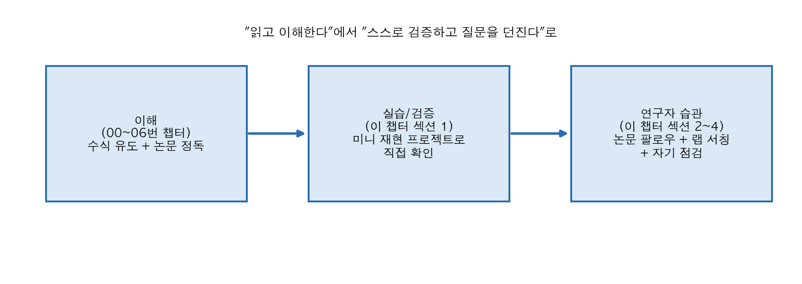
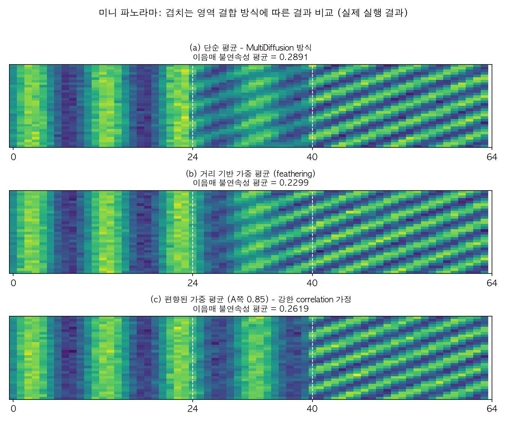

# 07. 연구자로 전환하기 (Day 27-30)

00~06번 챕터가 "읽고 이해하고 구현한다"였다면, 이 챕터는 "스스로 질문을 던지고 검증한다"로 넘어가는 단계다. 읽기만으로는 랩 지원에서 인상을 남기기 어렵다 - 작은 것이라도 직접 해본 것이 훨씬 설득력 있다.



이 챕터가 만드는 흐름은 위 그림처럼 세 단계다. 00~06번 챕터에서 쌓은 "이해"를, 섹션 1의 미니 재현 프로젝트로 "직접 검증"해보고, 그 경험을 바탕으로 섹션 2~4의 "연구자 습관"(논문 팔로우, 랩 서칭, 자기 점검)으로 이어간다. 아래 섹션 1은 이 세 단계 중 두 번째, "직접 검증"을 실제로 수행한 결과다.

## 선수 확인

- 00~06번 챕터를 최소한 한 번씩 훑었다 (완벽히 이해 못한 부분이 있어도 괜찮음)

## 1. 미니 재현/변형 프로젝트 (Day 27-29)

목표는 "논문 전체를 재현"하는 게 아니라, **작은 스케일에서 핵심 아이디어 하나를 검증**하는 것이다. 아래 중 하나를 골라서 진행 (05번 챕터 실습에서 이미 일부 구현해뒀다면 그걸 확장). 이 챕터에서는 옵션 A를 실제로 끝까지 구현하고 결과를 아래에 정리했다 - 옵션 B, C는 이어서 직접 해볼 수 있도록 방법만 구체화해뒀다.

### 옵션 A: Correlation 모델 바꿔보기 (SyncSDE 아이디어 직접 실험) - 실제로 구현함

05번 챕터 실습 과제 2, 3은 "02번 챕터에서 학습해둔 DDPM으로 28x56 미니 파노라마(MNIST 두 장 이어붙이기)를 MultiDiffusion 방식(단순 평균)으로 구현하고, SyncDiffusion 방식(유사도 gradient 추가)과 비교"하는 것이었다. 이 챕터에서는 학습된 DDPM 없이도 **결합 방식(correlation 모델)의 차이가 결과에 어떻게 나타나는지**를 관찰하는 것이 목적이므로, 진짜 DDPM 대신 아래처럼 단순화한 "diffusion-like" 과정을 numpy로 처음부터 만들어서 실험했다. 05번 챕터를 나중에 실제 DDPM으로 확장할 때 이 실험의 결합 로직(`combine_*` 함수들)을 그대로 재사용할 수 있다.

#### 1.1 실험 설계

- **캔버스**: 32(세로) x 64(가로) 크기의 1채널 "이미지"
- **윈도우 A**: 캔버스의 열(column) `[0, 40)`을 담당하는 trajectory. 목표(clean) 패턴은 세로 줄무늬(수직 sine, 주기 10)
- **윈도우 B**: 캔버스의 열 `[24, 64)`를 담당하는 trajectory. 목표 패턴은 대각선 무늬(주기 7인 sine을 `x+y`에 적용)
- **겹치는 영역**: 열 `[24, 40)`, 폭 16 - 두 trajectory가 서로 다른 목표를 가지고 있으므로, 이 영역에서 어떤 값을 최종적으로 채택하느냐가 곧 "correlation 모델을 어떻게 잡을 것인가"의 문제가 된다
- **단순화된 reverse process**: 실제 학습된 score 없이, 순수 가우시안 노이즈에서 시작해서 매 스텝 각자의 목표 쪽으로 `step_rate=0.12`만큼 선형 보간하고, 스텝이 진행될수록 크기가 줄어드는 가우시안 노이즈를 더하는 것으로 "노이즈가 점점 걷히면서 목표 이미지로 수렴하는" DDPM의 reverse process 직관만 재현했다. 총 40스텝
- 매 스텝, 겹치지 않는 영역은 각 윈도우의 제안값을 그대로 쓰고, 겹치는 영역만 아래 세 가지 결합 규칙 중 하나로 합쳐서 전역 캔버스에 반영한다 - 이게 MultiDiffusion/SyncSDE가 "score를 어떻게 섞을 것인가"라고 부르는 지점과 정확히 같은 위치다

세 가지 결합 규칙:

```
(a) 단순 평균 (MultiDiffusion 방식)
    combined = 0.5 * A + 0.5 * B

(b) 거리 기반 가중 평균 (feathering)
    겹침 구간 내 위치 i (0..15)에 대해 w = 1 - i/15
    combined_i = w * A_i + (1 - w) * B_i
    (A쪽 경계에 가까우면 A를 더 신뢰, B쪽 경계에 가까우면 B를 더 신뢰)

(c) 편향된 가중 평균 (강한 correlation 가정)
    combined = 0.85 * A + 0.15 * B   (윈도우 A의 trajectory를 훨씬 더 신뢰)
```

(a)는 05번 챕터에서 정리한 MultiDiffusion의 결합 방식 그대로다. (b)는 이미지 스티칭(image stitching)에서 흔히 쓰는 feathering을 흉내낸 것으로, "겹침 구간 안에서도 위치에 따라 상관관계의 강도가 달라진다"는 가정에 해당한다. (c)는 06번 챕터에서 배운 "correlation 항을 태스크에 맞게 설계한다"는 아이디어를 극단적으로 단순화한 것 - 예를 들어 윈도우 A 쪽 콘텐츠의 정체성을 강하게 유지해야 하는 태스크라면 이런 비대칭적 가중치가 자연스러울 수 있다는 걸 보여주는 용도다.

#### 1.2 실행 결과

실제로 실행한 스크립트는 `assets/07-generate-plots.py`이고, 실행 결과 이미지는 다음과 같다.



세 결과 모두 왼쪽은 세로 줄무늬(A), 오른쪽은 대각선 무늬(B)가 나타나지만, 겹치는 구간(흰 점선 사이)의 모양이 뚜렷하게 다르다.

- **(a) 단순 평균**: 겹침 구간에서 두 패턴이 그대로 절반씩 섞여서, 세로 줄무늬도 대각선 무늬도 아닌 흐릿하고 애매한 텍스처가 생긴다. 05번 챕터에서 지적한 "평균은 결과적으로 그럴듯해 보이지만, 어느 쪽 정체성도 제대로 살리지 못하는 절충안"이라는 한계가 이 작은 실험에서도 그대로 나타난다.
- **(b) 거리 기반 가중 평균**: 겹침 구간 안에서 A쪽 절반은 세로 줄무늬가, B쪽 절반은 대각선 무늬가 더 우세하게 보이면서 전환이 (a)보다 점진적이다.
- **(c) 편향된 가중 평균**: 겹침 구간 대부분에서 세로 줄무늬(A)가 우세하게 유지되다가 경계 바로 앞에서 갑자기 대각선 무늬(B)로 바뀐다 - "A의 trajectory를 훨씬 신뢰한다"는 강한 correlation 가정을 그대로 반영한 모양이다.

정량적으로도 차이를 확인하기 위해, 겹침 구간의 양쪽 경계에서 "경계를 사이에 둔 두 열(column)의 픽셀 값 차이의 평균 절댓값"을 이음매 불연속성(seam discontinuity) 지표로 계산했다 (값이 작을수록 이음매가 매끄럽다는 뜻).

| 결합 방식 | 왼쪽 경계 불연속성 | 오른쪽 경계 불연속성 | 평균 |
|---|---|---|---|
| (a) 단순 평균 | 0.3259 | 0.2523 | 0.2891 |
| (b) 거리 가중 평균 | 0.2025 | 0.2573 | **0.2299** |
| (c) 편향 평균 | 0.1935 | 0.3303 | 0.2619 |

(b) 거리 가중 평균이 평균 불연속성이 가장 낮아 전체적으로 가장 매끄러운 이음매를 만들었다. 다만 (c) 편향 평균은 A쪽 경계(0.1935)에서는 오히려 (b)보다도 매끄럽지만 B쪽 경계(0.3303)에서는 셋 중 가장 불연속적이다 - 한쪽을 강하게 신뢰하는 correlation 가정은 그 쪽 경계는 매끄럽게 만들지만 반대쪽 경계는 희생시킨다는 뜻이다. **이게 이 실험에서 가장 중요한 관찰이다**: "어떤 결합 방식이 무조건 더 낫다"가 아니라, **correlation 모델(결합 방식)을 어떻게 잡느냐에 따라 어디를 희생하고 어디를 살릴지가 결정된다** - 이게 정확히 06번 챕터에서 SyncSDE가 주장하는 "correlation은 태스크에 맞게 설계해야 하는 대상"이라는 논지를 손으로 확인한 것이다. 만약 태스크가 "왼쪽 절반의 정체성을 강하게 보존해야 한다"는 것이었다면 (c)가 더 나은 선택이 되고, "이음매 전체가 최대한 매끄러워야 한다"는 것이었다면 (b)가 더 나은 선택이 된다.

#### 1.3 이 실험이 검증하는 것 / 검증하지 못하는 것

- **검증한 것**: 겹치는 영역의 결합 방식(correlation 모델)을 바꾸면 결과가 실제로 달라지고, 그 차이가 "어느 쪽을 더 신뢰하는가"라는 명확한 원인으로 설명된다는 것. MultiDiffusion의 단순 평균이 유일한 정답이 아니라 여러 선택지 중 하나일 뿐이라는 05, 06번 챕터의 주장을 최소 스케일에서 손으로 재현했다.
- **검증하지 못한 것**: 실제 학습된 DDPM의 score를 쓰지 않았고, 목표 패턴으로의 선형 보간이라는 매우 단순화된 규칙으로 reverse process를 흉내냈을 뿐이다. 실제 이미지의 semantic한 내용(예: MNIST 숫자의 획)에 대해서도 같은 경향이 나타나는지는 05번 챕터의 실습 과제(실제 DDPM 기반 미니 파노라마)를 완료해야 확인할 수 있다.

### 옵션 B: DDIM vs DDPM 샘플링 품질/속도 정량 비교

04번 챕터에서 구현한 DDIM 샘플러로, 스텝 수(10, 20, 50, 100, 1000)에 따른 생성 품질을 정량적으로 비교 (FID 계산까지 하면 좋지만, 부담되면 육안 비교 + 생성 시간 측정만으로도 충분).

### 옵션 C: Guidance scale이 다양성에 미치는 영향 정량화

04번 챕터에서 CFG scale `w`를 바꿔가며 생성한 이미지들의 다양성(예: 여러 샘플 간 픽셀 분산, 또는 간단한 특징 추출 후 클러스터링)을 정량적으로 측정해서 "scale이 커질수록 다양성이 줄어든다"는 직관을 수치로 보여주기.

**공통 원칙**: 어떤 옵션을 고르든, (1) 무엇을 검증하려 했는지 (2) 어떤 실험을 했는지 (3) 결과가 뭐였는지 (4) 왜 그런 결과가 나왔다고 생각하는지를 짧은 문서로 정리해둘 것 - 이게 그대로 연구노트/포트폴리오가 된다. 위 1.1~1.3절이 옵션 A에 대해 이 네 가지를 실제로 정리한 예시다.

## 2. 논문 팔로우 습관 만들기 (계속 진행)

- **arXiv 훑기**: `arxiv.org/list/cs.CV/recent`, `arxiv.org/list/cs.GR/recent`를 주 1~2회 훑는 습관. 두 URL 모두 실제로 접속해 확인했고(2026년 9월 기준), 각각 cs.CV(Computer Vision and Pattern Recognition), cs.GR(Graphics) 카테고리의 "최근 제출된 논문" 목록을 정상적으로 보여준다. 제목/abstract만 보고 관심 분야(diffusion, 3D generation, multi-view consistency) 논문만 저장해두는 식으로.
- **Papers with Code (링크 상태 확인 필요)**: 예전에는 "Diffusion Models" 태그로 최근 논문과 코드가 같이 정리되어 있어서 재현 가능성 판단이 쉬웠다. 그런데 실제로 `paperswithcode.com`에 접속해보면 **`huggingface.co/papers/trending`으로 자동 리다이렉트**된다 - Papers with Code 서비스 자체가 Hugging Face 쪽으로 통합/이관된 상태다. 따라서 이 챕터를 읽는 시점에 태그 기반 브라우징이 예전과 똑같이 동작하지 않을 수 있으니, 대신 `huggingface.co/papers`(Hugging Face Daily Papers, 커뮤니티 업보트 기반으로 최신 논문을 큐레이션)를 사용하거나, arXiv 검색에 `diffusion synchronization`, `multi-view diffusion` 같은 키워드를 직접 넣어 훑는 습관으로 대체할 것.
- **커뮤니티**: 관심 연구자(예: Yang Song, Tero Karras, Robin Rombach, Ben Poole 등 이 커리큘럼에서 이름이 나온 저자들)를 X(Twitter)나 Google Scholar에서 팔로우해두면 새 논문이 나올 때 자연스럽게 노출됨.
- **Related Work 역추적법**: 관심 논문 하나를 읽을 때 그 논문의 Related Work 섹션이 사실상 그 분야의 계보 요약이다. 05번 챕터를 만들 때 썼던 방법을 앞으로도 계속 쓸 것 - 논문 하나 읽을 때마다 Related Work를 먼저 훑고 다음 읽을 논문을 정하기.

## 3. 랩 서칭 시 체크리스트

1. 관심 랩의 **최근 1~2년 논문**이 diffusion synchronization / text-to-3D / multi-view consistency / video diffusion 등 이 커리큘럼에서 다룬 라인과 얼마나 겹치는지 확인
2. 그 랩의 최근 논문 3~4편을 미리 정독 - 특히 각 논문의 "Limitation" 섹션을 읽으면 그 랩이 다음에 뭘 연구할지, 그리고 지원자가 뭘 준비해가면 좋을지 힌트를 얻을 수 있음
3. 랩이 공개한 코드(GitHub)가 있으면 최소 한 번은 clone해서 실행까지 해볼 것 - "코드까지 돌려봤다"는 건 인터뷰에서 꽤 차별화되는 포인트
4. 컨택 이메일/CV/포트폴리오를 준비할 때, 이 커리큘럼에서 진행한 미니 프로젝트(섹션 1)를 짧게라도 언급할 수 있으면 "그냥 강의만 들은 지원자"와 구분되는 근거가 됨

## 4. 이 시점에서 스스로 점검할 질문들

- DDPM의 loss가 왜 결국 단순한 MSE로 정리되는지, 신경망 세 가지 파라미터화(x_0, mu, epsilon)의 차이를 설명할 수 있는가? (02번 챕터)
- Score-based 모델과 DDPM이 왜 동치인지 수식으로 보일 수 있는가? (03번 챕터)
- CFG의 guidance scale이 커질수록 왜 다양성이 줄어드는지 직관적으로 설명할 수 있는가? (04번 챕터)
- MultiDiffusion의 "평균"이 왜 특정 가정 하의 특수 사례인지, SyncSDE가 이걸 어떻게 일반화하는지 자기 말로 설명할 수 있는가? (05, 06번 챕터)

이 네 가지에 막힘없이 답할 수 있으면, 이 커리큘럼의 목표(diffusion synchronization 연구 라인을 스스로 따라갈 수 있는 기초 체력)는 달성된 것이다. 스스로 답해본 뒤, 아래 부록의 모범 답안과 비교해볼 것 - 완전히 똑같을 필요는 없고, 논리적 골격이 비슷하면 충분하다.

## 부록: 점검 질문 모범 답안

**Q1. DDPM의 loss가 왜 결국 단순한 MSE로 정리되는지, 신경망 세 가지 파라미터화(x_0, mu, epsilon)의 차이를 설명할 수 있는가?**

DDPM은 잠재변수가 `x_1, ..., x_T`인 시간축으로 확장된 VAE이고, ELBO를 이 체인에 적용하면 loss가 매 타임스텝 `t`에서 진짜 posterior `q(x_{t-1}|x_t,x_0)`와 신경망이 예측한 `p_theta(x_{t-1}|x_t)` 사이의 KL divergence들의 합으로 분해된다. 두 가우시안 사이의 KL은 분산을 고정해두면 평균 차이의 제곱에 비례하는 형태로 정리되는데, 신경망이 예측하는 대상을 x_0, mu, epsilon 중 무엇으로 잡아도 서로 대수적으로 치환 가능한 동치 표현이다. 이 중 epsilon(노이즈) 예측 방식을 택하고 `x_t = sqrt(alpha_bar_t) x_0 + sqrt(1-alpha_bar_t) epsilon` 관계를 대입해서 가중치 상수들을 무시하면, 최종 loss가 `||epsilon - epsilon_theta(x_t,t)||^2`라는 단순 MSE로 정리된다. DDPM 저자들은 실험적으로 epsilon 예측이 스텝별 난이도가 고르고 학습이 가장 안정적이라는 걸 확인해서 이 방식을 채택했다.

**Q2. Score-based 모델과 DDPM이 왜 동치인지 수식으로 보일 수 있는가?**

Score function은 `s(x) = grad_x log p(x)`로 정의되고, denoising score matching을 쓰면 노이즈 낀 데이터 `x_tilde = x + sigma*epsilon`에 대한 조건부 score가 `grad log p_sigma(x_tilde|x) = -(x_tilde-x)/sigma^2 = -epsilon/sigma`라는 닫힌 형태로 유도된다. 즉 "노이즈 낀 데이터의 score를 맞추는 문제"가 정확히 "섞인 노이즈 epsilon을 맞추는 문제"로 환원되므로, DDPM의 노이즈 예측 신경망과 score 신경망은 `s_theta(x_t,t) = -epsilon_theta(x_t,t) / sqrt(1-alpha_bar_t)`라는 식으로 완전히 연결된다. 두 모델 계열은 서로 다른 시기에 독립적으로 제안됐지만, 결국 같은 대상(노이즈의 방향)을 score라는 언어와 노이즈 예측이라는 언어로 각각 다르게 표현한 것에 불과했다는 게 이 동치 관계가 보여주는 핵심이다.

**Q3. CFG의 guidance scale이 커질수록 왜 다양성이 줄어드는지 직관적으로 설명할 수 있는가?**

CFG는 `epsilon_guided = epsilon_theta(x_t,t,empty) + w * (epsilon_theta(x_t,t,y) - epsilon_theta(x_t,t,empty))`처럼 조건부 예측과 무조건부 예측의 차이 벡터를 `w`배만큼 외삽(extrapolate)해서 조건 `y` 방향으로 밀어붙이는 방식이다. `w`가 커질수록 매 스텝의 업데이트가 "조건 y에 가장 부합하는 좁은 영역" 쪽으로 점점 더 강하게 쏠리기 때문에, 서로 다른 초기 노이즈 `x_T`에서 출발한 샘플들이라도 결국 비슷한 지점으로 수렴하게 되어 샘플 간 다양성이 줄어든다. 즉 `w`는 "조건 충실도"와 "다양성" 사이의 트레이드오프를 조절하는 손잡이이고, 지나치게 키우면 다양성 감소를 넘어 과포화·비현실적인 이미지 같은 부작용도 함께 커진다.

**Q4. MultiDiffusion의 "평균"이 왜 특정 가정 하의 특수 사례인지, SyncSDE가 이걸 어떻게 일반화하는지 자기 말로 설명할 수 있는가?**

MultiDiffusion은 여러 window의 개별 목적함수 합을 최소화하는 최적화 문제로 정식화했을 때 그 최적해가 "겹치는 영역의 단순 평균"으로 유도된다고 보였는데, 이는 여러 trajectory가 서로 어떻게 상관되어 있는지에 대해 암묵적으로 하나의(대략 등방성 가우시안 형태의) correlation 가정을 고정해버린 특수 사례에 불과하다. SyncSDE는 이 문제를 "여러 trajectory가 독립이 아니라 상관된 확률변수"라는 joint 분포 추정 문제로 재정의하고, 목적함수를 각 trajectory 개별의 fidelity 항과 trajectory 간 correlation 항 두 개로 분해해서, 사람이 태스크에 맞게 설계해야 하는 지점을 correlation 항 하나로 좁힌다. 00번 챕터의 가우시안 곱(정밀도 가중 평균) 공식을 이 joint 분포에 적용하면, 두 trajectory가 완전히 독립이면 각자 따로 생성하는 것과 같아지고 완전히 같아야 한다고 강하게 가정하면 평균에 가까운 결과가 나오는 식으로, "평균"은 이 correlation 스펙트럼의 한쪽 극단에 있는 하나의 특수한 선택이었을 뿐임을 확률론적으로 드러낸다. 이 챕터 섹션 1.2의 실험에서 결합 방식(단순 평균 vs 거리 가중 평균 vs 편향 평균)에 따라 이음매의 매끄러움과 어느 쪽 정체성이 보존되는지가 달라졌던 것이, 바로 이 correlation 항을 다르게 설계한 결과에 해당한다.
